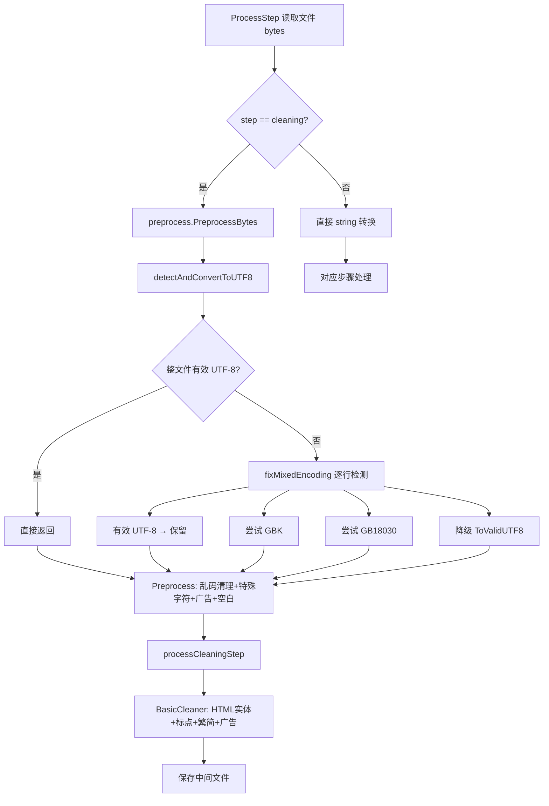

# 编码检测与乱码修复 — 接入主流水线设计方案

> 创建日期：2026-05-29
> 状态：📋 待确认

---

## 1. 背景与问题

### 1.1 现状

项目 `preprocess` 包（[`preprocess.go`](internal/processor/preprocess/preprocess.go)）已实现完整的编码检测和乱码修复功能，但**从未被主流水线调用**。

调用链分析：

```
ProcessStep (pipeline.go:107)
  → os.ReadFile(record.FilePath)           // 读取原始 []byte
  → string(content)                        // ❌ 直接强转，无编码检测
  → processCleaningStep(md5, content)      // content 已是 string
    → BasicCleaner.Clean(content)          // ❌ 未调用 preprocess 包
```

### 1.2 影响

- **GBK/GB18030 编码文件**：直接 `string()` 强转会导致中文全部乱码
- **混合编码文件**（同一文件中部分 UTF-8、部分 GBK）：无法处理
- **已损坏的 UTF-8 文件**（含替换字符 U+FFFD）：乱码不会被清理

### 1.3 混合编码能力评估

当前 [`detectAndConvertToUTF8()`](internal/processor/preprocess/preprocess.go:71) 的处理逻辑：

| 场景 | 处理方式 | 问题 |
|------|----------|------|
| 整个文件是有效 UTF-8 | 直接返回 | ✅ 正确 |
| 整个文件是 GBK | 尝试整文件 GBK→UTF-8 | ✅ 正确 |
| 文件含替换字符(0xEF 0xBF 0xBD) | 尝试整文件解码 → 降级到 `fixMixedEncoding` | ⚠️ 部分正确 |
| **混合编码**（部分行 UTF-8，部分行 GBK） | 整文件 GBK 解码会损坏 UTF-8 部分，最终返回原始乱码 | ❌ **失败** |

[`fixMixedEncoding()`](internal/processor/preprocess/preprocess.go:184) 按行检测，理论上能处理混合编码，但：
1. 只在整文件解码失败后才降级调用，混合编码文件可能不会触发
2. 只尝试 GBK，不尝试 GB18030

---

## 2. 修复方案

### 2.1 修改范围

| 文件 | 修改内容 |
|------|----------|
| [`pipeline.go`](internal/processor/pipeline.go) | `ProcessStep` 中 cleaning 步骤使用 `preprocess.PreprocessBytes` 做编码检测 |
| [`pipeline.go`](internal/processor/pipeline.go) | `processCleaningStep` 签名增加 preprocess 变更记录，合并到结果中 |
| [`preprocess.go`](internal/processor/preprocess/preprocess.go) | 改进 `detectAndConvertToUTF8` 直接走行级检测，增加 GB18030 支持 |
| [`preprocess_test.go`](internal/processor/preprocess/preprocess_test.go) | 新增测试用例覆盖混合编码场景 |

### 2.2 详细设计

#### 2.2.1 改进 `detectAndConvertToUTF8` — 混合编码支持

**现有逻辑**：
```
1. 含替换字符？→ 尝试整文件 GBK/GB18030 → 降级 fixMixedEncoding
2. 有效 UTF-8？→ 直接返回
3. 非有效 UTF-8？→ 尝试整文件 GBK/GB18030 → 返回原始
```

**改进后逻辑**：
```
1. 有效 UTF-8？→ 直接返回
2. 非有效 UTF-8？→ 直接走行级检测（fixMixedEncoding）
   - 每行：有效 UTF-8 → 保留
   - 每行：尝试 GBK → 尝试 GB18030 → 降级 ToValidUTF8
```

**关键变化**：
- 去掉"整文件 GBK 解码"的尝试（对混合编码有害无益）
- 直接走行级检测，适用于所有非纯 UTF-8 场景
- `fixMixedEncoding` 增加 GB18030 尝试

#### 2.2.2 改进 `fixMixedEncoding` — 增加 GB18030

```go
func fixMixedEncoding(content string) string {
    lines := strings.Split(content, "\n")
    fixedLines := make([]string, len(lines))

    for i, line := range lines {
        if utf8.ValidString(line) {
            fixedLines[i] = line
            continue
        }
        // 尝试 GBK
        if converted, err := gbkToUtf8(line); err == nil && utf8.ValidString(converted) {
            fixedLines[i] = converted
            continue
        }
        // 新增：尝试 GB18030
        if converted, err := gb18030ToUtf8(line); err == nil && utf8.ValidString(converted) {
            fixedLines[i] = converted
            continue
        }
        // 降级：移除无效字节
        fixedLines[i] = strings.ToValidUTF8(line, "")
    }
    return strings.Join(fixedLines, "\n")
}
```

新增 `gb18030ToUtf8` 辅助函数。

#### 2.2.3 接入主流水线 — `ProcessStep`

在 `ProcessStep` 的 cleaning 分支中，使用 `PreprocessBytes` 替代直接 `string()` 强转：

```go
// 改进前
case StepCleaning:
    result, err = processCleaningStep(fileMd5, string(content), rulesConfig, record)

// 改进后
case StepCleaning:
    preprocessResult, pErr := preprocess.PreprocessBytes(content)
    if pErr != nil {
        return nil, fmt.Errorf("预处理编码检测失败: %w", pErr)
    }
    result, err = processCleaningStep(fileMd5, preprocessResult, rulesConfig, record)
```

#### 2.2.4 修改 `processCleaningStep` — 合并预处理变更

函数签名变更，接收 `PreprocessResult` 并合并编码修复和乱码清理的变更记录：

```go
// 改进前
func processCleaningStep(fileMd5, content string, rulesConfig RulesConfig, _ *database.FileRecord) (*PipelineResult, error)

// 改进后
func processCleaningStep(fileMd5 string, preprocessResult preprocess.PreprocessResult, rulesConfig RulesConfig, _ *database.FileRecord) (*PipelineResult, error)
```

在函数内部：
1. 使用 `preprocessResult.Content` 作为输入（已修复编码）
2. 将 `preprocessResult.Changes`（编码修复 + 乱码清理）合并到 `BasicCleaner` 的变更记录中
3. 日志输出编码检测信息

#### 2.2.5 其他步骤无需修改

- `StepIndexing`、`StepLlmFix`、`StepReview`、`StepFinalizing` 读取的已经是 cleaning 步骤输出的 UTF-8 中间文件
- 不需要对这些步骤做编码检测

### 2.3 处理流程对比



---

## 3. 混合编码处理能力

### 修复后的能力矩阵

| 场景 | 处理方式 | 结果 |
|------|----------|------|
| 纯 UTF-8 文件 | 直接通过 | ✅ 完美 |
| 纯 GBK 文件 | 逐行 GBK→UTF-8 | ✅ 完美 |
| 纯 GB18030 文件 | 逐行 GB18030→UTF-8 | ✅ 完美 |
| 混合编码（UTF-8 + GBK 行混合） | 逐行检测，各行独立转换 | ✅ 完美 |
| 混合编码（UTF-8 + GB18030 行混合） | 逐行检测，各行独立转换 | ✅ 完美 |
| 损坏的 UTF-8（含 U+FFFD 替换字符） | 乱码清理兜底 | ✅ 标记删除 |
| 单行内混合编码（GBK 和 UTF-8 字节交织） | 无法完美还原 | ⚠️ 降级处理 |

### 局限性说明

- **单行内混合编码**：如果同一行中编码不一致（极罕见），无法完美还原。降级为 `strings.ToValidUTF8` 移除无效字节
- **非 GBK/GB18030 编码**：当前只支持 UTF-8、GBK、GB18030。如需支持 Big5、Shift-JIS 等需额外扩展
- **编码检测无 BOM 依赖**：纯启发式检测，不依赖 BOM 标记

---

## 4. 测试计划

### 4.1 新增测试用例

| 用例 | 输入 | 预期输出 |
|------|------|----------|
| 纯 UTF-8 文件 | UTF-8 bytes | 原样返回 |
| 纯 GBK 文件 | GBK 编码中文 | 正确转为 UTF-8 |
| 混合编码文件（UTF-8 + GBK 行） | 部分行 UTF-8，部分行 GBK | 各行正确转为 UTF-8 |
| 含替换字符的文件 | 包含 U+FFFD | 标记删除乱码 |
| 锟斤拷等经典乱码 | 包含 `锟斤拷` 模式 | 标记删除 |
| 空文件 | 空 bytes | 返回空字符串 |
| 纯 ASCII 文件 | ASCII bytes | 原样返回（兼容 UTF-8） |

### 4.2 集成测试

- 用用户提供的 `F:\Ebook\Txt\于冒泡~恶搞暗黑破坏神.txt` 实际测试
- 验证 cleaning 步骤输出的中间文件为有效 UTF-8
- 验证后续步骤（indexing、llm_fix）正常读取

---

## 5. 风险与缓解

| 风险 | 概率 | 缓解措施 |
|------|------|----------|
| `PreprocessBytes` 中的 `Preprocess()` 与 `BasicCleaner` 功能重叠（广告移除、空白规范化） | 确定 | 重叠操作是幂等的，二次执行无副作用；后续可考虑去重 |
| 行级 GBK 转换误判（UTF-8 行的字节恰好也是合法 GBK） | 低 | 优先检查 UTF-8 有效性，只有非 UTF-8 行才尝试 GBK |
| 大文件逐行处理性能 | 低 | 纯字符串操作，O(n) 复杂度，无外部依赖 |
