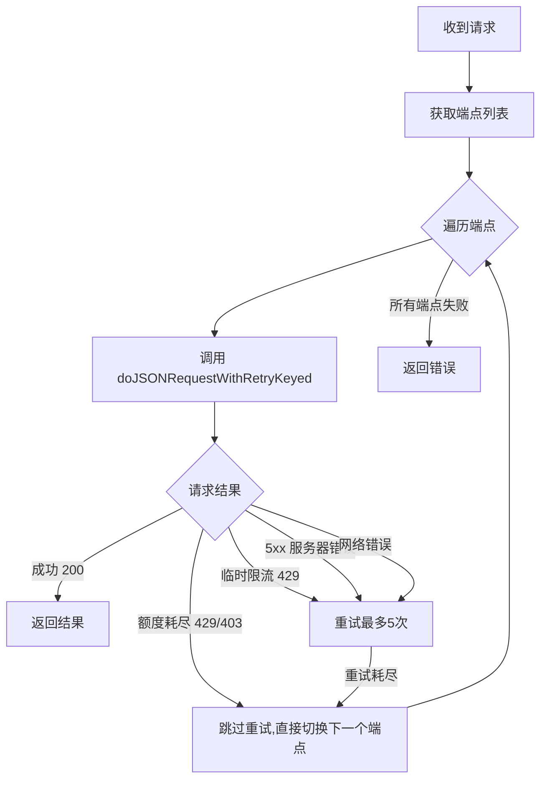

# 第一服务商多模型自动切换设计方案

## 背景与目标

### 现状
当前 `.env.template` 支持 3 个独立端点（端点 = URL + APIKey + 模型名），每个端点对应不同服务商。[`GenerateChatCompletion()`](internal/external/api.go:658) 已实现请求级端点切换 — 任何非 200 响应都会自动尝试下一个端点。

### 需求
- 第一服务商（共享 URL/APIKey）最多支持 **5 个模型名称**
- 请求级切换：模型 1 失败 → 模型 2 → … → 模型 5
- 切换条件：**429 限流** + **余额不足**等不可恢复错误
- 5 个模型都失败后，再切换到备用服务商（`LLM_API_URL_2`、`LLM_API_URL_3`）

### 切换优先级顺序
```
模型1 → 模型2 → 模型3 → 模型4 → 模型5 → 备用服务商2 → 备用服务商3
  ↑ 同一 URL/APIKey ↑                              ↑ 独立 URL/APIKey ↑
```

---

## 技术方案

### 1. 配置层变更

#### `.env.template` 修改

将 `COMPLETION_MODEL_NAME` 改为支持逗号分隔多个模型名：

```env
# 文本生成模型名称（默认: gpt-3.5-turbo-instruct）
# ⚠ 必须是 chat/completions 模型，不能是 embedding 模型
# 支持逗号分隔最多 5 个模型名，按顺序尝试：第一个限额用完后自动切换到下一个
# 示例: qwen-plus-2025-01-25,qwen-max-2025-01-25,qwen-turbo-2025-01-25
COMPLETION_MODEL_NAME=qwen-plus-2025-01-25
```

**向后兼容**：单个模型名（不含逗号）行为不变。

#### `internal/config/config.go` 修改

修改 [`buildModelEndpoints()`](internal/config/config.go:186) 函数：

```go
func buildModelEndpoints(cfg AppConfig) []ModelEndpoint {
    var endpoints []ModelEndpoint

    // 模型1~5：第一服务商（共享 URL/APIKey，模型名逗号分隔）
    if cfg.LLMApiURL != "" && cfg.LLMApiKey != "" {
        modelNames := parseModelNames(cfg.CompletionModelName) // 新增解析函数
        for _, name := range modelNames {
            endpoints = append(endpoints, ModelEndpoint{
                URL:       cfg.LLMApiURL,
                APIKey:    cfg.LLMApiKey,
                ModelName: name,
            })
        }
    }

    // 备用服务商2、3（保持不变）
    // ...
}

// parseModelNames 解析逗号分隔的模型名列表，最多返回5个
func parseModelNames(names string) []string {
    parts := strings.Split(names, ",")
    var result []string
    for _, p := range parts {
        trimmed := strings.TrimSpace(p)
        if trimmed != "" {
            result = append(result, trimmed)
        }
        if len(result) >= 5 {
            break
        }
    }
    if len(result) == 0 {
        result = []string{names} // 回退到原始值
    }
    return result
}
```

### 2. 错误检测层变更

#### `internal/external/api.go` — 新增额度耗尽检测

当前 [`doRequestWithRetry()`](internal/external/api.go:305) 对所有 429 一律重试 5 次。对于"额度耗尽"这种不可恢复的错误，重试是浪费时间。

新增辅助函数：

```go
// isQuotaExhausted 检测是否为额度耗尽类错误（不可恢复，应立即切换模型）
// 匹配条件：429/403 状态码 + 错误消息中包含额度相关关键词
func isQuotaExhausted(statusCode int, errorMessage string) bool {
    // 仅对特定状态码检测
    if statusCode != 429 && statusCode != 403 {
        return false
    }

    msg := strings.ToLower(errorMessage)
    quotaKeywords := []string{
        "insufficient_quota",
        "quota exceeded",
        "quota_exceeded",
        "exceeded_current_quota",
        "balance insufficient",
        "insufficient balance",
        "余额不足",
        "额度不足",
        "billing",
        "payment required",  // 402
    }
    for _, keyword := range quotaKeywords {
        if strings.Contains(msg, keyword) {
            return true
        }
    }
    return false
}
```

#### 修改 `doRequestWithRetry()` 中的重试逻辑

在 429 处理分支中，先检查是否为额度耗尽：

```go
case statusCode == 429: // 限流
    if isQuotaExhausted(statusCode, errorBody) {
        // 额度耗尽，不重试，立即返回让调用方切换模型
        lastErr = fmt.Errorf("额度耗尽 (状态码: %d): %s", statusCode, errorBody)
        return nil, lastErr
    }
    shouldRetry = true
    // ... 原有日志逻辑
```

同样，在 [`GenerateChatCompletion()`](internal/external/api.go:724) 中非 200 响应处理时，对额度耗尽错误可以跳过重试直接切换（但现有逻辑已经是 `continue` 到下一个端点，所以这部分不需要改）。

### 3. 切换流程（不变）

[`GenerateChatCompletion()`](internal/external/api.go:661) 的核心循环逻辑**无需修改**，它已经按端点列表顺序遍历：



---

## 文件变更清单

| 文件 | 变更类型 | 说明 |
|------|---------|------|
| [`.env.template`](.env.template) | 修改 | `COMPLETION_MODEL_NAME` 注释更新，说明逗号分隔支持 |
| [`internal/config/config.go`](internal/config/config.go) | 修改 | 新增 `parseModelNames()`；修改 `buildModelEndpoints()` |
| [`internal/external/api.go`](internal/external/api.go) | 修改 | 新增 `isQuotaExhausted()`；修改 `doRequestWithRetry()` 429 分支 |

---

## 接口定义

### 配置示例

```env
# 第一服务商：5 个模型自动切换
LLM_API_URL=https://dashscope.aliyuncs.com/compatible-mode/v1
LLM_API_KEY=sk-xxxxxxxx
COMPLETION_MODEL_NAME=qwen-plus-2025-01-25,qwen-max-2025-01-25,qwen-turbo-2025-01-25

# 备用服务商（第一服务商所有模型失败后使用）
LLM_API_URL_2=https://api.deepseek.com/v1
LLM_API_KEY_2=sk-xxxxxxxx
COMPLETION_MODEL_NAME_2=deepseek-chat
```

### 端点列表展开结果

```
端点1: {dashscope.aliyuncs.com, sk-xxx, qwen-plus-2025-01-25}
端点2: {dashscope.aliyuncs.com, sk-xxx, qwen-max-2025-01-25}
端点3: {dashscope.aliyuncs.com, sk-xxx, qwen-turbo-2025-01-25}
端点4: {api.deepseek.com,     sk-yyy, deepseek-chat}
```

---

## 风险与应对

| 风险 | 影响 | 应对 |
|------|------|------|
| 逗号分隔与模型名冲突 | 低 — 主流模型名不含逗号 | 文档中明确说明分隔符 |
| 额度耗尽关键词遗漏 | 中 — 某些 API 返回的错误消息不在检测列表中 | 默认回退到重试逻辑，不会误判（最多浪费几次重试时间） |
| 同一服务商 5 个模型用完后无备用 | 低 — 取决于用户配置 | 日志中清晰记录"所有端点失败" |
| 现有单模型用户升级后行为变化 | 无 — 向后兼容 | `parseModelNames` 对单个模型名返回长度为 1 的切片 |

---

## 测试要点

1. **单模型向后兼容**：`COMPLETION_MODEL_NAME=qwen-plus` → 端点列表仅 1 个第一服务商端点
2. **多模型展开**：`COMPLETION_MODEL_NAME=a,b,c` → 端点列表包含 3 个第一服务商端点（同 URL/APIKey）
3. **最多 5 个限制**：`COMPLETION_MODEL_NAME=a,b,c,d,e,f` → 仅取前 5 个
4. **额度耗尽快速切换**：模拟 429 + "insufficient_quota" → 不重试，直接切换下一个模型
5. **临时限流正常重试**：模拟 429 + 普通限流消息 → 正常重试后切换
6. **完整切换链**：模型1~5 全部失败 → 切换到备用服务商
