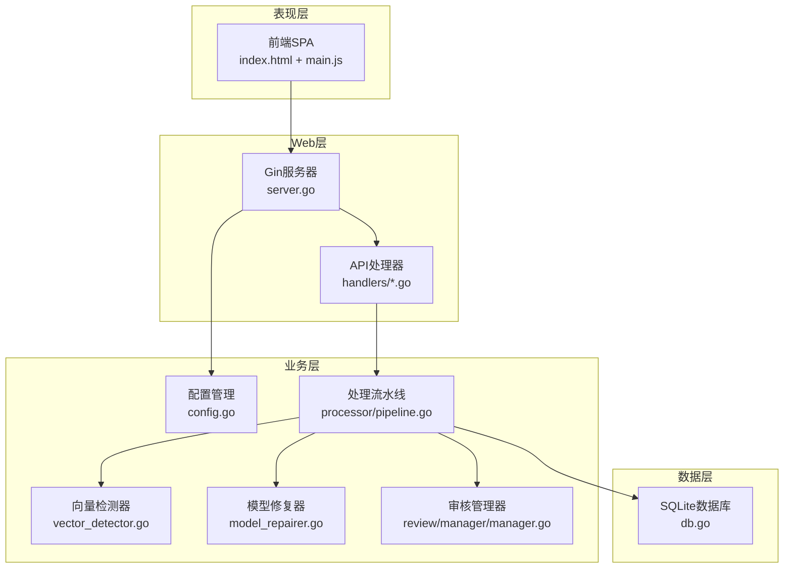

# 项目介绍

<cite>
**引用文件**
- [cmd/voidtext/main.go](../cmd/voidtext/main.go)
- [internal/config/config.go](../internal/config/config.go)
- [internal/processor/pipeline.go](../internal/processor/pipeline.go)
- [internal/processor/basic_cleaner.go](../internal/processor/basic_cleaner.go)
- [internal/processor/vector_detector.go](../internal/processor/vector_detector.go)
- [internal/processor/model_repairer.go](../internal/processor/model_repairer.go)
- [internal/review/manager/manager.go](../internal/review/manager/manager.go)
- [web/backend/server.go](../web/backend/server.go)
- [README.md](../README.md)
</cite>

## 目录
1. [简介](#简介)
2. [核心功能](#核心功能)
3. [技术架构](#技术架构)
4. [应用场景](#应用场景)

## 简介

VoidText 是一个面向中文小说TXT文本的智能化清洗与修复系统，基于 Go 语言开发，采用前后端分离架构。系统提供从文件上传、规则配置、自动化清洗、向量相似度检测、LLM智能修复、人工审核到版本管理的完整工作流，通过五步处理流水线实现高效、可控且可追溯的文本处理过程。

## 核心功能

### 文本处理流水线
采用五步处理流程：基础清洗 → 向量检测 → LLM修复 → 人工审核 → 生成文件。

- **基础清洗**：清理HTML实体、规范化标点、繁简转换、移除广告等
- **向量检测**：基于段落向量相似度检测重复内容，支持本地与外部API两种模式
- **LLM修复**：智能分块、Worker Pool并发、缓存幂等性、断点续传，支持API与本地字典双重修复路径
- **人工审核**：将AI建议转化为可审阅项，支持通过/拒绝/编辑/恢复/批量操作
- **版本管理**：以MD5为唯一标识，维护原始文件与中间版本的父子关系

### 技术特色
- **AI辅助修复**：集成外部LLM API与本地字典双重修复路径，具备缓存与重试机制
- **向量相似度检测**：支持本地特征与外部API嵌入向量，进行段落级相似度计算
- **自进化监控**：集成Evolver提示词优化系统，基于缓存命中率与API错误率自动优化提示词
- **断点续传**：支持处理中断后的进度恢复与继续执行

## 技术架构

**项目结构**
- `cmd/voidtext`：应用入口，负责配置加载、数据库初始化与HTTP服务器启动
- `internal/config`：配置管理与环境变量加载
- `internal/database`：SQLite数据库初始化与表结构管理
- `internal/processor`：文本处理流水线与算法实现
- `internal/review/manager`：人工审核状态管理
- `internal/external`：外部API调用封装
- `web/backend`：基于Gin的REST API服务
- `web/frontend`：静态前端页面与JavaScript交互

## 应用场景

- **个人书库整理**：自动化清洗收藏的小说文本
- **小说平台内容治理**：批量处理上传内容，提升质量
- **翻译与出版前校对**：预处理文本，减少后续工作量
- **电子书制作与发布**：规范化文本格式，提升阅读体验

**目标用户**：小说作者、书友会管理员、内容运营、出版社编辑、电子书制作者。
