# 数据流分析

<cite>
**本文档引用的文件**
- [main.go](../cmd/voidtext/main.go)
- [server.go](../web/backend/server.go)
- [files.go](../web/backend/handlers/files.go)
- [pipeline.go](../internal/processor/pipeline.go)
- [basic_cleaner.go](../internal/processor/basic_cleaner.go)
- [vector_detector.go](../internal/processor/vector_detector.go)
- [model_repairer.go](../internal/processor/model_repairer.go)
- [config.go](../internal/config/config.go)
- [file_repo.go](../internal/database/file_repo.go)
- [version_repo.go](../internal/database/version_repo.go)
- [parser.go](../internal/file/parser.go)
- [version.go](../internal/file/version.go)
- [manager.go](../internal/review/manager/manager.go)
</cite>

## 目录
1. [简介](#简介)
2. [项目结构](#项目结构)
3. [核心组件](#核心组件)
4. [架构总览](#架构总览)
5. [详细组件分析](#详细组件分析)
6. [依赖关系分析](#依赖关系分析)
7. [性能考虑](#性能考虑)
8. [故障排除指南](#故障排除指南)
9. [结论](#结论)

## 简介
本文件为 VoidText 系统的数据流分析文档，围绕“从文件上传到最终结果输出”的完整数据流程展开，详细说明：
- 原始文件、中间文件、版本文件的状态变化
- 数据在各处理阶段的转换过程
- 数据存储策略与文件组织结构
- 数据验证与质量控制机制
- 数据流图与状态转换图

## 项目结构
系统采用分层架构，主要模块包括：
- Web 层：HTTP 接口与静态资源
- 处理层：文本清洗、向量检测、LLM 修复、审核管理
- 存储层：SQLite 数据库与本地文件系统
- 配置层：环境变量与运行时配置

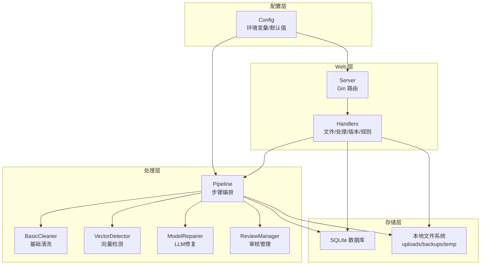

**图表来源**
- [server.go:10-57](../web/backend/server.go#L10-L57)
- [files.go:18-393](../web/backend/handlers/files.go#L18-L393)
- [pipeline.go:104-158](../internal/processor/pipeline.go#L104-L158)
- [config.go:48-122](../internal/config/config.go#L48-L122)

**章节来源**
- [main.go:18-61](../cmd/voidtext/main.go#L18-L61)
- [server.go:10-57](../web/backend/server.go#L10-L57)
- [config.go:48-122](../internal/config/config.go#L48-L122)

## 核心组件
- 文件上传与路由：接收 .txt 文件，进行 MD5 校验与去重判断，创建文件记录与版本记录，支持断点续传与恢复。
- 处理流水线：按 cleaning → indexing → llm_fix → review → finalizing 的顺序推进，每步产生中间文件并记录版本。
- 基础清洗：HTML 实体清理、标点规范化、空白字符处理、繁简转换、广告内容移除。
- 向量检测：段落级重复检测与移除，生成审核项。
- LLM 修复：智能分块、Worker Pool 并发、缓存幂等性、动态提示词、错误阈值监控。
- 审核管理：会话持久化、状态流转、批量审批/拒绝。
- 数据存储：文件系统（uploads/backups/temp）、SQLite（files/versions/processing_logs/review_items/chunk_cache）。
- 配置管理：环境变量加载、默认值、目录确保。

**章节来源**
- [files.go:18-198](../web/backend/handlers/files.go#L18-L198)
- [pipeline.go:19-94](../internal/processor/pipeline.go#L19-L94)
- [basic_cleaner.go:31-51](../internal/processor/basic_cleaner.go#L31-L51)
- [vector_detector.go:36-69](../internal/processor/vector_detector.go#L36-L69)
- [model_repairer.go:77-122](../internal/processor/model_repairer.go#L77-L122)
- [manager.go:56-89](../internal/review/manager/manager.go#L56-L89)
- [file_repo.go:28-47](../internal/database/file_repo.go#L28-L47)
- [version_repo.go:20-33](../internal/database/version_repo.go#L20-L33)
- [config.go:14-44](../internal/config/config.go#L14-L44)

## 架构总览
系统通过 Gin 提供 REST API，处理流程由 Pipeline 统一编排，结合数据库与文件系统实现数据持久化与版本追踪。

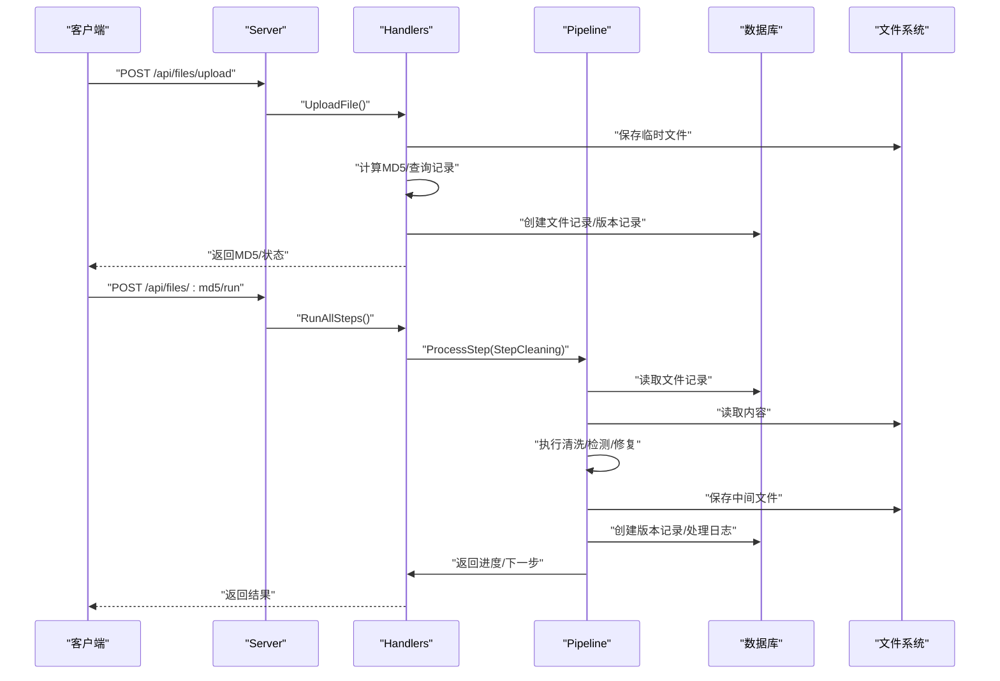

**图表来源**
- [server.go:28-54](../web/backend/server.go#L28-L54)
- [files.go:18-198](../web/backend/handlers/files.go#L18-L198)
- [pipeline.go:104-158](../internal/processor/pipeline.go#L104-L158)

## 详细组件分析

### 文件上传与状态管理
- 输入：.txt 文件（大小限制、扩展名校验）
- 处理：保存至 temp 目录，计算 MD5，查询是否存在历史记录或中间版本
- 输出：创建文件记录（状态 pending），创建版本记录（类型 original），返回 MD5
- 断点续传：若检测到中间版本，可继续从上次步骤处理

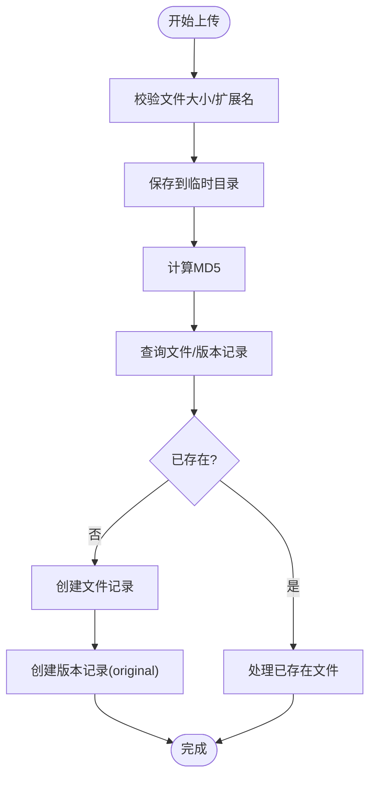

**图表来源**
- [files.go:18-71](../web/backend/handlers/files.go#L18-L71)
- [files.go:157-198](../web/backend/handlers/files.go#L157-L198)

**章节来源**
- [files.go:18-198](../web/backend/handlers/files.go#L18-L198)
- [file_repo.go:28-47](../internal/database/file_repo.go#L28-L47)
- [version_repo.go:20-33](../internal/database/version_repo.go#L20-L33)

### 处理流水线与步骤编排
- 步骤顺序：cleaning → indexing → llm_fix → review → finalizing
- 进度计算：每个步骤贡献 20%，结合步骤内进度
- 中间文件：每步保存为 uploads/{md5}_{step}.txt，并创建版本记录
- 审核项：向量检测与 LLM 修复产生的变更项写入 review_items 表

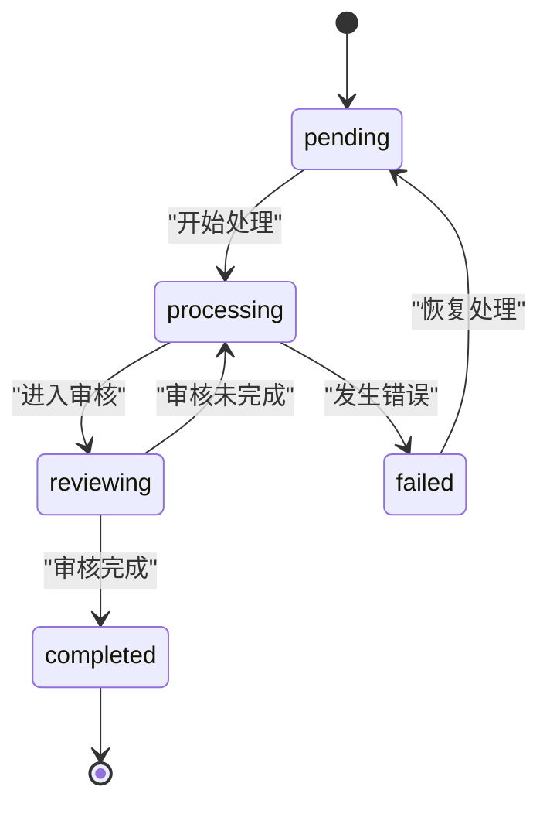

**图表来源**
- [pipeline.go:73-94](../internal/processor/pipeline.go#L73-L94)
- [pipeline.go:96-102](../internal/processor/pipeline.go#L96-L102)
- [file_repo.go:93-103](../internal/database/file_repo.go#L93-L103)

**章节来源**
- [pipeline.go:19-94](../internal/processor/pipeline.go#L19-L94)
- [pipeline.go:104-158](../internal/processor/pipeline.go#L104-L158)
- [file_repo.go:93-103](../internal/database/file_repo.go#L93-L103)

### 基础清洗（Basic Cleaner）
- 功能：HTML 实体清理、标点规范化、空白字符处理、繁简转换、广告内容移除
- 输出：清洗后内容与变更列表（含统计）

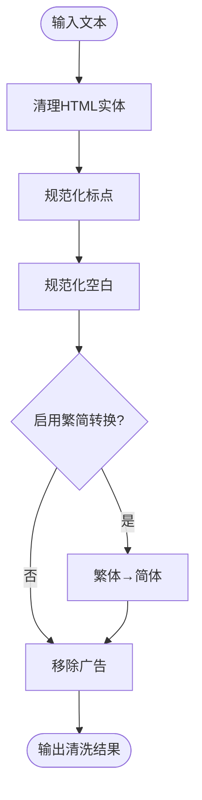

**图表来源**
- [basic_cleaner.go:31-51](../internal/processor/basic_cleaner.go#L31-L51)
- [basic_cleaner.go:53-78](../internal/processor/basic_cleaner.go#L53-L78)
- [basic_cleaner.go:80-125](../internal/processor/basic_cleaner.go#L80-L125)
- [basic_cleaner.go:159-190](../internal/processor/basic_cleaner.go#L159-L190)
- [basic_cleaner.go:192-232](../internal/processor/basic_cleaner.go#L192-L232)
- [basic_cleaner.go:234-270](../internal/processor/basic_cleaner.go#L234-L270)

**章节来源**
- [basic_cleaner.go:31-280](../internal/processor/basic_cleaner.go#L31-L280)

### 向量检测（Vector Detector）
- 功能：按段落分割，生成向量（简化实现），检测重复段落并移除
- 输出：检测后内容与变更列表，创建审核项

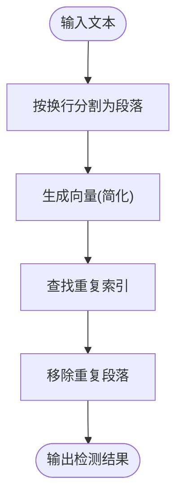

**图表来源**
- [vector_detector.go:36-69](../internal/processor/vector_detector.go#L36-L69)
- [vector_detector.go:71-86](../internal/processor/vector_detector.go#L71-L86)
- [vector_detector.go:88-111](../internal/processor/vector_detector.go#L88-L111)
- [vector_detector.go:113-130](../internal/processor/vector_detector.go#L113-L130)
- [vector_detector.go:145-175](../internal/processor/vector_detector.go#L145-L175)

**章节来源**
- [vector_detector.go:36-224](../internal/processor/vector_detector.go#L36-L224)

### LLM 修复（Model Repairer）
- 功能：智能分块（1500-2000字符）、Worker Pool 并发、缓存幂等性、动态提示词、错误阈值监控
- 输出：修复后内容、变更列表、统计信息（总块数、修改数、缓存命中/未命中）

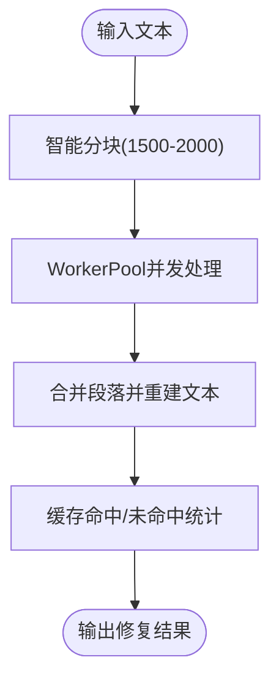

**图表来源**
- [model_repairer.go:77-122](../internal/processor/model_repairer.go#L77-L122)
- [model_repairer.go:124-211](../internal/processor/model_repairer.go#L124-L211)
- [model_repairer.go:547-563](../internal/processor/model_repairer.go#L547-L563)
- [model_repairer.go:575-672](../internal/processor/model_repairer.go#L575-L672)

**章节来源**
- [model_repairer.go:19-75](../internal/processor/model_repairer.go#L19-L75)
- [model_repairer.go:77-122](../internal/processor/model_repairer.go#L77-L122)
- [model_repairer.go:124-211](../internal/processor/model_repairer.go#L124-L211)
- [model_repairer.go:547-731](../internal/processor/model_repairer.go#L547-L731)

### 审核管理（Review Manager）
- 功能：创建审核会话、持久化、状态更新、待审核项过滤、已批准建议获取
- 输出：审核项状态（pending/approved/rejected/skipped）

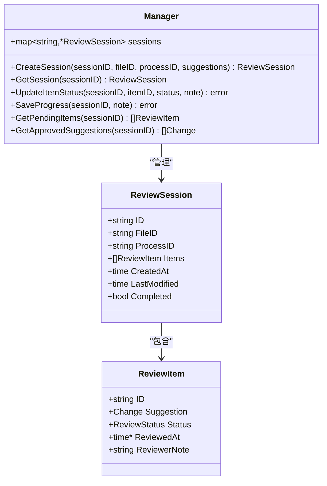

**图表来源**
- [manager.go:24-42](../internal/review/manager/manager.go#L24-L42)
- [manager.go:56-89](../internal/review/manager/manager.go#L56-L89)
- [manager.go:111-142](../internal/review/manager/manager.go#L111-L142)
- [manager.go:178-195](../internal/review/manager/manager.go#L178-L195)

**章节来源**
- [manager.go:44-234](../internal/review/manager/manager.go#L44-L234)

### 数据存储策略与文件组织
- 数据库：files、versions、processing_logs、review_items、chunk_cache 等表
- 文件系统：
  - uploads：存放中间文件与最终文件（uploads/{md5}_{step}.txt 或 uploads/{md5}_final_{name}.txt）
  - backups：版本备份（backups/{version_id}.json）
  - temp：上传临时文件（temp/{timestamp_filename}）
- 版本管理：每次中间处理或最终生成都会创建版本记录，支持回溯与恢复

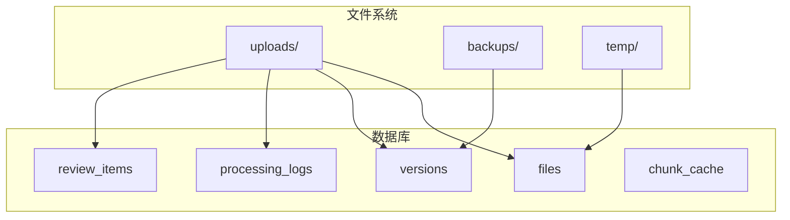

**图表来源**
- [config.go:116-122](../internal/config/config.go#L116-L122)
- [pipeline.go:547-579](../internal/processor/pipeline.go#L547-L579)
- [version_repo.go:20-33](../internal/database/version_repo.go#L20-L33)
- [manager.go:197-214](../internal/review/manager/manager.go#L197-L214)

**章节来源**
- [config.go:114-145](../internal/config/config.go#L114-L145)
- [pipeline.go:547-579](../internal/processor/pipeline.go#L547-L579)
- [version_repo.go:20-33](../internal/database/version_repo.go#L20-L33)
- [manager.go:197-234](../internal/review/manager/manager.go#L197-L234)

### 数据验证与质量控制
- 配置验证：端口、相似度阈值、生成温度等参数范围校验
- 文件上传验证：大小限制、扩展名限制、MD5 去重
- 处理过程验证：步骤状态更新、错误日志记录、处理日志
- 质量监控：缓存命中率、API 错误率、平均处理时间阈值触发 Evolver 监控

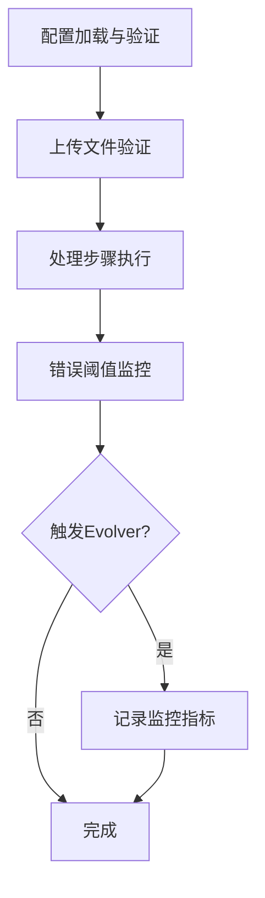

**图表来源**
- [config.go:190-203](../internal/config/config.go#L190-L203)
- [files.go:26-35](../web/backend/handlers/files.go#L26-L35)
- [pipeline.go:378-434](../internal/processor/pipeline.go#L378-L434)

**章节来源**
- [config.go:190-203](../internal/config/config.go#L190-L203)
- [files.go:26-35](../web/backend/handlers/files.go#L26-L35)
- [pipeline.go:378-434](../internal/processor/pipeline.go#L378-L434)

## 依赖关系分析
- Web 层依赖处理层与存储层，通过 Handlers 调用 Pipeline 与数据库操作
- 处理层内部模块解耦，通过公共结构（如 Change、RulesConfig）交互
- 配置层贯穿全局，影响行为与路径

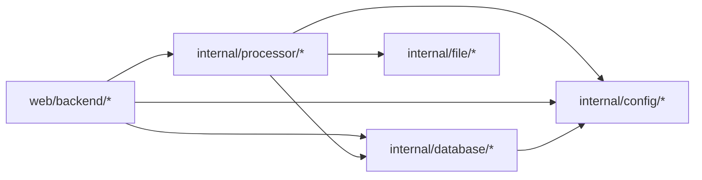

**图表来源**
- [server.go:3-8](../web/backend/server.go#L3-L8)
- [files.go:3-16](../web/backend/handlers/files.go#L3-L16)
- [pipeline.go:3-17](../internal/processor/pipeline.go#L3-L17)
- [config.go:3-12](../internal/config/config.go#L3-L12)

**章节来源**
- [server.go:10-57](../web/backend/server.go#L10-L57)
- [files.go:18-393](../web/backend/handlers/files.go#L18-L393)
- [pipeline.go:104-158](../internal/processor/pipeline.go#L104-L158)

## 性能考虑
- 并发处理：WorkerPool 并发处理文本块，提升 LLM 修复吞吐
- 缓存策略：块级缓存避免重复请求，降低 API 成本与延迟
- 分块策略：智能分块平衡上下文窗口与段落完整性
- I/O 优化：中间文件与最终文件按步骤写入，减少重复读取

## 故障排除指南
- 上传失败：检查文件大小与扩展名限制、临时目录权限
- 处理中断：查看 processing_logs 与错误消息，根据 currentStep 与 progress 恢复
- 审核卡住：确认 review_items 状态，必要时批量审批/拒绝
- 版本丢失：检查 backups 目录与 versions 表，必要时手动恢复

**章节来源**
- [files.go:26-35](../web/backend/handlers/files.go#L26-L35)
- [file_repo.go:93-103](../internal/database/file_repo.go#L93-L103)
- [manager.go:111-142](../internal/review/manager/manager.go#L111-L142)
- [version_repo.go:55-66](../internal/database/version_repo.go#L55-L66)

## 结论
VoidText 系统通过清晰的分层架构与严格的版本管理，实现了从上传到最终输出的完整数据流闭环。处理流水线将基础清洗、向量检测、LLM 修复与审核管理有机结合，配合缓存与并发策略，在保证质量的同时提升了处理效率。建议在生产环境中进一步完善 Evolver 自进化机制与监控告警体系，持续优化提示词与处理策略。