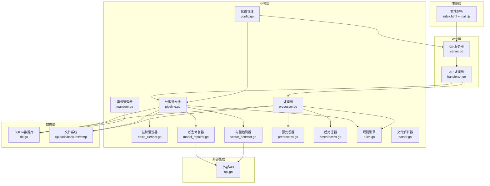
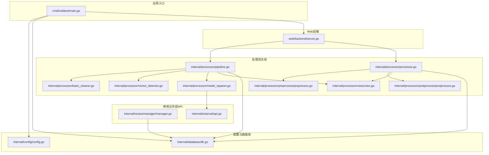

# 整体架构概览

<cite>
**引用文件**
- [cmd/voidtext/main.go](../cmd/voidtext/main.go)
- [web/backend/server.go](../web/backend/server.go)
- [internal/config/config.go](../internal/config/config.go)
- [internal/database/db.go](../internal/database/db.go)
- [internal/processor/pipeline.go](../internal/processor/pipeline.go)
- [internal/processor/processor.go](../internal/processor/processor.go)
- [internal/processor/basic_cleaner.go](../internal/processor/basic_cleaner.go)
- [internal/processor/vector_detector.go](../internal/processor/vector_detector.go)
- [internal/processor/model_repairer.go](../internal/processor/model_repairer.go)
- [internal/processor/preprocess/preprocess.go](../internal/processor/preprocess/preprocess.go)
- [internal/processor/postprocess/postprocess.go](../internal/processor/postprocess/postprocess.go)
- [internal/processor/rules/rules.go](../internal/processor/rules/rules.go)
- [internal/review/manager/manager.go](../internal/review/manager/manager.go)
- [internal/external/api.go](../internal/external/api.go)
- [web/backend/handlers/files.go](../web/backend/handlers/files.go)
- [internal/file/parser.go](../internal/file/parser.go)
- [go.mod](../go.mod)
</cite>

## 目录
1. [架构分层](#架构分层)
2. [核心组件](#核心组件)
3. [数据流](#数据流)
4. [依赖关系](#依赖关系)
5. [性能考量](#性能考量)

## 架构分层

系统采用前后端分离的分层架构：

**分层说明**
- **表现层**：前端单页应用（SPA），通过JavaScript控制页面切换与状态管理
- **Web层**：基于Gin框架的HTTP服务器，提供REST API路由与静态资源服务
- **业务层**：处理器模块负责文本清洗、向量检测、LLM修复、审核管理与流水线编排
- **数据层**：SQLite数据库存储文件元数据、版本链、审核项、处理日志与缓存
- **外部集成**：向量检测与LLM修复可通过本地或外部API实现

## 核心组件

| 组件 | 文件 | 职责 |
|------|------|------|
| 配置管理 | `internal/config/config.go` | 集中管理端口、数据目录、功能开关、模型参数等配置项 |
| 数据库层 | `internal/database/db.go` | SQLite初始化、表结构、索引、连接池与WAL优化 |
| 处理流水线 | `internal/processor/pipeline.go` | 五步处理流程编排，支持规则配置、进度计算、状态管理 |
| 基础清洗器 | `internal/processor/basic_cleaner.go` | HTML实体清理、标点规范化、空白处理、繁简转换、广告移除 |
| 向量检测器 | `internal/processor/vector_detector.go` | 段落级相似度检测，支持本地特征与外部API嵌入向量 |
| 模型修复器 | `internal/processor/model_repairer.go` | 智能分块、Worker Pool并发、缓存幂等性、断点续传 |
| 审核管理器 | `internal/review/manager/manager.go` | 审核会话与项的状态流转，支持内存与磁盘持久化 |
| 文件解析器 | `internal/file/parser.go` | 从文件名中提取作者与标题，支持多种分隔符 |
| Web服务器 | `web/backend/server.go` | 基于Gin提供CORS、静态资源、路由注册与HTTP处理 |
| 外部API | `internal/external/api.go` | 封装HTTP请求、重试、退避与错误处理 |

## 数据流

## 依赖关系

## 性能考量

- **并发处理**：LLM修复采用Worker Pool模式，可配置并发数
- **缓存机制**：块级修复缓存避免重复调用API，提升幂等性
- **WAL模式**：SQLite启用WAL模式提升并发读写性能
- **连接池**：数据库连接池管理，避免频繁创建连接
- **静态资源**：前端资源直出，减少后端渲染开销
