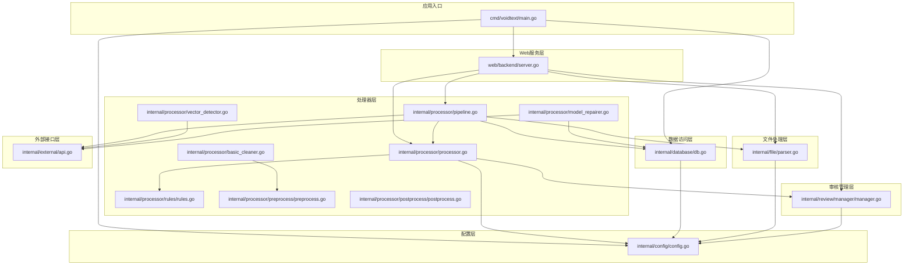
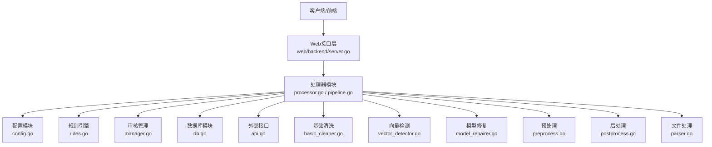
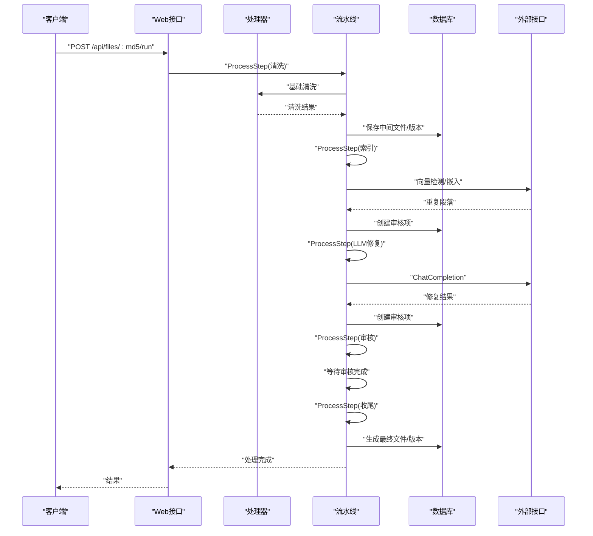
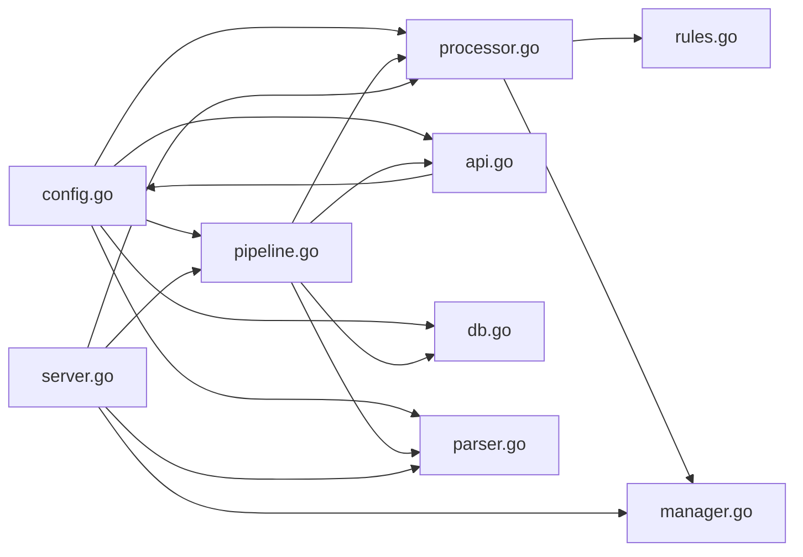

# 模块设计与划分

<cite>
**本文引用的文件**
- [processor.go](../internal/processor/processor.go)
- [pipeline.go](../internal/processor/pipeline.go)
- [basic_cleaner.go](../internal/processor/basic_cleaner.go)
- [vector_detector.go](../internal/processor/vector_detector.go)
- [model_repairer.go](../internal/processor/model_repairer.go)
- [rules.go](../internal/processor/rules/rules.go)
- [preprocess.go](../internal/processor/preprocess/preprocess.go)
- [postprocess.go](../internal/processor/postprocess/postprocess.go)
- [config.go](../internal/config/config.go)
- [db.go](../internal/database/db.go)
- [parser.go](../internal/file/parser.go)
- [manager.go](../internal/review/manager/manager.go)
- [api.go](../internal/external/api.go)
- [server.go](../web/backend/server.go)
- [main.go](../cmd/voidtext/main.go)
</cite>

## 目录
1. [简介](#简介)
2. [项目结构](#项目结构)
3. [核心组件](#核心组件)
4. [架构总览](#架构总览)
5. [详细组件分析](#详细组件分析)
6. [依赖关系分析](#依赖关系分析)
7. [性能考量](#性能考量)
8. [故障排查指南](#故障排查指南)
9. [结论](#结论)

## 简介
本设计文档面向VoidText系统，聚焦于模块化设计与职责划分，覆盖处理器模块、配置管理模块、数据库模块、文件处理模块、审核管理模块，并阐明模块间的依赖关系与接口契约。文档同时给出模块内部结构、关键类设计、可扩展性与可维护性策略，以及模块交互图与依赖关系图，帮助开发者快速理解与迭代系统。

## 项目结构
系统采用按领域分层的组织方式：
- cmd/voidtext：应用入口，负责配置加载、数据库初始化与Web服务启动
- internal/config：应用配置加载与验证
- internal/database：SQLite持久化、表结构与索引、事务批处理
- internal/file：文件名解析、MD5工具（在其他文件中使用）
- internal/processor：文本处理流水线、清洗、向量检测、模型修复、规则引擎、预/后处理
- internal/review/manager：审核会话与审核项管理（内存+磁盘持久化）
- internal/external：外部API客户端（含重试、退避、连接池）
- web/backend：Gin路由与HTTP接口
- web/frontend：静态资源与前端页面

图表来源
- [main.go:18-61](../cmd/voidtext/main.go#L18-L61)
- [config.go:48-122](../internal/config/config.go#L48-L122)
- [db.go:15-69](../internal/database/db.go#L15-L69)
- [server.go:10-57](../web/backend/server.go#L10-L57)
- [processor.go:36-144](../internal/processor/processor.go#L36-L144)
- [pipeline.go:104-158](../internal/processor/pipeline.go#L104-L158)
- [basic_cleaner.go:31-51](../internal/processor/basic_cleaner.go#L31-L51)
- [vector_detector.go:36-69](../internal/processor/vector_detector.go#L36-L69)
- [model_repairer.go:77-122](../internal/processor/model_repairer.go#L77-L122)
- [rules.go:139-150](../internal/processor/rules/rules.go#L139-L150)
- [preprocess.go:29-50](../internal/processor/preprocess/preprocess.go#L29-L50)
- [postprocess.go:24-43](../internal/processor/postprocess/postprocess.go#L24-L43)
- [manager.go:56-89](../internal/review/manager/manager.go#L56-L89)
- [api.go:188-200](../internal/external/api.go#L188-L200)

章节来源
- [main.go:18-61](../cmd/voidtext/main.go#L18-L61)
- [server.go:10-57](../web/backend/server.go#L10-L57)

## 核心组件
- 处理器模块：提供单次处理与流水线处理能力，串联基础清洗、向量检测、模型修复、规则应用与审核会话创建
- 配置管理模块：集中加载与验证运行时配置，支持环境变量与默认值
- 数据库模块：SQLite持久化，表结构与索引、事务批处理、连接池与WAL优化
- 文件处理模块：文件名解析、MD5计算（在其他模块中使用）
- 审核管理模块：内存+磁盘持久化的审核会话与审核项管理
- 外部接口模块：统一的HTTP客户端，具备重试、退避、连接池与线程安全配置更新
- Web服务模块：基于Gin的REST接口，暴露文件上传、处理、审核、规则管理等API

章节来源
- [processor.go:36-144](../internal/processor/processor.go#L36-L144)
- [pipeline.go:104-158](../internal/processor/pipeline.go#L104-L158)
- [config.go:48-122](../internal/config/config.go#L48-L122)
- [db.go:15-69](../internal/database/db.go#L15-L69)
- [parser.go:16-41](../internal/file/parser.go#L16-L41)
- [manager.go:56-89](../internal/review/manager/manager.go#L56-L89)
- [api.go:188-200](../internal/external/api.go#L188-L200)
- [server.go:28-54](../web/backend/server.go#L28-L54)

## 架构总览
系统采用“配置-数据-处理器-审核-外部接口”的分层架构，Web层通过处理器与数据库进行交互，处理器再协调规则引擎、向量检测与模型修复，并通过外部接口调用LLM服务。审核模块贯穿处理流程，提供人工干预与最终确认。

图表来源
- [server.go:28-54](../web/backend/server.go#L28-L54)
- [processor.go:36-144](../internal/processor/processor.go#L36-L144)
- [pipeline.go:104-158](../internal/processor/pipeline.go#L104-L158)
- [config.go:48-122](../internal/config/config.go#L48-L122)
- [rules.go:139-150](../internal/processor/rules/rules.go#L139-L150)
- [manager.go:56-89](../internal/review/manager/manager.go#L56-L89)
- [db.go:15-69](../internal/database/db.go#L15-L69)
- [api.go:188-200](../internal/external/api.go#L188-L200)
- [basic_cleaner.go:31-51](../internal/processor/basic_cleaner.go#L31-L51)
- [vector_detector.go:36-69](../internal/processor/vector_detector.go#L36-L69)
- [model_repairer.go:77-122](../internal/processor/model_repairer.go#L77-L122)
- [preprocess.go:29-50](../internal/processor/preprocess/preprocess.go#L29-L50)
- [postprocess.go:24-43](../internal/processor/postprocess/postprocess.go#L24-L43)
- [parser.go:16-41](../internal/file/parser.go#L16-L41)

## 详细组件分析

### 处理器模块
- 单次处理：按配置顺序执行基础清洗、向量检测、模型修复与自定义规则应用，聚合统计与变更
- 流水线处理：按步骤推进（清洗、索引、LLM修复、审核、收尾），支持中间文件保存与版本记录
- 审核集成：创建审核会话，将检测到的重复段落与修复建议转化为审核项
- 建议应用：支持单条/批量应用修改建议，按位置逆序应用保证偏移稳定

图表来源
- [server.go:39-49](../web/backend/server.go#L39-L49)
- [pipeline.go:104-158](../internal/processor/pipeline.go#L104-L158)
- [processor.go:36-144](../internal/processor/processor.go#L36-L144)
- [api.go:579-667](../internal/external/api.go#L579-L667)

章节来源
- [processor.go:36-144](../internal/processor/processor.go#L36-L144)
- [pipeline.go:104-158](../internal/processor/pipeline.go#L104-L158)

### 配置管理模块
- 职责：加载.env与环境变量，构造AppConfig，提供默认值与类型转换，校验端口、阈值与温度参数
- 设计要点：优先从可执行文件目录加载.env，确保数据目录与子目录存在

章节来源
- [config.go:48-122](../internal/config/config.go#L48-L122)
- [config.go:190-203](../internal/config/config.go#L190-L203)

### 数据库模块
- 职责：初始化SQLite连接、启用WAL、设置缓存与连接生命周期、批量建表与索引、提供GetDB/Close
- 表结构：files、versions、review_items、processing_logs、chunk_repair_cache、retry_queue、prompt_versions
- 设计要点：事务批量建表、索引优化、WAL自动检查点、单写连接保障

章节来源
- [db.go:15-69](../internal/database/db.go#L15-L69)
- [db.go:89-222](../internal/database/db.go#L89-L222)

### 文件处理模块
- 职责：从文件名解析作者与标题，基于配置的分隔符集合判断
- 设计要点：分隔符可配置，长度约束与启发式判断提升准确性

章节来源
- [parser.go:16-41](../internal/file/parser.go#L16-L41)
- [config.go:124-139](../internal/config/config.go#L124-L139)

### 审核管理模块
- 职责：创建/获取审核会话，更新审核项状态，持久化到磁盘，支持待审核项与已批准建议查询
- 设计要点：内存缓存+磁盘持久化，状态机（pending/approved/rejected/skipped）

章节来源
- [manager.go:56-89](../internal/review/manager/manager.go#L56-L89)
- [manager.go:111-142](../internal/review/manager/manager.go#L111-L142)
- [manager.go:178-195](../internal/review/manager/manager.go#L178-L195)

### 外部接口模块
- 职责：统一HTTP客户端，指数退避重试、连接池优化、线程安全配置更新
- 设计要点：全局HTTP客户端单例、可配置重试策略、错误分类与日志记录

章节来源
- [api.go:27-59](../internal/external/api.go#L27-L59)
- [api.go:61-95](../internal/external/api.go#L61-L95)
- [api.go:293-418](../internal/external/api.go#L293-L418)

### Web服务模块
- 职责：注册CORS、静态资源、路由组与各API端点
- 设计要点：统一跨域配置、静态文件托管、RESTful路由

章节来源
- [server.go:10-57](../web/backend/server.go#L10-L57)

## 依赖关系分析
- 处理器模块依赖配置、规则引擎、审核管理器
- 流水线模块依赖数据库、文件处理、处理器、外部接口
- 外部接口模块依赖配置
- Web服务模块依赖处理器、流水线、文件处理、审核管理

图表来源
- [processor.go:7-11](../internal/processor/processor.go#L7-L11)
- [pipeline.go:11-17](../internal/processor/pipeline.go#L11-L17)
- [api.go:16-18](../internal/external/api.go#L16-L18)
- [server.go:3-8](../web/backend/server.go#L3-L8)

章节来源
- [processor.go:7-11](../internal/processor/processor.go#L7-L11)
- [pipeline.go:11-17](../internal/processor/pipeline.go#L11-L17)
- [api.go:16-18](../internal/external/api.go#L16-L18)
- [server.go:3-8](../web/backend/server.go#L3-L8)

## 性能考量
- 数据库：WAL模式、自动检查点、缓存大小、单写连接，降低锁竞争
- 外部接口：连接池、超时、指数退避、抖动，提升稳定性与吞吐
- 处理器：工作池并发、块缓存、幂等性、提示词版本管理，减少重复调用
- 流水线：中间文件与版本记录，支持断点续传与可观测性

章节来源
- [db.go:29-59](../internal/database/db.go#L29-L59)
- [api.go:27-59](../internal/external/api.go#L27-L59)
- [model_repairer.go:547-563](../internal/processor/model_repairer.go#L547-L563)
- [pipeline.go:547-579](../internal/processor/pipeline.go#L547-L579)

## 故障排查指南
- 配置加载失败：检查.env路径与权限，确认端口与阈值范围
- 数据库连接失败：确认数据目录可写、WAL模式启用、连接池配置
- 外部API错误：查看重试日志、限流与超时、错误码解析
- 审核会话异常：检查磁盘持久化路径、JSON序列化/反序列化
- 流水线卡住：检查中间文件保存、版本记录、审核进度

章节来源
- [config.go:48-122](../internal/config/config.go#L48-L122)
- [db.go:15-69](../internal/database/db.go#L15-L69)
- [api.go:293-418](../internal/external/api.go#L293-L418)
- [manager.go:197-233](../internal/review/manager/manager.go#L197-L233)
- [pipeline.go:547-579](../internal/processor/pipeline.go#L547-L579)

## 结论
VoidText系统通过清晰的模块划分与分层设计，实现了从配置、数据、处理、审核到外部接口的完整闭环。处理器模块作为核心编排者，结合规则引擎、向量检测与模型修复，提供了可扩展、可维护且高性能的文本清洗能力。未来可在提示词版本管理、重试队列调度与前端交互方面进一步增强自动化与可观测性。