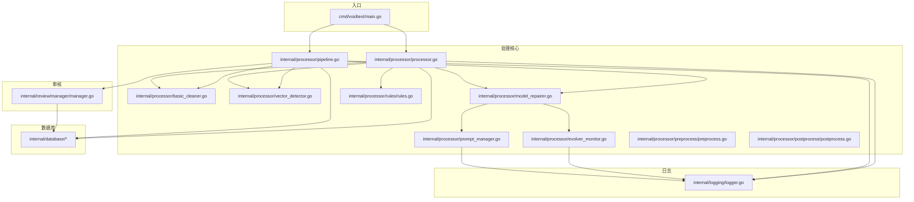
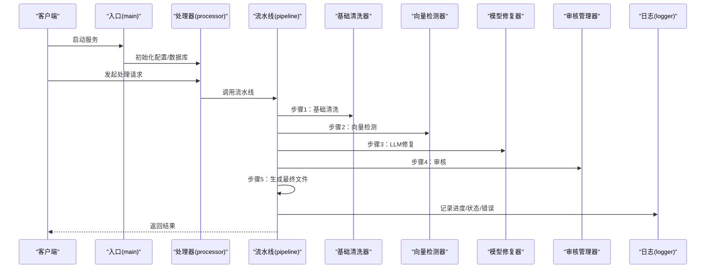
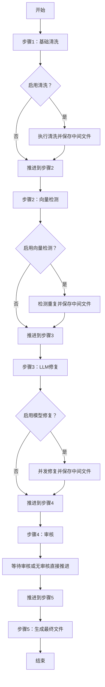
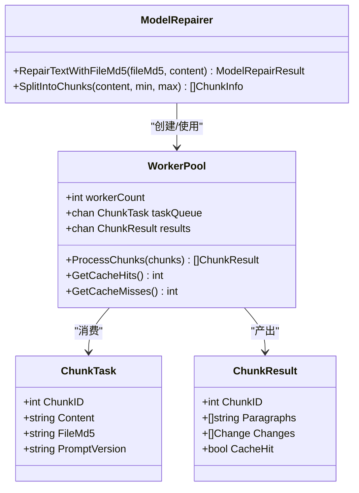
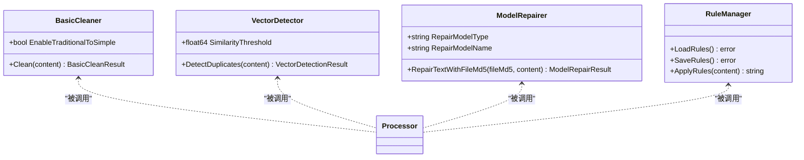
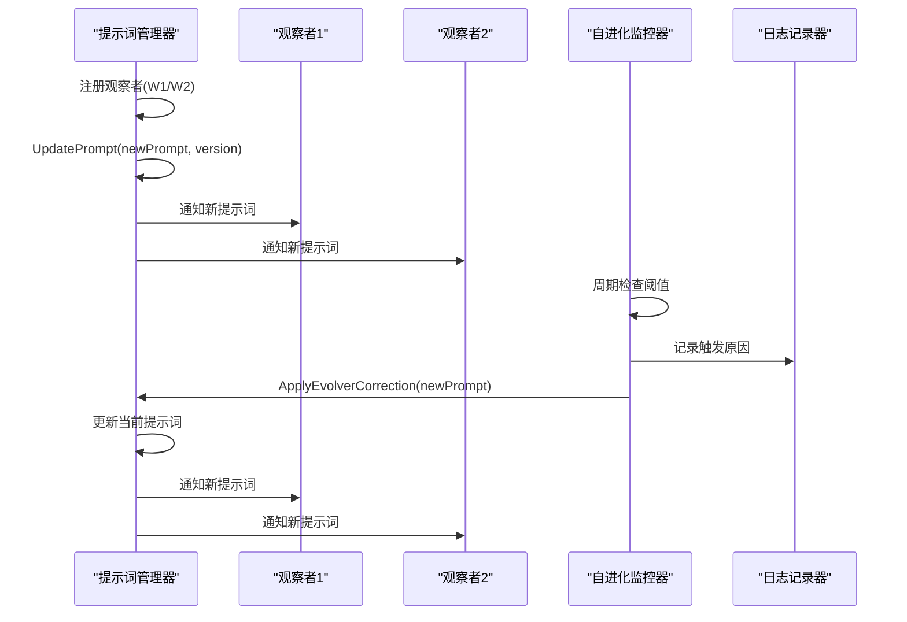
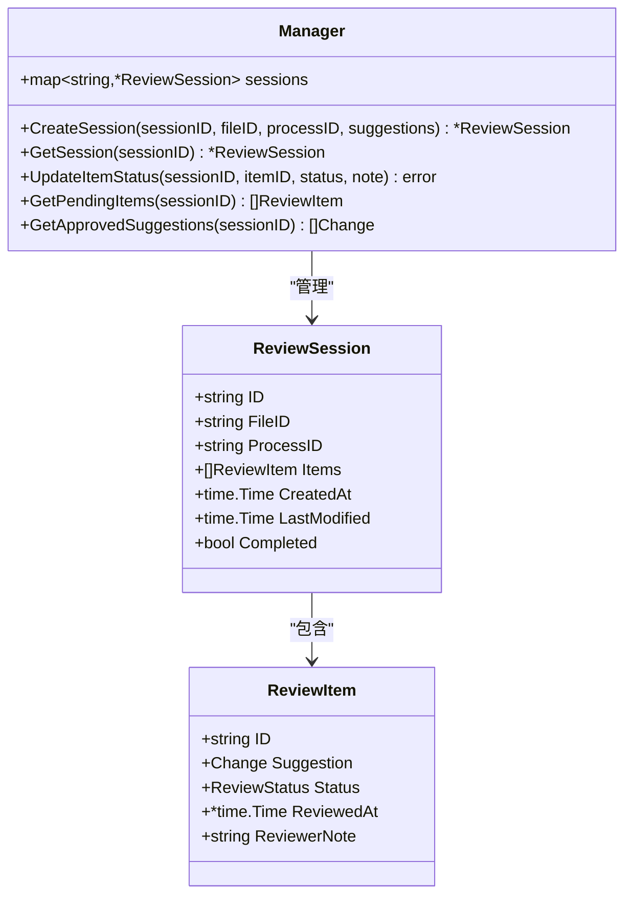
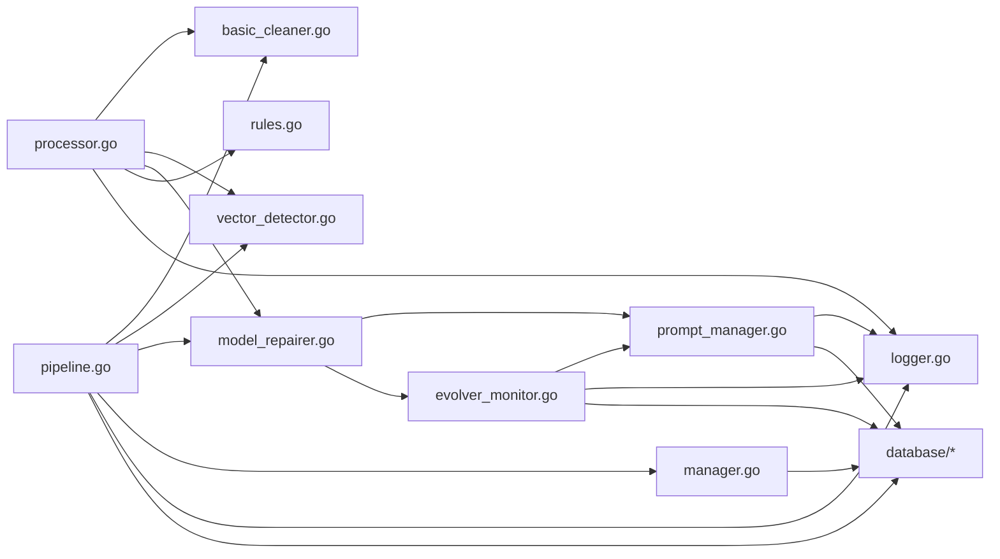

# 设计模式应用

<cite>
**本文档引用的文件**
- [pipeline.go](../internal/processor/pipeline.go)
- [processor.go](../internal/processor/processor.go)
- [preprocess.go](../internal/processor/preprocess/preprocess.go)
- [postprocess.go](../internal/processor/postprocess/postprocess.go)
- [rules.go](../internal/processor/rules/rules.go)
- [model_repairer.go](../internal/processor/model_repairer.go)
- [vector_detector.go](../internal/processor/vector_detector.go)
- [basic_cleaner.go](../internal/processor/basic_cleaner.go)
- [evolver_monitor.go](../internal/processor/evolver_monitor.go)
- [manager.go](../internal/review/manager/manager.go)
- [prompt_manager.go](../internal/processor/prompt_manager.go)
- [logger.go](../internal/logging/logger.go)
- [main.go](../cmd/voidtext/main.go)
</cite>

## 目录
1. [简介](#简介)
2. [项目结构](#项目结构)
3. [核心组件](#核心组件)
4. [架构总览](#架构总览)
5. [详细组件分析](#详细组件分析)
6. [依赖关系分析](#依赖关系分析)
7. [性能考量](#性能考量)
8. [故障排查指南](#故障排查指南)
9. [结论](#结论)

## 简介
本文件聚焦VoidText系统中设计模式的应用，围绕以下核心模式展开：
- 流水线模式：五步处理流程（清洗、索引、LLM修复、审核、收尾）
- 工作池模式：并发处理优化（Worker Pool）
- 策略模式：不同处理策略（基础清洗、向量检测、模型修复、规则应用）
- 观察者模式：监控与日志（提示词热重载、Evolver自进化、结构化日志）

这些模式共同提升了系统的可扩展性、可维护性和性能，并通过模块化与解耦增强了可测试性与可观测性。

## 项目结构
系统采用分层与功能域结合的组织方式：
- cmd/voidtext：入口程序，负责配置加载、数据库初始化与HTTP服务启动
- internal/processor：处理核心，包含预处理、后处理、规则、模型修复、向量检测、流水线、提示词管理、自进化监控等
- internal/review/manager：审核管理器，负责会话与审核项的持久化与状态管理
- internal/logging：结构化日志记录器，提供统一的日志事件格式与事件类型
- internal/database：数据库访问层（在流水线与处理器中被调用）
- web/backend：Web服务（由入口程序启动）

图表来源
- [main.go:1-61](../cmd/voidtext/main.go#L1-L61)
- [processor.go:1-228](../internal/processor/processor.go#L1-L228)
- [pipeline.go:1-610](../internal/processor/pipeline.go#L1-L610)
- [basic_cleaner.go:1-280](../internal/processor/basic_cleaner.go#L1-L280)
- [vector_detector.go:1-224](../internal/processor/vector_detector.go#L1-L224)
- [model_repairer.go:1-731](../internal/processor/model_repairer.go#L1-L731)
- [prompt_manager.go:1-363](../internal/processor/prompt_manager.go#L1-L363)
- [evolver_monitor.go:1-300](../internal/processor/evolver_monitor.go#L1-L300)
- [rules.go:1-151](../internal/processor/rules/rules.go#L1-L151)
- [manager.go:1-234](../internal/review/manager/manager.go#L1-L234)
- [logger.go:1-250](../internal/logging/logger.go#L1-L250)

章节来源
- [main.go:1-61](../cmd/voidtext/main.go#L1-L61)
- [processor.go:1-228](../internal/processor/processor.go#L1-L228)
- [pipeline.go:1-610](../internal/processor/pipeline.go#L1-L610)

## 核心组件
- 流水线控制器：负责步骤编排、进度计算、状态更新与中间产物保存
- 处理器：提供三阶段处理（预处理→向量检测→模型修复），并可选应用规则
- 基础清洗器：执行HTML实体清理、标点规范化、空白规范化、繁简转换、广告移除等
- 向量检测器：段落向量化与重复检测（简化实现）
- 模型修复器：智能分块、缓存幂等、Worker Pool并发、提示词管理、Evolver自进化
- 审核管理器：会话与审核项的创建、持久化、状态流转
- 规则管理器：规则加载、保存、增删改查与应用
- 日志记录器：结构化日志事件，支持多种事件类型与上下文字段
- 提示词管理器：提示词加载、热重载、版本管理、使用统计、Evolver集成
- 自进化监控器：周期性检查阈值并触发Evolver优化

章节来源
- [pipeline.go:1-610](../internal/processor/pipeline.go#L1-L610)
- [processor.go:1-228](../internal/processor/processor.go#L1-L228)
- [basic_cleaner.go:1-280](../internal/processor/basic_cleaner.go#L1-L280)
- [vector_detector.go:1-224](../internal/processor/vector_detector.go#L1-L224)
- [model_repairer.go:1-731](../internal/processor/model_repairer.go#L1-L731)
- [manager.go:1-234](../internal/review/manager/manager.go#L1-L234)
- [rules.go:1-151](../internal/processor/rules/rules.go#L1-L151)
- [logger.go:1-250](../internal/logging/logger.go#L1-L250)
- [prompt_manager.go:1-363](../internal/processor/prompt_manager.go#L1-L363)
- [evolver_monitor.go:1-300](../internal/processor/evolver_monitor.go#L1-L300)

## 架构总览
系统采用“入口→处理核心→外部服务/存储”的分层架构。入口负责初始化与HTTP服务，处理核心封装业务逻辑并通过统一日志与数据库接口与外部交互。审核、规则、提示词与监控模块以插件化方式接入，便于扩展与替换。

图表来源
- [main.go:1-61](../cmd/voidtext/main.go#L1-L61)
- [processor.go:1-228](../internal/processor/processor.go#L1-L228)
- [pipeline.go:1-610](../internal/processor/pipeline.go#L1-L610)

## 详细组件分析

### 流水线模式（五步处理流程）
- 场景：将文本处理分解为固定顺序的五个步骤，每步可独立开关与配置，支持中间产物保存与版本记录
- 实现要点：
  - 步骤常量与顺序数组定义步骤序列
  - 进度计算基于步骤索引与步内进度贡献
  - 每步根据配置决定是否执行，否则跳过并推进到下一步
  - 中间产物保存为独立版本文件，便于回溯与审计
  - 审核步骤支持等待与推进，最终生成最终文件并记录版本
- 优势：
  - 易于扩展新步骤
  - 易于定位问题与回滚
  - 易于并行化（LLM修复已引入并发）

图表来源
- [pipeline.go:1-610](../internal/processor/pipeline.go#L1-L610)

章节来源
- [pipeline.go:19-158](../internal/processor/pipeline.go#L19-L158)
- [pipeline.go:160-271](../internal/processor/pipeline.go#L160-L271)
- [pipeline.go:273-376](../internal/processor/pipeline.go#L273-L376)
- [pipeline.go:436-522](../internal/processor/pipeline.go#L436-L522)

### 工作池模式（并发处理优化）
- 场景：将大文本切分为多个块，使用固定数量的工作线程并发处理，显著提升吞吐量
- 实现要点：
  - WorkerPool持有任务队列与结果通道，启动N个工作协程
  - 每个worker从队列取出任务，先查缓存，命中则直接返回，未命中则调用外部API修复并写入缓存
  - 统计缓存命中/未命中，记录日志事件
  - 支持幂等性：同一内容的块哈希一致，避免重复调用
- 优势：
  - 显著降低整体处理时间
  - 缓存减少重复调用，提高命中率
  - 并发可控，避免资源争用

图表来源
- [model_repairer.go:526-731](../internal/processor/model_repairer.go#L526-L731)

章节来源
- [model_repairer.go:547-731](../internal/processor/model_repairer.go#L547-L731)

### 策略模式（不同处理策略）
- 场景：系统支持多种处理策略（基础清洗、向量检测、模型修复、规则应用），策略可独立开关与组合
- 实现要点：
  - 基础清洗器：HTML实体、标点、空白、繁简转换、广告移除
  - 向量检测器：段落向量化与重复检测（简化实现）
  - 模型修复器：智能分块、缓存、并发、提示词管理、Evolver自进化
  - 规则管理器：规则加载、保存、增删改查与应用
- 优势：
  - 策略可插拔，易于替换与扩展
  - 配置驱动，灵活开启/关闭策略
  - 单一职责，便于测试与维护

图表来源
- [basic_cleaner.go:1-280](../internal/processor/basic_cleaner.go#L1-L280)
- [vector_detector.go:1-224](../internal/processor/vector_detector.go#L1-L224)
- [model_repairer.go:1-731](../internal/processor/model_repairer.go#L1-L731)
- [rules.go:1-151](../internal/processor/rules/rules.go#L1-L151)

章节来源
- [processor.go:36-117](../internal/processor/processor.go#L36-L117)
- [basic_cleaner.go:31-51](../internal/processor/basic_cleaner.go#L31-L51)
- [vector_detector.go:36-69](../internal/processor/vector_detector.go#L36-L69)
- [rules.go:139-150](../internal/processor/rules/rules.go#L139-L150)

### 观察者模式（监控与日志）
- 场景：提示词管理器支持观察者注册，当提示词更新时通知所有观察者；日志系统提供统一事件格式与事件类型
- 实现要点：
  - 提示词管理器：注册观察者通道，更新提示词后广播新提示词
  - 日志记录器：统一事件结构，包含时间、级别、事件、调用者、额外字段等
  - 自进化监控器：周期性检查阈值，触发Evolver调用并记录事件
- 优势：
  - 松耦合的通知机制
  - 结构化日志便于监控与分析
  - 可观测性强，便于问题定位

图表来源
- [prompt_manager.go:235-260](../internal/processor/prompt_manager.go#L235-L260)
- [prompt_manager.go:184-233](../internal/processor/prompt_manager.go#L184-L233)
- [evolver_monitor.go:179-285](../internal/processor/evolver_monitor.go#L179-L285)
- [logger.go:1-250](../internal/logging/logger.go#L1-L250)

章节来源
- [prompt_manager.go:235-260](../internal/processor/prompt_manager.go#L235-L260)
- [prompt_manager.go:184-233](../internal/processor/prompt_manager.go#L184-L233)
- [evolver_monitor.go:92-177](../internal/processor/evolver_monitor.go#L92-L177)
- [logger.go:68-119](../internal/logging/logger.go#L68-L119)

### 审核管理器（状态管理与持久化）
- 场景：将处理建议转化为可审核的项，支持状态流转与持久化
- 实现要点：
  - 会话创建、项创建、状态更新、持久化到磁盘
  - 支持获取待审核项、已批准建议
  - 内存缓存+磁盘持久化，兼顾性能与可靠性
- 优势：
  - 审核流程清晰，状态可追踪
  - 数据持久化，避免重启丢失
  - 易于扩展审核规则与UI

图表来源
- [manager.go:44-234](../internal/review/manager/manager.go#L44-L234)

章节来源
- [manager.go:56-89](../internal/review/manager/manager.go#L56-L89)
- [manager.go:111-142](../internal/review/manager/manager.go#L111-L142)
- [manager.go:197-233](../internal/review/manager/manager.go#L197-L233)

### 预处理与后处理（数据清洗与格式化）
- 场景：在主流程前后对文本进行编码规范化、广告移除、特殊字符清理、空白规范化、格式优化、章节整理、标点规范化等
- 实现要点：
  - 预处理：编码修复、广告识别与移除、特殊字符清理、空白规范化
  - 后处理：格式优化、章节结构整理、标点规范化
- 优势：
  - 保证输入质量，减少后续处理成本
  - 统一输出格式，提升用户体验

章节来源
- [preprocess.go:29-50](../internal/processor/preprocess/preprocess.go#L29-L50)
- [postprocess.go:24-43](../internal/processor/postprocess/postprocess.go#L24-L43)

## 依赖关系分析
- 模块内聚与耦合：
  - 处理器与流水线：高内聚，通过配置与接口解耦
  - 模型修复器与提示词管理器：通过接口解耦，支持热重载与Evolver
  - 审核管理器与数据库：通过接口解耦，支持持久化
  - 日志记录器：全局单例，统一事件格式
- 外部依赖：
  - 外部API：模型修复器调用外部API生成补丁
  - 文件系统：提示词文件、审核会话文件、中间产物文件
  - 数据库：版本记录、缓存记录、提示词版本记录、重试队列

图表来源
- [pipeline.go:1-610](../internal/processor/pipeline.go#L1-L610)
- [processor.go:1-228](../internal/processor/processor.go#L1-L228)
- [model_repairer.go:1-731](../internal/processor/model_repairer.go#L1-L731)
- [prompt_manager.go:1-363](../internal/processor/prompt_manager.go#L1-L363)
- [evolver_monitor.go:1-300](../internal/processor/evolver_monitor.go#L1-L300)
- [manager.go:1-234](../internal/review/manager/manager.go#L1-L234)
- [logger.go:1-250](../internal/logging/logger.go#L1-L250)

章节来源
- [pipeline.go:1-610](../internal/processor/pipeline.go#L1-L610)
- [processor.go:1-228](../internal/processor/processor.go#L1-L228)

## 性能考量
- 并发优化：Worker Pool将大文本分块并发处理，显著提升吞吐量；缓存命中减少重复调用
- 分块策略：智能分块（1500-2000字符）平衡模型输入限制与段落完整性
- 缓存幂等：基于内容哈希的缓存，避免重复修复
- I/O优化：中间产物与最终产物以文件形式保存，便于增量处理与审计
- 监控与自进化：阈值监控与Evolver自进化，持续优化提示词与策略

## 故障排查指南
- 日志事件：
  - API错误、拒绝、缓存命中/未命中、Worker池状态、提示词加载/更新、重试队列、Evolver触发等
- 常见问题：
  - 提示词文件缺失或为空：检查提示词文件路径与内容
  - API调用失败：查看API错误日志与重试队列
  - 缓存未命中率高：检查提示词有效性与模型能力
  - 审核进度异常：检查审核会话文件与状态流转
- 排查步骤：
  - 查看结构化日志事件，定位具体环节
  - 检查提示词版本与使用统计
  - 检查缓存命中率与错误率
  - 检查审核会话文件与数据库记录

章节来源
- [logger.go:143-250](../internal/logging/logger.go#L143-L250)
- [prompt_manager.go:308-322](../internal/processor/prompt_manager.go#L308-L322)
- [evolver_monitor.go:117-177](../internal/processor/evolver_monitor.go#L117-L177)
- [manager.go:197-233](../internal/review/manager/manager.go#L197-L233)

## 结论
VoidText系统通过流水线模式、工作池模式、策略模式与观察者模式的有机结合，实现了高可扩展性、可维护性与高性能的文本清洗与修复流程。模块化设计与统一日志体系使得系统具备良好的可观测性与可运维性，提示词热重载与自进化监控进一步提升了系统的智能化水平与长期稳定性。