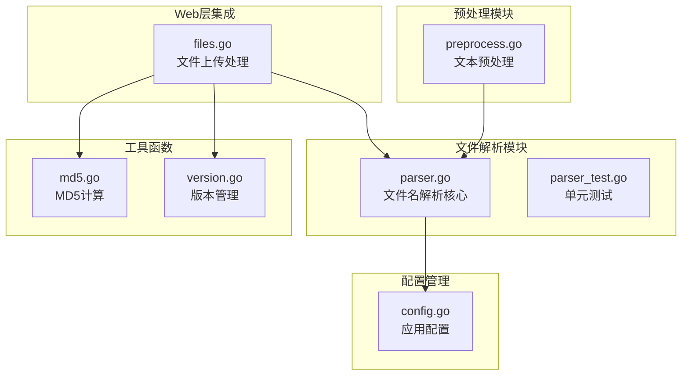
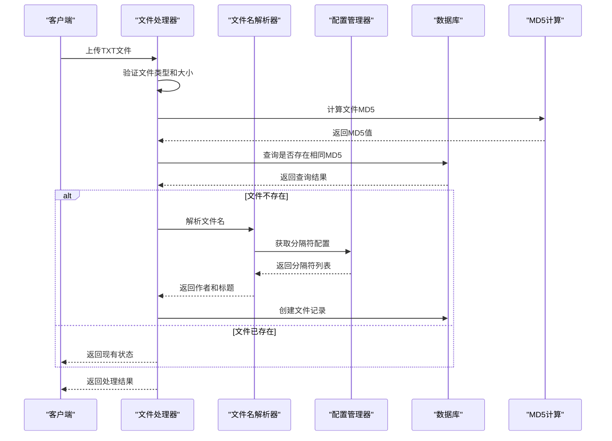
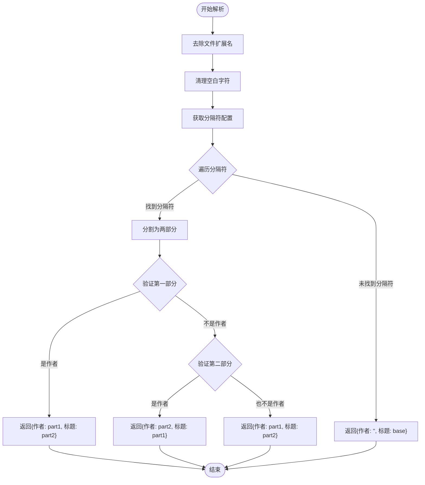
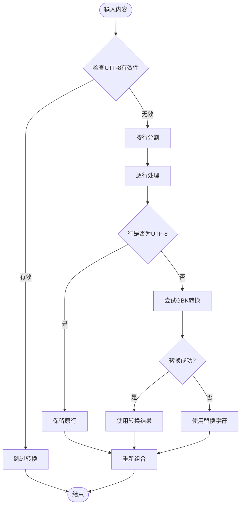
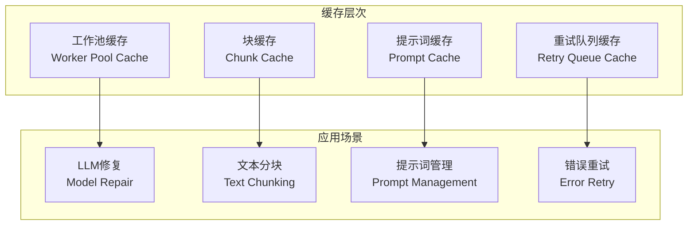
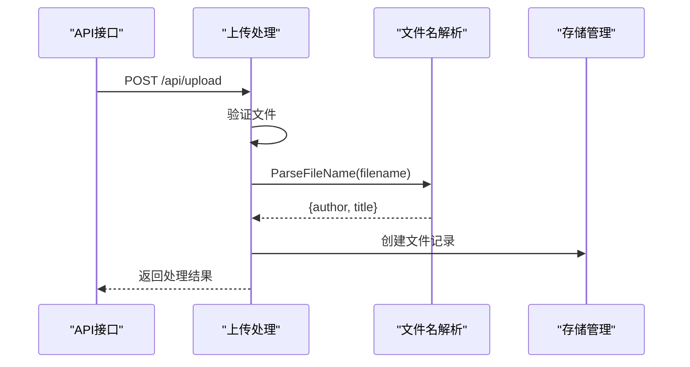
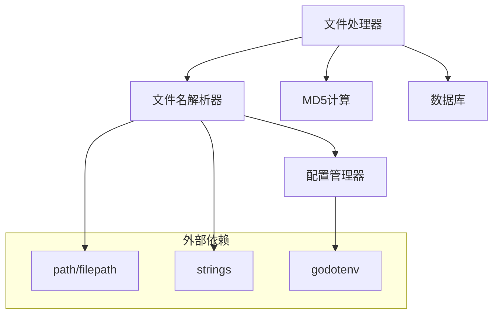

# 文件解析逻辑

<cite>
**本文档引用的文件**
- [parser.go](../../internal/file/parser.go)
- [parser_test.go](../../internal/file/parser_test.go)
- [config.go](../../internal/config/config.go)
- [files.go](../../web/backend/handlers/files.go)
- [md5.go](../../internal/file/md5.go)
- [version.go](../../internal/file/version.go)
- [preprocess.go](../../internal/processor/preprocess/preprocess.go)
- [model_repairer.go](../../internal/processor/model_repairer.go)
- [pipeline.go](../../internal/processor/pipeline.go)
- [logger.go](../../internal/logging/logger.go)
</cite>

## 目录
1. [简介](#简介)
2. [项目结构](#项目结构)
3. [核心组件](#核心组件)
4. [架构概览](#架构概览)
5. [详细组件分析](#详细组件分析)
6. [依赖分析](#依赖分析)
7. [性能考虑](#性能考虑)
8. [故障排除指南](#故障排除指南)
9. [结论](#结论)

## 简介

VoidText项目中的文件解析逻辑负责从文件名中提取作者和标题信息，这是整个文本处理流程的重要前置步骤。该功能通过智能的文件名解析算法，支持多种分隔符配置，能够准确识别中文小说类文本的作者名和书名。

## 项目结构

文件解析逻辑主要分布在以下模块中：

**图表来源**
- [parser.go:1-48](../../internal/file/parser.go#L1-L48)
- [config.go:14-44](../../internal/config/config.go#L14-L44)
- [files.go:18-71](../../web/backend/handlers/files.go#L18-L71)

**章节来源**
- [parser.go:1-48](../../internal/file/parser.go#L1-L48)
- [config.go:1-204](../../internal/config/config.go#L1-L204)

## 核心组件

### ParsedFileName 结构体
文件解析的核心输出结构，包含作者名和标题信息：
- `Author`: 提取的作者名称
- `Title`: 提取的标题名称

### ParseFileName 函数
主解析函数，实现完整的文件名解析逻辑：
1. 去除文件扩展名并清理空白字符
2. 获取配置的分隔符列表
3. 遍历分隔符进行匹配
4. 判断左右两部分是否为作者名
5. 返回解析结果

### isLikelyAuthor 函数
作者名判断逻辑，基于字符长度约束：
- 最短1个字符，最长10个字符
- 适用于中文作者名的常见长度范围

**章节来源**
- [parser.go:10-47](../../internal/file/parser.go#L10-L47)

## 架构概览

文件解析在整个系统中的位置和交互关系：

**图表来源**
- [files.go:18-71](../../web/backend/handlers/files.go#L18-L71)
- [parser.go:16-41](../../internal/file/parser.go#L16-L41)
- [config.go:124-139](../../internal/config/config.go#L124-L139)

## 详细组件分析

### 文件名解析算法

#### 解析策略
文件解析采用"分隔符匹配 + 作者名验证"的双重策略：

**图表来源**
- [parser.go:16-41](../../internal/file/parser.go#L16-L41)

#### 分隔符配置
支持的分隔符包括：
- 破折号 (`-`)
- 中文破折号 (`—`)
- 中点 (`·`)
- 波浪号 (`~`)
- 下划线 (`_`)
- 空格 (` `)

分隔符配置通过环境变量 `NAME_SEPARATORS` 进行管理，默认值为 `"-"|"—"|"·"|"·"|_| "`。

#### 作者名验证规则
作者名判断采用长度约束：
- 最短1个字符（支持单字作者）
- 最长10个字符（防止误判为标题）
- 适用于中文作者名的常见长度范围

**章节来源**
- [parser.go:16-47](../../internal/file/parser.go#L16-L47)
- [config.go:95](../../internal/config/config.go#L95)
- [config.go:124-139](../../internal/config/config.go#L124-L139)

### 文件扩展名处理

#### 扩展名识别
使用标准库 `path/filepath.Ext()` 函数进行扩展名识别：
- 自动处理各种扩展名格式
- 支持多级扩展名（如 `.tar.gz`）
- 不区分大小写处理

#### 扩展名验证
在文件上传处理中进行严格的扩展名验证：
- 仅允许 `.txt` 扩展名
- 对于其他格式返回明确的错误信息
- 防止恶意文件类型上传

**章节来源**
- [files.go:32-35](../../web/backend/handlers/files.go#L32-L35)
- [parser.go:18](../../internal/file/parser.go#L18)

### 编码转换处理

#### 预处理阶段的编码处理
虽然文件名解析本身不涉及文件内容编码，但在预处理阶段实现了完善的编码转换机制：

**图表来源**
- [preprocess.go:52-98](../../internal/processor/preprocess/preprocess.go#L52-L98)

#### 编码检测算法
采用智能编码检测算法：
- 统计UTF-8和GBK字符得分
- 基于字节模式识别编码类型
- 自适应处理混合编码内容

**章节来源**
- [preprocess.go:52-175](../../internal/processor/preprocess/preprocess.go#L52-L175)

### 错误处理和边界情况

#### 边界情况处理
1. **无分隔符文件名**：返回空作者名，完整文件名作为标题
2. **空文件名**：返回空字符串
3. **超长文件名**：按配置长度限制处理
4. **特殊字符**：自动清理和标准化

#### 错误处理策略
- 解析失败时返回安全的默认值
- 详细的日志记录便于调试
- 完善的单元测试覆盖边界情况

**章节来源**
- [parser_test.go:17-103](../../internal/file/parser_test.go#L17-L103)

### 性能优化和缓存策略

#### 解析性能优化
- 单次遍历分隔符列表，时间复杂度 O(n)
- 字符串操作使用高效算法
- 避免不必要的内存分配

#### 缓存策略
虽然文件名解析本身不需要缓存，但整个系统实现了多层次的缓存机制：

**图表来源**
- [model_repairer.go:51-74](../../internal/processor/model_repairer.go#L51-L74)

**章节来源**
- [model_repairer.go:51-74](../../internal/processor/model_repairer.go#L51-L74)

### 与其他组件的集成

#### Web层集成
文件解析在文件上传流程中的关键节点：

**图表来源**
- [files.go:18-71](../../web/backend/handlers/files.go#L18-L71)
- [parser.go:16-41](../../internal/file/parser.go#L16-L41)

#### 数据库集成
解析结果直接用于文件记录的创建和更新：
- 作者名和标题存储到数据库
- 与MD5值形成关联
- 支持后续的文件管理和检索

**章节来源**
- [files.go:158-197](../../web/backend/handlers/files.go#L158-L197)

### 日志记录和调试信息

#### 结构化日志
系统采用统一的结构化日志格式，包含：
- 时间戳和日志级别
- 事件类型和上下文信息
- 错误详情和调用栈信息

#### 调试支持
- 详细的解析过程日志
- 性能指标监控
- 错误追踪和诊断信息

**章节来源**
- [logger.go:22-37](../../internal/logging/logger.go#L22-L37)
- [logger.go:68-119](../../internal/logging/logger.go#L68-L119)

## 依赖分析

文件解析逻辑的依赖关系：

**图表来源**
- [parser.go:3-8](../../internal/file/parser.go#L3-L8)
- [config.go:3-12](../../internal/config/config.go#L3-L12)

**章节来源**
- [parser.go:3-8](../../internal/file/parser.go#L3-L8)
- [config.go:3-12](../../internal/config/config.go#L3-L12)

## 性能考虑

### 时间复杂度分析
- **解析算法**：O(n*m)，其中n为文件名长度，m为分隔符数量
- **空间复杂度**：O(n)，主要用于字符串操作
- **最佳情况**：O(n)（第一个分隔符即匹配）
- **最坏情况**：O(n*m)（遍历所有分隔符）

### 内存优化
- 使用字符串切片避免不必要的复制
- 及时释放临时变量
- 避免深层递归调用

### 缓存优化
- 工作池并发处理提升吞吐量
- 块缓存减少重复计算
- 智能分块策略优化内存使用

## 故障排除指南

### 常见问题诊断

#### 文件名解析失败
1. **检查分隔符配置**：确认 `NAME_SEPARATORS` 环境变量正确设置
2. **验证文件名格式**：确保文件名包含预期的分隔符
3. **查看日志信息**：检查解析过程中的详细日志

#### 编码问题
1. **预处理阶段**：检查编码检测算法是否正确识别
2. **转换失败**：查看GBK到UTF-8转换的具体错误
3. **混合编码**：确认混合编码内容的处理逻辑

#### 性能问题
1. **分隔符过多**：优化分隔符配置，减少不必要的匹配
2. **并发处理**：检查工作池配置和资源使用情况
3. **缓存命中率**：监控缓存效果并进行调优

**章节来源**
- [parser_test.go:17-103](../../internal/file/parser_test.go#L17-L103)
- [logger.go:123-141](../../internal/logging/logger.go#L123-L141)

## 结论

VoidText项目的文件解析逻辑设计精良，具有以下特点：

1. **智能化解析**：结合分隔符匹配和作者名验证，提高解析准确性
2. **灵活配置**：支持自定义分隔符配置，适应不同命名规范
3. **健壮性设计**：完善的错误处理和边界情况处理
4. **性能优化**：高效的算法实现和缓存策略
5. **系统集成**：与整个处理流水线无缝集成

该解析逻辑为整个文本处理系统奠定了坚实的基础，确保了后续处理步骤的准确性和可靠性。