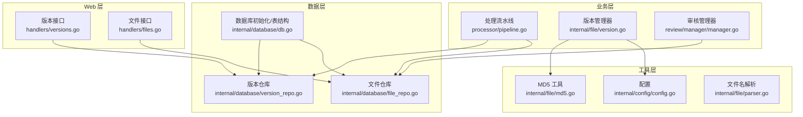
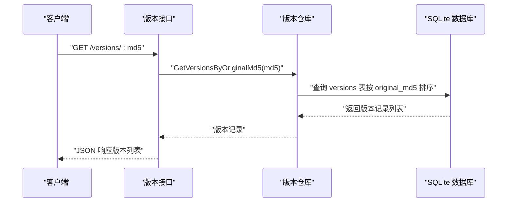
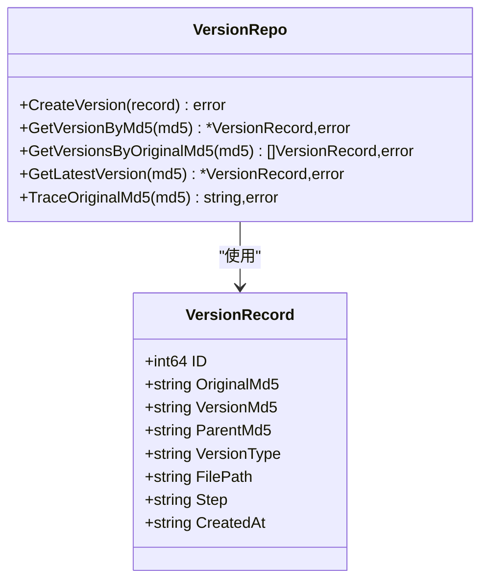
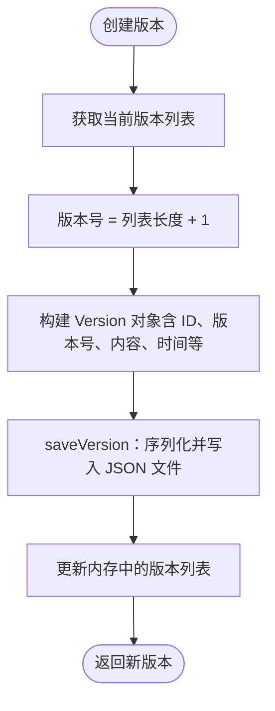
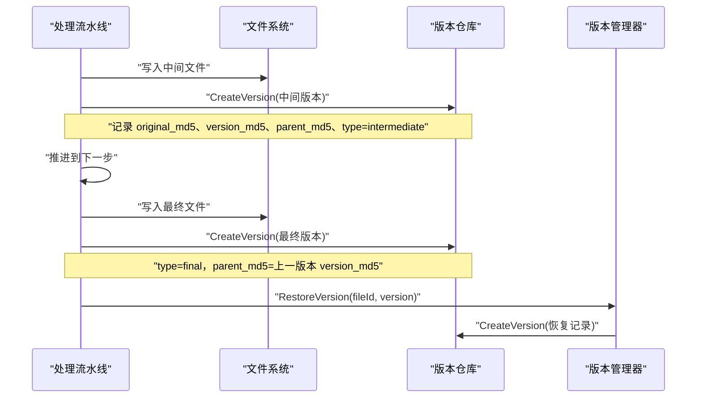
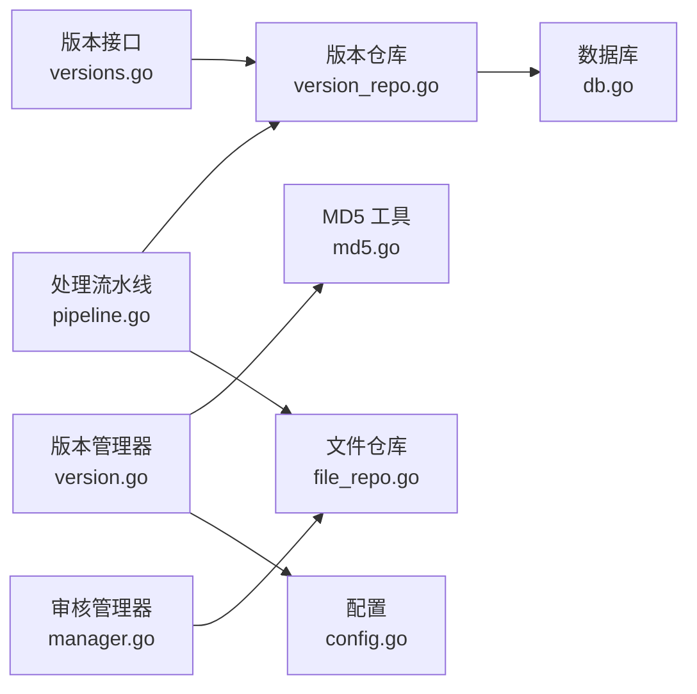

# 版本管理系统

<cite>
**本文引用的文件**
- [version_repo.go](../../internal/database/version_repo.go)
- [db.go](../../internal/database/db.go)
- [file_repo.go](../../internal/database/file_repo.go)
- [version.go](../../internal/file/version.go)
- [md5.go](../../internal/file/md5.go)
- [config.go](../../internal/config/config.go)
- [versions.go](../../web/backend/handlers/versions.go)
- [files.go](../../web/backend/handlers/files.go)
- [pipeline.go](../../internal/processor/pipeline.go)
- [parser.go](../../internal/file/parser.go)
- [manager.go](../../internal/review/manager/manager.go)
</cite>

## 目录
1. [简介](#简介)
2. [项目结构](#项目结构)
3. [核心组件](#核心组件)
4. [架构总览](#架构总览)
5. [详细组件分析](#详细组件分析)
6. [依赖关系分析](#依赖关系分析)
7. [性能考量](#性能考量)
8. [故障排查指南](#故障排查指南)
9. [结论](#结论)
10. [附录](#附录)

## 简介
本技术文档围绕 VoidText 的版本管理系统进行深入解析，覆盖文件版本的生成、存储与检索机制；版本号命名规则与递增策略；版本历史追踪与管理逻辑；版本回滚与版本比较功能实现；版本数据的持久化与索引优化；并发控制与事务处理；版本清理与归档策略；监控指标与性能分析；以及版本管理与数据库的一致性保障。文档旨在帮助开发者与运维人员全面理解版本管理子系统的实现细节与最佳实践。

## 项目结构
版本管理涉及以下关键模块：
- 数据库层：负责版本记录的持久化、查询与索引维护
- 文件层：负责版本号生成、版本内容的磁盘持久化与清理
- Web 层：提供版本列表查询等接口
- 处理流水线：在处理过程中生成中间版本与最终版本
- 审核管理：与版本链路协同，支撑版本回滚与比较

图表来源
- [versions.go:11-22](../../web/backend/handlers/versions.go#L11-L22)
- [files.go:18-71](../../web/backend/handlers/files.go#L18-L71)
- [pipeline.go:496-522](../../internal/processor/pipeline.go#L496-L522)
- [version.go:36-69](../../internal/file/version.go#L36-L69)
- [manager.go:56-89](../../internal/review/manager/manager.go#L56-L89)
- [db.go:89-222](../../internal/database/db.go#L89-L222)
- [version_repo.go:20-86](../../internal/database/version_repo.go#L20-L86)
- [file_repo.go:28-47](../../internal/database/file_repo.go#L28-L47)
- [md5.go:11-31](../../internal/file/md5.go#L11-L31)
- [config.go:14-122](../../internal/config/config.go#L14-L122)
- [parser.go:16-41](../../internal/file/parser.go#L16-L41)

章节来源
- [versions.go:11-22](../../web/backend/handlers/versions.go#L11-L22)
- [files.go:18-71](../../web/backend/handlers/files.go#L18-L71)
- [pipeline.go:496-522](../../internal/processor/pipeline.go#L496-L522)
- [version.go:36-69](../../internal/file/version.go#L36-L69)
- [manager.go:56-89](../../internal/review/manager/manager.go#L56-L89)
- [db.go:89-222](../../internal/database/db.go#L89-L222)
- [version_repo.go:20-86](../../internal/database/version_repo.go#L20-L86)
- [file_repo.go:28-47](../../internal/database/file_repo.go#L28-L47)
- [md5.go:11-31](../../internal/file/md5.go#L11-L31)
- [config.go:14-122](../../internal/config/config.go#L14-L122)
- [parser.go:16-41](../../internal/file/parser.go#L16-L41)

## 核心组件
- 版本记录模型与仓库：定义版本记录结构，提供创建、按 MD5 查询、按原始 MD5 查询版本链、查询最新版本等能力
- 版本管理器：负责版本号生成、版本内容的磁盘持久化、版本列表加载、版本恢复、版本删除、旧版本清理
- 数据库初始化与索引：SQLite 初始化、WAL 模式、连接池与生命周期、表结构与索引
- Web 接口：提供版本列表查询接口
- 处理流水线：在每个处理步骤后生成中间版本，并在最终阶段生成最终版本
- 审核管理：与版本链路协同，支撑版本回滚与比较

章节来源
- [version_repo.go:8-18](../../internal/database/version_repo.go#L8-L18)
- [version_repo.go:20-86](../../internal/database/version_repo.go#L20-L86)
- [version.go:13-27](../../internal/file/version.go#L13-L27)
- [version.go:36-69](../../internal/file/version.go#L36-L69)
- [db.go:15-69](../../internal/database/db.go#L15-L69)
- [db.go:89-222](../../internal/database/db.go#L89-L222)
- [versions.go:11-22](../../web/backend/handlers/versions.go#L11-L22)
- [pipeline.go:496-522](../../internal/processor/pipeline.go#L496-L522)

## 架构总览
版本管理采用“数据库+文件”的双层持久化策略：
- 数据库层：以 SQLite 存储版本元数据（原始 MD5、版本 MD5、父版本 MD5、类型、步骤、文件路径、创建时间）
- 文件层：以 JSON 文件形式存储版本内容，便于快速恢复与比较

图表来源
- [versions.go:11-22](../../web/backend/handlers/versions.go#L11-L22)
- [version_repo.go:55-66](../../internal/database/version_repo.go#L55-L66)

章节来源
- [versions.go:11-22](../../web/backend/handlers/versions.go#L11-L22)
- [version_repo.go:55-66](../../internal/database/version_repo.go#L55-L66)

## 详细组件分析

### 数据库层：版本记录与索引
- 版本记录结构：包含 ID、原始 MD5、版本 MD5、父版本 MD5、版本类型、文件路径、步骤、创建时间
- 版本仓库方法：
  - 创建版本记录
  - 按版本 MD5 查询
  - 按原始 MD5 查询版本链（升序）
  - 查询最新版本（降序取第一条）
  - 追溯原始 MD5（通过版本 MD5 查询）
- 数据库初始化：
  - WAL 模式提升并发读写性能
  - 单连接写入策略保证 SQLite 写入顺序
  - 建表与索引（按字段建立索引，如 version_md5、original_md5 等）

图表来源
- [version_repo.go:8-18](../../internal/database/version_repo.go#L8-L18)
- [version_repo.go:20-86](../../internal/database/version_repo.go#L20-L86)

章节来源
- [version_repo.go:8-18](../../internal/database/version_repo.go#L8-L18)
- [version_repo.go:20-86](../../internal/database/version_repo.go#L20-L86)
- [db.go:89-222](../../internal/database/db.go#L89-L222)

### 文件层：版本号生成与内容持久化
- 版本号命名规则与递增策略：
  - 版本号基于“当前版本数量 + 1”，形成自然递增序列
  - 版本 ID 由 “fileId + '_' + 版本号” 组成
- 版本内容持久化：
  - 每个版本以 JSON 文件形式保存，包含版本 ID、文件 ID、版本号、内容、大小、创建时间、备注
  - 存储目录位于配置的 DataDir/backups 下
- 版本管理器方法：
  - 创建版本、获取版本列表、获取指定版本、恢复到指定版本、删除指定版本、清理旧版本（按天数）

图表来源
- [version.go:36-69](../../internal/file/version.go#L36-L69)
- [version.go:180-197](../../internal/file/version.go#L180-L197)

章节来源
- [version.go:36-69](../../internal/file/version.go#L36-L69)
- [version.go:180-197](../../internal/file/version.go#L180-L197)
- [config.go:14-122](../../internal/config/config.go#L14-L122)

### Web 层：版本列表查询
- 提供按原始 MD5 查询版本列表的接口，返回版本记录数组
- 错误处理：内部错误返回统一 JSON 结构

章节来源
- [versions.go:11-22](../../web/backend/handlers/versions.go#L11-L22)

### 处理流水线：版本生成与回滚
- 中间版本生成：
  - 在每个处理步骤结束后，保存中间文件并创建版本记录
  - 版本 MD5 来源于中间内容的 MD5
  - 父版本 MD5 来自上一个版本的版本 MD5 或原始 MD5
- 最终版本生成：
  - 在最终化步骤生成最终文件并创建最终版本记录
- 版本回滚：
  - 通过版本管理器恢复到指定版本，同时记录一次“恢复到版本 X”的新版本

图表来源
- [pipeline.go:547-579](../../internal/processor/pipeline.go#L547-L579)
- [pipeline.go:496-522](../../internal/processor/pipeline.go#L496-L522)
- [version.go:108-123](../../internal/file/version.go#L108-L123)
- [version_repo.go:20-33](../../internal/database/version_repo.go#L20-L33)

章节来源
- [pipeline.go:547-579](../../internal/processor/pipeline.go#L547-L579)
- [pipeline.go:496-522](../../internal/processor/pipeline.go#L496-L522)
- [version.go:108-123](../../internal/file/version.go#L108-L123)
- [version_repo.go:20-33](../../internal/database/version_repo.go#L20-L33)

### 审核管理：与版本链路协同
- 审核会话与项的状态流转（pending/approved/rejected/skipped），支持获取待审核项、已批准建议等
- 审核完成后推进到下一步，最终生成最终版本
- 审核项与版本链路协同，支撑版本比较与回滚

章节来源
- [manager.go:56-89](../../internal/review/manager/manager.go#L56-L89)
- [manager.go:111-142](../../internal/review/manager/manager.go#L111-L142)
- [manager.go:178-195](../../internal/review/manager/manager.go#L178-L195)

### 版本比较与回滚实现
- 版本比较：
  - 通过版本仓库按原始 MD5 获取版本链，按创建时间排序，即可进行版本比较
  - Web 层提供版本列表查询接口，前端可据此展示版本差异
- 版本回滚：
  - 调用版本管理器的恢复方法，读取目标版本内容并创建一次“恢复到版本 X”的新版本记录

章节来源
- [version_repo.go:55-66](../../internal/database/version_repo.go#L55-L66)
- [version.go:108-123](../../internal/file/version.go#L108-L123)

### 版本清理与归档策略
- 旧版本清理：
  - 按保留天数清理过期版本，删除对应的 JSON 文件并更新内存中的版本列表
- 归档策略：
  - 通过配置项控制备份保留天数，默认值来自环境变量
  - 数据目录结构在应用启动时确保存在（uploads、backups、temp）

章节来源
- [version.go:151-178](../../internal/file/version.go#L151-L178)
- [config.go:76-77](../../internal/config/config.go#L76-L77)
- [config.go:116-122](../../internal/config/config.go#L116-L122)

### 并发控制与事务处理
- 数据库并发：
  - SQLite 启用 WAL 模式，提升并发读写性能
  - 设置 MaxOpenConns=1，确保写入顺序执行，避免并发写冲突
  - 设置连接最大存活时间，防止长时间占用
- 事务处理：
  - 建表语句使用事务批量执行，确保原子性
- 文件层并发：
  - 版本管理器使用内存缓存版本列表，减少磁盘 IO
  - 文件写入采用顺序写入，避免并发写冲突

章节来源
- [db.go:29-58](../../internal/database/db.go#L29-L58)
- [db.go:204-222](../../internal/database/db.go#L204-L222)
- [version.go:72-88](../../internal/file/version.go#L72-L88)

### 监控指标与性能分析
- 处理流水线中的监控指标：
  - 总块数、总修改数、缓存命中数、缓存未命中数
  - 缓存命中率与 API 错误率阈值触发自进化监控
- 日志记录：
  - 各步骤开始、完成、错误等事件记录日志，便于问题定位
- 性能优化：
  - SQLite WAL 模式与连接池配置
  - 索引优化（按字段建立索引）
  - 文件系统层面的顺序写入与目录结构

章节来源
- [pipeline.go:378-434](../../internal/processor/pipeline.go#L378-L434)
- [pipeline.go:292-305](../../internal/processor/pipeline.go#L292-L305)
- [db.go:89-222](../../internal/database/db.go#L89-L222)

## 依赖关系分析
- 版本仓库依赖数据库连接与 SQL 查询
- 版本管理器依赖 MD5 工具与配置
- 处理流水线在中间步骤与最终步骤分别创建版本记录
- Web 层依赖版本仓库提供版本列表查询
- 审核管理器与文件仓库协同，支撑版本链路

图表来源
- [version_repo.go:20-86](../../internal/database/version_repo.go#L20-L86)
- [db.go:13-74](../../internal/database/db.go#L13-L74)
- [version.go:36-69](../../internal/file/version.go#L36-L69)
- [md5.go:11-31](../../internal/file/md5.go#L11-L31)
- [config.go:14-122](../../internal/config/config.go#L14-L122)
- [pipeline.go:496-522](../../internal/processor/pipeline.go#L496-L522)
- [file_repo.go:28-47](../../internal/database/file_repo.go#L28-L47)
- [versions.go:11-22](../../web/backend/handlers/versions.go#L11-L22)
- [manager.go:56-89](../../internal/review/manager/manager.go#L56-L89)

章节来源
- [version_repo.go:20-86](../../internal/database/version_repo.go#L20-L86)
- [db.go:13-74](../../internal/database/db.go#L13-L74)
- [version.go:36-69](../../internal/file/version.go#L36-L69)
- [md5.go:11-31](../../internal/file/md5.go#L11-L31)
- [config.go:14-122](../../internal/config/config.go#L14-L122)
- [pipeline.go:496-522](../../internal/processor/pipeline.go#L496-L522)
- [file_repo.go:28-47](../../internal/database/file_repo.go#L28-L47)
- [versions.go:11-22](../../web/backend/handlers/versions.go#L11-L22)
- [manager.go:56-89](../../internal/review/manager/manager.go#L56-L89)

## 性能考量
- 数据库性能：
  - WAL 模式提升并发读写吞吐
  - 单连接写入策略避免 SQLite 并发写冲突
  - 索引覆盖常用查询字段（version_md5、original_md5 等）
- 文件系统性能：
  - JSON 文件顺序写入，避免随机 IO
  - 目录结构清晰，便于清理与归档
- 处理流水线性能：
  - 步骤间进度计算与日志记录，便于性能分析
  - 监控指标阈值触发自进化监控，持续优化

章节来源
- [db.go:29-58](../../internal/database/db.go#L29-L58)
- [db.go:89-222](../../internal/database/db.go#L89-L222)
- [version.go:180-197](../../internal/file/version.go#L180-L197)
- [pipeline.go:378-434](../../internal/processor/pipeline.go#L378-L434)

## 故障排查指南
- 版本查询失败：
  - 检查数据库连接与 WAL 模式配置
  - 确认版本记录是否存在且索引正常
- 版本恢复失败：
  - 检查目标版本 JSON 文件是否存在
  - 确认版本管理器内存缓存与磁盘状态一致
- 处理流水线异常：
  - 查看各步骤日志与错误记录
  - 检查文件路径与权限
- 数据库关闭：
  - 关闭前执行 WAL 检查点，确保日志写入主数据库

章节来源
- [version_repo.go:35-53](../../internal/database/version_repo.go#L35-L53)
- [version.go:108-123](../../internal/file/version.go#L108-L123)
- [db.go:77-87](../../internal/database/db.go#L77-L87)

## 结论
VoidText 的版本管理系统通过“数据库+文件”的双层持久化策略，实现了版本记录的可靠存储与高效检索；通过处理流水线在关键节点生成中间与最终版本，支撑了版本回滚与比较；通过 SQLite 的 WAL 模式与单连接写入策略，兼顾了并发性能与一致性；通过监控指标与日志记录，提供了完善的可观测性。整体设计简洁、可扩展性强，适合在生产环境中稳定运行。

## 附录
- 版本号命名规则：fileId + "_" + 自然递增版本号
- 版本类型：original、intermediate、final
- 保留策略：按配置的保留天数清理旧版本
- 相关配置项：DATA_DIR、BACKUP_KEEP_DAYS

章节来源
- [version.go:44-45](../../internal/file/version.go#L44-L45)
- [version_repo.go:13-14](../../internal/database/version_repo.go#L13-L14)
- [config.go:76-77](../../internal/config/config.go#L76-L77)