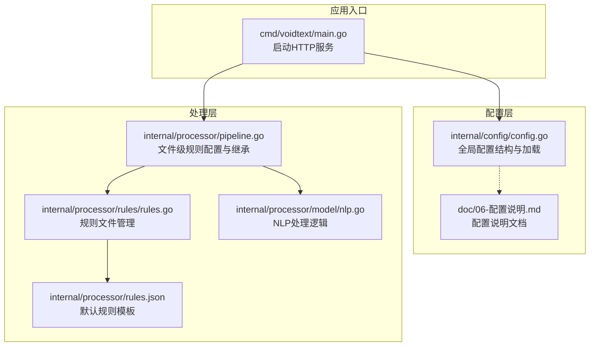
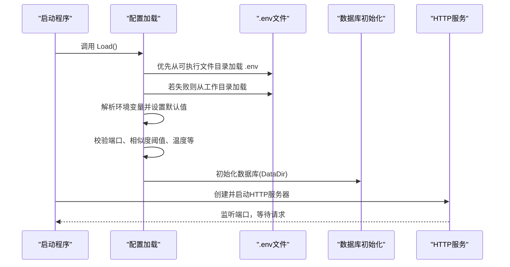
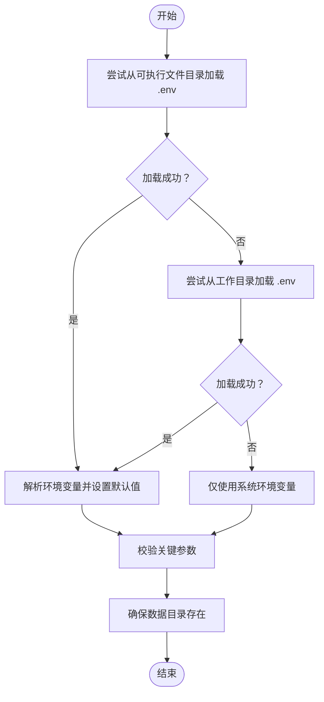
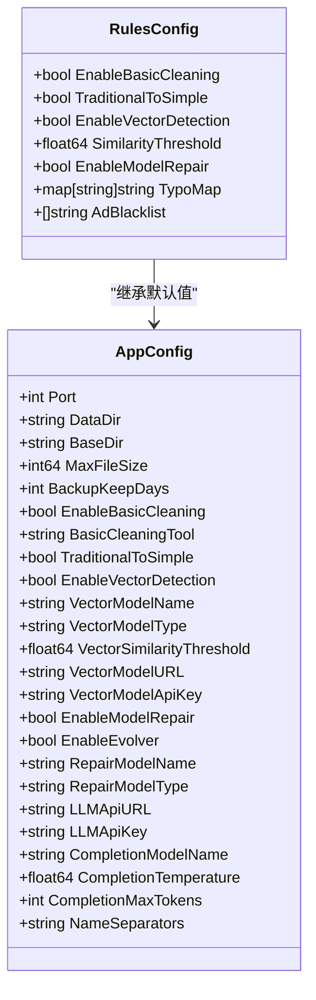
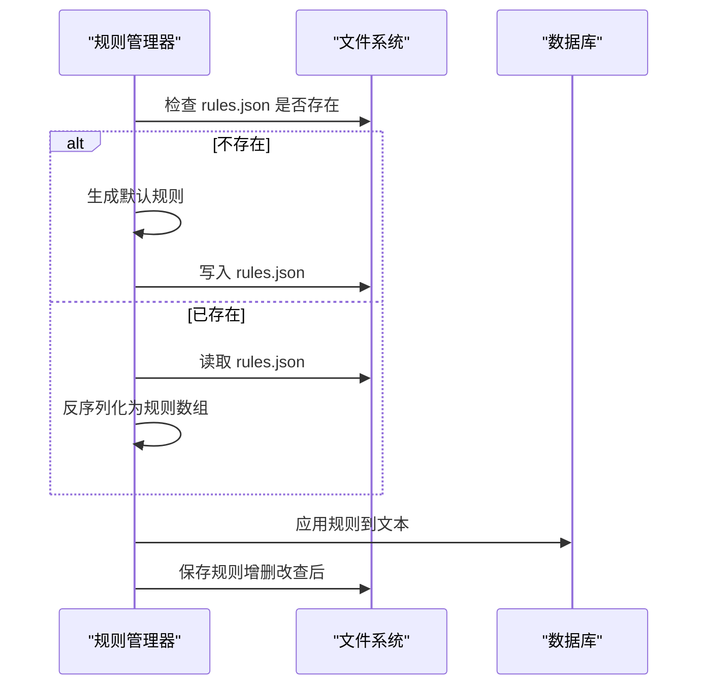
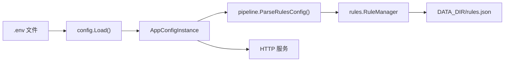

# 配置管理系统

<cite>
**本文档引用的文件**
- [config.go](../internal/config/config.go)
- [config_test.go](../internal/config/config_test.go)
- [06-配置说明.md](../doc/06-配置说明.md)
- [main.go](../cmd/voidtext/main.go)
- [rules.go](../internal/processor/rules/rules.go)
- [rules.json](../internal/processor/rules.json)
- [pipeline.go](../internal/processor/pipeline.go)
- [nlp.go](../internal/processor/model/nlp.go)
</cite>

## 目录
1. [简介](#简介)
2. [项目结构](#项目结构)
3. [核心组件](#核心组件)
4. [架构总览](#架构总览)
5. [详细组件分析](#详细组件分析)
6. [依赖关系分析](#依赖关系分析)
7. [性能考量](#性能考量)
8. [故障排除指南](#故障排除指南)
9. [结论](#结论)
10. [附录](#附录)

## 简介
本文件为 VoidText 的配置管理系统提供全面、可操作的配置文档。内容涵盖环境变量配置、处理规则配置、模型参数配置，解释配置加载机制与验证流程，明确各参数的含义、默认值与取值范围；同时给出配置文件格式与示例、热更新与运行时修改能力说明、最佳实践与安全注意事项、配置继承与覆盖规则、常见场景与故障排除指南，以及配置验证工具与测试方法。

## 项目结构
配置系统主要由以下模块组成：
- 环境变量与全局配置加载：位于 internal/config
- 处理规则配置：位于 internal/processor/rules
- 文件级规则配置（运行时）：位于 internal/processor
- Web 启动入口：cmd/voidtext/main.go
- 文档说明：doc/06-配置说明.md

图表来源
- [main.go:18-35](../cmd/voidtext/main.go#L18-L35)
- [config.go:48-122](../internal/config/config.go#L48-L122)
- [pipeline.go:37-71](../internal/processor/pipeline.go#L37-L71)
- [rules.go:35-86](../internal/processor/rules/rules.go#L35-L86)
- [rules.json:1-18](../internal/processor/rules.json#L1-L18)
- [nlp.go:25-47](../internal/processor/model/nlp.go#L25-L47)

章节来源
- [main.go:18-35](../cmd/voidtext/main.go#L18-L35)
- [config.go:48-122](../internal/config/config.go#L48-L122)
- [pipeline.go:37-71](../internal/processor/pipeline.go#L37-L71)
- [rules.go:35-86](../internal/processor/rules/rules.go#L35-L86)
- [rules.json:1-18](../internal/processor/rules.json#L1-L18)
- [nlp.go:25-47](../internal/processor/model/nlp.go#L25-L47)

## 核心组件
- 全局配置结构与加载：负责从 .env 文件加载环境变量，设置默认值，校验关键参数，并确保数据目录存在。
- 文件级规则配置：支持在数据库记录中存储 JSON 字符串，覆盖全局配置中的清洗、检测与修复行为。
- 规则文件管理：基于 DATA_DIR 下的 rules.json 文件，实现规则的增删改查与持久化。
- Web 服务启动：在启动阶段加载配置并初始化数据库，随后监听端口提供服务。

章节来源
- [config.go:14-46](../internal/config/config.go#L14-L46)
- [config.go:48-122](../internal/config/config.go#L48-L122)
- [config.go:190-203](../internal/config/config.go#L190-L203)
- [pipeline.go:37-71](../internal/processor/pipeline.go#L37-L71)
- [rules.go:35-86](../internal/processor/rules/rules.go#L35-L86)

## 架构总览
配置系统采用“环境变量 + 文件配置”的双层结构：
- 环境变量层：通过 .env 文件加载，支持默认值与类型转换，启动时一次性加载并校验。
- 文件配置层：针对单个文件的规则配置（JSON），在流水线执行时动态解析，允许覆盖全局配置。

图表来源
- [config.go:48-122](../internal/config/config.go#L48-L122)
- [main.go:18-35](../cmd/voidtext/main.go#L18-L35)

## 详细组件分析

### 环境变量配置与加载机制
- 加载顺序：优先从可执行文件所在目录加载 .env；若失败则回退到工作目录；若仍失败则仅使用系统环境变量。
- 类型转换与默认值：整数、布尔、浮点、字符串均有对应的解析函数，支持无效值回退到默认值。
- 关键参数校验：端口范围、相似度阈值范围、生成温度范围等。
- 目录准备：根据 DATA_DIR 自动创建 uploads、backups、temp 子目录。

图表来源
- [config.go:48-122](../internal/config/config.go#L48-L122)

章节来源
- [config.go:48-122](../internal/config/config.go#L48-L122)
- [config_test.go:8-161](../internal/config/config_test.go#L8-L161)

### 处理规则配置（文件级）
- 规则配置结构：包含是否启用基础清洗、繁体转简体、是否启用向量检测、相似度阈值、是否启用模型修复、错别字映射、广告黑名单等。
- 继承与覆盖：默认值来自全局配置；单个文件的规则配置可覆盖全局配置。
- 解析与回退：当 JSON 为空或解析失败时，回退到默认配置。

图表来源
- [pipeline.go:37-71](../internal/processor/pipeline.go#L37-L71)
- [config.go:14-46](../internal/config/config.go#L14-L46)

章节来源
- [pipeline.go:37-71](../internal/processor/pipeline.go#L37-L71)
- [config.go:14-46](../internal/config/config.go#L14-L46)

### 规则文件管理（rules.json）
- 默认规则：首次运行时在 DATA_DIR 下生成默认规则文件。
- 规则持久化：增删改查后自动写回 rules.json。
- 规则应用：在基础清洗步骤中对文本进行正则匹配与替换。

图表来源
- [rules.go:35-86](../internal/processor/rules/rules.go#L35-L86)
- [rules.json:1-18](../internal/processor/rules.json#L1-L18)

章节来源
- [rules.go:35-86](../internal/processor/rules/rules.go#L35-L86)
- [rules.json:1-18](../internal/processor/rules.json#L1-L18)

### 模型参数配置
- 向量检测参数：模型名称、类型（local/api）、相似度阈值、外部API地址与密钥。
- LLM修复参数：修复模型名称、类型（api/local）、外部API地址与密钥、生成温度、最大token数。
- 兼容性映射：支持 EXTERNAL_API_URL、EXTERNAL_API_KEY、EMBEDDING_MODEL_NAME 的旧变量映射到新变量。

章节来源
- [config.go:71-112](../internal/config/config.go#L71-L112)
- [06-配置说明.md:30-61](../doc/06-配置说明.md#L30-L61)
- [06-配置说明.md:114-123](../doc/06-配置说明.md#L114-L123)

## 依赖关系分析
- 配置加载依赖 godotenv 读取 .env 文件。
- 规则管理器依赖全局配置中的 DataDir 来确定规则文件位置。
- 流水线在执行时解析文件级规则配置，覆盖全局配置。
- Web 服务启动依赖配置中的端口与数据目录。

图表来源
- [config.go:48-122](../internal/config/config.go#L48-L122)
- [rules.go:35-86](../internal/processor/rules/rules.go#L35-L86)
- [pipeline.go:61-71](../internal/processor/pipeline.go#L61-L71)
- [main.go:18-35](../cmd/voidtext/main.go#L18-L35)

章节来源
- [config.go:48-122](../internal/config/config.go#L48-L122)
- [rules.go:35-86](../internal/processor/rules/rules.go#L35-L86)
- [pipeline.go:61-71](../internal/processor/pipeline.go#L61-L71)
- [main.go:18-35](../cmd/voidtext/main.go#L18-L35)

## 性能考量
- 环境变量加载仅在启动时进行，避免运行时开销。
- 规则文件读写在规则管理器内部进行，建议控制规则数量与复杂度。
- 文件级规则配置解析在流水线执行前进行，避免重复解析。
- 相似度阈值与生成温度等参数直接影响处理质量与性能，应结合业务场景合理设置。

## 故障排除指南
- 端口无效：检查 PORT 是否在 1-65535 范围内。
- 相似度阈值越界：VECTOR_SIMILARITY_THRESHOLD 必须在 0.0-1.0。
- 生成温度越界：COMPLETION_TEMPERATURE 必须在 0.0-2.0。
- .env 加载失败：确认可执行文件目录与工作目录存在 .env 文件，或使用系统环境变量。
- 规则文件损坏：删除 DATA_DIR/rules.json 后重启，系统将自动生成默认规则。
- API 密钥或地址缺失：当 VECTOR_MODEL_TYPE 或 REPAIR_MODEL_TYPE 为 api 时，必须提供相应 URL 与 API Key。

章节来源
- [config.go:190-203](../internal/config/config.go#L190-L203)
- [config_test.go:88-122](../internal/config/config_test.go#L88-L122)
- [rules.go:35-86](../internal/processor/rules/rules.go#L35-L86)

## 结论
VoidText 的配置系统通过清晰的环境变量与文件配置分层，提供了灵活且可验证的配置能力。全局配置保证系统启动一致性，文件级规则配置支持细粒度控制。配合完善的测试与文档，用户可以在不同部署环境中快速、安全地配置与运行系统。

## 附录

### 环境变量与参数说明
- 基础配置
  - PORT：服务端口，默认 8080，范围 1-65535
  - DATA_DIR：数据目录，默认 ./data
  - BASE_DIR：项目根目录，默认 .
  - MAX_FILE_SIZE：最大文件大小，默认 100MB
  - BACKUP_KEEP_DAYS：备份保留天数，默认 7
  - NAME_SEPARATORS：文件名分隔符列表，默认 “-|—|·|_| ”
- 基础文本清洗
  - ENABLE_BASIC_CLEANING：是否启用基础清洗，默认 true
  - BASIC_CLEANING_TOOL：清洗工具，默认 regex
  - TRADITIONAL_TO_SIMPLE：繁体转简体，默认 false
- 向量检测
  - ENABLE_VECTOR_DETECTION：是否启用向量检测，默认 true
  - VECTOR_MODEL_NAME：向量模型名称，默认 all-MiniLM-L6-v2
  - VECTOR_MODEL_TYPE：向量模型类型，默认 local（local/api）
  - VECTOR_SIMILARITY_THRESHOLD：相似度阈值，默认 0.95，范围 0.0-1.0
  - VECTOR_MODEL_URL：向量模型API地址（可为空）
  - VECTOR_MODEL_API_KEY：向量模型API密钥（可为空）
- LLM修复
  - ENABLE_MODEL_REPAIR：是否启用模型修复，默认 true
  - REPAIR_MODEL_NAME：修复模型名称，默认 gpt-3.5-turbo-instruct
  - REPAIR_MODEL_TYPE：修复模型类型，默认 api（api/local）
  - LLM_API_URL：LLM API地址（可为空）
  - LLM_API_KEY：LLM API密钥（可为空）
  - COMPLETION_MODEL_NAME：文本生成模型名称，默认 gpt-3.5-turbo-instruct
  - COMPLETION_TEMPERATURE：生成温度，默认 0.3，范围 0.0-2.0
  - COMPLETION_MAX_TOKENS：最大生成token数，默认 2048
- 自进化监控
  - ENABLE_EVOLVER：是否启用自进化监控，默认 false
  - BASE_DIR：项目根目录（用于定位 memory/）

章节来源
- [06-配置说明.md:7-81](../doc/06-配置说明.md#L7-L81)
- [config.go:71-112](../internal/config/config.go#L71-L112)

### 配置文件格式与示例
- .env 文件：键值对形式，支持注释（以 # 开头）。参考 doc/06-配置说明.md 中的示例。
- rules.json：规则数组，包含 id、name、pattern、replacement、description、enabled 等字段。
- 文件级规则配置（JSON）：存储于数据库记录的 rulesConfig 字段，支持覆盖全局配置。

章节来源
- [06-配置说明.md:82-113](../doc/06-配置说明.md#L82-L113)
- [rules.json:1-18](../internal/processor/rules.json#L1-L18)
- [pipeline.go:119-119](../internal/processor/pipeline.go#L119-L119)

### 配置热更新与运行时修改
- 环境变量：仅在启动时加载，无法在运行时热更新。如需更改，请重启服务。
- 文件级规则配置：可在运行时通过管理接口更新数据库记录中的 rulesConfig 字段，重启后生效。
- 规则文件：rules.json 支持运行时修改，重启后生效。

章节来源
- [config.go:48-122](../internal/config/config.go#L48-L122)
- [rules.go:74-86](../internal/processor/rules/rules.go#L74-L86)
- [pipeline.go:119-119](../internal/processor/pipeline.go#L119-L119)

### 配置验证工具与测试方法
- 单元测试：覆盖环境变量解析、默认值回退、配置校验、规则解析与持久化等场景。
- 验证流程：启动时执行 Validate() 校验关键参数；规则应用时对无效正则进行容错处理。
- 建议：在生产环境部署前，先在测试环境运行单元测试，确保配置正确。

章节来源
- [config_test.go:8-161](../internal/config/config_test.go#L8-L161)
- [rules.go:139-150](../internal/processor/rules/rules.go#L139-L150)

### 配置最佳实践与安全考虑
- 最佳实践
  - 将敏感信息（API Key）放入 .env 并加入 .gitignore。
  - 使用独立的数据目录，确保权限最小化。
  - 对于高并发场景，适当提高 COMPLETION_MAX_TOKENS 与合理设置 COMPLETION_TEMPERATURE。
  - 定期清理备份目录，避免占用过多磁盘空间。
- 安全考虑
  - 不要在日志中打印敏感信息。
  - 控制 .env 文件权限，避免泄露。
  - 使用 HTTPS 与访问控制保护 API 接口。

章节来源
- [06-配置说明.md:114-123](../doc/06-配置说明.md#L114-L123)
- [config.go:190-203](../internal/config/config.go#L190-L203)

### 配置继承与覆盖规则
- 默认值来源：全局配置（AppConfig）作为文件级规则配置（RulesConfig）的默认值。
- 覆盖方式：文件级规则配置（JSON）在流水线执行前解析，覆盖全局配置中的对应字段。
- 兼容映射：旧变量（EXTERNAL_API_URL、EXTERNAL_API_KEY、EMBEDDING_MODEL_NAME）会被映射到新变量。

章节来源
- [pipeline.go:48-71](../internal/processor/pipeline.go#L48-L71)
- [config.go:98-112](../internal/config/config.go#L98-L112)
- [06-配置说明.md:114-123](../doc/06-配置说明.md#L114-L123)