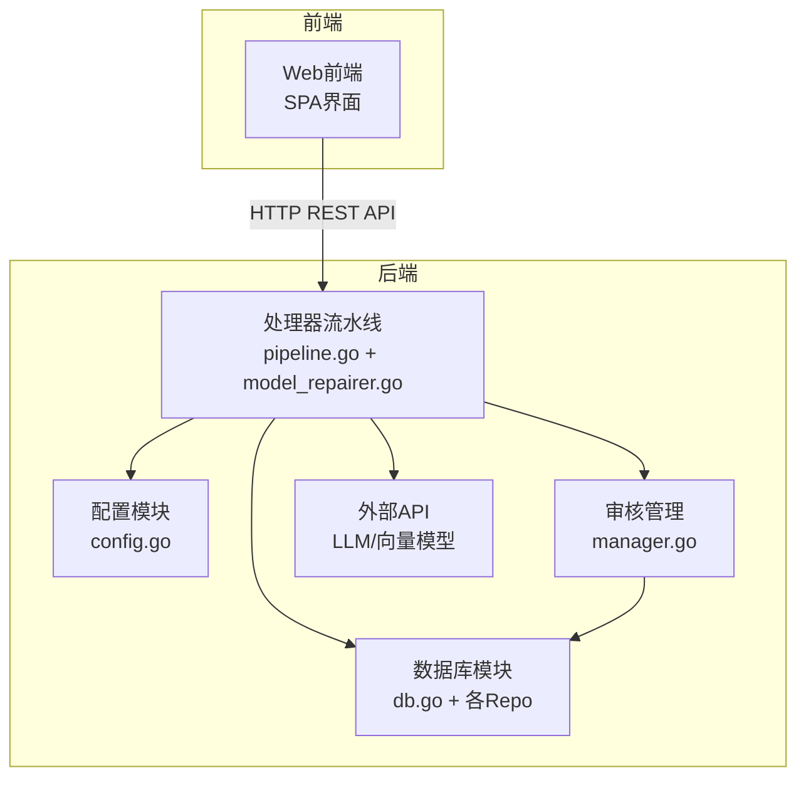
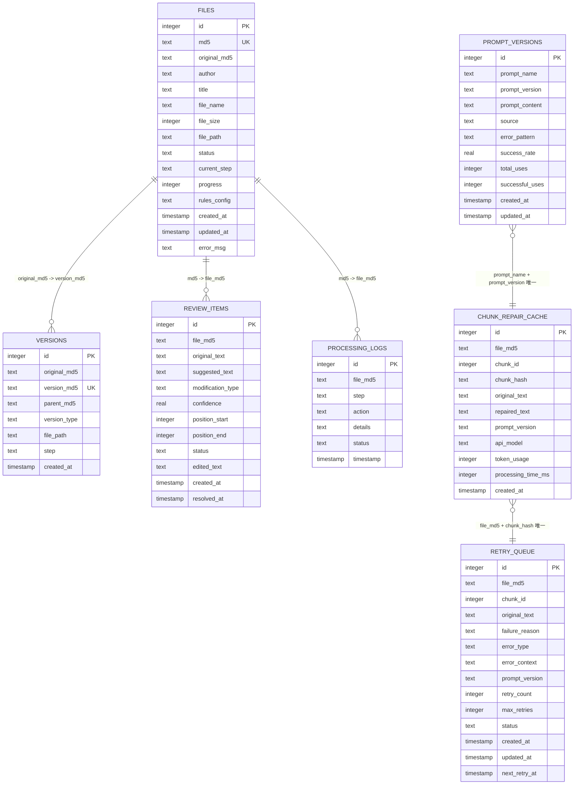
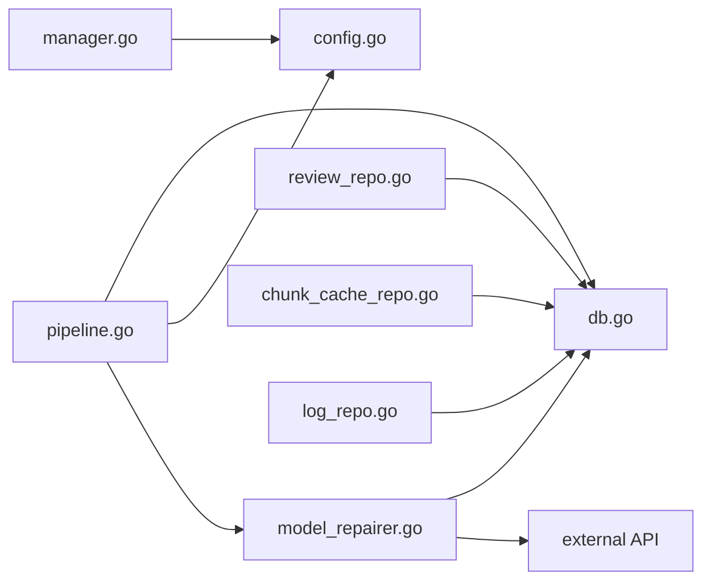

# 数据完整性与约束

<cite>
**本文档引用的文件**
- [db.go](../internal/database/db.go)
- [file_repo.go](../internal/database/file_repo.go)
- [chunk_cache_repo.go](../internal/database/chunk_cache_repo.go)
- [review_repo.go](../internal/database/review_repo.go)
- [version_repo.go](../internal/database/version_repo.go)
- [log_repo.go](../internal/database/log_repo.go)
- [pipeline.go](../internal/processor/pipeline.go)
- [model_repairer.go](../internal/processor/model_repairer.go)
- [manager.go](../internal/review/manager/manager.go)
- [config.go](../internal/config/config.go)
- [03-数据库设计.md](../doc/03-数据库设计.md)
- [02-系统架构.md](../doc/02-系统架构.md)
- [db_test.go](../internal/database/db_test.go)
- [run_smoke_tests.sh](../testing/smoking_testing/run_smoke_tests.sh)
- [run_unit_tests.sh](../testing/unit_testing/run_unit_tests.sh)
</cite>

## 目录
1. [简介](#简介)
2. [项目结构](#项目结构)
3. [核心组件](#核心组件)
4. [架构总览](#架构总览)
5. [详细组件分析](#详细组件分析)
6. [依赖分析](#依赖分析)
7. [性能考虑](#性能考虑)
8. [故障排查指南](#故障排查指南)
9. [结论](#结论)
10. [附录](#附录)

## 简介
本文件面向VoidText系统，围绕“数据完整性与约束”主题，系统化梳理数据库层面的约束机制（主键、唯一、外键、检查）、SQLite实现与性能影响；业务层的数据一致性保障（事务、回滚、幂等）、输入验证与异常处理；以及数据清理、垃圾数据处理与修复机制；并提供测试方法与验证工具、备份与灾难恢复策略。

## 项目结构
系统采用前后端分离架构，后端以Go语言实现，数据库采用SQLite，通过modernc.org/sqlite驱动连接。核心模块包括配置、数据库、文件与MD5、处理器流水线、审核管理、外部API调用与HTTP处理器。

图表来源
- [02-系统架构.md:1-205](../doc/02-系统架构.md#L1-L205)
- [config.go:1-204](../internal/config/config.go#L1-L204)
- [db.go:1-223](../internal/database/db.go#L1-L223)
- [pipeline.go:1-610](../internal/processor/pipeline.go#L1-L610)
- [model_repairer.go:1-731](../internal/processor/model_repairer.go#L1-L731)
- [manager.go:1-234](../internal/review/manager/manager.go#L1-L234)

章节来源
- [02-系统架构.md:1-205](../doc/02-系统架构.md#L1-L205)
- [config.go:1-204](../internal/config/config.go#L1-L204)

## 核心组件
- 数据库初始化与表结构：负责数据库连接、WAL模式、缓存参数、事务化建表与索引创建。
- 文件记录仓储：提供文件MD5唯一性、状态机推进、规则配置持久化。
- 版本链仓储：维护版本链，支持追溯与最终版本生成。
- 审核项仓储：批量插入、状态更新、进度统计。
- 块缓存与重试队列：缓存幂等、断点续传、指数退避重试、提示词版本演进。
- 处理流水线：步骤推进、状态更新、日志记录、异常回滚。
- 审核管理器：会话持久化、状态变更、进度统计。
- 配置模块：全局配置加载与校验，含备份保留策略。

章节来源
- [db.go:1-223](../internal/database/db.go#L1-L223)
- [file_repo.go:1-169](../internal/database/file_repo.go#L1-L169)
- [version_repo.go:1-115](../internal/database/version_repo.go#L1-L115)
- [review_repo.go:1-202](../internal/database/review_repo.go#L1-L202)
- [chunk_cache_repo.go:1-479](../internal/database/chunk_cache_repo.go#L1-L479)
- [pipeline.go:1-610](../internal/processor/pipeline.go#L1-L610)
- [manager.go:1-234](../internal/review/manager/manager.go#L1-L234)
- [config.go:1-204](../internal/config/config.go#L1-L204)

## 架构总览
数据库层面通过SQLite约束与索引实现数据完整性；业务层通过事务、幂等缓存、重试队列与状态机保障一致性；测试与运维脚本提供验证与清理能力。

图表来源
- [03-数据库设计.md:1-219](../doc/03-数据库设计.md#L1-L219)
- [db.go:89-222](../internal/database/db.go#L89-L222)
- [file_repo.go:9-26](../internal/database/file_repo.go#L9-L26)
- [review_repo.go:9-23](../internal/database/review_repo.go#L9-L23)
- [version_repo.go:8-18](../internal/database/version_repo.go#L8-L18)
- [log_repo.go:8-17](../internal/database/log_repo.go#L8-L17)
- [chunk_cache_repo.go:9-55](../internal/database/chunk_cache_repo.go#L9-L55)

## 详细组件分析

### 数据库约束与索引
- 主键约束：各表主键均为自增INTEGER，确保每条记录唯一标识。
- 唯一约束：
  - files.md5：保证同一文件内容仅记录一次，支撑幂等与去重。
  - versions.version_md5：版本唯一性。
  - chunk_repair_cache(file_md5, chunk_hash)：结合文件与块哈希，保证缓存幂等。
  - prompt_versions(prompt_name, prompt_version)：提示词版本唯一。
- 外键约束：通过字段引用与业务逻辑实现参照完整性（如versions.parent_md5指向自身version_md5，review_items.file_md5指向files.md5，processing_logs.file_md5指向files.md5）。
- 索引：为高频查询字段建立索引，提升查询性能与并发能力。

章节来源
- [03-数据库设计.md:213-219](../doc/03-数据库设计.md#L213-L219)
- [db.go:89-222](../internal/database/db.go#L89-L222)

### SQLite约束实现与性能影响
- WAL模式：提升并发读写性能，避免写入阻塞；配合单写连接序列化，平衡一致性与性能。
- 缓存与同步：增大cache_size、设置synchronous=normal，在可靠性与性能间取得平衡。
- 事务化建表：批量DDL在单事务内执行，保证原子性与一致性。
- 索引覆盖：针对md5、status、file_md5等热点字段建立索引，降低锁竞争与全表扫描。

章节来源
- [db.go:29-59](../internal/database/db.go#L29-L59)
- [db.go:188-202](../internal/database/db.go#L188-L202)

### 业务逻辑层面的数据完整性
- 事务与回滚：
  - 文件状态更新、规则配置更新、版本创建、日志记录等均通过单条SQL或事务包裹，失败即回滚。
  - 审核项批量插入、重试状态更新、提示词使用统计更新均使用事务，避免部分写入。
- 幂等性与断点续传：
  - 块缓存使用INSERT OR REPLACE与UNIQUE约束，确保重复处理不产生重复记录。
  - 通过GetUnfinishedChunks识别未完成块，支持断点续传。
- 状态机与一致性：
  - 文件状态：pending → processing → reviewing → completed 或 failed → pending（重试），保证处理流程有序。
  - 审核项状态：pending → approved/rejected/edited，resolved_at仅在最终状态写入。
- 输入验证与异常处理：
  - 配置加载与校验：端口、阈值、温度等参数范围校验。
  - 处理流程：捕获异常并写入失败状态与错误日志，保证可观测性。
  - API调用失败：记录失败原因与上下文，加入重试队列，指数退避避免雪崩。

章节来源
- [file_repo.go:93-115](../internal/database/file_repo.go#L93-L115)
- [review_repo.go:25-59](../internal/database/review_repo.go#L25-L59)
- [review_repo.go:128-161](../internal/database/review_repo.go#L128-L161)
- [chunk_cache_repo.go:67-100](../internal/database/chunk_cache_repo.go#L67-L100)
- [chunk_cache_repo.go:169-202](../internal/database/chunk_cache_repo.go#L169-L202)
- [chunk_cache_repo.go:252-272](../internal/database/chunk_cache_repo.go#L252-L272)
- [chunk_cache_repo.go:277-301](../internal/database/chunk_cache_repo.go#L277-L301)
- [chunk_cache_repo.go:346-388](../internal/database/chunk_cache_repo.go#L346-L388)
- [pipeline.go:145-158](../internal/processor/pipeline.go#L145-L158)
- [config.go:190-203](../internal/config/config.go#L190-L203)

### 数据验证规则、输入验证与异常处理策略
- 配置验证：端口范围、相似度阈值、生成温度等参数校验，防止非法配置导致异常。
- 处理流程异常：捕获错误并更新文件状态为failed，记录错误信息与处理日志。
- 审核状态变更：restore时清空resolved_at，避免状态回退导致数据不一致。
- API失败策略：记录失败原因与上下文，加入重试队列，指数退避重试，避免频繁重试。

章节来源
- [config.go:190-203](../internal/config/config.go#L190-L203)
- [pipeline.go:145-158](../internal/processor/pipeline.go#L145-L158)
- [review_repo.go:106-126](../internal/database/review_repo.go#L106-L126)
- [chunk_cache_repo.go:169-202](../internal/database/chunk_cache_repo.go#L169-L202)

### 数据清理策略、垃圾数据处理与数据修复机制
- 缓存清理：DeleteOldCache按时间窗口清理chunk_repair_cache与retry_queue已完成记录，避免无限增长。
- 重试队列：AddToRetryQueue支持指数退避，GetPendingRetries按到期时间拉取，避免过早重试。
- 提示词演进：SavePromptVersion与UpdatePromptUsage记录使用统计，支持提示词版本选择与回退。
- 数据修复：RepairTextWithFileMd5结合缓存查询与API调用，失败时回退本地修复并记录。

章节来源
- [chunk_cache_repo.go:392-420](../internal/database/chunk_cache_repo.go#L392-L420)
- [chunk_cache_repo.go:169-202](../internal/database/chunk_cache_repo.go#L169-L202)
- [chunk_cache_repo.go:277-301](../internal/database/chunk_cache_repo.go#L277-L301)
- [chunk_cache_repo.go:346-388](../internal/database/chunk_cache_repo.go#L346-L388)
- [model_repairer.go:251-320](../internal/processor/model_repairer.go#L251-L320)

### 数据完整性测试方法与验证工具
- 单元测试：覆盖数据库初始化、文件/版本/审核项/日志CRUD、状态更新、进度统计等关键路径。
- 冒烟测试：验证服务可用性、API根路径、静态资源、上传/列表/详情/内容获取、处理启动/状态/审核项、规则读写、恢复与删除等端到端流程。
- 覆盖率报告：通过go test -coverprofile生成HTML报告，辅助定位未覆盖路径。

章节来源
- [db_test.go:1-511](../internal/database/db_test.go#L1-L511)
- [run_smoke_tests.sh:1-345](../testing/smoking_testing/run_smoke_tests.sh#L1-L345)
- [run_unit_tests.sh:1-168](../testing/unit_testing/run_unit_tests.sh#L1-L168)

### 备份、恢复与灾难恢复策略
- 备份保留策略：配置项BackupKeepDays控制备份保留天数，避免无限增长。
- 数据目录：确保data、uploads、backups、temp目录存在，便于备份与恢复。
- 恢复流程：停止服务 → 备份cleaning.db → 恢复备份 → 启动服务 → 验证文件状态与版本链。

章节来源
- [config.go:76-121](../internal/config/config.go#L76-L121)
- [02-系统架构.md:181-186](../doc/02-系统架构.md#L181-L186)

## 依赖分析
- 数据库模块依赖SQLite驱动与统一DB连接；各Repo共享GetDB()获取连接。
- 处理器流水线依赖数据库、配置、文件MD5、外部API与日志模块。
- 审核管理器依赖配置与文件系统进行会话持久化。
- 外部API调用通过统一接口封装，便于替换与测试。

图表来源
- [pipeline.go:1-610](../internal/processor/pipeline.go#L1-L610)
- [model_repairer.go:1-731](../internal/processor/model_repairer.go#L1-L731)
- [db.go:1-223](../internal/database/db.go#L1-L223)
- [config.go:1-204](../internal/config/config.go#L1-L204)
- [review_repo.go:1-202](../internal/database/review_repo.go#L1-L202)
- [chunk_cache_repo.go:1-479](../internal/database/chunk_cache_repo.go#L1-L479)
- [log_repo.go:1-76](../internal/database/log_repo.go#L1-L76)
- [manager.go:1-234](../internal/review/manager/manager.go#L1-L234)

## 性能考虑
- SQLite并发：WAL模式+单写连接，读多写少场景性能优异；注意写操作串行化。
- 索引优化：为md5/status/file_md5等热点字段建立索引，减少锁竞争。
- 事务批处理：建表、批量插入、状态更新均使用事务，减少碎片与锁持有时间。
- 缓存与重试：块缓存与重试队列降低重复API调用与失败重试成本。
- 配置调优：cache_size、wal_autocheckpoint、synchronous等参数平衡性能与可靠性。

章节来源
- [db.go:29-59](../internal/database/db.go#L29-L59)
- [db.go:188-202](../internal/database/db.go#L188-L202)
- [chunk_cache_repo.go:392-420](../internal/database/chunk_cache_repo.go#L392-L420)

## 故障排查指南
- 数据库连接失败：检查数据目录权限、WAL模式与同步参数设置。
- 唯一约束冲突：确认文件MD5是否重复，检查缓存键是否正确。
- 事务失败：查看Begin/Commit错误，确认回滚逻辑是否执行。
- 审核状态异常：检查状态转换逻辑与resolved_at清空时机。
- API失败与重试：查看重试队列状态与指数退避策略，必要时调整提示词版本。
- 处理流程中断：检查处理日志与文件状态，定位具体步骤与错误信息。

章节来源
- [db.go:16-69](../internal/database/db.go#L16-L69)
- [file_repo.go:28-47](../internal/database/file_repo.go#L28-L47)
- [review_repo.go:106-126](../internal/database/review_repo.go#L106-L126)
- [chunk_cache_repo.go:169-202](../internal/database/chunk_cache_repo.go#L169-L202)
- [log_repo.go:19-33](../internal/database/log_repo.go#L19-L33)

## 结论
VoidText系统通过SQLite约束与索引、事务与幂等设计、状态机与重试机制，实现了端到端的数据完整性与一致性保障。配合完善的测试与运维脚本、备份与清理策略，系统在保证可靠性的同时兼顾性能与可维护性。

## 附录
- 测试脚本与用例：参考冒烟测试与单元测试脚本，覆盖上传、处理、审核、规则、恢复与删除等关键路径。
- 配置要点：端口、阈值、API密钥、备份保留天数等需在部署前校验与配置。

章节来源
- [run_smoke_tests.sh:1-345](../testing/smoking_testing/run_smoke_tests.sh#L1-L345)
- [run_unit_tests.sh:1-168](../testing/unit_testing/run_unit_tests.sh#L1-L168)
- [config.go:190-203](../internal/config/config.go#L190-L203)