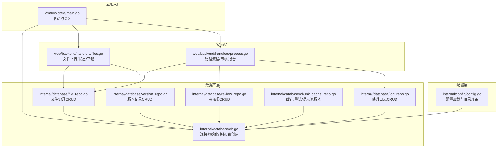

# 数据库架构概览

<cite>
**引用文件**
- [internal/database/db.go](../internal/database/db.go)
- [internal/database/file_repo.go](../internal/database/file_repo.go)
- [internal/database/version_repo.go](../internal/database/version_repo.go)
- [internal/database/review_repo.go](../internal/database/review_repo.go)
- [internal/database/log_repo.go](../internal/database/log_repo.go)
- [internal/database/chunk_cache_repo.go](../internal/database/chunk_cache_repo.go)
- [internal/config/config.go](../internal/config/config.go)
- [cmd/voidtext/main.go](../cmd/voidtext/main.go)
</cite>

## 目录
1. [架构设计](#架构设计)
2. [核心表结构](#核心表结构)
3. [仓库模式](#仓库模式)
4. [性能优化](#性能优化)
5. [数据生命周期](#数据生命周期)

## 架构设计

系统采用 SQLite 作为本地持久化存储，围绕文件处理生命周期构建数据模型。数据库启用 WAL 模式、设置同步级别、缓存大小与连接池参数，以支撑并发读写与数据安全。

## 核心表结构

| 表名 | 职责 | 关键字段 |
|------|------|----------|
| `file_records` | 文件元数据与状态 | md5, filename, status, rules, created_at |
| `version_records` | 版本链管理 | md5, original_md5, parent_md5, version_type, created_at |
| `review_items` | 审核项 | id, file_md5, original, repaired, confidence, status |
| `processing_logs` | 处理日志 | id, file_md5, step, message, level, created_at |
| `chunk_cache` | 块级修复缓存 | chunk_hash, original, repaired, model, created_at |
| `retry_queue` | 重试队列 | chunk_hash, attempts, max_attempts, next_retry |
| `prompt_versions` | 提示词版本 | version, content, metrics, created_at |

## 仓库模式

数据库层采用 Repository Pattern，每个表对应一个仓库文件：

- **db.go**：数据库初始化、连接参数、表结构创建与索引
- **file_repo.go**：FileRecord 的创建、查询、状态更新、规则更新、列表查询与删除
- **version_repo.go**：版本链维护，支持按版本 MD5 查询、按原始 MD5 查询版本链、查询最新版本
- **review_repo.go**：审核项的 CRUD、状态变更、批量操作与进度统计
- **log_repo.go**：处理日志的记录与查询
- **chunk_cache_repo.go**：块缓存、重试队列与提示词版本管理

## 性能优化

- **WAL 模式**：启用 Write-Ahead Logging，提升并发读写性能
- **连接池**：配置最大连接数与连接生命周期，避免频繁创建连接
- **索引策略**：为高频查询字段（md5、status、created_at）建立索引
- **缓存大小**：根据系统内存调整 SQLite 缓存页数
- **同步模式**：根据数据安全需求配置同步级别

## 数据生命周期

- **保留策略**：配置备份保留天数，自动清理过期数据
- **WAL 检查点**：关闭时执行检查点，确保日志落盘
- **数据目录**：统一配置数据存储路径，支持备份与迁移
