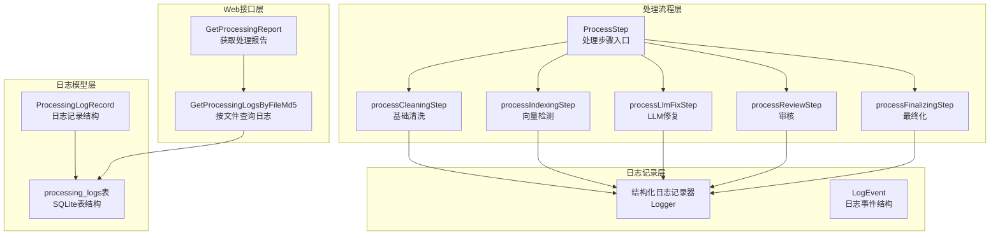
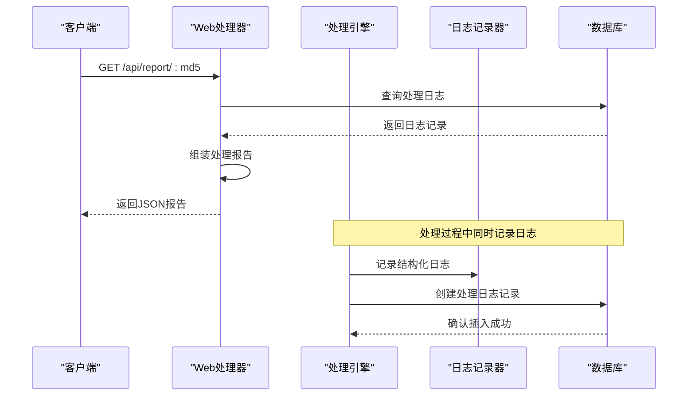
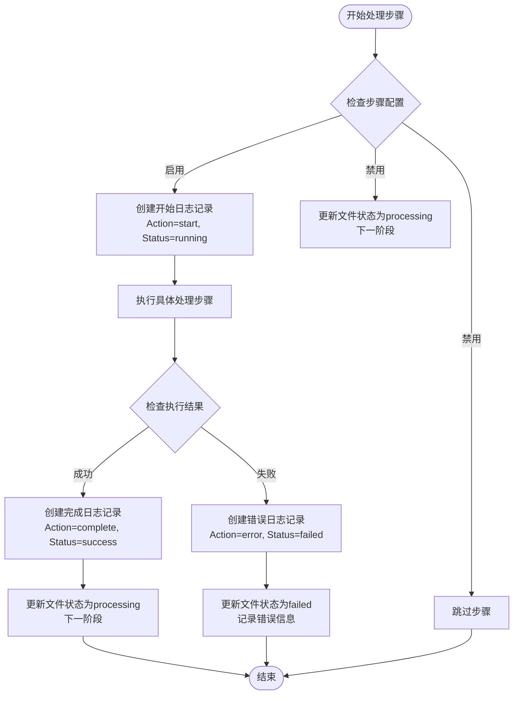
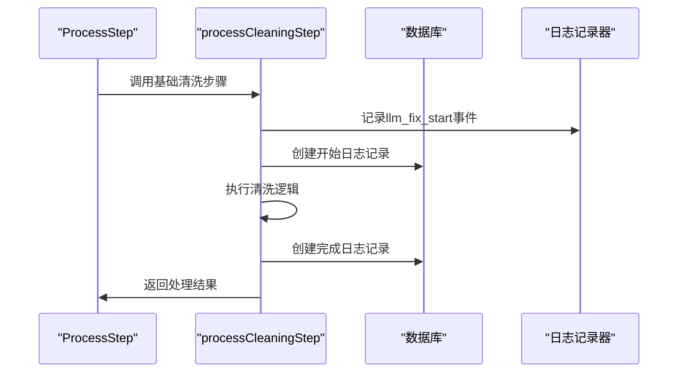
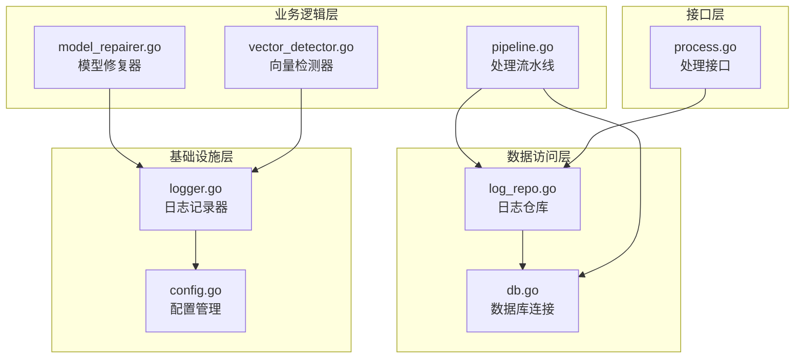

# 处理日志模型

<cite>
**本文档引用的文件**
- [log_repo.go](../../internal/database/log_repo.go)
- [db.go](../../internal/database/db.go)
- [logger.go](../../internal/logging/logger.go)
- [pipeline.go](../../internal/processor/pipeline.go)
- [process.go](../../web/backend/handlers/process.go)
- [config.go](../../internal/config/config.go)
- [model_repairer.go](../../internal/processor/model_repairer.go)
- [vector_detector.go](../../internal/processor/vector_detector.go)
</cite>

## 目录
1. [简介](#简介)
2. [项目结构](#项目结构)
3. [核心组件](#核心组件)
4. [架构概览](#架构概览)
5. [详细组件分析](#详细组件分析)
6. [依赖分析](#依赖分析)
7. [性能考虑](#性能考虑)
8. [故障排查指南](#故障排查指南)
9. [结论](#结论)
10. [附录](#附录)

## 简介
本文档详细描述VoidText系统的ProcessingLog处理日志模型，涵盖日志字段结构、记录机制、查询分析功能、配置选项及故障排查指南。该系统通过结构化日志记录处理流程的每个关键节点，支持按时间范围查询、按处理状态过滤、性能统计分析等功能，并提供日志数据的存储策略和保留周期建议。

## 项目结构
处理日志模型涉及以下关键模块：
- 数据库层：定义processing_logs表结构，提供日志创建、查询和最新日志获取功能
- 处理器层：在各处理步骤中创建日志记录，包含开始、完成、错误等动作
- 日志记录器：提供结构化日志事件，支持多种事件类型和字段
- Web处理器：提供日志查询接口，支持前端展示处理报告
- 配置层：提供系统配置，影响日志行为和存储策略

**图表来源**
- [log_repo.go:8-75](../../internal/database/log_repo.go#L8-L75)
- [db.go:132-140](../../internal/database/db.go#L132-L140)
- [pipeline.go:104-158](../../internal/processor/pipeline.go#L104-L158)
- [logger.go:22-37](../../internal/logging/logger.go#L22-L37)
- [process.go:328-377](../../web/backend/handlers/process.go#L328-L377)

**章节来源**
- [log_repo.go:1-76](../../internal/database/log_repo.go#L1-L76)
- [db.go:89-222](../../internal/database/db.go#L89-L222)
- [pipeline.go:19-27](../../internal/processor/pipeline.go#L19-L27)

## 核心组件
处理日志模型由以下核心组件构成：

### ProcessingLogRecord结构
ProcessingLogRecord是日志记录的核心数据结构，包含以下字段：
- ID：自增主键标识
- FileMd5：关联文件的MD5哈希值
- Step：处理步骤名称（cleaning、indexing、llm_fix、review、finalizing）
- Action：具体操作动作（start、complete、progress、error）
- Details：详细信息描述
- Status：处理状态（running、success、failed）
- Timestamp：日志时间戳

### 数据库表结构
processing_logs表采用SQLite存储，包含以下字段：
- id：INTEGER PRIMARY KEY AUTOINCREMENT
- file_md5：TEXT（外键关联files表）
- step：TEXT（步骤名称）
- action：TEXT（操作动作）
- details：TEXT（详细信息）
- status：TEXT（状态）
- timestamp：TIMESTAMP DEFAULT CURRENT_TIMESTAMP

### 日志记录机制
系统采用两级日志记录机制：
1. **结构化日志记录器**：记录运行时事件，包含时间、级别、事件类型等
2. **处理日志记录**：记录处理流程的关键节点和状态变化

**章节来源**
- [log_repo.go:8-17](../../internal/database/log_repo.go#L8-L17)
- [db.go:132-140](../../internal/database/db.go#L132-L140)
- [logger.go:22-37](../../internal/logging/logger.go#L22-L37)

## 架构概览
处理日志模型在整个系统中的架构位置如下：

**图表来源**
- [process.go:328-377](../../web/backend/handlers/process.go#L328-L377)
- [pipeline.go:121-157](../../internal/processor/pipeline.go#L121-L157)
- [logger.go:68-119](../../internal/logging/logger.go#L68-L119)

## 详细组件分析

### 处理日志记录流程
处理日志记录遵循统一的流程模式：

**图表来源**
- [pipeline.go:104-158](../../internal/processor/pipeline.go#L104-L158)
- [pipeline.go:199-205](../../internal/processor/pipeline.go#L199-L205)
- [pipeline.go:257-263](../../internal/processor/pipeline.go#L257-L263)
- [pipeline.go:356-365](../../internal/processor/pipeline.go#L356-L365)

### 日志字段详细说明

#### 基础字段
- **ID**：数据库自增主键，用于唯一标识每条日志记录
- **FileMd5**：关联到具体处理文件的MD5哈希值，支持按文件查询
- **Timestamp**：RFC3339格式的时间戳，默认使用服务器时间

#### 步骤字段
- **Step**：处理步骤标识，支持以下值：
  - cleaning：基础清洗步骤
  - indexing：向量检测与重复内容识别
  - llm_fix：LLM智能修复
  - review：人工审核
  - finalizing：最终文件生成

#### 动作字段
- **Action**：具体操作动作，支持以下值：
  - start：步骤开始
  - progress：处理进度更新
  - complete：步骤完成
  - error：发生错误

#### 状态字段
- **Status**：处理状态，支持以下值：
  - running：正在执行
  - success：执行成功
  - failed：执行失败

#### 详情字段
- **Details**：包含具体的处理信息，如修改数量、错误描述、统计信息等

**章节来源**
- [log_repo.go:8-17](../../internal/database/log_repo.go#L8-L17)
- [pipeline.go:19-27](../../internal/processor/pipeline.go#L19-L27)

### 日志记录器事件类型
系统提供了丰富的结构化日志事件类型：

#### 基础处理事件
- **chunk_processing**：块处理进度记录
- **cache_hit**：缓存命中事件
- **cache_miss**：缓存未命中事件
- **worker_pool**：Worker池状态监控

#### LLM修复事件
- **llm_fix_start**：LLM修复开始
- **llm_fix_completed**：LLM修复完成
- **repair_metrics**：修复性能指标

#### 错误处理事件
- **api_error**：API调用错误
- **api_refusal**：API拒绝错误
- **retry_queued**：重试队列入队
- **retry_processed**：重试处理完成

#### 提示词管理事件
- **prompt_loaded**：提示词加载完成
- **prompt_updated**：提示词版本更新
- **evolver_triggered**：Evolver自进化触发

**章节来源**
- [logger.go:165-250](../../internal/logging/logger.go#L165-L250)

### 处理流程与日志对应关系

#### 基础清洗步骤日志

**图表来源**
- [pipeline.go:161-213](../../internal/processor/pipeline.go#L161-L213)
- [pipeline.go:199-205](../../internal/processor/pipeline.go#L199-L205)

#### LLM修复步骤日志
LLM修复步骤是最复杂的日志记录场景，包含：
- 智能分块处理的统计信息
- 缓存命中率监控
- Worker池并发处理状态
- 性能指标收集

**章节来源**
- [pipeline.go:275-376](../../internal/processor/pipeline.go#L275-L376)
- [model_repairer.go:82-122](../../internal/processor/model_repairer.go#L82-L122)

### 日志查询和分析功能

#### 按文件查询日志
系统提供按文件MD5查询处理日志的功能：
- `GetProcessingLogsByFileMd5`：获取指定文件的所有处理日志
- `GetLatestProcessingLog`：获取文件最新的处理日志

#### 处理报告生成
Web处理器提供完整的处理报告功能：
- 组合文件基本信息、审核进度、处理日志和版本历史
- 支持JSON和HTML两种输出格式
- 包含详细的处理轨迹和统计信息

**章节来源**
- [log_repo.go:35-75](../../internal/database/log_repo.go#L35-L75)
- [process.go:328-377](../../web/backend/handlers/process.go#L328-L377)

## 依赖分析

### 组件耦合关系
处理日志模型的依赖关系呈现清晰的层次结构：

**图表来源**
- [log_repo.go:1-76](../../internal/database/log_repo.go#L1-L76)
- [pipeline.go:1-610](../../internal/processor/pipeline.go#L1-L610)
- [logger.go:1-250](../../internal/logging/logger.go#L1-L250)
- [process.go:1-511](../../web/backend/handlers/process.go#L1-L511)

### 外部依赖
- **SQLite驱动**：使用modernc.org/sqlite实现数据库访问
- **Gin框架**：Web接口基于Gin框架实现
- **结构化日志**：使用JSON格式记录结构化事件

**章节来源**
- [db.go:3-11](../../internal/database/db.go#L3-L11)
- [process.go:3-13](../../web/backend/handlers/process.go#L3-L13)

## 性能考虑
处理日志模型在设计时充分考虑了性能因素：

### 数据库性能优化
- **WAL模式**：启用Write-Ahead Logging模式提升并发性能
- **索引优化**：为processing_logs表建立file_md5索引
- **连接池**：设置MaxOpenConns=1确保SQLite并发安全
- **缓存配置**：设置cache_size=-10000提升查询性能

### 日志记录性能
- **异步处理**：Web接口采用异步方式启动处理流程
- **批量操作**：审核项批量更新减少数据库交互
- **缓存机制**：块级修复缓存减少重复计算

### 存储策略
- **时间戳索引**：支持高效的时间范围查询
- **状态过滤**：支持按状态快速筛选日志
- **分页查询**：避免一次性加载大量日志数据

**章节来源**
- [db.go:29-59](../../internal/database/db.go#L29-L59)
- [db.go:195-202](../../internal/database/db.go#L195-L202)

## 故障排查指南

### 常见问题诊断

#### 日志记录失败
**症状**：处理步骤无法创建日志记录
**排查步骤**：
1. 检查数据库连接状态
2. 验证processing_logs表结构
3. 确认数据库权限设置
4. 查看数据库错误日志

#### 查询性能问题
**症状**：日志查询响应缓慢
**排查步骤**：
1. 检查file_md5索引是否存在
2. 分析SQL查询执行计划
3. 考虑增加时间范围过滤
4. 优化查询条件

#### 数据一致性问题
**症状**：日志与实际处理状态不符
**排查步骤**：
1. 检查处理步骤的异常捕获机制
2. 验证错误日志的创建时机
3. 确认文件状态更新的原子性

### 配置检查清单
- **数据库配置**：确认SQLite驱动正确安装
- **目录权限**：确保数据目录可读写
- **索引状态**：验证所有必要索引已创建
- **连接参数**：检查数据库连接池配置

**章节来源**
- [db.go:16-69](../../internal/database/db.go#L16-L69)
- [process.go:16-77](../../web/backend/handlers/process.go#L16-L77)

## 结论
VoidText系统的ProcessingLog处理日志模型通过结构化的数据设计和完善的记录机制，为整个处理流程提供了完整的可追溯性。系统支持多维度的日志查询和分析，能够有效支撑故障排查和性能优化。通过合理的数据库设计和性能优化策略，系统能够在保证数据完整性的同时提供良好的查询性能。

## 附录

### 日志字段完整定义
| 字段名 | 类型 | 必填 | 描述 | 示例值 |
|--------|------|------|------|--------|
| id | INTEGER | 是 | 自增主键 | 12345 |
| file_md5 | TEXT | 是 | 文件MD5哈希 | abc123def456 |
| step | TEXT | 是 | 处理步骤 | cleaning |
| action | TEXT | 是 | 操作动作 | start |
| details | TEXT | 否 | 详细信息 | 修改数: 5 |
| status | TEXT | 是 | 处理状态 | running |
| timestamp | TIMESTAMP | 是 | 时间戳 | 2024-01-01T12:00:00Z |

### 支持的查询操作
- **按文件查询**：按file_md5字段过滤
- **按时间范围查询**：结合timestamp字段
- **按状态过滤**：按status字段筛选
- **按步骤过滤**：按step字段筛选
- **按动作过滤**：按action字段筛选

### 存储策略和保留周期
- **数据目录**：默认位于DATA_DIR/cleaning.db
- **备份策略**：支持定期备份和清理
- **索引维护**：自动维护必要的数据库索引
- **连接管理**：合理设置连接池参数

**章节来源**
- [db.go:132-140](../../internal/database/db.go#L132-L140)
- [config.go:71-122](../../internal/config/config.go#L71-L122)