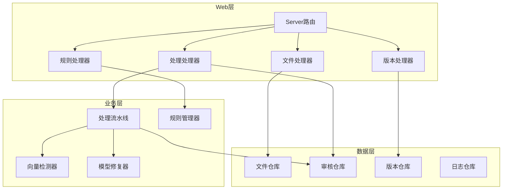

# 接口概览

<cite>
**引用文件**
- [web/backend/server.go](../../web/backend/server.go)
- [web/backend/handlers/files.go](../../web/backend/handlers/files.go)
- [web/backend/handlers/process.go](../../web/backend/handlers/process.go)
- [web/backend/handlers/rules.go](../../web/backend/handlers/rules.go)
- [web/backend/handlers/versions.go](../../web/backend/handlers/versions.go)
- [internal/config/config.go](../../internal/config/config.go)
- [internal/processor/pipeline.go](../../internal/processor/pipeline.go)
- [internal/processor/rules/rules.go](../../internal/processor/rules/rules.go)
</cite>

## 目录
1. [接口分层](#接口分层)
2. [路由总览](#路由总览)
3. [响应规范](#响应规范)
4. [错误处理](#错误处理)

## 接口分层

系统采用 RESTful API 设计，基于 Gin 框架提供 HTTP 服务：



## 路由总览

| 分类 | 方法 | 路径 | 说明 |
|------|------|------|------|
| **文件管理** | POST | `/api/files` | 上传文件 |
| | GET | `/api/files` | 文件列表 |
| | GET | `/api/files/:md5` | 文件详情 |
| | DELETE | `/api/files/:md5` | 删除文件 |
| | GET | `/api/files/:md5/download` | 下载文件 |
| **处理控制** | POST | `/api/process/:md5/start` | 开始处理 |
| | GET | `/api/process/:md5/status` | 处理状态 |
| | POST | `/api/process/:md5/review` | 提交审核 |
| | GET | `/api/process/:md5/report` | 处理报告 |
| **审核管理** | GET | `/api/review/:md5/items` | 审核项列表 |
| | POST | `/api/review/:md5/approve` | 通过审核项 |
| | POST | `/api/review/:md5/reject` | 拒绝审核项 |
| | POST | `/api/review/:md5/edit` | 编辑审核项 |
| | POST | `/api/review/:md5/batch` | 批量操作 |
| **版本管理** | GET | `/api/versions/:md5` | 版本链 |
| | POST | `/api/versions/:md5/rollback` | 回滚版本 |
| **规则管理** | GET | `/api/rules` | 规则列表 |
| | POST | `/api/rules` | 新增规则 |
| | PUT | `/api/rules/:id` | 更新规则 |
| | DELETE | `/api/rules/:id` | 删除规则 |

详细接口定义请参阅分类文档：
- [文件管理API](文件管理API.md)
- [处理控制API](处理控制API.md)
- [审核管理API](审核管理API.md)
- [版本管理API](版本管理API.md)
- [规则管理API](规则管理API.md)

## 响应规范

统一响应格式：

```json
{
  "code": 0,
  "message": "success",
  "data": {}
}
```

- `code`: 业务状态码，`0` 表示成功，非零表示错误
- `message`: 状态描述
- `data`: 响应数据，类型根据接口而定

## 错误处理

| HTTP 状态码 | 场景 |
|-------------|------|
| 400 | 请求参数错误 |
| 404 | 资源不存在 |
| 409 | 资源冲突（如文件已存在） |
| 500 | 服务器内部错误 |

错误响应示例：

```json
{
  "code": 1001,
  "message": "file not found",
  "data": null
}
```
