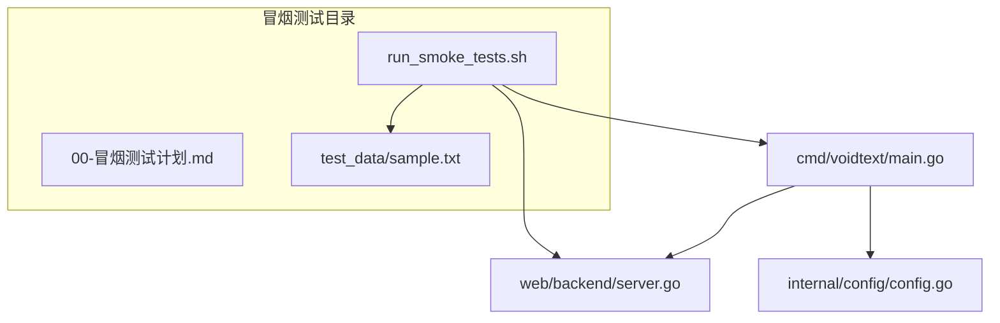
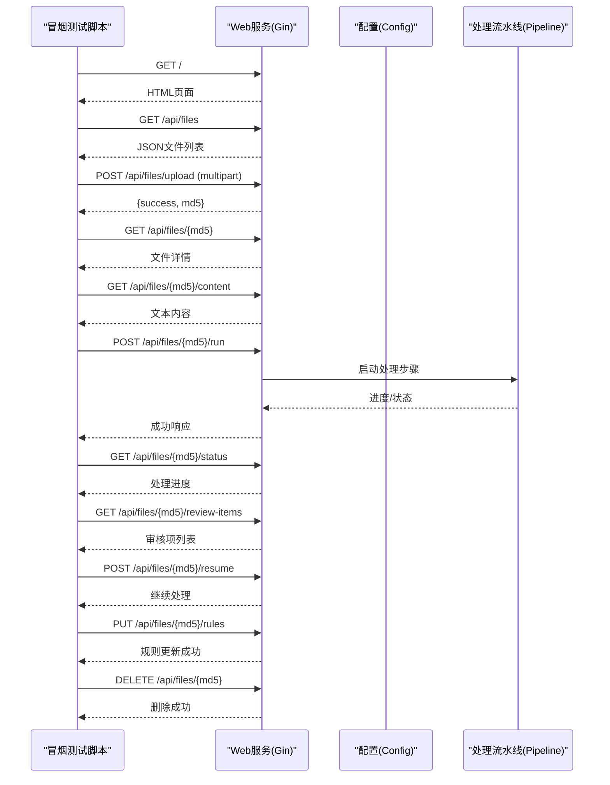
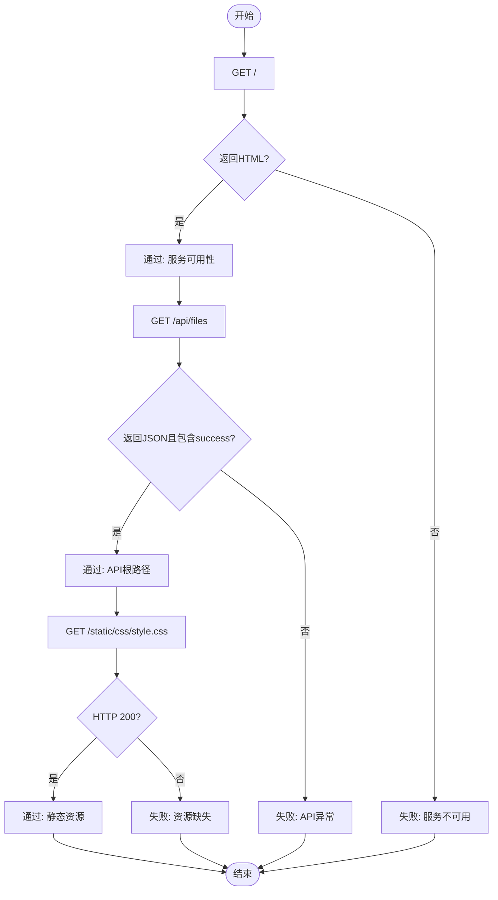
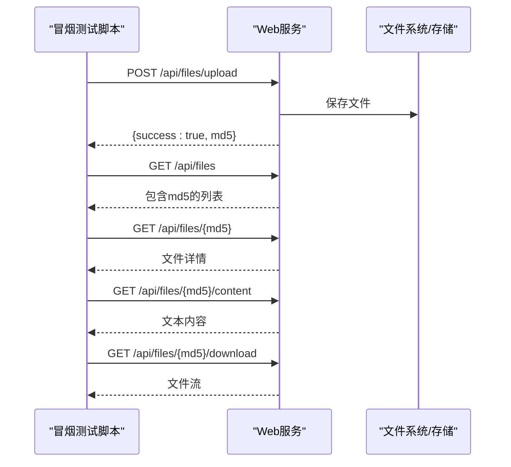
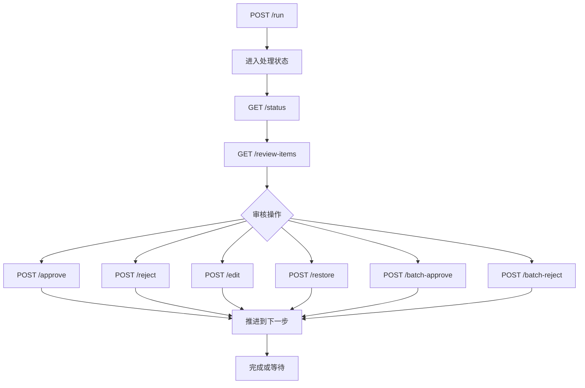
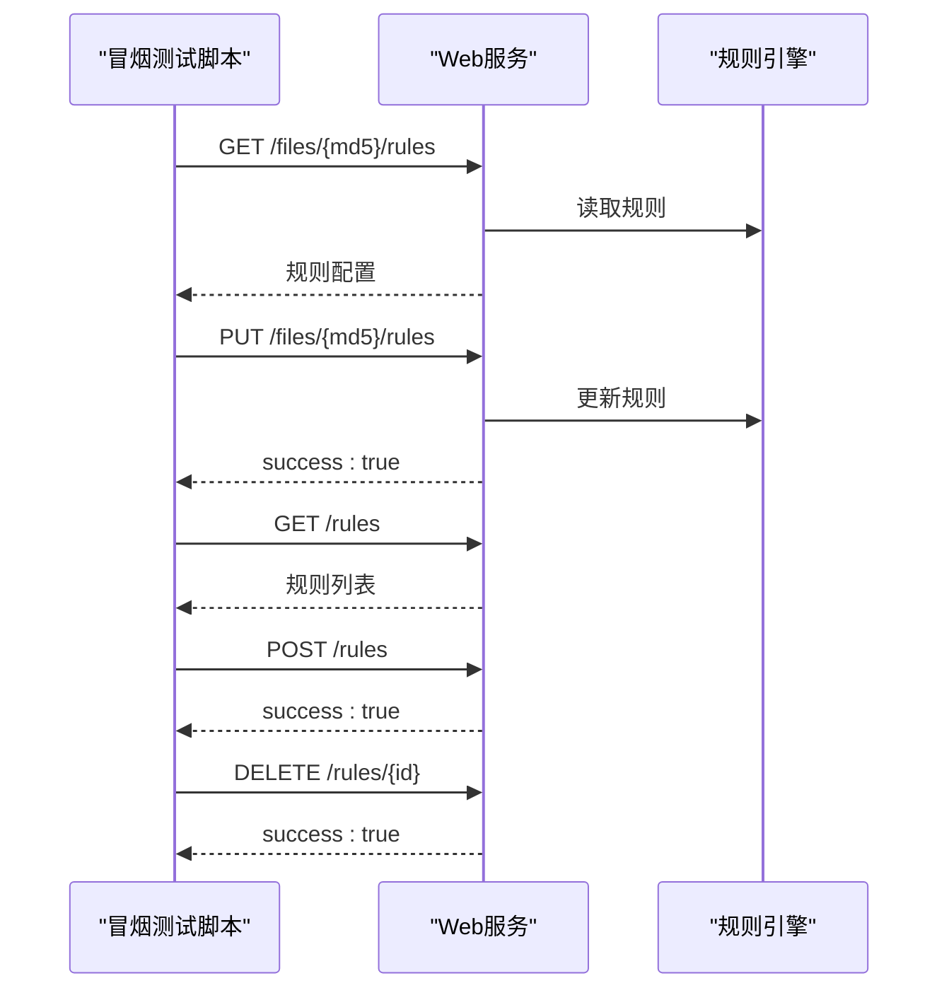
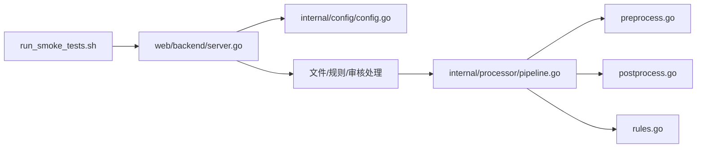

# 冒烟测试

<cite>
**本文引用的文件**
- [冒烟测试计划.md](../testing/smoking_testing/00-冒烟测试计划.md)
- [run_smoke_tests.sh](../testing/smoking_testing/run_smoke_tests.sh)
- [sample.txt](../testing/smoking_testing/test_data/sample.txt)
- [main.go](../cmd/voidtext/main.go)
- [server.go](../web/backend/server.go)
- [config.go](../internal/config/config.go)
- [pipeline.go](../internal/processor/pipeline.go)
- [preprocess.go](../internal/processor/preprocess/preprocess.go)
- [postprocess.go](../internal/processor/postprocess/postprocess.go)
- [rules.go](../internal/processor/rules/rules.go)
- [preprocess_test.go](../internal/processor/preprocess/preprocess_test.go)
- [postprocess_test.go](../internal/processor/postprocess/postprocess_test.go)
- [rules_test.go](../internal/processor/rules/rules_test.go)
- [vector_detector_test.go](../internal/processor/vector_detector_test.go)
- [单元测试计划.md](../testing/unit_testing/00-单元测试计划.md)
- [run_unit_tests.sh](../testing/unit_testing/run_unit_tests.sh)
</cite>

## 目录
1. [简介](#简介)
2. [项目结构](#项目结构)
3. [核心组件](#核心组件)
4. [架构总览](#架构总览)
5. [详细组件分析](#详细组件分析)
6. [依赖分析](#依赖分析)
7. [性能考虑](#性能考虑)
8. [故障排查指南](#故障排查指南)
9. [结论](#结论)
10. [附录](#附录)

## 简介
冒烟测试（Smoke Testing）用于快速验证系统核心功能是否正常工作，确保主要业务流程可以顺畅执行。对于 VoidText 项目，冒烟测试覆盖 Web 服务启动、静态资源访问、文件上传与处理、规则管理、审核流程以及版本报告等关键路径，保证每次构建或部署后主干功能可用。

## 项目结构
冒烟测试位于 testing/smoking_testing 目录，包含：
- 测试计划文档：定义测试范围、用例、数据与执行方式
- 自动化脚本：run_smoke_tests.sh，封装完整的测试流程
- 测试数据：sample.txt，作为上传与处理的输入样本

**图表来源**
- [run_smoke_tests.sh:1-345](../testing/smoking_testing/run_smoke_tests.sh#L1-L345)
- [main.go:1-61](../cmd/voidtext/main.go#L1-L61)
- [server.go:1-58](../web/backend/server.go#L1-L58)
- [config.go:1-204](../internal/config/config.go#L1-L204)

**章节来源**
- [冒烟测试计划.md:1-138](../testing/smoking_testing/00-冒烟测试计划.md#L1-L138)
- [run_smoke_tests.sh:1-345](../testing/smoking_testing/run_smoke_tests.sh#L1-L345)
- [sample.txt:1-12](../testing/smoking_testing/test_data/sample.txt#L1-L12)

## 核心组件
- 服务入口与配置
  - 入口程序负责加载配置、初始化数据库、启动 HTTP 服务器，并优雅关闭
  - 配置模块支持从可执行文件目录或工作目录加载 .env，设置端口、数据目录、最大文件大小、模型参数等
- Web 服务与路由
  - Gin 引擎提供 CORS 支持，静态资源映射，以及 /api 路由组下的文件、规则、审核、版本等接口
- 处理流水线
  - Pipeline 将处理步骤划分为清洗、索引、LLM 修复、审核、收尾，按步骤推进并记录进度与日志
- 预处理与后处理
  - 预处理负责编码规范化、广告移除、特殊字符清理、空白规范化
  - 后处理负责格式优化、章节整理、标点规范化
- 规则引擎
  - 规则文件持久化于数据目录，支持增删改查与应用

**章节来源**
- [main.go:18-61](../cmd/voidtext/main.go#L18-L61)
- [config.go:48-122](../internal/config/config.go#L48-L122)
- [server.go:10-57](../web/backend/server.go#L10-L57)
- [pipeline.go:19-102](../internal/processor/pipeline.go#L19-L102)
- [preprocess.go:29-50](../internal/processor/preprocess/preprocess.go#L29-L50)
- [postprocess.go:24-43](../internal/processor/postprocess/postprocess.go#L24-L43)
- [rules.go:35-86](../internal/processor/rules/rules.go#L35-L86)

## 架构总览
冒烟测试脚本通过 HTTP 请求驱动 Web 服务，依次验证：
- 服务可用性（首页）
- API 根路径（文件列表）
- 静态资源访问
- 文件上传、列表、详情、内容、下载
- 处理流程（启动、状态、审核项、恢复）
- 规则管理（获取、更新、列表、新增、删除）
- 版本与报告
- 文件删除

**图表来源**
- [run_smoke_tests.sh:69-336](../testing/smoking_testing/run_smoke_tests.sh#L69-L336)
- [server.go:24-54](../web/backend/server.go#L24-L54)
- [pipeline.go:104-158](../internal/processor/pipeline.go#L104-L158)

## 详细组件分析

### 服务可用性与静态资源
- 服务可用性：访问根路径返回前端页面
- API 根路径：访问 /api/files 返回文件列表
- 静态资源：访问 /static/css/style.css 返回样式文件

**图表来源**
- [run_smoke_tests.sh:69-109](../testing/smoking_testing/run_smoke_tests.sh#L69-L109)
- [server.go:24-26](../web/backend/server.go#L24-L26)

**章节来源**
- [冒烟测试计划.md:25-32](../testing/smoking_testing/00-冒烟测试计划.md#L25-L32)
- [run_smoke_tests.sh:69-109](../testing/smoking_testing/run_smoke_tests.sh#L69-L109)

### 文件上传与处理
- 上传测试文件：POST /api/files/upload，校验返回 success 与 md5
- 列出文件：GET /api/files，确认包含刚上传的 md5
- 获取详情：GET /api/files/{md5}
- 获取内容：GET /api/files/{md5}/content
- 下载文件：GET /api/files/{md5}/download

**图表来源**
- [run_smoke_tests.sh:111-175](../testing/smoking_testing/run_smoke_tests.sh#L111-L175)
- [server.go:30-35](../web/backend/server.go#L30-L35)

**章节来源**
- [冒烟测试计划.md:33-42](../testing/smoking_testing/00-冒烟测试计划.md#L33-L42)
- [run_smoke_tests.sh:111-175](../testing/smoking_testing/run_smoke_tests.sh#L111-L175)

### 处理流程与审核
- 启动处理：POST /api/files/{md5}/run
- 获取状态：GET /api/files/{md5}/status
- 获取审核项：GET /api/files/{md5}/review-items
- 恢复处理：POST /api/files/{md5}/resume
- 审核操作：通过/拒绝/编辑/恢复、批量通过/拒绝

**图表来源**
- [run_smoke_tests.sh:177-263](../testing/smoking_testing/run_smoke_tests.sh#L177-L263)
- [server.go:39-48](../web/backend/server.go#L39-L48)
- [pipeline.go:104-158](../internal/processor/pipeline.go#L104-L158)

**章节来源**
- [冒烟测试计划.md:43-62](../testing/smoking_testing/00-冒烟测试计划.md#L43-L62)
- [run_smoke_tests.sh:177-263](../testing/smoking_testing/run_smoke_tests.sh#L177-L263)

### 规则管理
- 获取文件规则：GET /api/files/{md5}/rules
- 更新文件规则：PUT /api/files/{md5}/rules
- 列出规则：GET /api/rules
- 添加规则：POST /api/rules
- 删除规则：DELETE /api/rules/{id}

**图表来源**
- [run_smoke_tests.sh:221-249](../testing/smoking_testing/run_smoke_tests.sh#L221-L249)
- [server.go:51-53](../web/backend/server.go#L51-L53)
- [rules.go:88-137](../internal/processor/rules/rules.go#L88-L137)

**章节来源**
- [冒烟测试计划.md:63-72](../testing/smoking_testing/00-冒烟测试计划.md#L63-L72)
- [run_smoke_tests.sh:221-249](../testing/smoking_testing/run_smoke_tests.sh#L221-L249)

### 版本与报告
- 获取版本链：GET /api/files/{md5}/versions
- 获取处理报告：GET /api/files/{md5}/report

**章节来源**
- [冒烟测试计划.md:73-79](../testing/smoking_testing/00-冒烟测试计划.md#L73-L79)

### 文件删除
- 删除文件：DELETE /api/files/{md5}

**章节来源**
- [冒烟测试计划.md:80-85](../testing/smoking_testing/00-冒烟测试计划.md#L80-L85)
- [run_smoke_tests.sh:265-277](../testing/smoking_testing/run_smoke_tests.sh#L265-L277)

## 依赖分析
冒烟测试脚本与服务端的关键依赖关系如下：
- 脚本依赖服务端路由与处理逻辑
- 服务端依赖配置模块与数据库初始化
- 处理流水线依赖预处理、后处理与规则引擎

**图表来源**
- [run_smoke_tests.sh:1-345](../testing/smoking_testing/run_smoke_tests.sh#L1-L345)
- [server.go:1-57](../web/backend/server.go#L1-L57)
- [config.go:1-204](../internal/config/config.go#L1-L204)
- [pipeline.go:1-610](../internal/processor/pipeline.go#L1-L610)
- [preprocess.go:1-250](../internal/processor/preprocess/preprocess.go#L1-L250)
- [postprocess.go:1-111](../internal/processor/postprocess/postprocess.go#L1-L111)
- [rules.go:1-151](../internal/processor/rules/rules.go#L1-L151)

**章节来源**
- [run_smoke_tests.sh:1-345](../testing/smoking_testing/run_smoke_tests.sh#L1-L345)
- [server.go:1-57](../web/backend/server.go#L1-L57)
- [config.go:1-204](../internal/config/config.go#L1-L204)
- [pipeline.go:1-610](../internal/processor/pipeline.go#L1-L610)

## 性能考虑
- 冒烟测试关注端到端可用性，不涉及性能指标测量
- 若需性能评估，可在冒烟测试基础上扩展用例，增加响应时间与吞吐量统计

## 故障排查指南
常见故障与处理建议：
- 服务无法访问：确认服务已启动（go run ./cmd/voidtext/），检查端口与防火墙
- 上传失败：检查 MAX_FILE_SIZE 配置与文件大小限制
- 处理卡住：服务重启可能导致 goroutine 丢失，点击“继续处理”恢复
- API 返回错误：检查数据库状态，必要时删除 data/cleaning.db 并重启服务

**章节来源**
- [冒烟测试计划.md:131-138](../testing/smoking_testing/00-冒烟测试计划.md#L131-L138)

## 结论
冒烟测试为 VoidText 提供了稳定可靠的快速验证机制，覆盖从服务启动到文件处理、规则管理与审核的完整主干流程。结合单元测试与冒烟测试，可在开发与持续集成阶段快速发现回归问题，保障系统稳定性与交付质量。

## 附录

### 冒烟测试与单元测试的区别与联系
- 区别
  - 冒烟测试验证端到端业务流程，侧重系统集成与用户体验
  - 单元测试验证模块内部函数与类的正确性，侧重代码级逻辑
- 联系
  - 单元测试为冒烟测试提供基础保障，模块级正确性直接影响端到端稳定性
  - 两者共同构成多层次测试体系，互补互促

**章节来源**
- [单元测试计划.md:1-163](../testing/unit_testing/00-单元测试计划.md#L1-L163)

### 测试数据准备与管理
- 测试数据：testing/smoking_testing/test_data/sample.txt
- 准备方法：确保文件存在，脚本会自动读取并上传
- 管理建议：保持样本文件简洁、典型，便于快速验证

**章节来源**
- [冒烟测试计划.md:86-96](../testing/smoking_testing/00-冒烟测试计划.md#L86-L96)
- [sample.txt:1-12](../testing/smoking_testing/test_data/sample.txt#L1-L12)

### 自动化冒烟测试脚本使用与维护
- 使用方式
  - 进入 testing/smoking_testing 目录，赋予执行权限后运行脚本
  - 可通过命令行参数指定服务地址，默认 http://localhost:8080
- 维护要点
  - 用例编号与优先级清晰标注，便于追踪与回归
  - 输出包含通过/失败计数与通过率，便于快速评估
  - 失败用例应保留响应内容以便定位问题

**章节来源**
- [冒烟测试计划.md:98-129](../testing/smoking_testing/00-冒烟测试计划.md#L98-L129)
- [run_smoke_tests.sh:1-345](../testing/smoking_testing/run_smoke_tests.sh#L1-L345)

### 冒烟测试在持续集成中的应用
- 触发时机：每次构建或部署后自动执行
- 失败策略：失败即阻断后续流程，通知相关人员
- 报告输出：结合 CI 日志与汇总统计，便于追溯

**章节来源**
- [冒烟测试计划.md:1-138](../testing/smoking_testing/00-冒烟测试计划.md#L1-L138)