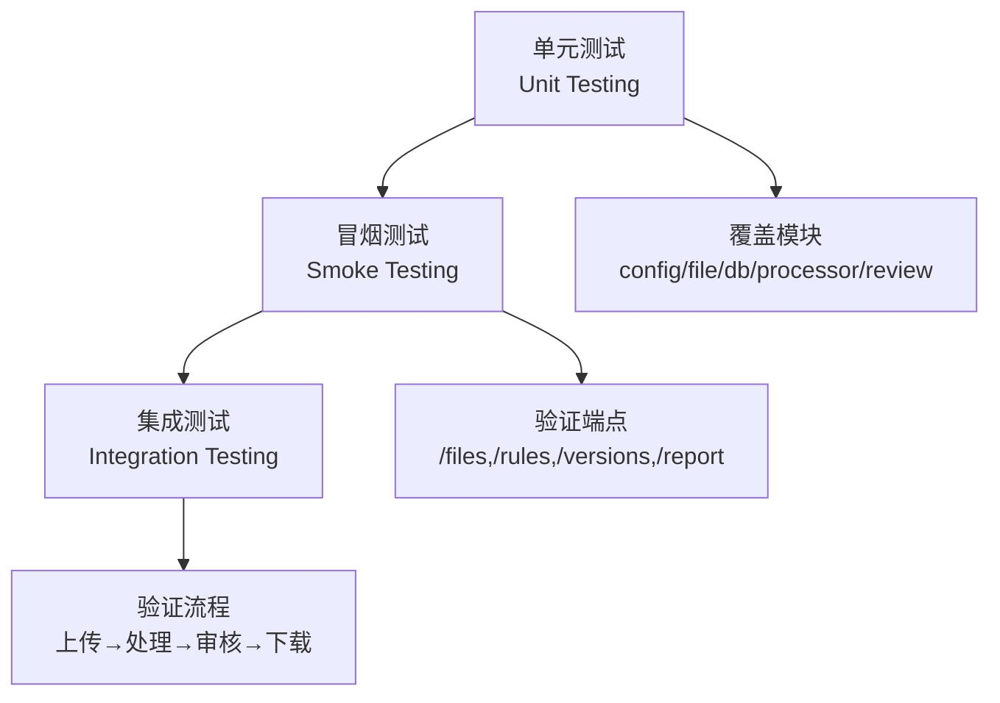

# 测试策略

<cite>
**引用文件**
- [testing/unit_testing/00-单元测试计划.md](../testing/unit_testing/00-单元测试计划.md)
- [testing/smoking_testing/00-冒烟测试计划.md](../testing/smoking_testing/00-冒烟测试计划.md)
- [testing/unit_testing/run_unit_tests.sh](../testing/unit_testing/run_unit_tests.sh)
- [testing/smoking_testing/run_smoke_tests.sh](../testing/smoking_testing/run_smoke_tests.sh)
- [internal/config/config_test.go](../internal/config/config_test.go)
- [internal/database/db_test.go](../internal/database/db_test.go)
- [internal/file/md5_test.go](../internal/file/md5_test.go)
- [internal/file/parser_test.go](../internal/file/parser_test.go)
- [internal/processor/preprocess/preprocess_test.go](../internal/processor/preprocess/preprocess_test.go)
- [internal/processor/postprocess/postprocess_test.go](../internal/processor/postprocess/postprocess_test.go)
- [internal/processor/vector_detector_test.go](../internal/processor/vector_detector_test.go)
- [internal/processor/rules/rules_test.go](../internal/processor/rules/rules_test.go)
- [internal/processor/model_repairer_test.go](../internal/processor/model_repairer_test.go)
- [internal/review/manager/manager_test.go](../internal/review/manager/manager_test.go)
</cite>

## 目录
1. [测试体系](#测试体系)
2. [单元测试](#单元测试)
3. [冒烟测试](#冒烟测试)
4. [集成测试](#集成测试)
5. [测试覆盖](#测试覆盖)
6. [自动化执行](#自动化执行)

## 测试体系

项目建立三层测试体系，覆盖从模块到系统的完整验证：

## 单元测试

针对各模块的核心逻辑进行独立测试：

| 模块 | 测试文件 | 覆盖内容 |
|------|----------|----------|
| 配置 | `config_test.go` | 默认值、环境变量覆盖、数值/布尔/浮点解析与校验 |
| 数据库 | `db_test.go` | SQLite初始化、CRUD、状态与规则更新、进度统计 |
| 文件 | `md5_test.go` | MD5计算准确性 |
| 文件 | `parser_test.go` | 文件名解析（多种分隔符）、扩展名提取 |
| 预处理 | `preprocess_test.go` | 编码检测与修复（GBK/UTF-8）、广告移除、特殊字符清理 |
| 后处理 | `postprocess_test.go` | 格式优化（段落、空白）、章节组织、标点规范化 |
| 向量检测 | `vector_detector_test.go` | 段落切分、相似度计算（余弦）、去重检测、阈值过滤 |
| 规则 | `rules_test.go` | 规则加载/增删改查、应用规则、持久化 |
| LLM修复 | `model_repairer_test.go` | 段落切分、本地修复（常见错别字）、开关控制 |
| 审核 | `manager_test.go` | 会话创建、状态变更（通过/拒绝/编辑/恢复）、批量操作、进度统计 |

## 冒烟测试

验证核心API端点的可用性：

- **文件管理**：上传、列表、详情、删除、下载
- **处理控制**：开始处理、状态查询、报告获取
- **审核管理**：审核项列表、通过/拒绝/编辑操作
- **版本管理**：版本链查询、回滚
- **规则管理**：规则列表、新增、更新、删除

## 集成测试

验证端到端处理流程：

1. 文件上传 → 获取MD5
2. 启动处理 → 轮询状态
3. 审核处理 → 提交审核结果
4. 生成文件 → 下载验证

## 测试覆盖

- **目标覆盖率**：核心模块 ≥ 80%
- **重点关注**：处理器流水线、数据库操作、API边界
- **测试数据**：位于 `testing/unit_testing/test_data/` 和 `testing/smoking_testing/test_data/`

## 自动化执行

- **单元测试脚本**：`testing/unit_testing/run_unit_tests.sh`
- **冒烟测试脚本**：`testing/smoking_testing/run_smoke_tests.sh`
- **CI/CD集成**：建议在提交前自动执行单元测试，部署前执行冒烟测试
