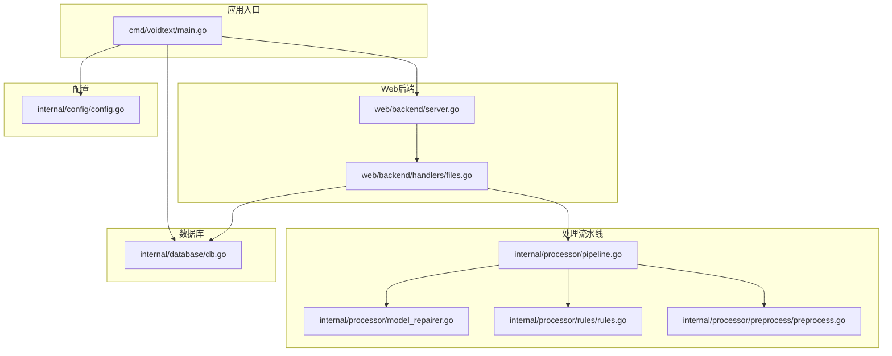
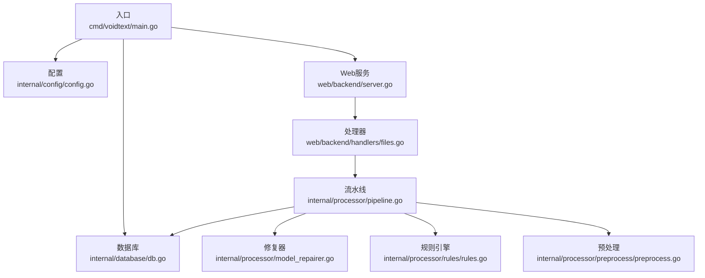
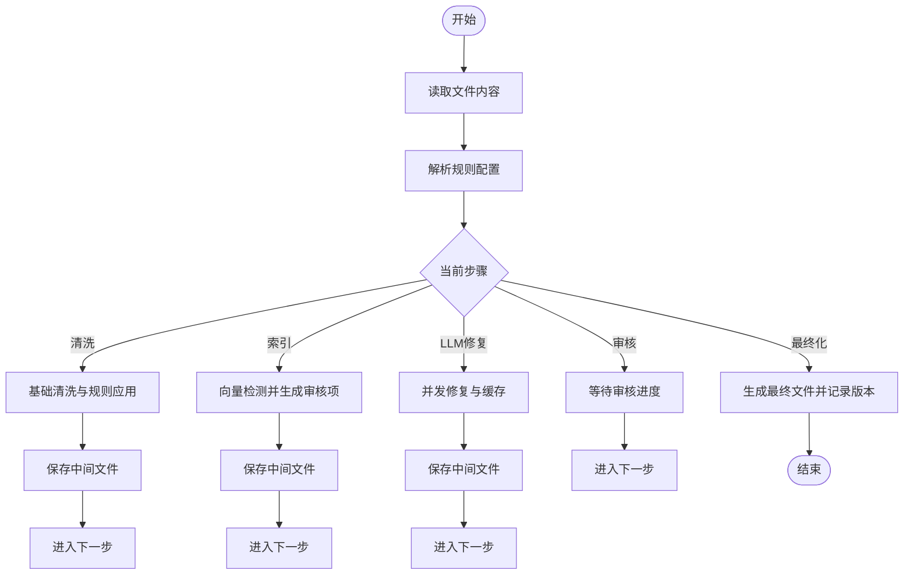
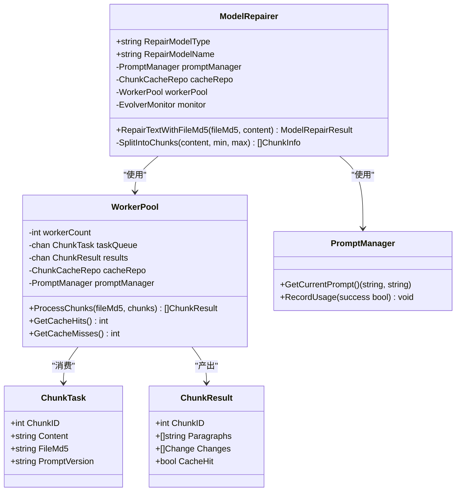
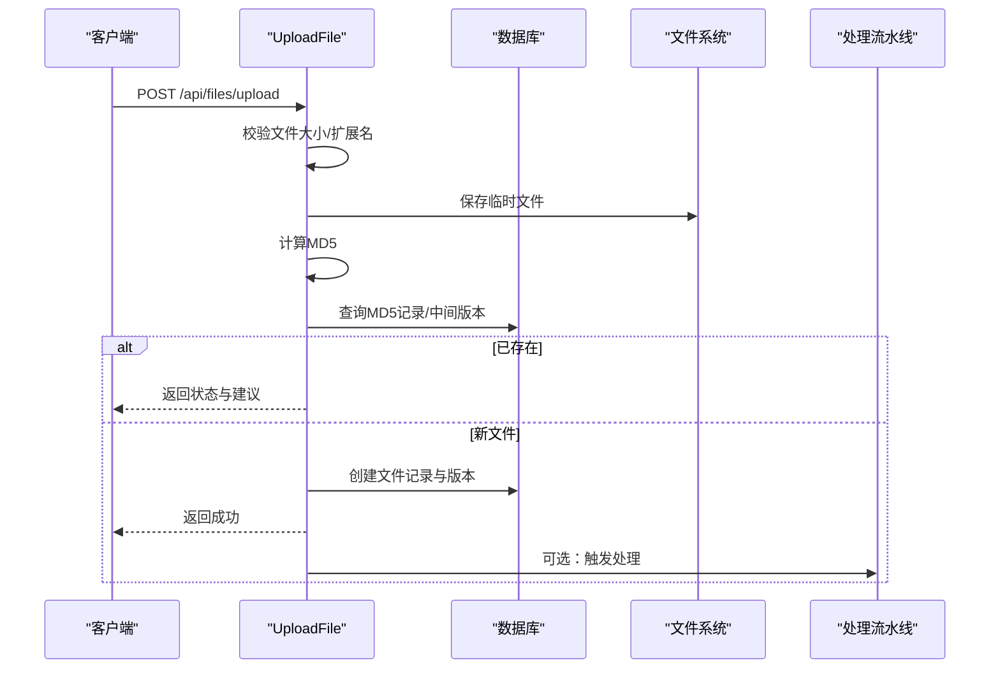
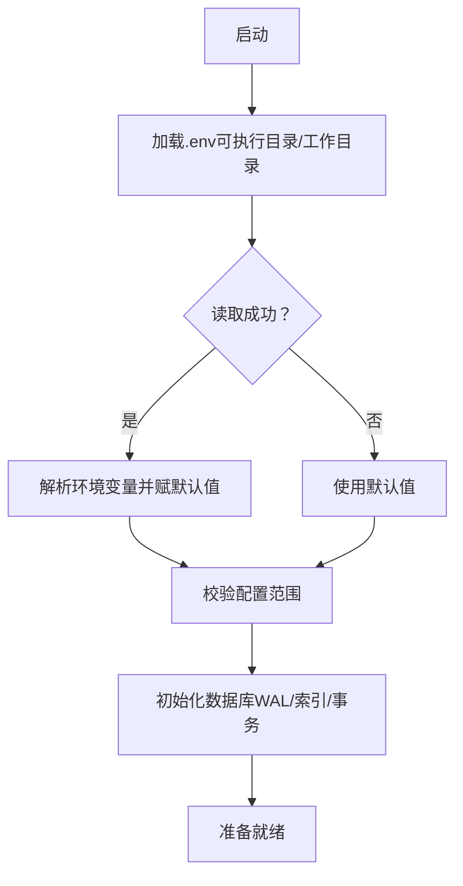
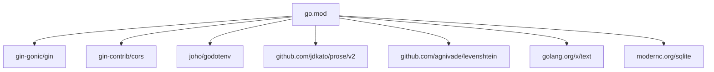

# 开发指南

<cite>
**本文引用的文件**
- [go.mod](../go.mod)
- [cmd/voidtext/main.go](../cmd/voidtext/main.go)
- [internal/config/config.go](../internal/config/config.go)
- [internal/processor/pipeline.go](../internal/processor/pipeline.go)
- [internal/processor/model_repairer.go](../internal/processor/model_repairer.go)
- [internal/processor/preprocess/preprocess.go](../internal/processor/preprocess/preprocess.go)
- [internal/processor/rules/rules.go](../internal/processor/rules/rules.go)
- [internal/database/db.go](../internal/database/db.go)
- [web/backend/server.go](../web/backend/server.go)
- [web/backend/handlers/files.go](../web/backend/handlers/files.go)
- [scripts/run.sh](../scripts/run.sh)
- [testing/unit_testing/run_unit_tests.sh](../testing/unit_testing/run_unit_tests.sh)
- [.gitignore](../.gitignore)
</cite>

## 目录
1. [简介](#简介)
2. [项目结构](#项目结构)
3. [核心组件](#核心组件)
4. [架构总览](#架构总览)
5. [详细组件分析](#详细组件分析)
6. [依赖分析](#依赖分析)
7. [性能考虑](#性能考虑)
8. [调试与开发工具](#调试与开发工具)
9. [贡献流程与代码审查](#贡献流程与代码审查)
10. [常见问题排查](#常见问题排查)
11. [结论](#结论)
12. [附录](#附录)

## 简介
本指南面向VoidText项目的开发者，提供从环境搭建、代码规范、贡献流程、调试技巧到性能与安全实践的全流程开发参考。项目采用Go语言实现，包含Web后端、文本预处理、清洗与修复流水线、数据库与版本管理、前端静态资源等模块。

## 项目结构
项目采用按领域/功能分层的包结构：
- cmd/voidtext：应用入口，负责配置加载、数据库初始化、Web服务启动与优雅关闭
- internal/config：应用配置加载与验证，支持.env与环境变量
- internal/processor：文本处理流水线与修复器，包含预处理、规则引擎、向量检测、LLM修复、工作池与缓存
- internal/database：SQLite数据库初始化、表结构与索引、版本与审核相关CRUD
- internal/file：文件解析（从文件名提取作者/标题）、MD5计算等
- web/backend：基于Gin的HTTP服务，提供REST API路由与处理器
- web/frontend：静态资源与页面
- scripts：构建与运行脚本
- testing：单元测试与冒烟测试脚本
- doc：技术文档目录与各主题文档

**图表来源**
- [cmd/voidtext/main.go:1-61](../cmd/voidtext/main.go#L1-L61)
- [internal/config/config.go:1-204](../internal/config/config.go#L1-L204)
- [internal/database/db.go:1-223](../internal/database/db.go#L1-L223)
- [web/backend/server.go:1-58](../web/backend/server.go#L1-L58)
- [web/backend/handlers/files.go:1-393](../web/backend/handlers/files.go#L1-L393)
- [internal/processor/pipeline.go:1-610](../internal/processor/pipeline.go#L1-L610)
- [internal/processor/model_repairer.go:1-731](../internal/processor/model_repairer.go#L1-L731)
- [internal/processor/preprocess/preprocess.go:1-250](../internal/processor/preprocess/preprocess.go#L1-L250)
- [internal/processor/rules/rules.go:1-151](../internal/processor/rules/rules.go#L1-L151)

**章节来源**
- [go.mod:1-54](../go.mod#L1-L54)
- [cmd/voidtext/main.go:1-61](../cmd/voidtext/main.go#L1-L61)
- [internal/config/config.go:1-204](../internal/config/config.go#L1-L204)
- [internal/database/db.go:1-223](../internal/database/db.go#L1-L223)
- [web/backend/server.go:1-58](../web/backend/server.go#L1-L58)
- [web/backend/handlers/files.go:1-393](../web/backend/handlers/files.go#L1-L393)
- [internal/processor/pipeline.go:1-610](../internal/processor/pipeline.go#L1-L610)
- [internal/processor/model_repairer.go:1-731](../internal/processor/model_repairer.go#L1-L731)
- [internal/processor/preprocess/preprocess.go:1-250](../internal/processor/preprocess/preprocess.go#L1-L250)
- [internal/processor/rules/rules.go:1-151](../internal/processor/rules/rules.go#L1-L151)

## 核心组件
- 应用入口与生命周期
  - 加载配置、初始化数据库、启动HTTP服务、优雅关闭
- 配置系统
  - 支持.env与环境变量，提供默认值与类型转换，校验端口、阈值等
- 数据库层
  - SQLite WAL模式、索引、事务建表、连接池与生命周期管理
- Web后端
  - Gin路由与CORS，文件上传/下载/列表/规则管理/处理流程控制
- 处理流水线
  - 五步流程：基础清洗、向量索引与重复检测、LLM修复、审核、最终化
- 修复器与工作池
  - 智能分块、缓存幂等、并发Worker Pool、提示词管理、Evolver监控
- 预处理与规则引擎
  - 编码规范化、广告清理、空白字符规范化、自定义正则规则

**章节来源**
- [cmd/voidtext/main.go:18-61](../cmd/voidtext/main.go#L18-L61)
- [internal/config/config.go:48-122](../internal/config/config.go#L48-L122)
- [internal/database/db.go:15-87](../internal/database/db.go#L15-L87)
- [web/backend/server.go:10-57](../web/backend/server.go#L10-L57)
- [web/backend/handlers/files.go:18-198](../web/backend/handlers/files.go#L18-L198)
- [internal/processor/pipeline.go:19-158](../internal/processor/pipeline.go#L19-L158)
- [internal/processor/model_repairer.go:19-75](../internal/processor/model_repairer.go#L19-L75)
- [internal/processor/preprocess/preprocess.go:29-50](../internal/processor/preprocess/preprocess.go#L29-L50)
- [internal/processor/rules/rules.go:28-86](../internal/processor/rules/rules.go#L28-L86)

## 架构总览
应用采用“入口-配置-数据库-服务-处理-存储”的分层架构。入口负责初始化与生命周期；配置与数据库贯穿所有模块；Web服务提供REST API；处理流水线在内存中进行文本清洗、检测与修复，并持久化中间与最终版本；前端静态资源由后端路由提供。

**图表来源**
- [cmd/voidtext/main.go:18-61](../cmd/voidtext/main.go#L18-L61)
- [internal/config/config.go:48-122](../internal/config/config.go#L48-L122)
- [internal/database/db.go:15-87](../internal/database/db.go#L15-L87)
- [web/backend/server.go:10-57](../web/backend/server.go#L10-L57)
- [web/backend/handlers/files.go:18-198](../web/backend/handlers/files.go#L18-L198)
- [internal/processor/pipeline.go:19-158](../internal/processor/pipeline.go#L19-L158)
- [internal/processor/model_repairer.go:19-75](../internal/processor/model_repairer.go#L19-L75)
- [internal/processor/rules/rules.go:28-86](../internal/processor/rules/rules.go#L28-L86)
- [internal/processor/preprocess/preprocess.go:29-50](../internal/processor/preprocess/preprocess.go#L29-L50)

## 详细组件分析

### 组件A：处理流水线（Pipeline）
- 步骤定义与顺序：清洗、索引、LLM修复、审核、最终化
- 进度计算：基于步骤序号与子步骤进度
- 中间文件与版本：每步保存中间文件并创建版本记录
- 审核与最终化：收集审核项，按批准/编辑结果生成最终文件

**图表来源**
- [internal/processor/pipeline.go:104-158](../internal/processor/pipeline.go#L104-L158)
- [internal/processor/pipeline.go:160-213](../internal/processor/pipeline.go#L160-L213)
- [internal/processor/pipeline.go:215-271](../internal/processor/pipeline.go#L215-L271)
- [internal/processor/pipeline.go:273-376](../internal/processor/pipeline.go#L273-L376)
- [internal/processor/pipeline.go:436-468](../internal/processor/pipeline.go#L436-L468)
- [internal/processor/pipeline.go:470-522](../internal/processor/pipeline.go#L470-L522)

**章节来源**
- [internal/processor/pipeline.go:19-158](../internal/processor/pipeline.go#L19-L158)
- [internal/processor/pipeline.go:160-213](../internal/processor/pipeline.go#L160-L213)
- [internal/processor/pipeline.go:215-271](../internal/processor/pipeline.go#L215-L271)
- [internal/processor/pipeline.go:273-376](../internal/processor/pipeline.go#L273-L376)
- [internal/processor/pipeline.go:436-522](../internal/processor/pipeline.go#L436-L522)

### 组件B：模型修复器与工作池（ModelRepairer/WorkerPool）
- 智能分块：按段落合并至1500-2000字符区间，保持段落完整性
- 并发修复：WorkerPool并发处理Chunk，统一提示词管理与缓存
- 缓存幂等：基于Chunk哈希查询/保存，命中即返回
- 统计与监控：缓存命中/未命中、处理耗时、提示词使用情况
- Evolver监控：根据命中率与错误率触发自进化

**图表来源**
- [internal/processor/model_repairer.go:19-75](../internal/processor/model_repairer.go#L19-L75)
- [internal/processor/model_repairer.go:526-731](../internal/processor/model_repairer.go#L526-L731)

**章节来源**
- [internal/processor/model_repairer.go:77-122](../internal/processor/model_repairer.go#L77-L122)
- [internal/processor/model_repairer.go:124-211](../internal/processor/model_repairer.go#L124-L211)
- [internal/processor/model_repairer.go:526-731](../internal/processor/model_repairer.go#L526-L731)

### 组件C：Web API与文件处理（Gin Handlers）
- 文件上传：校验大小/扩展名，MD5去重，中间版本识别，状态建议
- 列表/详情/内容/下载/删除：文件元数据与内容读写
- 规则管理：更新文件规则配置
- 处理流程：启动全步骤、查询状态、审核项管理、最终化

**图表来源**
- [web/backend/handlers/files.go:18-198](../web/backend/handlers/files.go#L18-L198)
- [internal/processor/pipeline.go:104-158](../internal/processor/pipeline.go#L104-L158)

**章节来源**
- [web/backend/handlers/files.go:18-198](../web/backend/handlers/files.go#L18-L198)
- [web/backend/server.go:28-54](../web/backend/server.go#L28-L54)

### 组件D：配置与数据库
- 配置加载：优先可执行文件目录.env，其次工作目录.env，再回退默认值
- 验证：端口、相似度阈值、温度等范围校验
- 数据库：WAL模式、索引、事务建表、连接生命周期、检查点

**图表来源**
- [internal/config/config.go:48-122](../internal/config/config.go#L48-L122)
- [internal/config/config.go:190-203](../internal/config/config.go#L190-L203)
- [internal/database/db.go:15-87](../internal/database/db.go#L15-L87)

**章节来源**
- [internal/config/config.go:48-122](../internal/config/config.go#L48-L122)
- [internal/config/config.go:190-203](../internal/config/config.go#L190-L203)
- [internal/database/db.go:89-222](../internal/database/db.go#L89-L222)

## 依赖分析
- 语言与工具
  - Go 1.25.0
  - SQLite驱动（modernc.org/sqlite）
  - Web框架（gin-gonic/gin）
  - CORS（gin-contrib/cors）
  - 环境变量加载（joho/godotenv）
  - NLP工具（jdkato/prose/v2）
  - Levenshtein距离（agnivade/levenshtein）
  - 文本编码（golang.org/x/text）

**图表来源**
- [go.mod:5-53](../go.mod#L5-L53)

**章节来源**
- [go.mod:1-54](../go.mod#L1-L54)

## 性能考虑
- 数据库并发与一致性
  - WAL模式提升并发读写能力，配合单写连接保证顺序
  - 设置缓存大小、同步模式与连接生命周期
- 文本处理
  - 智能分块（1500-2000字符），减少LLM负载
  - WorkerPool并发与缓存命中降低重复调用
- 网络与I/O
  - 静态资源由后端提供，避免跨域复杂度
  - 上传/下载使用流式处理，避免大文件内存峰值

**章节来源**
- [internal/database/db.go:29-59](../internal/database/db.go#L29-L59)
- [internal/processor/model_repairer.go:96-122](../internal/processor/model_repairer.go#L96-L122)
- [web/backend/server.go:22-26](../web/backend/server.go#L22-L26)

## 调试与开发工具
- 环境与依赖
  - 使用脚本一键安装依赖、构建与运行
  - .gitignore屏蔽构建产物、日志、数据目录与IDE文件
- 测试
  - 单元测试脚本支持模块级测试与覆盖率报告
- 调试建议
  - 启动日志与处理日志结合，定位步骤卡点
  - 分块统计与缓存命中率监控，评估修复器性能
  - 数据库检查点与WAL模式，避免锁争用导致的阻塞

**章节来源**
- [scripts/run.sh:1-14](../scripts/run.sh#L1-L14)
- [.gitignore:37-72](../.gitignore#L37-L72)
- [testing/unit_testing/run_unit_tests.sh:118-127](../testing/unit_testing/run_unit_tests.sh#L118-L127)

## 贡献流程与代码审查
- 开发环境
  - 安装Go 1.25+，克隆仓库，执行脚本安装依赖与构建
- 提交流程
  - 基于最新分支创建功能分支，编写单元测试并通过脚本验证
  - 提交前执行go fmt、go vet与go test，确保通过
- Pull Request规范
  - PR描述包含变更动机、影响范围、测试覆盖与风险说明
  - 代码审查至少一名维护者同意，确保命名、注释、复杂度与性能达标
- 代码规范（建议）
  - 包名小写、简洁；结构体字段帕斯卡；函数职责单一；错误显式返回与记录
  - 注释遵循GoDoc风格，关键算法与业务逻辑补充说明
  - 文件与目录按功能划分，避免循环依赖

[本节为通用流程建议，不直接分析具体文件，故不附“章节来源”]

## 常见问题排查
- 无法启动或端口占用
  - 检查端口配置与占用，确认配置加载成功
- 文件上传失败
  - 检查文件大小限制、扩展名、磁盘权限与临时目录
- 处理卡住或进度停滞
  - 查看处理日志与数据库状态，确认步骤与审核项
- LLM修复错误过多
  - 检查提示词版本、缓存命中率与重试队列，必要时降低并发或调整阈值
- 数据库锁或性能问题
  - 确认WAL模式启用、连接数限制与检查点策略

**章节来源**
- [internal/config/config.go:48-122](../internal/config/config.go#L48-L122)
- [web/backend/handlers/files.go:26-35](../web/backend/handlers/files.go#L26-L35)
- [internal/database/db.go:29-59](../internal/database/db.go#L29-L59)

## 结论
本指南提供了从环境搭建到开发、测试、调试与贡献的完整路径。建议在开发中持续关注配置与数据库的健壮性、处理流水线的可观测性与性能、以及代码审查的质量标准，确保系统稳定与可演进。

[本节为总结性内容，不直接分析具体文件，故不附“章节来源”]

## 附录

### A. 开发环境配置步骤
- 安装Go 1.25+
- 克隆仓库，进入根目录
- 安装依赖：执行脚本安装依赖并验证
- 构建与运行：脚本自动构建并启动应用
- 配置文件：在可执行文件同目录或工作目录放置.env，或设置环境变量

**章节来源**
- [scripts/run.sh:5-10](../scripts/run.sh#L5-L10)
- [internal/config/config.go:48-66](../internal/config/config.go#L48-L66)

### B. 代码规范与最佳实践
- 命名约定
  - 包名小写、简洁；结构体字段帕斯卡；常量/变量清晰表达意图
- 注释标准
  - 函数/导出类型提供简要说明；复杂逻辑补充背景与边界
- 代码组织
  - 按功能分层，避免跨层依赖；错误处理显式返回与记录
- 性能与安全
  - 控制并发与缓存命中；限制文件大小与扩展名；SQL使用参数化

**章节来源**
- [internal/processor/model_repairer.go:124-211](../internal/processor/model_repairer.go#L124-L211)
- [web/backend/handlers/files.go:26-35](../web/backend/handlers/files.go#L26-L35)

### C. 新功能开发模板
- 新增处理器/规则/修复器
  - 在对应包内新增文件，提供构造函数与核心方法
  - 在流水线中注册步骤与调用逻辑
  - 编写单元测试与集成测试
- 新增API
  - 在server.go注册路由，在handlers中实现业务逻辑
  - 编写请求/响应结构体与错误处理
- 数据库变更
  - 在db.go中新增表/索引，使用事务保证原子性
  - 更新迁移或初始化逻辑

**章节来源**
- [web/backend/server.go:28-54](../web/backend/server.go#L28-L54)
- [web/backend/handlers/files.go:357-376](../web/backend/handlers/files.go#L357-L376)
- [internal/database/db.go:89-222](../internal/database/db.go#L89-L222)