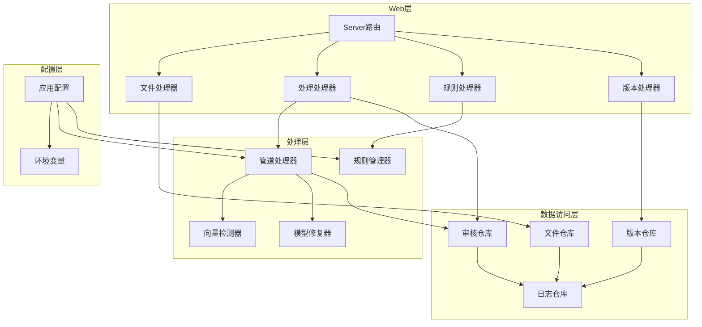
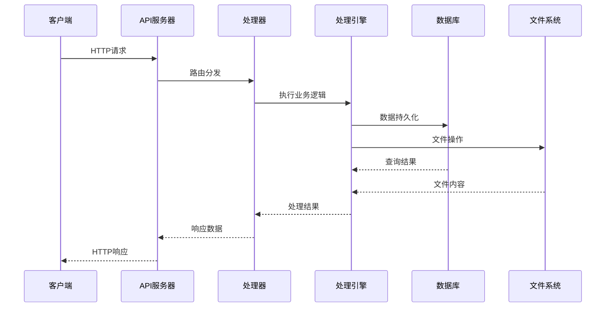
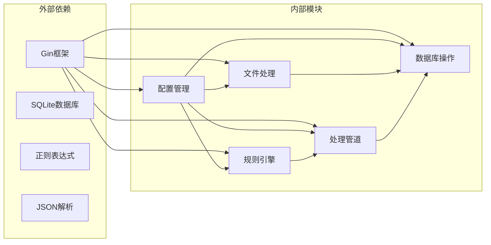
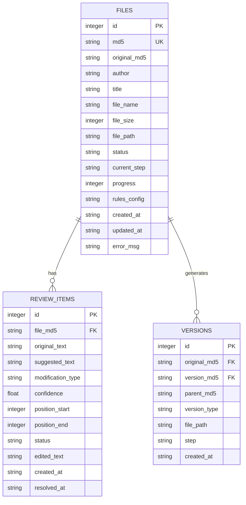

# API接口文档

<cite>
**本文档引用的文件**
- [server.go](file://web/backend/server.go)
- [files.go](file://web/backend/handlers/files.go)
- [process.go](file://web/backend/handlers/process.go)
- [rules.go](file://web/backend/handlers/rules.go)
- [versions.go](file://web/backend/handlers/versions.go)
- [config.go](file://internal/config/config.go)
- [file_repo.go](file://internal/database/file_repo.go)
- [review_repo.go](file://internal/database/review_repo.go)
- [version_repo.go](file://internal/database/version_repo.go)
- [pipeline.go](file://internal/processor/pipeline.go)
- [rules.go](file://internal/processor/rules/rules.go)
- [05-API接口.md](file://doc/05-API接口.md)
</cite>

## 目录
1. [简介](#简介)
2. [项目结构](#项目结构)
3. [核心组件](#核心组件)
4. [架构概览](#架构概览)
5. [详细组件分析](#详细组件分析)
6. [依赖关系分析](#依赖关系分析)
7. [性能考虑](#性能考虑)
8. [故障排除指南](#故障排除指南)
9. [结论](#结论)
10. [附录](#附录)

## 简介
VoidText是一个基于Go语言开发的文本清洗处理系统，提供RESTful API接口用于文件上传、处理、审核和规则管理等功能。系统采用模块化设计，支持异步处理流程和多步骤审核机制。

## 项目结构
系统采用分层架构设计，主要分为以下层次：
- Web层：处理HTTP请求和响应
- 处理层：执行文本清洗和修复逻辑
- 数据访问层：管理数据库操作
- 配置层：管理系统配置



**图表来源**
- [server.go:10-57](file://web/backend/server.go#L10-L57)
- [config.go:14-44](file://internal/config/config.go#L14-L44)

**章节来源**
- [server.go:1-58](file://web/backend/server.go#L1-L58)
- [config.go:1-204](file://internal/config/config.go#L1-L204)

## 核心组件

### API服务器
系统使用Gin框架构建RESTful API服务器，提供CORS支持和静态资源服务。

### 文件处理模块
负责文件的上传、存储、检索和删除功能，支持MD5去重和智能恢复机制。

### 处理引擎
实现五步处理流水线：基础清洗、向量索引、LLM修复、审核和最终化。

### 审核管理
提供完整的审核流程，包括单项审核、批量审核和进度跟踪。

**章节来源**
- [server.go:11-57](file://web/backend/server.go#L11-L57)
- [files.go:18-71](file://web/backend/handlers/files.go#L18-L71)
- [process.go:15-77](file://web/backend/handlers/process.go#L15-L77)

## 架构概览



**图表来源**
- [server.go:28-54](file://web/backend/server.go#L28-L54)
- [process.go:15-77](file://web/backend/handlers/process.go#L15-L77)

## 详细组件分析

### 文件管理接口

#### 文件上传
支持multipart/form-data格式的文件上传，自动进行MD5计算和去重处理。

**HTTP端点**
- 方法：POST
- 路径：`/api/files/upload`
- 内容类型：`multipart/form-data`
- 参数：`file` (文件字段)

**请求示例**
```bash
curl -X POST http://localhost:8080/api/files/upload \
  -H "Content-Type: multipart/form-data" \
  -F "file=@/path/to/file.txt"
```

**响应格式**
```json
{
  "success": true,
  "exists": false,
  "md5": "79df38754d28c2b46a3b9d4f77d67740",
  "message": "文件上传成功"
}
```

#### 文件列表查询
获取所有已上传文件的元数据信息。

**HTTP端点**
- 方法：GET
- 路径：`/api/files`

**响应格式**
```json
{
  "success": true,
  "files": [
    {
      "id": 1,
      "md5": "79df38754d28c2b46a3b9d4f77d67740",
      "author": "作者名",
      "title": "作品名",
      "fileName": "文件名.txt",
      "fileSize": 2048576,
      "status": "processing",
      "currentStep": "llm_fix",
      "progress": 60,
      "createdAt": "2026-04-19T10:00:00Z",
      "updatedAt": "2026-04-19T12:00:00Z"
    }
  ]
}
```

#### 文件详情查询
获取指定文件的完整信息。

**HTTP端点**
- 方法：GET
- 路径：`/api/files/:md5`

**路径参数**
- `md5`：文件MD5标识符

#### 文件内容获取
读取文件的原始内容。

**HTTP端点**
- 方法：GET
- 路径：`/api/files/:md5/content`

#### 文件下载
下载处理后的文件。

**HTTP端点**
- 方法：GET
- 路径：`/api/files/:md5/download`

#### 文件删除
删除文件记录和相关数据。

**HTTP端点**
- 方法：DELETE
- 路径：`/api/files/:md5`
- 查询参数：`keepFile=true` (保留文件系统中的实际文件)

#### 文件恢复
恢复文件的处理状态。

**HTTP端点**
- 方法：POST
- 路径：`/api/files/:md5/resume`

**支持的恢复场景**
- `processing`: 重置为pending，保留current_step
- `failed`: 重置为pending，保留current_step
- `completed`: 清除审核记录，重置为pending

**章节来源**
- [files.go:18-393](file://web/backend/handlers/files.go#L18-L393)

### 处理接口

#### 开始处理
启动异步处理流程，按顺序执行清洗、索引、LLM修复和审核步骤。

**HTTP端点**
- 方法：POST
- 路径：`/api/files/:md5/run`

**响应格式**
```json
{
  "success": true,
  "message": "处理已启动"
}
```

#### 获取处理状态
查询文件的当前处理状态和进度。

**HTTP端点**
- 方法：GET
- 路径：`/api/files/:md5/status`

**响应格式**
```json
{
  "success": true,
  "md5": "79df38754d28c2b46a3b9d4f77d67740",
  "status": "processing",
  "currentStep": "llm_fix",
  "progress": 60,
  "errorMsg": "",
  "author": "作者名",
  "title": "作品名",
  "fileName": "文件名.txt",
  "currentAction": "正在修复段落 5/100",
  "reviewTotal": 100,
  "reviewResolved": 60
}
```

#### 生成最终文件
完成审核后生成最终的处理结果文件。

**HTTP端点**
- 方法：POST
- 路径：`/api/files/:md5/finalize`

**前置条件**
- 所有审核项必须已处理完毕

**响应格式**
```json
{
  "success": true,
  "message": "最终文件已生成",
  "md5": "abc123..."
}
```

#### 处理报告
获取详细的处理报告，包括审核统计和处理日志。

**HTTP端点**
- 方法：GET
- 路径：`/api/files/:md5/report`
- 查询参数：`format=html` (可选，返回HTML格式)

**章节来源**
- [process.go:15-511](file://web/backend/handlers/process.go#L15-L511)

### 审核接口

#### 获取审核项列表
查询需要人工审核的内容项。

**HTTP端点**
- 方法：GET
- 路径：`/api/files/:md5/review-items`
- 查询参数：`status` (筛选状态：pending/accepted/rejected/edited/all)

**响应格式**
```json
{
  "success": true,
  "suggestions": [
    {
      "id": 1,
      "type": "错别字",
      "original": "她高兴及了",
      "suggested": "她高兴极了",
      "position": 150,
      "status": "pending",
      "confidence": 0.95,
      "editedText": "",
      "lineNum": 5,
      "fullLine": "小明跑过来迎接她。",
      "prevLine": "她高兴及了",
      "nextLine": "他开心地笑了。"
    }
  ]
}
```

#### 批准审核项
批准指定的审核项。

**HTTP端点**
- 方法：POST
- 路径：`/api/files/:md5/approve`
- 内容类型：`application/json`

**请求体**
```json
{
  "itemId": 1
}
```

#### 拒绝审核项
拒绝指定的审核项。

**HTTP端点**
- 方法：POST
- 路径：`/api/files/:md5/reject`
- 内容类型：`application/json`

**请求体**
```json
{
  "itemId": 1
}
```

#### 编辑审核项
手动编辑审核项的建议内容。

**HTTP端点**
- 方法：POST
- 路径：`/api/files/:md5/edit`
- 内容类型：`application/json`

**请求体**
```json
{
  "itemId": 1,
  "editedText": "她高兴极了"
}
```

#### 恢复审核项
将审核项恢复为待审核状态。

**HTTP端点**
- 方法：POST
- 路径：`/api/files/:md5/restore`
- 内容类型：`application/json`

**请求体**
```json
{
  "itemId": 1
}
```

#### 批量批准
批量批准多个审核项。

**HTTP端点**
- 方法：POST
- 路径：`/api/files/:md5/batch-approve`
- 内容类型：`application/json`

**请求体**
```json
{
  "itemIds": [1, 2, 3]
}
```

#### 批量拒绝
批量拒绝多个审核项。

**HTTP端点**
- 方法：POST
- 路径：`/api/files/:md5/batch-reject`
- 内容类型：`application/json`

**请求体**
```json
{
  "itemIds": [4, 5, 6]
}
```

**章节来源**
- [process.go:123-326](file://web/backend/handlers/process.go#L123-L326)

### 规则管理接口

#### 获取规则列表
获取系统中的自定义规则配置。

**HTTP端点**
- 方法：GET
- 路径：`/api/rules`

**响应格式**
```json
{
  "success": true,
  "rules": [
    {
      "id": "1",
      "name": "广告清理",
      "pattern": "本文由.*提供",
      "replacement": "",
      "description": "清理常见的广告文本",
      "enabled": true
    }
  ]
}
```

#### 添加规则
添加新的自定义规则。

**HTTP端点**
- 方法：POST
- 路径：`/api/rules`
- 内容类型：`application/json`

**请求体**
```json
{
  "name": "新规则",
  "pattern": "正则表达式",
  "replacement": "替换内容",
  "description": "规则描述",
  "enabled": true
}
```

#### 删除规则
删除指定的规则。

**HTTP端点**
- 方法：DELETE
- 路径：`/api/rules/:id`

**路径参数**
- `id`：规则ID

**章节来源**
- [rules.go:12-69](file://web/backend/handlers/rules.go#L12-L69)

### 版本管理接口

#### 获取版本列表
获取文件的所有历史版本。

**HTTP端点**
- 方法：GET
- 路径：`/api/files/:md5/versions`

**响应格式**
```json
{
  "success": true,
  "versions": [
    {
      "id": 1,
      "originalMd5": "abc123...",
      "versionMd5": "def456...",
      "parentMd5": "",
      "versionType": "original",
      "filePath": "/path/to/file.txt",
      "step": "upload",
      "createdAt": "2026-04-19T10:00:00Z"
    }
  ]
}
```

**章节来源**
- [versions.go:11-23](file://web/backend/handlers/versions.go#L11-L23)

## 依赖关系分析



**图表来源**
- [server.go:3-7](file://web/backend/server.go#L3-L7)
- [config.go:14-44](file://internal/config/config.go#L14-L44)

### 数据模型关系



**图表来源**
- [file_repo.go:9-26](file://internal/database/file_repo.go#L9-L26)
- [review_repo.go:9-23](file://internal/database/review_repo.go#L9-L23)
- [version_repo.go:8-18](file://internal/database/version_repo.go#L8-L18)

**章节来源**
- [file_repo.go:1-169](file://internal/database/file_repo.go#L1-L169)
- [review_repo.go:1-202](file://internal/database/review_repo.go#L1-L202)
- [version_repo.go:1-115](file://internal/database/version_repo.go#L1-L115)

## 性能考虑

### 处理流程优化
系统采用异步处理模式，避免长时间阻塞HTTP请求。处理步骤包括：
- 基础清洗：正则表达式和自定义规则应用
- 向量索引：基于相似度的重复检测
- LLM修复：智能分块和并发处理
- 审核：人工干预和决策
- 最终化：生成最终文件

### 缓存策略
- 中间文件缓存：避免重复计算
- 规则缓存：预编译正则表达式
- 进度缓存：实时状态更新

### 并发控制
- Worker Pool：限制同时处理的文件数量
- 连接池：数据库连接复用
- 超时控制：防止长时间阻塞

## 故障排除指南

### 常见错误处理
系统提供统一的错误响应格式：
```json
{
  "success": false,
  "message": "错误描述信息"
}
```

### 状态码说明
- 200：成功
- 400：请求参数错误
- 404：文件不存在
- 500：服务器内部错误

### 调试方法
1. 检查服务器日志输出
2. 使用curl命令验证API响应
3. 查看数据库状态表
4. 监控文件系统空间

**章节来源**
- [files.go:20-48](file://web/backend/handlers/files.go#L20-L48)
- [process.go:19-32](file://web/backend/handlers/process.go#L19-L32)

## 结论
VoidText提供了一个完整的企业级文本处理解决方案，具有以下特点：
- RESTful API设计，易于集成
- 支持异步处理和断点续传
- 完整的审核流程
- 可扩展的规则系统
- 良好的性能和可靠性

## 附录

### API版本控制
系统目前使用`/api`作为基础路径，建议在URL中加入版本号以确保向后兼容性：
```
/api/v1/files/upload
/api/v2/files/upload
```

### 安全考虑
- CORS配置仅允许指定域名
- 文件大小限制防止滥用
- MD5去重避免重复处理
- 审核流程确保内容质量

### 客户端实现建议
1. 实现重试机制处理临时错误
2. 使用进度回调显示处理状态
3. 实现断点续传支持大文件
4. 缓存规则配置减少网络请求