# 处理控制API

<cite>
**本文档引用的文件**
- [server.go](file://web/backend/server.go)
- [process.go](file://web/backend/handlers/process.go)
- [files.go](file://web/backend/handlers/files.go)
- [pipeline.go](file://internal/processor/pipeline.go)
- [processor.go](file://internal/processor/processor.go)
- [model_repairer.go](file://internal/processor/model_repairer.go)
- [vector_detector.go](file://internal/processor/vector_detector.go)
- [file_repo.go](file://internal/database/file_repo.go)
- [review_repo.go](file://internal/database/review_repo.go)
- [manager.go](file://internal/review/manager/manager.go)
- [05-API接口.md](file://doc/05-API接口.md)
</cite>

## 目录
1. [简介](#简介)
2. [项目结构](#项目结构)
3. [核心组件](#核心组件)
4. [架构概览](#架构概览)
5. [详细组件分析](#详细组件分析)
6. [依赖关系分析](#依赖关系分析)
7. [性能考虑](#性能考虑)
8. [故障排除指南](#故障排除指南)
9. [结论](#结论)
10. [附录](#附录)

## 简介

处理控制API是文本清理系统的核心接口层，负责管理整个文本处理流水线的执行控制、状态查询和结果生成。该API提供了完整的异步处理机制，支持多步骤处理流水线、实时状态监控、审核管理以及处理报告生成功能。

系统采用分层架构设计，包括：
- **API层**：HTTP接口暴露处理控制功能
- **处理器层**：核心业务逻辑实现
- **数据访问层**：数据库操作和状态管理
- **外部服务集成**：模型修复和向量检测服务

## 项目结构

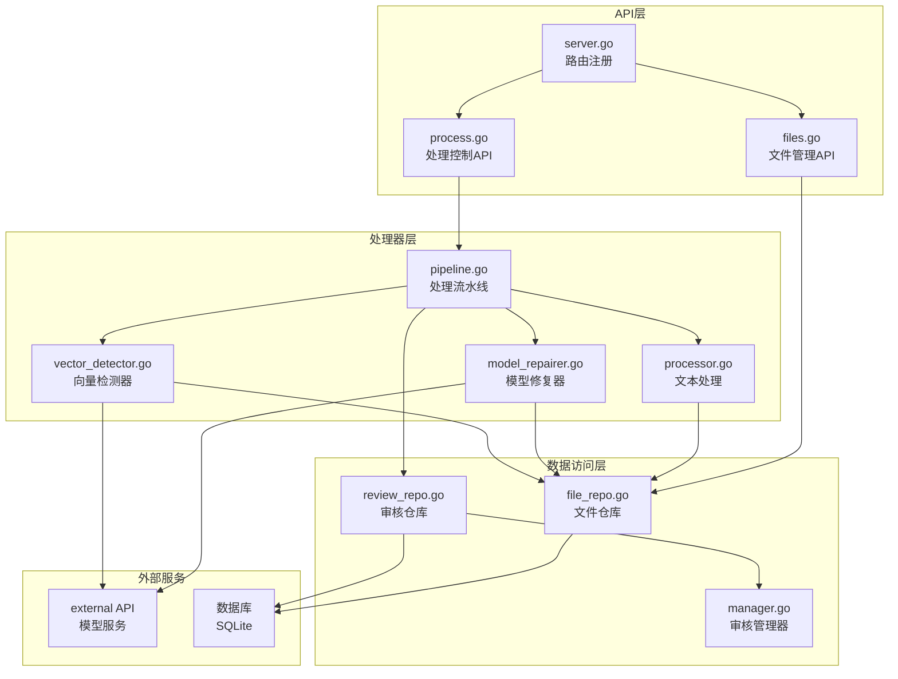

**图表来源**
- [server.go:10-57](file://web/backend/server.go#L10-L57)
- [process.go:1-511](file://web/backend/handlers/process.go#L1-L511)
- [files.go:1-393](file://web/backend/handlers/files.go#L1-L393)

**章节来源**
- [server.go:10-57](file://web/backend/server.go#L10-L57)
- [process.go:15-77](file://web/backend/handlers/process.go#L15-L77)
- [files.go:18-71](file://web/backend/handlers/files.go#L18-L71)

## 核心组件

### 处理流水线组件

处理流水线包含五个核心步骤，每个步骤都有特定的功能和状态管理：

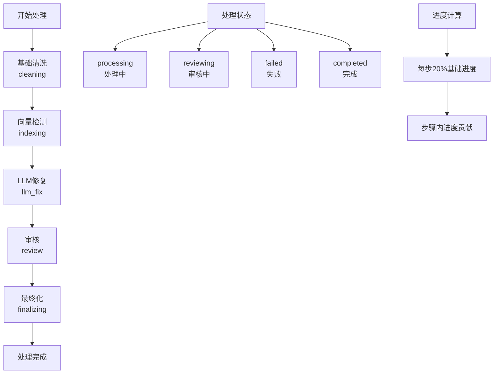

**图表来源**
- [pipeline.go:19-25](file://internal/processor/pipeline.go#L19-L25)
- [pipeline.go:96-102](file://internal/processor/pipeline.go#L96-L102)

### 审核管理系统

审核系统提供完整的变更管理功能，支持多种审核状态和批量操作：

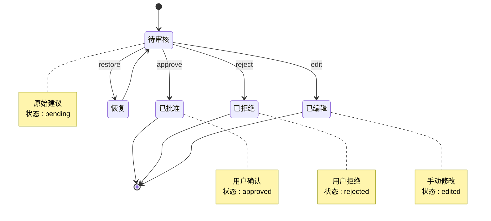

**图表来源**
- [manager.go:17-22](file://internal/review/manager/manager.go#L17-L22)
- [review_repo.go:106-126](file://internal/database/review_repo.go#L106-L126)

**章节来源**
- [pipeline.go:19-25](file://internal/processor/pipeline.go#L19-L25)
- [manager.go:17-22](file://internal/review/manager/manager.go#L17-L22)
- [review_repo.go:106-126](file://internal/database/review_repo.go#L106-L126)

## 架构概览

### 系统架构图

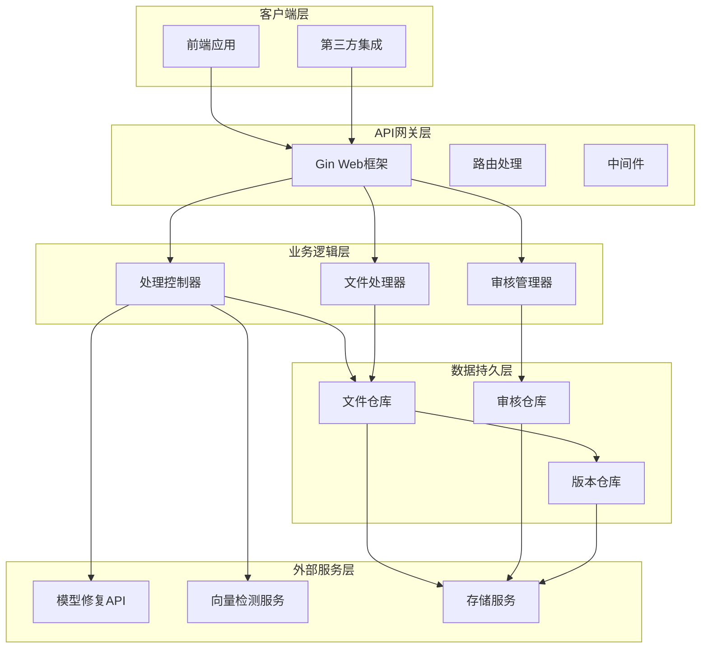

**图表来源**
- [server.go:11-57](file://web/backend/server.go#L11-L57)
- [process.go:15-77](file://web/backend/handlers/process.go#L15-L77)
- [files.go:18-71](file://web/backend/handlers/files.go#L18-L71)

### 数据流图

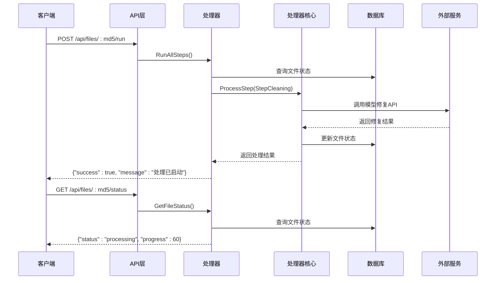

**图表来源**
- [process.go:16-77](file://web/backend/handlers/process.go#L16-L77)
- [pipeline.go:104-158](file://internal/processor/pipeline.go#L104-L158)

## 详细组件分析

### 处理控制API

#### 文件上传和管理

文件上传接口支持智能识别和重复处理检测：

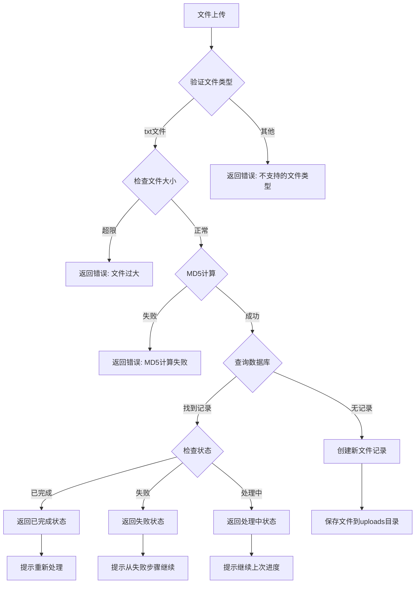

**图表来源**
- [files.go:18-71](file://web/backend/handlers/files.go#L18-L71)
- [files.go:73-111](file://web/backend/handlers/files.go#L73-L111)

#### 处理执行控制

处理执行接口提供完整的异步处理机制：

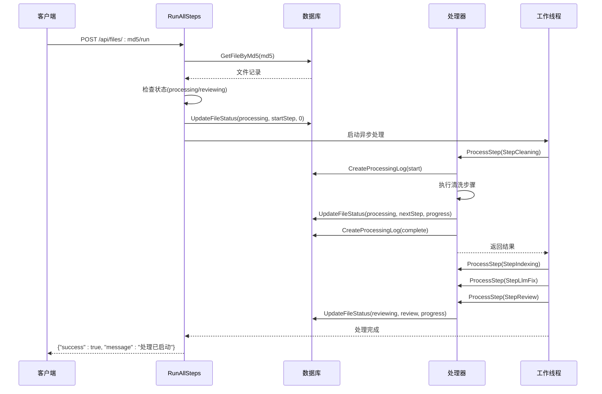

**图表来源**
- [process.go:16-77](file://web/backend/handlers/process.go#L16-L77)
- [pipeline.go:104-158](file://internal/processor/pipeline.go#L104-L158)

#### 处理状态查询

状态查询接口提供实时的处理进度和审核状态：

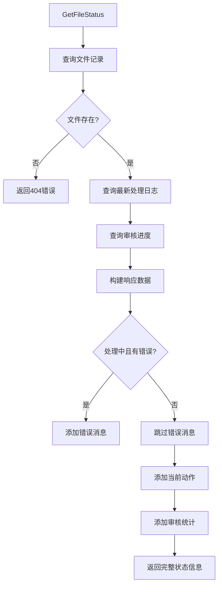

**图表来源**
- [process.go:79-121](file://web/backend/handlers/process.go#L79-L121)
- [process.go:105-118](file://web/backend/handlers/process.go#L105-L118)

#### 审核管理API

审核管理提供完整的变更审查功能：

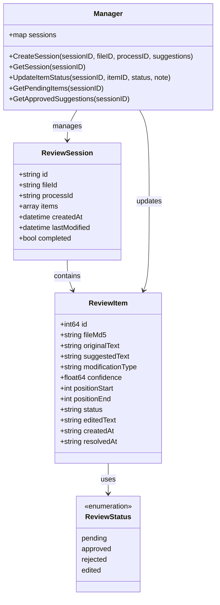

**图表来源**
- [review_repo.go:9-23](file://internal/database/review_repo.go#L9-L23)
- [manager.go:24-42](file://internal/review/manager/manager.go#L24-L42)
- [manager.go:44-54](file://internal/review/manager/manager.go#L44-L54)

**章节来源**
- [process.go:123-326](file://web/backend/handlers/process.go#L123-L326)
- [review_repo.go:9-23](file://internal/database/review_repo.go#L9-L23)
- [manager.go:44-54](file://internal/review/manager/manager.go#L44-L54)

### 处理流水线组件

#### 步骤执行机制

处理流水线采用顺序执行和状态驱动的设计：

```mermaid
flowchart LR
subgraph "步骤顺序"
A[cleaning] --> B[indexing] --> C[llm_fix] --> D[review] --> E[finalizing]
end
subgraph "状态转换"
F[pending] --> G[processing] --> H[reviewing] --> I[completed]
F --> J[failed]
end
subgraph "进度计算"
K[每步基础20%]
L[步骤内进度贡献]
M[CalculateProgress(step, stepProgress)]
end
A --> K
K --> L
L --> M
```

**图表来源**
- [pipeline.go:27-25](file://internal/processor/pipeline.go#L27-L25)
- [pipeline.go:96-102](file://internal/processor/pipeline.go#L96-L102)

#### 模型修复器

模型修复器采用智能分块和并发处理机制：

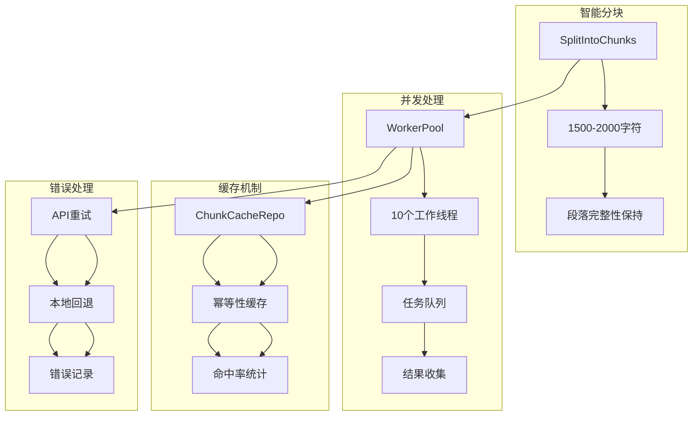

**图表来源**
- [model_repairer.go:124-211](file://internal/processor/model_repairer.go#L124-L211)
- [model_repairer.go:547-563](file://internal/processor/model_repairer.go#L547-L563)
- [model_repairer.go:725-731](file://internal/processor/model_repairer.go#L725-L731)

#### 向量检测器

向量检测器提供重复内容检测功能：

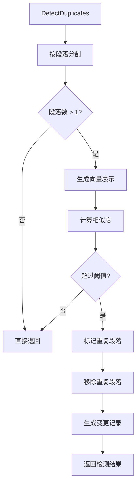

**图表来源**
- [vector_detector.go:36-69](file://internal/processor/vector_detector.go#L36-L69)
- [vector_detector.go:113-130](file://internal/processor/vector_detector.go#L113-L130)

**章节来源**
- [pipeline.go:104-158](file://internal/processor/pipeline.go#L104-L158)
- [model_repairer.go:77-122](file://internal/processor/model_repairer.go#L77-L122)
- [vector_detector.go:36-69](file://internal/processor/vector_detector.go#L36-L69)

## 依赖关系分析

### 组件依赖图

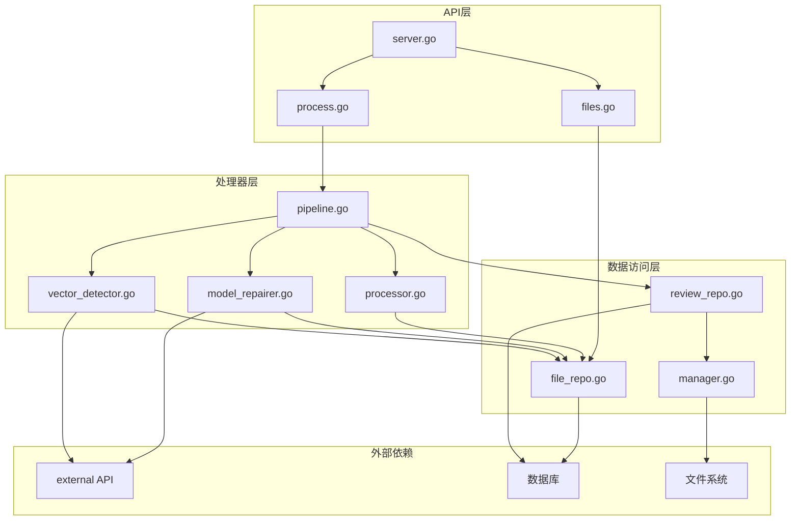

**图表来源**
- [server.go:11-57](file://web/backend/server.go#L11-L57)
- [process.go:11-12](file://web/backend/handlers/process.go#L11-L12)
- [files.go:13-15](file://web/backend/handlers/files.go#L13-L15)

### 数据模型关系

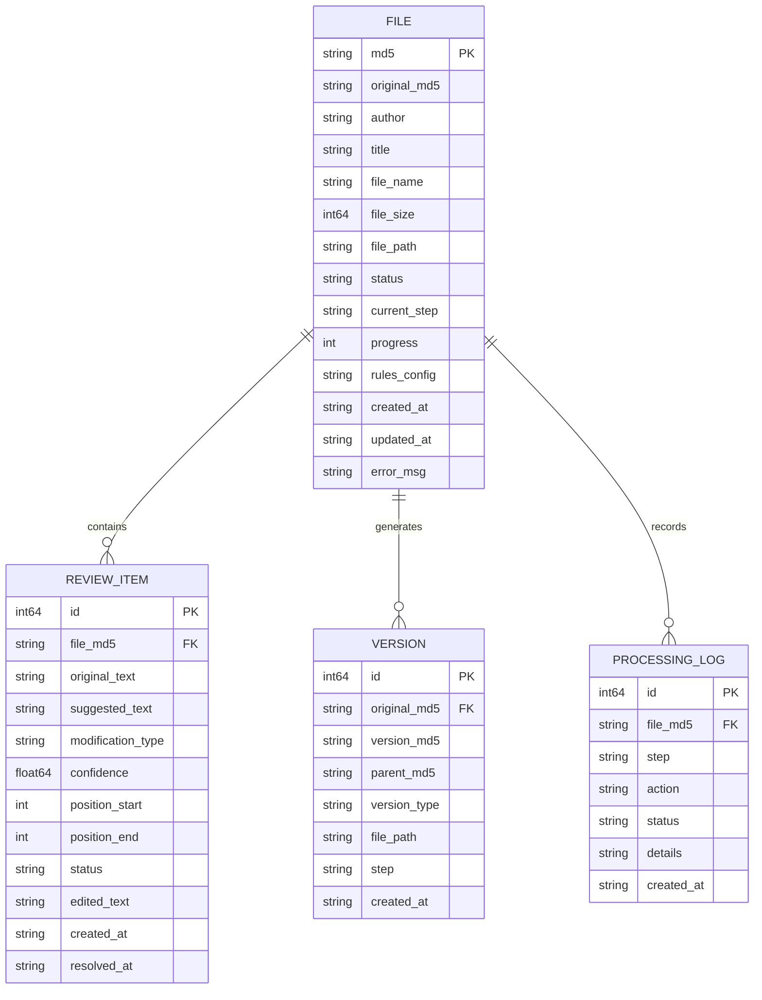

**图表来源**
- [file_repo.go:9-26](file://internal/database/file_repo.go#L9-L26)
- [review_repo.go:9-23](file://internal/database/review_repo.go#L9-L23)
- [file_repo.go:28-47](file://internal/database/file_repo.go#L28-L47)

**章节来源**
- [file_repo.go:9-26](file://internal/database/file_repo.go#L9-L26)
- [review_repo.go:9-23](file://internal/database/review_repo.go#L9-L23)

## 性能考虑

### 并发处理优化

系统采用多线程并发处理来提升性能：

- **工作池并发**：默认10个工作线程处理文本块
- **智能分块**：1500-2000字符的块大小平衡处理效率
- **缓存机制**：幂等性缓存减少重复API调用
- **异步处理**：处理过程完全异步执行，不阻塞API响应

### 内存管理

- **流式处理**：大文件采用流式读取避免内存溢出
- **分块处理**：文本按段落分块处理，保持内存使用稳定
- **及时释放**：处理完成后及时释放临时资源

### 错误恢复策略

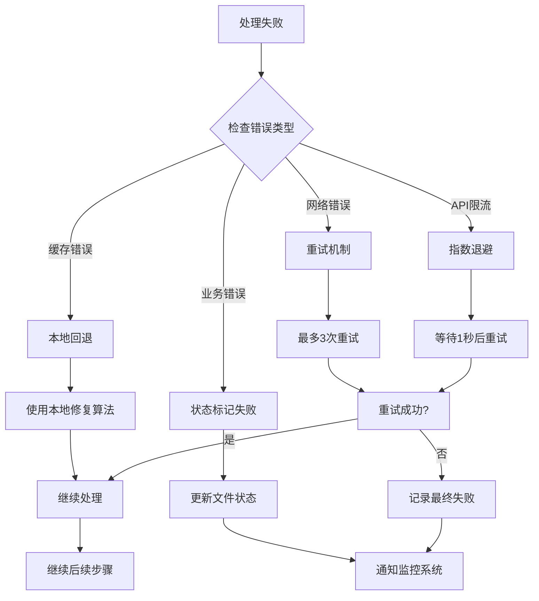

**图表来源**
- [model_repairer.go:251-319](file://internal/processor/model_repairer.go#L251-L319)
- [pipeline.go:145-155](file://internal/processor/pipeline.go#L145-L155)

## 故障排除指南

### 常见问题诊断

#### 处理状态异常

**问题**：文件状态长时间停留在processing
**诊断步骤**：
1. 检查数据库连接状态
2. 验证外部API服务可用性
3. 查看处理日志文件
4. 检查工作池线程状态

**解决方案**：
- 重启API服务
- 检查网络连接
- 清理缓存数据
- 重新启动处理流程

#### 审核进度不更新

**问题**：审核进度显示为0%
**诊断步骤**：
1. 检查审核项是否正确创建
2. 验证数据库连接
3. 查看审核项状态更新日志

**解决方案**：
- 重新创建审核会话
- 检查数据库权限
- 验证审核项数据完整性

#### API响应超时

**问题**：处理请求响应时间过长
**诊断步骤**：
1. 检查服务器CPU使用率
2. 验证数据库性能
3. 监控外部API响应时间
4. 检查网络延迟

**解决方案**：
- 增加工作线程数量
- 优化数据库查询
- 调整API超时设置
- 实施负载均衡

**章节来源**
- [process.go:52-71](file://web/backend/handlers/process.go#L52-L71)
- [model_repairer.go:251-319](file://internal/processor/model_repairer.go#L251-L319)

## 结论

处理控制API提供了完整的文本处理流水线管理功能，具有以下特点：

**核心优势**：
- **异步处理**：支持长时间运行的处理任务
- **状态监控**：实时跟踪处理进度和状态
- **审核管理**：完整的变更审查流程
- **错误恢复**：健壮的错误处理和恢复机制

**技术特色**：
- 分层架构设计，职责清晰
- 并发处理优化，性能优异
- 缓存机制，减少重复计算
- 完整的日志记录，便于调试

**适用场景**：
- 大规模文本清理项目
- 需要人工审核的文本处理
- 高并发的文本处理服务
- 需要详细处理报告的业务场景

## 附录

### API调用示例

#### 基本使用流程

1. **上传文件**
```bash
curl -X POST http://localhost:8080/api/files/upload \
  -F "file=@/path/to/text.txt"
```

2. **启动处理**
```bash
curl -X POST http://localhost:8080/api/files/{md5}/run
```

3. **监控状态**
```bash
curl http://localhost:8080/api/files/{md5}/status
```

4. **获取审核项**
```bash
curl http://localhost:8080/api/files/{md5}/review-items
```

5. **批准审核项**
```bash
curl -X POST http://localhost:8080/api/files/{md5}/approve \
  -H "Content-Type: application/json" \
  -d '{"itemId": 1}'
```

6. **生成最终文件**
```bash
curl -X POST http://localhost:8080/api/files/{md5}/finalize
```

#### 最佳实践

**状态监控建议**：
- 每30秒轮询一次处理状态
- 监控处理进度变化趋势
- 设置合理的超时时间
- 实现自动重试机制

**错误处理策略**：
- 实现指数退避重试
- 记录详细的错误日志
- 提供用户友好的错误信息
- 实施降级处理方案

**性能优化建议**：
- 合理设置工作线程数量
- 优化数据库查询性能
- 实施缓存策略
- 监控系统资源使用情况