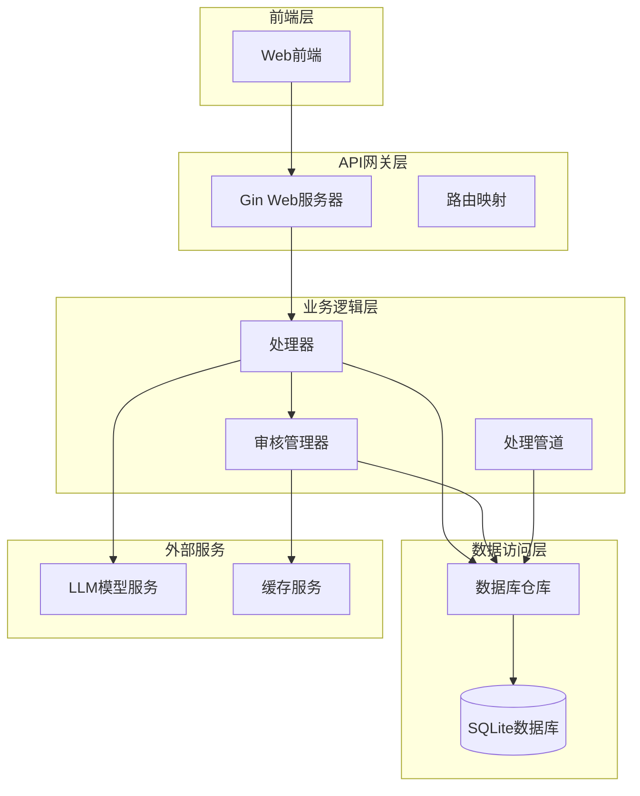
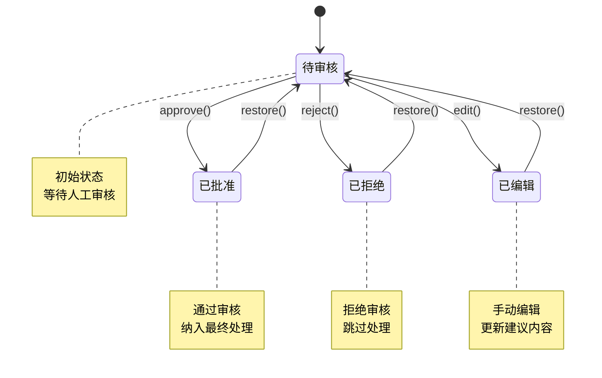
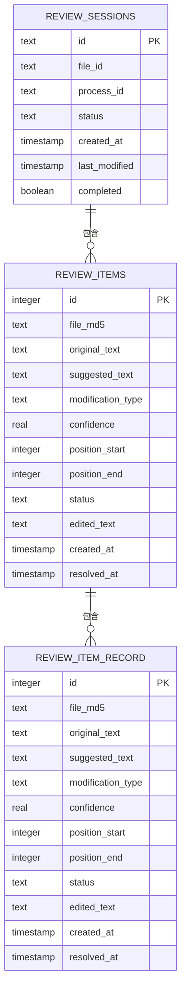
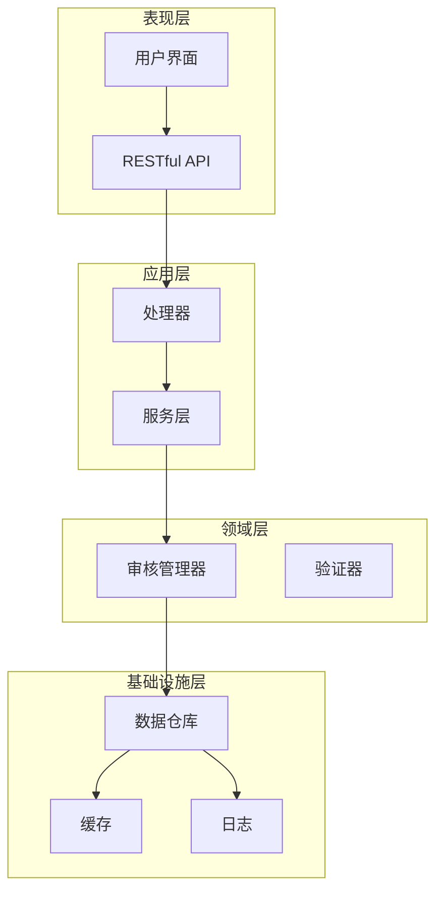
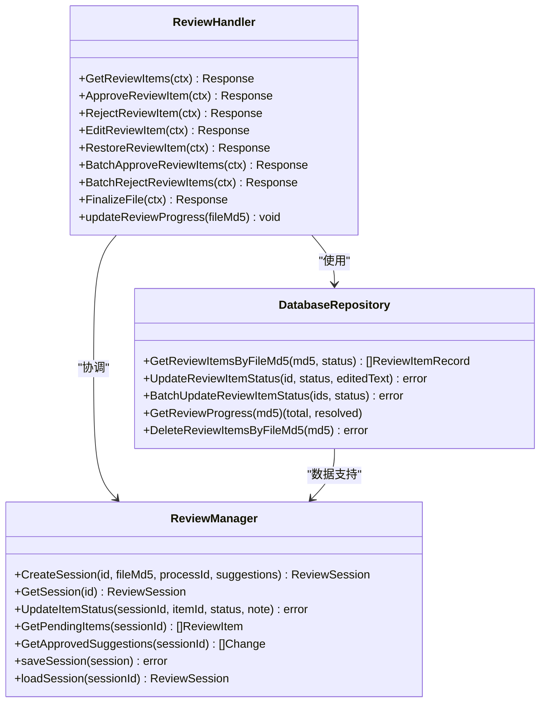
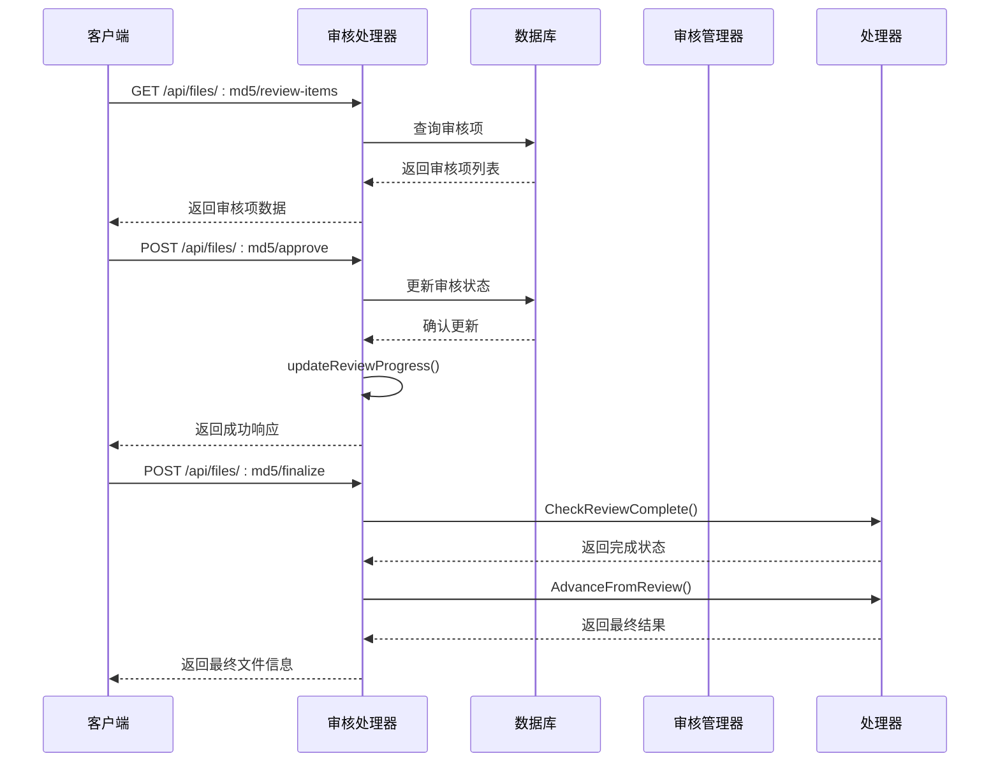
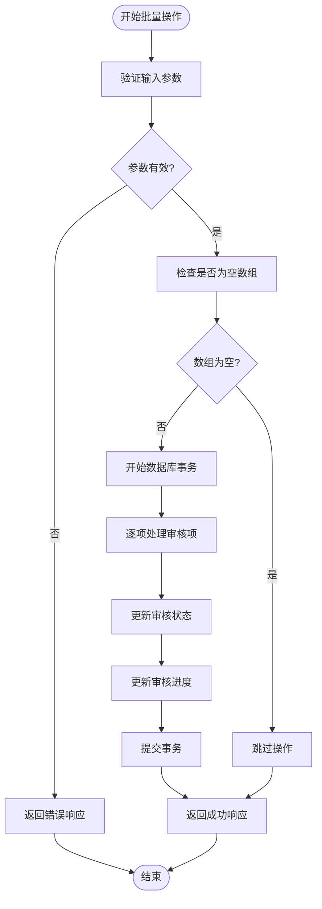
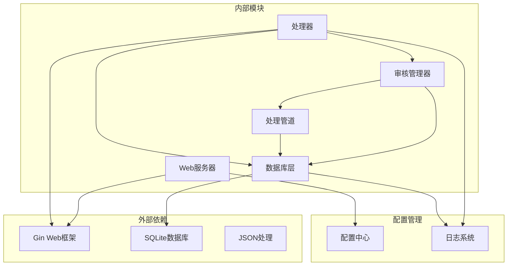

# 审核管理API

<cite>
**本文档引用的文件**
- [manager.go](file://internal/review/manager/manager.go)
- [review_repo.go](file://internal/database/review_repo.go)
- [process.go](file://web/backend/handlers/process.go)
- [server.go](file://web/backend/server.go)
- [db.go](file://internal/database/db.go)
- [05-API接口.md](file://doc/05-API接口.md)
- [pipeline.go](file://internal/processor/pipeline.go)
</cite>

## 目录
1. [简介](#简介)
2. [项目结构](#项目结构)
3. [核心组件](#核心组件)
4. [架构概览](#架构概览)
5. [详细组件分析](#详细组件分析)
6. [依赖关系分析](#依赖关系分析)
7. [性能考虑](#性能考虑)
8. [故障排除指南](#故障排除指南)
9. [结论](#结论)

## 简介

本文档详细介绍了人工审核管理相关API的设计与实现。系统提供了完整的审核工作流程，包括审核项查询、审核项批准、审核项拒绝、审核项编辑、审核项恢复、批量审核操作和最终确认等功能。审核状态管理采用标准化的状态机设计，支持pending（待审核）、approved（已批准）、rejected（已拒绝）、edited（已编辑）等状态。

系统采用分层架构设计，前端通过RESTful API与后端交互，后端通过Gin框架提供HTTP服务，数据持久化使用SQLite数据库。审核流程与文件处理流程紧密结合，确保审核质量的同时提高了处理效率。

## 项目结构

审核管理系统主要由以下几个核心模块组成：

**图表来源**
- [server.go:10-58](file://web/backend/server.go#L10-L58)
- [process.go:1-511](file://web/backend/handlers/process.go#L1-L511)

**章节来源**
- [server.go:10-58](file://web/backend/server.go#L10-L58)
- [process.go:1-511](file://web/backend/handlers/process.go#L1-L511)

## 核心组件

### 审核状态管理

系统采用标准化的审核状态管理机制，支持四种基本状态：

**图表来源**
- [manager.go:14-22](file://internal/review/manager/manager.go#L14-L22)

### 数据模型设计

审核系统的核心数据模型包括审核项记录和审核会话：

**图表来源**
- [review_repo.go:9-23](file://internal/database/review_repo.go#L9-L23)
- [manager.go:24-42](file://internal/review/manager/manager.go#L24-L42)

**章节来源**
- [review_repo.go:9-23](file://internal/database/review_repo.go#L9-L23)
- [manager.go:14-42](file://internal/review/manager/manager.go#L14-L42)

## 架构概览

审核管理系统采用分层架构，各层职责明确，耦合度低：

**图表来源**
- [process.go:1-511](file://web/backend/handlers/process.go#L1-L511)
- [manager.go:44-89](file://internal/review/manager/manager.go#L44-L89)

系统架构特点：
- **分层清晰**：表现层、应用层、领域层、基础设施层职责分明
- **可扩展性**：支持新增审核类型和处理策略
- **可靠性**：内置错误处理和重试机制
- **可观测性**：完整的日志记录和监控指标

## 详细组件分析

### 审核处理器组件

审核处理器负责处理所有审核相关的HTTP请求，提供完整的CRUD操作：

**图表来源**
- [process.go:123-326](file://web/backend/handlers/process.go#L123-L326)
- [review_repo.go:25-183](file://internal/database/review_repo.go#L25-L183)
- [manager.go:44-233](file://internal/review/manager/manager.go#L44-L233)

### 审核流程处理机制

系统实现了完整的审核流程处理机制，支持异步处理和状态跟踪：

**图表来源**
- [process.go:123-326](file://web/backend/handlers/process.go#L123-L326)
- [pipeline.go:589-609](file://internal/processor/pipeline.go#L589-L609)

**章节来源**
- [process.go:123-326](file://web/backend/handlers/process.go#L123-L326)
- [pipeline.go:589-609](file://internal/processor/pipeline.go#L589-L609)

### 批量操作处理流程

系统提供了高效的批量审核操作，支持批量批准和批量拒绝：

**图表来源**
- [process.go:258-300](file://web/backend/handlers/process.go#L258-L300)
- [review_repo.go:128-161](file://internal/database/review_repo.go#L128-L161)

**章节来源**
- [process.go:258-300](file://web/backend/handlers/process.go#L258-L300)
- [review_repo.go:128-161](file://internal/database/review_repo.go#L128-L161)

## 依赖关系分析

### 组件依赖图

**图表来源**
- [server.go:10-58](file://web/backend/server.go#L10-L58)
- [process.go:1-511](file://web/backend/handlers/process.go#L1-L511)
- [db.go:15-69](file://internal/database/db.go#L15-L69)

### 数据库依赖关系

系统数据库设计遵循ACID原则，支持高并发访问：

```mermaid
erDiagram
FILES {
integer id PK
text md5 UK
text original_md5
text author
text title
text file_name
integer file_size
text file_path
text status
text current_step
integer progress
text rules_config
timestamp created_at
timestamp updated_at
text error_msg
}
VERSIONS {
integer id PK
text original_md5
text version_md5 UK
text parent_md5
text version_type
text file_path
text step
timestamp created_at
}
REVIEW_ITEMS {
integer id PK
text file_md5
text original_text
text suggested_text
text modification_type
real confidence
integer position_start
integer position_end
text status
text edited_text
timestamp created_at
timestamp resolved_at
}
PROCESSING_LOGS {
integer id PK
text file_md5
text step
text action
text details
text status
timestamp timestamp
}
FILES ||--o{ REVIEW_ITEMS : "包含"
FILES ||--o{ VERSIONS : "版本关系"
FILES ||--o{ PROCESSING_LOGS : "处理日志"
```

**图表来源**
- [db.go:89-222](file://internal/database/db.go#L89-L222)

**章节来源**
- [db.go:89-222](file://internal/database/db.go#L89-L222)

## 性能考虑

### 数据库性能优化

系统采用SQLite作为数据存储，针对审核场景进行了专门优化：

- **WAL模式**：启用Write-Ahead Logging模式，支持多读单写并发
- **索引优化**：为常用查询字段建立复合索引
- **连接池**：使用单连接策略，确保写操作的原子性
- **缓存机制**：内存中的审核会话缓存减少磁盘I/O

### 审核性能特性

- **异步处理**：文件处理采用异步方式，不阻塞API响应
- **批量操作**：支持批量审核操作，减少数据库往返次数
- **状态缓存**：审核进度实时计算，避免重复计算开销
- **连接复用**：HTTP客户端使用连接池，提高外部API调用效率

### 内存管理

审核管理器采用内存缓存机制：
- **会话缓存**：活跃的审核会话存储在内存中
- **磁盘持久化**：定期将会话状态持久化到磁盘
- **LRU淘汰**：内存不足时自动清理不活跃的会话

## 故障排除指南

### 常见问题诊断

#### 审核状态异常

**问题现象**：审核状态显示不正确或无法更新

**诊断步骤**：
1. 检查数据库连接状态
2. 验证审核项ID的有效性
3. 确认状态转换的合法性
4. 查看数据库事务是否正常提交

**解决方案**：
- 重启数据库连接
- 检查外键约束
- 验证状态枚举值
- 查看事务回滚日志

#### 批量操作失败

**问题现象**：批量审核操作部分成功部分失败

**诊断步骤**：
1. 检查输入的审核项ID列表
2. 验证每个ID对应的审核项是否存在
3. 查看数据库事务状态
4. 检查是否有违反约束的记录

**解决方案**：
- 分批执行批量操作
- 验证输入数据的完整性
- 检查数据库锁状态
- 查看具体的错误信息

#### 性能问题

**问题现象**：审核操作响应缓慢

**诊断步骤**：
1. 检查数据库索引使用情况
2. 监控数据库连接池状态
3. 分析查询执行计划
4. 查看系统资源使用情况

**解决方案**：
- 优化数据库查询
- 调整连接池配置
- 添加必要的索引
- 实施查询缓存

**章节来源**
- [process.go:169-326](file://web/backend/handlers/process.go#L169-L326)
- [review_repo.go:25-183](file://internal/database/review_repo.go#L25-L183)

## 结论

审核管理API系统设计合理，功能完整，具有良好的扩展性和可靠性。系统采用分层架构，职责分离明确，支持高并发访问和大规模数据处理。

主要优势：
- **完整的审核流程**：从审核项生成到最终确认的全流程支持
- **灵活的状态管理**：支持多种审核状态和状态转换
- **高效的批量操作**：优化的批量处理机制提升用户体验
- **可靠的错误处理**：完善的错误处理和恢复机制
- **可观测性**：完整的日志记录和监控指标

建议的改进方向：
- 增加审核权限控制机制
- 实现审核历史追踪
- 优化审核会话的并发处理
- 增强审核质量评估功能
- 提供审核统计和报表功能

该系统为文本清理项目的质量保证提供了坚实的技术基础，能够满足各种规模的审核需求。