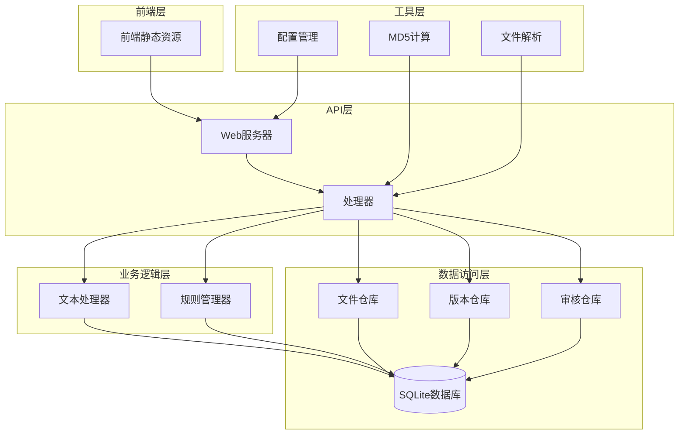
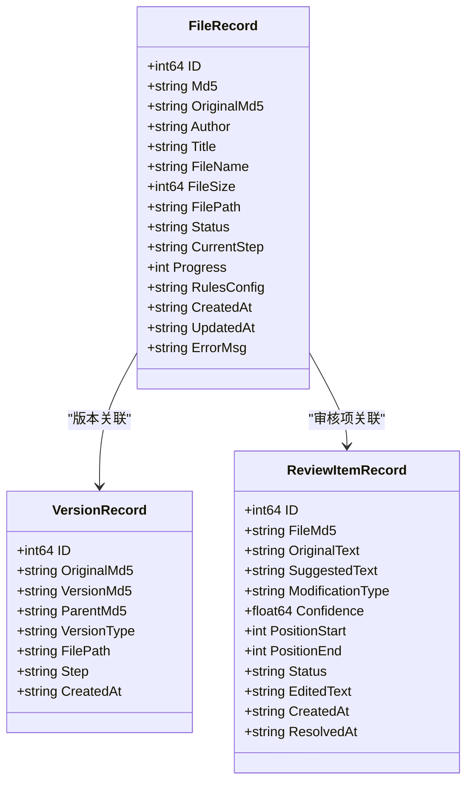
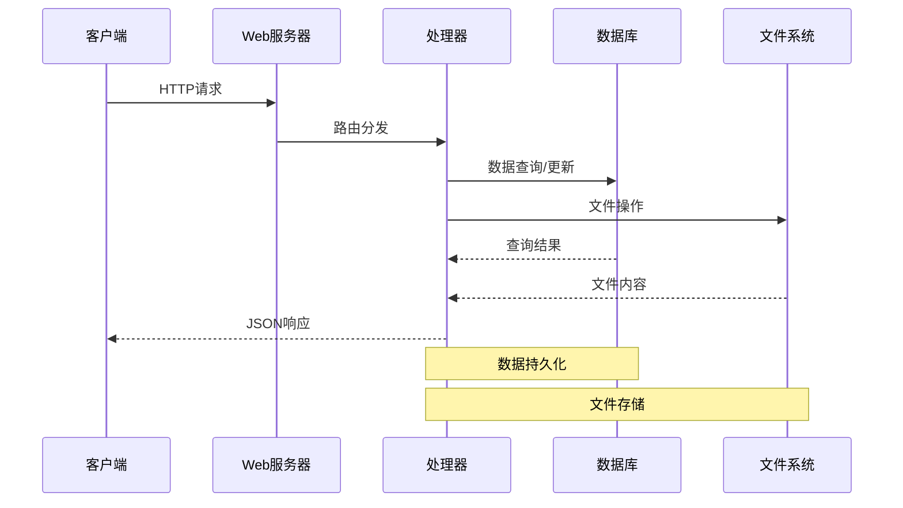
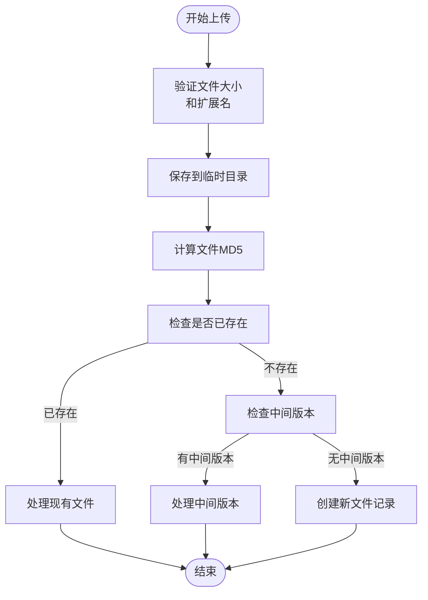
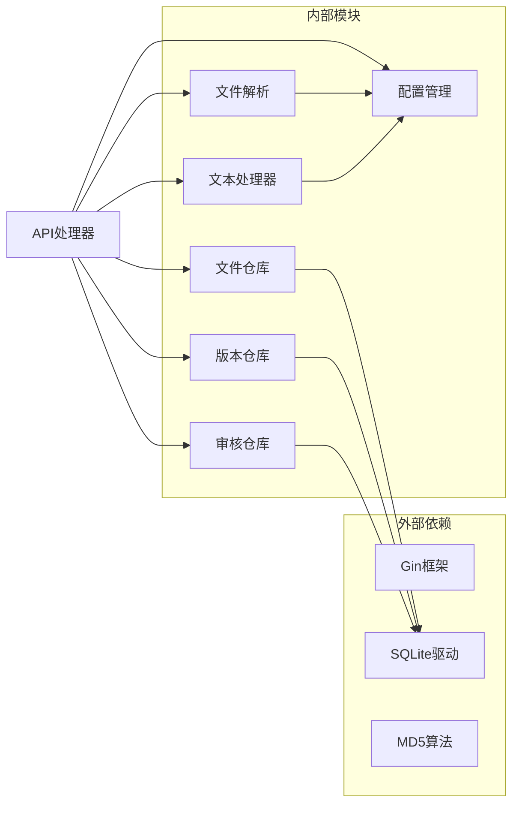
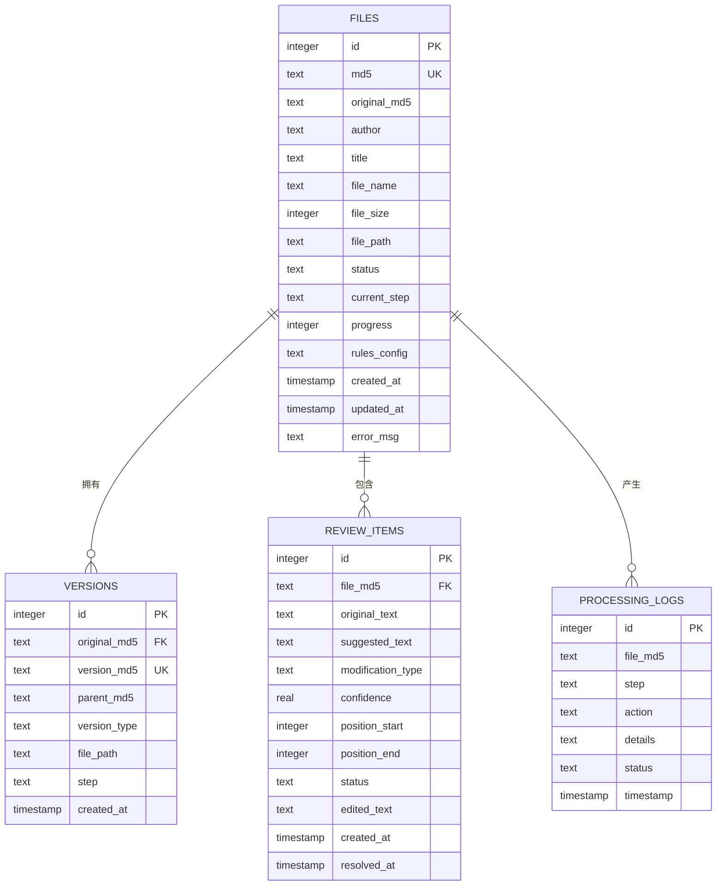

# 文件管理API

<cite>
**本文档引用的文件**
- [API接口.md](file://doc/05-API接口.md)
- [files.go](file://web/backend/handlers/files.go)
- [server.go](file://web/backend/server.go)
- [md5.go](file://internal/file/md5.go)
- [parser.go](file://internal/file/parser.go)
- [file_repo.go](file://internal/database/file_repo.go)
- [db.go](file://internal/database/db.go)
- [version_repo.go](file://internal/database/version_repo.go)
- [review_repo.go](file://internal/database/review_repo.go)
- [config.go](file://internal/config/config.go)
- [process.go](file://web/backend/handlers/process.go)
- [rules.go](file://web/backend/handlers/rules.go)
</cite>

## 目录
1. [简介](#简介)
2. [项目结构](#项目结构)
3. [核心组件](#核心组件)
4. [架构概览](#架构概览)
5. [详细组件分析](#详细组件分析)
6. [依赖关系分析](#依赖关系分析)
7. [性能考虑](#性能考虑)
8. [故障排除指南](#故障排除指南)
9. [结论](#结论)

## 简介

本文档详细介绍了VoidText项目的文件管理API，涵盖了文件上传、文件列表查询、单个文件获取、文件内容读取、文件下载、文件删除、文件恢复和规则更新等核心功能。该系统基于Go语言开发，采用Gin框架构建RESTful API，使用SQLite作为数据存储，并集成了多种文本处理功能。

## 项目结构

项目采用分层架构设计，主要分为以下层次：



**图表来源**
- [server.go:10-57](file://web/backend/server.go#L10-L57)
- [files.go:1-393](file://web/backend/handlers/files.go#L1-L393)

**章节来源**
- [server.go:10-57](file://web/backend/server.go#L10-L57)
- [config.go:14-44](file://internal/config/config.go#L14-L44)

## 核心组件

### 文件管理API组件

系统提供了完整的文件生命周期管理能力，包括：

- **文件上传与识别**: 支持MD5去重和智能行为
- **文件状态管理**: 完整的处理状态跟踪
- **版本控制**: 支持中间版本和版本链追踪
- **审核机制**: 完整的审核流程管理
- **规则配置**: 动态规则更新和管理

### 数据模型组件



**图表来源**
- [file_repo.go:9-26](file://internal/database/file_repo.go#L9-L26)
- [version_repo.go:8-18](file://internal/database/version_repo.go#L8-L18)
- [review_repo.go:9-23](file://internal/database/review_repo.go#L9-L23)

**章节来源**
- [file_repo.go:9-26](file://internal/database/file_repo.go#L9-L26)
- [version_repo.go:8-18](file://internal/database/version_repo.go#L8-L18)
- [review_repo.go:9-23](file://internal/database/review_repo.go#L9-L23)

## 架构概览

系统采用模块化设计，各组件职责清晰：



**图表来源**
- [server.go:28-54](file://web/backend/server.go#L28-L54)
- [files.go:18-71](file://web/backend/handlers/files.go#L18-L71)

## 详细组件分析

### 文件上传接口

#### 接口定义
- **HTTP方法**: POST
- **URL路径**: `/api/files/upload`
- **内容类型**: `multipart/form-data`
- **请求参数**: 
  - `file`: 上传的txt文件

#### 处理流程



**图表来源**
- [files.go:18-71](file://web/backend/handlers/files.go#L18-L71)

#### 响应格式
- **成功响应**: 包含MD5标识符和状态信息
- **错误响应**: 标准错误格式，包含错误描述

**章节来源**
- [files.go:18-71](file://web/backend/handlers/files.go#L18-L71)
- [md5.go:11-25](file://internal/file/md5.go#L11-L25)

### 文件列表查询接口

#### 接口定义
- **HTTP方法**: GET
- **URL路径**: `/api/files`
- **请求参数**: 无

#### 数据结构
返回的文件列表包含以下字段：
- `id`: 文件ID
- `md5`: 文件MD5标识符
- `author`: 作者
- `title`: 标题
- `fileName`: 文件名
- `fileSize`: 文件大小
- `status`: 处理状态
- `currentStep`: 当前步骤
- `progress`: 进度百分比
- `createdAt`: 创建时间
- `updatedAt`: 更新时间

**章节来源**
- [files.go:253-262](file://web/backend/handlers/files.go#L253-L262)
- [file_repo.go:130-141](file://internal/database/file_repo.go#L130-L141)

### 单个文件获取接口

#### 接口定义
- **HTTP方法**: GET
- **URL路径**: `/api/files/:md5`
- **路径参数**: `:md5` - 文件MD5标识符

#### 扩展字段
除了基本文件信息外，还包含：
- `rulesConfig`: 规则配置
- `currentStep`: 当前处理步骤
- `progress`: 处理进度

**章节来源**
- [files.go:264-279](file://web/backend/handlers/files.go#L264-L279)
- [file_repo.go:49-69](file://internal/database/file_repo.go#L49-L69)

### 文件内容读取接口

#### 接口定义
- **HTTP方法**: GET
- **URL路径**: `/api/files/:md5/content`

#### 返回内容
直接返回文件的纯文本内容，适合程序化处理。

**章节来源**
- [files.go:281-302](file://web/backend/handlers/files.go#L281-L302)

### 文件下载接口

#### 接口定义
- **HTTP方法**: GET
- **URL路径**: `/api/files/:md5/download`

#### 特殊处理
支持中间版本文件的下载，自动处理文件路径映射。

**章节来源**
- [files.go:304-325](file://web/backend/handlers/files.go#L304-L325)

### 文件删除接口

#### 接口定义
- **HTTP方法**: DELETE
- **URL路径**: `/api/files/:md5`

#### 查询参数
- `keepFile`: 是否保留物理文件，默认false

#### 删除流程
1. 删除文件记录
2. 清除相关审核项
3. 可选：删除物理文件

**章节来源**
- [files.go:327-355](file://web/backend/handlers/files.go#L327-L355)

### 文件恢复接口

#### 接口定义
- **HTTP方法**: POST
- **URL路径**: `/api/files/:md5/resume`

#### 恢复场景
- `completed`: 清除审核记录，重置为pending
- `failed`: 重置为pending，保留current_step
- `processing`: 重置为pending，清除错误信息

**章节来源**
- [files.go:200-251](file://web/backend/handlers/files.go#L200-L251)

### 规则更新接口

#### 接口定义
- **HTTP方法**: PUT
- **URL路径**: `/api/files/:md5/rules`

#### 请求体格式
```json
{
  "rulesConfig": "JSON字符串形式的规则配置"
}
```

#### 规则配置结构
- `enableBasicCleaning`: 基础清理开关
- `enableVectorDetection`: 向量检测开关
- `enableModelRepair`: 模型修复开关
- `traditionalToSimple`: 繁体转简体开关
- `vectorSimilarityThreshold`: 向量相似度阈值
- `customMappings`: 自定义映射表
- `adBlacklist`: 广告黑名单

**章节来源**
- [files.go:357-376](file://web/backend/handlers/files.go#L357-L376)
- [file_repo.go:105-115](file://internal/database/file_repo.go#L105-L115)

## 依赖关系分析

### 组件依赖图



**图表来源**
- [files.go:3-16](file://web/backend/handlers/files.go#L3-L16)
- [db.go:13-11](file://internal/database/db.go#L13-L11)

### 数据库设计

系统使用SQLite作为数据存储，包含以下核心表：



**图表来源**
- [db.go:89-141](file://internal/database/db.go#L89-L141)

**章节来源**
- [db.go:89-223](file://internal/database/db.go#L89-L223)

## 性能考虑

### 数据库优化

系统针对SQLite进行了专门的性能优化：

- **WAL模式**: 启用Write-Ahead Logging模式，支持多读单写并发
- **缓存配置**: 设置缓存大小为10000页，提升查询性能
- **索引优化**: 为常用查询字段建立索引
- **连接池**: 限制最大连接数为1，确保写操作的顺序性

### 文件处理优化

- **MD5计算**: 使用流式读取，避免大文件内存占用
- **临时文件**: 上传文件先保存到临时目录，验证后再移动
- **并发控制**: 处理流程采用异步方式，避免阻塞请求

### 内存管理

- **文件读取**: 内容读取采用流式处理
- **字符串处理**: 使用UTF-8编码，支持中文字符
- **垃圾回收**: 及时释放文件句柄和临时对象

## 故障排除指南

### 常见错误类型

| 错误类型 | HTTP状态码 | 描述 | 解决方案 |
|---------|-----------|------|----------|
| 文件不存在 | 404 | 请求的文件MD5不存在 | 检查文件MD5标识符是否正确 |
| 参数错误 | 400 | 请求参数格式不正确 | 验证请求格式和必需参数 |
| 服务器错误 | 500 | 服务器内部异常 | 检查服务器日志和数据库连接 |
| 文件过大 | 400 | 超过最大文件限制 | 减小文件大小或调整配置 |

### 错误响应格式

所有API接口遵循统一的错误响应格式：

```json
{
  "success": false,
  "message": "错误描述信息"
}
```

### 最佳实践

1. **MD5标识符使用**
   - 始终使用MD5作为文件唯一标识符
   - 在数据库中建立MD5索引以提升查询性能
   - 避免直接使用文件名作为标识符

2. **文件上传最佳实践**
   - 先验证文件大小和格式
   - 使用临时目录保存上传文件
   - 计算MD5后进行重复检查

3. **错误处理策略**
   - 实现重试机制处理临时性错误
   - 记录详细的错误日志便于调试
   - 提供有意义的错误消息给客户端

4. **性能优化建议**
   - 对频繁查询的字段建立索引
   - 使用流式处理大文件
   - 合理配置数据库连接池

**章节来源**
- [files.go:20-48](file://web/backend/handlers/files.go#L20-L48)
- [config.go:190-203](file://internal/config/config.go#L190-L203)

## 结论

本文件管理API提供了完整的文本文件生命周期管理能力，具有以下特点：

- **完整的功能覆盖**: 从文件上传到最终生成，涵盖所有必要操作
- **可靠的标识系统**: 基于MD5的文件标识，确保唯一性和一致性
- **灵活的状态管理**: 支持复杂的处理状态和恢复机制
- **完善的错误处理**: 标准化的错误响应和状态码
- **良好的性能设计**: 针对SQLite的优化和流式处理

系统设计充分考虑了生产环境的需求，提供了稳定可靠的服务接口。通过合理的架构设计和性能优化，能够满足大规模文件处理的应用场景。