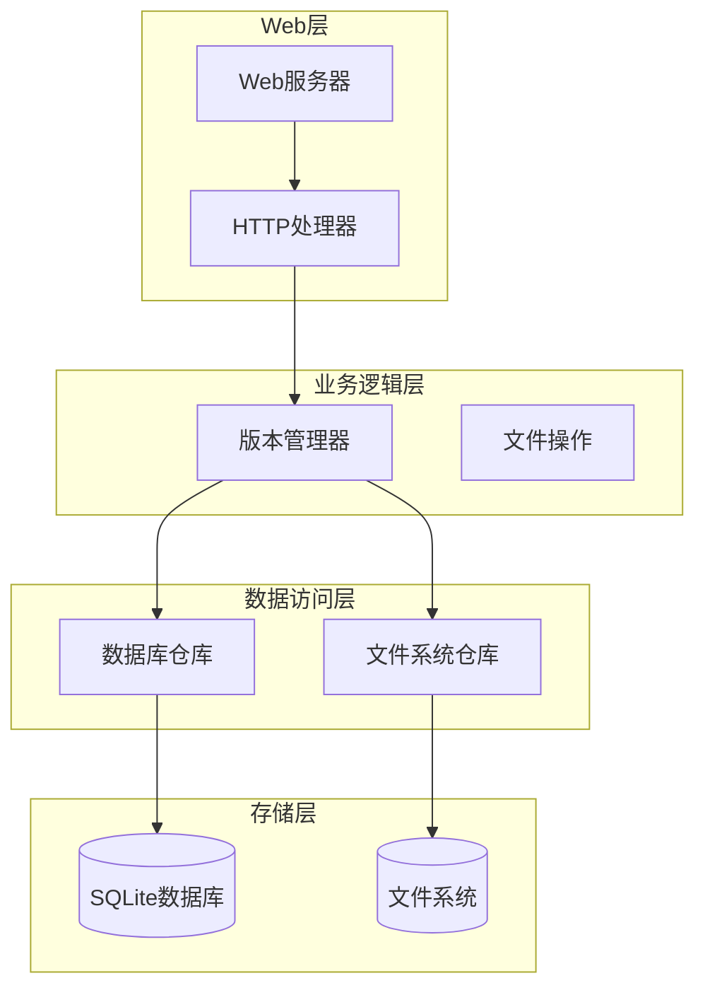
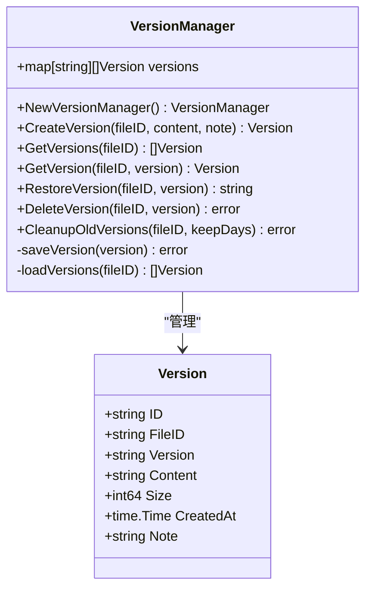
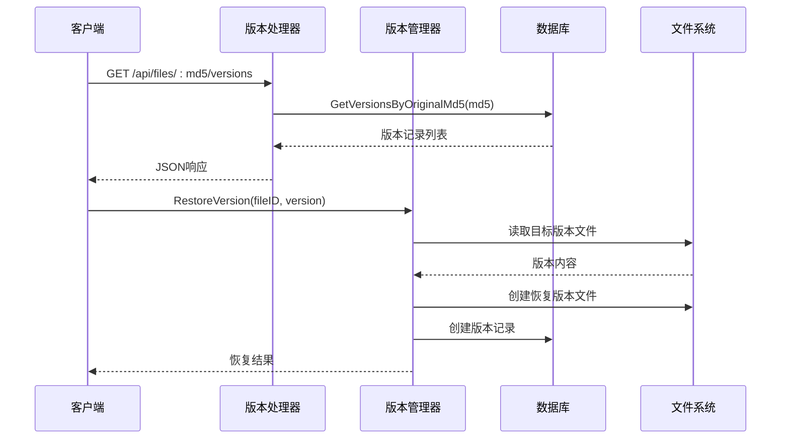
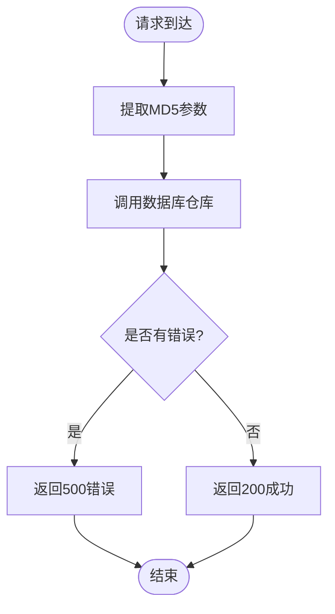
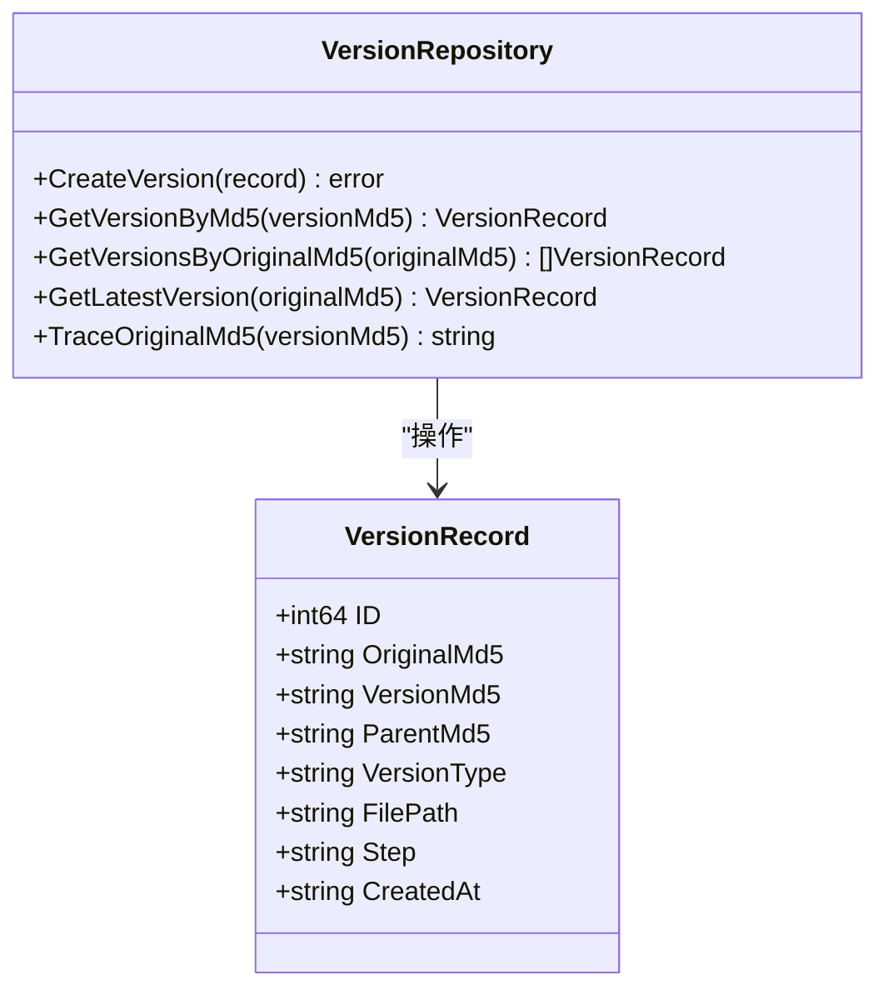
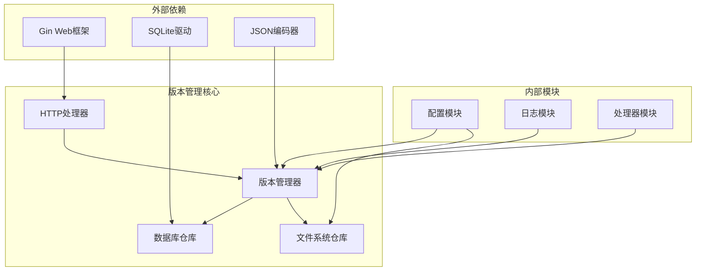

# 版本管理API

<cite>
**本文档引用的文件**
- [versions.go](file://web/backend/handlers/versions.go)
- [version_repo.go](file://internal/database/version_repo.go)
- [version.go](file://internal/file/version.go)
- [db.go](file://internal/database/db.go)
- [config.go](file://internal/config/config.go)
- [05-API接口.md](file://doc/05-API接口.md)
- [server.go](file://web/backend/server.go)
- [main.go](file://cmd/txtclean/main.go)
</cite>

## 目录
1. [简介](#简介)
2. [项目结构](#项目结构)
3. [核心组件](#核心组件)
4. [架构概览](#架构概览)
5. [详细组件分析](#详细组件分析)
6. [依赖关系分析](#依赖关系分析)
7. [性能考虑](#性能考虑)
8. [故障排除指南](#故障排除指南)
9. [结论](#结论)

## 简介

本文档详细介绍了txtCleaning系统中的文件版本管理API。该系统提供了完整的版本控制功能，包括版本信息查询、版本历史记录、版本恢复和版本存储策略。版本管理系统采用双层架构设计，既支持数据库层面的版本追踪，也支持文件系统层面的版本备份。

版本管理的核心特性包括：
- **版本链追踪**：支持从任意版本追溯到原始文件
- **多类型版本**：支持原始版本和中间版本的区分
- **版本存储**：采用SQLite数据库和文件系统双重存储策略
- **版本清理**：支持按时间策略自动清理旧版本
- **版本恢复**：支持从任意历史版本进行恢复操作

## 项目结构

版本管理系统在项目中的组织结构如下：

**图表来源**
- [server.go:10-57](file://web/backend/server.go#L10-L57)
- [version.go:24-34](file://internal/file/version.go#L24-L34)

**章节来源**
- [server.go:10-57](file://web/backend/server.go#L10-L57)
- [version.go:24-34](file://internal/file/version.go#L24-L34)

## 核心组件

### 版本记录模型

版本管理系统的核心数据结构是VersionRecord，它定义了版本的基本属性：

| 字段名 | 类型 | 描述 |
|--------|------|------|
| id | int64 | 数据库自增ID |
| originalMd5 | string | 原始文件MD5标识 |
| versionMd5 | string | 版本文件MD5标识 |
| parentMd5 | string | 父版本MD5标识 |
| versionType | string | 版本类型（original/intermediate） |
| filePath | string | 文件路径 |
| step | string | 处理步骤 |
| createdAt | string | 创建时间 |

### 版本管理器

VersionManager提供了完整的版本管理功能：

**图表来源**
- [version.go:24-34](file://internal/file/version.go#L24-L34)
- [version.go:13-22](file://internal/file/version.go#L13-L22)

**章节来源**
- [version.go:13-22](file://internal/file/version.go#L13-L22)
- [version.go:24-34](file://internal/file/version.go#L24-L34)

## 架构概览

版本管理系统的整体架构采用分层设计：

**图表来源**
- [versions.go:11-22](file://web/backend/handlers/versions.go#L11-L22)
- [version_repo.go:55-66](file://internal/database/version_repo.go#L55-L66)
- [version.go:108-123](file://internal/file/version.go#L108-L123)

系统采用以下设计原则：

1. **双存储策略**：数据库存储版本元数据，文件系统存储版本内容
2. **内存缓存**：版本管理器维护内存中的版本缓存以提高性能
3. **异步清理**：定期清理过期版本文件
4. **版本链追踪**：支持从任意版本追溯到原始文件

## 详细组件分析

### HTTP处理器

版本相关的HTTP处理器位于web/backend/handlers/versions.go中：

**图表来源**
- [versions.go:11-22](file://web/backend/handlers/versions.go#L11-L22)

### 数据库仓库

数据库仓库提供了完整的版本数据访问功能：

**图表来源**
- [version_repo.go:8-18](file://internal/database/version_repo.go#L8-L18)
- [version_repo.go:20-33](file://internal/database/version_repo.go#L20-L33)

### 版本存储策略

系统采用混合存储策略：

1. **数据库存储**：存储版本元数据，包括版本链关系
2. **文件系统存储**：存储版本具体内容，使用JSON格式

存储位置由配置决定：
- 数据目录：`DATA_DIR/backups/`
- 默认路径：`./data/backups/`

**章节来源**
- [version_repo.go:20-33](file://internal/database/version_repo.go#L20-L33)
- [version.go:180-197](file://internal/file/version.go#L180-L197)
- [config.go:116-119](file://internal/config/config.go#L116-L119)

## 依赖关系分析

版本管理系统的依赖关系如下：

**图表来源**
- [server.go:3-8](file://web/backend/server.go#L3-L8)
- [version.go:3-11](file://internal/file/version.go#L3-L11)
- [version_repo.go:3-6](file://internal/database/version_repo.go#L3-L6)

**章节来源**
- [server.go:3-8](file://web/backend/server.go#L3-L8)
- [version.go:3-11](file://internal/file/version.go#L3-L11)
- [version_repo.go:3-6](file://internal/database/version_repo.go#L3-L6)

## 性能考虑

### 数据库优化

系统采用了SQLite的WAL模式优化：

- **WAL模式**：允许多个读操作和单个写操作并发执行
- **缓存优化**：设置缓存大小为10000页
- **连接管理**：限制最大连接数为1，确保写操作的顺序性

### 内存缓存策略

版本管理器实现了智能的内存缓存：

- **按需加载**：只在需要时从文件系统加载版本
- **LRU缓存**：维护最近使用的版本在内存中
- **延迟持久化**：修改先在内存中进行，定期同步到磁盘

### 存储优化

- **JSON压缩**：版本内容以JSON格式存储，便于人类阅读
- **目录结构**：按文件ID组织版本文件，便于查找和清理
- **自动清理**：支持按天数策略自动清理过期版本

**章节来源**
- [db.go:29-59](file://internal/database/db.go#L29-L59)
- [version.go:72-88](file://internal/file/version.go#L72-L88)
- [version.go:151-178](file://internal/file/version.go#L151-L178)

## 故障排除指南

### 常见问题及解决方案

| 问题类型 | 症状 | 可能原因 | 解决方案 |
|----------|------|----------|----------|
| 版本查询失败 | 返回空列表 | 数据库连接问题 | 检查数据库初始化和连接 |
| 版本恢复失败 | 恢复操作报错 | 文件权限问题 | 检查备份目录权限 |
| 版本清理异常 | 磁盘空间未释放 | 文件删除失败 | 手动清理备份目录 |
| 性能问题 | 查询响应慢 | 缺少索引 | 检查数据库索引 |

### 调试建议

1. **启用详细日志**：检查版本管理器的日志输出
2. **验证存储路径**：确认备份目录存在且可写
3. **检查数据库状态**：验证版本表结构和索引
4. **监控内存使用**：观察版本缓存的内存占用

**章节来源**
- [db.go:76-87](file://internal/database/db.go#L76-L87)
- [version.go:180-197](file://internal/file/version.go#L180-L197)

## 结论

txtCleaning系统的版本管理API提供了完整而高效的文件版本控制功能。通过双存储策略、智能缓存机制和优化的数据库设计，系统能够在保证数据一致性的同时提供良好的性能表现。

主要优势包括：
- **完整的版本追踪**：支持从任意版本追溯到原始文件
- **灵活的存储策略**：结合数据库和文件系统的优势
- **高效的性能表现**：通过WAL模式和内存缓存优化
- **可靠的错误处理**：完善的错误检测和恢复机制

未来可以考虑的功能增强：
- 实现版本间的差异比较功能
- 添加版本标签和注释管理
- 支持版本的批量操作
- 增强版本访问控制机制