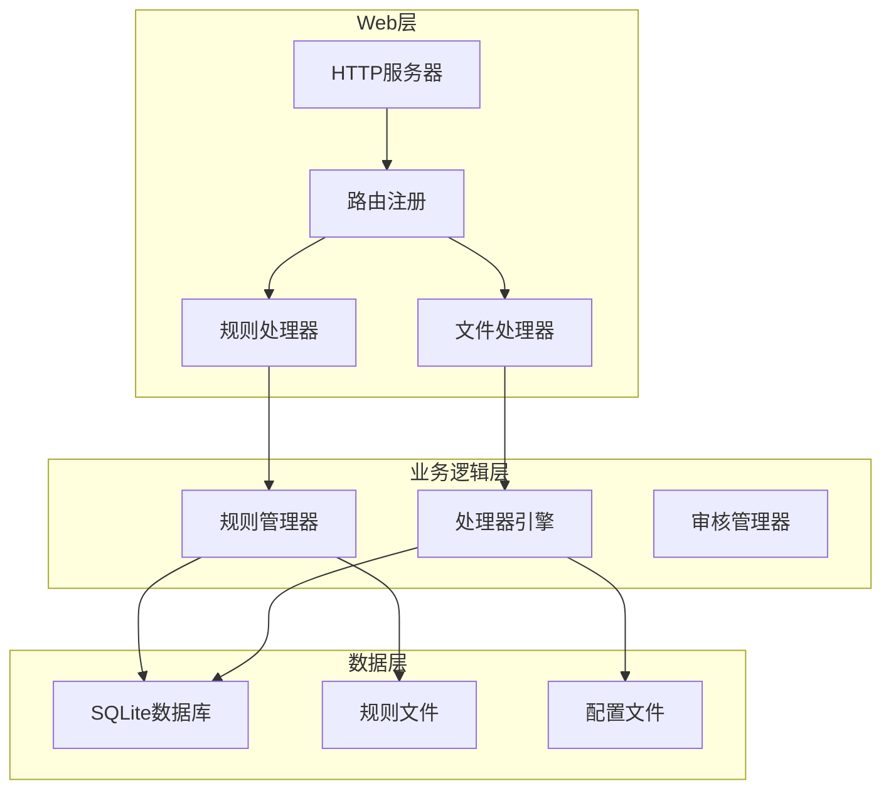
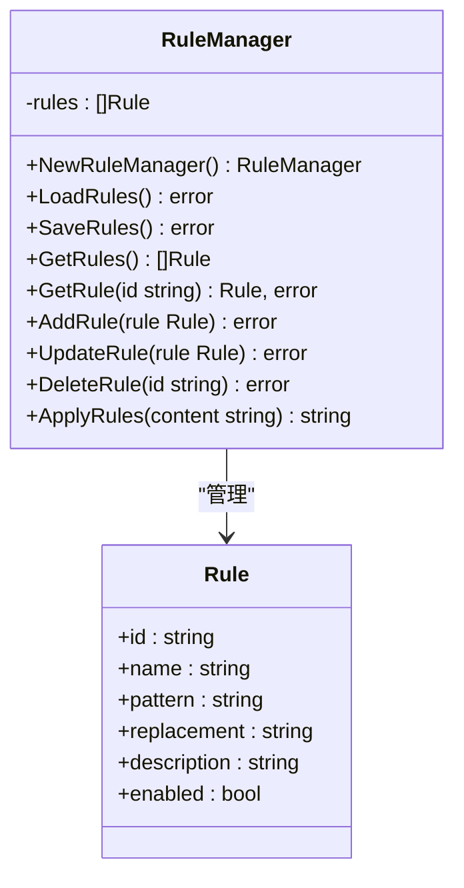
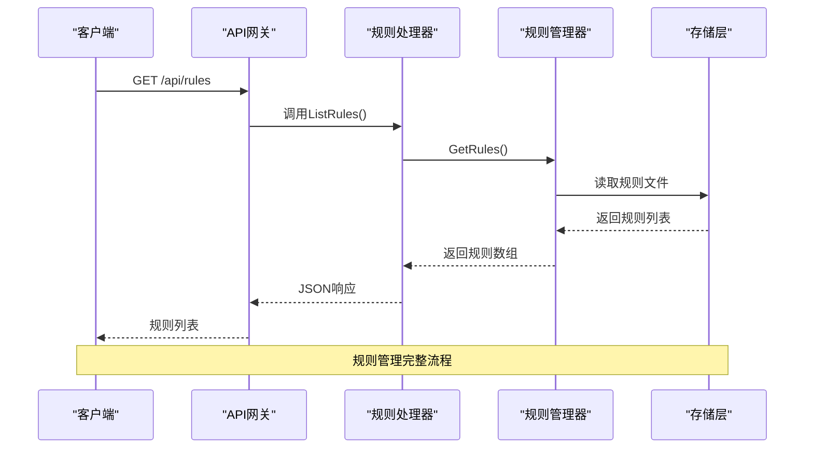
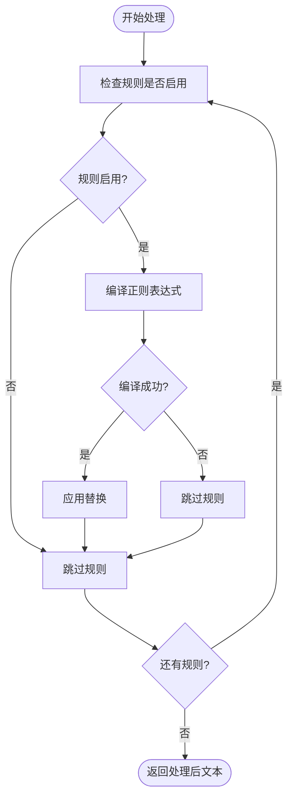
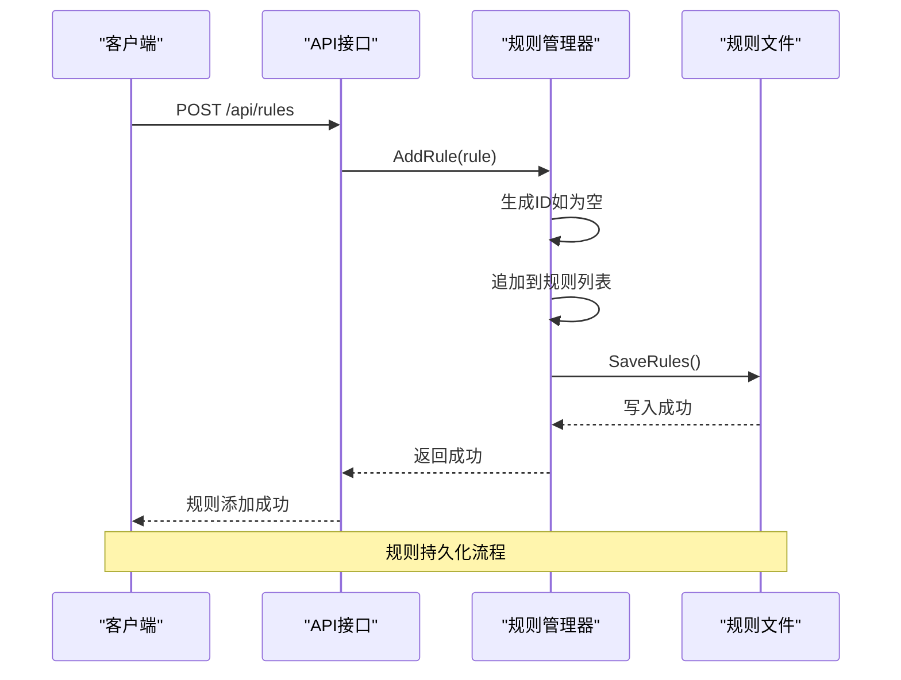
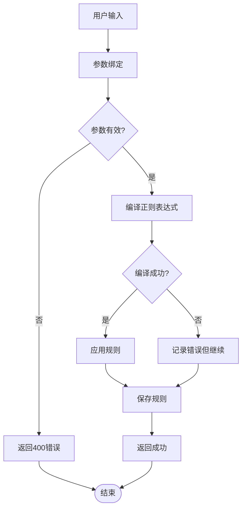
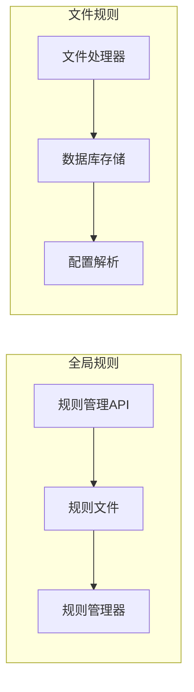
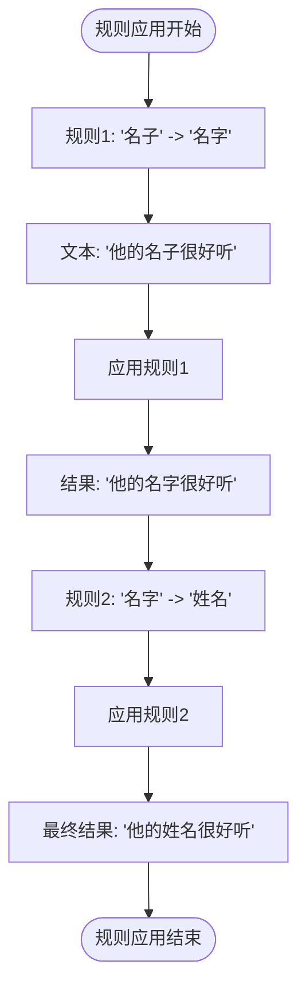
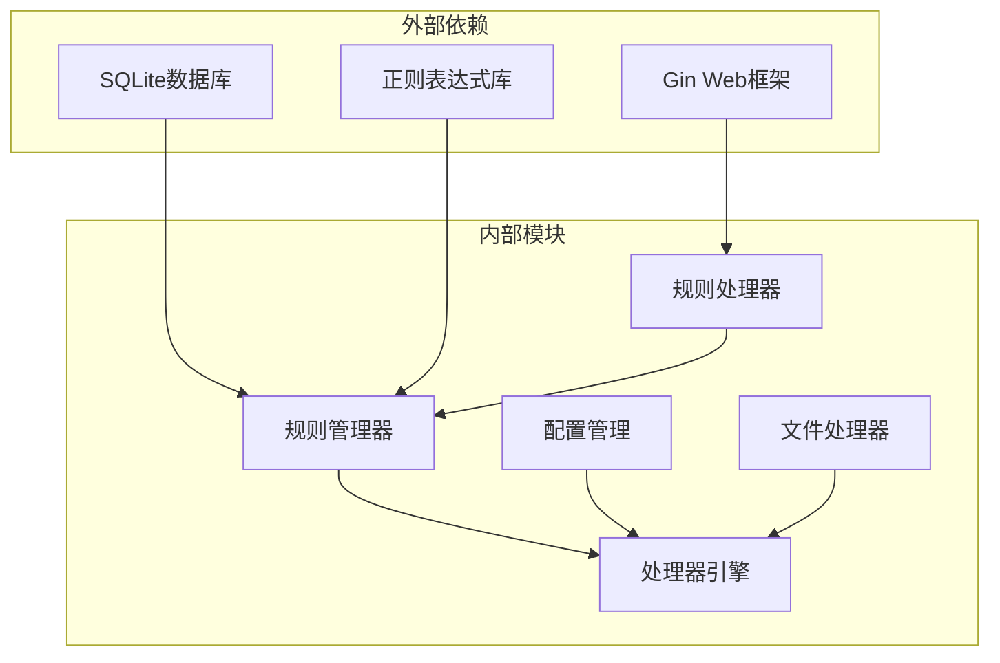

# 规则管理API

<cite>
**本文档引用的文件**
- [rules.go](file://web/backend/handlers/rules.go)
- [rules.go](file://internal/processor/rules/rules.go)
- [processor.go](file://internal/processor/processor.go)
- [server.go](file://web/backend/server.go)
- [05-API接口.md](file://doc/05-API接口.md)
- [rules.json](file://internal/processor/rules.json)
- [config.go](file://internal/config/config.go)
- [files.go](file://web/backend/handlers/files.go)
- [db.go](file://internal/database/db.go)
- [file_repo.go](file://internal/database/file_repo.go)
</cite>

## 目录
1. [简介](#简介)
2. [项目结构](#项目结构)
3. [核心组件](#核心组件)
4. [架构概览](#架构概览)
5. [详细组件分析](#详细组件分析)
6. [依赖关系分析](#依赖关系分析)
7. [性能考虑](#性能考虑)
8. [故障排除指南](#故障排除指南)
9. [结论](#结论)
10. [附录](#附录)

## 简介

本文档详细介绍了文本清洗系统中的规则管理API，涵盖了规则列表查询、添加新规则、删除规则等核心接口。规则系统提供了灵活的文本处理能力，支持正则表达式匹配、自定义替换规则以及动态配置管理。

规则管理系统采用分层架构设计，包括：
- **API层**：提供RESTful接口供前端调用
- **处理器层**：实现业务逻辑和规则应用
- **存储层**：基于SQLite的持久化存储
- **配置层**：支持运行时配置调整

## 项目结构

规则管理API位于以下关键位置：



**图表来源**
- [server.go:10-57](file://web/backend/server.go#L10-L57)
- [rules.go:28-33](file://internal/processor/rules/rules.go#L28-L33)
- [processor.go:33-34](file://internal/processor/processor.go#L33-L34)

**章节来源**
- [server.go:10-57](file://web/backend/server.go#L10-L57)
- [rules.go:28-33](file://internal/processor/rules/rules.go#L28-L33)

## 核心组件

### 规则管理器 (RuleManager)

规则管理器是规则系统的核心组件，负责规则的生命周期管理：



**图表来源**
- [rules.go:23-26](file://internal/processor/rules/rules.go#L23-L26)
- [rules.go:13-21](file://internal/processor/rules/rules.go#L13-L21)

### 规则数据结构

每个规则包含以下字段：
- **ID**: 规则唯一标识符（自动生成）
- **名称**: 规则描述性名称
- **模式**: 正则表达式模式
- **替换**: 替换文本
- **描述**: 规则用途说明
- **启用状态**: 是否生效

**章节来源**
- [rules.go:13-21](file://internal/processor/rules/rules.go#L13-L21)

## 架构概览

规则管理API采用经典的三层架构：



**图表来源**
- [rules.go:12-19](file://web/backend/handlers/rules.go#L12-L19)
- [rules.go:88-91](file://internal/processor/rules/rules.go#L88-L91)

## 详细组件分析

### API接口定义

#### 规则列表查询

**接口**: `GET /api/rules`
**功能**: 获取所有自定义规则列表

请求示例:
```bash
curl -X GET http://localhost:8080/api/rules
```

响应格式:
```json
{
  "success": true,
  "rules": [
    {
      "id": "1",
      "name": "广告清理",
      "pattern": "本文由.*提供",
      "replacement": "",
      "description": "清理常见的广告文本",
      "enabled": true
    }
  ]
}
```

**章节来源**
- [rules.go:12-19](file://web/backend/handlers/rules.go#L12-L19)
- [05-API接口.md:372-399](file://doc/05-API接口.md#L372-L399)

#### 添加新规则

**接口**: `POST /api/rules`
**功能**: 添加新的自定义规则

请求示例:
```bash
curl -X POST http://localhost:8080/api/rules \
  -H "Content-Type: application/json" \
  -d '{
    "name": "错别字修正",
    "pattern": "名子",
    "replacement": "名字",
    "description": "修正常见错别字",
    "enabled": true
  }'
```

请求参数:
| 参数 | 类型 | 必需 | 描述 |
|------|------|------|------|
| name | string | 是 | 规则名称 |
| pattern | string | 是 | 正则表达式模式 |
| replacement | string | 是 | 替换文本 |
| description | string | 否 | 规则描述 |
| enabled | boolean | 否 | 是否启用 |

响应格式:
```json
{
  "success": true,
  "message": "规则添加成功"
}
```

**章节来源**
- [rules.go:21-54](file://web/backend/handlers/rules.go#L21-L54)
- [05-API接口.md:401-431](file://doc/05-API接口.md#L401-L431)

#### 删除规则

**接口**: `DELETE /api/rules/:id`
**功能**: 删除指定ID的规则

请求示例:
```bash
curl -X DELETE http://localhost:8080/api/rules/1
```

路径参数:
| 参数 | 类型 | 必需 | 描述 |
|------|------|------|------|
| id | string | 是 | 规则ID |

响应格式:
```json
{
  "success": true,
  "message": "规则删除成功"
}
```

**章节来源**
- [rules.go:56-68](file://web/backend/handlers/rules.go#L56-L68)

### 规则应用机制

规则系统采用简单的线性扫描算法：



**图表来源**
- [rules.go:139-150](file://internal/processor/rules/rules.go#L139-L150)

### 规则优先级管理

规则系统采用**线性优先级**机制：
- 规则按在列表中的顺序依次应用
- 每个规则独立处理，不考虑其他规则的影响
- 后应用的规则可能覆盖先前规则的效果

这种设计简单直观，便于理解和调试。

**章节来源**
- [rules.go:140-149](file://internal/processor/rules/rules.go#L140-L149)

### 动态更新机制

规则系统支持实时动态更新：



**图表来源**
- [rules.go:103-115](file://internal/processor/rules/rules.go#L103-L115)

**章节来源**
- [rules.go:74-86](file://internal/processor/rules/rules.go#L74-L86)

### 规则验证策略

规则系统实施多层次验证：

1. **输入验证**: 使用Gin框架的参数绑定进行基本验证
2. **正则表达式验证**: 在应用规则时编译正则表达式
3. **文件系统验证**: 确保规则文件存在且可读写



**图表来源**
- [rules.go:32-35](file://web/backend/handlers/rules.go#L32-L35)
- [rules.go:143-147](file://internal/processor/rules/rules.go#L143-L147)

**章节来源**
- [rules.go:32-35](file://web/backend/handlers/rules.go#L32-L35)
- [rules.go:143-147](file://internal/processor/rules/rules.go#L143-L147)

### 规则格式规范

规则文件遵循JSON格式规范：

```json
[
  {
    "id": "1",
    "name": "广告清理",
    "pattern": "本文由.*提供",
    "replacement": "",
    "description": "清理常见的广告文本",
    "enabled": true
  }
]
```

字段要求:
- **id**: 字符串，推荐使用数字字符串
- **name**: 字符串，必填
- **pattern**: 字符串，必填，有效的正则表达式
- **replacement**: 字符串，必填
- **description**: 字符串，可选
- **enabled**: 布尔值，可选，默认true

**章节来源**
- [rules.json:1-18](file://internal/processor/rules.json#L1-L18)

### 规则生效范围

规则系统支持两种生效范围：

1. **全局规则**: 通过规则管理API添加的规则
2. **文件规则**: 通过文件处理器配置的规则



**图表来源**
- [processor.go:98-108](file://internal/processor/processor.go#L98-L108)

**章节来源**
- [processor.go:98-108](file://internal/processor/processor.go#L98-L108)

### 规则冲突处理

规则系统采用**最后应用优先**的冲突处理策略：



**图表来源**
- [rules.go:177-187](file://internal/processor/rules/rules.go#L177-L187)

## 依赖关系分析



**图表来源**
- [server.go:3-10](file://web/backend/server.go#L3-L10)
- [rules.go:3-11](file://internal/processor/rules/rules.go#L3-L11)

**章节来源**
- [server.go:3-10](file://web/backend/server.go#L3-L10)
- [rules.go:3-11](file://internal/processor/rules/rules.go#L3-L11)

## 性能考虑

### 规则应用性能

规则应用采用线性扫描算法，时间复杂度为O(n*m)，其中：
- n: 规则数量
- m: 文本长度

优化建议:
1. **规则排序**: 将最常用的规则放在前面
2. **正则优化**: 使用高效的正则表达式模式
3. **批量处理**: 对大量文本进行批量处理

### 存储性能

规则文件采用JSON格式存储，具有以下特点：
- **读取性能**: 一次性读取整个文件，适合规则数量较小的情况
- **写入性能**: 完整重写文件，适合规则变更频率较低的情况
- **并发安全**: 文件锁机制确保并发访问的安全性

## 故障排除指南

### 常见问题及解决方案

1. **规则添加失败**
   - 检查正则表达式格式是否正确
   - 确认规则文件权限是否正确
   - 查看服务器日志获取详细错误信息

2. **规则不生效**
   - 确认规则状态为启用
   - 检查规则优先级是否被其他规则覆盖
   - 验证文本内容是否匹配正则表达式

3. **API调用错误**
   - 检查请求参数格式是否正确
   - 确认Content-Type设置为application/json
   - 验证服务器端口和地址配置

**章节来源**
- [rules.go:48-51](file://web/backend/handlers/rules.go#L48-L51)
- [rules.go:129-136](file://internal/processor/rules/rules.go#L129-L136)

## 结论

规则管理API提供了完整的规则生命周期管理功能，包括规则的创建、查询、更新和删除。系统采用简洁的设计理念，易于理解和维护。通过合理的架构设计和错误处理机制，确保了系统的稳定性和可靠性。

主要优势:
- **简单易用**: API设计直观，易于集成
- **灵活配置**: 支持多种规则类型和配置选项
- **实时生效**: 规则变更立即生效
- **持久化存储**: 规则配置持久化保存

## 附录

### API调用示例

完整的规则管理API调用示例：

```bash
# 获取规则列表
curl http://localhost:8080/api/rules

# 添加新规则
curl -X POST http://localhost:8080/api/rules \
  -H "Content-Type: application/json" \
  -d '{"name":"测试规则","pattern":"测试","replacement":"示例","enabled":true}'

# 删除规则
curl -X DELETE http://localhost:8080/api/rules/1
```

### 最佳实践

1. **规则命名**: 使用描述性强的规则名称
2. **正则优化**: 使用精确的正则表达式模式
3. **规则组织**: 按功能分类组织规则
4. **版本控制**: 对重要规则进行版本管理
5. **监控告警**: 建立规则效果监控机制