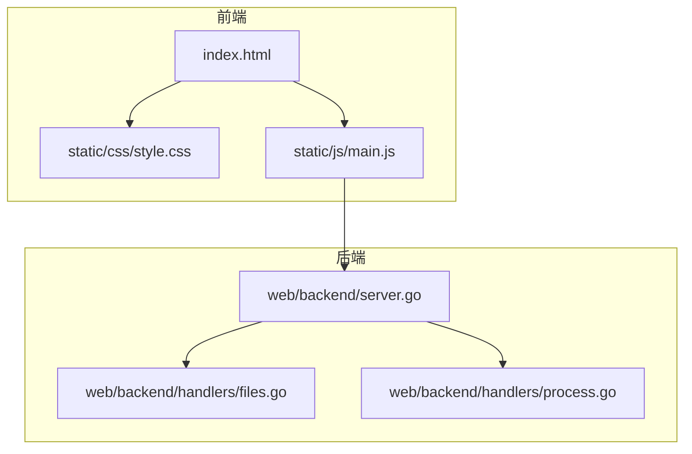
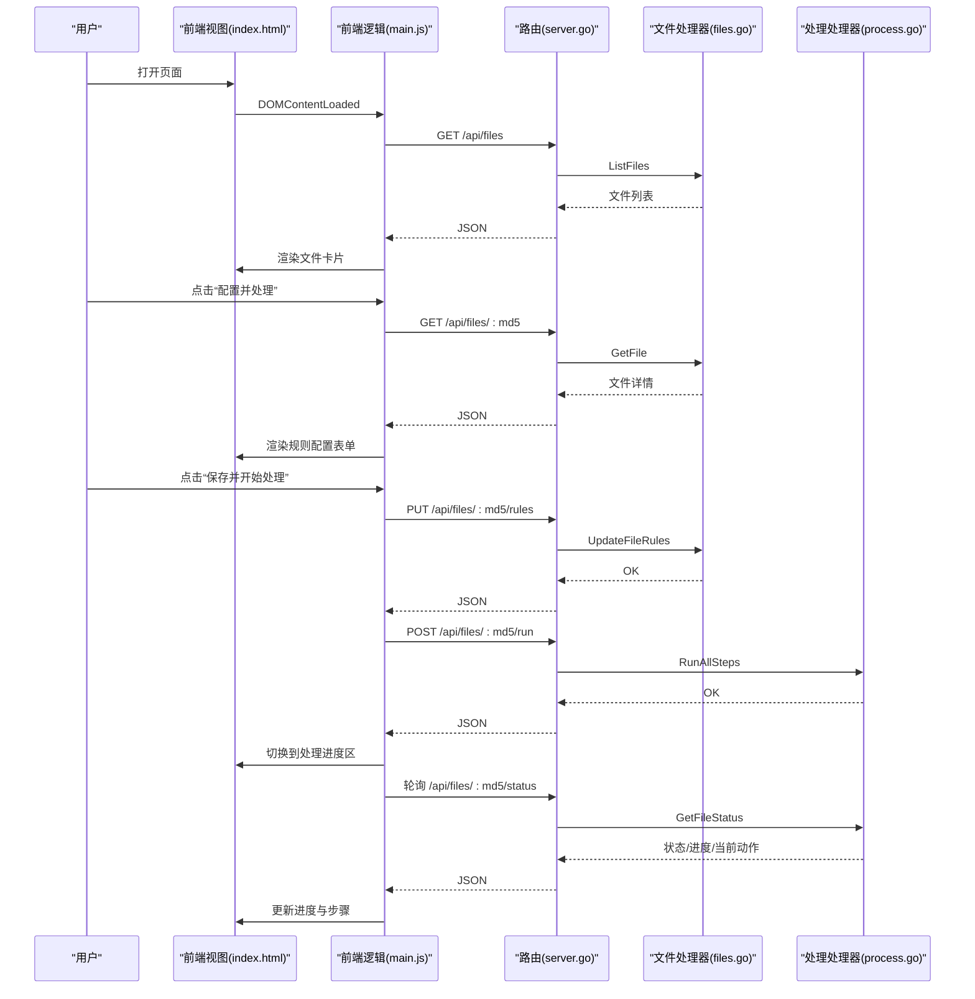
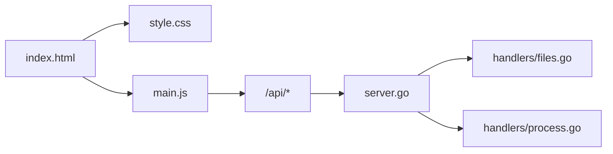

# 前端界面设计

<cite>
**本文引用的文件**
- [index.html](file://web/frontend/index.html)
- [style.css](file://web/frontend/static/css/style.css)
- [main.js](file://web/frontend/static/js/main.js)
- [server.go](file://web/backend/server.go)
- [files.go](file://web/backend/handlers/files.go)
- [process.go](file://web/backend/handlers/process.go)
- [config.go](file://internal/config/config.go)
- [02-系统架构.md](file://doc/02-系统架构.md)
- [05-API接口.md](file://doc/05-API接口.md)
- [rules.json](file://internal/processor/rules.json)
</cite>

## 目录
1. [简介](#简介)
2. [项目结构](#项目结构)
3. [核心组件](#核心组件)
4. [架构总览](#架构总览)
5. [详细组件分析](#详细组件分析)
6. [依赖关系分析](#依赖关系分析)
7. [性能考虑](#性能考虑)
8. [故障排查指南](#故障排查指南)
9. [结论](#结论)
10. [附录](#附录)

## 简介
本文件面向txtCleaning前端界面，系统化梳理HTML结构、CSS样式与JavaScript交互逻辑，覆盖响应式设计、跨浏览器兼容性、用户工作流程、界面导航、主题与定制、与后端API的集成、用户体验优化与无障碍合规、状态管理与动画过渡、以及前端性能优化与最佳实践。目标是帮助开发者与产品人员快速理解并维护该单页应用的UI与交互。

## 项目结构
前端位于web/frontend目录，采用静态资源直出与SPA模式：
- HTML页面负责布局与占位，通过脚本动态渲染与交互
- CSS提供统一的主题与响应式样式
- JS负责路由切换、状态管理、轮询与API调用

图表来源
- [index.html:1-230](file://web/frontend/index.html#L1-L230)
- [style.css:1-897](file://web/frontend/static/css/style.css#L1-L897)
- [main.js:1-791](file://web/frontend/static/js/main.js#L1-L791)
- [server.go:1-58](file://web/backend/server.go#L1-L58)
- [files.go:1-393](file://web/backend/handlers/files.go#L1-L393)
- [process.go:1-511](file://web/backend/handlers/process.go#L1-L511)

章节来源
- [index.html:1-230](file://web/frontend/index.html#L1-L230)
- [style.css:1-897](file://web/frontend/static/css/style.css#L1-L897)
- [main.js:1-791](file://web/frontend/static/js/main.js#L1-L791)
- [server.go:1-58](file://web/backend/server.go#L1-L58)
- [files.go:1-393](file://web/backend/handlers/files.go#L1-L393)
- [process.go:1-511](file://web/backend/handlers/process.go#L1-L511)

## 核心组件
- 页面容器与导航
  - 顶部标题与导航按钮，用于在“文件列表”和“上传文件”之间切换
  - 导航按钮具备激活态样式与悬停反馈
- 文件列表区域
  - 展示每个文件的卡片，包含标题、作者、状态、当前步骤、进度、更新时间等元信息
  - 不同状态对应不同左侧边框颜色，直观区分
  - 根据状态显示不同的操作按钮（如配置并处理、查看进度、继续处理、下载、重新处理、删除）
- 上传区域
  - 支持点击或拖拽上传 .txt 文件
  - 上传后根据是否已存在、是否为中间版本、是否成功，给出不同反馈与操作入口
- 规则配置表单
  - 基础清洗开关、繁简转换开关、向量检测开关、相似度阈值、LLM修复开关
  - 错别字映射与广告黑名单正则的多行输入
  - 保存并开始处理、取消
- 处理进度区域
  - 步骤进度指示（基础清洗、向量检测、LLM修复、人工审核、生成文件），含脉冲动画
  - 总体进度条与百分比
  - 当前文件信息、当前动作、消息提示
  - 下载当前版本、返回列表
- 审核界面
  - 状态筛选（待审核/全部/已通过/已拒绝/已编辑）
  - 全部通过、全部拒绝
  - 审核项列表，每项包含行号、状态徽标、置信度、类型、上下文、原句与建议、操作按钮（通过/拒绝/编辑/恢复）
  - 审核进度显示与完成按钮
- 完成界面
  - 显示处理完成信息与MD5
  - 下载最终文件、查看报告、返回列表

章节来源
- [index.html:10-229](file://web/frontend/index.html#L10-L229)
- [style.css:219-800](file://web/frontend/static/css/style.css#L219-L800)
- [main.js:5-33](file://web/frontend/static/js/main.js#L5-L33)
- [main.js:96-156](file://web/frontend/static/js/main.js#L96-L156)
- [main.js:219-288](file://web/frontend/static/js/main.js#L219-L288)
- [main.js:292-391](file://web/frontend/static/js/main.js#L292-L391)
- [main.js:395-511](file://web/frontend/static/js/main.js#L395-L511)
- [main.js:520-746](file://web/frontend/static/js/main.js#L520-L746)
- [main.js:750-761](file://web/frontend/static/js/main.js#L750-L761)

## 架构总览
前端采用单页应用（SPA）模式，通过JavaScript控制显示区域与交互，与后端通过REST API通信。后端以Gin框架提供路由，处理器负责业务逻辑与数据库交互。

图表来源
- [server.go:28-54](file://web/backend/server.go#L28-L54)
- [files.go:254-279](file://web/backend/handlers/files.go#L254-L279)
- [process.go:15-77](file://web/backend/handlers/process.go#L15-L77)
- [process.go:79-121](file://web/backend/handlers/process.go#L79-L121)
- [main.js:292-391](file://web/frontend/static/js/main.js#L292-L391)
- [main.js:395-511](file://web/frontend/static/js/main.js#L395-L511)

章节来源
- [02-系统架构.md:148-172](file://doc/02-系统架构.md#L148-L172)
- [05-API接口.md:1-506](file://doc/05-API接口.md#L1-L506)

## 详细组件分析

### 页面结构与导航
- 结构要点
  - 使用语义化的header与main包裹内容，section按功能区域划分
  - 导航按钮通过onclick直接切换显示区域，并更新激活态
- 交互要点
  - showSection函数统一控制六个区域的显隐
  - 导航按钮的active类与非active类切换
- 样式要点
  - 头部渐变背景、圆角与阴影，提升层级感
  - 主体区域白色背景与阴影，形成卡片化布局

章节来源
- [index.html:11-22](file://web/frontend/index.html#L11-L22)
- [index.html:24-48](file://web/frontend/index.html#L24-L48)
- [style.css:23-72](file://web/frontend/static/css/style.css#L23-L72)
- [main.js:5-33](file://web/frontend/static/js/main.js#L5-L33)

### 文件列表与卡片
- 渲染逻辑
  - refreshFileList通过API获取文件列表，遍历生成卡片
  - 根据状态添加对应的CSS类，实现不同颜色的左侧边框
  - 根据状态动态生成操作按钮
- 用户交互
  - 删除文件前二次确认
  - 重新处理会清除旧记录并回到规则配置
  - 继续处理会先恢复状态再启动处理
- 可访问性
  - 卡片内文本溢出使用省略号，避免布局破坏
  - 错误信息使用红色背景与边框，突出警示

章节来源
- [main.js:96-156](file://web/frontend/static/js/main.js#L96-L156)
- [style.css:219-253](file://web/frontend/static/css/style.css#L219-L253)

### 上传与拖拽
- 上传流程
  - 支持点击选择与拖拽放置两种方式
  - 上传后根据后端返回状态显示不同结果区域
  - 已存在、中间版本、新文件三种分支分别引导用户操作
- 样式与反馈
  - 拖拽悬停时高亮边框与浅色背景
  - 加载、成功、错误、存在等状态卡片样式明确

章节来源
- [index.html:38-47](file://web/frontend/index.html#L38-L47)
- [main.js:219-288](file://web/frontend/static/js/main.js#L219-L288)
- [style.css:304-374](file://web/frontend/static/css/style.css#L304-L374)

### 规则配置表单
- 表单字段
  - 基础清洗、繁体转简体、向量检测、相似度阈值、LLM修复
  - 错别字映射（多行，每行一个映射对）
  - 广告黑名单正则（多行）
- 保存逻辑
  - 将表单组装为规则对象，PUT到后端
  - 成功后立即启动处理流程

章节来源
- [index.html:50-115](file://web/frontend/index.html#L50-L115)
- [main.js:292-391](file://web/frontend/static/js/main.js#L292-L391)

### 处理进度与步骤指示
- 步骤指示
  - 五个步骤节点，active状态带脉冲动画，completed状态使用绿色图标
  - 连接线随步骤推进显示
- 进度条
  - 总体进度条宽度与百分比文本联动
- 实时信息
  - 当前文件信息、当前动作、消息提示
- 用户操作
  - 下载当前版本、返回列表

章节来源
- [index.html:117-163](file://web/frontend/index.html#L117-L163)
- [style.css:432-548](file://web/frontend/static/css/style.css#L432-L548)
- [main.js:395-511](file://web/frontend/static/js/main.js#L395-L511)

### 审核界面
- 列表渲染
  - 支持按状态筛选，渲染每条建议的上下文、原句与建议
  - 置信度徽标、状态徽标、行号与类型标签
- 审核操作
  - 通过/拒绝/编辑/恢复；批量通过/拒绝
  - 完成审核后显示“完成审核并生成文件”按钮
- 进度更新
  - 轮询获取审核总数与已处理数，动态更新按钮可见性

章节来源
- [index.html:165-205](file://web/frontend/index.html#L165-L205)
- [style.css:617-781](file://web/frontend/static/css/style.css#L617-L781)
- [main.js:520-746](file://web/frontend/static/js/main.js#L520-L746)

### 完成界面
- 显示处理完成信息与MD5
- 提供下载最终文件、查看报告、返回列表

章节来源
- [index.html:207-222](file://web/frontend/index.html#L207-L222)
- [main.js:750-761](file://web/frontend/static/js/main.js#L750-L761)

### 状态管理与轮询
- 状态管理
  - currentFileMd5：当前文件MD5
  - pollingTimer：轮询定时器
- 轮询机制
  - 处理阶段每2秒轮询一次状态
  - 进入审核或完成时停止轮询
  - 轮询期间根据状态切换到相应区域

章节来源
- [main.js:1-3](file://web/frontend/static/js/main.js#L1-L3)
- [main.js:434-472](file://web/frontend/static/js/main.js#L434-L472)
- [02-系统架构.md:166-171](file://doc/02-系统架构.md#L166-L171)

### 动画与过渡
- 脉冲动画：步骤active时的脉冲效果
- 进度条过渡：宽度变化平滑过渡
- 悬停反馈：按钮与卡片hover态
- 拖拽高亮：上传区域拖拽悬停态

章节来源
- [style.css:471-481](file://web/frontend/static/css/style.css#L471-L481)
- [style.css:532-538](file://web/frontend/static/css/style.css#L532-L538)
- [style.css:314-321](file://web/frontend/static/css/style.css#L314-L321)

## 依赖关系分析
- 前端依赖
  - HTML依赖CSS与JS
  - JS依赖后端API与浏览器特性（fetch、FormData、DataTransfer、定时器）
- 后端依赖
  - Gin路由注册与CORS配置
  - 处理器依赖内部模块（config、database、file、processor）

图表来源
- [index.html:7-8](file://web/frontend/index.html#L7-L8)
- [index.html:227-228](file://web/frontend/index.html#L227-L228)
- [server.go:28-54](file://web/backend/server.go#L28-L54)
- [files.go:18-71](file://web/backend/handlers/files.go#L18-L71)
- [process.go:15-77](file://web/backend/handlers/process.go#L15-L77)

章节来源
- [server.go:14-20](file://web/backend/server.go#L14-L20)
- [files.go:18-71](file://web/backend/handlers/files.go#L18-L71)
- [process.go:15-77](file://web/backend/handlers/process.go#L15-L77)

## 性能考虑
- 资源加载
  - 静态资源带版本号查询参数，便于缓存控制
- 渲染优化
  - 使用模板字符串拼接列表项，减少DOM操作
  - 仅在必要时更新进度条与文本
- 轮询频率
  - 2秒轮询一次，平衡实时性与网络负载
- 图片与字体
  - 使用系统字体栈，避免额外字体资源
- 响应式
  - 使用flex布局与相对单位，适配不同屏幕尺寸

章节来源
- [index.html:7](file://web/frontend/index.html#L7-L7)
- [main.js:434-472](file://web/frontend/static/js/main.js#L434-L472)
- [style.css:17-21](file://web/frontend/static/css/style.css#L17-L21)

## 故障排查指南
- CORS问题
  - 后端已启用CORS，允许特定来源与方法
- 上传失败
  - 检查文件类型与大小限制
  - 查看后端返回的错误消息
- 处理状态不更新
  - 确认轮询定时器是否存在
  - 检查后端状态接口返回
- 审核项为空
  - 确认文件是否进入审核阶段
  - 检查筛选条件

章节来源
- [server.go:14-20](file://web/backend/server.go#L14-L20)
- [files.go:26-35](file://web/backend/handlers/files.go#L26-L35)
- [process.go:79-121](file://web/backend/handlers/process.go#L79-L121)
- [main.js:434-472](file://web/frontend/static/js/main.js#L434-L472)

## 结论
该前端界面以简洁清晰的卡片化布局与步骤指示为核心，结合规则配置、处理进度与审核界面，形成完整的文本清洗工作流。通过合理的状态管理与轮询机制，实现了准实时的进度反馈。样式采用扁平化与渐变搭配，具备良好的可读性与一致性。建议后续可引入主题切换、无障碍增强与更细粒度的错误处理与提示。

## 附录

### 响应式设计与跨浏览器兼容性
- 响应式
  - 使用max-width与居中布局，适配桌面与平板
  - flex布局在现代浏览器表现稳定
- 兼容性
  - 使用标准HTML5与ES5语法
  - fetch与FormData在主流浏览器可用
  - 通过CORS解决跨域问题

章节来源
- [style.css:17-21](file://web/frontend/static/css/style.css#L17-L21)
- [server.go:14-20](file://web/backend/server.go#L14-L20)

### 用户工作流程与界面导航
- 文件上传 → 规则配置 → 处理进度 → 审核 → 完成
- 导航按钮与区域切换，支持返回列表与继续处理

章节来源
- [index.html:14-20](file://web/frontend/index.html#L14-L20)
- [main.js:5-33](file://web/frontend/static/js/main.js#L5-L33)

### 界面定制与主题支持
- 当前主题为深蓝渐变头部与卡片化布局
- 可通过扩展CSS变量与类名实现主题切换（建议在样式层新增主题变量与覆盖规则）

章节来源
- [style.css:23-72](file://web/frontend/static/css/style.css#L23-L72)

### 前端与后端API集成
- 路由注册与静态资源映射
- 文件上传、列表、详情、下载、删除、恢复、规则更新、运行、状态、审核项、批量操作、最终生成、报告等接口

章节来源
- [server.go:28-54](file://web/backend/server.go#L28-L54)
- [05-API接口.md:1-506](file://doc/05-API接口.md#L1-L506)

### 用户体验优化与无障碍合规
- 可访问性建议
  - 为按钮与链接提供aria-label
  - 为表单控件提供label关联
  - 为关键状态信息提供屏幕阅读器友好的文本
- 无障碍建议
  - 为步骤指示提供aria-live区域
  - 为上传区域提供键盘可达性

章节来源
- [index.html:50-115](file://web/frontend/index.html#L50-L115)
- [style.css:432-548](file://web/frontend/static/css/style.css#L432-L548)

### 状态管理、动画与过渡效果
- 状态管理：currentFileMd5与pollingTimer
- 动画：步骤active脉冲、进度条过渡、hover反馈
- 过渡：卡片阴影与按钮过渡

章节来源
- [main.js:1-3](file://web/frontend/static/js/main.js#L1-L3)
- [style.css:471-481](file://web/frontend/static/css/style.css#L471-L481)
- [style.css:532-538](file://web/frontend/static/css/style.css#L532-L538)

### 前端性能优化与最佳实践
- 资源版本化、按需渲染、合理轮询、减少DOM操作、使用系统字体栈

章节来源
- [index.html:7](file://web/frontend/index.html#L7-L7)
- [main.js:434-472](file://web/frontend/static/js/main.js#L434-L472)
- [style.css:8-15](file://web/frontend/static/css/style.css#L8-L15)