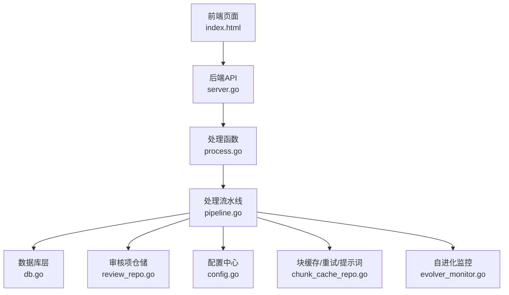
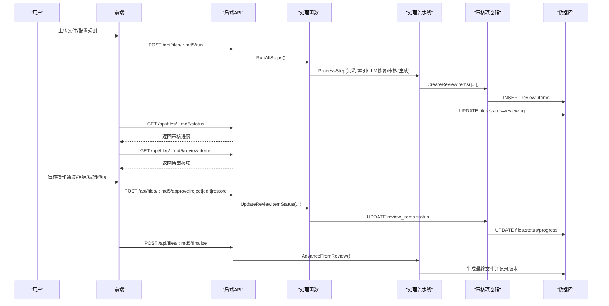
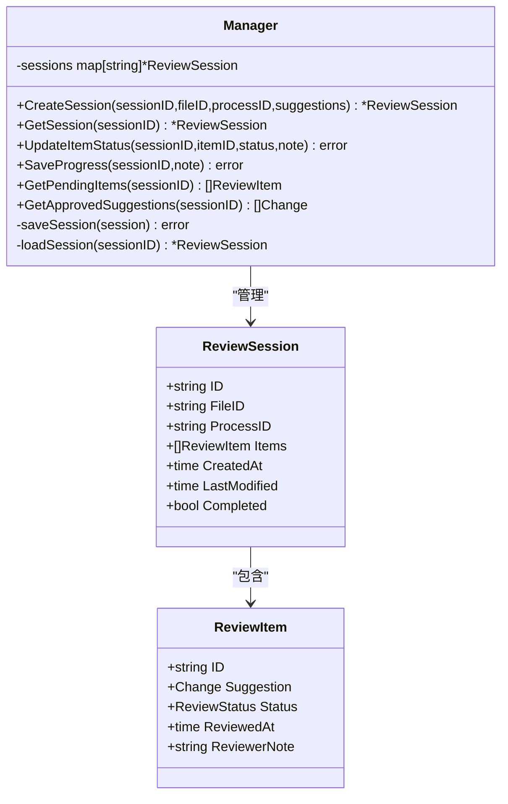
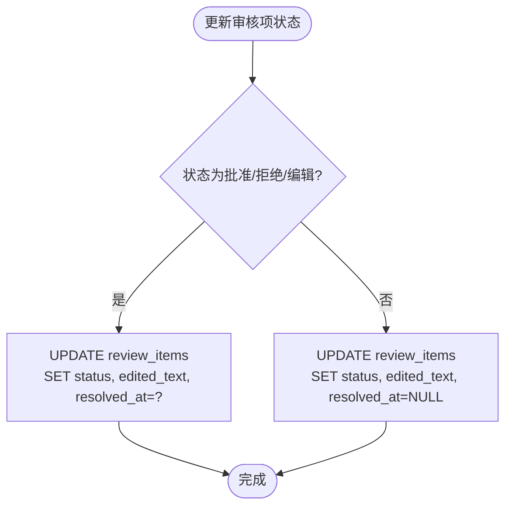
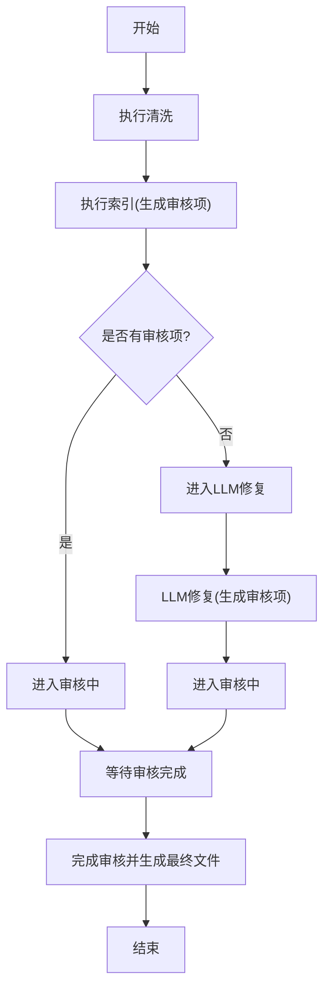
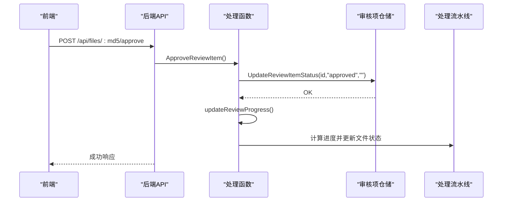
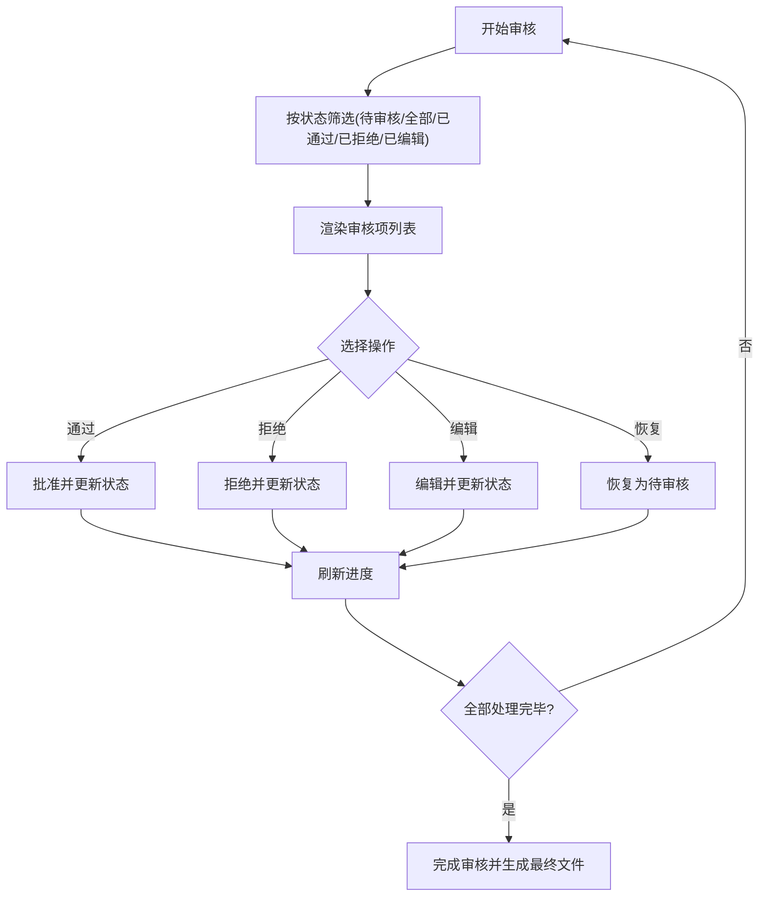
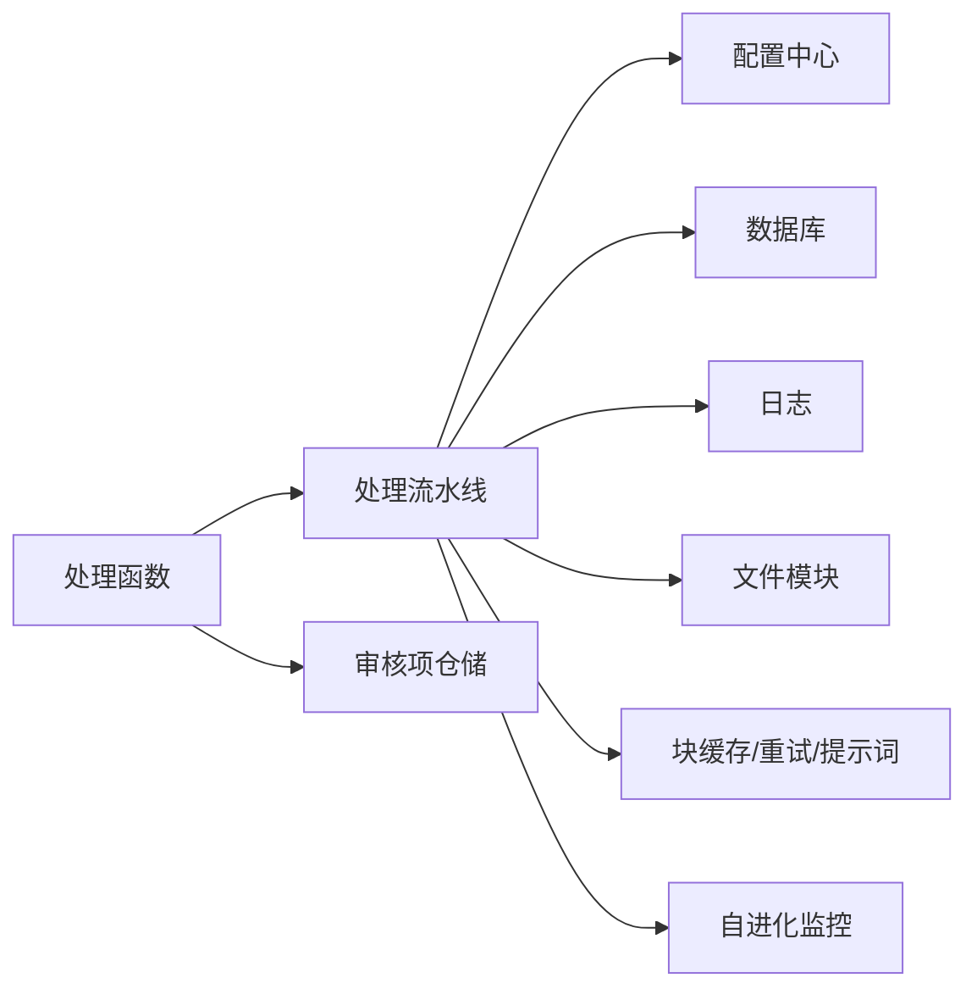

# 审核管理系统

<cite>
**本文引用的文件**
- [manager.go](file://internal/review/manager/manager.go)
- [review_repo.go](file://internal/database/review_repo.go)
- [process.go](file://web/backend/handlers/process.go)
- [pipeline.go](file://internal/processor/pipeline.go)
- [config.go](file://internal/config/config.go)
- [db.go](file://internal/database/db.go)
- [index.html](file://web/frontend/index.html)
- [server.go](file://web/backend/server.go)
- [main.js](file://web/frontend/static/js/main.js)
- [chunk_cache_repo.go](file://internal/database/chunk_cache_repo.go)
- [evolver_monitor.go](file://internal/processor/evolver_monitor.go)
</cite>

## 目录
1. [简介](#简介)
2. [项目结构](#项目结构)
3. [核心组件](#核心组件)
4. [架构总览](#架构总览)
5. [详细组件分析](#详细组件分析)
6. [依赖分析](#依赖分析)
7. [性能考虑](#性能考虑)
8. [故障排查指南](#故障排查指南)
9. [结论](#结论)
10. [附录](#附录)

## 简介
本文件面向VoidText的审核管理系统，围绕“人工审核流程”的设计与实现进行系统化文档化，涵盖审核项的生成、分配与处理机制，状态管理、权限控制与工作流逻辑，审核员操作界面与审核标准，效率优化与质量保证，统计与报告，数据保存与追溯，以及监控与异常处理，并讨论系统的可扩展性与定制能力。文档以代码为依据，配合可视化图示帮助读者快速理解与落地实施。

## 项目结构
系统采用前后端分离架构：
- 前端：静态页面与交互脚本，负责展示文件列表、上传、规则配置、处理进度、审核界面与报告。
- 后端：Gin Web服务，提供REST API，协调处理器与数据库层。
- 处理器：按步骤执行清洗、向量检测、LLM修复、人工审核、生成文件等流水线。
- 数据库：SQLite，存储文件元数据、版本历史、审核项、处理日志、块缓存与重试队列等。
- 审核管理：内存会话与磁盘持久化结合，支持审核项状态变更与进度计算。

图表来源
- [server.go:10-57](file://web/backend/server.go#L10-L57)
- [process.go:15-77](file://web/backend/handlers/process.go#L15-L77)
- [pipeline.go:104-158](file://internal/processor/pipeline.go#L104-L158)
- [db.go:15-69](file://internal/database/db.go#L15-L69)
- [review_repo.go:25-59](file://internal/database/review_repo.go#L25-L59)
- [config.go:48-122](file://internal/config/config.go#L48-L122)
- [chunk_cache_repo.go:57-65](file://internal/database/chunk_cache_repo.go#L57-L65)
- [evolver_monitor.go:18-41](file://internal/processor/evolver_monitor.go#L18-L41)

章节来源
- [server.go:10-57](file://web/backend/server.go#L10-L57)
- [index.html:1-230](file://web/frontend/index.html#L1-L230)
- [main.js:1-791](file://web/frontend/static/js/main.js#L1-L791)

## 核心组件
- 审核管理器：负责会话创建、状态更新、待审核项过滤、进度保存与持久化。
- 审核项仓储：负责批量创建、查询、更新状态、批量更新、进度统计与删除。
- 处理流水线：定义步骤顺序、计算进度、执行各阶段并生成审核项。
- Web处理器：提供上传、规则配置、运行、状态查询、审核项获取与状态变更、报告生成等API。
- 配置中心：加载环境变量，校验参数，确保运行时一致性。
- 数据库层：初始化SQLite、建表与索引、提供通用DB访问。
- 块缓存与重试：支持断点续传、幂等性、错误重试与提示词版本管理。
- 自进化监控：基于指标阈值触发外部Evolver脚本优化提示词。

章节来源
- [manager.go:44-234](file://internal/review/manager/manager.go#L44-L234)
- [review_repo.go:25-202](file://internal/database/review_repo.go#L25-L202)
- [pipeline.go:19-102](file://internal/processor/pipeline.go#L19-L102)
- [process.go:15-377](file://web/backend/handlers/process.go#L15-L377)
- [config.go:48-204](file://internal/config/config.go#L48-L204)
- [db.go:15-223](file://internal/database/db.go#L15-L223)
- [chunk_cache_repo.go:57-479](file://internal/database/chunk_cache_repo.go#L57-L479)
- [evolver_monitor.go:18-300](file://internal/processor/evolver_monitor.go#L18-L300)

## 架构总览
审核管理贯穿“处理流水线”与“人工审核”两大阶段：
- 处理阶段：清洗→向量检测→LLM修复→生成中间版本→进入审核。
- 审核阶段：审核员在前端界面逐项审批/拒绝/编辑→更新状态→进度统计→完成审核→生成最终文件。

图表来源
- [process.go:15-77](file://web/backend/handlers/process.go#L15-L77)
- [process.go:123-167](file://web/backend/handlers/process.go#L123-L167)
- [process.go:169-256](file://web/backend/handlers/process.go#L169-L256)
- [process.go:302-326](file://web/backend/handlers/process.go#L302-L326)
- [pipeline.go:436-468](file://internal/processor/pipeline.go#L436-L468)
- [review_repo.go:25-59](file://internal/database/review_repo.go#L25-L59)

## 详细组件分析

### 审核管理器（内存+磁盘）
- 会话模型：包含文件ID、处理ID、审核项数组、创建/最后修改时间、完成标记。
- 审核项模型：包含建议、状态、审核时间、审核备注。
- 主要能力：
  - 创建会话并持久化。
  - 获取会话（内存优先，缺失时从磁盘加载）。
  - 更新审核项状态并自动判定会话是否完成。
  - 保存进度（仅更新时间戳）。
  - 过滤待审核项与已批准建议。
  - 会话持久化到磁盘（JSON），目录位于配置数据目录下的reviews子目录。

图表来源
- [manager.go:44-234](file://internal/review/manager/manager.go#L44-L234)

章节来源
- [manager.go:44-234](file://internal/review/manager/manager.go#L44-L234)

### 审核项仓储（数据库）
- 审核项记录字段覆盖原文、建议、修改类型、置信度、位置、状态、编辑文本、创建/解决时间。
- 主要能力：
  - 批量创建审核项（事务封装）。
  - 按文件MD5与状态过滤查询。
  - 按ID查询单条记录。
  - 更新状态与编辑文本，支持批准/拒绝/编辑/恢复。
  - 批量更新状态（事务封装）。
  - 计算审核进度（总数与已处理数）。
  - 删除某文件的所有审核项。
  - 辅助扫描rows为结构体切片。

图表来源
- [review_repo.go:106-126](file://internal/database/review_repo.go#L106-L126)

章节来源
- [review_repo.go:25-202](file://internal/database/review_repo.go#L25-L202)

### 处理流水线与审核生成
- 步骤定义与顺序：清洗→索引→LLM修复→审核→生成文件。
- 进度计算：每个步骤贡献20%，按步骤内进度加权。
- 审核生成：
  - 向量检测与LLM修复阶段将变更写入审核项表。
  - 若无审核项，直接进入下一步；否则进入“审核中”，并更新文件状态为“reviewing”。

图表来源
- [pipeline.go:19-102](file://internal/processor/pipeline.go#L19-L102)
- [pipeline.go:215-271](file://internal/processor/pipeline.go#L215-L271)
- [pipeline.go:273-376](file://internal/processor/pipeline.go#L273-L376)
- [pipeline.go:436-468](file://internal/processor/pipeline.go#L436-L468)

章节来源
- [pipeline.go:19-102](file://internal/processor/pipeline.go#L19-L102)
- [pipeline.go:215-271](file://internal/processor/pipeline.go#L215-L271)
- [pipeline.go:273-376](file://internal/processor/pipeline.go#L273-L376)
- [pipeline.go:436-468](file://internal/processor/pipeline.go#L436-L468)

### Web处理器（API）
- 文件与处理：
  - 上传、列出、获取、下载、删除、恢复、更新规则。
  - 启动处理、查询状态、下载当前版本。
- 审核相关：
  - 获取审核项（支持按状态过滤）、批准、拒绝、编辑、恢复、批量批准/拒绝。
  - 完成审核并生成最终文件。
  - 获取处理报告（含文件信息、审核统计、处理日志、版本历史）。
- 进度更新：
  - 审核项状态变更后，调用进度更新函数，计算并更新文件状态与进度。

图表来源
- [process.go:169-189](file://web/backend/handlers/process.go#L169-L189)
- [process.go:379-387](file://web/backend/handlers/process.go#L379-L387)

章节来源
- [process.go:15-377](file://web/backend/handlers/process.go#L15-L377)

### 审核员操作界面与审核标准
- 界面组成：
  - 文件列表、上传、规则配置、处理进度、审核界面、完成界面。
  - 审核界面支持按状态筛选、批量通过/拒绝、单项通过/拒绝/编辑/恢复。
  - 审核项展示包含上下文行、原始文本、建议文本、置信度、修改类型、行号等。
- 审核标准：
  - 状态枚举：待审核、已通过、已拒绝、已编辑、已跳过。
  - 建议应用顺序：已通过优先，其次已编辑（若编辑文本非空）。
  - 完成条件：当审核项总数大于0且已处理数等于总数时，允许完成审核并生成最终文件。

图表来源
- [index.html:165-205](file://web/frontend/index.html#L165-L205)
- [main.js:518-746](file://web/frontend/static/js/main.js#L518-L746)
- [pipeline.go:524-531](file://internal/processor/pipeline.go#L524-L531)

章节来源
- [index.html:165-205](file://web/frontend/index.html#L165-L205)
- [main.js:518-746](file://web/frontend/static/js/main.js#L518-L746)
- [pipeline.go:524-531](file://internal/processor/pipeline.go#L524-L531)

### 审核状态管理与工作流
- 状态流转：
  - 文件状态：待处理、处理中、审核中、已完成、失败。
  - 审核项状态：pending、approved、rejected、edited、skipped。
  - 流程：处理阶段生成审核项→进入审核中→审核员操作→进度更新→完成审核→生成最终文件。
- 进度计算：
  - 审核进度 = 已处理项数 / 总项数 × 100。
  - 文件整体进度 = 步骤基础进度 + 步骤内进度贡献。

章节来源
- [process.go:379-387](file://web/backend/handlers/process.go#L379-L387)
- [pipeline.go:96-102](file://internal/processor/pipeline.go#L96-L102)
- [review_repo.go:163-174](file://internal/database/review_repo.go#L163-L174)

### 权限控制与安全
- 当前实现未发现显式的鉴权/授权逻辑。建议在生产环境中：
  - 在网关或中间件层增加认证与角色校验。
  - 对敏感API（如删除、恢复、批量操作）增加二次确认与审计日志。
  - 对文件下载与报告生成增加访问控制。

[本节为概念性说明，不直接分析具体文件]

### 审核效率优化与质量保证
- 效率优化：
  - 块级修复缓存：避免重复调用LLM，支持断点续传与幂等性。
  - 重试队列：指数退避重试，降低API限流与失败影响。
  - 提示词版本管理：记录不同版本的成功率与使用统计，便于回滚与优化。
  - 自进化监控：基于命中率与错误率阈值触发外部Evolver脚本优化提示词。
- 质量保证：
  - 置信度字段用于辅助判断。
  - 上下文行展示帮助审核员理解修改背景。
  - 批量操作与一键通过/拒绝提升效率。

章节来源
- [chunk_cache_repo.go:67-100](file://internal/database/chunk_cache_repo.go#L67-L100)
- [chunk_cache_repo.go:169-202](file://internal/database/chunk_cache_repo.go#L169-L202)
- [chunk_cache_repo.go:277-301](file://internal/database/chunk_cache_repo.go#L277-L301)
- [evolver_monitor.go:117-177](file://internal/processor/evolver_monitor.go#L117-L177)

### 审核统计与报告
- 报告内容：
  - 文件基本信息（作者、标题、文件名、状态、进度、创建/更新时间）。
  - 审核统计（总条目、已处理）。
  - 处理日志与版本历史。
- 前端支持HTML格式报告导出。

章节来源
- [process.go:328-377](file://web/backend/handlers/process.go#L328-L377)

### 数据保存与追溯
- 数据持久化：
  - 审核会话：内存+磁盘JSON持久化（reviews目录）。
  - 审核项：数据库表review_items，带索引优化查询。
  - 版本历史：数据库表versions，记录中间版本与最终版本。
  - 处理日志：processing_logs，记录步骤动作与详情。
  - 块缓存与重试：chunk_repair_cache、retry_queue、prompt_versions。
- 追溯能力：
  - 通过文件MD5关联审核项、版本、日志。
  - 支持删除文件时清理其审核记录、版本历史与处理日志。

章节来源
- [manager.go:197-233](file://internal/review/manager/manager.go#L197-L233)
- [db.go:89-222](file://internal/database/db.go#L89-L222)
- [review_repo.go:176-183](file://internal/database/review_repo.go#L176-L183)

### 监控与异常处理
- 监控指标：
  - 缓存命中率、API错误率、平均处理时间等。
- 异常处理：
  - 处理阶段异常捕获并更新文件状态为失败。
  - 审核项状态更新失败返回错误响应。
  - 自进化监控器避免频繁调用，记录执行日志与错误。

章节来源
- [pipeline.go:145-155](file://internal/processor/pipeline.go#L145-L155)
- [process.go:52-71](file://web/backend/handlers/process.go#L52-L71)
- [evolver_monitor.go:179-285](file://internal/processor/evolver_monitor.go#L179-L285)

### 可扩展性与定制能力
- 配置驱动：
  - 通过环境变量控制功能开关（基础清洗、向量检测、LLM修复、Evolver）与阈值。
- 规则定制：
  - 支持繁简转换、广告黑名单、错别字映射等规则配置。
- 提示词优化：
  - 通过提示词版本表与Evolver脚本实现提示词的动态优化。
- 接口扩展：
  - API路由清晰，新增审核相关接口可按现有风格扩展。

章节来源
- [config.go:48-122](file://internal/config/config.go#L48-L122)
- [pipeline.go:61-71](file://internal/processor/pipeline.go#L61-L71)
- [server.go:28-54](file://web/backend/server.go#L28-L54)

## 依赖分析
- 组件耦合：
  - Web处理器依赖处理流水线与数据库仓储。
  - 处理流水线依赖配置中心、文件模块、日志模块、数据库模块。
  - 审核管理器与前端交互较少，主要通过API间接使用。
- 外部依赖：
  - Gin Web框架、SQLite驱动、外部Evolver脚本（可选）。

图表来源
- [process.go:15-77](file://web/backend/handlers/process.go#L15-L77)
- [pipeline.go:104-158](file://internal/processor/pipeline.go#L104-L158)
- [config.go:48-122](file://internal/config/config.go#L48-L122)
- [db.go:15-69](file://internal/database/db.go#L15-L69)
- [chunk_cache_repo.go:57-65](file://internal/database/chunk_cache_repo.go#L57-L65)
- [evolver_monitor.go:18-41](file://internal/processor/evolver_monitor.go#L18-L41)

章节来源
- [process.go:15-77](file://web/backend/handlers/process.go#L15-L77)
- [pipeline.go:104-158](file://internal/processor/pipeline.go#L104-L158)

## 性能考虑
- 数据库并发：
  - SQLite启用WAL模式、设置最大连接数为1，确保写入顺序与并发读取。
  - 建立多处索引，加速查询。
- 缓存与重试：
  - 块修复缓存显著降低重复API调用成本。
  - 重试队列支持指数退避，避免频繁重试。
- 前端轮询：
  - 2秒轮询一次状态，平衡实时性与服务器压力。
- 处理器优化：
  - 事务批量插入与更新，减少IO开销。
  - 进度计算按步骤权重分配，避免复杂运算。

章节来源
- [db.go:29-59](file://internal/database/db.go#L29-L59)
- [db.go:188-202](file://internal/database/db.go#L188-L202)
- [chunk_cache_repo.go:67-100](file://internal/database/chunk_cache_repo.go#L67-L100)
- [chunk_cache_repo.go:169-202](file://internal/database/chunk_cache_repo.go#L169-L202)
- [main.js:434-465](file://web/frontend/static/js/main.js#L434-L465)

## 故障排查指南
- 常见问题与定位：
  - 审核项状态未更新：检查API响应与数据库事务是否成功。
  - 审核进度不变化：确认updateReviewProgress调用链是否正确执行。
  - 处理失败：查看处理日志与文件状态，定位失败步骤。
  - 自进化未触发：检查缓存命中率与错误率阈值，确认Evolver脚本路径与权限。
- 建议措施：
  - 增加API与数据库操作的日志级别。
  - 对关键路径增加超时与重试策略。
  - 对前端操作增加二次确认与错误提示。

章节来源
- [process.go:145-157](file://web/backend/handlers/process.go#L145-L157)
- [process.go:379-387](file://web/backend/handlers/process.go#L379-L387)
- [pipeline.go:145-155](file://internal/processor/pipeline.go#L145-L155)
- [evolver_monitor.go:179-285](file://internal/processor/evolver_monitor.go#L179-L285)

## 结论
本审核管理系统以“处理流水线+人工审核”为核心，通过数据库与内存会话相结合的方式实现高效、可追溯的审核流程。系统具备完善的进度统计、报告生成与质量保障机制，并通过块缓存、重试队列与自进化监控实现持续优化。建议在生产环境中补充鉴权与审计能力，进一步提升安全性与合规性。

## 附录
- API一览（部分）
  - POST /api/files/upload：上传文件
  - POST /api/files/:md5/run：启动处理
  - GET /api/files/:md5/status：查询状态
  - GET /api/files/:md5/review-items：获取审核项
  - POST /api/files/:md5/approve：批准
  - POST /api/files/:md5/reject：拒绝
  - POST /api/files/:md5/edit：编辑
  - POST /api/files/:md5/restore：恢复
  - POST /api/files/:md5/batch-approve：批量批准
  - POST /api/files/:md5/batch-reject：批量拒绝
  - POST /api/files/:md5/finalize：完成审核并生成最终文件
  - GET /api/files/:md5/report：获取处理报告

章节来源
- [server.go:28-54](file://web/backend/server.go#L28-L54)