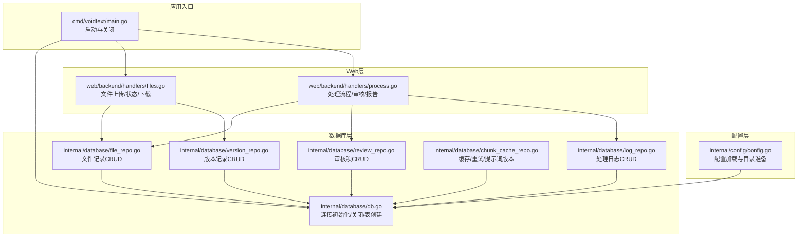
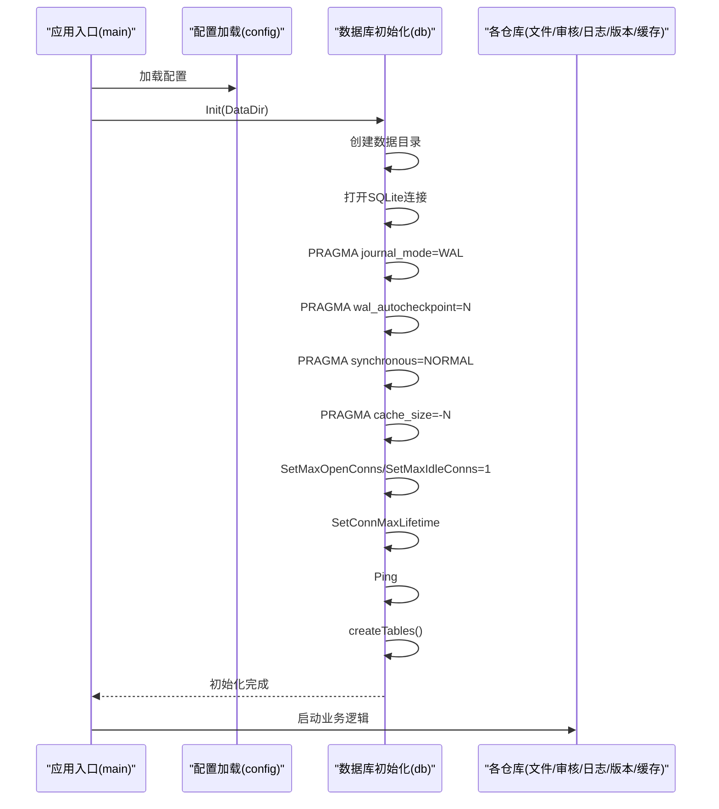
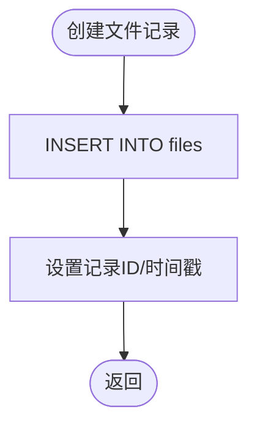
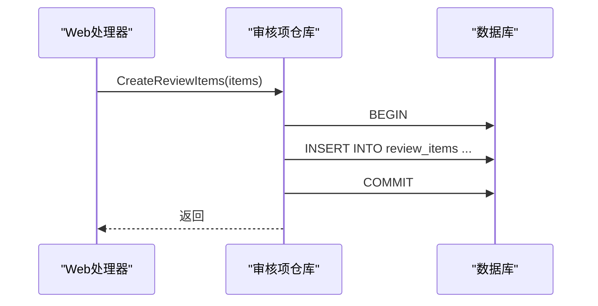
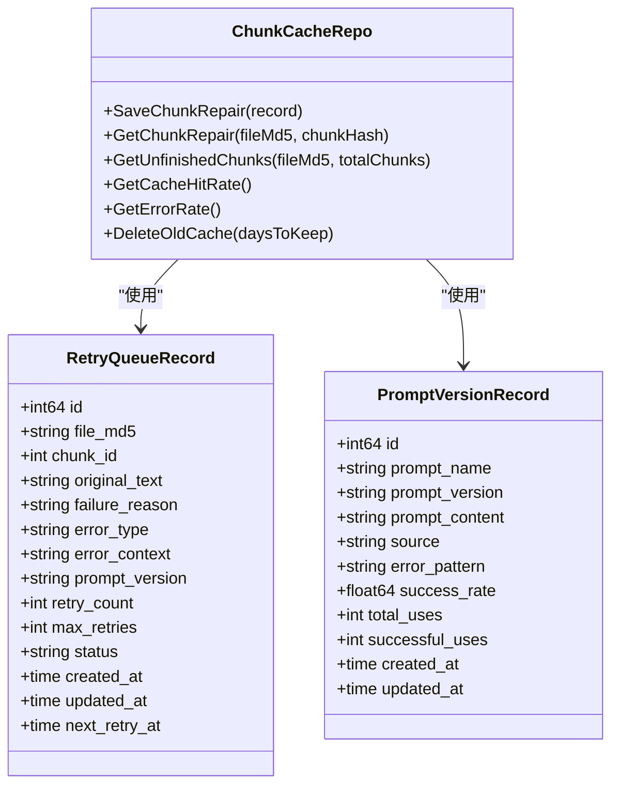
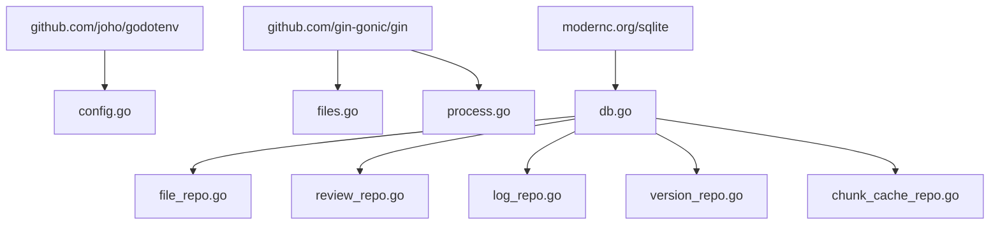

# 数据库架构概览

<cite>
**本文档引用的文件**
- [db.go](file://internal/database/db.go)
- [chunk_cache_repo.go](file://internal/database/chunk_cache_repo.go)
- [file_repo.go](file://internal/database/file_repo.go)
- [log_repo.go](file://internal/database/log_repo.go)
- [review_repo.go](file://internal/database/review_repo.go)
- [version_repo.go](file://internal/database/version_repo.go)
- [config.go](file://internal/config/config.go)
- [main.go](file://cmd/voidtext/main.go)
- [files.go](file://web/backend/handlers/files.go)
- [process.go](file://web/backend/handlers/process.go)
- [03-数据库设计.md](file://doc/03-数据库设计.md)
</cite>

## 目录
1. [简介](#简介)
2. [项目结构](#项目结构)
3. [核心组件](#核心组件)
4. [架构总览](#架构总览)
5. [详细组件分析](#详细组件分析)
6. [依赖关系分析](#依赖关系分析)
7. [性能考量](#性能考量)
8. [故障排查指南](#故障排查指南)
9. [结论](#结论)
10. [附录](#附录)

## 简介
本文件面向VoidText系统的数据库架构，聚焦SQLite数据库的整体设计与实现细节。文档围绕以下目标展开：
- 解释SQLite数据库的设计思路与架构决策
- 详述WAL模式的启用与配置策略，包括并发优化、性能提升与数据安全性
- 文档化数据库连接池配置、连接生命周期管理与资源优化
- 说明SQLite的特殊配置选项（缓存大小、同步模式、检查点机制）
- 描述数据库初始化流程、表创建过程与索引策略
- 解释数据目录结构、文件存储位置与备份策略
- 提供性能基准测试结果与优化建议

## 项目结构
数据库相关代码集中在internal/database目录，采用按功能模块划分的仓库模式（Repository Pattern），每个表对应一个仓库，统一通过db.go提供的全局连接进行访问。应用入口在cmd/voidtext/main.go中初始化数据库与Web服务。

图表来源
- [main.go:18-61](file://cmd/voidtext/main.go#L18-L61)
- [db.go:15-87](file://internal/database/db.go#L15-L87)
- [file_repo.go:28-169](file://internal/database/file_repo.go#L28-L169)
- [review_repo.go:25-202](file://internal/database/review_repo.go#L25-L202)
- [log_repo.go:19-76](file://internal/database/log_repo.go#L19-L76)
- [version_repo.go:20-115](file://internal/database/version_repo.go#L20-L115)
- [chunk_cache_repo.go:67-479](file://internal/database/chunk_cache_repo.go#L67-L479)
- [files.go:18-393](file://web/backend/handlers/files.go#L18-L393)
- [process.go:15-511](file://web/backend/handlers/process.go#L15-L511)

章节来源
- [main.go:18-61](file://cmd/voidtext/main.go#L18-L61)
- [db.go:15-87](file://internal/database/db.go#L15-L87)

## 核心组件
- 数据库连接与初始化：负责创建数据目录、打开SQLite数据库、启用WAL、设置同步模式、缓存大小、连接池参数，并在启动时创建所有表结构。
- 文件仓库：提供文件记录的创建、查询、状态更新、列表查询与删除。
- 审核项仓库：提供审核项的批量创建、查询、状态更新、批量更新与进度统计。
- 处理日志仓库：提供处理日志的创建与查询。
- 版本仓库：提供版本记录的创建、查询、版本链追踪与最新版本查询。
- 块缓存与重试仓库：提供块修复缓存、重试队列、提示词版本的持久化与统计查询，支撑断点续传与Evolver自进化。

章节来源
- [db.go:15-87](file://internal/database/db.go#L15-L87)
- [file_repo.go:28-169](file://internal/database/file_repo.go#L28-L169)
- [review_repo.go:25-202](file://internal/database/review_repo.go#L25-L202)
- [log_repo.go:19-76](file://internal/database/log_repo.go#L19-L76)
- [version_repo.go:20-115](file://internal/database/version_repo.go#L20-L115)
- [chunk_cache_repo.go:67-479](file://internal/database/chunk_cache_repo.go#L67-L479)

## 架构总览
系统采用“单连接+WAL”的轻量级数据库架构：
- 单连接模型：通过设置最大打开连接数与空闲连接数为1，确保写操作的串行化，避免SQLite在并发写入时的限制问题。
- WAL模式：启用WAL以支持多读单写的并发，显著提升读性能与吞吐；配合自动检查点策略控制WAL文件膨胀。
- 同步模式：在WAL模式下采用NORMAL级别同步，平衡数据安全性与性能。
- 缓存策略：设置较大的缓存页数，提升I/O效率与查询性能。
- 连接生命周期：设置连接最大存活时间，防止长时间占用导致资源泄漏。

图表来源
- [main.go:18-26](file://cmd/voidtext/main.go#L18-L26)
- [db.go:15-87](file://internal/database/db.go#L15-L87)

## 详细组件分析

### 数据库初始化与连接管理
- 数据目录与文件：在指定数据目录下创建数据库文件，确保目录存在。
- 连接参数：
  - 最大打开连接数与空闲连接数设为1，保证写操作串行化。
  - 连接最大存活时间为5分钟，避免长时间占用。
- WAL与同步：
  - 启用WAL模式，支持多读单写并发。
  - 设置自动检查点阈值，控制WAL文件大小。
  - 设置同步模式为NORMAL，兼顾性能与安全性。
- 缓存与性能：
  - 设置缓存大小（页数），提升查询与写入性能。
- 表创建：
  - 使用事务批量执行建表语句，确保原子性与一致性。
  - 为高频查询字段建立索引，优化查询性能。
- 关闭流程：
  - 关闭前执行TRUNCATE检查点，确保WAL日志写回主数据库。

章节来源
- [db.go:15-87](file://internal/database/db.go#L15-L87)
- [db.go:89-222](file://internal/database/db.go#L89-L222)

### 文件仓库（files）
- 功能：创建文件记录、按MD5/ID查询、更新状态与规则、列出待处理/全部文件、删除文件。
- 并发与事务：查询为只读，更新使用单连接保证一致性。
- 索引：对md5、original_md5、status建立索引，加速查询与过滤。

图表来源
- [file_repo.go:28-47](file://internal/database/file_repo.go#L28-L47)

章节来源
- [file_repo.go:28-169](file://internal/database/file_repo.go#L28-L169)

### 审核项仓库（review_items）
- 功能：批量创建审核项、按文件MD5查询、按ID查询、更新状态（含恢复逻辑）、批量更新、统计进度。
- 并发与事务：批量插入与状态更新均使用事务，保证原子性。
- 索引：对(file_md5,status)建立复合索引，支持按状态过滤。

图表来源
- [review_repo.go:25-59](file://internal/database/review_repo.go#L25-L59)

章节来源
- [review_repo.go:25-202](file://internal/database/review_repo.go#L25-L202)

### 处理日志仓库（processing_logs）
- 功能：创建处理日志、按文件MD5查询、查询最新日志。
- 设计：日志表用于追踪处理步骤与状态，便于审计与排障。

章节来源
- [log_repo.go:19-76](file://internal/database/log_repo.go#L19-L76)

### 版本仓库（versions）
- 功能：创建版本记录、按版本MD5查询、按原始MD5查询版本链、查询最新版本、版本链追溯。
- 设计：版本表支持原始版本、中间版本与最终版本，形成版本链路。

章节来源
- [version_repo.go:20-115](file://internal/database/version_repo.go#L20-L115)

### 块缓存与重试仓库（chunk_repair_cache/retry_queue/prompt_versions）
- 块缓存表：存储LLM修复结果，支持断点续传与幂等性，基于(file_md5, chunk_hash)唯一约束。
- 重试队列表：存储修复失败的块，支持指数退避重试与状态管理。
- 提示词版本表：记录不同提示词版本的效果统计，支撑Evolver自进化。
- 统计查询：提供缓存命中率、错误率等指标，辅助性能评估与优化。

图表来源
- [chunk_cache_repo.go:57-479](file://internal/database/chunk_cache_repo.go#L57-L479)

章节来源
- [chunk_cache_repo.go:57-479](file://internal/database/chunk_cache_repo.go#L57-L479)

### Web层与数据库交互
- 文件上传：根据MD5判断是否重复，若存在则返回状态；否则创建文件记录并记录版本。
- 处理流程：异步执行清洗、索引、LLM修复与审核步骤，期间更新文件状态与处理日志。
- 审核与报告：提供审核项查询、状态更新、批量操作与处理报告生成。

章节来源
- [files.go:18-393](file://web/backend/handlers/files.go#L18-L393)
- [process.go:15-511](file://web/backend/handlers/process.go#L15-L511)

## 依赖关系分析
- 组件耦合：
  - 各仓库依赖全局数据库连接（db.go），形成清晰的依赖方向。
  - Web层通过仓库间接依赖数据库，降低直接耦合。
- 外部依赖：
  - SQLite驱动：modernc.org/sqlite
  - Web框架：gin-gonic/gin
  - 配置加载：joho/godotenv
- 潜在风险：
  - 单连接模型在高并发写入场景可能成为瓶颈；可通过拆分业务或引入队列缓解。
  - WAL模式下的检查点频率需结合业务写入强度调整。

图表来源
- [config.go:3-12](file://internal/config/config.go#L3-L12)
- [files.go:3-16](file://web/backend/handlers/files.go#L3-L16)
- [process.go:3-13](file://web/backend/handlers/process.go#L3-L13)
- [db.go:3-11](file://internal/database/db.go#L3-L11)

章节来源
- [config.go:3-12](file://internal/config/config.go#L3-L12)
- [db.go:3-11](file://internal/database/db.go#L3-L11)

## 性能考量
- WAL模式优势：
  - 多读单写并发，显著提升读吞吐与响应速度。
  - 自动检查点控制WAL文件大小，避免无限增长。
- 同步模式选择：
  - NORMAL在WAL模式下提供较好的数据安全性与性能平衡。
- 缓存策略：
  - 较大的缓存页数可减少磁盘I/O，提升查询与写入性能。
- 连接池与生命周期：
  - 单连接+短生命周期连接，避免长时间占用与资源泄漏。
- 索引策略：
  - 针对高频查询字段建立索引，减少全表扫描。
- 统计与监控：
  - 提供缓存命中率与错误率查询，便于持续优化。

章节来源
- [db.go:29-59](file://internal/database/db.go#L29-L59)
- [chunk_cache_repo.go:422-478](file://internal/database/chunk_cache_repo.go#L422-L478)

## 故障排查指南
- 初始化失败：
  - 检查数据目录权限与路径是否存在。
  - 确认SQLite驱动可用且数据库文件可创建。
- 连接问题：
  - 使用Ping验证连接；检查连接池参数与生命周期设置。
- 写入阻塞：
  - 确认未在其他地方持有数据库连接；检查是否有长事务未提交。
- WAL相关：
  - 若WAL文件过大，检查wal_autocheckpoint阈值是否合理；必要时手动执行检查点。
- 业务异常：
  - 查看处理日志表，定位具体步骤与错误信息；结合审核项状态与进度进行排障。

章节来源
- [db.go:19-68](file://internal/database/db.go#L19-L68)
- [log_repo.go:19-76](file://internal/database/log_repo.go#L19-L76)

## 结论
VoidText系统采用SQLite作为核心数据库，通过WAL模式与合理的连接池配置，在单连接模型下实现了读写分离与高并发读取能力。配合完善的索引策略、事务化的仓库操作与统计查询，系统在保证数据一致性的同时，具备良好的性能与可维护性。建议在后续演进中结合业务负载评估，适时引入队列与拆分策略以进一步提升写入吞吐与扩展性。

## 附录

### 数据库设计要点与索引策略
- files：md5（唯一）、original_md5、status
- versions：version_md5（唯一）、original_md5
- review_items：file_md5、status；复合索引(file_md5,status)
- processing_logs：file_md5
- chunk_repair_cache：file_md5、chunk_hash（唯一）、chunk_hash
- retry_queue：status、next_retry_at（条件索引）
- prompt_versions：prompt_name+prompt_version（唯一）

章节来源
- [03-数据库设计.md:9-219](file://doc/03-数据库设计.md#L9-L219)

### 数据目录结构与备份策略
- 数据目录：由配置加载阶段确保存在，并在其中创建数据库文件与子目录。
- 子目录：uploads、backups、temp，分别用于存放上传文件、备份与临时文件。
- 备份策略：配置中包含备份保留天数参数，可在业务侧实现定期清理与归档。

章节来源
- [config.go:114-122](file://internal/config/config.go#L114-L122)
- [config.go:76-76](file://internal/config/config.go#L76-L76)