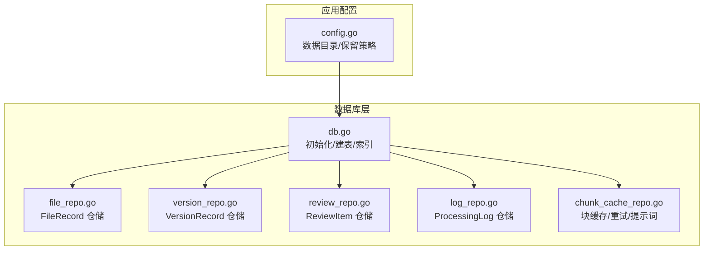
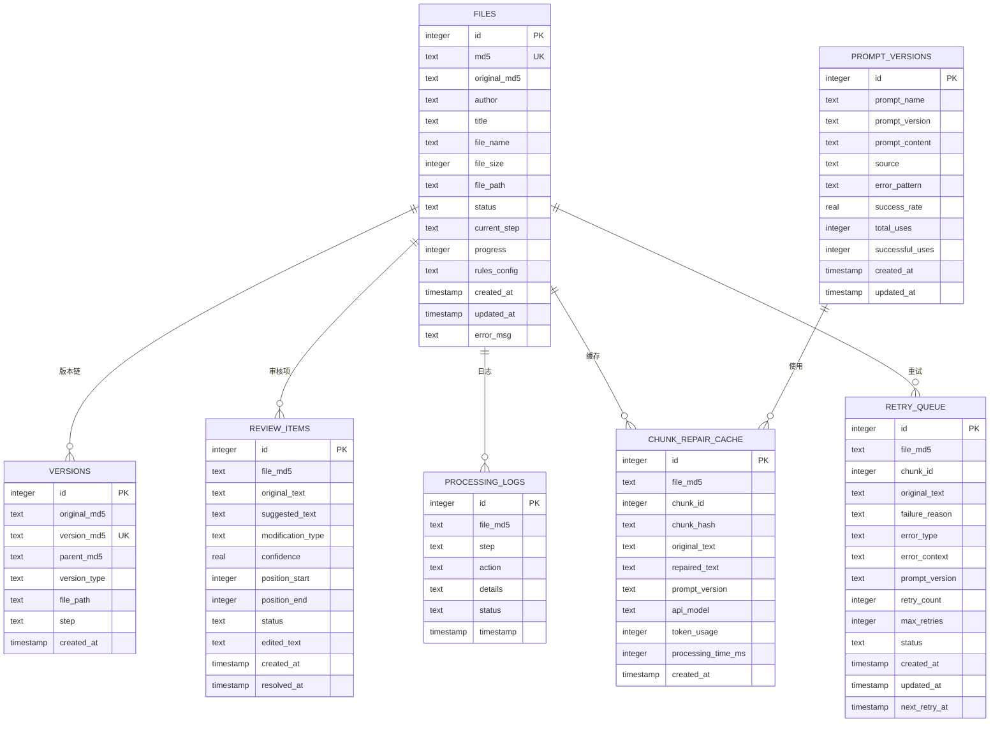
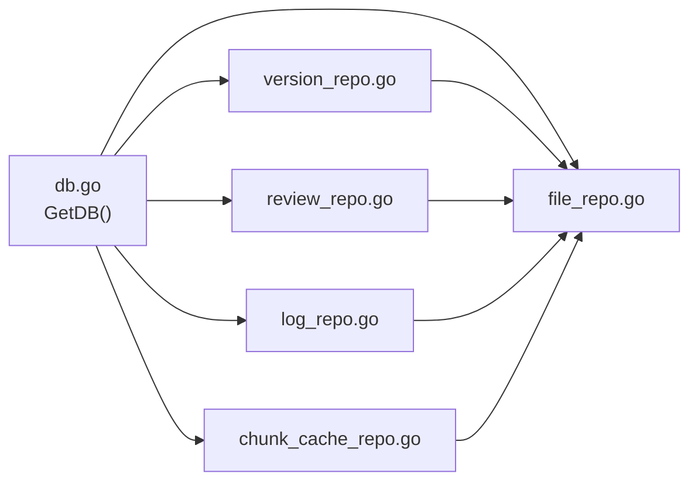

# 数据库设计

<cite>
**本文引用的文件**
- [db.go](file://internal/database/db.go)
- [file_repo.go](file://internal/database/file_repo.go)
- [version_repo.go](file://internal/database/version_repo.go)
- [review_repo.go](file://internal/database/review_repo.go)
- [log_repo.go](file://internal/database/log_repo.go)
- [chunk_cache_repo.go](file://internal/database/chunk_cache_repo.go)
- [03-数据库设计.md](file://doc/03-数据库设计.md)
- [config.go](file://internal/config/config.go)
- [db_test.go](file://internal/database/db_test.go)
</cite>

## 目录
1. [简介](#简介)
2. [项目结构](#项目结构)
3. [核心组件](#核心组件)
4. [架构总览](#架构总览)
5. [详细组件分析](#详细组件分析)
6. [依赖分析](#依赖分析)
7. [性能考量](#性能考量)
8. [故障排查指南](#故障排查指南)
9. [结论](#结论)
10. [附录](#附录)

## 简介
本文件面向 txtCleaning 系统的数据库层，提供全面的数据模型与架构设计文档。系统采用 SQLite 作为本地持久化存储，围绕文件处理生命周期构建了核心数据模型：FileRecord、VersionRecord、ReviewItem、ProcessingLog，并扩展了块级修复缓存、重试队列与提示词版本管理，以支撑断点续传、幂等性、自进化能力与可观测性。本文将详细说明表结构、字段定义、约束与索引策略，给出实体关系图与状态机，梳理数据访问模式、缓存与性能优化、数据生命周期与保留策略，并讨论数据迁移与版本管理、安全与隐私问题。

## 项目结构
数据库相关代码集中在 internal/database 目录，按“表-仓库”模式组织：
- db.go：数据库初始化、连接参数、表结构创建与索引
- 各仓库文件：对应表的 CRUD 与业务查询封装
- doc/03-数据库设计.md：官方文档，包含表结构与 ER 图
- config.go：应用配置，含数据目录、备份保留天数等
- db_test.go：数据库初始化与基础功能的单元测试

图表来源
- [db.go:15-69](file://internal/database/db.go#L15-L69)
- [file_repo.go:28-47](file://internal/database/file_repo.go#L28-L47)
- [version_repo.go:20-33](file://internal/database/version_repo.go#L20-L33)
- [review_repo.go:25-59](file://internal/database/review_repo.go#L25-L59)
- [log_repo.go:19-33](file://internal/database/log_repo.go#L19-L33)
- [chunk_cache_repo.go:67-100](file://internal/database/chunk_cache_repo.go#L67-L100)
- [config.go:14-44](file://internal/config/config.go#L14-L44)

章节来源
- [db.go:15-69](file://internal/database/db.go#L15-L69)
- [03-数据库设计.md:1-219](file://doc/03-数据库设计.md#L1-L219)

## 核心组件
- 数据库初始化与表结构
  - 初始化时创建 cleaning.db 文件，启用 WAL 模式、设置同步级别、缓存大小、连接池参数，并批量创建表与索引
  - 关闭时执行 WAL 检查点，确保日志落盘
- FileRecord 仓储
  - 提供文件记录的创建、查询、状态更新、规则更新、列表查询与删除
- VersionRecord 仓储
  - 维护版本链，支持按版本 MD5 查询、按原始 MD5 查询版本链、查询最新版本
- ReviewItem 仓储
  - 批量创建审核项、按文件 MD5 查询、按 ID 查询、状态更新、批量更新、进度统计、删除
- ProcessingLog 仓储
  - 创建处理日志、按文件 MD5 查询、查询最新日志
- 块缓存/重试/提示词 仓储
  - 保存块修复结果、查询缓存命中、计算未完成块、添加重试任务、获取待处理重试、更新重试状态、保存提示词版本、获取最新提示词版本、更新提示词使用统计、删除旧缓存、统计命中率与错误率

章节来源
- [db.go:89-222](file://internal/database/db.go#L89-L222)
- [file_repo.go:28-169](file://internal/database/file_repo.go#L28-L169)
- [version_repo.go:20-115](file://internal/database/version_repo.go#L20-L115)
- [review_repo.go:25-202](file://internal/database/review_repo.go#L25-L202)
- [log_repo.go:19-76](file://internal/database/log_repo.go#L19-L76)
- [chunk_cache_repo.go:67-479](file://internal/database/chunk_cache_repo.go#L67-L479)

## 架构总览
系统采用 SQLite 单机文件数据库，通过 WAL 模式提升并发读写性能；仓库层对 SQL 进行封装，提供强类型结构体与事务保障，确保关键路径的原子性与一致性。核心数据模型围绕文件生命周期展开，版本链记录文件演进，审核项承载人工干预，处理日志提供可观测性，块缓存与重试队列支撑 LLM 修复的断点续传与自进化。

图表来源
- [db.go:89-202](file://internal/database/db.go#L89-L202)
- [03-数据库设计.md:164-219](file://doc/03-数据库设计.md#L164-L219)

## 详细组件分析

### FileRecord（文件主表）
- 字段与约束
  - 主键：id（自增）
  - 唯一：md5
  - 外键：无（独立表）
  - 索引：md5（唯一）、original_md5、status
- 典型用途
  - 存储文件元信息、处理状态、进度、规则配置、错误信息
  - 支持按状态筛选待处理任务
- 关键方法
  - 创建、按 MD5/ID 查询、更新状态/规则、列出全部/待处理、删除
- 示例数据
  - 包含作者、标题、文件名、大小、路径、状态、当前步骤、进度、规则配置、时间戳、错误信息

章节来源
- [db.go:89-107](file://internal/database/db.go#L89-L107)
- [file_repo.go:9-26](file://internal/database/file_repo.go#L9-L26)
- [file_repo.go:28-169](file://internal/database/file_repo.go#L28-L169)
- [03-数据库设计.md:11-36](file://doc/03-数据库设计.md#L11-L36)

### VersionRecord（版本链）
- 字段与约束
  - 主键：id（自增）
  - 唯一：version_md5
  - 外键：parent_md5 引用自身 version_md5（自引用）
  - 索引：version_md5（唯一）、original_md5
- 典型用途
  - 维护文件版本历史，支持追溯原始 MD5、查询版本链、获取最新版本
- 关键方法
  - 创建版本、按版本 MD5 查询、按原始 MD5 查询版本链、获取最新版本、追溯原始 MD5

章节来源
- [db.go:108-117](file://internal/database/db.go#L108-L117)
- [version_repo.go:8-18](file://internal/database/version_repo.go#L8-L18)
- [version_repo.go:20-115](file://internal/database/version_repo.go#L20-L115)
- [03-数据库设计.md:37-54](file://doc/03-数据库设计.md#L37-L54)

### ReviewItem（人工审核项）
- 字段与约束
  - 主键：id（自增）
  - 外键：file_md5 引用 files.md5
  - 索引：file_md5、(file_md5, status)
- 典型用途
  - 存储 AI 建议与置信度、原文片段位置、审核状态、编辑文本、处理时间
- 关键方法
  - 批量创建、按文件 MD5 查询（支持状态过滤）、按 ID 查询、更新状态（含编辑文本与处理时间）、批量更新、统计进度、删除

章节来源
- [db.go:118-131](file://internal/database/db.go#L118-L131)
- [review_repo.go:9-23](file://internal/database/review_repo.go#L9-L23)
- [review_repo.go:25-202](file://internal/database/review_repo.go#L25-L202)
- [03-数据库设计.md:55-79](file://doc/03-数据库设计.md#L55-L79)

### ProcessingLog（处理日志）
- 字段与约束
  - 主键：id（自增）
  - 外键：file_md5 引用 files.md5
  - 索引：file_md5
- 典型用途
  - 记录处理步骤、动作、详情（JSON）、状态、时间戳，便于审计与排障
- 关键方法
  - 创建日志、按文件 MD5 查询、查询最新日志

章节来源
- [db.go:132-140](file://internal/database/db.go#L132-L140)
- [log_repo.go:8-17](file://internal/database/log_repo.go#L8-L17)
- [log_repo.go:19-76](file://internal/database/log_repo.go#L19-L76)
- [03-数据库设计.md:80-93](file://doc/03-数据库设计.md#L80-L93)

### 块缓存/重试/提示词（扩展表）
- 块修复缓存（chunk_repair_cache）
  - 主键：id（自增）
  - 唯一：(file_md5, chunk_hash)
  - 索引：file_md5、chunk_hash
  - 用途：断点续传、幂等性、减少重复 LLM 调用
- 重试队列（retry_queue）
  - 主键：id（自增）
  - 索引：status、next_retry_at（WHERE status='pending'）
  - 用途：失败块重试、指数退避、状态跟踪
- 提示词版本（prompt_versions）
  - 主键：id（自增）
  - 唯一：(prompt_name, prompt_version)
  - 索引：prompt_name, prompt_version
  - 用途：Evolver 自进化，记录版本效果与使用统计

章节来源
- [db.go:141-187](file://internal/database/db.go#L141-L187)
- [chunk_cache_repo.go:9-55](file://internal/database/chunk_cache_repo.go#L9-L55)
- [chunk_cache_repo.go:67-479](file://internal/database/chunk_cache_repo.go#L67-L479)
- [03-数据库设计.md:94-163](file://doc/03-数据库设计.md#L94-L163)

### 数据访问模式与事务保障
- 事务使用场景
  - 批量插入审核项、批量更新重试状态、更新提示词使用统计、删除旧缓存
- 并发与锁
  - WAL 模式 + 单连接写入（SetMaxOpenConns=1），读多写少场景下保证一致性与性能
- 事务封装
  - 通过 Begin/Commit/Rollback 显式包裹关键写操作，避免部分成功

章节来源
- [review_repo.go:31-59](file://internal/database/review_repo.go#L31-L59)
- [chunk_cache_repo.go:254-272](file://internal/database/chunk_cache_repo.go#L254-L272)
- [chunk_cache_repo.go:349-388](file://internal/database/chunk_cache_repo.go#L349-L388)
- [chunk_cache_repo.go:394-420](file://internal/database/chunk_cache_repo.go#L394-L420)
- [db.go:29-58](file://internal/database/db.go#L29-L58)

### 缓存策略与性能优化
- 缓存命中与错误率统计
  - 命中率：最近24小时缓存命中次数 / 总查询次数
  - 错误率：最近24小时重试次数 / 总请求次数
- 清理策略
  - 删除超过保留期的缓存与已完成/失败的重试记录
- 索引策略
  - 针对高频查询字段建立索引，如 files.md5/status/original_md5、versions.version_md5/original_md5、review_items.file_md5、processing_logs.file_md5、chunk_repair_cache.file_md5/chunk_hash、retry_queue.status/next_retry_at、prompt_versions.name_version
- SQLite 参数
  - WAL 模式、自动检查点、同步级别、缓存大小、连接池参数

章节来源
- [chunk_cache_repo.go:425-479](file://internal/database/chunk_cache_repo.go#L425-L479)
- [chunk_cache_repo.go:394-420](file://internal/database/chunk_cache_repo.go#L394-L420)
- [db.go:188-202](file://internal/database/db.go#L188-L202)
- [db.go:29-58](file://internal/database/db.go#L29-L58)

### 数据生命周期、保留策略与归档
- 生命周期
  - 文件：pending → processing → reviewing → completed 或 failed
  - 审核项：pending → accepted/rejected/edited
- 保留策略
  - 块缓存与重试记录保留天数由配置决定（默认保留周期见配置项）
  - 清理逻辑按 created_at/updated_at 截止时间删除过期记录
- 归档
  - 通过定期清理与保留策略实现“冷热分离”，避免数据库无限增长

章节来源
- [03-数据库设计.md:191-212](file://doc/03-数据库设计.md#L191-L212)
- [config.go:14-44](file://internal/config/config.go#L14-L44)
- [chunk_cache_repo.go:394-420](file://internal/database/chunk_cache_repo.go#L394-L420)

### 数据迁移路径与版本管理
- 迁移路径
  - 新增表与索引通过 createTables 批量执行，使用事务保证原子性
  - 建表语句集中管理，便于后续扩展与回滚
- 版本管理
  - 版本链通过 original_md5/version_md5/parent_md5 维护
  - 提示词版本通过 prompt_versions 记录与选择
  - Evolver 监控器根据命中率与错误率触发提示词版本切换

章节来源
- [db.go:89-222](file://internal/database/db.go#L89-L222)
- [version_repo.go:55-98](file://internal/database/version_repo.go#L55-L98)
- [chunk_cache_repo.go:277-344](file://internal/database/chunk_cache_repo.go#L277-L344)

### 数据安全、隐私与访问控制
- 数据库文件保护
  - 数据目录默认位于 DATA_DIR，建议限制目录权限，避免未授权访问
- 敏感信息
  - 处理日志与重试上下文中可能包含敏感文本，建议在生产环境中对日志脱敏或限制日志级别
- 访问控制
  - 本地 SQLite 文件，建议通过操作系统层面的文件权限与进程隔离实现访问控制
- 合规建议
  - 对于涉及个人数据的场景，建议启用加密存储与最小化采集原则，并遵循相关法规

章节来源
- [config.go:73-76](file://internal/config/config.go#L73-L76)
- [log_repo.go:35-58](file://internal/database/log_repo.go#L35-L58)
- [chunk_cache_repo.go:179-202](file://internal/database/chunk_cache_repo.go#L179-L202)

## 依赖分析
- 组件耦合
  - 各仓库均依赖统一的 GetDB() 提供的 *sql.DB 实例
  - 版本链与审核项存在外键关联（通过字段约束实现）
- 外部依赖
  - SQLite 驱动（modernc.org/sqlite）
  - 环境变量加载（godotenv）

图表来源
- [db.go:71-74](file://internal/database/db.go#L71-L74)
- [file_repo.go:28-47](file://internal/database/file_repo.go#L28-L47)
- [version_repo.go:20-33](file://internal/database/version_repo.go#L20-L33)
- [review_repo.go:25-59](file://internal/database/review_repo.go#L25-L59)
- [log_repo.go:19-33](file://internal/database/log_repo.go#L19-L33)
- [chunk_cache_repo.go:63-65](file://internal/database/chunk_cache_repo.go#L63-L65)

章节来源
- [db.go:71-74](file://internal/database/db.go#L71-L74)
- [file_repo.go:28-47](file://internal/database/file_repo.go#L28-L47)
- [version_repo.go:20-33](file://internal/database/version_repo.go#L20-L33)
- [review_repo.go:25-59](file://internal/database/review_repo.go#L25-L59)
- [log_repo.go:19-33](file://internal/database/log_repo.go#L19-L33)
- [chunk_cache_repo.go:63-65](file://internal/database/chunk_cache_repo.go#L63-L65)

## 性能考量
- 并发与锁
  - WAL 模式 + 单连接写入，适合读多写少场景；写操作串行化，避免 SQLite 的并发限制
- 索引覆盖
  - 针对高频查询字段建立索引，降低全表扫描概率
- 批处理
  - 批量插入审核项、批量更新重试状态，减少往返开销
- 缓存与统计
  - 命中率与错误率统计用于监控 Evolver 自进化触发条件
- 连接管理
  - 设置连接最大存活时间，避免长时间占用资源

章节来源
- [db.go:29-58](file://internal/database/db.go#L29-L58)
- [db.go:188-202](file://internal/database/db.go#L188-L202)
- [review_repo.go:31-59](file://internal/database/review_repo.go#L31-L59)
- [chunk_cache_repo.go:254-272](file://internal/database/chunk_cache_repo.go#L254-L272)
- [chunk_cache_repo.go:425-479](file://internal/database/chunk_cache_repo.go#L425-L479)

## 故障排查指南
- 初始化失败
  - 检查数据目录创建权限、数据库文件路径、WAL 模式与同步参数设置
- 查询异常
  - 确认索引是否存在、SQL 语法是否正确、参数绑定是否匹配
- 写入冲突
  - 检查事务是否正确提交/回滚、是否在单连接上串行写入
- 性能问题
  - 检查索引使用情况、查询计划、缓存命中率与错误率统计
- 测试验证
  - 使用单元测试覆盖初始化、CRUD、事务与清理逻辑

章节来源
- [db.go:15-69](file://internal/database/db.go#L15-L69)
- [db_test.go:24-72](file://internal/database/db_test.go#L24-L72)
- [db_test.go:114-158](file://internal/database/db_test.go#L114-L158)
- [db_test.go:195-200](file://internal/database/db_test.go#L195-L200)

## 结论
本数据库设计围绕文件处理生命周期构建，结合 SQLite 的 WAL 模式与索引策略，在保证一致性的同时兼顾性能。通过块缓存、重试队列与提示词版本管理，系统具备断点续传、幂等性与自进化能力。配合明确的保留策略与清理机制，可有效控制数据规模与成本。建议在生产环境中强化文件权限与日志脱敏，并持续监控命中率与错误率以优化提示词与处理流程。

## 附录
- 状态机（文件与审核项）
  - 文件状态：pending → processing → reviewing → completed；失败可退回 pending
  - 审核项状态：pending → accepted/rejected/edited

章节来源
- [03-数据库设计.md:191-212](file://doc/03-数据库设计.md#L191-L212)