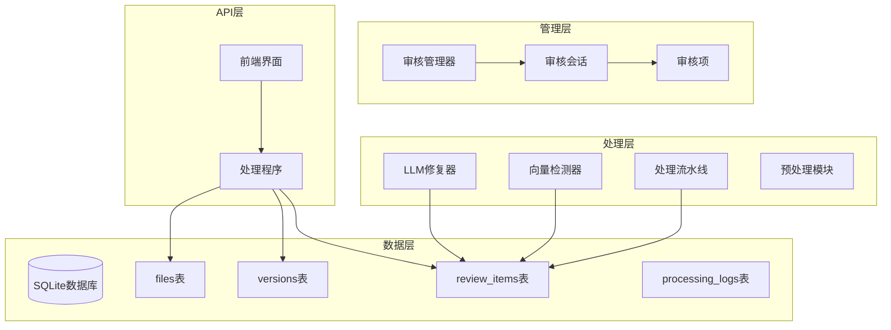
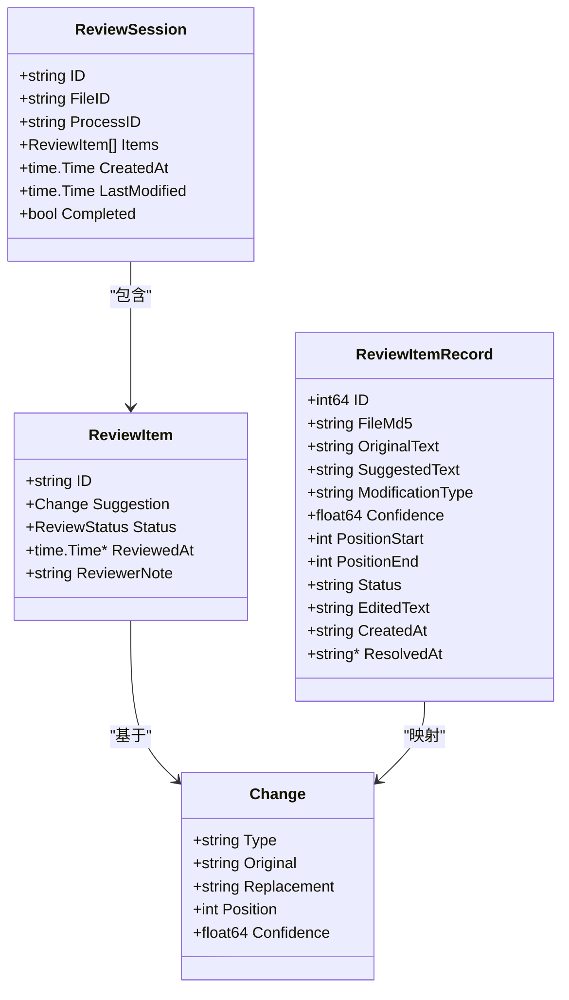
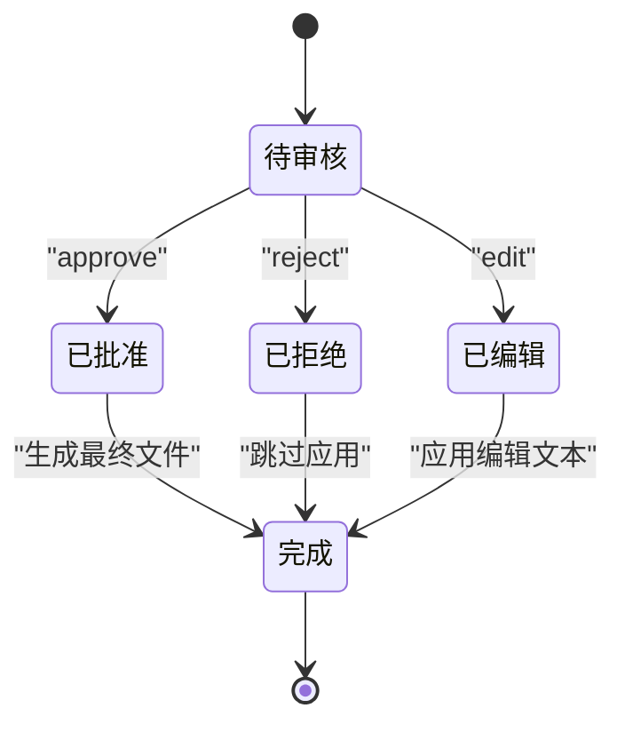
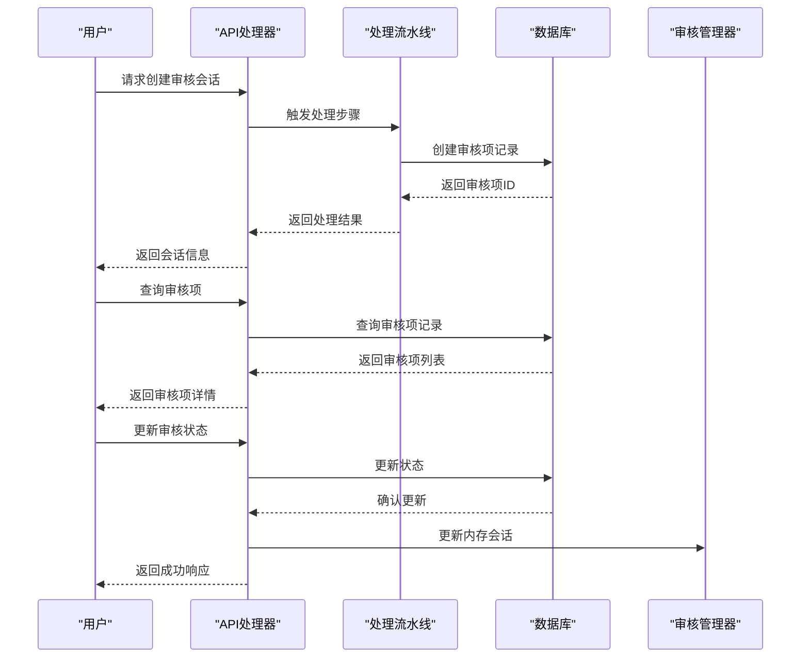
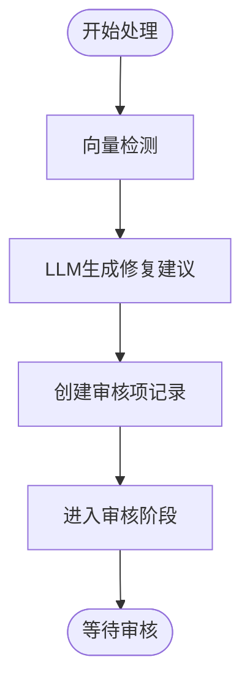
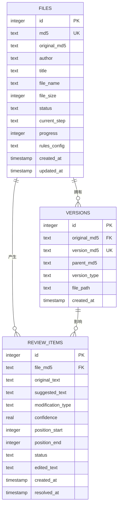
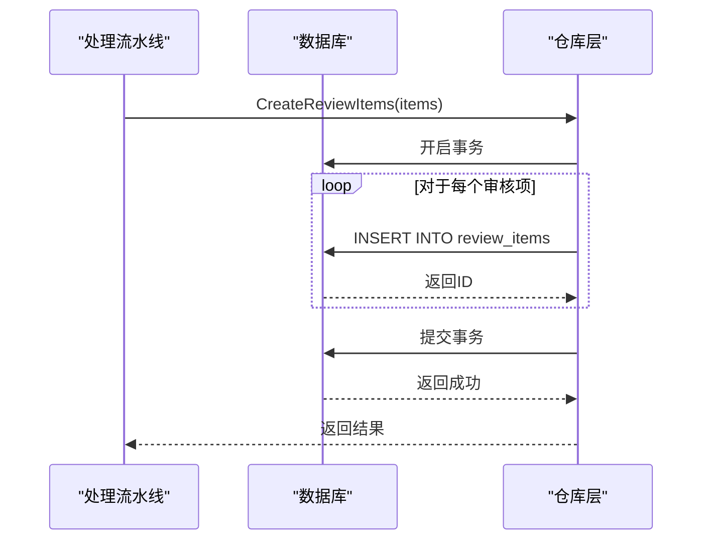
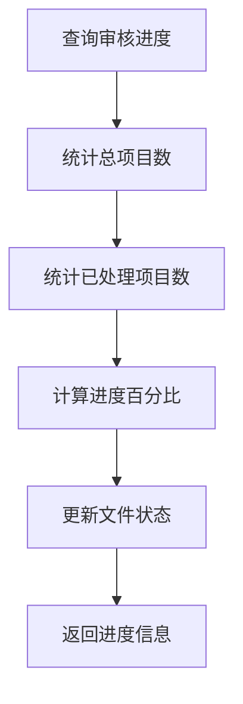
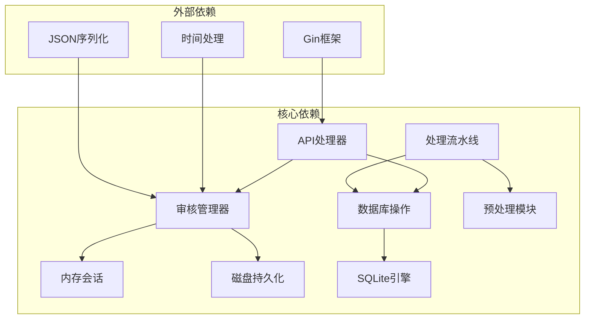

# 审核项模型

<cite>
**本文档引用的文件**
- [internal/review/manager/manager.go](file://internal/review/manager/manager.go)
- [internal/database/review_repo.go](file://internal/database/review_repo.go)
- [internal/processor/preprocess/preprocess.go](file://internal/processor/preprocess/preprocess.go)
- [internal/processor/pipeline.go](file://internal/processor/pipeline.go)
- [web/backend/handlers/process.go](file://web/backend/handlers/process.go)
- [doc/03-数据库设计.md](file://doc/03-数据库设计.md)
- [testing/smoking_testing/00-冒烟测试计划.md](file://testing/smoking_testing/00-冒烟测试计划.md)
</cite>

## 目录
1. [简介](#简介)
2. [项目结构](#项目结构)
3. [核心组件](#核心组件)
4. [架构概览](#架构概览)
5. [详细组件分析](#详细组件分析)
6. [依赖分析](#依赖分析)
7. [性能考虑](#性能考虑)
8. [故障排除指南](#故障排除指南)
9. [结论](#结论)
10. [附录](#附录)

## 简介
本文档详细说明txtCleaning系统的ReviewItem审核项模型，涵盖审核项的字段定义、业务含义、数据类型，以及人工审核流程的各个环节。文档还解释了审核项与文件记录和版本记录的关联关系，说明如何在审核过程中保持数据一致性，并文档化了审核操作的方法实现，包括审核项创建、状态更新、批量处理等功能。最后提供完整的审核流程示例和审核员操作指南。

## 项目结构
审核系统围绕三个核心层次构建：
- 数据层：负责持久化审核项记录，维护文件状态和版本历史
- 处理层：负责AI检测、LLM修复和审核步骤的协调
- 管理层：提供内存会话管理和本地持久化能力

**图表来源**
- [internal/database/review_repo.go:1-202](file://internal/database/review_repo.go#L1-L202)
- [internal/processor/pipeline.go:1-610](file://internal/processor/pipeline.go#L1-L610)
- [internal/review/manager/manager.go:1-234](file://internal/review/manager/manager.go#L1-L234)

**章节来源**
- [internal/database/review_repo.go:1-202](file://internal/database/review_repo.go#L1-L202)
- [internal/processor/pipeline.go:1-610](file://internal/processor/pipeline.go#L1-L610)
- [internal/review/manager/manager.go:1-234](file://internal/review/manager/manager.go#L1-L234)

## 核心组件
审核系统的核心组件包括审核项模型、审核管理器、数据库仓库和API处理器。

### 审核项数据模型
审核项模型分为两个层面：
- 内存模型：用于临时会话管理
- 数据库模型：用于持久化存储

**图表来源**
- [internal/review/manager/manager.go:24-42](file://internal/review/manager/manager.go#L24-L42)
- [internal/database/review_repo.go:9-23](file://internal/database/review_repo.go#L9-L23)
- [internal/processor/preprocess/preprocess.go:20-27](file://internal/processor/preprocess/preprocess.go#L20-L27)

### 审核状态管理
系统采用双状态机制：
- 内存状态：pending/approved/rejected/skipped
- 数据库状态：pending/accepted/rejected/edited

**图表来源**
- [internal/review/manager/manager.go:14-22](file://internal/review/manager/manager.go#L14-L22)
- [doc/03-数据库设计.md:203-211](file://doc/03-数据库设计.md#L203-L211)

**章节来源**
- [internal/review/manager/manager.go:14-42](file://internal/review/manager/manager.go#L14-L42)
- [internal/database/review_repo.go:9-23](file://internal/database/review_repo.go#L9-L23)
- [doc/03-数据库设计.md:203-211](file://doc/03-数据库设计.md#L203-L211)

## 架构概览
审核系统采用分层架构，确保职责分离和数据一致性。

**图表来源**
- [web/backend/handlers/process.go:123-167](file://web/backend/handlers/process.go#L123-L167)
- [internal/processor/pipeline.go:240-251](file://internal/processor/pipeline.go#L240-L251)
- [internal/database/review_repo.go:25-59](file://internal/database/review_repo.go#L25-L59)

## 详细组件分析

### 审核项字段定义与业务含义

#### 内存模型字段
- **ID**: 审核项标识符，用于唯一标识每个修改建议
- **Suggestion**: 预处理建议对象，包含具体的修改内容和位置信息
- **Status**: 审核状态，支持待审核、已批准、已拒绝、已编辑
- **ReviewedAt**: 审核时间戳，记录审核完成的具体时间
- **ReviewerNote**: 审核员备注，用于记录审核过程中的说明信息

#### 数据库模型字段
- **ID**: 主键，自增整数标识符
- **FileMd5**: 文件MD5，关联到文件记录
- **OriginalText**: 原文片段，被AI检测到的问题文本
- **SuggestedText**: 建议修改后的文本
- **ModificationType**: 修改类型，描述问题性质
- **Confidence**: 置信度，AI检测的可信度评分
- **PositionStart/PositionEnd**: 文本位置，记录问题在文档中的位置范围
- **Status**: 审核状态，支持pending/accepted/rejected/edited
- **EditedText**: 用户编辑后的文本
- **CreatedAt/ResolvedAt**: 时间戳，记录创建和处理完成时间

**章节来源**
- [internal/review/manager/manager.go:24-31](file://internal/review/manager/manager.go#L24-L31)
- [internal/database/review_repo.go:9-23](file://internal/database/review_repo.go#L9-L23)
- [internal/processor/preprocess/preprocess.go:20-27](file://internal/processor/preprocess/preprocess.go#L20-L27)

### 人工审核流程

#### 问题识别阶段
AI系统通过向量检测和LLM修复生成修改建议：
1. **向量检测**：识别重复内容和潜在问题
2. **LLM修复**：生成智能修复建议
3. **审核项创建**：将建议转换为审核项记录

**图表来源**
- [internal/processor/pipeline.go:215-271](file://internal/processor/pipeline.go#L215-L271)
- [internal/processor/pipeline.go:273-376](file://internal/processor/pipeline.go#L273-L376)

#### 审核分配阶段
- **自动分配**：审核项按文件MD5自动关联
- **批量处理**：支持批量审核和状态更新
- **进度跟踪**：实时显示审核进度

#### 处理建议阶段
- **批准**：采纳AI建议，直接应用到最终文件
- **拒绝**：忽略该修改建议
- **编辑**：审核员手动编辑建议文本
- **恢复**：将状态重置为待审核

#### 审核决策阶段
- **进度计算**：根据已处理项目计算整体进度
- **状态推进**：当所有项目审核完成后自动推进
- **最终生成**：生成最终清理后的文件

**章节来源**
- [internal/processor/pipeline.go:436-468](file://internal/processor/pipeline.go#L436-L468)
- [web/backend/handlers/process.go:169-300](file://web/backend/handlers/process.go#L169-L300)

### 审核项与文件记录的关联关系

#### 数据库关联
审核项通过FileMd5字段与文件记录建立关联关系，确保数据一致性：
- **外键约束**：review_items.file_md5 → files.md5
- **索引优化**：复合索引(file_md5, status)提升查询性能
- **级联操作**：文件删除时自动清理相关审核项

#### 版本记录关联
审核项与版本记录的关系：
- **原始版本**：original_md5指向原始文件
- **中间版本**：记录处理过程中的各个版本
- **最终版本**：生成清理后的最终文件版本

**图表来源**
- [doc/03-数据库设计.md:15-76](file://doc/03-数据库设计.md#L15-L76)

**章节来源**
- [doc/03-数据库设计.md:164-189](file://doc/03-数据库设计.md#L164-L189)
- [internal/database/review_repo.go:176-183](file://internal/database/review_repo.go#L176-L183)

### 审核操作方法实现

#### 审核项创建

**图表来源**
- [internal/database/review_repo.go:25-59](file://internal/database/review_repo.go#L25-L59)

#### 状态更新
支持单个和批量状态更新，确保事务一致性：
- **单个更新**：UpdateReviewItemStatus
- **批量更新**：BatchUpdateReviewItemStatus
- **进度同步**：updateReviewProgress

#### 进度查询

**图表来源**
- [internal/database/review_repo.go:163-174](file://internal/database/review_repo.go#L163-L174)
- [web/backend/handlers/process.go:379-387](file://web/backend/handlers/process.go#L379-L387)

**章节来源**
- [internal/database/review_repo.go:106-161](file://internal/database/review_repo.go#L106-L161)
- [web/backend/handlers/process.go:169-300](file://web/backend/handlers/process.go#L169-L300)

### 审核流程完整示例

#### 场景：批量通过所有待审核项目
1. **查询待审核项目**
   - API: GET /api/files/{md5}/review-items?status=pending
   - 返回: [{id: 1, status: "pending"}, {id: 2, status: "pending"}]

2. **批量批准**
   - API: POST /api/files/{md5}/batch-approve
   - 请求: {itemIds: [1, 2]}
   - 返回: {success: true, message: "成功批准 2 条建议"}

3. **进度更新**
   - 系统自动计算进度并更新文件状态
   - 最终生成清理后的文件

#### 审核员操作指南

##### 基本操作
- **批准项目**：点击"通过"按钮，采纳AI建议
- **拒绝项目**：点击"拒绝"按钮，忽略该修改
- **编辑项目**：点击"编辑"按钮，输入自定义修改文本
- **恢复项目**：将项目状态重置为待审核

##### 批量操作
- **全选批准**：选择所有待审核项目后批量批准
- **全选拒绝**：选择所有待审核项目后批量拒绝
- **快速筛选**：按状态筛选待审核项目进行批量处理

**章节来源**
- [testing/smoking_testing/00-冒烟测试计划.md:52-61](file://testing/smoking_testing/00-冒烟测试计划.md#L52-L61)
- [web/backend/handlers/process.go:258-300](file://web/backend/handlers/process.go#L258-L300)

## 依赖分析

### 组件耦合关系
审核系统各组件之间具有清晰的依赖关系：

**图表来源**
- [internal/review/manager/manager.go:1-12](file://internal/review/manager/manager.go#L1-L12)
- [web/backend/handlers/process.go:1-16](file://web/backend/handlers/process.go#L1-L16)

### 数据一致性保证
系统通过以下机制确保数据一致性：
- **事务处理**：批量操作使用数据库事务保证原子性
- **状态同步**：内存状态与数据库状态双向同步
- **索引优化**：关键字段建立索引提升查询性能
- **外键约束**：维护表间引用完整性

**章节来源**
- [internal/database/review_repo.go:128-161](file://internal/database/review_repo.go#L128-L161)
- [internal/review/manager/manager.go:197-233](file://internal/review/manager/manager.go#L197-L233)

## 性能考虑
- **批量操作**：使用事务批量处理大量审核项，减少数据库往返
- **索引优化**：为常用查询字段建立索引，提升查询性能
- **内存管理**：会话数据仅在内存中暂存，定期持久化到磁盘
- **异步处理**：长耗时操作采用异步方式，避免阻塞主线程

## 故障排除指南

### 常见问题及解决方案
- **审核项无法更新**：检查数据库连接和事务状态
- **进度显示异常**：验证审核项状态转换逻辑
- **文件关联丢失**：确认外键约束和索引完整性
- **内存泄漏**：定期清理已完成的会话数据

### 调试工具
- **日志记录**：详细的处理日志便于问题定位
- **状态监控**：实时监控文件和审核项状态变化
- **性能分析**：监控数据库查询和事务执行时间

**章节来源**
- [internal/database/review_repo.go:185-201](file://internal/database/review_repo.go#L185-L201)
- [internal/review/manager/manager.go:197-233](file://internal/review/manager/manager.go#L197-L233)

## 结论
txtCleaning系统的审核项模型设计合理，通过内存会话管理和数据库持久化相结合的方式，实现了高效的人工审核流程。系统提供了完整的审核操作接口，支持单个和批量处理，确保了数据一致性和处理效率。审核项与文件记录、版本记录的关联关系清晰明确，为后续的功能扩展和维护奠定了良好的基础。

## 附录

### API参考
- **GET /api/files/{md5}/review-items**：获取审核项列表
- **POST /api/files/{md5}/approve**：批准审核项
- **POST /api/files/{md5}/reject**：拒绝审核项
- **POST /api/files/{md5}/edit**：编辑审核项
- **POST /api/files/{md5}/restore**：恢复审核项
- **POST /api/files/{md5}/batch-approve**：批量批准
- **POST /api/files/{md5}/batch-reject**：批量拒绝

### 状态说明
- **pending**：待审核
- **approved**：已批准
- **rejected**：已拒绝
- **edited**：已编辑
- **completed**：已完成