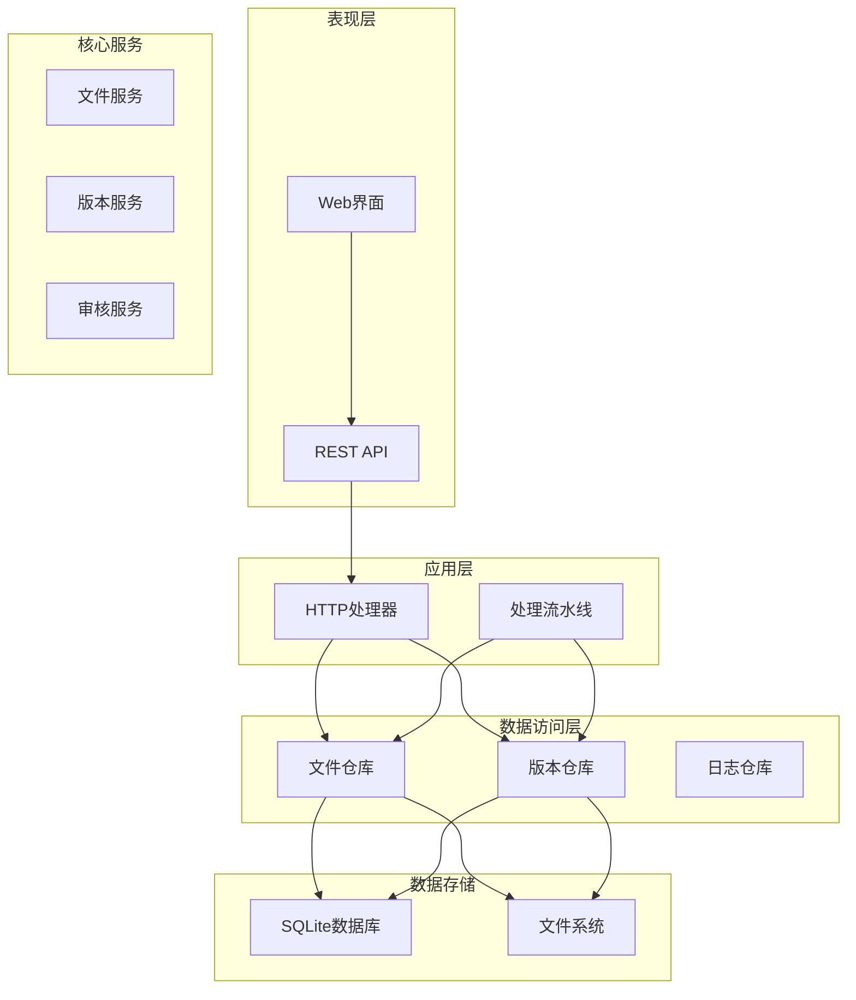
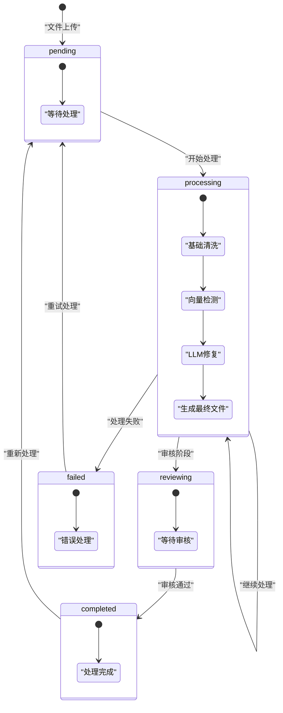
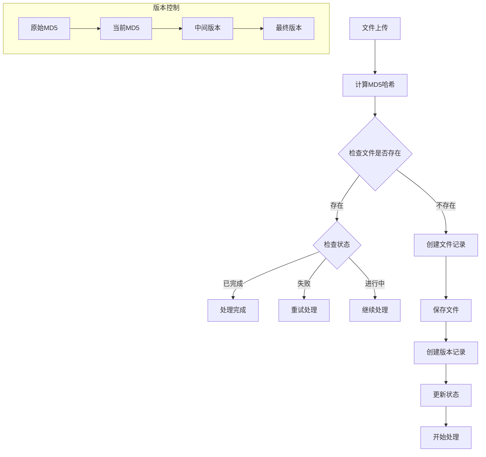
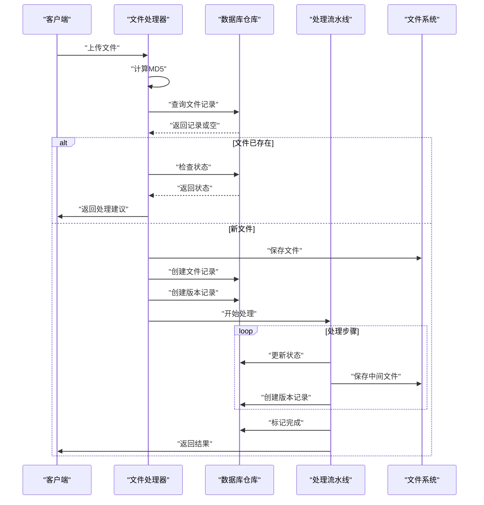
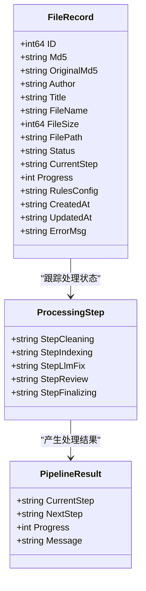
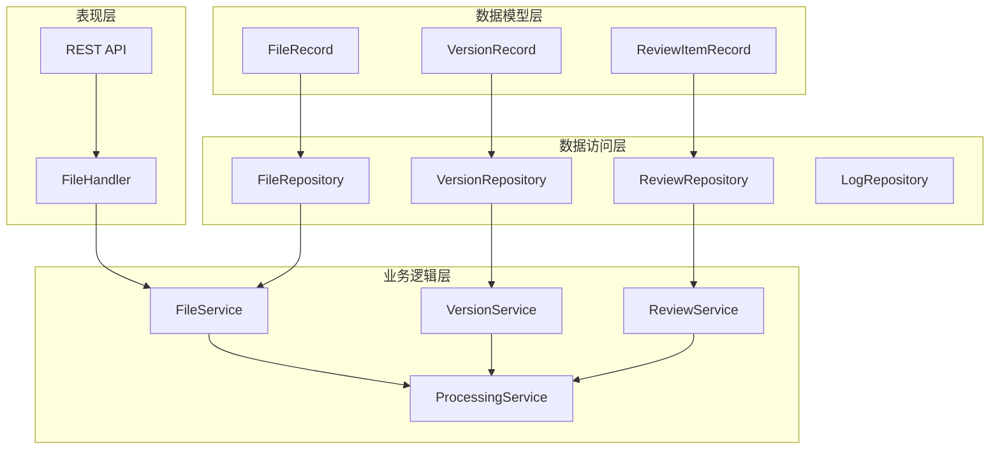

# 文件记录模型

<cite>
**本文档引用的文件**
- [file_repo.go](file://internal/database/file_repo.go)
- [db.go](file://internal/database/db.go)
- [03-数据库设计.md](file://doc/03-数据库设计.md)
- [files.go](file://web/backend/handlers/files.go)
- [pipeline.go](file://internal/processor/pipeline.go)
- [md5.go](file://internal/file/md5.go)
- [parser.go](file://internal/file/parser.go)
- [config.go](file://internal/config/config.go)
- [db_test.go](file://internal/database/db_test.go)
</cite>

## 目录
1. [简介](#简介)
2. [项目结构](#项目结构)
3. [核心组件](#核心组件)
4. [架构概览](#架构概览)
5. [详细组件分析](#详细组件分析)
6. [依赖分析](#依赖分析)
7. [性能考虑](#性能考虑)
8. [故障排除指南](#故障排除指南)
9. [结论](#结论)

## 简介

VoidText系统的FileRecord文件记录模型是整个文本清理流程的核心数据结构。本文档深入分析了FileRecord结构体的所有字段定义、业务含义和约束条件，详细解释了文件状态管理机制、版本控制机制，以及文件操作方法的实现细节和使用场景。

## 项目结构

系统采用分层架构设计，主要包含以下层次：

**图表来源**
- [file_repo.go:1-169](file://internal/database/file_repo.go#L1-L169)
- [db.go:89-132](file://internal/database/db.go#L89-L132)

**章节来源**
- [file_repo.go:1-169](file://internal/database/file_repo.go#L1-L169)
- [db.go:89-132](file://internal/database/db.go#L89-L132)

## 核心组件

### FileRecord结构体定义

FileRecord是系统中最核心的数据模型，用于存储文件的完整生命周期信息。

| 字段名 | 类型 | JSON标签 | 约束条件 | 业务含义 |
|--------|------|----------|----------|----------|
| ID | int64 | id | 主键，自增 | 文件记录的唯一标识符 |
| Md5 | string | md5 | 唯一约束，NOT NULL | 文件的MD5哈希值（当前版本） |
| OriginalMd5 | string | originalMd5 | 外键约束 | 原始上传文件的MD5值 |
| Author | string | author | 可选 | 从文件名解析出的作者信息 |
| Title | string | title | 可选 | 从文件名解析出的小说标题 |
| FileName | string | fileName | 可选 | 原始文件名 |
| FileSize | int64 | fileSize | 可选 | 文件大小（字节） |
| FilePath | string | filePath | 可选 | 文件在文件系统中的路径 |
| Status | string | status | NOT NULL，默认pending | 文件处理状态 |
| CurrentStep | string | currentStep | 可选 | 当前处理步骤 |
| Progress | int | progress | NOT NULL，默认0 | 处理进度百分比（0-100） |
| RulesConfig | string | rulesConfig | 可选 | JSON格式的规则配置 |
| CreatedAt | string | createdAt | 时间戳 | 文件记录创建时间 |
| UpdatedAt | string | updatedAt | 时间戳 | 文件记录最后更新时间 |
| ErrorMsg | string | errorMsg | 可选 | 处理失败时的错误信息 |

**章节来源**
- [file_repo.go:9-26](file://internal/database/file_repo.go#L9-L26)
- [03-数据库设计.md:15-30](file://doc/03-数据库设计.md#L15-L30)

### 文件状态管理机制

系统实现了完整的文件状态机，支持多种处理状态之间的转换：

**图表来源**
- [03-数据库设计.md:195-201](file://doc/03-数据库设计.md#L195-L201)

**章节来源**
- [03-数据库设计.md:191-201](file://doc/03-数据库设计.md#L191-L201)

### 文件版本控制机制

系统实现了基于MD5的版本控制系统，区分原始MD5和当前MD5：

**图表来源**
- [files.go:18-71](file://web/backend/handlers/files.go#L18-L71)
- [md5.go:11-31](file://internal/file/md5.go#L11-L31)

**章节来源**
- [files.go:113-155](file://web/backend/handlers/files.go#L113-L155)
- [md5.go:11-31](file://internal/file/md5.go#L11-L31)

## 架构概览

系统采用事件驱动的处理架构，文件处理流程如下：

**图表来源**
- [files.go:18-71](file://web/backend/handlers/files.go#L18-L71)
- [pipeline.go:104-158](file://internal/processor/pipeline.go#L104-L158)

## 详细组件分析

### 文件操作方法详解

#### CreateFile - 创建文件记录

创建文件记录是文件处理流程的第一步，负责初始化文件的基本信息和状态。

**实现要点：**
- 自动生成唯一ID和时间戳
- 设置默认状态为"pending"
- 初始化进度为0
- 保存原始MD5和当前MD5

**使用场景：**
- 新文件上传时创建记录
- 中间版本恢复时创建新记录

**章节来源**
- [file_repo.go:28-47](file://internal/database/file_repo.go#L28-L47)

#### GetFileByMd5 - 根据MD5查询文件

根据文件的MD5哈希值查询文件记录，这是最常用的查询方法。

**实现特点：**
- 支持不存在时返回nil而非错误
- 返回完整的文件记录信息
- 包含所有元数据和状态信息

**使用场景：**
- 文件状态查询
- 处理进度跟踪
- 文件信息展示

**章节来源**
- [file_repo.go:49-69](file://internal/database/file_repo.go#L49-L69)

#### GetFileByID - 根据ID查询文件

通过数据库自增ID查询文件记录，主要用于内部管理和调试。

**使用场景：**
- 系统内部管理操作
- 调试和诊断
- 批量操作

**章节来源**
- [file_repo.go:71-91](file://internal/database/file_repo.go#L71-L91)

#### UpdateFileStatus - 更新文件状态

更新文件的处理状态、当前步骤和进度信息。

**实现逻辑：**
- 更新状态字段（pending/processing/reviewing/completed/failed）
- 更新当前处理步骤
- 更新处理进度百分比
- 记录错误信息
- 更新最后修改时间

**使用场景：**
- 处理步骤完成后更新状态
- 处理失败时记录错误
- 进度监控和报告

**章节来源**
- [file_repo.go:93-103](file://internal/database/file_repo.go#L93-L103)

#### UpdateFileRules - 更新文件规则配置

动态更新文件的处理规则配置，支持运行时调整。

**实现特点：**
- 支持JSON格式的复杂规则配置
- 实时生效的规则更新
- 保持其他字段不变

**使用场景：**
- 用户自定义处理规则
- 动态调整处理策略
- A/B测试不同的处理方案

**章节来源**
- [file_repo.go:105-115](file://internal/database/file_repo.go#L105-L115)

#### ListPendingFiles - 列出待处理文件

获取所有未完成的文件记录，用于任务调度和监控。

**实现逻辑：**
- 查询状态不等于"completed"的文件
- 按创建时间降序排列
- 返回完整的文件列表

**使用场景：**
- 任务调度器
- 监控面板
- 批量处理

**章节来源**
- [file_repo.go:117-128](file://internal/database/file_repo.go#L117-L128)

#### ListAllFiles - 列出所有文件

获取所有文件记录，用于管理界面和统计分析。

**使用场景：**
- 管理员界面
- 统计报表
- 数据备份

**章节来源**
- [file_repo.go:130-141](file://internal/database/file_repo.go#L130-L141)

#### DeleteFile - 删除文件记录

删除文件记录及其关联的版本信息。

**实现逻辑：**
- 删除文件记录
- 清理相关的审核项
- 可选择保留文件物理文件

**使用场景：**
- 文件清理
- 存储空间管理
- 用户请求删除

**章节来源**
- [file_repo.go:143-150](file://internal/database/file_repo.go#L143-L150)

### 处理流水线集成

文件记录模型与处理流水线深度集成，每个处理步骤都会更新相应的状态信息。

**图表来源**
- [file_repo.go:9-26](file://internal/database/file_repo.go#L9-L26)
- [pipeline.go:19-35](file://internal/processor/pipeline.go#L19-L35)

**章节来源**
- [pipeline.go:104-158](file://internal/processor/pipeline.go#L104-L158)

## 依赖分析

系统各组件之间的依赖关系如下：

**图表来源**
- [file_repo.go:1-169](file://internal/database/file_repo.go#L1-L169)
- [files.go:1-393](file://web/backend/handlers/files.go#L1-L393)

**章节来源**
- [file_repo.go:1-169](file://internal/database/file_repo.go#L1-L169)
- [files.go:1-393](file://web/backend/handlers/files.go#L1-L393)

## 性能考虑

### 数据库优化

1. **索引策略**
   - `files(md5)` - 唯一索引，支持快速查找
   - `files(original_md5)` - 支持版本关联查询
   - `files(status)` - 支持状态过滤查询

2. **查询优化**
   - 使用预编译语句防止SQL注入
   - 批量操作减少数据库往返
   - 合理使用LIMIT避免全表扫描

3. **缓存策略**
   - 内存中的版本管理器缓存最近使用的版本
   - 文件内容MD5计算结果缓存

### 处理性能

1. **异步处理**
   - 文件上传后立即返回响应
   - 后台异步处理提高用户体验
   - 支持断点续传和重试机制

2. **并发控制**
   - 处理流水线支持多步骤并行
   - LLM修复支持Worker Pool并发
   - 缓存机制减少重复计算

## 故障排除指南

### 常见问题及解决方案

**问题1：文件状态异常**
- 症状：文件状态显示为"failed"但无法重试
- 解决方案：使用`ResumeFile`接口重置状态
- 预防措施：定期监控处理日志

**问题2：MD5计算失败**
- 症状：文件上传后无法找到对应记录
- 解决方案：检查文件权限和磁盘空间
- 预防措施：实现重试机制和错误报告

**问题3：版本冲突**
- 症状：中间版本与最终版本不一致
- 解决方案：使用版本管理器的比较功能
- 预防措施：严格的版本验证机制

**章节来源**
- [files.go:200-251](file://web/backend/handlers/files.go#L200-L251)

### 调试技巧

1. **日志分析**
   - 检查处理日志了解具体错误
   - 监控性能指标识别瓶颈
   - 分析用户行为模式

2. **状态监控**
   - 定期检查文件状态分布
   - 监控处理队列长度
   - 跟踪成功率和失败率

3. **性能调优**
   - 分析慢查询和阻塞操作
   - 优化数据库索引和查询
   - 调整并发参数和资源分配

## 结论

FileRecord文件记录模型作为VoidText系统的核心数据结构，实现了完整的文件生命周期管理。通过精心设计的字段定义、状态管理和版本控制机制，系统能够高效地处理大量文本文件，提供可靠的处理服务。

关键优势包括：
- **完整的状态跟踪**：从上传到完成的全流程状态管理
- **灵活的版本控制**：支持中间版本和最终版本的完整链路
- **强大的扩展性**：支持动态规则配置和自定义处理流程
- **高可靠性**：完善的错误处理和重试机制

未来可以考虑的改进方向：
- 增加更多的状态监控和告警机制
- 优化大规模文件处理的性能
- 扩展对其他文件格式的支持
- 增强用户界面的交互体验