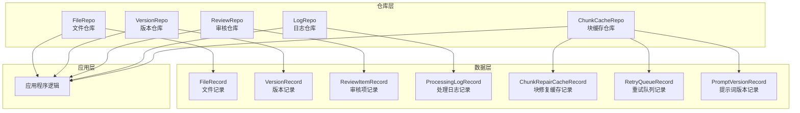
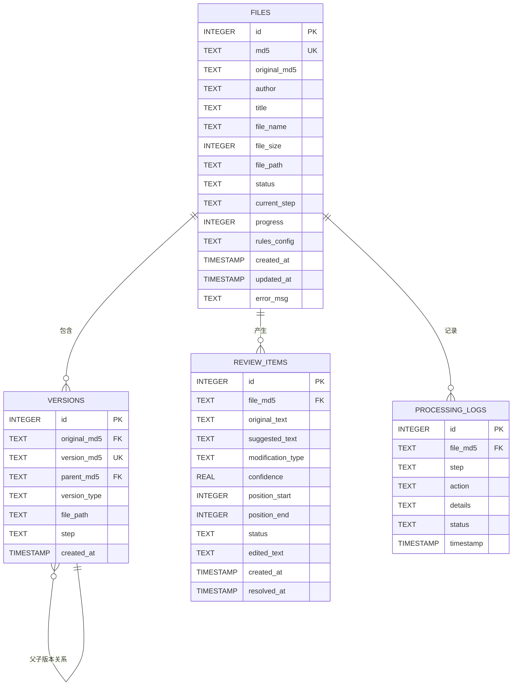
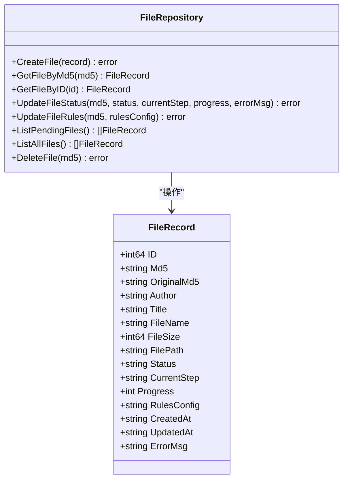
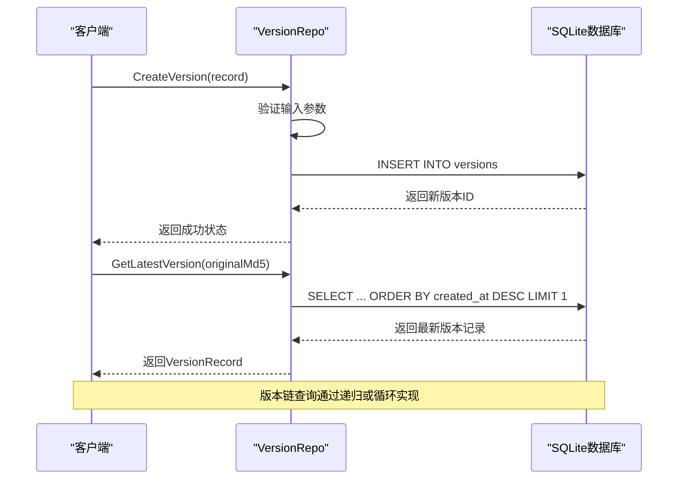
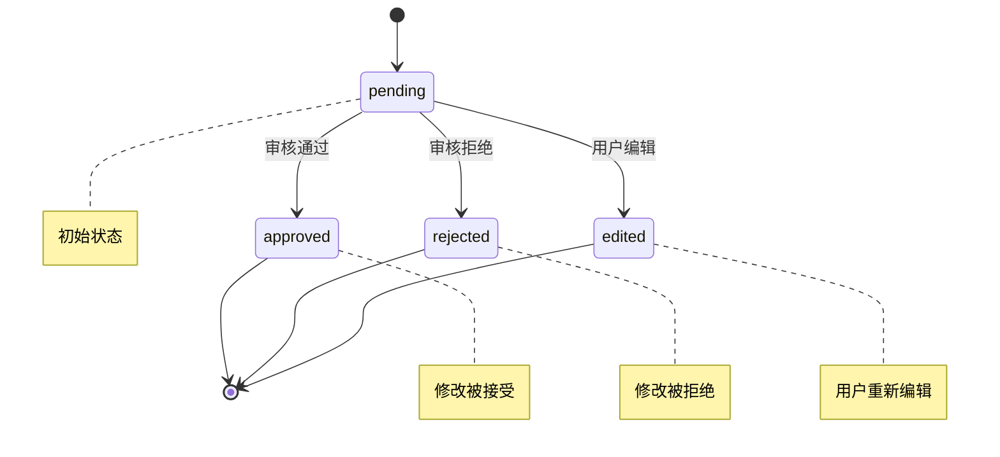
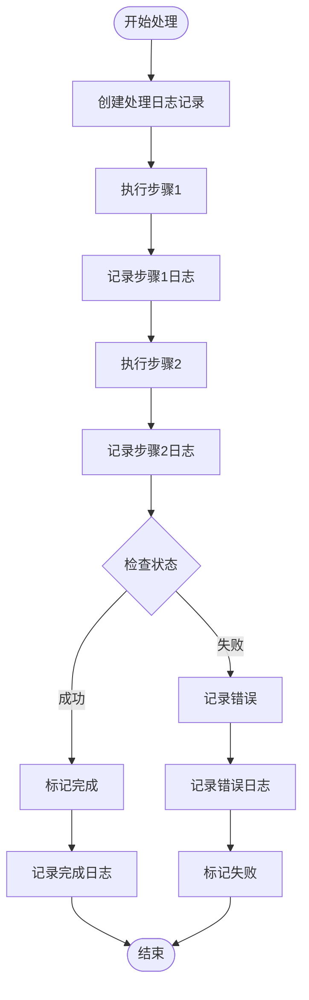
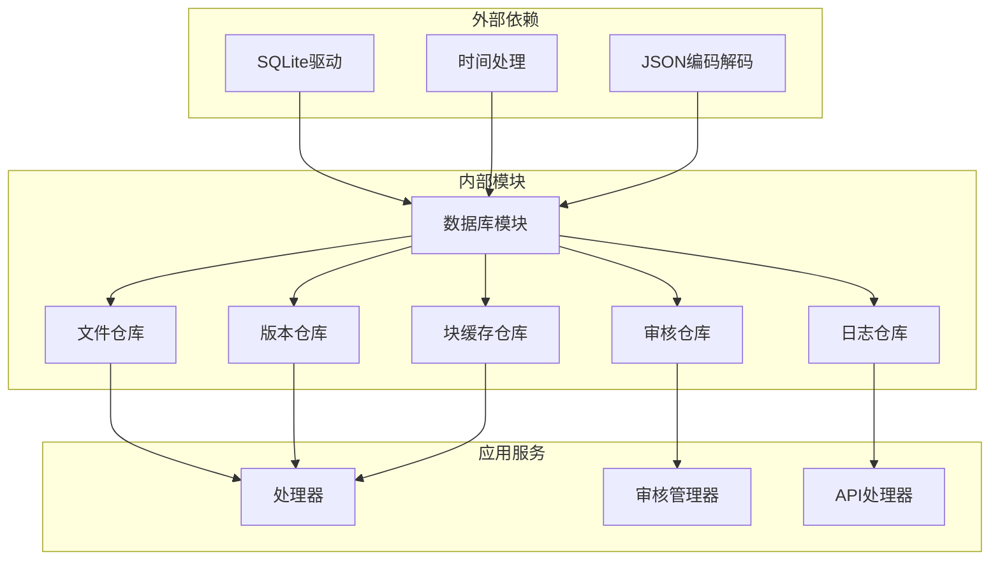

# 核心数据模型

<cite>
**本文档引用的文件**
- [数据库设计.md](file://doc/03-数据库设计.md)
- [文件仓库.go](file://internal/database/file_repo.go)
- [版本仓库.go](file://internal/database/version_repo.go)
- [审核仓库.go](file://internal/database/review_repo.go)
- [日志仓库.go](file://internal/database/log_repo.go)
- [数据库.go](file://internal/database/db.go)
- [块缓存仓库.go](file://internal/database/chunk_cache_repo.go)
</cite>

## 目录
1. [简介](#简介)
2. [项目结构](#项目结构)
3. [核心组件](#核心组件)
4. [架构概览](#架构概览)
5. [详细组件分析](#详细组件分析)
6. [依赖分析](#依赖分析)
7. [性能考虑](#性能考虑)
8. [故障排除指南](#故障排除指南)
9. [结论](#结论)

## 简介

VoidText系统是一个基于SQLite的文本清理和处理平台，专注于小说文本的自动化清洗和质量提升。本文档详细阐述了系统的四个核心数据模型：FileRecord（文件记录）、VersionRecord（版本记录）、ReviewItem（审核项）和ProcessingLog（处理日志），以及它们之间的关系和约束。

系统采用SQLite作为主要数据库，支持WAL模式以提高并发性能，并实现了完整的数据完整性保证机制。四个核心实体模型构成了整个处理流程的数据基础，从文件上传、版本管理、人工审核到处理日志记录，形成了完整的工作流闭环。

## 项目结构

系统采用分层架构设计，核心数据模型位于internal/database目录下，每个实体都有对应的仓库模式实现：

**图表来源**
- [数据库设计.md:164-189](file://doc/03-数据库设计.md#L164-L189)
- [文件仓库.go:9-26](file://internal/database/file_repo.go#L9-L26)
- [版本仓库.go:8-18](file://internal/database/version_repo.go#L8-L18)
- [审核仓库.go:9-23](file://internal/database/review_repo.go#L9-L23)
- [日志仓库.go:8-17](file://internal/database/log_repo.go#L8-L17)

**章节来源**
- [数据库设计.md:1-219](file://doc/03-数据库设计.md#L1-L219)
- [数据库.go:15-87](file://internal/database/db.go#L15-L87)

## 核心组件

### FileRecord（文件记录）

FileRecord是系统中最核心的实体，代表一个上传的文件及其处理状态。它包含了文件的基本元数据、处理进度和状态信息。

**字段定义与约束：**
- `id`: INTEGER PRIMARY KEY - 自增主键，唯一标识每个文件记录
- `md5`: TEXT UNIQUE NOT NULL - 文件MD5哈希值，确保文件唯一性
- `original_md5`: TEXT - 原始上传文件的MD5，支持版本追踪
- `author`: TEXT - 从文件名解析的作者信息
- `title`: TEXT - 小说标题
- `file_name`: TEXT - 原始文件名
- `file_size`: INTEGER - 文件大小（字节）
- `file_path`: TEXT - 文件在系统中的存储路径
- `status`: TEXT NOT NULL DEFAULT 'pending' - 文件处理状态，默认为pending
- `current_step`: TEXT - 当前处理步骤
- `progress`: INTEGER NOT NULL DEFAULT 0 - 处理进度百分比（0-100）
- `rules_config`: TEXT - JSON格式的规则配置
- `created_at`: TIMESTAMP NOT NULL DEFAULT CURRENT_TIMESTAMP - 创建时间
- `updated_at`: TIMESTAMP NOT NULL DEFAULT CURRENT_TIMESTAMP - 最后更新时间
- `error_msg`: TEXT - 处理失败时的错误信息

**业务含义：**
FileRecord代表系统中一个完整的文件生命周期，从上传、处理到完成或失败的全过程都被记录在这个实体中。它是整个处理流程的起点和终点。

**使用场景：**
- 文件上传后的初始状态记录
- 处理进度跟踪和状态更新
- 文件元数据管理和检索
- 处理失败时的错误信息存储

### VersionRecord（版本记录）

VersionRecord用于维护文件的版本历史，支持文件的多版本管理和版本追踪。

**字段定义与约束：**
- `id`: INTEGER PRIMARY KEY - 自增主键
- `original_md5`: TEXT NOT NULL - 原始文件MD5，关联到FileRecord
- `version_md5`: TEXT UNIQUE NOT NULL - 当前版本的MD5，确保版本唯一性
- `parent_md5`: TEXT - 父版本的MD5，形成版本链（根版本为NULL）
- `version_type`: TEXT NOT NULL - 版本类型：original/intermediate/final
- `file_path`: TEXT NOT NULL - 版本文件的绝对路径
- `step`: TEXT - 处理步骤描述
- `created_at`: TIMESTAMP NOT NULL DEFAULT CURRENT_TIMESTAMP - 版本创建时间

**业务含义：**
VersionRecord实现了文件的版本控制机制，支持从原始版本到中间版本再到最终版本的完整处理链路。每个版本都保持独立的文件路径和处理步骤信息。

**使用场景：**
- 文件处理过程中的版本追踪
- 版本间的差异分析和比较
- 回滚到特定版本的能力
- 处理步骤的历史记录

### ReviewItem（审核项）

ReviewItem记录了需要人工审核的修改建议，支持AI生成的修改建议的人工确认流程。

**字段定义与约束：**
- `id`: INTEGER PRIMARY KEY - 自增主键
- `file_md5`: TEXT NOT NULL - 关联的文件MD5，外键引用FileRecord
- `original_text`: TEXT - 原文片段
- `suggested_text`: TEXT - 建议修改后的文本
- `modification_type`: TEXT - 修改类型（如语法、标点、格式等）
- `confidence`: REAL - AI置信度（0-1之间的小数）
- `position_start`: INTEGER - 文档中的起始字符位置
- `position_end`: INTEGER - 结束字符位置
- `status`: TEXT NOT NULL DEFAULT 'pending' - 审核状态，默认pending
- `edited_text`: TEXT - 用户编辑后的文本
- `created_at`: TIMESTAMP NOT NULL DEFAULT CURRENT_TIMESTAMP - 创建时间
- `resolved_at`: TIMESTAMP - 处理完成时间

**业务含义：**
ReviewItem是AI辅助人工审核的关键环节，它将AI生成的修改建议以结构化的方式呈现给审核人员，支持多种状态的流转和处理。

**使用场景：**
- AI修改建议的展示和审核
- 人工编辑和确认流程
- 审核进度统计和报告
- 修改历史的追踪和审计

### ProcessingLog（处理日志）

ProcessingLog记录了文件处理过程中的详细日志信息，提供了完整的处理轨迹和问题诊断能力。

**字段定义与约束：**
- `id`: INTEGER PRIMARY KEY - 自增主键
- `file_md5`: TEXT - 关联的文件MD5，外键引用FileRecord
- `step`: TEXT - 步骤名称（如cleaning、validation、formatting等）
- `action`: TEXT - 具体操作描述
- `details`: TEXT - 详细信息（JSON格式）
- `status`: TEXT - 状态：running/completed/failed
- `timestamp`: TIMESTAMP NOT NULL DEFAULT CURRENT_TIMESTAMP - 日志时间戳

**业务含义：**
ProcessingLog提供了完整的处理过程可视化，每个步骤、每个操作都有详细的日志记录，便于问题排查和性能监控。

**使用场景：**
- 处理过程的实时监控
- 故障诊断和问题定位
- 性能分析和优化
- 合规性和审计要求

## 架构概览

系统采用实体关系模型，四个核心实体通过外键关系相互关联，形成了完整的数据流：

**图表来源**
- [数据库设计.md:164-189](file://doc/03-数据库设计.md#L164-L189)
- [数据库.go:89-222](file://internal/database/db.go#L89-L222)

**章节来源**
- [数据库设计.md:164-219](file://doc/03-数据库设计.md#L164-L219)
- [数据库.go:89-222](file://internal/database/db.go#L89-L222)

## 详细组件分析

### FileRecord 实现分析

FileRecord的Go语言实现体现了良好的数据封装和业务逻辑分离：

**图表来源**
- [文件仓库.go:9-26](file://internal/database/file_repo.go#L9-L26)
- [文件仓库.go:28-169](file://internal/database/file_repo.go#L28-L169)

**关键特性：**
- **数据完整性**：通过SQL UNIQUE约束确保md5字段的唯一性
- **状态管理**：完整的文件处理状态机支持
- **事务支持**：批量操作使用事务保证原子性
- **索引优化**：针对常用查询条件建立索引

### VersionRecord 实现分析

VersionRecord实现了复杂的版本链管理：

**图表来源**
- [版本仓库.go:20-86](file://internal/database/version_repo.go#L20-L86)

**版本类型说明：**
- **original**：文件的原始版本
- **intermediate**：处理过程中的中间版本
- **final**：最终完成的版本

### ReviewItem 实现分析

ReviewItem支持复杂的状态流转和批量操作：

**图表来源**
- [数据库设计.md:203-211](file://doc/03-数据库设计.md#L203-L211)

**批量操作特性：**
- **事务批处理**：CreateReviewItems使用预编译语句提高性能
- **状态批量更新**：支持同时更新多个审核项的状态
- **进度统计**：提供审核进度的实时统计功能

### ProcessingLog 实现分析

ProcessingLog提供了完整的处理过程追踪：

**图表来源**
- [日志仓库.go:19-75](file://internal/database/log_repo.go#L19-L75)

**日志级别：**
- **running**：操作开始执行
- **completed**：操作成功完成
- **failed**：操作执行失败

## 依赖分析

系统的核心依赖关系体现了清晰的分层架构：

**图表来源**
- [数据库.go:3-11](file://internal/database/db.go#L3-L11)
- [文件仓库.go:3-7](file://internal/database/file_repo.go#L3-L7)
- [版本仓库.go:3-6](file://internal/database/version_repo.go#L3-L6)

**依赖特点：**
- **低耦合**：各仓库模块相对独立，职责明确
- **高内聚**：每个仓库专注于单一实体的操作
- **可扩展性**：新增实体只需遵循现有模式

**章节来源**
- [数据库.go:89-222](file://internal/database/db.go#L89-L222)
- [文件仓库.go:1-169](file://internal/database/file_repo.go#L1-L169)
- [版本仓库.go:1-115](file://internal/database/version_repo.go#L1-L115)
- [审核仓库.go:1-202](file://internal/database/review_repo.go#L1-L202)
- [日志仓库.go:1-76](file://internal/database/log_repo.go#L1-L76)

## 性能考虑

### 索引策略

系统采用了精心设计的索引策略来优化查询性能：

**主索引：**
- `files(md5)` - 唯一索引，支持快速文件查找
- `versions(version_md5)` - 唯一索引，支持版本快速定位
- `review_items(file_md5)` - 支持按文件分组查询

**复合索引：**
- `review_items(file_md5, status)` - 支持按状态过滤的高效查询
- `versions(original_md5)` - 支持版本链查询

**特殊索引：**
- `idx_retry_queue_next_retry` - 支持定时重试任务的高效筛选

### 并发优化

系统通过以下机制优化并发性能：

**WAL模式配置：**
- 启用Write-Ahead Logging模式提高并发读取性能
- 设置wal_autocheckpoint参数平衡性能和磁盘空间
- 使用SetMaxOpenConns(1)确保写操作的串行化

**连接池管理：**
- 限制最大连接数为1，避免SQLite的并发限制问题
- 设置连接最大存活时间为5分钟
- 合理的空闲连接管理

### 缓存机制

**块修复缓存：**
- 支持断点续传和幂等性操作
- 使用INSERT OR REPLACE确保数据一致性
- 提供缓存命中率统计功能

**重试队列：**
- 实现指数退避重试策略
- 支持最大重试次数控制
- 提供定时重试任务调度

## 故障排除指南

### 常见问题及解决方案

**1. 数据库连接问题**
- **症状**：应用启动时报数据库连接错误
- **原因**：数据库文件权限不足或路径不存在
- **解决**：检查数据目录权限，确保应用程序有读写权限

**2. 主键冲突**
- **症状**：插入文件记录时报主键冲突错误
- **原因**：尝试插入重复的文件MD5
- **解决**：检查文件是否已存在，或使用GetFileByMd5进行查询

**3. 外键约束错误**
- **症状**：插入审核项时报外键约束错误
- **原因**：file_md5引用的文件不存在
- **解决**：先创建文件记录，再创建对应的审核项

**4. 索引性能问题**
- **症状**：查询响应时间过长
- **原因**：缺少适当的索引或索引失效
- **解决**：检查查询条件，添加必要的索引

### 调试工具

**1. 日志分析**
- 使用GetProcessingLogsByFileMd5获取详细的处理日志
- 分析日志中的错误信息和状态变化
- 监控处理时间分布和性能瓶颈

**2. 数据完整性检查**
- 验证文件MD5的唯一性约束
- 检查版本链的完整性
- 确认审核项状态的一致性

**3. 性能监控**
- 监控数据库连接池使用情况
- 分析查询执行计划
- 评估索引使用效率

**章节来源**
- [数据库设计.md:213-219](file://doc/03-数据库设计.md#L213-L219)
- [数据库.go:76-87](file://internal/database/db.go#L76-L87)

## 结论

VoidText系统的四个核心数据模型设计合理，体现了良好的软件工程实践。通过FileRecord、VersionRecord、ReviewItem和ProcessingLog的协同工作，系统实现了从文件上传到处理完成的完整生命周期管理。

**设计优势：**
- **数据完整性**：通过外键约束和唯一性约束确保数据一致性
- **可扩展性**：模块化的仓库设计支持新实体的添加
- **性能优化**：合理的索引策略和并发控制机制
- **可观测性**：完整的日志记录支持问题诊断和性能分析

**未来改进方向：**
- 可以考虑添加更多的业务规则验证
- 增加数据备份和恢复机制
- 实现更细粒度的权限控制
- 添加数据迁移和版本升级支持

这些核心数据模型为VoidText系统的稳定运行和持续发展奠定了坚实的基础。