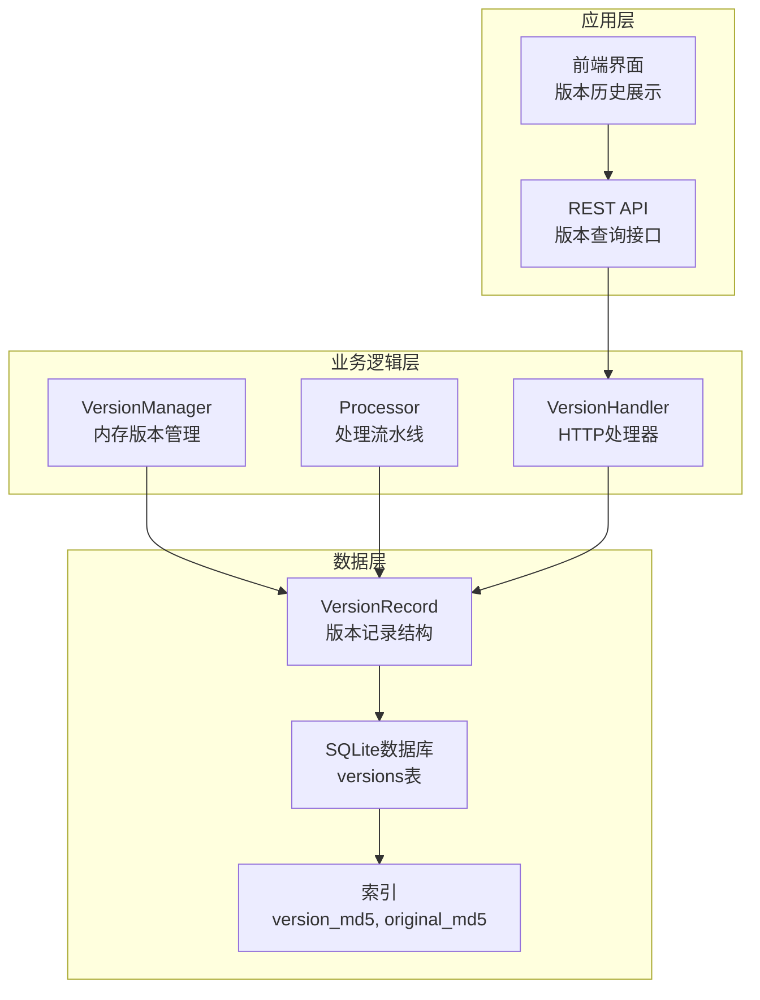
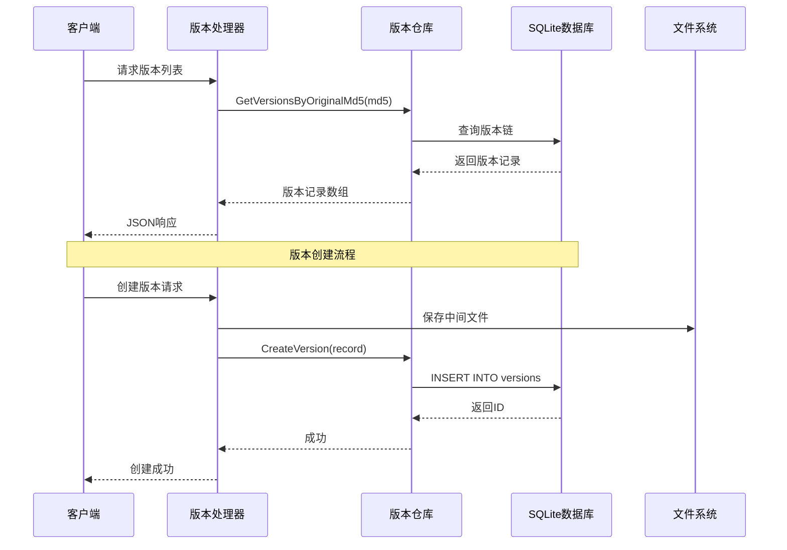
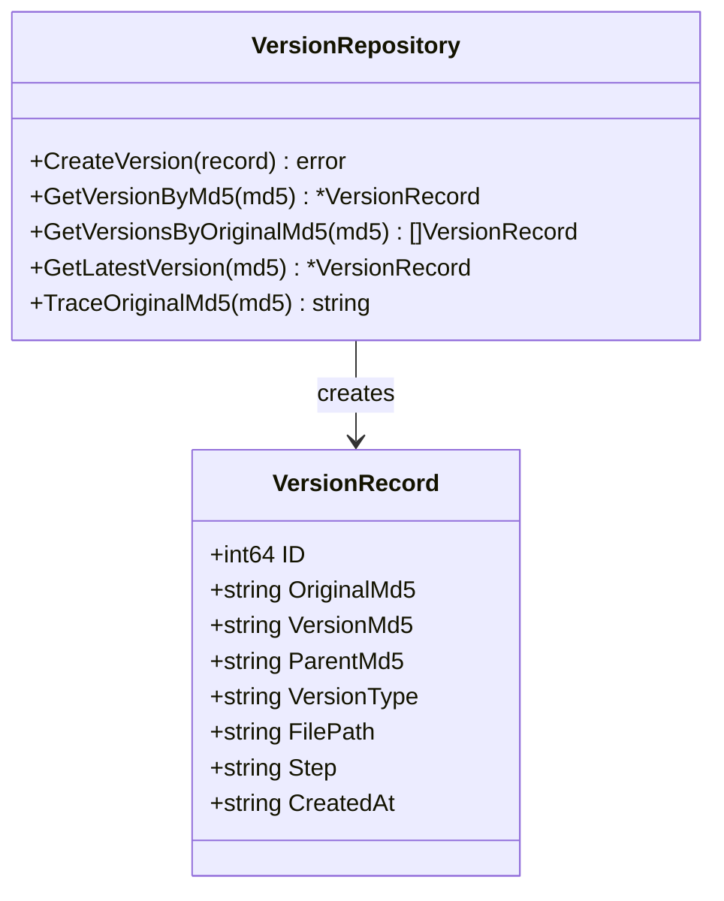
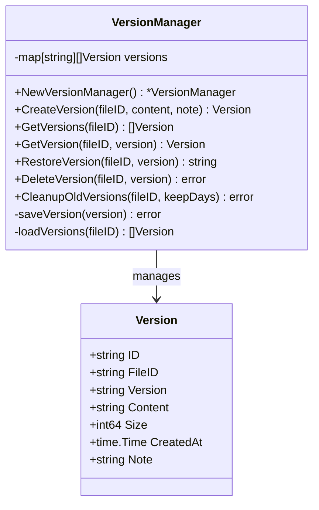
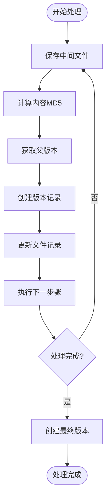
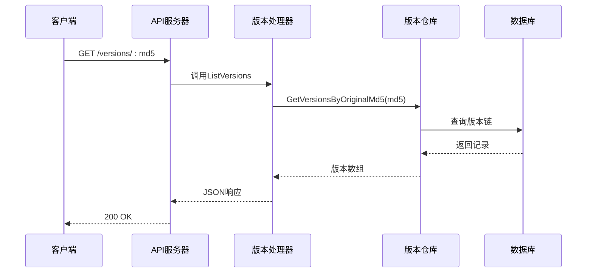
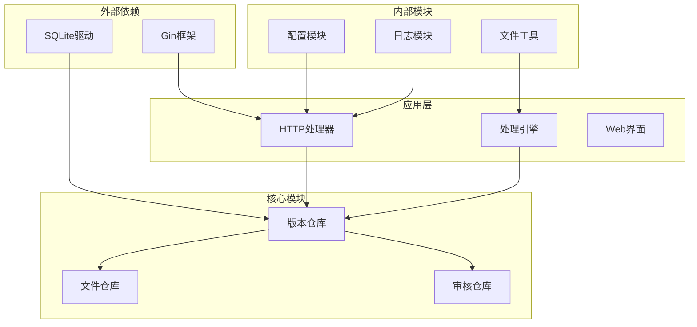

# 版本记录模型

<cite>
**本文档引用的文件**
- [version_repo.go](file://internal/database/version_repo.go)
- [db.go](file://internal/database/db.go)
- [03-数据库设计.md](file://doc/03-数据库设计.md)
- [version.go](file://internal/file/version.go)
- [pipeline.go](file://internal/processor/pipeline.go)
- [versions.go](file://web/backend/handlers/versions.go)
- [db_test.go](file://internal/database/db_test.go)
</cite>

## 目录
1. [简介](#简介)
2. [项目结构](#项目结构)
3. [核心组件](#核心组件)
4. [架构概览](#架构概览)
5. [详细组件分析](#详细组件分析)
6. [依赖关系分析](#依赖关系分析)
7. [性能考虑](#性能考虑)
8. [故障排除指南](#故障排除指南)
9. [结论](#结论)

## 简介

VoidText系统中的VersionRecord版本记录模型是文件版本控制系统的核心数据结构，负责维护文件处理过程中的版本历史。该模型实现了完整的版本控制机制，包括版本生成、版本间继承关系、版本回滚和版本追踪等功能。

版本记录模型采用SQLite作为持久化存储，通过统一的版本MD5标识符和父子版本关系建立完整的版本链。每个版本记录包含版本号、文件关联、处理步骤、结果数据和时间戳等关键字段，为文件的完整处理历史提供了可靠的追踪能力。

## 项目结构

版本记录模型在系统中的组织结构如下：

**图表来源**
- [version_repo.go:1-115](file://internal/database/version_repo.go#L1-L115)
- [db.go:89-222](file://internal/database/db.go#L89-L222)

**章节来源**
- [version_repo.go:1-115](file://internal/database/version_repo.go#L1-L115)
- [db.go:89-222](file://internal/database/db.go#L89-L222)

## 核心组件

### VersionRecord数据结构

VersionRecord是版本记录模型的核心数据结构，定义了版本控制所需的所有关键字段：

| 字段名 | 类型 | 描述 | 约束 |
|--------|------|------|------|
| ID | int64 | 数据库自增主键 | 主键 |
| OriginalMd5 | string | 原始文件MD5标识符 | NOT NULL |
| VersionMd5 | string | 当前版本MD5标识符 | UNIQUE, NOT NULL |
| ParentMd5 | string | 父版本MD5标识符 | 可为空 |
| VersionType | string | 版本类型 | NOT NULL |
| FilePath | string | 版本文件的绝对路径 | NOT NULL |
| Step | string | 处理步骤名称 | 可为空 |
| CreatedAt | string | 创建时间戳 | 默认CURRENT_TIMESTAMP |

### 版本类型系统

系统支持三种版本类型：
- **original**: 原始版本，对应文件的初始状态
- **intermediate**: 中间版本，表示处理过程中的临时状态
- **final**: 最终版本，表示处理完成的最终结果

### 版本生成规则

版本生成遵循以下规则：
1. **根版本**: 原始文件上传时创建original类型的根版本
2. **中间版本**: 每个处理步骤完成后创建intermediate类型的中间版本
3. **最终版本**: 处理完成后创建final类型的最终版本
4. **版本继承**: 新版本的ParentMd5指向其直接父版本

**章节来源**
- [version_repo.go:8-18](file://internal/database/version_repo.go#L8-L18)
- [db.go:108-117](file://internal/database/db.go#L108-L117)
- [03-数据库设计.md:41-49](file://doc/03-数据库设计.md#L41-L49)

## 架构概览

版本记录模型采用分层架构设计，确保了良好的模块分离和数据一致性：

**图表来源**
- [versions.go:11-22](file://web/backend/handlers/versions.go#L11-L22)
- [version_repo.go:20-33](file://internal/database/version_repo.go#L20-L33)

**章节来源**
- [versions.go:11-22](file://web/backend/handlers/versions.go#L11-L22)
- [version_repo.go:20-33](file://internal/database/version_repo.go#L20-L33)

## 详细组件分析

### 数据库层组件

#### VersionRecord结构定义

VersionRecord结构体定义了版本记录的完整数据模型：

**图表来源**
- [version_repo.go:8-18](file://internal/database/version_repo.go#L8-L18)
- [version_repo.go:20-98](file://internal/database/version_repo.go#L20-L98)

#### 数据库表结构

SQLite数据库中的versions表结构设计充分考虑了版本追踪的需求：

| 字段 | 类型 | 约束 | 说明 |
|------|------|------|------|
| id | INTEGER | PRIMARY KEY | 自增主键 |
| original_md5 | TEXT | NOT NULL | 原始文件MD5 |
| version_md5 | TEXT | UNIQUE, NOT NULL | 当前版本MD5 |
| parent_md5 | TEXT | 可为空 | 父版本MD5 |
| version_type | TEXT | NOT NULL | 版本类型 |
| file_path | TEXT | NOT NULL | 文件路径 |
| step | TEXT | 可为空 | 处理步骤 |
| created_at | TIMESTAMP | DEFAULT CURRENT_TIMESTAMP | 创建时间 |

**章节来源**
- [db.go:108-117](file://internal/database/db.go#L108-L117)
- [03-数据库设计.md:37-53](file://doc/03-数据库设计.md#L37-L53)

### 业务逻辑层组件

#### 版本管理器（VersionManager）

虽然VersionRecord主要在数据库层使用，但系统还提供了内存级别的版本管理器用于文件级版本控制：

**图表来源**
- [version.go:13-27](file://internal/file/version.go#L13-L27)
- [version.go:29-178](file://internal/file/version.go#L29-L178)

#### 处理流水线中的版本控制

版本记录在处理流水线中发挥关键作用：

**图表来源**
- [pipeline.go:547-579](file://internal/processor/pipeline.go#L547-L579)
- [pipeline.go:496-522](file://internal/processor/pipeline.go#L496-L522)

**章节来源**
- [version.go:13-27](file://internal/file/version.go#L13-L27)
- [version.go:29-178](file://internal/file/version.go#L29-L178)
- [pipeline.go:547-579](file://internal/processor/pipeline.go#L547-L579)
- [pipeline.go:496-522](file://internal/processor/pipeline.go#L496-L522)

### 接口层组件

#### HTTP版本查询接口

Web服务器提供了RESTful API用于版本查询：

**图表来源**
- [versions.go:11-22](file://web/backend/handlers/versions.go#L11-L22)
- [version_repo.go:55-66](file://internal/database/version_repo.go#L55-L66)

**章节来源**
- [versions.go:11-22](file://web/backend/handlers/versions.go#L11-L22)

## 依赖关系分析

版本记录模型的依赖关系体现了清晰的分层架构：

**图表来源**
- [version_repo.go:3-6](file://internal/database/version_repo.go#L3-L6)
- [versions.go:3-9](file://web/backend/handlers/versions.go#L3-L9)

**章节来源**
- [version_repo.go:3-6](file://internal/database/version_repo.go#L3-L6)
- [versions.go:3-9](file://web/backend/handlers/versions.go#L3-L9)

## 性能考虑

### 数据库性能优化

系统采用了多项SQLite性能优化策略：

1. **WAL模式**: 启用Write-Ahead Logging模式，支持多读单写的并发访问
2. **索引优化**: 为version_md5和original_md5字段建立索引
3. **连接池**: 设置MaxOpenConns=1确保SQLite的并发限制得到正确处理
4. **缓存配置**: 设置cache_size=-10000提高查询性能

### 版本查询性能

版本查询操作的时间复杂度分析：
- **GetVersionByMd5**: O(log n) - 基于索引的查找
- **GetVersionsByOriginalMd5**: O(m log n) - m为版本数量，n为总记录数
- **GetLatestVersion**: O(log n) - 基于索引的排序查找

### 内存版本管理

内存版本管理器提供了高性能的版本操作：
- **快速访问**: O(1)时间复杂度的内存访问
- **批量操作**: 支持批量版本管理和清理
- **持久化**: 自动序列化到JSON文件，支持重启恢复

## 故障排除指南

### 常见问题及解决方案

#### 版本记录创建失败

**问题症状**: CreateVersion返回错误，版本记录无法创建

**可能原因**:
1. 数据库连接异常
2. 唯一约束冲突（version_md5重复）
3. 外键约束错误（parent_md5不存在）

**解决步骤**:
1. 检查数据库连接状态
2. 验证version_md5的唯一性
3. 确认parent_md5对应的版本存在

#### 版本查询异常

**问题症状**: GetVersionByMd5返回nil或错误

**可能原因**:
1. 版本MD5不存在
2. 数据库查询错误
3. 索引损坏

**解决步骤**:
1. 验证输入的MD5格式
2. 检查数据库连接
3. 重建相关索引

#### 版本链断裂

**问题症状**: 版本查询返回部分结果或错误

**可能原因**:
1. 中间版本缺失
2. 父子版本关系错误
3. 数据库损坏

**解决步骤**:
1. 检查版本链的完整性
2. 验证父子版本关系
3. 执行数据库修复

**章节来源**
- [db_test.go:416-474](file://internal/database/db_test.go#L416-L474)

## 结论

VersionRecord版本记录模型为VoidText系统提供了完整、可靠且高效的版本控制能力。通过精心设计的数据结构、完善的版本生成规则和优化的查询机制，系统能够有效追踪文件的完整处理历史。

该模型的主要优势包括：
- **完整性**: 支持原始版本、中间版本和最终版本的完整生命周期
- **可追溯性**: 通过MD5标识符和父子关系实现完整的版本链追踪
- **性能**: 采用SQLite优化策略和索引设计，确保高效查询
- **可靠性**: 通过唯一约束和外键关系保证数据一致性

未来可以考虑的改进方向：
- 添加版本压缩和归档功能
- 实现版本标签和注释系统
- 增强版本比较和差异分析功能
- 支持版本分支和合并操作