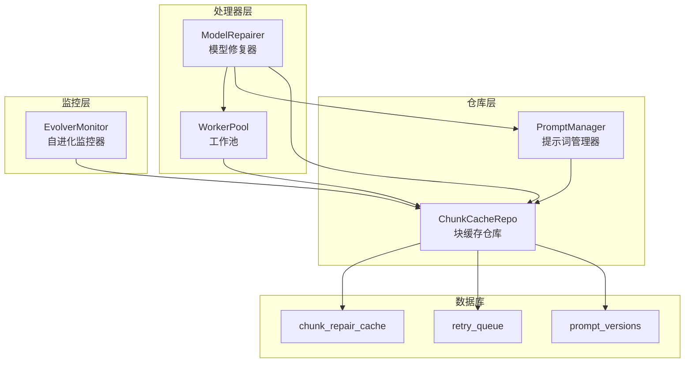
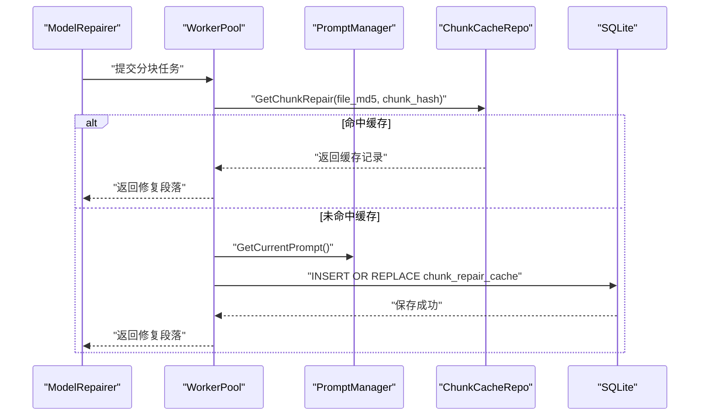
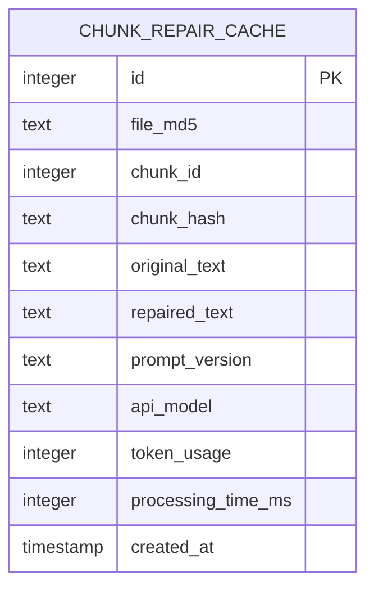
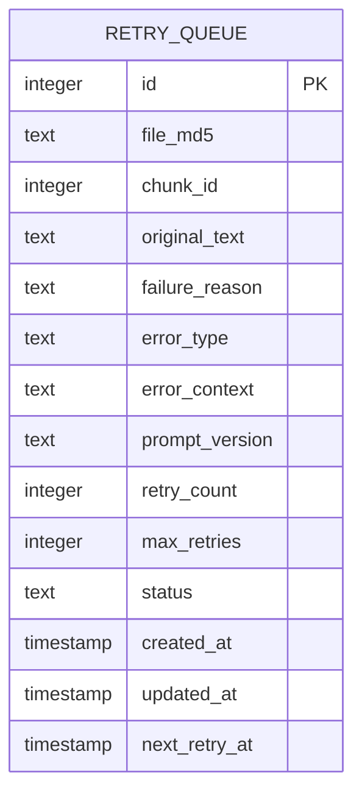
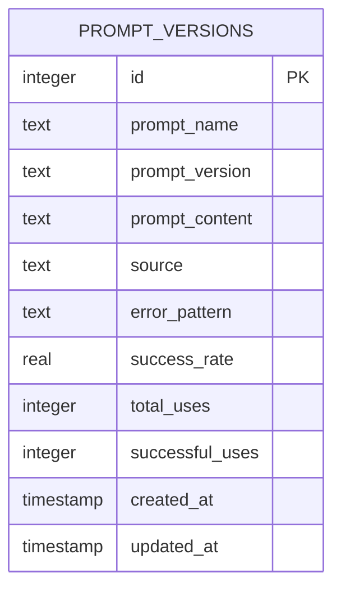
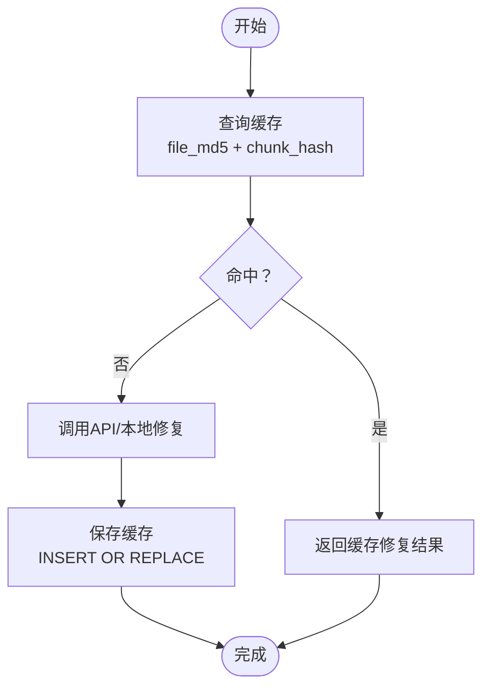
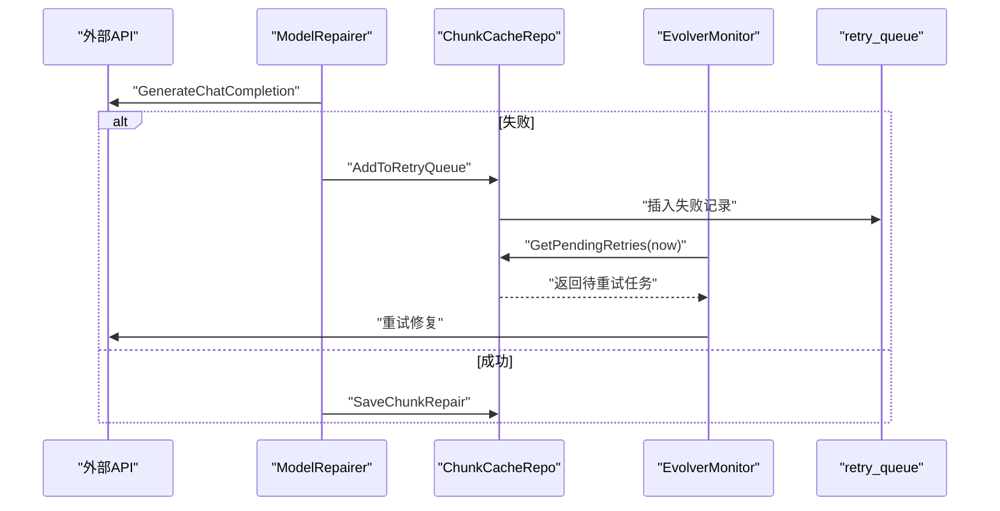
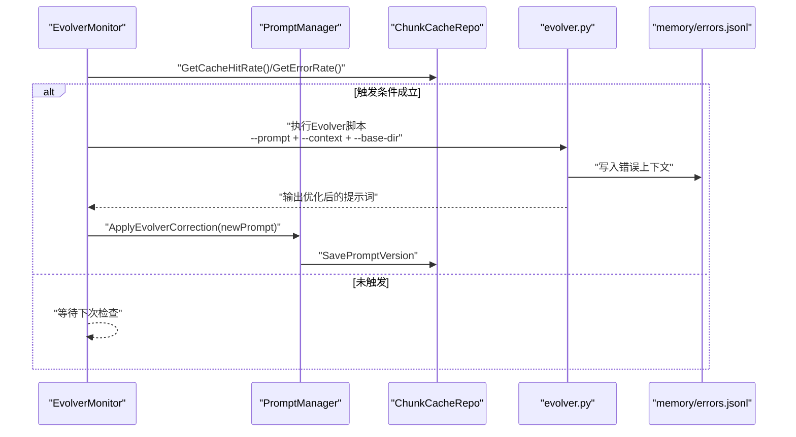
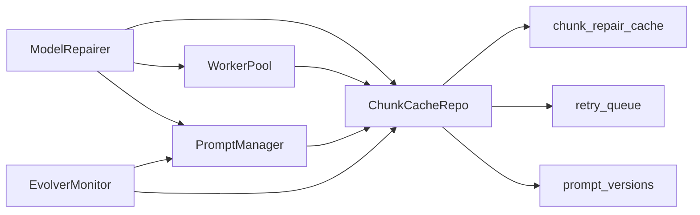

# 高级表结构

<cite>
**本文档引用的文件**
- [chunk_cache_repo.go](file://internal/database/chunk_cache_repo.go)
- [db.go](file://internal/database/db.go)
- [03-数据库设计.md](file://doc/03-数据库设计.md)
- [model_repairer.go](file://internal/processor/model_repairer.go)
- [evolver_monitor.go](file://internal/processor/evolver_monitor.go)
- [prompt_manager.go](file://internal/processor/prompt_manager.go)
- [evolver.py](file://scripts/evolver.py)
</cite>

## 目录
1. [简介](#简介)
2. [项目结构](#项目结构)
3. [核心组件](#核心组件)
4. [架构总览](#架构总览)
5. [详细组件分析](#详细组件分析)
6. [依赖分析](#依赖分析)
7. [性能考量](#性能考量)
8. [故障排查指南](#故障排查指南)
9. [结论](#结论)
10. [附录](#附录)

## 简介
本文件聚焦txtCleaning系统中三个专门用途的高级表：chunk_repair_cache（块级修复缓存表）、retry_queue（重试队列表）与prompt_versions（提示词版本表）。我们将从设计目的、业务场景、技术实现、幂等性与断点续传机制、故障处理与自动重试、提示词版本管理与Evolver自进化、索引与查询优化、使用示例与最佳实践等方面进行系统化阐述，并配合可视化图表帮助理解。

## 项目结构
围绕上述三张表，系统采用“仓库层 + 处理器层 + 监控层”的分层设计：
- 仓库层：负责与SQLite交互，封装CRUD与统计查询。
- 处理器层：负责分块、并发处理、缓存命中、API调用与回退、提示词使用统计。
- 监控层：负责周期性评估命中率与错误率，触发Evolver自进化。

图表来源
- [chunk_cache_repo.go:57-65](file://internal/database/chunk_cache_repo.go#L57-L65)
- [model_repairer.go:19-75](file://internal/processor/model_repairer.go#L19-L75)
- [evolver_monitor.go:18-41](file://internal/processor/evolver_monitor.go#L18-L41)
- [db.go:141-187](file://internal/database/db.go#L141-L187)

章节来源
- [chunk_cache_repo.go:57-65](file://internal/database/chunk_cache_repo.go#L57-L65)
- [db.go:89-222](file://internal/database/db.go#L89-L222)
- [03-数据库设计.md:94-162](file://doc/03-数据库设计.md#L94-L162)

## 核心组件
- 块缓存仓库（ChunkCacheRepo）：提供块级修复缓存的查询、保存、断点续传、清理与统计查询。
- 提示词管理器（PromptManager）：负责提示词加载、热重载、版本持久化、使用统计与Evolver应用。
- 自进化监控器（EvolverMonitor）：周期性评估命中率与错误率，触发外部Evolver脚本优化提示词。
- 工作池（WorkerPool）：并发处理文本分块，结合缓存命中与重试队列。

章节来源
- [chunk_cache_repo.go:57-65](file://internal/database/chunk_cache_repo.go#L57-L65)
- [prompt_manager.go:15-76](file://internal/processor/prompt_manager.go#L15-L76)
- [evolver_monitor.go:18-41](file://internal/processor/evolver_monitor.go#L18-L41)
- [model_repairer.go:526-563](file://internal/processor/model_repairer.go#L526-L563)

## 架构总览
下图展示三张表在系统中的角色与交互关系，以及与处理器、监控器的调用链路。

图表来源
- [model_repairer.go:575-672](file://internal/processor/model_repairer.go#L575-L672)
- [chunk_cache_repo.go:69-100](file://internal/database/chunk_cache_repo.go#L69-L100)
- [prompt_manager.go:177-182](file://internal/processor/prompt_manager.go#L177-L182)

## 详细组件分析

### 块修复缓存表 chunk_repair_cache
- 设计目的
  - 存储LLM修复结果，支持幂等性（INSERT OR REPLACE）与断点续传（按file_md5与chunk_hash定位）。
  - 降低重复API调用成本，提升整体吞吐。
- 业务场景
  - 文本清洗流水线中，将长文本切分为若干块，逐块修复并缓存；后续同内容块可直接命中缓存。
  - 支持文件级断点续传：根据已缓存块集合与总块数，计算未完成块集合继续处理。
- 技术实现要点
  - 幂等性：保存时使用“INSERT OR REPLACE”，避免重复键冲突导致的失败。
  - 并发安全：保存与统计均使用事务，确保原子性。
  - 断点续传：通过查询已缓存chunk_id并与总块数对比，得出未完成块列表。
  - 清理策略：定期删除过期缓存与已完成/失败的重试记录，避免无限增长。
- 表结构与索引
  - 主键自增id；唯一约束(file_md5, chunk_hash)；常用查询字段file_md5、chunk_hash建立索引。
- 查询优化
  - 命中查询：file_md5 + chunk_hash；未命中时再进行断点续传计算。
  - 统计查询：最近24小时命中率与错误率估算，便于监控与自进化触发。

图表来源
- [db.go:142-155](file://internal/database/db.go#L142-L155)
- [03-数据库设计.md:94-116](file://doc/03-数据库设计.md#L94-L116)

章节来源
- [chunk_cache_repo.go:69-100](file://internal/database/chunk_cache_repo.go#L69-L100)
- [chunk_cache_repo.go:105-137](file://internal/database/chunk_cache_repo.go#L105-L137)
- [chunk_cache_repo.go:139-167](file://internal/database/chunk_cache_repo.go#L139-L167)
- [chunk_cache_repo.go:392-420](file://internal/database/chunk_cache_repo.go#L392-L420)
- [chunk_cache_repo.go:425-478](file://internal/database/chunk_cache_repo.go#L425-L478)

### 重试队列表 retry_queue
- 设计目的
  - 记录修复失败的块，支持指数退避重试与状态跟踪，配合Evolver自进化系统。
- 业务场景
  - API调用失败或返回空结果时，将失败块加入队列；按时间窗口拉取待重试任务，避免过早重试。
  - 支持最大重试次数与状态机（pending/processing/completed/failed）。
- 技术实现要点
  - 指数退避：retry_count决定下次重试时间，上限1小时，避免频繁重试。
  - 原子更新：状态与重试计数更新使用事务，避免竞态。
  - 时间窗口筛选：仅取next_retry_at已到达且status=pending的记录。
- 表结构与索引
  - 常用查询字段status、next_retry_at建立索引，支持高效筛选。
- 故障处理与自动重试
  - 失败时记录失败原因、错误类型、错误上下文、提示词版本、最大重试次数。
  - 监控器周期性拉取待重试任务，按顺序处理并更新状态。

图表来源
- [db.go:157-172](file://internal/database/db.go#L157-L172)
- [03-数据库设计.md:117-141](file://doc/03-数据库设计.md#L117-L141)

章节来源
- [chunk_cache_repo.go:169-202](file://internal/database/chunk_cache_repo.go#L169-L202)
- [chunk_cache_repo.go:207-250](file://internal/database/chunk_cache_repo.go#L207-L250)
- [chunk_cache_repo.go:252-272](file://internal/database/chunk_cache_repo.go#L252-L272)

### 提示词版本表 prompt_versions
- 设计目的
  - 记录不同版本提示词及其效果指标（成功率、使用次数），支撑Evolver自进化与效果评估。
- 业务场景
  - 提示词加载与热重载：从文件或数据库加载最新版本；支持Evolver应用优化后的提示词。
  - 版本持久化：每次更新都会写入数据库，保证版本可追踪。
  - 使用统计：记录提示词使用次数与成功次数，用于排序与选择最优版本。
- 技术实现要点
  - 幂等性：INSERT OR REPLACE，避免重复版本冲突。
  - 排序策略：按成功率、使用次数、更新时间排序，优先选择最优版本。
  - 原子更新：使用事务更新使用统计，避免并发竞争。
- 表结构与索引
  - 唯一约束(prompt_name, prompt_version)，确保版本唯一性。
  - 常用查询字段prompt_name与prompt_version建立复合索引。

图表来源
- [db.go:174-187](file://internal/database/db.go#L174-L187)
- [03-数据库设计.md:142-162](file://doc/03-数据库设计.md#L142-L162)

章节来源
- [chunk_cache_repo.go:277-301](file://internal/database/chunk_cache_repo.go#L277-L301)
- [chunk_cache_repo.go:306-344](file://internal/database/chunk_cache_repo.go#L306-L344)
- [chunk_cache_repo.go:346-388](file://internal/database/chunk_cache_repo.go#L346-L388)

### 幂等性设计与断点续传机制
- 幂等性
  - 保存缓存使用“INSERT OR REPLACE”，确保相同file_md5+chunk_hash的重复写入不会产生冲突。
- 断点续传
  - 通过查询已缓存chunk_id并与总块数对比，得到未完成块集合，实现文件级断点续传。
- 并发与事务
  - 保存缓存、更新重试状态、更新提示词使用统计均使用事务，保证原子性与一致性。

图表来源
- [model_repairer.go:575-672](file://internal/processor/model_repairer.go#L575-L672)
- [chunk_cache_repo.go:69-100](file://internal/database/chunk_cache_repo.go#L69-L100)

章节来源
- [chunk_cache_repo.go:69-100](file://internal/database/chunk_cache_repo.go#L69-L100)
- [chunk_cache_repo.go:139-167](file://internal/database/chunk_cache_repo.go#L139-L167)

### 重试队列的故障处理、错误分类与自动重试逻辑
- 错误分类
  - 失败原因、错误类型、错误上下文三元组，便于后续分析与Evolver优化。
- 指数退避
  - 下次重试时间=now+2^retry_count分钟，上限1小时，避免频繁重试。
- 自动重试
  - 监控器周期性拉取next_retry_at<=now且status=pending的记录，按顺序处理并更新状态。
- 原子更新
  - 状态与重试计数更新使用事务，避免竞态。

图表来源
- [model_repairer.go:251-319](file://internal/processor/model_repairer.go#L251-L319)
- [chunk_cache_repo.go:169-202](file://internal/database/chunk_cache_repo.go#L169-L202)
- [chunk_cache_repo.go:207-250](file://internal/database/chunk_cache_repo.go#L207-L250)
- [evolver_monitor.go:117-177](file://internal/processor/evolver_monitor.go#L117-L177)

章节来源
- [chunk_cache_repo.go:169-202](file://internal/database/chunk_cache_repo.go#L169-L202)
- [chunk_cache_repo.go:207-250](file://internal/database/chunk_cache_repo.go#L207-L250)
- [chunk_cache_repo.go:252-272](file://internal/database/chunk_cache_repo.go#L252-L272)

### 提示词版本管理的Evolver自进化机制、版本控制与效果评估
- 版本控制
  - 唯一约束(prompt_name, prompt_version)，确保版本唯一性；支持从文件或数据库加载最新版本。
- 效果评估
  - 统计total_uses、successful_uses、success_rate，用于排序与选择最优版本。
- 自进化触发
  - 监控命中率与错误率，满足阈值时触发Evolver脚本，生成优化后的提示词并应用。
- 外部集成
  - Evolver脚本将错误上下文写入memory/errors.jsonl，调用evolver CLI生成优化建议，回退到规则优化策略。

图表来源
- [evolver_monitor.go:117-177](file://internal/processor/evolver_monitor.go#L117-L177)
- [evolver_monitor.go:179-285](file://internal/processor/evolver_monitor.go#L179-L285)
- [prompt_manager.go:184-233](file://internal/processor/prompt_manager.go#L184-L233)
- [chunk_cache_repo.go:277-301](file://internal/database/chunk_cache_repo.go#L277-L301)
- [evolver.py:32-168](file://scripts/evolver.py#L32-L168)

章节来源
- [prompt_manager.go:15-76](file://internal/processor/prompt_manager.go#L15-L76)
- [prompt_manager.go:308-322](file://internal/processor/prompt_manager.go#L308-L322)
- [prompt_manager.go:324-353](file://internal/processor/prompt_manager.go#L324-L353)
- [evolver_monitor.go:117-177](file://internal/processor/evolver_monitor.go#L117-L177)
- [evolver_monitor.go:179-285](file://internal/processor/evolver_monitor.go#L179-L285)
- [evolver.py:143-211](file://scripts/evolver.py#L143-L211)

## 依赖分析
- 组件耦合
  - ModelRepairer依赖WorkerPool、PromptManager与ChunkCacheRepo；WorkerPool依赖ChunkCacheRepo与PromptManager；EvolverMonitor依赖ChunkCacheRepo与PromptManager；PromptManager依赖ChunkCacheRepo。
- 外部依赖
  - Evolver脚本依赖Node.js与Evolver CLI；SQLite提供本地存储与索引能力。
- 索引策略
  - chunk_repair_cache：file_md5、chunk_hash；retry_queue：status、next_retry_at；prompt_versions：prompt_name+prompt_version。

图表来源
- [model_repairer.go:19-75](file://internal/processor/model_repairer.go#L19-L75)
- [prompt_manager.go:15-76](file://internal/processor/prompt_manager.go#L15-L76)
- [evolver_monitor.go:18-41](file://internal/processor/evolver_monitor.go#L18-L41)
- [chunk_cache_repo.go:57-65](file://internal/database/chunk_cache_repo.go#L57-L65)

章节来源
- [db.go:196-202](file://internal/database/db.go#L196-L202)
- [03-数据库设计.md:112-162](file://doc/03-数据库设计.md#L112-L162)

## 性能考量
- 并发与锁
  - SQLite单连接写入序列化，读取可并发；通过事务保证原子性，避免竞态。
- 索引与查询
  - 为高频查询字段建立索引，减少全表扫描；使用LIMIT限制重试拉取数量。
- 缓存与清理
  - 通过幂等缓存减少重复API调用；定期清理过期记录，控制数据库规模。
- 监控与阈值
  - 命中率与错误率阈值触发Evolver优化，避免性能持续恶化。

## 故障排查指南
- 常见问题
  - 缓存未命中：检查file_md5与chunk_hash是否正确；确认幂等保存是否成功。
  - 重试队列堆积：检查next_retry_at是否合理；确认最大重试次数与状态更新。
  - 提示词版本未生效：检查prompt_versions是否正确插入；确认排序逻辑与当前版本选择。
- 排查步骤
  - 查询最近24小时命中率与错误率，定位异常时段。
  - 检查retry_queue中pending任务数量与next_retry_at分布。
  - 校验prompt_versions中各版本的使用统计与成功率。

章节来源
- [chunk_cache_repo.go:425-478](file://internal/database/chunk_cache_repo.go#L425-L478)
- [chunk_cache_repo.go:207-250](file://internal/database/chunk_cache_repo.go#L207-L250)
- [chunk_cache_repo.go:306-344](file://internal/database/chunk_cache_repo.go#L306-L344)

## 结论
chunk_repair_cache、retry_queue与prompt_versions三张表分别承担“缓存与断点续传”、“故障与重试”、“提示词版本与自进化”的职责。通过幂等性、事务、索引与定期清理策略，系统在保证一致性的同时实现了高吞吐与可扩展性。配合Evolver自进化机制，系统能够持续优化提示词质量，提升修复效果与稳定性。

## 附录
- 使用示例与最佳实践
  - 使用file_md5与chunk_hash作为缓存键，确保幂等性与可检索性。
  - 对重试队列设置合理的指数退避与最大重试次数，避免雪崩。
  - 定期评估命中率与错误率，及时触发Evolver优化。
  - 为高频查询字段建立索引，避免全表扫描。
  - 通过事务执行关键写入操作，确保数据一致性。