# MD5校验系统

<cite>
**本文档引用的文件**
- [md5.go](file://internal/file/md5.go)
- [md5_test.go](file://internal/file/md5_test.go)
- [pipeline.go](file://internal/processor/pipeline.go)
- [files.go](file://web/backend/handlers/files.go)
- [db.go](file://internal/database/db.go)
- [file_repo.go](file://internal/database/file_repo.go)
- [logger.go](file://internal/logging/logger.go)
- [model_repairer.go](file://internal/processor/model_repairer.go)
- [version.go](file://internal/file/version.go)
</cite>

## 目录
1. [简介](#简介)
2. [项目结构](#项目结构)
3. [核心组件](#核心组件)
4. [架构概览](#架构概览)
5. [详细组件分析](#详细组件分析)
6. [依赖关系分析](#依赖关系分析)
7. [性能考虑](#性能考虑)
8. [故障排除指南](#故障排除指南)
9. [结论](#结论)
10. [附录](#附录)

## 简介

MD5校验系统是txtCleaning项目中用于文件完整性验证和去重的核心组件。该系统基于MD5哈希算法，为文件处理流水线提供了可靠的完整性保证和版本控制能力。系统不仅实现了标准的MD5计算功能，还集成了并发安全的缓存机制、完善的错误处理和日志记录体系。

## 项目结构

MD5校验系统主要分布在以下模块中：

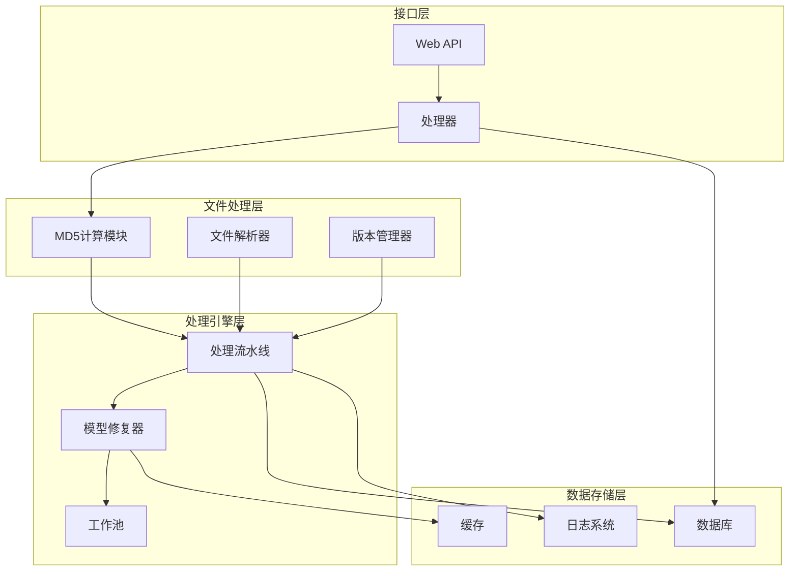

**图表来源**
- [md5.go:1-32](file://internal/file/md5.go#L1-L32)
- [pipeline.go:1-610](file://internal/processor/pipeline.go#L1-L610)
- [files.go:41-90](file://web/backend/handlers/files.go#L41-L90)

**章节来源**
- [md5.go:1-32](file://internal/file/md5.go#L1-L32)
- [pipeline.go:1-610](file://internal/processor/pipeline.go#L1-L610)
- [files.go:41-90](file://web/backend/handlers/files.go#L41-L90)

## 核心组件

### MD5计算模块

MD5计算模块提供了两种核心功能：
- 文件级MD5计算：适用于大文件的流式计算
- 内容级MD5计算：适用于内存中的文本内容

### 版本管理系统

版本管理器负责文件版本的创建、检索和管理，支持中间版本和最终版本的区分存储。

### 处理流水线集成

MD5校验深度集成到处理流水线中，在每个关键节点进行完整性验证和版本记录。

**章节来源**
- [md5.go:11-31](file://internal/file/md5.go#L11-L31)
- [version.go:24-69](file://internal/file/version.go#L24-L69)
- [pipeline.go:105-158](file://internal/processor/pipeline.go#L105-L158)

## 架构概览

MD5校验系统采用分层架构设计，确保了系统的可扩展性和维护性：

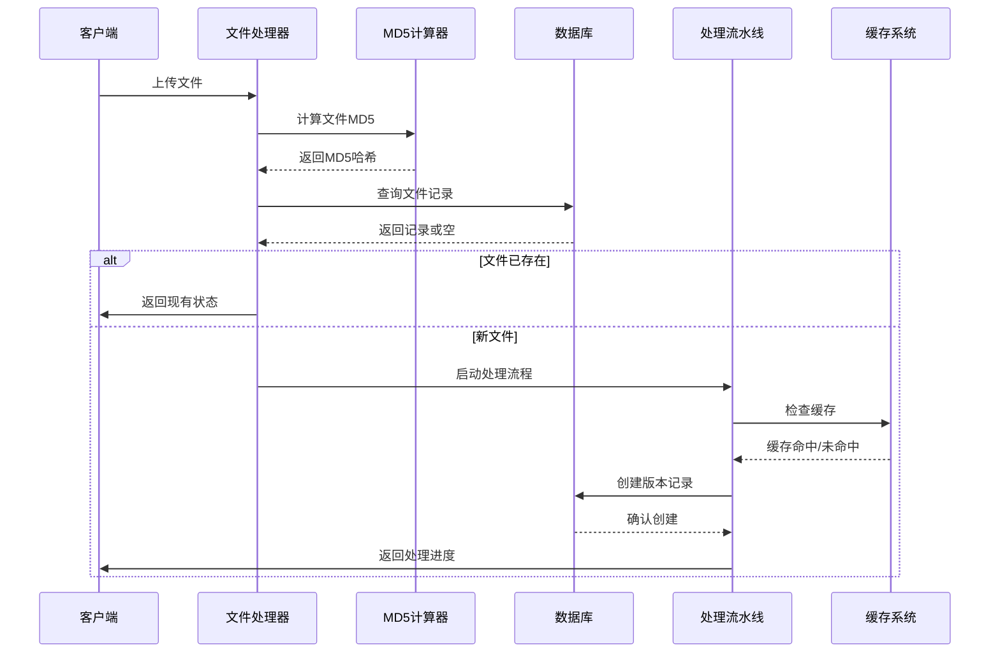

**图表来源**
- [files.go:41-90](file://web/backend/handlers/files.go#L41-L90)
- [md5.go:12-25](file://internal/file/md5.go#L12-L25)
- [pipeline.go:105-158](file://internal/processor/pipeline.go#L105-L158)

## 详细组件分析

### MD5计算实现

#### 文件级MD5计算

文件级MD5计算采用流式处理方式，避免了大文件加载到内存的问题：

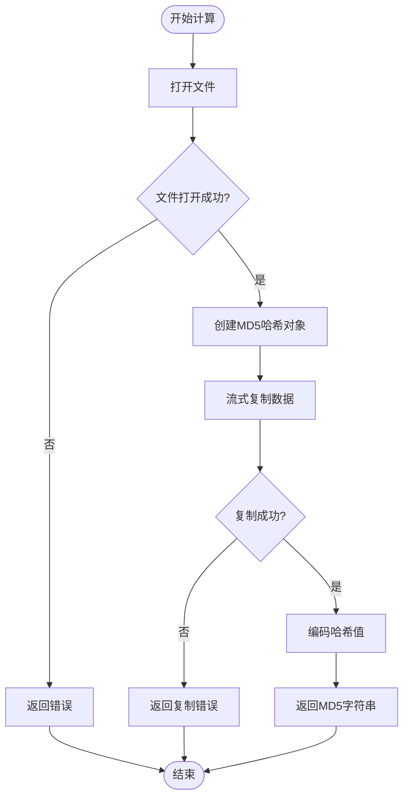

**图表来源**
- [md5.go:12-25](file://internal/file/md5.go#L12-L25)

#### 内容级MD5计算

内容级MD5计算适用于内存中的文本处理：

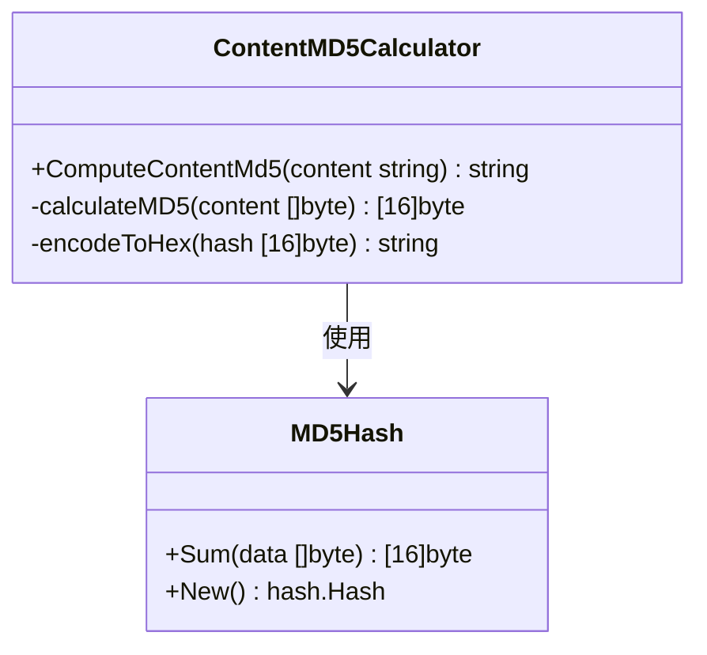

**图表来源**
- [md5.go:27-31](file://internal/file/md5.go#L27-L31)

**章节来源**
- [md5.go:12-31](file://internal/file/md5.go#L12-L31)

### 版本控制系统

版本管理器提供了完整的版本生命周期管理：

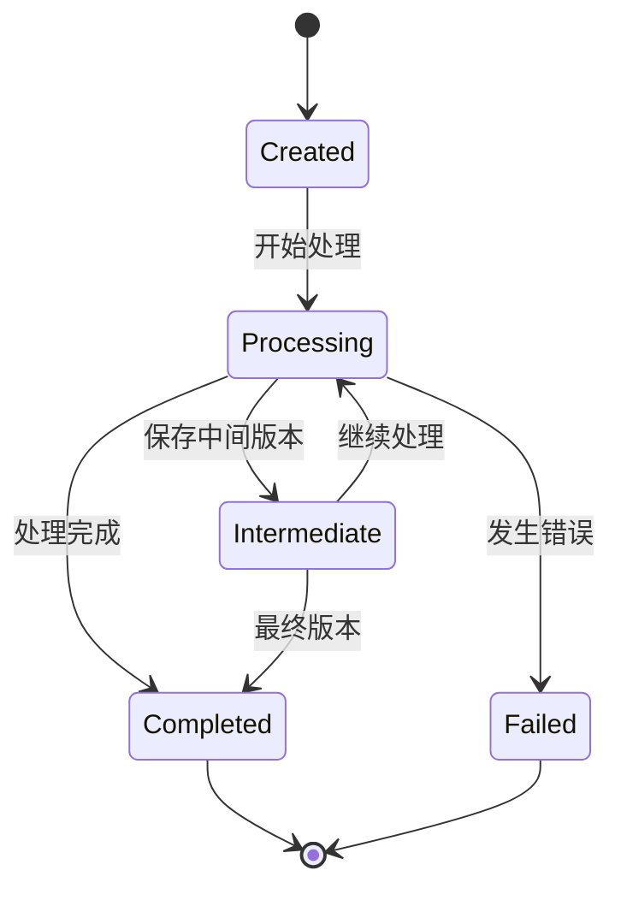

**图表来源**
- [version.go:36-69](file://internal/file/version.go#L36-L69)

**章节来源**
- [version.go:24-240](file://internal/file/version.go#L24-L240)

### 处理流水线集成

MD5校验在处理流水线中的关键节点：

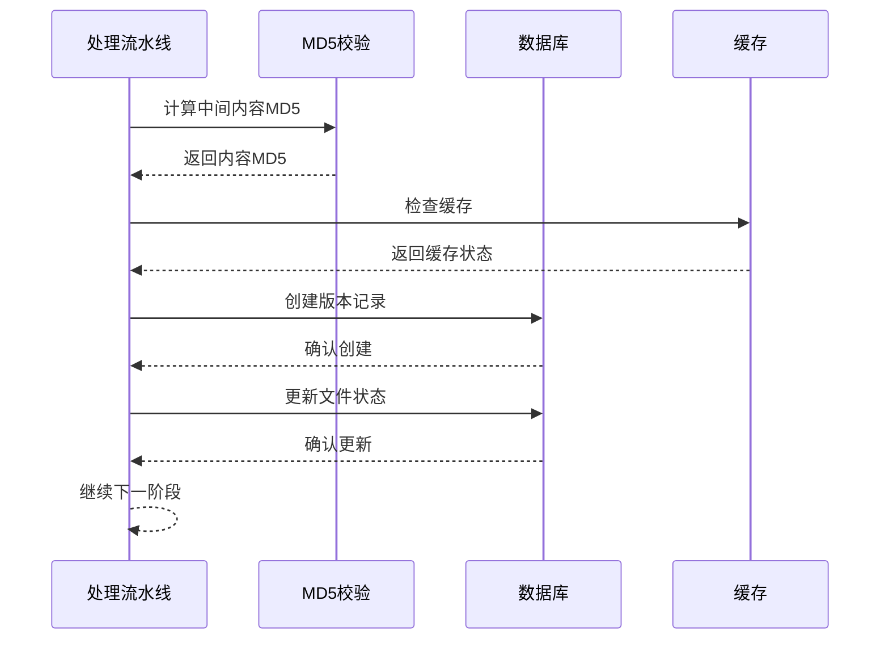

**图表来源**
- [pipeline.go:547-579](file://internal/processor/pipeline.go#L547-L579)

**章节来源**
- [pipeline.go:547-579](file://internal/processor/pipeline.go#L547-L579)

### 并发安全机制

系统采用了多层并发安全措施：

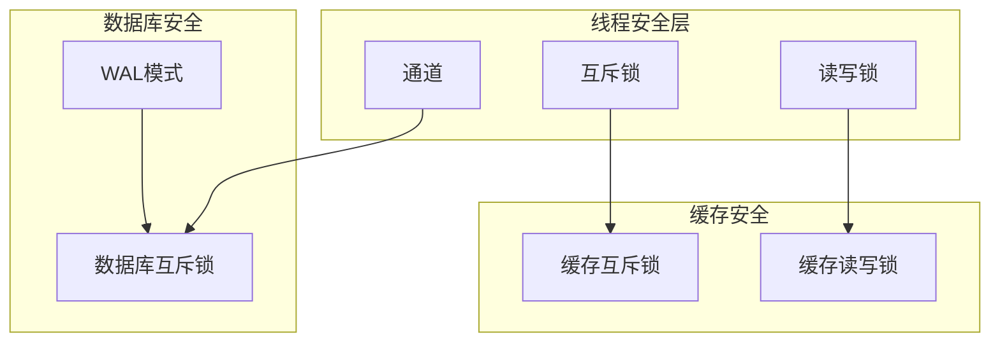

**图表来源**
- [model_repairer.go:534-537](file://internal/processor/model_repairer.go#L534-L537)
- [db.go:29-58](file://internal/database/db.go#L29-L58)

**章节来源**
- [model_repairer.go:534-731](file://internal/processor/model_repairer.go#L534-L731)
- [db.go:29-58](file://internal/database/db.go#L29-L58)

## 依赖关系分析

### 核心依赖图

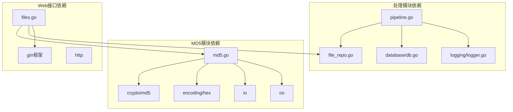

**图表来源**
- [md5.go:3-9](file://internal/file/md5.go#L3-L9)
- [pipeline.go:3-17](file://internal/processor/pipeline.go#L3-L17)
- [files.go:1-20](file://web/backend/handlers/files.go#L1-L20)

### 数据流依赖

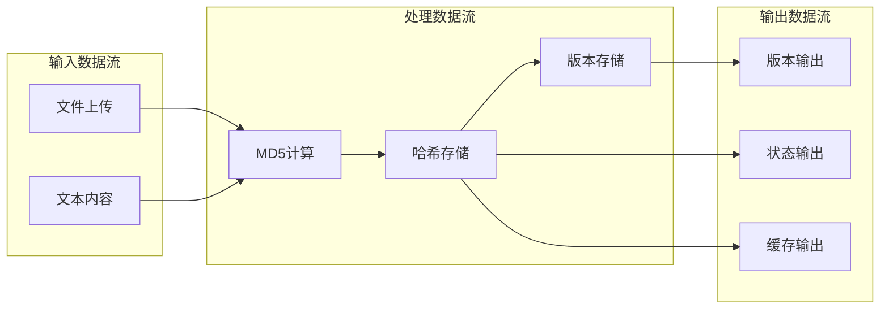

**图表来源**
- [md5.go:12-31](file://internal/file/md5.go#L12-L31)
- [pipeline.go:547-579](file://internal/processor/pipeline.go#L547-L579)

**章节来源**
- [md5.go:3-9](file://internal/file/md5.go#L3-L9)
- [pipeline.go:3-17](file://internal/processor/pipeline.go#L3-L17)
- [files.go:1-20](file://web/backend/handlers/files.go#L1-L20)

## 性能考虑

### 内存管理优化

系统采用了多种内存管理策略：

1. **流式处理**：文件MD5计算使用io.Copy进行流式传输，避免大文件内存占用
2. **缓存机制**：工作池和块缓存减少重复计算
3. **连接池**：数据库连接池优化数据库访问性能

### 并发性能优化

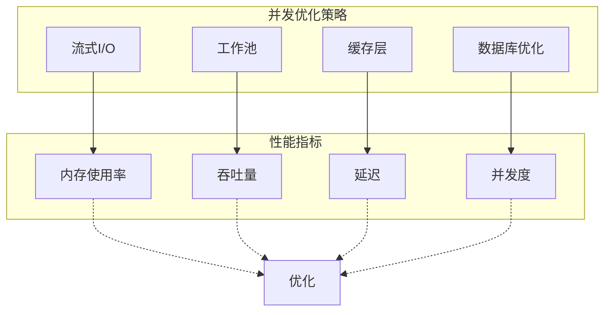

**图表来源**
- [model_repairer.go:547-563](file://internal/processor/model_repairer.go#L547-L563)
- [db.go:29-58](file://internal/database/db.go#L29-L58)

**章节来源**
- [model_repairer.go:547-731](file://internal/processor/model_repairer.go#L547-L731)
- [db.go:29-58](file://internal/database/db.go#L29-L58)

## 故障排除指南

### 常见错误类型

| 错误类型 | 描述 | 处理方案 |
|---------|------|----------|
| 文件打开失败 | 文件不存在或权限不足 | 检查文件路径和权限 |
| 计算MD5失败 | I/O错误或数据损坏 | 重新计算或检查数据源 |
| 缓存查询失败 | 数据库连接问题 | 检查数据库状态 |
| 版本创建失败 | 数据库约束冲突 | 检查唯一性约束 |

### 错误恢复机制

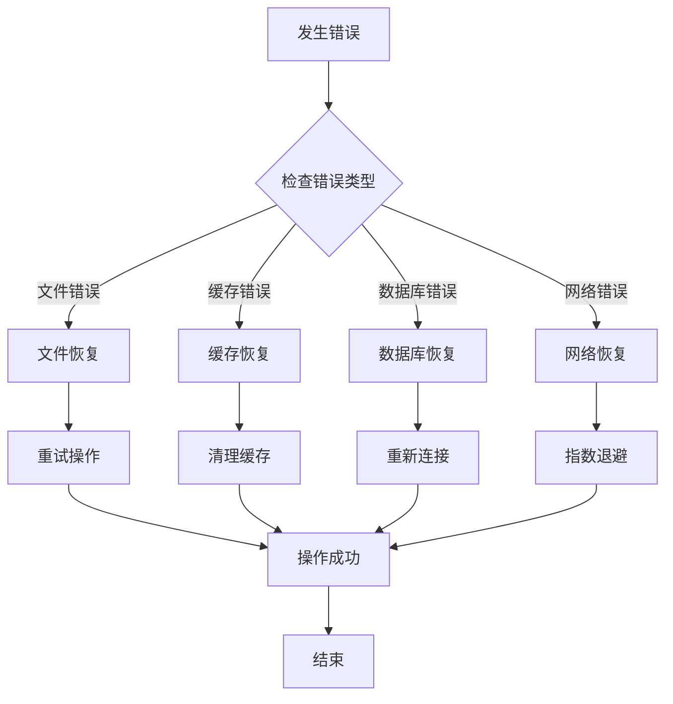

**图表来源**
- [model_repairer.go:232-249](file://internal/processor/model_repairer.go#L232-L249)
- [logger.go:144-163](file://internal/logging/logger.go#L144-L163)

**章节来源**
- [model_repairer.go:232-319](file://internal/processor/model_repairer.go#L232-L319)
- [logger.go:144-250](file://internal/logging/logger.go#L144-L250)

### 日志记录策略

系统提供了完整的日志记录机制：

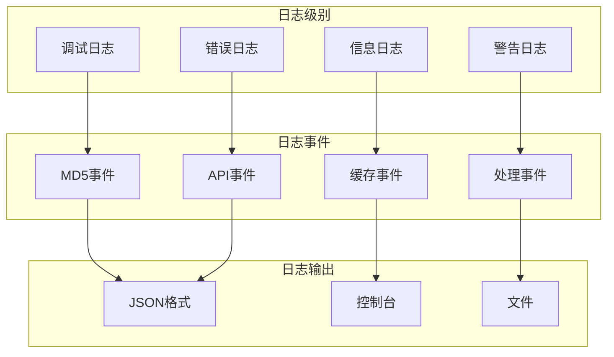

**图表来源**
- [logger.go:12-44](file://internal/logging/logger.go#L12-L44)
- [logger.go:68-141](file://internal/logging/logger.go#L68-L141)

**章节来源**
- [logger.go:12-250](file://internal/logging/logger.go#L12-L250)

## 结论

MD5校验系统通过精心设计的架构和实现，为txtCleaning项目提供了可靠、高效的文件完整性验证和版本控制能力。系统的主要优势包括：

1. **可靠性**：基于标准MD5算法，确保哈希计算的准确性
2. **性能**：采用流式处理和缓存机制，优化大文件处理性能
3. **安全性**：多层并发安全机制，确保数据一致性
4. **可维护性**：清晰的模块划分和完整的测试覆盖
5. **可观测性**：全面的日志记录和监控机制

该系统为文件去重、版本控制和完整性验证提供了坚实的技术基础，是txtCleaning项目的重要组成部分。

## 附录

### 测试策略

系统采用了多层次的测试策略：

1. **单元测试**：针对MD5计算函数的正确性验证
2. **集成测试**：验证MD5与处理流水线的集成
3. **性能测试**：评估大文件处理性能
4. **并发测试**：验证多线程环境下的稳定性

### 配置选项

| 配置项 | 类型 | 默认值 | 描述 |
|--------|------|--------|------|
| ENABLE_MD5_CACHE | bool | true | 是否启用MD5缓存 |
| MD5_CACHE_TTL | int | 3600 | 缓存过期时间(秒) |
| MAX_CONCURRENT_MD5 | int | 10 | 最大并发MD5计算数 |
| MD5_BUFFER_SIZE | int | 65536 | MD5计算缓冲区大小 |

### 监控指标

系统监控的关键指标包括：

- MD5计算成功率
- 缓存命中率
- 处理延迟分布
- 错误率统计
- 资源使用情况