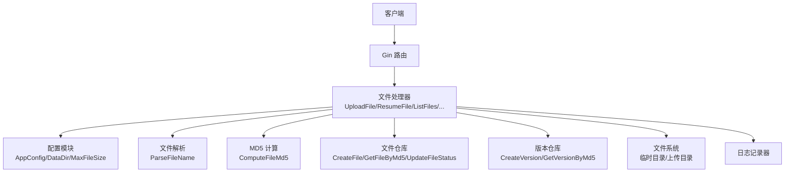
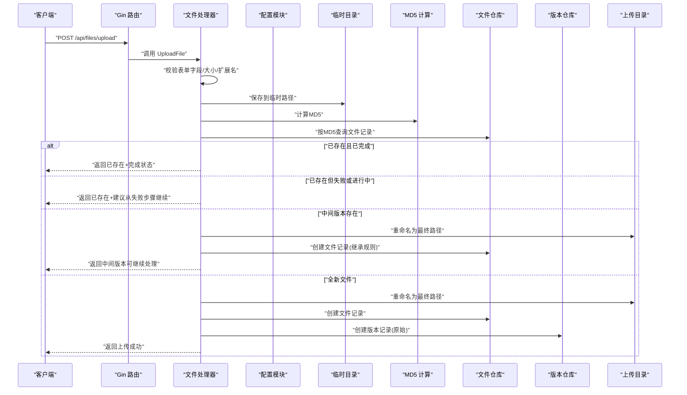
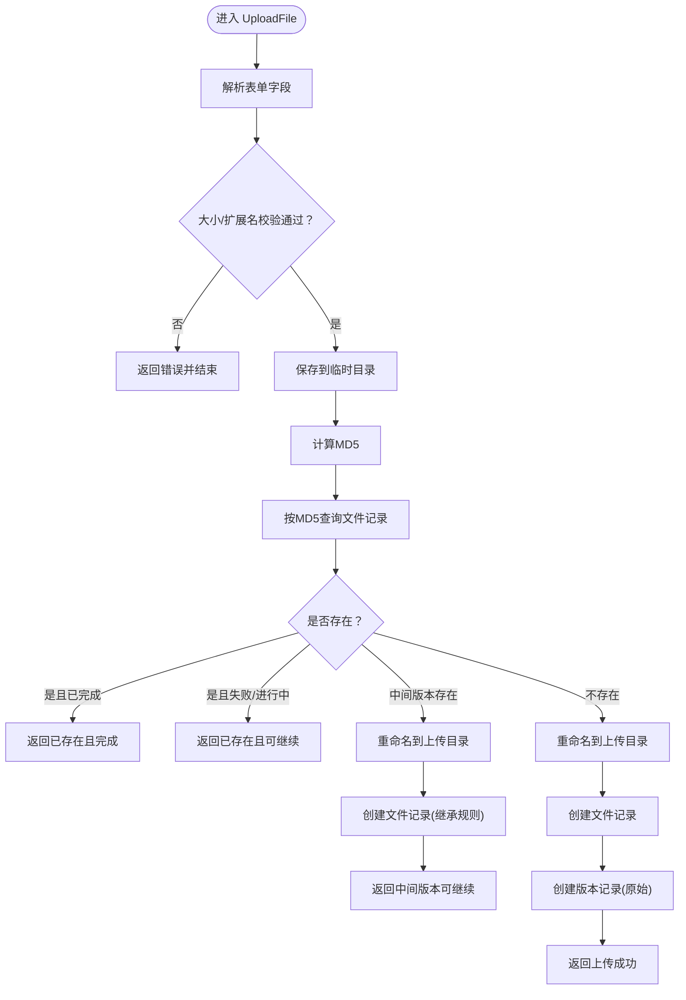
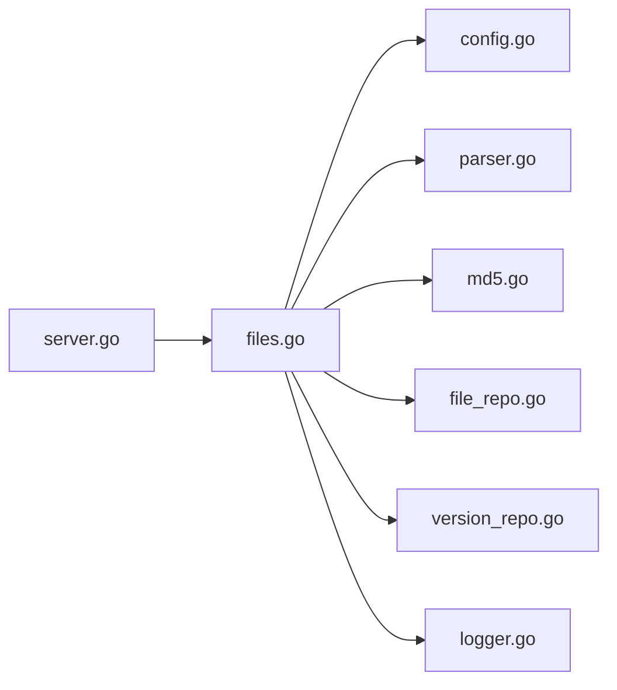

# 文件上传机制

<cite>
**本文引用的文件**
- [web/backend/handlers/files.go](file://web/backend/handlers/files.go)
- [internal/file/parser.go](file://internal/file/parser.go)
- [internal/file/md5.go](file://internal/file/md5.go)
- [internal/database/file_repo.go](file://internal/database/file_repo.go)
- [internal/database/version_repo.go](file://internal/database/version_repo.go)
- [internal/config/config.go](file://internal/config/config.go)
- [web/backend/server.go](file://web/backend/server.go)
- [internal/logging/logger.go](file://internal/logging/logger.go)
</cite>

## 目录
1. [简介](#简介)
2. [项目结构](#项目结构)
3. [核心组件](#核心组件)
4. [架构总览](#架构总览)
5. [详细组件分析](#详细组件分析)
6. [依赖分析](#依赖分析)
7. [性能考量](#性能考量)
8. [故障排查指南](#故障排查指南)
9. [结论](#结论)
10. [附录](#附录)

## 简介
本文件针对 VoidText 的文件上传机制进行系统性技术文档化，覆盖从 HTTP 请求接入、请求验证与文件接收、格式与大小限制、编码处理、文件命名规则与解析、存储策略与临时文件管理、安全与防护、错误处理与重试、性能优化与并发、以及监控与日志记录等全链路细节。目标是帮助开发者与运维人员快速理解并维护上传子系统。

## 项目结构
文件上传功能由后端 Web 层、业务处理器、文件解析与校验、数据库持久化、配置与日志模块协同完成。关键入口为 Gin 路由注册，核心处理函数位于文件处理器中，数据模型与持久化在数据库仓库层，文件解析与 MD5 计算在内部工具模块，配置与目录结构在配置模块，日志在独立的日志模块。

图表来源
- [web/backend/server.go:28-54](file://web/backend/server.go#L28-L54)
- [web/backend/handlers/files.go:18-71](file://web/backend/handlers/files.go#L18-L71)
- [internal/config/config.go:115-119](file://internal/config/config.go#L115-L119)

章节来源
- [web/backend/server.go:10-57](file://web/backend/server.go#L10-L57)
- [web/backend/handlers/files.go:1-393](file://web/backend/handlers/files.go#L1-L393)
- [internal/config/config.go:14-122](file://internal/config/config.go#L14-L122)

## 核心组件
- HTTP 入口与路由：在后端服务中注册 /api/files/upload 等端点，使用 Gin 中间件处理跨域与静态资源。
- 文件处理器：实现上传、恢复、列出、查询、下载、删除、规则更新等操作；核心上传逻辑集中在 UploadFile。
- 文件解析器：从文件名中提取作者与标题，支持多分隔符配置。
- MD5 工具：计算文件内容与文本内容的 MD5 值，用于去重与唯一标识。
- 数据库仓库：文件记录与版本记录的增删改查，支撑重复检测、中间版本恢复与状态追踪。
- 配置模块：定义数据目录、最大文件大小、名称分隔符等运行时参数，并确保必要目录存在。
- 日志模块：统一结构化日志输出，便于监控与问题定位。

章节来源
- [web/backend/server.go:28-54](file://web/backend/server.go#L28-L54)
- [web/backend/handlers/files.go:18-71](file://web/backend/handlers/files.go#L18-L71)
- [internal/file/parser.go:16-47](file://internal/file/parser.go#L16-L47)
- [internal/file/md5.go:11-31](file://internal/file/md5.go#L11-L31)
- [internal/database/file_repo.go:28-168](file://internal/database/file_repo.go#L28-L168)
- [internal/database/version_repo.go:20-98](file://internal/database/version_repo.go#L20-L98)
- [internal/config/config.go:14-122](file://internal/config/config.go#L14-L122)
- [internal/logging/logger.go:68-250](file://internal/logging/logger.go#L68-L250)

## 架构总览
文件上传的端到端流程如下：

图表来源
- [web/backend/server.go:30](file://web/backend/server.go#L30)
- [web/backend/handlers/files.go:18-71](file://web/backend/handlers/files.go#L18-L71)
- [internal/config/config.go:75](file://internal/config/config.go#L75)
- [internal/file/md5.go:11-25](file://internal/file/md5.go#L11-L25)
- [internal/database/file_repo.go:28-47](file://internal/database/file_repo.go#L28-L47)
- [internal/database/version_repo.go:20-33](file://internal/database/version_repo.go#L20-L33)

## 详细组件分析

### HTTP 处理与路由
- 路由注册：在 /api 下挂载文件相关端点，包括上传、列表、详情、内容、下载、删除、恢复、规则更新等。
- CORS 配置：允许本地开发域名与凭证传递，保障前端跨域访问。
- 静态资源：提供前端页面与静态资源访问。

章节来源
- [web/backend/server.go:10-57](file://web/backend/server.go#L10-L57)

### 上传处理流程（UploadFile）
- 表单解析：从 multipart 表单获取文件字段，失败则返回错误。
- 规格校验：检查文件大小上限与扩展名（仅 .txt）。
- 临时落盘：将上传文件保存至 DataDir/temp 下的临时路径。
- 去重与重复处理：
  - 计算 MD5；
  - 按 MD5 查询文件记录；
  - 若已完成：返回“已存在且完成”；
  - 若失败或进行中：返回“已存在且可从失败步骤继续”；
  - 若中间版本存在：将临时文件重命名为最终路径，创建文件记录并返回“可继续中间版本处理”；
  - 否则：创建新记录与版本记录，返回“上传成功”。

图表来源
- [web/backend/handlers/files.go:18-71](file://web/backend/handlers/files.go#L18-L71)
- [internal/file/md5.go:11-25](file://internal/file/md5.go#L11-L25)
- [internal/database/file_repo.go:28-47](file://internal/database/file_repo.go#L28-L47)
- [internal/database/version_repo.go:20-33](file://internal/database/version_repo.go#L20-L33)

章节来源
- [web/backend/handlers/files.go:18-71](file://web/backend/handlers/files.go#L18-L71)

### 请求验证与文件接收逻辑
- 字段与大小：通过框架内置能力获取文件对象并判断大小是否超过 MaxFileSize。
- 扩展名限制：严格限定为 .txt。
- 临时文件命名：以纳秒时间戳前缀 + 原始文件名组合，降低冲突概率。
- 保存策略：先写入临时目录，再根据业务逻辑决定是否移动到上传目录，失败时清理临时文件。

章节来源
- [web/backend/handlers/files.go:19-42](file://web/backend/handlers/files.go#L19-L42)
- [internal/config/config.go:75](file://internal/config/config.go#L75)

### 支持的文件格式、大小限制与编码处理
- 文件格式：仅支持 .txt 文本文件。
- 大小限制：来自配置项 MAX_FILE_SIZE（字节），默认 100MB。
- 编码处理：上传阶段不强制转换编码；后续处理流程中包含编码相关的预处理模块，可在处理管线中统一处理编码问题。

章节来源
- [web/backend/handlers/files.go:32-35](file://web/backend/handlers/files.go#L32-L35)
- [internal/config/config.go:75](file://internal/config/config.go#L75)

### 文件命名规则与解析逻辑
- 命名规则：上传目录中的文件名采用 “md5_原始文件名”的形式，便于唯一标识与检索。
- 名称解析：从文件名中提取作者与标题，依据配置的 NameSeparators 列表尝试分割，长度在合理范围内的部分被判定为作者名候选，若无法明确则将前半部分作为作者、后半部分作为标题。
- 用途：解析结果写入文件记录的 Author 与 Title 字段，便于展示与检索。

章节来源
- [web/backend/handlers/files.go:158-176](file://web/backend/handlers/files.go#L158-L176)
- [internal/file/parser.go:16-47](file://internal/file/parser.go#L16-L47)
- [internal/config/config.go:95](file://internal/config/config.go#L95)

### 文件存储策略与临时文件管理
- 目录结构：由配置确保 DataDir、DataDir/uploads、DataDir/backups、DataDir/temp 存在。
- 临时文件：上传后先写入 DataDir/temp，随后根据业务分支决定是否移动到 DataDir/uploads。
- 最终文件：采用 “md5_原始文件名” 命名，避免同名冲突。
- 清理策略：当检测到重复或中间版本场景时，若出现异常会删除临时文件，保证磁盘空间不被占用。

章节来源
- [internal/config/config.go:115-119](file://internal/config/config.go#L115-L119)
- [web/backend/handlers/files.go:37-42](file://web/backend/handlers/files.go#L37-L42)
- [web/backend/handlers/files.go:117-122](file://web/backend/handlers/files.go#L117-L122)
- [web/backend/handlers/files.go:158-164](file://web/backend/handlers/files.go#L158-L164)

### 安全考虑与防护措施
- 输入约束：仅接受 .txt 文件，限制文件大小，减少恶意文件与资源滥用风险。
- 临时文件隔离：上传先写入临时目录，避免与最终目录产生竞争与脏数据。
- 去重与幂等：基于 MD5 去重，重复上传返回明确状态，避免重复处理与存储浪费。
- 路由与权限：当前路由未设置鉴权中间件，建议在生产环境中增加认证与授权控制。

章节来源
- [web/backend/handlers/files.go:26-35](file://web/backend/handlers/files.go#L26-L35)
- [web/backend/handlers/files.go:44-68](file://web/backend/handlers/files.go#L44-L68)

### 错误处理与重试机制
- 错误分类：
  - 参数错误：表单字段缺失、大小超限、扩展名不符。
  - 保存失败：临时保存或重命名失败。
  - 查询失败：数据库查询或记录创建失败。
- 返回策略：统一返回 JSON，包含 success、message、必要时携带 md5、状态等上下文。
- 重试建议：对于“可继续处理”的场景，建议前端引导用户调用恢复接口；对于失败场景，建议前端显示失败原因与建议步骤。

章节来源
- [web/backend/handlers/files.go:21-41](file://web/backend/handlers/files.go#L21-L41)
- [web/backend/handlers/files.go:74-111](file://web/backend/handlers/files.go#L74-L111)
- [web/backend/handlers/files.go:113-155](file://web/backend/handlers/files.go#L113-L155)
- [web/backend/handlers/files.go:157-198](file://web/backend/handlers/files.go#L157-L198)

### 性能优化与并发处理
- 并发模型：当前上传处理为同步阻塞模式，适合中小规模并发。
- 优化建议：
  - 引入异步任务队列（如消息队列）将“创建记录与版本”放入后台处理，提升吞吐量。
  - 对大文件上传支持断点续传与分片上传，结合临时目录与去重策略。
  - 使用连接池与合理的数据库索引（按 md5、状态、创建时间）提升查询性能。
  - 在网关层限制并发与速率，防止突发流量压垮后端。

章节来源
- [web/backend/handlers/files.go:18-71](file://web/backend/handlers/files.go#L18-L71)
- [internal/database/file_repo.go:49-68](file://internal/database/file_repo.go#L49-L68)
- [internal/database/version_repo.go:35-53](file://internal/database/version_repo.go#L35-L53)

### 监控与日志记录方案
- 日志结构：统一结构化 JSON 输出，包含时间、级别、事件、调用者、上下文等字段。
- 关键事件：
  - 上传开始/结束、MD5 计算、重复检测、中间版本处理、状态变更、规则更新、下载、删除等。
  - 可扩展：在上传流程的关键节点埋点，记录耗时、错误类型、文件 MD5、调用栈等。
- 建议指标：QPS、P95/P99 延迟、错误率、磁盘使用、数据库慢查询、队列积压等。

章节来源
- [internal/logging/logger.go:68-250](file://internal/logging/logger.go#L68-L250)
- [web/backend/handlers/files.go:18-71](file://web/backend/handlers/files.go#L18-L71)

## 依赖分析
- 组件耦合：
  - 文件处理器依赖配置模块（DataDir、MaxFileSize）、文件解析器（ParseFileName）、MD5 工具（ComputeFileMd5）、数据库仓库（文件/版本）。
  - 路由层仅负责请求转发，保持低耦合。
- 外部依赖：
  - Gin 框架、数据库驱动、godotenv（加载 .env）。
- 潜在循环依赖：当前模块间为单向依赖，未见循环。

图表来源
- [web/backend/server.go:7](file://web/backend/server.go#L7)
- [web/backend/handlers/files.go:13-15](file://web/backend/handlers/files.go#L13-L15)
- [internal/config/config.go:14](file://internal/config/config.go#L14)
- [internal/file/parser.go:3](file://internal/file/parser.go#L3)
- [internal/file/md5.go:3](file://internal/file/md5.go#L3)
- [internal/database/file_repo.go:3](file://internal/database/file_repo.go#L3)
- [internal/database/version_repo.go:3](file://internal/database/version_repo.go#L3)
- [internal/logging/logger.go:3](file://internal/logging/logger.go#L3)

章节来源
- [web/backend/server.go:10-57](file://web/backend/server.go#L10-L57)
- [web/backend/handlers/files.go:1-393](file://web/backend/handlers/files.go#L1-L393)

## 性能考量
- IO 与 CPU：
  - 上传阶段主要为磁盘 IO；MD5 计算为 CPU 密集型，建议在高并发场景下限制同时计算数量。
  - 临时目录与最终目录在同一文件系统上可减少跨盘移动成本。
- 数据库：
  - 建议为 files.md5、versions.version_md5、versions.original_md5 建立索引，加速重复检测与版本查询。
- 网络与带宽：
  - 对于大文件，建议引入 CDN 或分片上传，配合断点续传与进度上报。
- 内存与 GC：
  - 上传流式处理，避免一次性将大文件读入内存；MD5 计算采用流式拷贝，降低内存峰值。

## 故障排查指南
- 常见错误与定位：
  - 获取文件失败：检查表单字段名是否为 file，确认前端正确提交 multipart/form-data。
  - 文件大小超限：调整 MAX_FILE_SIZE，或提示用户压缩文件。
  - 扩展名不符：确保文件为 .txt。
  - 保存失败：检查 DataDir 及其子目录权限，确认磁盘空间充足。
  - 查询/创建记录失败：检查数据库连接与表结构，查看日志中的错误堆栈。
- 日志辅助：
  - 使用结构化日志定位具体文件 MD5、调用者、错误类型与耗时，快速定位问题根因。
- 恢复与重试：
  - 对于“可继续处理”的文件，调用恢复接口重置状态并继续处理。
  - 对于失败文件，前端应展示失败原因与建议步骤，避免盲目重试。

章节来源
- [web/backend/handlers/files.go:21-41](file://web/backend/handlers/files.go#L21-L41)
- [web/backend/handlers/files.go:201-251](file://web/backend/handlers/files.go#L201-L251)
- [internal/logging/logger.go:68-250](file://internal/logging/logger.go#L68-L250)

## 结论
该上传机制以简洁清晰的流程实现了 .txt 文件的接收、去重、命名与持久化，并提供了中间版本恢复与状态追踪能力。通过配置模块统一管理运行参数，日志模块提供结构化可观测性。建议在生产环境中补充鉴权、限流、异步处理与断点续传能力，以进一步提升安全性、稳定性与吞吐能力。

## 附录
- API 端点概览（与上传相关）：
  - POST /api/files/upload：上传 .txt 文件
  - GET /api/files/{md5}/resume：恢复处理
  - GET /api/files：列出文件
  - GET /api/files/{md5}：获取文件详情
  - GET /api/files/{md5}/content：获取文件内容
  - GET /api/files/{md5}/download：下载文件
  - DELETE /api/files/{md5}：删除文件记录（可选保留文件）
  - PUT /api/files/{md5}/rules：更新规则配置

章节来源
- [web/backend/server.go:28-54](file://web/backend/server.go#L28-L54)