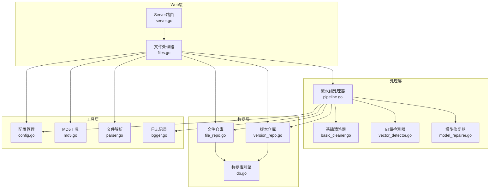
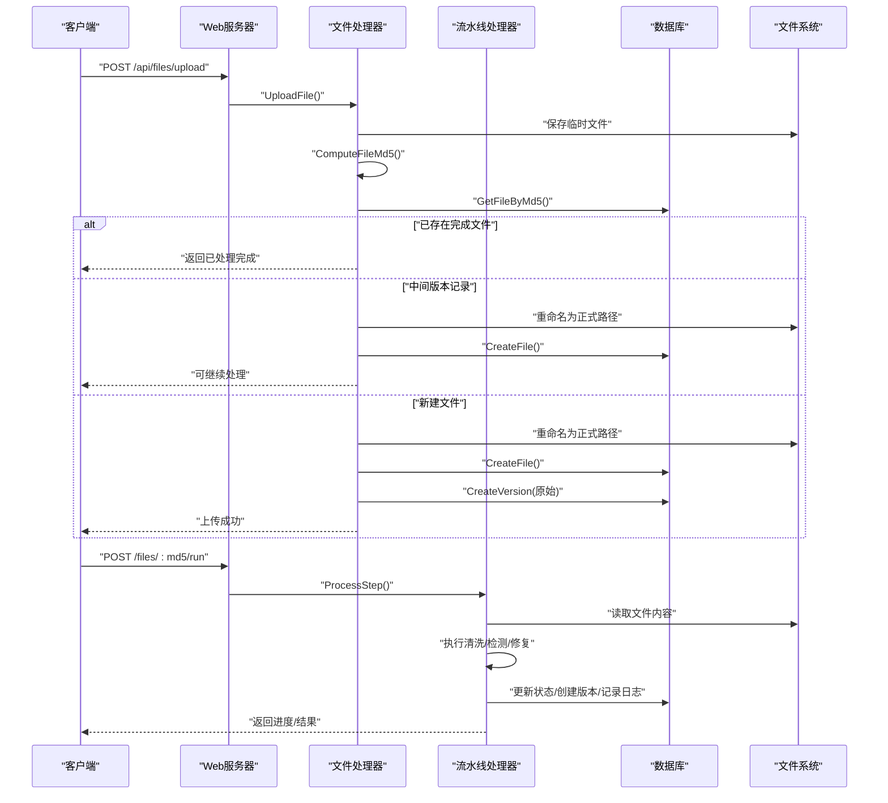
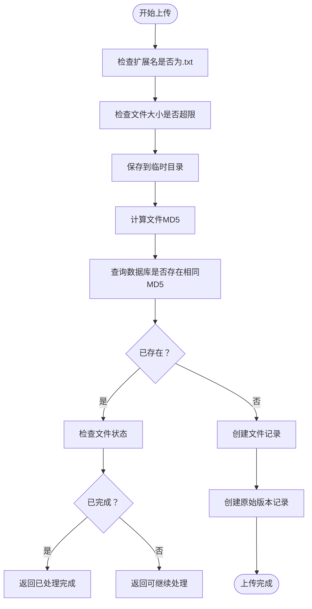
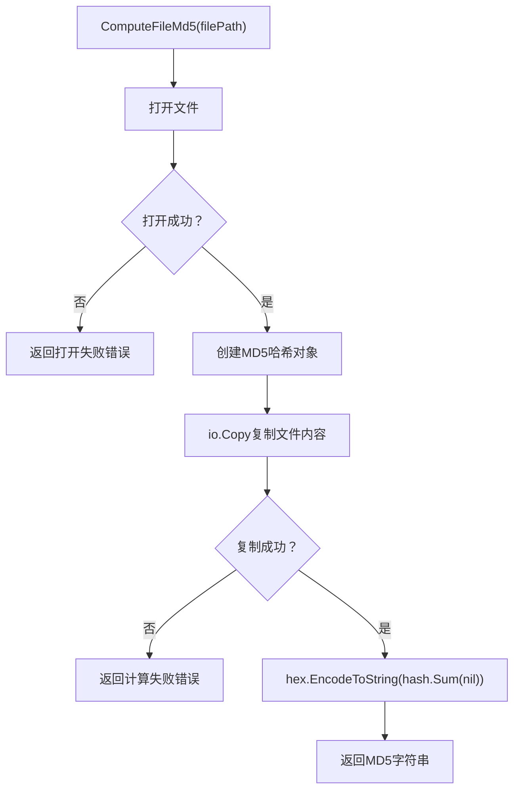
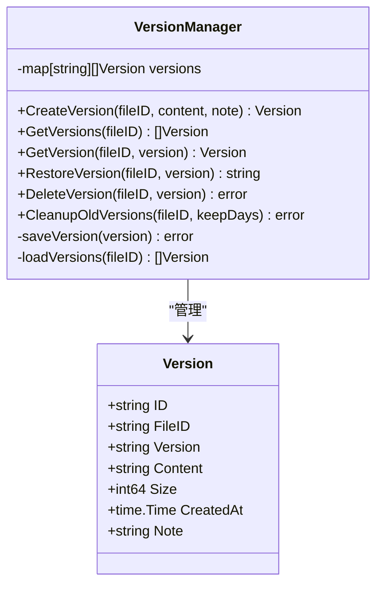
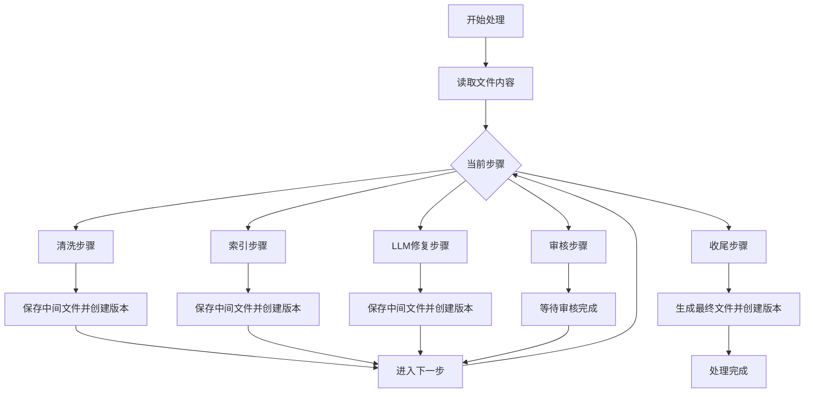
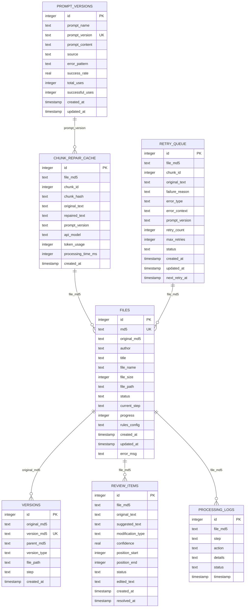
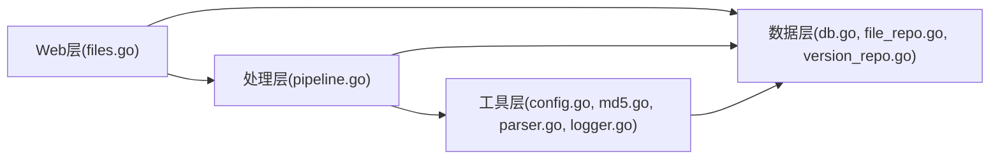

# 文件处理系统

<cite>
**本文档引用的文件**
- [parser.go](file://internal/file/parser.go)
- [md5.go](file://internal/file/md5.go)
- [version.go](file://internal/file/version.go)
- [files.go](file://web/backend/handlers/files.go)
- [pipeline.go](file://internal/processor/pipeline.go)
- [config.go](file://internal/config/config.go)
- [file_repo.go](file://internal/database/file_repo.go)
- [version_repo.go](file://internal/database/version_repo.go)
- [model_repairer.go](file://internal/processor/model_repairer.go)
- [server.go](file://web/backend/server.go)
- [db.go](file://internal/database/db.go)
- [logger.go](file://internal/logging/logger.go)
- [basic_cleaner.go](file://internal/processor/basic_cleaner.go)
- [vector_detector.go](file://internal/processor/vector_detector.go)
</cite>

## 目录
1. [简介](#简介)
2. [项目结构](#项目结构)
3. [核心组件](#核心组件)
4. [架构总览](#架构总览)
5. [详细组件分析](#详细组件分析)
6. [依赖关系分析](#依赖关系分析)
7. [性能考量](#性能考量)
8. [故障排除指南](#故障排除指南)
9. [结论](#结论)
10. [附录](#附录)

## 简介
本文件处理系统基于Go语言实现，提供完整的文本文件上传、解析、清洗、修复、审核与版本管理功能。系统采用模块化设计，包含文件上传与解析、MD5校验、版本管理、流水线处理、数据库持久化、日志监控与错误恢复等核心能力。系统支持单一格式（.txt）文件处理，具备断点续传、缓存幂等性、并发处理与自进化监控等高级特性。

## 项目结构
系统采用分层架构：
- Web层：Gin框架提供REST API，负责文件上传、状态查询、审核操作等
- 处理层：流水线处理器协调各处理步骤（清洗、向量检测、LLM修复、审核、收尾）
- 数据层：SQLite数据库存储文件元数据、版本记录、审核项、处理日志与缓存
- 工具层：文件解析、MD5计算、日志记录、配置管理等

**图表来源**
- [server.go:10-57](file://web/backend/server.go#L10-L57)
- [files.go:18-71](file://web/backend/handlers/files.go#L18-L71)
- [pipeline.go:104-158](file://internal/processor/pipeline.go#L104-L158)
- [basic_cleaner.go:31-51](file://internal/processor/basic_cleaner.go#L31-L51)
- [vector_detector.go:36-69](file://internal/processor/vector_detector.go#L36-L69)
- [model_repairer.go:77-122](file://internal/processor/model_repairer.go#L77-L122)
- [db.go:15-69](file://internal/database/db.go#L15-L69)
- [file_repo.go:28-47](file://internal/database/file_repo.go#L28-L47)
- [version_repo.go:20-33](file://internal/database/version_repo.go#L20-L33)
- [config.go:48-122](file://internal/config/config.go#L48-L122)
- [md5.go:11-25](file://internal/file/md5.go#L11-L25)
- [parser.go:16-41](file://internal/file/parser.go#L16-L41)
- [logger.go:68-141](file://internal/logging/logger.go#L68-L141)

**章节来源**
- [server.go:10-57](file://web/backend/server.go#L10-L57)
- [files.go:18-71](file://web/backend/handlers/files.go#L18-L71)
- [pipeline.go:104-158](file://internal/processor/pipeline.go#L104-L158)
- [db.go:15-69](file://internal/database/db.go#L15-L69)

## 核心组件
- 文件上传与解析：接收.txt文件，计算MD5，解析文件名，创建文件记录，支持中间版本识别与断点续传
- MD5校验：文件级与内容级MD5计算，用于去重、版本追踪与缓存命中
- 版本管理：内存+磁盘混合存储，支持版本创建、查询、恢复、删除与清理
- 流水线处理：五步式处理流程（清洗、索引、LLM修复、审核、收尾），支持进度计算与状态更新
- 数据库持久化：SQLite表结构覆盖文件、版本、审核项、处理日志、块缓存与重试队列
- 日志与监控：结构化日志记录，包含缓存命中、Worker池状态、提示词使用、错误阈值监控

**章节来源**
- [files.go:18-71](file://web/backend/handlers/files.go#L18-L71)
- [md5.go:11-31](file://internal/file/md5.go#L11-L31)
- [version.go:24-88](file://internal/file/version.go#L24-L88)
- [pipeline.go:19-102](file://internal/processor/pipeline.go#L19-L102)
- [db.go:89-222](file://internal/database/db.go#L89-L222)
- [logger.go:68-250](file://internal/logging/logger.go#L68-L250)

## 架构总览
系统采用“请求-处理-持久化-反馈”的闭环架构。Web层接收请求并调用处理层，处理层根据配置与规则执行多阶段处理，期间通过数据库与文件系统进行状态与数据持久化，同时记录结构化日志用于监控与审计。

**图表来源**
- [files.go:18-71](file://web/backend/handlers/files.go#L18-L71)
- [pipeline.go:104-158](file://internal/processor/pipeline.go#L104-L158)
- [file_repo.go:28-47](file://internal/database/file_repo.go#L28-L47)
- [version_repo.go:20-33](file://internal/database/version_repo.go#L20-L33)

## 详细组件分析

### 文件上传与解析
- 支持的格式：仅.txt文件
- 大小限制：通过配置项控制，默认100MB
- 文件名解析：根据配置的分隔符列表从文件名中提取作者与标题
- MD5校验：上传后计算文件MD5，用于去重与版本追踪
- 中间版本识别：若检测到同MD5的中间版本记录，则允许从失败步骤继续处理
- 断点续传：通过中间版本记录与文件状态实现

**图表来源**
- [files.go:18-71](file://web/backend/handlers/files.go#L18-L71)
- [parser.go:16-41](file://internal/file/parser.go#L16-L41)
- [md5.go:11-25](file://internal/file/md5.go#L11-L25)

**章节来源**
- [files.go:18-71](file://web/backend/handlers/files.go#L18-L71)
- [parser.go:16-41](file://internal/file/parser.go#L16-L41)
- [config.go:75-76](file://internal/config/config.go#L75-L76)

### MD5校验实现
- 文件级MD5：读取文件内容并计算，用于去重与版本追踪
- 内容级MD5：对文本内容计算，用于中间版本与最终版本的唯一标识
- 错误处理：文件打开失败、计算失败均有明确错误返回

**图表来源**
- [md5.go:11-25](file://internal/file/md5.go#L11-L25)

**章节来源**
- [md5.go:11-31](file://internal/file/md5.go#L11-L31)

### 版本管理系统
- 版本类型：原始版本、中间版本、最终版本
- 存储策略：内存缓存+磁盘备份（JSON文件），支持按文件ID检索与过滤
- 版本创建：自动生成版本号，记录内容MD5、大小、创建时间与备注
- 版本恢复：支持恢复到指定版本并创建恢复版本
- 版本清理：按天数清理旧版本，删除对应磁盘文件

**图表来源**
- [version.go:13-69](file://internal/file/version.go#L13-L69)

**章节来源**
- [version.go:24-178](file://internal/file/version.go#L24-L178)
- [version_repo.go:8-33](file://internal/database/version_repo.go#L8-L33)

### 流水线处理逻辑
- 步骤定义：清洗、索引、LLM修复、审核、收尾
- 进度计算：每个步骤贡献20%，结合步骤内进度计算总体进度
- 失败处理：捕获异常并更新文件状态为失败，记录处理日志
- 中间文件：每步处理后保存中间文件并创建版本记录
- 最终文件：收集审核项变更，生成最终文件并创建最终版本

**图表来源**
- [pipeline.go:19-102](file://internal/processor/pipeline.go#L19-L102)
- [pipeline.go:160-213](file://internal/processor/pipeline.go#L160-L213)
- [pipeline.go:215-271](file://internal/processor/pipeline.go#L215-L271)
- [pipeline.go:273-376](file://internal/processor/pipeline.go#L273-L376)
- [pipeline.go:436-468](file://internal/processor/pipeline.go#L436-L468)
- [pipeline.go:470-522](file://internal/processor/pipeline.go#L470-L522)

**章节来源**
- [pipeline.go:104-158](file://internal/processor/pipeline.go#L104-L158)
- [pipeline.go:547-579](file://internal/processor/pipeline.go#L547-L579)

### 数据库设计与持久化
- 表结构：files、versions、review_items、processing_logs、chunk_repair_cache、retry_queue、prompt_versions
- 索引优化：针对常用查询建立索引，提升查询性能
- 并发优化：SQLite启用WAL模式，设置最大连接数为1，保证写入顺序与并发读取
- 事务批处理：建表语句使用事务，确保原子性

**图表来源**
- [db.go:89-222](file://internal/database/db.go#L89-L222)

**章节来源**
- [db.go:15-69](file://internal/database/db.go#L15-L69)
- [file_repo.go:9-26](file://internal/database/file_repo.go#L9-L26)
- [version_repo.go:8-18](file://internal/database/version_repo.go#L8-L18)

### 文件存储策略与命名规则
- 临时文件：保存在数据目录的temp子目录，命名包含时间戳与原文件名
- 正式文件：保存在uploads子目录，命名格式为“md5_原文件名”
- 中间文件：保存在uploads子目录，命名格式为“md5_步骤名.txt”
- 最终文件：生成在uploads子目录，命名格式为“前缀_cleaned_时间戳.txt”，前缀来自作者、标题或ID
- 备份版本：保存在backups子目录，命名格式为“版本ID.json”

**章节来源**
- [files.go:37-42](file://web/backend/handlers/files.go#L37-L42)
- [files.go:158-164](file://web/backend/handlers/files.go#L158-L164)
- [pipeline.go:547-579](file://internal/processor/pipeline.go#L547-L579)

### 错误处理与恢复机制
- 上传阶段：文件大小超限、扩展名不符、保存失败、MD5计算失败、数据库查询失败均有明确错误返回
- 处理阶段：捕获异常并更新文件状态为失败，记录处理日志，支持从失败步骤继续处理
- 恢复机制：ResumeFile接口重置文件状态，支持从失败步骤继续处理
- 缓存与幂等：WorkerPool与ChunkRepairCache实现缓存命中与幂等性，避免重复调用外部API
- 自进化监控：基于错误阈值触发Evolver监控，优化提示词与重试策略

**章节来源**
- [files.go:20-71](file://web/backend/handlers/files.go#L20-L71)
- [pipeline.go:144-157](file://internal/processor/pipeline.go#L144-L157)
- [model_repairer.go:580-632](file://internal/processor/model_repairer.go#L580-L632)
- [logger.go:143-163](file://internal/logging/logger.go#L143-L163)

### 安全考虑与访问控制
- CORS配置：允许指定源域访问，支持跨域请求
- 文件访问：下载接口检查文件是否存在，避免越权访问
- 参数校验：上传接口严格校验文件大小与扩展名
- 敏感信息：日志记录避免泄露敏感信息，错误信息尽量通用化

**章节来源**
- [server.go:14-20](file://web/backend/server.go#L14-L20)
- [files.go:26-35](file://web/backend/handlers/files.go#L26-L35)
- [files.go:304-325](file://web/backend/handlers/files.go#L304-L325)

### 监控与日志记录
- 结构化日志：统一的LogEvent结构，包含时间、级别、事件、上下文等
- 关键事件：缓存命中/未命中、Worker池状态、提示词使用、API错误、重试队列等
- 性能指标：块数量、修改数量、缓存命中率、错误率等
- 调用者追踪：自动记录调用文件与行号，便于问题定位

**章节来源**
- [logger.go:22-37](file://internal/logging/logger.go#L22-L37)
- [model_repairer.go:580-632](file://internal/processor/model_repairer.go#L580-L632)
- [pipeline.go:378-434](file://internal/processor/pipeline.go#L378-L434)

## 依赖关系分析
系统采用清晰的分层依赖：
- Web层依赖处理层与数据库层
- 处理层依赖工具层与数据库层
- 数据库层独立于业务逻辑，提供统一的数据访问接口
- 工具层（配置、MD5、解析、日志）被各层复用

**图表来源**
- [files.go:13-16](file://web/backend/handlers/files.go#L13-L16)
- [pipeline.go:11-17](file://internal/processor/pipeline.go#L11-L17)
- [config.go:48-122](file://internal/config/config.go#L48-L122)
- [md5.go:11-25](file://internal/file/md5.go#L11-L25)
- [parser.go:16-41](file://internal/file/parser.go#L16-L41)
- [logger.go:68-141](file://internal/logging/logger.go#L68-L141)
- [db.go:15-69](file://internal/database/db.go#L15-L69)
- [file_repo.go:28-47](file://internal/database/file_repo.go#L28-L47)
- [version_repo.go:20-33](file://internal/database/version_repo.go#L20-L33)

**章节来源**
- [files.go:13-16](file://web/backend/handlers/files.go#L13-L16)
- [pipeline.go:11-17](file://internal/processor/pipeline.go#L11-L17)

## 性能考量
- 并发处理：WorkerPool并发处理文本块，提升LLM修复吞吐量
- 缓存优化：ChunkRepairCache实现缓存命中与幂等性，减少重复调用
- 数据库优化：SQLite启用WAL模式，设置缓存大小与连接生命周期，提升并发读取性能
- 分块策略：智能分块（1500-2000字符），平衡LLM输入长度与处理效率
- 索引优化：为高频查询建立索引，降低查询延迟

**章节来源**
- [model_repairer.go:547-563](file://internal/processor/model_repairer.go#L547-L563)
- [db.go:29-59](file://internal/database/db.go#L29-L59)
- [db.go:196-201](file://internal/database/db.go#L196-L201)

## 故障排除指南
- 上传失败：检查文件大小与扩展名限制，确认数据目录权限
- 处理失败：查看处理日志，定位具体步骤与错误原因，使用恢复接口从失败步骤继续
- 缓存问题：检查chunk_repair_cache表与磁盘缓存目录，清理异常缓存
- 数据库异常：确认SQLite连接状态，检查WAL模式与索引完整性
- API错误：查看API错误日志，检查提示词版本与重试队列

**章节来源**
- [files.go:20-71](file://web/backend/handlers/files.go#L20-L71)
- [pipeline.go:144-157](file://internal/processor/pipeline.go#L144-L157)
- [logger.go:143-163](file://internal/logging/logger.go#L143-L163)
- [db.go:76-87](file://internal/database/db.go#L76-L87)

## 结论
txtCleaning文件处理系统通过模块化设计实现了完整的文本文件处理闭环，具备高可靠性、可观测性与可扩展性。系统在性能方面采用并发处理与缓存优化，在可靠性方面提供断点续传与自进化监控，在安全性方面通过严格的参数校验与访问控制保障。建议在生产环境中结合监控告警与容量规划，持续优化提示词与处理策略。

## 附录
- 支持的文件格式：.txt
- 编码处理：系统按UTF-8处理文本内容
- 大小限制：默认100MB，可通过配置调整
- 版本管理：支持原始、中间与最终版本，可恢复与清理
- 存储策略：临时文件、正式文件、中间文件与备份版本分类存储
- 错误处理：统一错误返回与日志记录，支持恢复与重试
- 安全考虑：CORS配置、参数校验、文件存在性检查
- 监控日志：结构化日志记录，涵盖缓存、性能与错误指标