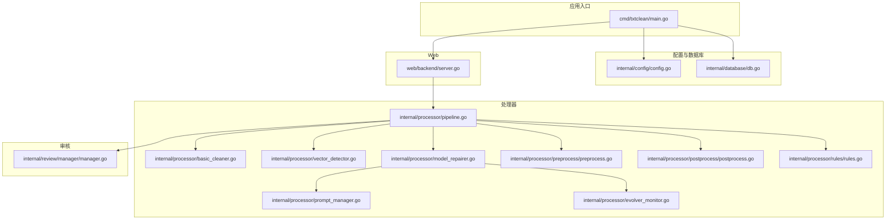
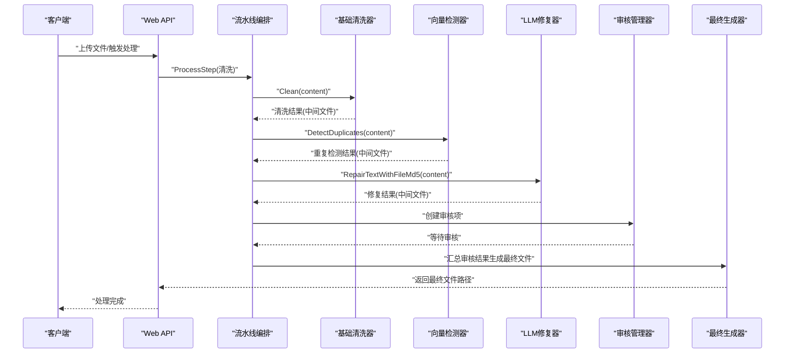
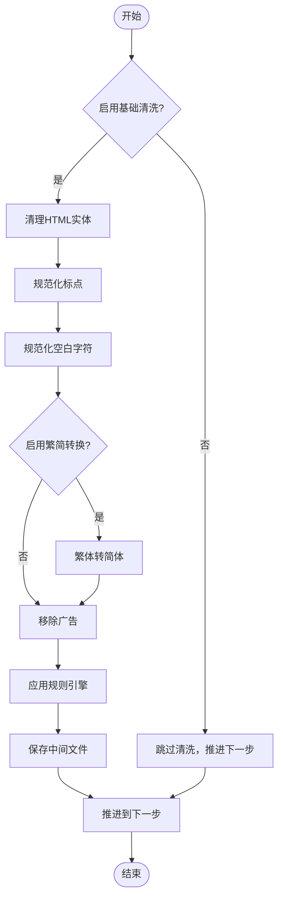
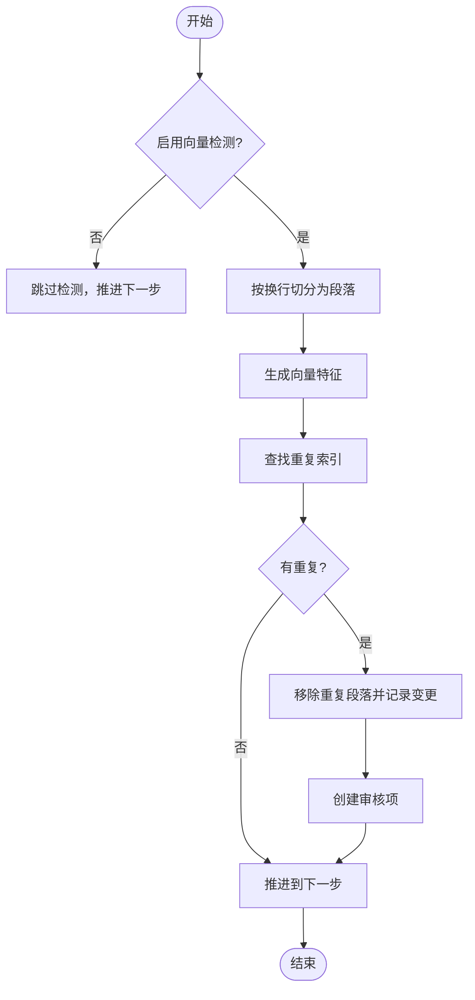
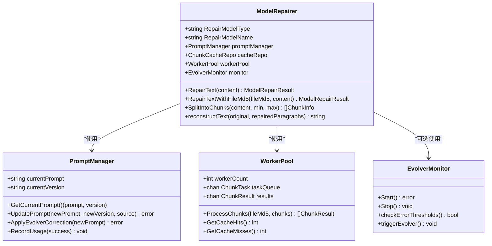
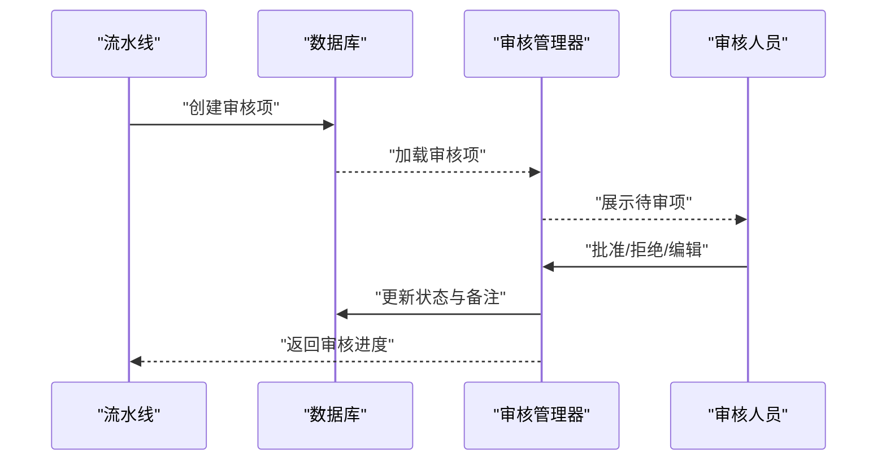
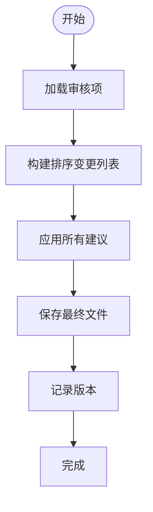
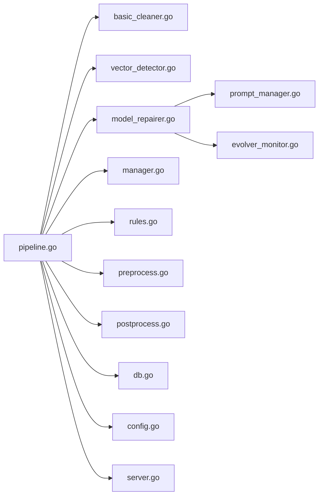

# 文本处理流水线

<cite>
**本文档引用的文件**
- [pipeline.go](file://internal/processor/pipeline.go)
- [basic_cleaner.go](file://internal/processor/basic_cleaner.go)
- [vector_detector.go](file://internal/processor/vector_detector.go)
- [model_repairer.go](file://internal/processor/model_repairer.go)
- [manager.go](file://internal/review/manager/manager.go)
- [preprocess.go](file://internal/processor/preprocess/preprocess.go)
- [postprocess.go](file://internal/processor/postprocess/postprocess.go)
- [rules.go](file://internal/processor/rules/rules.go)
- [config.go](file://internal/config/config.go)
- [db.go](file://internal/database/db.go)
- [prompt_manager.go](file://internal/processor/prompt_manager.go)
- [evolver_monitor.go](file://internal/processor/evolver_monitor.go)
- [server.go](file://web/backend/server.go)
- [main.go](file://cmd/txtclean/main.go)
</cite>

## 目录
1. [简介](#简介)
2. [项目结构](#项目结构)
3. [核心组件](#核心组件)
4. [架构总览](#架构总览)
5. [详细组件分析](#详细组件分析)
6. [依赖关系分析](#依赖关系分析)
7. [性能考量](#性能考量)
8. [故障排查指南](#故障排查指南)
9. [结论](#结论)
10. [附录](#附录)

## 简介
本项目提供一套完整的文本处理流水线，采用五步处理流程：
- 基础清洗模块：清理HTML实体、规范化标点、繁简转换、移除广告等
- 向量检测模块：基于段落向量相似度检测重复内容
- LLM修复模块：智能分块、Worker Pool并发、缓存幂等性、断点续传
- 人工审核模块：集中管理修改建议，支持审批/拒绝/编辑/批量操作
- 最终生成模块：汇总审核结果，生成最终文件并记录版本

流水线支持可配置的规则体系、动态提示词管理、自进化监控（Evolver）、SQLite持久化存储，并提供REST API供前端交互。

## 项目结构
项目采用分层与功能域结合的组织方式：
- cmd/txtclean：应用入口，负责配置加载、数据库初始化与HTTP服务启动
- internal/config：全局配置管理，支持.env加载与运行时验证
- internal/database：SQLite数据库初始化、表结构与索引、版本与缓存相关表
- internal/processor：核心处理逻辑，包含预处理/后处理、规则引擎、清洗器、向量检测器、LLM修复器、提示词管理、自进化监控、流水线编排
- internal/review/manager：人工审核管理器，负责会话、项状态与持久化
- internal/file：文件解析与MD5计算（用于版本与缓存）
- internal/logging：日志与指标记录
- internal/external：外部API封装（向量/LLM）
- web/backend：Gin Web服务与路由
- web/frontend：静态资源与页面（本文件分析不涉及）

图表来源
- [main.go:1-61](file://cmd/txtclean/main.go#L1-L61)
- [config.go:1-204](file://internal/config/config.go#L1-L204)
- [db.go:1-223](file://internal/database/db.go#L1-L223)
- [pipeline.go:1-610](file://internal/processor/pipeline.go#L1-L610)
- [basic_cleaner.go:1-280](file://internal/processor/basic_cleaner.go#L1-L280)
- [vector_detector.go:1-224](file://internal/processor/vector_detector.go#L1-L224)
- [model_repairer.go:1-731](file://internal/processor/model_repairer.go#L1-L731)
- [prompt_manager.go:1-363](file://internal/processor/prompt_manager.go#L1-L363)
- [evolver_monitor.go:1-300](file://internal/processor/evolver_monitor.go#L1-L300)
- [manager.go:1-234](file://internal/review/manager/manager.go#L1-L234)
- [preprocess.go:1-250](file://internal/processor/preprocess/preprocess.go#L1-L250)
- [postprocess.go:1-111](file://internal/processor/postprocess/postprocess.go#L1-L111)
- [rules.go:1-151](file://internal/processor/rules/rules.go#L1-L151)
- [server.go:1-58](file://web/backend/server.go#L1-L58)

章节来源
- [main.go:1-61](file://cmd/txtclean/main.go#L1-L61)
- [config.go:1-204](file://internal/config/config.go#L1-L204)
- [db.go:1-223](file://internal/database/db.go#L1-L223)
- [server.go:1-58](file://web/backend/server.go#L1-L58)

## 核心组件
- 流水线编排：定义五步处理流程、步骤顺序、进度计算、错误处理与中间文件保存
- 基础清洗器：HTML实体清理、标点规范化、空白字符规范化、繁简转换、广告移除
- 向量检测器：段落切分、向量生成、重复检测、去重与变更记录
- LLM修复器：智能分块、Worker Pool并发、缓存幂等性、断点续传、提示词管理、自进化监控
- 审核管理器：会话创建、项状态管理、持久化、批量操作
- 规则引擎：动态加载/保存规则，正则替换
- 预处理/后处理：编码规范化、广告清理、特殊字符处理、格式优化、章节整理、标点规范化
- 配置管理：环境变量加载、默认值、验证、目录准备
- 数据库：SQLite WAL模式、索引、版本与缓存相关表、并发优化

章节来源
- [pipeline.go:1-610](file://internal/processor/pipeline.go#L1-L610)
- [basic_cleaner.go:1-280](file://internal/processor/basic_cleaner.go#L1-L280)
- [vector_detector.go:1-224](file://internal/processor/vector_detector.go#L1-L224)
- [model_repairer.go:1-731](file://internal/processor/model_repairer.go#L1-L731)
- [manager.go:1-234](file://internal/review/manager/manager.go#L1-L234)
- [rules.go:1-151](file://internal/processor/rules/rules.go#L1-L151)
- [preprocess.go:1-250](file://internal/processor/preprocess/preprocess.go#L1-L250)
- [postprocess.go:1-111](file://internal/processor/postprocess/postprocess.go#L1-L111)
- [config.go:1-204](file://internal/config/config.go#L1-L204)
- [db.go:1-223](file://internal/database/db.go#L1-L223)

## 架构总览
流水线以“文件MD5”为核心标识贯穿各阶段，每个步骤完成后生成中间文件并记录版本，支持断点续传与幂等性。LLM修复器引入Worker Pool并发与块级缓存，提升吞吐与稳定性。自进化监控器在错误阈值触发时调用外部脚本优化提示词，形成闭环。

图表来源
- [pipeline.go:104-158](file://internal/processor/pipeline.go#L104-L158)
- [basic_cleaner.go:31-51](file://internal/processor/basic_cleaner.go#L31-L51)
- [vector_detector.go:36-69](file://internal/processor/vector_detector.go#L36-L69)
- [model_repairer.go:77-122](file://internal/processor/model_repairer.go#L77-L122)
- [manager.go:56-89](file://internal/review/manager/manager.go#L56-L89)
- [pipeline.go:470-522](file://internal/processor/pipeline.go#L470-L522)

## 详细组件分析

### 基础清洗模块
- 算法原理
  - HTML实体清理：将常见HTML实体替换为对应字符，记录变更数量
  - 标点规范化：中文上下文下的半角标点转全角，避免跨语言混排
  - 空白字符规范化：统一换行符、压缩多余空行、去除行内冗余空格
  - 繁简转换：繁体汉字映射至简体，仅在启用时生效
  - 广告移除：基于正则模式匹配并移除常见广告片段
- 输入输出
  - 输入：原始文本字符串
  - 输出：清洗结果对象，包含内容、变更列表与统计
- 配置参数
  - EnableBasicCleaning：是否启用基础清洗
  - TraditionalToSimple：繁简转换开关
  - AdBlacklist：广告黑名单模式列表
  - TypoMap：错别字映射表（在流水线中应用）
- 优先级机制
  - 若禁用基础清洗，直接跳过并推进到下一步
  - 各清洗步骤按顺序执行，最终生成变更列表与统计

图表来源
- [pipeline.go:160-213](file://internal/processor/pipeline.go#L160-L213)
- [basic_cleaner.go:31-51](file://internal/processor/basic_cleaner.go#L31-L51)
- [rules.go:139-150](file://internal/processor/rules/rules.go#L139-L150)

章节来源
- [basic_cleaner.go:1-280](file://internal/processor/basic_cleaner.go#L1-L280)
- [pipeline.go:160-213](file://internal/processor/pipeline.go#L160-L213)
- [rules.go:1-151](file://internal/processor/rules/rules.go#L1-L151)

### 向量检测模块
- 算法原理
  - 段落切分：按换行符分割并过滤空段落
  - 向量生成：使用段落长度、中文标点密度等特征构造向量（简化实现）
  - 重复检测：对标准化后的段落进行精确匹配，识别重复索引
  - 去重与记录：移除重复段落并生成变更记录
- 输入输出
  - 输入：原始文本字符串
  - 输出：检测结果对象，包含内容、变更列表与统计
- 配置参数
  - EnableVectorDetection：是否启用向量检测
  - SimilarityThreshold：相似度阈值（当前简化实现为精确匹配）
  - VectorModelType/Name：向量模型类型与名称（支持API降级）
- 优先级机制
  - 若禁用向量检测，直接跳过并推进到下一步
  - 检测到重复后生成审核项，推动进入人工审核阶段

图表来源
- [pipeline.go:215-271](file://internal/processor/pipeline.go#L215-L271)
- [vector_detector.go:36-69](file://internal/processor/vector_detector.go#L36-L69)
- [vector_detector.go:113-143](file://internal/processor/vector_detector.go#L113-L143)

章节来源
- [vector_detector.go:1-224](file://internal/processor/vector_detector.go#L1-L224)
- [pipeline.go:215-271](file://internal/processor/pipeline.go#L215-L271)

### LLM修复模块
- 算法原理
  - 智能分块：将文本按换行切分为段落，合并至1500-2000字符区间，保持段落完整性
  - Worker Pool并发：固定数量工作线程并行处理块，支持断点续传与幂等性
  - 缓存幂等性：基于块哈希查询缓存，命中则直接复用修复结果
  - 断点续传：块级缓存表支持重启后继续处理
  - 动态提示词：提示词管理器支持文件热重载与Evolver自进化
  - 自进化监控：监控缓存命中率与API错误率，触发外部脚本优化提示词
- 输入输出
  - 输入：原始文本字符串（可带文件MD5）
  - 输出：修复结果对象，包含内容、变更列表与统计（总块数、修改数、缓存命中/未命中）
- 配置参数
  - EnableModelRepair：是否启用模型修复
  - RepairModelType/Name：修复模型类型与名称
  - EnableEvolver：是否启用自进化监控
- 优先级机制
  - 若禁用模型修复，直接跳过并推进到下一步
  - 修复结果写入中间文件并生成审核项
  - 统计指标用于触发Evolver优化

图表来源
- [model_repairer.go:19-75](file://internal/processor/model_repairer.go#L19-L75)
- [model_repairer.go:526-731](file://internal/processor/model_repairer.go#L526-L731)
- [prompt_manager.go:15-76](file://internal/processor/prompt_manager.go#L15-L76)
- [evolver_monitor.go:18-41](file://internal/processor/evolver_monitor.go#L18-L41)

章节来源
- [model_repairer.go:1-731](file://internal/processor/model_repairer.go#L1-L731)
- [prompt_manager.go:1-363](file://internal/processor/prompt_manager.go#L1-L363)
- [evolver_monitor.go:1-300](file://internal/processor/evolver_monitor.go#L1-L300)

### 人工审核模块
- 功能概述
  - 审核会话：围绕文件创建包含多个修改建议的会话
  - 状态管理：支持待审、已批准、已拒绝、已跳过
  - 持久化：会话与项状态持久化到磁盘（可扩展为数据库）
  - 批量操作：支持批量批准/拒绝
- 输入输出
  - 输入：修改建议集合（来自清洗/向量检测/LLM修复）
  - 输出：会话状态与最终采纳的建议
- 配置参数
  - 审核项状态字段：ID、建议、状态、审核时间、审核备注
- 优先级机制
  - 若无审核项，直接跳过进入最终生成
  - 审核进度按已解决/总数计算，推动流水线前进

图表来源
- [pipeline.go:436-468](file://internal/processor/pipeline.go#L436-L468)
- [manager.go:56-89](file://internal/review/manager/manager.go#L56-L89)
- [manager.go:111-142](file://internal/review/manager/manager.go#L111-L142)

章节来源
- [manager.go:1-234](file://internal/review/manager/manager.go#L1-L234)
- [pipeline.go:436-468](file://internal/processor/pipeline.go#L436-L468)

### 最终生成模块
- 功能概述
  - 汇总审核结果：构建排序后的变更列表
  - 应用建议：将已批准/编辑的建议应用到最终内容
  - 文件生成：生成最终文件并记录版本
- 输入输出
  - 输入：原始内容、审核项列表
  - 输出：最终文件路径、版本记录
- 配置参数
  - DataDir：数据目录，用于生成最终文件
- 优先级机制
  - 无审核项时直接进入最终生成
  - 生成完成后标记为完成并记录日志

图表来源
- [pipeline.go:470-522](file://internal/processor/pipeline.go#L470-L522)
- [pipeline.go:588-610](file://internal/processor/pipeline.go#L588-L610)

章节来源
- [pipeline.go:470-522](file://internal/processor/pipeline.go#L470-L522)
- [pipeline.go:588-610](file://internal/processor/pipeline.go#L588-L610)

## 依赖关系分析
- 组件耦合
  - 流水线编排对清洗器、向量检测器、LLM修复器、审核管理器均有直接依赖
  - LLM修复器内部依赖提示词管理器与自进化监控器（可选）
  - 数据库层提供文件、版本、审核项、处理日志、块缓存、重试队列、提示词版本等表
- 外部依赖
  - Gin Web框架、SQLite驱动、外部API封装
- 循环依赖
  - 未发现循环依赖，模块职责清晰

图表来源
- [pipeline.go:1-17](file://internal/processor/pipeline.go#L1-L17)
- [model_repairer.go:1-17](file://internal/processor/model_repairer.go#L1-L17)
- [prompt_manager.go:1-13](file://internal/processor/prompt_manager.go#L1-L13)
- [evolver_monitor.go:1-16](file://internal/processor/evolver_monitor.go#L1-L16)
- [db.go:1-11](file://internal/database/db.go#L1-L11)
- [config.go:1-12](file://internal/config/config.go#L1-L12)
- [server.go:1-8](file://web/backend/server.go#L1-L8)

章节来源
- [pipeline.go:1-17](file://internal/processor/pipeline.go#L1-L17)
- [model_repairer.go:1-17](file://internal/processor/model_repairer.go#L1-L17)
- [db.go:1-11](file://internal/database/db.go#L1-L11)

## 性能考量
- 并发优化
  - Worker Pool并发处理块，支持断点续传与幂等性，显著提升大文件处理吞吐
  - SQLite使用WAL模式与单写连接，配合索引提升并发读写性能
- 缓存策略
  - 块级缓存避免重复调用外部API，降低延迟与成本
  - 提示词版本缓存与热重载，减少I/O与解析开销
- I/O与存储
  - 中间文件与最终文件均写入配置目录，便于断点续传与版本管理
  - 数据库表设计包含大量索引，加速查询与统计
- 监控与自进化
  - 通过缓存命中率与错误率阈值触发Evolver优化，持续改进修复质量

章节来源
- [model_repairer.go:547-731](file://internal/processor/model_repairer.go#L547-L731)
- [db.go:29-58](file://internal/database/db.go#L29-L58)
- [evolver_monitor.go:117-177](file://internal/processor/evolver_monitor.go#L117-L177)

## 故障排查指南
- 常见错误与处理
  - 文件不存在/读取失败：检查文件MD5与路径，确认中间文件保存成功
  - 步骤错误：查看处理日志记录，定位具体步骤与错误详情
  - 审核进度异常：检查审核项状态与数据库记录
  - LLM修复失败：检查API配置、重试队列与提示词版本
- 日志与指标
  - 流水线记录每个步骤的开始/完成与错误日志
  - LLM修复器记录缓存命中/未命中、处理耗时与提示词使用情况
  - 自进化监控记录触发原因与优化结果
- 排查步骤
  - 确认配置加载成功且验证通过
  - 检查数据库连接与表结构初始化
  - 查看中间文件与最终文件生成情况
  - 检查提示词文件与Evolver脚本路径

章节来源
- [pipeline.go:145-157](file://internal/processor/pipeline.go#L145-L157)
- [model_repairer.go:302-318](file://internal/processor/model_repairer.go#L302-L318)
- [evolver_monitor.go:246-254](file://internal/processor/evolver_monitor.go#L246-L254)

## 结论
本文本处理流水线通过模块化设计与可配置策略，实现了从基础清洗到最终生成的完整链路。LLM修复器的并发与缓存机制显著提升了性能与稳定性，自进化监控进一步保障了长期运行的质量。结合人工审核与版本管理，系统具备良好的可维护性与可扩展性。

## 附录
- 使用模式
  - 通过Web API上传文件并触发全流程处理
  - 在审核阶段对建议进行审批/拒绝/编辑
  - 下载最终文件并查看处理报告
- 配置要点
  - 确保DATA_DIR存在且可写
  - 配置LLM与向量模型的API地址与密钥
  - 启用/禁用各处理步骤以适配业务需求
- 质量保证
  - 规则引擎与提示词版本管理
  - 缓存命中率与错误率监控
  - 版本记录与断点续传