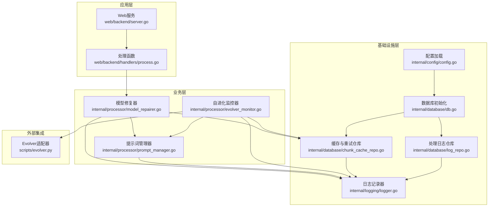
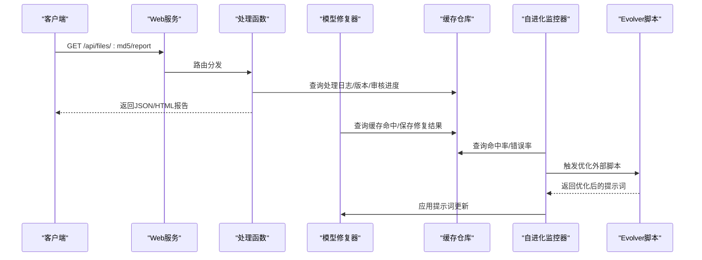
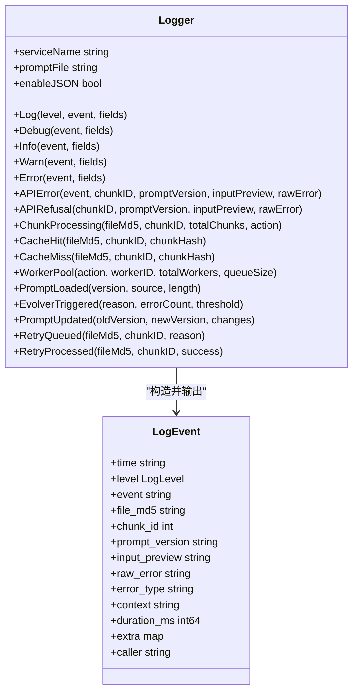
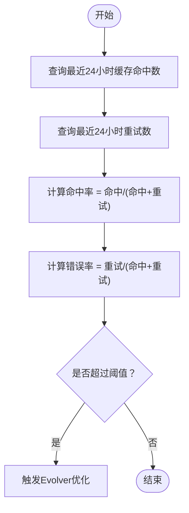
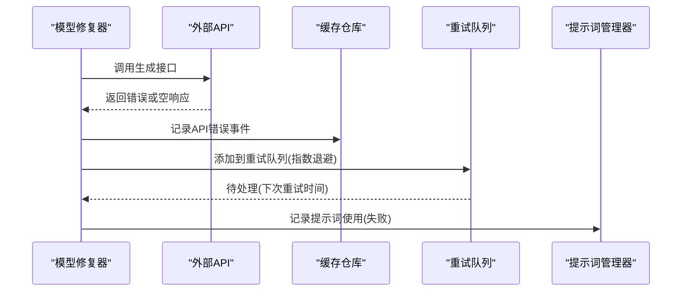
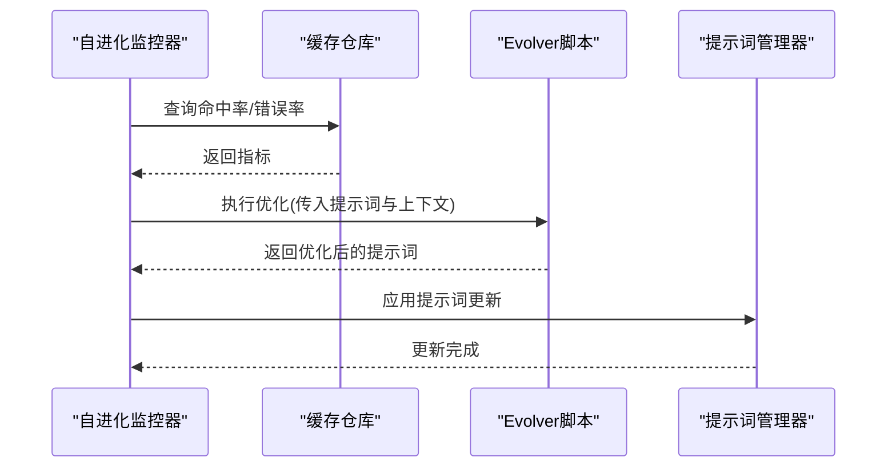
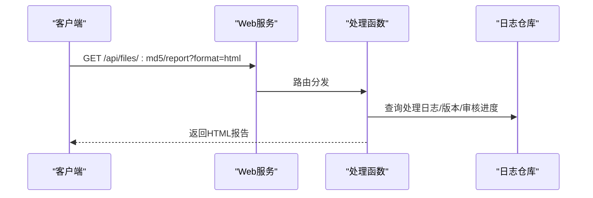
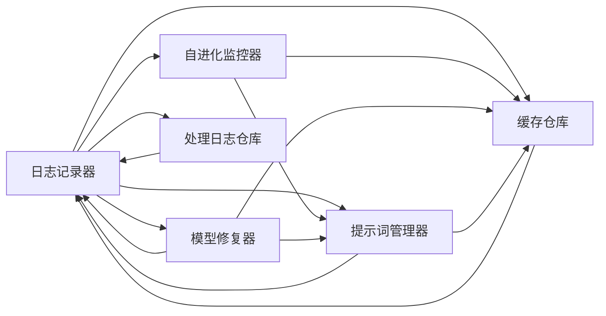

# 日志和监控系统

<cite>
**本文档引用的文件**
- [internal/logging/logger.go](file://internal/logging/logger.go)
- [internal/processor/evolver_monitor.go](file://internal/processor/evolver_monitor.go)
- [internal/processor/model_repairer.go](file://internal/processor/model_repairer.go)
- [internal/processor/prompt_manager.go](file://internal/processor/prompt_manager.go)
- [internal/database/log_repo.go](file://internal/database/log_repo.go)
- [internal/database/chunk_cache_repo.go](file://internal/database/chunk_cache_repo.go)
- [internal/database/db.go](file://internal/database/db.go)
- [internal/config/config.go](file://internal/config/config.go)
- [scripts/evolver.py](file://scripts/evolver.py)
- [web/backend/server.go](file://web/backend/server.go)
- [web/backend/handlers/process.go](file://web/backend/handlers/process.go)
- [cmd/voidtext/main.go](file://cmd/voidtext/main.go)
</cite>

## 目录
1. [简介](#简介)
2. [项目结构](#项目结构)
3. [核心组件](#核心组件)
4. [架构总览](#架构总览)
5. [详细组件分析](#详细组件分析)
6. [依赖关系分析](#依赖关系分析)
7. [性能考量](#性能考量)
8. [故障排查指南](#故障排查指南)
9. [结论](#结论)
10. [附录](#附录)

## 简介
本文件面向VoidText项目的日志与监控系统，系统性阐述日志记录策略、日志级别管理、性能监控指标与健康检查机制、错误追踪与异常处理流程、监控告警与通知机制、日志分析与调试工具、日志轮转与存储策略、监控数据可视化与报告功能，以及系统性能优化与瓶颈分析，并提供监控系统的配置与扩展方法。目标是帮助开发者与运维人员快速理解并高效使用该系统。

## 项目结构
日志与监控系统主要分布在以下模块：
- 日志记录：internal/logging/logger.go
- 监控与自进化：internal/processor/evolver_monitor.go、internal/processor/prompt_manager.go、internal/processor/model_repairer.go
- 数据库与指标：internal/database/chunk_cache_repo.go、internal/database/log_repo.go、internal/database/db.go
- 配置与入口：internal/config/config.go、cmd/voidtext/main.go
- Web接口与报告：web/backend/server.go、web/backend/handlers/process.go
- 外部Evolver适配器：scripts/evolver.py

图表来源
- [web/backend/server.go:10-57](file://web/backend/server.go#L10-L57)
- [web/backend/handlers/process.go:15-77](file://web/backend/handlers/process.go#L15-L77)
- [internal/processor/model_repairer.go:38-75](file://internal/processor/model_repairer.go#L38-L75)
- [internal/processor/prompt_manager.go:38-76](file://internal/processor/prompt_manager.go#L38-L76)
- [internal/processor/evolver_monitor.go:34-41](file://internal/processor/evolver_monitor.go#L34-L41)
- [internal/logging/logger.go:40-44](file://internal/logging/logger.go#L40-L44)
- [internal/config/config.go:48-122](file://internal/config/config.go#L48-L122)
- [internal/database/db.go:15-69](file://internal/database/db.go#L15-L69)
- [internal/database/chunk_cache_repo.go:57-65](file://internal/database/chunk_cache_repo.go#L57-L65)
- [internal/database/log_repo.go:19-33](file://internal/database/log_repo.go#L19-L33)
- [scripts/evolver.py:143-168](file://scripts/evolver.py#L143-L168)

章节来源
- [web/backend/server.go:10-57](file://web/backend/server.go#L10-L57)
- [internal/processor/model_repairer.go:38-75](file://internal/processor/model_repairer.go#L38-L75)
- [internal/processor/prompt_manager.go:38-76](file://internal/processor/prompt_manager.go#L38-L76)
- [internal/processor/evolver_monitor.go:34-41](file://internal/processor/evolver_monitor.go#L34-L41)
- [internal/logging/logger.go:40-44](file://internal/logging/logger.go#L40-L44)
- [internal/config/config.go:48-122](file://internal/config/config.go#L48-L122)
- [internal/database/db.go:15-69](file://internal/database/db.go#L15-L69)
- [internal/database/chunk_cache_repo.go:57-65](file://internal/database/chunk_cache_repo.go#L57-L65)
- [internal/database/log_repo.go:19-33](file://internal/database/log_repo.go#L19-L33)
- [scripts/evolver.py:143-168](file://scripts/evolver.py#L143-L168)

## 核心组件
- 结构化日志记录器：统一输出JSON格式日志，包含时间、级别、事件、调用者、额外字段等，便于集中采集与检索。
- 提示词管理器：动态加载、热更新、版本化管理提示词，支持Evolver自进化。
- 自进化监控器：周期性检查缓存命中率与API错误率，触发外部Evolver脚本优化提示词。
- 数据库仓库：提供缓存命中率、错误率、重试队列、提示词版本等指标查询与持久化。
- Web接口：提供处理状态查询、审核项管理、处理报告（含HTML格式）等。
- 配置系统：加载环境变量，初始化数据目录与数据库，控制功能开关。

章节来源
- [internal/logging/logger.go:12-37](file://internal/logging/logger.go#L12-L37)
- [internal/processor/prompt_manager.go:15-28](file://internal/processor/prompt_manager.go#L15-L28)
- [internal/processor/evolver_monitor.go:18-32](file://internal/processor/evolver_monitor.go#L18-L32)
- [internal/database/chunk_cache_repo.go:57-65](file://internal/database/chunk_cache_repo.go#L57-L65)
- [web/backend/handlers/process.go:328-377](file://web/backend/handlers/process.go#L328-L377)
- [internal/config/config.go:48-122](file://internal/config/config.go#L48-L122)

## 架构总览
日志与监控系统围绕“结构化日志 + 指标查询 + 自进化 + Web报告”的闭环构建：
- 结构化日志：统一输出，便于集中采集与分析。
- 指标查询：通过数据库仓库计算缓存命中率、错误率等关键指标。
- 自进化：监控器定期检查阈值，触发Evolver优化提示词。
- 报告与可视化：Web接口提供处理报告，支持HTML格式展示。

图表来源
- [web/backend/handlers/process.go:328-377](file://web/backend/handlers/process.go#L328-L377)
- [internal/processor/model_repairer.go:253-319](file://internal/processor/model_repairer.go#L253-L319)
- [internal/processor/evolver_monitor.go:117-177](file://internal/processor/evolver_monitor.go#L117-L177)
- [scripts/evolver.py:143-168](file://scripts/evolver.py#L143-L168)

## 详细组件分析

### 日志记录策略与日志级别管理
- 日志级别：debug、info、warn、error，分别对应开发调试、一般信息、警告、错误。
- 结构化输出：默认输出JSON格式，包含时间、级别、事件、文件MD5、块ID、提示词版本、输入预览、原始错误、错误类型、上下文、耗时、额外字段、调用者等。
- 调用者追踪：自动获取调用者文件与行号，便于定位问题来源。
- 快捷方法：提供Debug、Info、Warn、Error、APIError、APIRefusal、ChunkProcessing、CacheHit、CacheMiss、WorkerPool、PromptLoaded、EvolverTriggered、PromptUpdated、RetryQueued、RetryProcessed等事件记录方法。
- 兼容模式：可通过配置切换为非JSON格式，兼容旧日志。

图表来源
- [internal/logging/logger.go:12-37](file://internal/logging/logger.go#L12-L37)
- [internal/logging/logger.go:40-44](file://internal/logging/logger.go#L40-L44)
- [internal/logging/logger.go:68-141](file://internal/logging/logger.go#L68-L141)
- [internal/logging/logger.go:143-250](file://internal/logging/logger.go#L143-L250)

章节来源
- [internal/logging/logger.go:12-37](file://internal/logging/logger.go#L12-L37)
- [internal/logging/logger.go:68-141](file://internal/logging/logger.go#L68-L141)
- [internal/logging/logger.go:143-250](file://internal/logging/logger.go#L143-L250)

### 性能监控指标与健康检查机制
- 缓存命中率：通过数据库仓库查询最近24小时内的缓存命中次数与总查询次数，计算命中率。
- API错误率：通过数据库仓库查询最近24小时内的重试记录数量，结合缓存命中数计算错误率。
- 工作池统计：记录总块数、缓存命中/未命中数、工作线程数等。
- 健康检查：Web服务启动时打印端口信息；数据库初始化时启用WAL模式、设置连接池与生命周期；配置加载时验证端口、相似度阈值、温度等参数范围。

图表来源
- [internal/database/chunk_cache_repo.go:422-478](file://internal/database/chunk_cache_repo.go#L422-L478)
- [internal/processor/evolver_monitor.go:117-177](file://internal/processor/evolver_monitor.go#L117-L177)

章节来源
- [internal/database/chunk_cache_repo.go:422-478](file://internal/database/chunk_cache_repo.go#L422-L478)
- [internal/processor/evolver_monitor.go:117-177](file://internal/processor/evolver_monitor.go#L117-L177)
- [internal/database/db.go:15-69](file://internal/database/db.go#L15-L69)
- [cmd/voidtext/main.go:18-61](file://cmd/voidtext/main.go#L18-L61)

### 错误追踪与异常处理流程
- API修复失败：记录API错误事件，包含段落长度、耗时、错误详情、提示词版本；将失败记录加入重试队列（指数退避），最多重试3次。
- 缓存查询失败：记录缓存查询错误事件，不影响主流程。
- 重试队列：支持指数退避（最多1小时）、原子状态更新、清理策略（删除旧记录）。
- 提示词使用统计：原子更新使用次数与成功率，用于评估提示词效果。
- Evolver执行失败：记录执行失败事件，包含脚本路径、耗时、错误与标准错误输出；回退到基于规则的优化策略。

图表来源
- [internal/processor/model_repairer.go:253-319](file://internal/processor/model_repairer.go#L253-L319)
- [internal/database/chunk_cache_repo.go:169-202](file://internal/database/chunk_cache_repo.go#L169-L202)
- [internal/processor/prompt_manager.go:308-322](file://internal/processor/prompt_manager.go#L308-L322)

章节来源
- [internal/processor/model_repairer.go:253-319](file://internal/processor/model_repairer.go#L253-L319)
- [internal/database/chunk_cache_repo.go:169-202](file://internal/database/chunk_cache_repo.go#L169-L202)
- [internal/processor/prompt_manager.go:308-322](file://internal/processor/prompt_manager.go#L308-L322)

### 监控告警与通知机制
- Evolver触发：当缓存命中率低于阈值或API错误率高于阈值时，记录触发事件并调用外部Evolver脚本。
- Evolver执行：记录执行耗时、错误与标准错误输出；解析脚本输出提取优化后的提示词；应用提示词更新并记录更新事件。
- 手动触发：提供手动触发接口，受最小调用间隔保护，避免频繁调用。

图表来源
- [internal/processor/evolver_monitor.go:179-285](file://internal/processor/evolver_monitor.go#L179-L285)
- [scripts/evolver.py:143-168](file://scripts/evolver.py#L143-L168)
- [internal/processor/prompt_manager.go:229-233](file://internal/processor/prompt_manager.go#L229-L233)

章节来源
- [internal/processor/evolver_monitor.go:179-285](file://internal/processor/evolver_monitor.go#L179-L285)
- [scripts/evolver.py:143-168](file://scripts/evolver.py#L143-L168)
- [internal/processor/prompt_manager.go:229-233](file://internal/processor/prompt_manager.go#L229-L233)

### 日志分析与调试工具
- Web报告：提供处理报告接口，支持JSON与HTML两种格式；包含文件元信息、审核统计、处理日志、版本历史等。
- 处理日志：提供按文件MD5查询处理日志与最新日志的接口，便于定位问题。
- 调试辅助：日志记录器自动包含调用者信息，便于快速定位问题来源。

图表来源
- [web/backend/handlers/process.go:328-377](file://web/backend/handlers/process.go#L328-L377)
- [internal/database/log_repo.go:35-75](file://internal/database/log_repo.go#L35-L75)

章节来源
- [web/backend/handlers/process.go:328-377](file://web/backend/handlers/process.go#L328-L377)
- [internal/database/log_repo.go:35-75](file://internal/database/log_repo.go#L35-L75)

### 日志轮转与存储策略
- 数据库存储：采用SQLite，启用WAL模式提升并发读写性能；设置连接池与生命周期，避免长时间连接导致资源泄露。
- 清理策略：提供删除旧缓存与重试记录的清理方法，保留最近N天的数据，避免数据库无限增长。
- 文件系统：配置加载时确保数据目录存在，包括上传、备份、临时目录。

章节来源
- [internal/database/db.go:15-69](file://internal/database/db.go#L15-L69)
- [internal/database/chunk_cache_repo.go:392-420](file://internal/database/chunk_cache_repo.go#L392-L420)
- [internal/config/config.go:116-122](file://internal/config/config.go#L116-L122)

### 监控数据的可视化与报告功能
- Web接口：提供处理状态查询、审核项管理、处理报告（JSON/HTML）等接口。
- 报告内容：文件信息、审核统计、处理日志、版本历史等。
- HTML报告：内置样式，直观展示文件状态与审核进度。

章节来源
- [web/backend/server.go:28-54](file://web/backend/server.go#L28-L54)
- [web/backend/handlers/process.go:328-377](file://web/backend/handlers/process.go#L328-L377)

## 依赖关系分析
- 组件耦合：
  - 日志记录器被广泛使用于各业务模块，形成统一的事件输出入口。
  - 自进化监控器依赖提示词管理器与缓存仓库，负责触发Evolver优化。
  - 模型修复器依赖提示词管理器、缓存仓库与工作池，负责文本修复与统计。
  - 数据库仓库提供指标查询与持久化能力，支撑监控与报告。
- 外部依赖：
  - Evolver脚本通过外部命令调用，需安装Node.js与Evolver CLI。
  - SQLite驱动用于本地存储，配合WAL模式提升性能。

图表来源
- [internal/logging/logger.go:68-141](file://internal/logging/logger.go#L68-L141)
- [internal/processor/model_repairer.go:38-75](file://internal/processor/model_repairer.go#L38-L75)
- [internal/processor/prompt_manager.go:38-76](file://internal/processor/prompt_manager.go#L38-L76)
- [internal/processor/evolver_monitor.go:34-41](file://internal/processor/evolver_monitor.go#L34-L41)
- [internal/database/chunk_cache_repo.go:57-65](file://internal/database/chunk_cache_repo.go#L57-L65)
- [internal/database/log_repo.go:19-33](file://internal/database/log_repo.go#L19-L33)

章节来源
- [internal/logging/logger.go:68-141](file://internal/logging/logger.go#L68-L141)
- [internal/processor/model_repairer.go:38-75](file://internal/processor/model_repairer.go#L38-L75)
- [internal/processor/prompt_manager.go:38-76](file://internal/processor/prompt_manager.go#L38-L76)
- [internal/processor/evolver_monitor.go:34-41](file://internal/processor/evolver_monitor.go#L34-L41)
- [internal/database/chunk_cache_repo.go:57-65](file://internal/database/chunk_cache_repo.go#L57-L65)
- [internal/database/log_repo.go:19-33](file://internal/database/log_repo.go#L19-L33)

## 性能考量
- 并发与锁：工作池使用互斥锁保护缓存命中/未命中计数，避免竞态条件。
- 数据库优化：启用WAL模式、设置缓存大小、连接池与生命周期，提升并发读写性能。
- 指标计算：命中率与错误率通过SQL聚合计算，避免内存中维护复杂状态。
- 外部调用：Evolver脚本执行设置超时与回退策略，避免阻塞主流程。
- 日志输出：默认JSON格式，便于结构化采集；可切换为兼容模式。

章节来源
- [internal/processor/model_repairer.go:711-723](file://internal/processor/model_repairer.go#L711-L723)
- [internal/database/db.go:29-59](file://internal/database/db.go#L29-L59)
- [internal/database/chunk_cache_repo.go:422-478](file://internal/database/chunk_cache_repo.go#L422-L478)
- [scripts/evolver.py:83-97](file://scripts/evolver.py#L83-L97)

## 故障排查指南
- 日志级别选择：开发阶段使用debug，生产环境使用info/warn/error，避免过多噪声。
- 调用者定位：利用日志中的调用者信息快速定位问题模块。
- API错误：关注API错误事件与重试队列，检查网络、密钥、模型可用性。
- 缓存问题：关注缓存查询失败与缓存保存失败事件，检查数据库连接与事务。
- Evolver失败：查看执行失败事件与标准错误输出，确认脚本路径、Node.js与Evolver CLI安装情况。
- 报告核对：通过处理报告核对文件状态、审核进度与处理日志，定位异常环节。

章节来源
- [internal/logging/logger.go:143-250](file://internal/logging/logger.go#L143-L250)
- [internal/processor/model_repairer.go:232-249](file://internal/processor/model_repairer.go#L232-L249)
- [internal/database/chunk_cache_repo.go:68-100](file://internal/database/chunk_cache_repo.go#L68-L100)
- [internal/processor/evolver_monitor.go:246-254](file://internal/processor/evolver_monitor.go#L246-L254)
- [web/backend/handlers/process.go:328-377](file://web/backend/handlers/process.go#L328-L377)

## 结论
VoidText的日志与监控系统通过结构化日志、指标查询、自进化优化与Web报告实现了完整的可观测性闭环。系统具备良好的扩展性与稳定性，能够满足生产环境下的性能监控、错误追踪与持续优化需求。建议在生产环境中启用WAL模式、合理配置日志级别与清理策略，并结合外部Evolver工具实现提示词的持续优化。

## 附录
- 配置项参考：端口、数据目录、最大文件大小、备份保留天数、功能开关（基础清洗、向量检测、模型修复、Evolver）、模型参数（名称、类型、URL、密钥、温度、最大Token）等。
- 健康检查：服务启动日志、数据库连接测试、WAL模式启用、索引创建、目录准备。
- 扩展建议：增加更多指标（如吞吐量、延迟分布）、告警规则（阈值报警、趋势异常）、可视化面板（Grafana/Prometheus）、日志归档与压缩策略。

章节来源
- [internal/config/config.go:14-44](file://internal/config/config.go#L14-L44)
- [internal/config/config.go:48-122](file://internal/config/config.go#L48-L122)
- [internal/database/db.go:89-222](file://internal/database/db.go#L89-L222)
- [cmd/voidtext/main.go:18-61](file://cmd/voidtext/main.go#L18-L61)