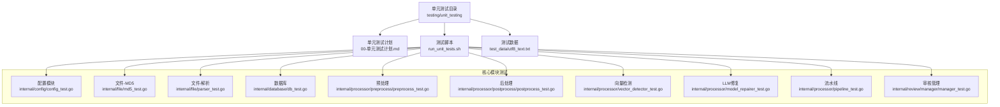
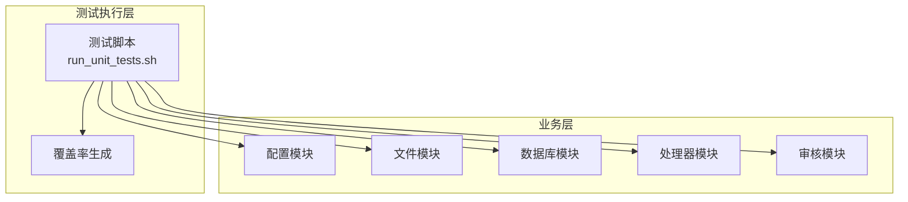
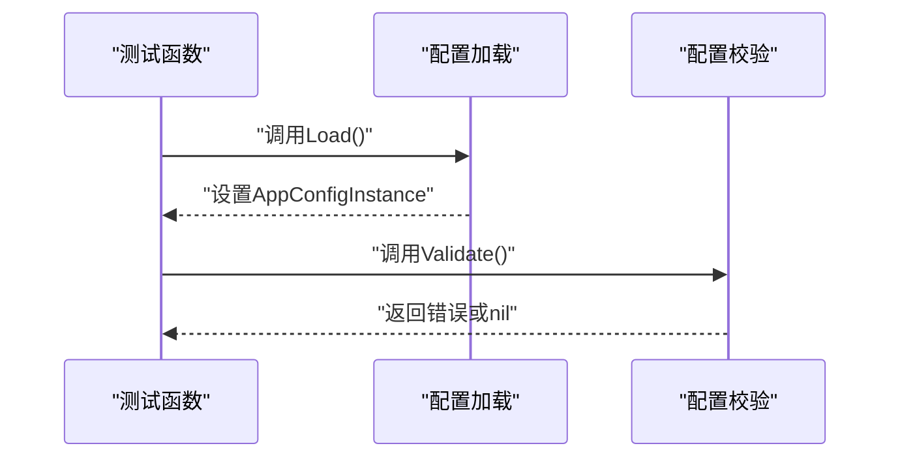
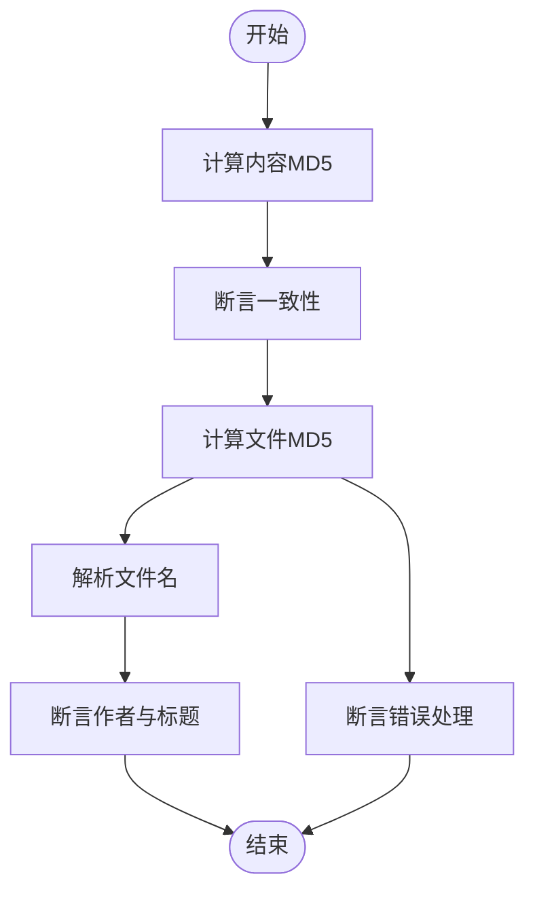
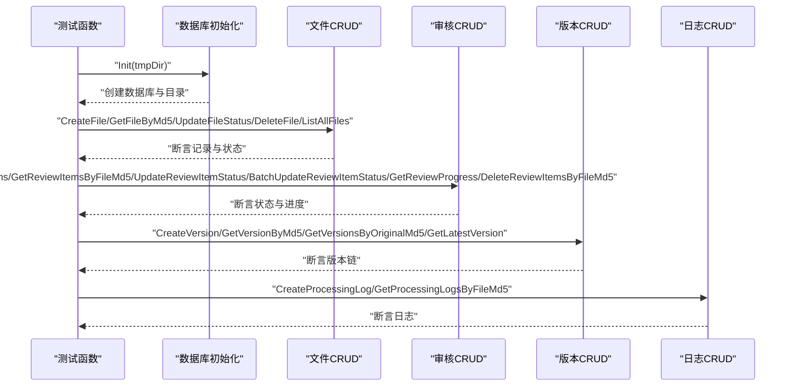
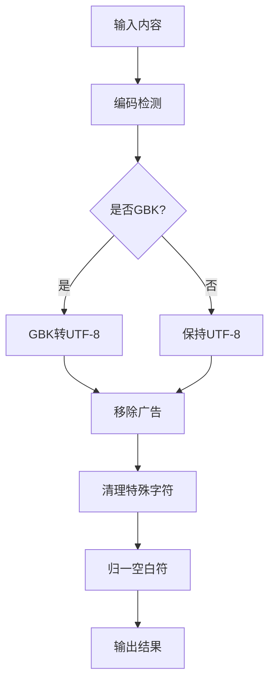
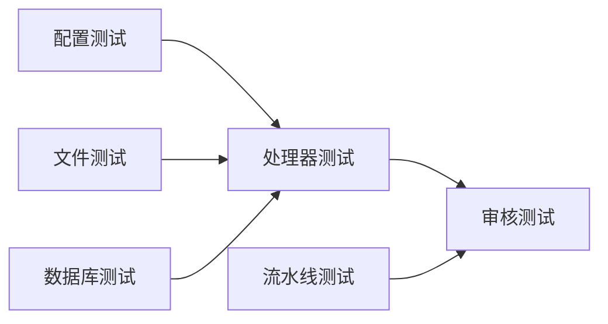

# 单元测试

<cite>
**本文引用的文件**
- [单元测试计划.md](file://testing/unit_testing/00-单元测试计划.md)
- [run_unit_tests.sh](file://testing/unit_testing/run_unit_tests.sh)
- [config_test.go](file://internal/config/config_test.go)
- [db_test.go](file://internal/database/db_test.go)
- [md5_test.go](file://internal/file/md5_test.go)
- [parser_test.go](file://internal/file/parser_test.go)
- [preprocess_test.go](file://internal/processor/preprocess/preprocess_test.go)
- [postprocess_test.go](file://internal/processor/postprocess/postprocess_test.go)
- [vector_detector_test.go](file://internal/processor/vector_detector_test.go)
- [model_repairer_test.go](file://internal/processor/model_repairer_test.go)
- [pipeline_test.go](file://internal/processor/pipeline_test.go)
- [manager_test.go](file://internal/review/manager/manager_test.go)
- [utf8_text.txt](file://testing/unit_testing/test_data/utf8_text.txt)
</cite>

## 目录
1. [引言](#引言)
2. [项目结构](#项目结构)
3. [核心组件](#核心组件)
4. [架构概览](#架构概览)
5. [详细组件分析](#详细组件分析)
6. [依赖分析](#依赖分析)
7. [性能考虑](#性能考虑)
8. [故障排查指南](#故障排查指南)
9. [结论](#结论)
10. [附录](#附录)

## 引言
本文件面向VoidText项目的单元测试，系统化阐述测试设计原则与实施方法，覆盖配置模块、文件处理模块、数据库模块、预处理模块、向量检测模块、规则模块、LLM修复模块与审核模块。文档提供测试用例设计思路、测试数据准备、测试执行流程、覆盖率与质量标准，并给出测试环境配置与脚本使用指南，以及模拟对象与外部依赖隔离策略。

## 项目结构
单元测试位于testing/unit_testing目录，按模块划分测试文件，采用Go语言标准命名约定（*_test.go），并通过go test统一执行。测试脚本支持全量执行、模块执行与覆盖率报告生成。

**图表来源**
- [run_unit_tests.sh:1-168](file://testing/unit_testing/run_unit_tests.sh#L1-L168)
- [config_test.go:1-161](file://internal/config/config_test.go#L1-L161)
- [db_test.go:1-511](file://internal/database/db_test.go#L1-L511)
- [md5_test.go:1-83](file://internal/file/md5_test.go#L1-L83)
- [parser_test.go:1-104](file://internal/file/parser_test.go#L1-L104)
- [preprocess_test.go:1-169](file://internal/processor/preprocess/preprocess_test.go#L1-L169)
- [postprocess_test.go:1-99](file://internal/processor/postprocess/postprocess_test.go#L1-L99)
- [vector_detector_test.go:1-182](file://internal/processor/vector_detector_test.go#L1-L182)
- [model_repairer_test.go:1-180](file://internal/processor/model_repairer_test.go#L1-L180)
- [pipeline_test.go:1-226](file://internal/processor/pipeline_test.go#L1-L226)
- [manager_test.go:1-204](file://internal/review/manager/manager_test.go#L1-L204)

**章节来源**
- [单元测试计划.md:1-163](file://testing/unit_testing/00-单元测试计划.md#L1-L163)
- [run_unit_tests.sh:1-168](file://testing/unit_testing/run_unit_tests.sh#L1-L168)

## 核心组件
- 设计原则
  - 表驱动测试：提升可维护性与可扩展性。
  - 独立性：每个测试函数独立运行，避免相互依赖。
  - 可重复性：使用临时目录与固定配置，保证可重复执行。
  - 断言明确：针对关键字段与行为进行断言，覆盖边界条件。
- 实施方法
  - 使用t.TempDir()创建临时数据库与工作目录。
  - 通过环境变量或直接赋值初始化全局配置实例，确保测试可控。
  - 对外部依赖（如LLM API）进行模拟或禁用，避免真实网络调用。
  - 使用go test -coverprofile与go tool cover生成覆盖率报告。

**章节来源**
- [单元测试计划.md:157-163](file://testing/unit_testing/00-单元测试计划.md#L157-L163)
- [run_unit_tests.sh:118-127](file://testing/unit_testing/run_unit_tests.sh#L118-L127)

## 架构概览
单元测试围绕“配置-文件-数据库-处理器-审核”链路展开，测试脚本统一调度，模块间通过内部包导入进行协作。

**图表来源**
- [run_unit_tests.sh:79-127](file://testing/unit_testing/run_unit_tests.sh#L79-L127)
- [config_test.go:8-161](file://internal/config/config_test.go#L8-L161)
- [db_test.go:9-511](file://internal/database/db_test.go#L9-L511)
- [md5_test.go:9-83](file://internal/file/md5_test.go#L9-L83)
- [parser_test.go:10-104](file://internal/file/parser_test.go#L10-L104)
- [preprocess_test.go:8-169](file://internal/processor/preprocess/preprocess_test.go#L8-L169)
- [postprocess_test.go:7-99](file://internal/processor/postprocess/postprocess_test.go#L7-L99)
- [vector_detector_test.go:19-182](file://internal/processor/vector_detector_test.go#L19-L182)
- [model_repairer_test.go:20-180](file://internal/processor/model_repairer_test.go#L20-L180)
- [pipeline_test.go:25-226](file://internal/processor/pipeline_test.go#L25-L226)
- [manager_test.go:19-204](file://internal/review/manager/manager_test.go#L19-L204)

## 详细组件分析

### 配置模块测试
- 测试策略
  - 加载默认配置与环境变量覆盖，验证端口、布尔、整型、浮点等类型的解析。
  - 验证配置校验逻辑，确保非法值触发错误。
  - 验证分隔符解析与空值过滤。
- 关键断言
  - 端口默认值与覆盖值断言。
  - 配置校验返回错误与通过断言。
  - 分隔符列表长度与空串过滤断言。
- 示例用例
  - 加载配置无错误。
  - 环境变量覆盖端口。
  - 配置校验失败场景（端口为0、相似度阈值>1、温度>2）。
  - 环境变量解析回退（无效值时使用默认）。

**图表来源**
- [config_test.go:8-161](file://internal/config/config_test.go#L8-L161)

**章节来源**
- [config_test.go:8-161](file://internal/config/config_test.go#L8-L161)

### 文件模块测试
- 测试策略
  - MD5计算：内容与文件两套用例，覆盖一致性、不同内容差异、空串处理与文件不存在错误。
  - 文件名解析：多种分隔符与无分隔符场景，验证作者与标题提取。
- 关键断言
  - MD5哈希一致性与差异性断言。
  - 文件名解析的作者与标题断言。
  - 文件读取错误断言。
- 示例用例
  - 内容MD5计算与一致性。
  - 文件MD5计算与错误处理。
  - 文件名解析（波浪号、破折号、下划线、空格、无扩展名）。

**图表来源**
- [md5_test.go:9-83](file://internal/file/md5_test.go#L9-L83)
- [parser_test.go:17-104](file://internal/file/parser_test.go#L17-L104)

**章节来源**
- [md5_test.go:9-83](file://internal/file/md5_test.go#L9-L83)
- [parser_test.go:17-104](file://internal/file/parser_test.go#L17-L104)

### 数据库模块测试
- 测试策略
  - 初始化数据库：临时目录创建、数据库文件存在性。
  - 文件记录CRUD：插入、查询、状态更新、规则更新、删除、列出。
  - 审核项CRUD：批量插入、按MD5查询、状态更新、批量更新、进度统计、删除。
  - 版本链CRUD：版本记录、按原始MD5查询、最新版本获取。
  - 处理日志CRUD：日志插入与按文件MD5查询。
- 关键断言
  - 记录ID非零、状态变更、规则JSON一致、列表长度。
  - 审核项状态过滤与恢复清空时间戳断言。
  - 最新版本时间戳断言。
- 示例用例
  - 初始化数据库并在临时目录创建文件。
  - 插入文件记录并断言ID。
  - 按MD5查询不存在记录返回nil。
  - 审核项状态更新与恢复断言。
  - 版本链按原始MD5查询与最新版本断言。

**图表来源**
- [db_test.go:9-511](file://internal/database/db_test.go#L9-L511)

**章节来源**
- [db_test.go:9-511](file://internal/database/db_test.go#L9-L511)

### 预处理模块测试
- 测试策略
  - 编码检测与修复：GBK/UTF-8识别、混合编码修复、UTF-8规范化。
  - 广告移除：URL与WWW广告识别与变更记录。
  - 特殊字符清理：控制字符过滤与保留换行制表符。
  - 空白符归一：多余空格折叠与首尾空白修剪。
  - 字符长度判断：UTF-8字节长度辅助函数。
- 关键断言
  - 输出为有效UTF-8。
  - 广告识别与变更记录存在。
  - 控制字符过滤断言。
  - 空白符归一断言。
  - UTF-8字节长度断言。
- 示例用例
  - 预处理返回结果与原始内容一致。
  - 移除URL与WWW广告并记录变更。
  - 清理控制字符后仅保留必要控制符。
  - 归一化空白符与修剪首尾空白。
  - GBK编码检测与转换为有效UTF-8。

**图表来源**
- [preprocess_test.go:8-169](file://internal/processor/preprocess/preprocess_test.go#L8-L169)

**章节来源**
- [preprocess_test.go:8-169](file://internal/processor/preprocess/preprocess_test.go#L8-L169)

### 后处理模块测试
- 测试策略
  - 格式优化：段落间空行归一与首尾空白修剪。
  - 章节组织：中文与数字章节标题识别与统计。
  - 标点归一：英文标点转中文标点与去重。
- 关键断言
  - 空行归一断言。
  - 章节识别统计断言。
  - 标点转换与去重断言。
- 示例用例
  - 多个空行合并为两个空行。
  - 中文与数字章节标题识别。
  - 英文标点转中文并去除重复。

**章节来源**
- [postprocess_test.go:7-99](file://internal/processor/postprocess/postprocess_test.go#L7-L99)

### 向量检测模块测试
- 测试策略
  - 段落切分：按换行符切分并过滤空段落。
  - 归一化：去除标点与空白。
  - 余弦相似度：相同向量为1、正交为0、不同长度/零向量为0。
  - 重复检测：基于阈值的重复段落识别与统计。
- 关键断言
  - 切分后段落数与空段落过滤断言。
  - 相似度计算断言。
  - 重复段落数统计断言。
- 示例用例
  - 相同文本相似度为1。
  - 不同文本相似度接近0。
  - 重复段落检测与统计。
  - 空输入处理不panic。

**章节来源**
- [vector_detector_test.go:19-182](file://internal/processor/vector_detector_test.go#L19-L182)

### LLM修复模块测试
- 测试策略
  - 段落切分与空输入处理。
  - 本地修复：常见错别字识别与修复（及了->极了、因该->应该、图书管->图书馆）。
  - 文本修复：统计修复段落数。
  - 禁用修复：返回原文本。
  - 文本对比：字符差异与长度差异检测。
  - 常见错别字检测：多错别字识别。
- 关键断言
  - 修复段落数统计断言。
  - 错别字修复断言。
  - 禁用修复返回原文断言。
  - 文本对比差异断言。
- 示例用例
  - 本地修复检测“及了”与“因该”。
  - “图书管”修复为“图书馆”。
  - 禁用修复时内容不变。
  - 文本对比检测单字符差异与长度差异。

**章节来源**
- [model_repairer_test.go:20-180](file://internal/processor/model_repairer_test.go#L20-L180)

### 规则模块测试
- 测试策略
  - 规则匹配与替换：精确匹配与优先级执行。
  - 规则开关：启用/禁用规则。
  - 规则列表获取与删除。
- 关键断言
  - 替换结果断言。
  - 规则优先级断言。
  - 禁用规则不生效断言。
  - 规则列表与删除断言。
- 示例用例
  - “高兴及了”替换为“高兴极了”。
  - 多规则按添加顺序执行。
  - 禁用规则后不生效。
  - 获取启用规则列表与删除规则断言。

**章节来源**
- [单元测试计划.md:80-89](file://testing/unit_testing/00-单元测试计划.md#L80-L89)

### 审核模块测试
- 测试策略
  - 会话创建：ID、条目数量、未完成状态。
  - 会话持久化：磁盘加载与状态一致。
  - 条目状态更新：通过、拒绝与备注。
  - 完成判定：全部审核后标记完成。
  - 待审条目与已批准建议：过滤与统计。
  - 进度保存：备注写入。
- 关键断言
  - 会话创建断言。
  - 磁盘加载断言。
  - 条目状态与备注断言。
  - 全部审核后完成断言。
  - 待审与已批准过滤断言。
  - 进度保存断言。
- 示例用例
  - 创建会话并断言初始状态。
  - 更新条目状态为通过与拒绝。
  - 全部条目审核后标记完成。
  - 获取待审条目与已批准建议。
  - 保存进度并断言备注。

**章节来源**
- [manager_test.go:19-204](file://internal/review/manager/manager_test.go#L19-L204)

### 流水线与规则配置测试
- 测试策略
  - 步骤推进：清洗、索引、LLM修复、审核、定稿。
  - 步骤索引与进度区间断言。
  - 默认规则配置与JSON解析。
  - 建议应用：按位置与回退字符串搜索。
  - 统计合并：多源统计合并。
- 关键断言
  - 下一步骤断言。
  - 步骤索引断言。
  - 进度百分比区间断言。
  - 规则配置断言。
  - 建议应用断言。
  - 统计合并断言。
- 示例用例
  - 步骤推进到下一步。
  - 计算进度在合理区间。
  - 默认规则配置与JSON解析。
  - 建议按位置应用与回退断言。
  - 统计合并断言。

**章节来源**
- [pipeline_test.go:25-226](file://internal/processor/pipeline_test.go#L25-L226)

## 依赖分析
- 模块内聚与耦合
  - 各模块测试相对独立，仅在必要处导入内部包（如config、preprocess）。
  - 数据库测试通过临时目录隔离，避免跨测试污染。
- 外部依赖隔离
  - 通过禁用LLM修复或设置本地模型类型，避免真实API调用。
  - 审核模块通过临时目录与磁盘序列化实现状态持久化测试。
- 循环依赖
  - 未发现循环依赖迹象，测试文件间导入关系清晰。

**图表来源**
- [config_test.go:8-161](file://internal/config/config_test.go#L8-L161)
- [db_test.go:9-511](file://internal/database/db_test.go#L9-L511)
- [md5_test.go:9-83](file://internal/file/md5_test.go#L9-L83)
- [parser_test.go:10-104](file://internal/file/parser_test.go#L10-L104)
- [preprocess_test.go:8-169](file://internal/processor/preprocess/preprocess_test.go#L8-L169)
- [postprocess_test.go:7-99](file://internal/processor/postprocess/postprocess_test.go#L7-L99)
- [vector_detector_test.go:19-182](file://internal/processor/vector_detector_test.go#L19-L182)
- [model_repairer_test.go:20-180](file://internal/processor/model_repairer_test.go#L20-L180)
- [pipeline_test.go:25-226](file://internal/processor/pipeline_test.go#L25-L226)
- [manager_test.go:19-204](file://internal/review/manager/manager_test.go#L19-L204)

**章节来源**
- [run_unit_tests.sh:79-127](file://testing/unit_testing/run_unit_tests.sh#L79-L127)

## 性能考虑
- 测试执行效率
  - 使用表驱动测试减少重复代码，提升可维护性。
  - 通过临时目录与内存数据库避免I/O瓶颈。
- 覆盖率与质量
  - 覆盖率目标：配置与向量检测≥90%，文件与规则≥90%，数据库≥80%，预处理与审核≥85%。
  - 建议使用go test -coverprofile与go tool cover生成HTML报告，持续跟踪覆盖率变化。

**章节来源**
- [单元测试计划.md:145-156](file://testing/unit_testing/00-单元测试计划.md#L145-L156)
- [run_unit_tests.sh:118-127](file://testing/unit_testing/run_unit_tests.sh#L118-L127)

## 故障排查指南
- 常见问题
  - 测试失败：检查断言字段与期望值，确认配置初始化与环境变量设置。
  - 数据库异常：确认临时目录权限与数据库关闭逻辑。
  - LLM修复失败：确认禁用修复或本地模型配置。
- 排查步骤
  - 使用go test -v查看详细输出。
  - 生成覆盖率报告定位未覆盖路径。
  - 清理临时文件与目录，避免状态残留。

**章节来源**
- [run_unit_tests.sh:32-96](file://testing/unit_testing/run_unit_tests.sh#L32-L96)

## 结论
本测试文档建立了覆盖配置、文件、数据库、预处理、后处理、向量检测、LLM修复与审核的完整单元测试体系。通过表驱动测试、临时目录与配置隔离、明确断言与覆盖率目标，确保各模块功能正确性与可维护性。建议持续完善规则模块测试，并结合覆盖率报告持续改进测试质量。

## 附录
- 测试数据
  - UTF-8测试文本位于testing/unit_testing/test_data/utf8_text.txt，可用于预处理与后处理相关测试的数据源。
- 测试脚本使用
  - 运行所有测试：go test -v ./...
  - 运行指定模块：go test -v ./internal/processor/preprocess/
  - 生成覆盖率报告：go test -coverprofile=coverage.out ./...；go tool cover -html=coverage.out -o coverage.html

**章节来源**
- [utf8_text.txt:1-12](file://testing/unit_testing/test_data/utf8_text.txt#L1-L12)
- [run_unit_tests.sh:113-133](file://testing/unit_testing/run_unit_tests.sh#L113-L133)