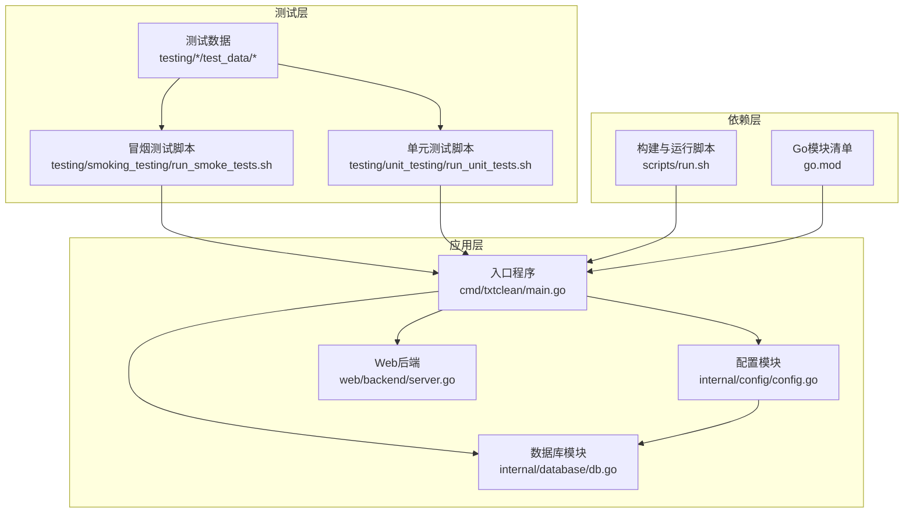
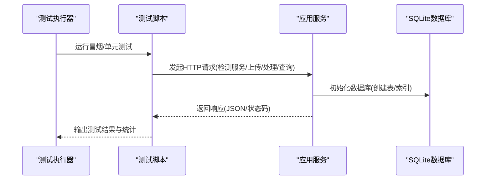
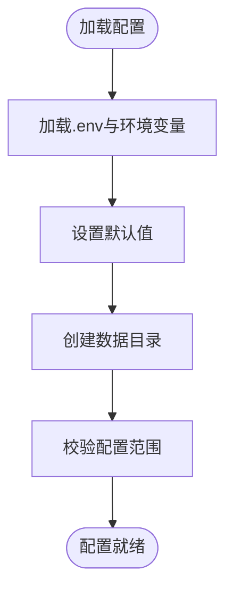
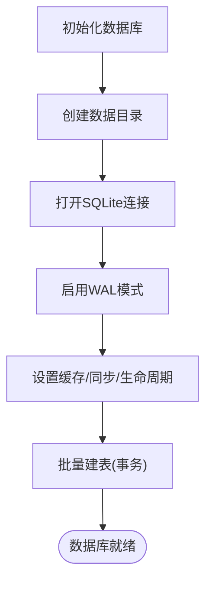
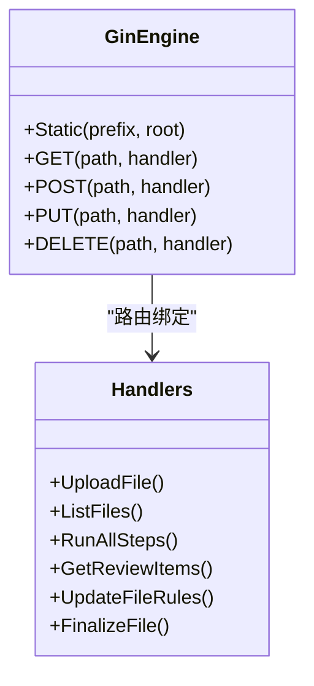
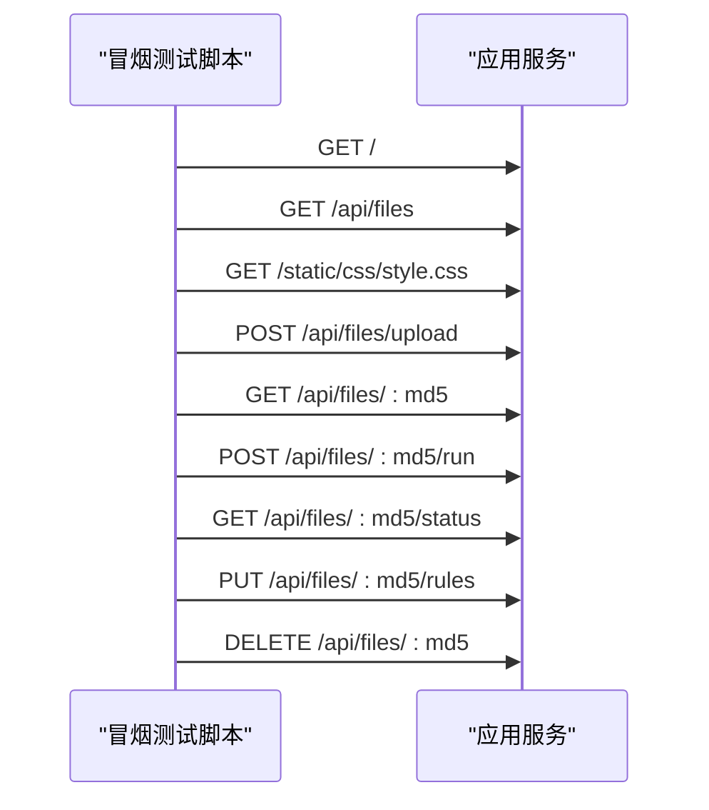
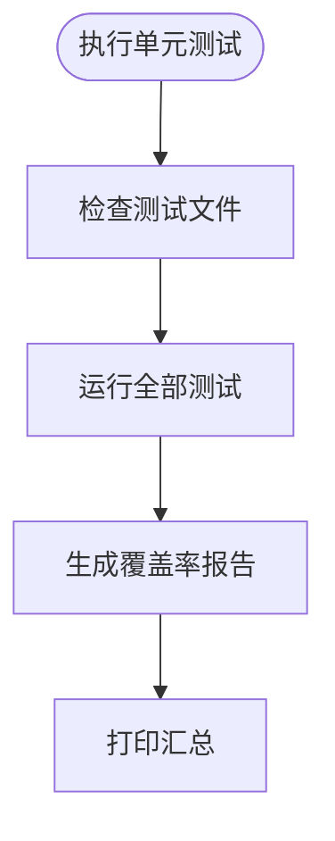
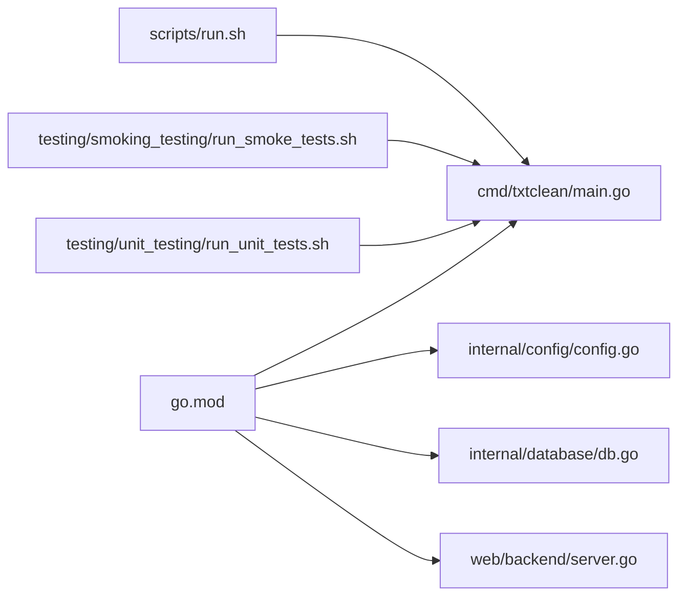

# 测试环境管理

<cite>
**本文引用的文件**
- [go.mod](file://go.mod)
- [cmd/txtclean/main.go](file://cmd/txtclean/main.go)
- [internal/config/config.go](file://internal/config/config.go)
- [internal/config/config_test.go](file://internal/config/config_test.go)
- [internal/database/db.go](file://internal/database/db.go)
- [internal/database/db_test.go](file://internal/database/db_test.go)
- [internal/database/chunk_cache_repo.go](file://internal/database/chunk_cache_repo.go)
- [internal/database/review_repo.go](file://internal/database/review_repo.go)
- [internal/database/version_repo.go](file://internal/database/version_repo.go)
- [internal/database/log_repo.go](file://internal/database/log_repo.go)
- [web/backend/server.go](file://web/backend/server.go)
- [scripts/run.sh](file://scripts/run.sh)
- [testing/smoking_testing/run_smoke_tests.sh](file://testing/smoking_testing/run_smoke_tests.sh)
- [testing/unit_testing/run_unit_tests.sh](file://testing/unit_testing/run_unit_tests.sh)
- [testing/smoking_testing/test_data/sample.txt](file://testing/smoking_testing/test_data/sample.txt)
- [testing/unit_testing/test_data/utf8_text.txt](file://testing/unit_testing/test_data/utf8_text.txt)
</cite>

## 目录
1. [简介](#简介)
2. [项目结构](#项目结构)
3. [核心组件](#核心组件)
4. [架构总览](#架构总览)
5. [详细组件分析](#详细组件分析)
6. [依赖关系分析](#依赖关系分析)
7. [性能考虑](#性能考虑)
8. [故障排除指南](#故障排除指南)
9. [结论](#结论)
10. [附录](#附录)

## 简介
本文件面向txtCleaning项目的测试环境管理，目标是帮助测试工程师与开发人员建立稳定、可重复、可隔离且可维护的测试环境。文档覆盖以下方面：
- 测试环境搭建与配置要求
- 测试数据的准备、存储与管理
- 测试依赖安装与配置（Go测试工具与第三方库）
- 测试环境隔离策略
- 测试数据库初始化与清理
- 测试环境备份与恢复策略
- 测试环境版本管理与升级流程
- 故障排除与性能优化指南
- 安全配置与访问控制

## 项目结构
项目采用按功能域划分的层次化组织方式，测试相关的关键位置如下：
- 测试脚本：位于testing目录，包含冒烟测试与单元测试脚本
- 配置与数据库：位于internal目录，提供配置加载与SQLite数据库初始化
- Web后端：位于web/backend，提供HTTP API与静态资源
- 启动入口：cmd/txtclean/main.go负责加载配置、初始化数据库并启动HTTP服务

**图示来源**
- [cmd/txtclean/main.go:18-61](file://cmd/txtclean/main.go#L18-L61)
- [internal/config/config.go:49-122](file://internal/config/config.go#L49-L122)
- [internal/database/db.go:15-69](file://internal/database/db.go#L15-L69)
- [web/backend/server.go:10-57](file://web/backend/server.go#L10-L57)
- [go.mod:1-54](file://go.mod#L1-54)
- [scripts/run.sh:1-14](file://scripts/run.sh#L1-L14)

**章节来源**
- [cmd/txtclean/main.go:18-61](file://cmd/txtclean/main.go#L18-L61)
- [internal/config/config.go:49-122](file://internal/config/config.go#L49-L122)
- [internal/database/db.go:15-69](file://internal/database/db.go#L15-L69)
- [web/backend/server.go:10-57](file://web/backend/server.go#L10-L57)
- [go.mod:1-54](file://go.mod#L1-54)
- [scripts/run.sh:1-14](file://scripts/run.sh#L1-L14)

## 核心组件
- 配置加载与校验：负责从环境变量与.env文件加载配置，创建必要的数据目录，并进行参数范围校验
- 数据库初始化：基于SQLite，启用WAL模式、设置缓存与同步策略，创建表结构与索引
- Web后端：提供REST API与静态资源，支持跨域访问
- 测试脚本：冒烟测试脚本验证服务可用性、API根路径、静态资源、文件上传与处理流程；单元测试脚本执行Go测试并生成覆盖率报告
- 测试数据：提供样本文本文件，用于冒烟测试与单元测试

**章节来源**
- [internal/config/config.go:49-122](file://internal/config/config.go#L49-L122)
- [internal/database/db.go:15-69](file://internal/database/db.go#L15-L69)
- [web/backend/server.go:10-57](file://web/backend/server.go#L10-L57)
- [testing/smoking_testing/run_smoke_tests.sh:1-345](file://testing/smoking_testing/run_smoke_tests.sh#L1-L345)
- [testing/unit_testing/run_unit_tests.sh:1-168](file://testing/unit_testing/run_unit_tests.sh#L1-L168)
- [testing/smoking_testing/test_data/sample.txt:1-12](file://testing/smoking_testing/test_data/sample.txt#L1-L12)
- [testing/unit_testing/test_data/utf8_text.txt:1-12](file://testing/unit_testing/test_data/utf8_text.txt#L1-L12)

## 架构总览
测试环境由“测试脚本-应用服务-数据库”三层组成。测试脚本通过HTTP与应用交互，应用服务加载配置、初始化数据库并提供API；数据库采用SQLite并在内存或临时目录中运行，确保测试隔离。

**图示来源**
- [testing/smoking_testing/run_smoke_tests.sh:55-345](file://testing/smoking_testing/run_smoke_tests.sh#L55-L345)
- [cmd/txtclean/main.go:18-61](file://cmd/txtclean/main.go#L18-L61)
- [internal/database/db.go:15-69](file://internal/database/db.go#L15-L69)

## 详细组件分析

### 配置模块（config）
- 职责：加载环境变量与.env文件，设置默认值，创建数据目录，校验配置范围
- 关键点：
  - 支持从可执行文件目录与工作目录加载.env
  - 自动创建数据目录（uploads/backups/temp）
  - 对端口、相似度阈值、温度等参数进行范围校验
- 测试要点：通过环境变量覆盖默认值，验证解析与回退逻辑

**图示来源**
- [internal/config/config.go:49-122](file://internal/config/config.go#L49-L122)

**章节来源**
- [internal/config/config.go:49-122](file://internal/config/config.go#L49-L122)
- [internal/config/config_test.go:8-161](file://internal/config/config_test.go#L8-L161)

### 数据库模块（database）
- 职责：初始化SQLite连接与表结构，提供文件、版本、审核项、处理日志等仓储操作
- 关键点：
  - 启用WAL模式、设置缓存大小与同步级别
  - 通过事务批量建表，确保原子性
  - 提供块缓存、重试队列、提示词版本等高级特性
- 测试要点：使用临时目录初始化数据库，测试CRUD与事务一致性

**图示来源**
- [internal/database/db.go:15-69](file://internal/database/db.go#L15-L69)

**章节来源**
- [internal/database/db.go:15-69](file://internal/database/db.go#L15-L69)
- [internal/database/db_test.go:9-511](file://internal/database/db_test.go#L9-L511)

### Web后端（server）
- 职责：注册路由、启用CORS、提供静态资源与REST API
- 关键点：允许本地开发源，暴露文件上传、处理、审核、规则管理等接口

**图示来源**
- [web/backend/server.go:10-57](file://web/backend/server.go#L10-L57)

**章节来源**
- [web/backend/server.go:10-57](file://web/backend/server.go#L10-L57)

### 测试脚本（冒烟测试）
- 职责：验证服务可用性、API根路径、静态资源、文件上传/下载/删除、处理流程、规则管理
- 关键点：通过curl发起HTTP请求，解析响应，统计通过率与失败原因

**图示来源**
- [testing/smoking_testing/run_smoke_tests.sh:55-345](file://testing/smoking_testing/run_smoke_tests.sh#L55-L345)

**章节来源**
- [testing/smoking_testing/run_smoke_tests.sh:1-345](file://testing/smoking_testing/run_smoke_tests.sh#L1-L345)
- [testing/smoking_testing/test_data/sample.txt:1-12](file://testing/smoking_testing/test_data/sample.txt#L1-L12)

### 测试脚本（单元测试）
- 职责：执行Go测试、生成覆盖率报告
- 关键点：支持全模块测试与指定模块测试，统计通过/失败数量

**图示来源**
- [testing/unit_testing/run_unit_tests.sh:79-168](file://testing/unit_testing/run_unit_tests.sh#L79-L168)

**章节来源**
- [testing/unit_testing/run_unit_tests.sh:1-168](file://testing/unit_testing/run_unit_tests.sh#L1-L168)
- [testing/unit_testing/test_data/utf8_text.txt:1-12](file://testing/unit_testing/test_data/utf8_text.txt#L1-L12)

## 依赖关系分析
- Go模块依赖：项目使用Gin、SQLite驱动、自然语言处理与文本处理库等
- 运行脚本：通过go mod tidy/verify与go build启动应用
- 测试脚本：直接依赖curl与Go测试框架

**图示来源**
- [go.mod:1-54](file://go.mod#L1-54)
- [scripts/run.sh:5-10](file://scripts/run.sh#L5-L10)
- [cmd/txtclean/main.go:18-26](file://cmd/txtclean/main.go#L18-L26)

**章节来源**
- [go.mod:1-54](file://go.mod#L1-54)
- [scripts/run.sh:1-14](file://scripts/run.sh#L1-L14)
- [cmd/txtclean/main.go:18-26](file://cmd/txtclean/main.go#L18-L26)

## 性能考虑
- 数据库并发与性能：
  - 启用WAL模式提升并发读写能力
  - 设置缓存大小与同步级别平衡性能与安全性
  - 通过索引优化查询（文件MD5、版本链、审核项状态等）
- 处理日志与缓存：
  - 块缓存与重试队列减少重复计算与网络调用
  - 定期清理旧缓存与完成的重试记录，避免数据库膨胀
- API与前端：
  - CORS配置允许本地开发源，便于测试
  - 静态资源托管简化前端调试

**章节来源**
- [internal/database/db.go:29-59](file://internal/database/db.go#L29-L59)
- [internal/database/chunk_cache_repo.go:392-420](file://internal/database/chunk_cache_repo.go#L392-L420)
- [web/backend/server.go:14-20](file://web/backend/server.go#L14-L20)

## 故障排除指南
- 服务不可用：
  - 检查端口占用与进程状态
  - 使用脚本检测服务根路径与API根路径
- 数据库初始化失败：
  - 确认数据目录可写
  - 检查SQLite驱动与WAL模式启用是否成功
- 测试失败定位：
  - 查看冒烟测试输出中的响应内容与HTTP状态码
  - 单元测试输出包含详细错误信息与堆栈
- 配置问题：
  - 确认.env文件存在且字段正确
  - 校验端口、阈值、温度等参数范围

**章节来源**
- [testing/smoking_testing/run_smoke_tests.sh:55-109](file://testing/smoking_testing/run_smoke_tests.sh#L55-L109)
- [internal/config/config.go:190-203](file://internal/config/config.go#L190-L203)
- [internal/database/db.go:15-69](file://internal/database/db.go#L15-L69)

## 结论
本测试环境管理文档提供了从搭建、隔离、初始化、清理、备份恢复、版本管理到故障排除与性能优化的完整实践指南。通过明确的脚本、清晰的配置与数据库策略，以及完善的测试数据管理，能够有效保障测试的稳定性与可重复性。

## 附录

### 测试环境搭建步骤与配置要求
- 安装与依赖
  - 安装Go并配置模块：参考go.mod中的依赖声明
  - 使用构建脚本一键构建与运行：scripts/run.sh
- 启动应用
  - 通过入口程序加载配置并初始化数据库
  - 启动HTTP服务，监听配置端口
- 配置文件
  - 支持从可执行文件目录与工作目录加载.env
  - 自动创建数据目录（uploads/backups/temp）

**章节来源**
- [go.mod:1-54](file://go.mod#L1-54)
- [scripts/run.sh:5-10](file://scripts/run.sh#L5-L10)
- [cmd/txtclean/main.go:18-26](file://cmd/txtclean/main.go#L18-L26)
- [internal/config/config.go:49-122](file://internal/config/config.go#L49-L122)

### 测试数据准备、存储与管理
- 冒烟测试数据：sample.txt位于testing/smoking_testing/test_data/
- 单元测试数据：utf8_text.txt位于testing/unit_testing/test_data/
- 存储位置：由配置模块自动创建的DataDir下的子目录

**章节来源**
- [testing/smoking_testing/test_data/sample.txt:1-12](file://testing/smoking_testing/test_data/sample.txt#L1-L12)
- [testing/unit_testing/test_data/utf8_text.txt:1-12](file://testing/unit_testing/test_data/utf8_text.txt#L1-L12)
- [internal/config/config.go:116-119](file://internal/config/config.go#L116-L119)

### 测试依赖安装与配置
- Go测试工具：go test、go tool cover
- 第三方库：Gin、SQLite驱动、文本处理与NLP库等
- 运行脚本：scripts/run.sh执行go mod tidy/verify与go build

**章节来源**
- [testing/unit_testing/run_unit_tests.sh:118-127](file://testing/unit_testing/run_unit_tests.sh#L118-L127)
- [go.mod:5-13](file://go.mod#L5-L13)
- [scripts/run.sh:5-10](file://scripts/run.sh#L5-L10)

### 测试环境隔离策略
- 数据库隔离：每个测试使用独立临时目录初始化SQLite
- 配置隔离：通过环境变量覆盖默认配置，避免全局污染
- 并发隔离：数据库连接池设置为单连接，确保写入顺序执行

**章节来源**
- [internal/database/db_test.go:9-22](file://internal/database/db_test.go#L9-L22)
- [internal/config/config.go:71-122](file://internal/config/config.go#L71-L122)
- [internal/database/db.go:54-58](file://internal/database/db.go#L54-L58)

### 测试数据库初始化与清理
- 初始化：创建数据目录、打开SQLite、启用WAL、建表与索引
- 清理：优雅关闭时执行WAL检查点，删除旧缓存与完成的重试记录

**章节来源**
- [internal/database/db.go:15-69](file://internal/database/db.go#L15-L69)
- [internal/database/chunk_cache_repo.go:392-420](file://internal/database/chunk_cache_repo.go#L392-L420)

### 测试环境备份与恢复策略
- 备份：配置中包含备份保留天数参数，建议定期导出数据库文件
- 恢复：停止服务后替换数据库文件，重启应用

**章节来源**
- [internal/config/config.go:19-20](file://internal/config/config.go#L19-L20)

### 测试环境版本管理与升级流程
- 版本标识：通过Git标签或分支管理
- 升级流程：更新go.mod依赖，运行scripts/run.sh构建，验证冒烟测试与单元测试

**章节来源**
- [go.mod:1-54](file://go.mod#L1-54)
- [scripts/run.sh:5-10](file://scripts/run.sh#L5-L10)

### 测试环境安全配置与访问控制
- CORS：允许本地开发源，生产环境需收紧
- 静态资源：托管于Web后端，注意路径与权限
- 配置敏感信息：通过.env管理，避免硬编码

**章节来源**
- [web/backend/server.go:14-20](file://web/backend/server.go#L14-L20)
- [internal/config/config.go:49-122](file://internal/config/config.go#L49-L122)