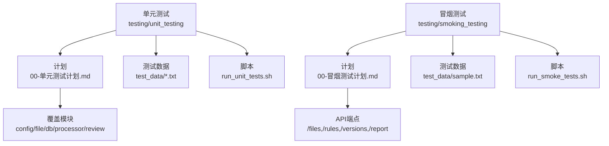
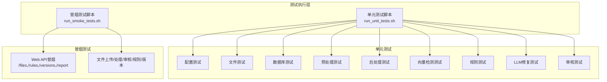
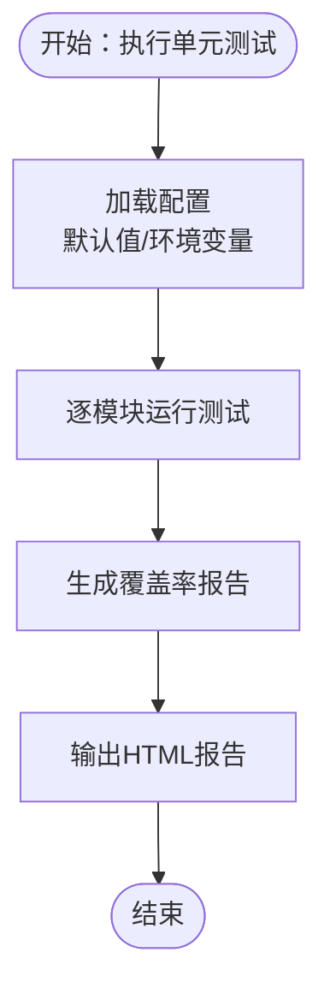
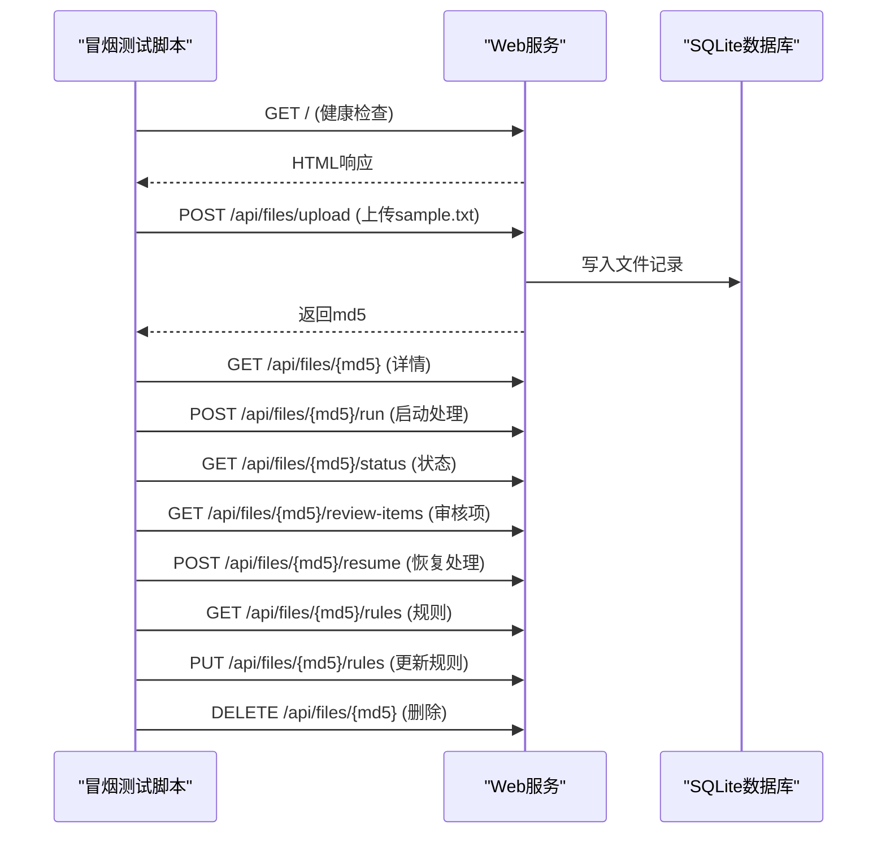
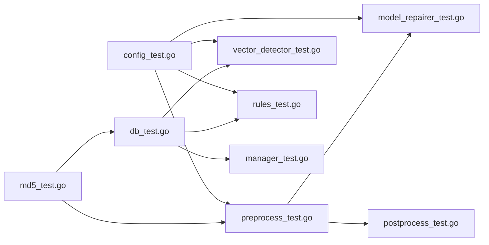

# 测试策略

<cite>
**本文引用的文件**
- [单元测试计划.md](file://testing/unit_testing/00-单元测试计划.md)
- [冒烟测试计划.md](file://testing/smoking_testing/00-冒烟测试计划.md)
- [run_unit_tests.sh](file://testing/unit_testing/run_unit_tests.sh)
- [run_smoke_tests.sh](file://testing/smoking_testing/run_smoke_tests.sh)
- [config_test.go](file://internal/config/config_test.go)
- [db_test.go](file://internal/database/db_test.go)
- [md5_test.go](file://internal/file/md5_test.go)
- [parser_test.go](file://internal/file/parser_test.go)
- [preprocess_test.go](file://internal/processor/preprocess/preprocess_test.go)
- [postprocess_test.go](file://internal/processor/postprocess/postprocess_test.go)
- [vector_detector_test.go](file://internal/processor/vector_detector_test.go)
- [rules_test.go](file://internal/processor/rules/rules_test.go)
- [model_repairer_test.go](file://internal/processor/model_repairer_test.go)
- [manager_test.go](file://internal/review/manager/manager_test.go)
- [utf8_text.txt](file://testing/unit_testing/test_data/utf8_text.txt)
</cite>

## 目录
1. [引言](#引言)
2. [项目结构](#项目结构)
3. [核心组件](#核心组件)
4. [架构总览](#架构总览)
5. [详细组件分析](#详细组件分析)
6. [依赖关系分析](#依赖关系分析)
7. [性能考虑](#性能考虑)
8. [故障排查指南](#故障排查指南)
9. [结论](#结论)
10. [附录](#附录)

## 引言
本测试策略面向 VoidText 项目，旨在建立完善的测试体系，覆盖单元测试、冒烟测试与集成测试，明确测试覆盖率与质量标准，规范测试数据与环境准备，提供自动化测试脚本的使用与维护方法，并给出测试用例设计与执行流程、测试结果分析与缺陷跟踪建议、性能与压力测试方法以及持续集成配置要点与测试环境搭建与管理。

## 项目结构
测试相关目录与文件分布如下：
- testing/unit_testing：单元测试计划、测试数据与执行脚本
- testing/smoking_testing：冒烟测试计划、测试数据与执行脚本
- internal/*/test.go：各模块单元测试文件
- testing/unit_testing/test_data：单元测试使用的样本文本

**图表来源**
- [单元测试计划.md:1-163](file://testing/unit_testing/00-单元测试计划.md#L1-L163)
- [冒烟测试计划.md:1-138](file://testing/smoking_testing/00-冒烟测试计划.md#L1-L138)
- [run_unit_tests.sh:1-168](file://testing/unit_testing/run_unit_tests.sh#L1-L168)
- [run_smoke_tests.sh:1-345](file://testing/smoking_testing/run_smoke_tests.sh#L1-L345)

**章节来源**
- [单元测试计划.md:1-163](file://testing/unit_testing/00-单元测试计划.md#L1-L163)
- [冒烟测试计划.md:1-138](file://testing/smoking_testing/00-冒烟测试计划.md#L1-L138)

## 核心组件
- 配置模块：负责从环境变量加载配置并校验有效性，单元测试覆盖默认值、环境变量覆盖、数值/布尔/浮点解析与校验。
- 文件模块：MD5 计算、文件名解析（支持多种分隔符）、扩展名提取。
- 数据库模块：SQLite 初始化、文件/版本/日志/审核项 CRUD、状态与规则更新、进度统计。
- 预处理模块：编码检测与修复（GBK/UTF-8）、广告移除、特殊字符清理、空白规范化。
- 后处理模块：格式优化（段落、空白）、章节组织、标点规范化。
- 向量检测模块：段落切分、相似度计算（余弦）、去重检测、阈值过滤。
- 规则模块：规则加载/增删改查、应用规则、持久化。
- LLM 修复模块：段落切分、本地修复（常见错别字）、开关控制。
- 审核模块：会话创建、状态变更（通过/拒绝/编辑/恢复）、批量操作、进度统计。

**章节来源**
- [config_test.go:1-161](file://internal/config/config_test.go#L1-L161)
- [md5_test.go:1-83](file://internal/file/md5_test.go#L1-L83)
- [parser_test.go:1-104](file://internal/file/parser_test.go#L1-L104)
- [db_test.go:1-511](file://internal/database/db_test.go#L1-L511)
- [preprocess_test.go:1-169](file://internal/processor/preprocess/preprocess_test.go#L1-L169)
- [postprocess_test.go:1-99](file://internal/processor/postprocess/postprocess_test.go#L1-L99)
- [vector_detector_test.go:1-182](file://internal/processor/vector_detector_test.go#L1-L182)
- [rules_test.go:1-253](file://internal/processor/rules/rules_test.go#L1-L253)
- [model_repairer_test.go:1-180](file://internal/processor/model_repairer_test.go#L1-L180)
- [manager_test.go:1-204](file://internal/review/manager/manager_test.go#L1-L204)

## 架构总览
测试架构围绕“自动化脚本 + 模块化单元测试 + 端到端冒烟测试”展开，单元测试使用 Go 内置 testing 包，冒烟测试通过 curl 调用 Web API，两者均在 CI 中可直接执行。

**图表来源**
- [run_unit_tests.sh:1-168](file://testing/unit_testing/run_unit_tests.sh#L1-L168)
- [run_smoke_tests.sh:1-345](file://testing/smoking_testing/run_smoke_tests.sh#L1-L345)
- [config_test.go:1-161](file://internal/config/config_test.go#L1-L161)
- [db_test.go:1-511](file://internal/database/db_test.go#L1-L511)
- [md5_test.go:1-83](file://internal/file/md5_test.go#L1-L83)
- [parser_test.go:1-104](file://internal/file/parser_test.go#L1-L104)
- [preprocess_test.go:1-169](file://internal/processor/preprocess/preprocess_test.go#L1-L169)
- [postprocess_test.go:1-99](file://internal/processor/postprocess/postprocess_test.go#L1-L99)
- [vector_detector_test.go:1-182](file://internal/processor/vector_detector_test.go#L1-L182)
- [rules_test.go:1-253](file://internal/processor/rules/rules_test.go#L1-L253)
- [model_repairer_test.go:1-180](file://internal/processor/model_repairer_test.go#L1-L180)
- [manager_test.go:1-204](file://internal/review/manager/manager_test.go#L1-L204)

## 详细组件分析

### 单元测试策略
- 覆盖率目标（摘自单元测试计划）
  - 配置模块：≥90%
  - 文件模块：≥90%
  - 数据库模块：≥80%
  - 预处理模块：≥85%
  - 向量检测模块：≥90%
  - 规则模块：≥90%
  - 审核模块：≥85%
- 执行方式
  - 命令行：在项目根目录执行 go test -v ./...
  - 脚本：进入 testing/unit_testing 目录，赋予执行权限后 ./run_unit_tests.sh
  - 生成覆盖率报告：脚本内置 go test -coverprofile 与 go tool cover
- 测试数据
  - utf8_text.txt：UTF-8 编码文本，用于编码检测与清洗流程验证
- 关键测试点
  - 配置：默认值、环境变量覆盖、数值/布尔/浮点解析、校验
  - 文件：MD5 一致性、文件名解析（多种分隔符）、扩展名提取
  - 数据库：初始化、CRUD、状态/规则更新、审核项批量操作、版本链、日志
  - 预处理：编码检测/修复、广告移除、特殊字符清理、空白规范化
  - 后处理：格式优化、章节组织、标点规范化
  - 向量检测：段落切分、相似度计算、去重检测、阈值过滤
  - 规则：增删改查、应用规则、持久化
  - LLM 修复：段落切分、本地修复、开关控制
  - 审核：会话创建、状态变更、批量操作、进度统计

**图表来源**
- [run_unit_tests.sh:118-127](file://testing/unit_testing/run_unit_tests.sh#L118-L127)
- [单元测试计划.md:145-156](file://testing/unit_testing/00-单元测试计划.md#L145-L156)

**章节来源**
- [单元测试计划.md:1-163](file://testing/unit_testing/00-单元测试计划.md#L1-L163)
- [run_unit_tests.sh:1-168](file://testing/unit_testing/run_unit_tests.sh#L1-L168)
- [utf8_text.txt:1-12](file://testing/unit_testing/test_data/utf8_text.txt#L1-L12)
- [config_test.go:1-161](file://internal/config/config_test.go#L1-L161)
- [md5_test.go:1-83](file://internal/file/md5_test.go#L1-L83)
- [parser_test.go:1-104](file://internal/file/parser_test.go#L1-L104)
- [db_test.go:1-511](file://internal/database/db_test.go#L1-L511)
- [preprocess_test.go:1-169](file://internal/processor/preprocess/preprocess_test.go#L1-L169)
- [postprocess_test.go:1-99](file://internal/processor/postprocess/postprocess_test.go#L1-L99)
- [vector_detector_test.go:1-182](file://internal/processor/vector_detector_test.go#L1-L182)
- [rules_test.go:1-253](file://internal/processor/rules/rules_test.go#L1-L253)
- [model_repairer_test.go:1-180](file://internal/processor/model_repairer_test.go#L1-L180)
- [manager_test.go:1-204](file://internal/review/manager/manager_test.go#L1-L204)

### 冒烟测试策略
- 测试范围与环境
  - 服务地址：http://localhost:8080
  - 数据库：SQLite（data/cleaning.db）
  - 测试前置：服务已启动、data 目录存在、.env 配置（可选 LLM_API_KEY）
- 测试用例
  - 服务健康检查：/、/api/files、静态资源
  - 文件上传与处理：上传、列表、详情、内容、下载、删除
  - 处理流程：启动处理、状态查询、审核项、恢复处理
  - 审核操作：通过/拒绝/编辑/恢复、批量操作
  - 规则管理：获取/更新、列出、新增、删除
  - 版本与报告：版本链、处理报告
- 执行方式
  - 进入 testing/smoking_testing 目录，赋予执行权限后 ./run_smoke_tests.sh
- 预期输出
  - 统计通过/失败数量与通过率，失败时退出码非 0

**图表来源**
- [冒烟测试计划.md:23-85](file://testing/smoking_testing/00-冒烟测试计划.md#L23-L85)
- [run_smoke_tests.sh:304-345](file://testing/smoking_testing/run_smoke_tests.sh#L304-L345)

**章节来源**
- [冒烟测试计划.md:1-138](file://testing/smoking_testing/00-冒烟测试计划.md#L1-L138)
- [run_smoke_tests.sh:1-345](file://testing/smoking_testing/run_smoke_tests.sh#L1-L345)

### 集成测试策略
- 目标：验证端到端业务流程，包括文件上传、处理、审核、规则与版本链联动。
- 方法：基于冒烟测试脚本，结合真实 SQLite 数据库与数据目录，覆盖完整处理链路。
- 数据：使用 testing/smoking_testing/test_data/sample.txt 作为输入。
- 关注点：处理状态流转、审核项生成与变更、规则动态生效、版本链生成与查询。

**章节来源**
- [冒烟测试计划.md:86-138](file://testing/smoking_testing/00-冒烟测试计划.md#L86-L138)
- [run_smoke_tests.sh:1-345](file://testing/smoking_testing/run_smoke_tests.sh#L1-L345)

### 测试用例设计与执行流程
- 设计原则
  - 表驱动测试：提升可维护性与可扩展性
  - 边界与异常：空输入、非法配置、文件不存在、规则无效等
  - 隔离与清理：使用临时目录与临时文件，避免副作用
- 执行流程
  - 单元测试：go test -v ./... 或 ./run_unit_tests.sh
  - 冒烟测试：./run_smoke_tests.sh
  - 覆盖率：脚本生成 coverage.html，按模块目标评估

**章节来源**
- [单元测试计划.md:157-163](file://testing/unit_testing/00-单元测试计划.md#L157-L163)
- [run_unit_tests.sh:1-168](file://testing/unit_testing/run_unit_tests.sh#L1-L168)

### 测试结果分析与缺陷跟踪
- 结果分析
  - 单元测试：统计模块通过率，结合覆盖率报告定位低覆盖区域
  - 冒烟测试：关注服务可用性、API 响应与业务流程连通性
- 缺陷跟踪
  - 用例编号与优先级：便于追踪与回归
  - 日志与输出：脚本输出包含详细失败信息，便于定位问题

**章节来源**
- [run_unit_tests.sh:129-145](file://testing/unit_testing/run_unit_tests.sh#L129-L145)
- [run_smoke_tests.sh:279-301](file://testing/smoking_testing/run_smoke_tests.sh#L279-L301)

### 性能测试与压力测试
- 性能指标
  - 处理吞吐：单位时间内处理的文件数量
  - 延迟：上传、处理、审核项生成与状态查询的平均/尾延迟
  - 资源占用：CPU、内存、磁盘 IO
- 方法
  - 基准测试：使用 go test -bench=. 对关键函数进行基准测试
  - 压力测试：构造大规模文本与并发上传/处理请求，观察服务稳定性与资源上限
  - 场景模拟：模拟多用户同时上传、频繁规则更新与审核操作
- 工具建议
  - 基准：go test -bench=.
  - 压力：wrk、ab 或自定义并发脚本

[本节为通用指导，无需具体文件分析]

### 自动化测试脚本使用与维护
- 单元测试脚本
  - 功能：执行全部或指定模块测试、统计结果、生成覆盖率报告
  - 维护：新增模块测试时，确保 *_test.go 文件命名规范；更新覆盖率目标时同步单元测试计划
- 冒烟测试脚本
  - 功能：检测服务可用性、上传/处理/审核/规则/版本链全流程
  - 维护：API 变更时同步更新测试用例与断言；新增端点时补充测试

**章节来源**
- [run_unit_tests.sh:1-168](file://testing/unit_testing/run_unit_tests.sh#L1-L168)
- [run_smoke_tests.sh:1-345](file://testing/smoking_testing/run_smoke_tests.sh#L1-L345)

### 测试环境搭建与管理
- 环境要求
  - 服务端口：8080（可配置）
  - 数据目录：data（自动创建）
  - 数据库：SQLite（data/cleaning.db）
  - 配置文件：.env（可选 LLM_API_KEY）
- 搭建步骤
  - 启动服务：go run ./cmd/voidtext/
  - 运行冒烟测试：./run_smoke_tests.sh
  - 运行单元测试：./run_unit_tests.sh
- 管理建议
  - 使用临时目录隔离测试数据
  - 在 CI 中固定服务端口与数据目录，避免冲突

**章节来源**
- [冒烟测试计划.md:9-22](file://testing/smoking_testing/00-冒烟测试计划.md#L9-L22)
- [run_smoke_tests.sh:55-67](file://testing/smoking_testing/run_smoke_tests.sh#L55-L67)

## 依赖关系分析
- 单元测试依赖
  - 配置模块：影响所有依赖配置的模块（预处理、向量检测、规则、LLM 修复）
  - 文件模块：影响数据库与文件系统交互
  - 数据库模块：被文件、审核、版本链等模块依赖
- 冒烟测试依赖
  - Web 层：handlers/files/process/rules/versions
  - 数据层：SQLite 与 data 目录
- 依赖可视化

**图表来源**
- [config_test.go:1-161](file://internal/config/config_test.go#L1-L161)
- [md5_test.go:1-83](file://internal/file/md5_test.go#L1-L83)
- [db_test.go:1-511](file://internal/database/db_test.go#L1-L511)
- [preprocess_test.go:1-169](file://internal/processor/preprocess/preprocess_test.go#L1-L169)
- [postprocess_test.go:1-99](file://internal/processor/postprocess/postprocess_test.go#L1-L99)
- [vector_detector_test.go:1-182](file://internal/processor/vector_detector_test.go#L1-L182)
- [rules_test.go:1-253](file://internal/processor/rules/rules_test.go#L1-L253)
- [model_repairer_test.go:1-180](file://internal/processor/model_repairer_test.go#L1-L180)
- [manager_test.go:1-204](file://internal/review/manager/manager_test.go#L1-L204)

**章节来源**
- [config_test.go:1-161](file://internal/config/config_test.go#L1-L161)
- [db_test.go:1-511](file://internal/database/db_test.go#L1-L511)
- [md5_test.go:1-83](file://internal/file/md5_test.go#L1-L83)
- [parser_test.go:1-104](file://internal/file/parser_test.go#L1-L104)
- [preprocess_test.go:1-169](file://internal/processor/preprocess/preprocess_test.go#L1-L169)
- [postprocess_test.go:1-99](file://internal/processor/postprocess/postprocess_test.go#L1-L99)
- [vector_detector_test.go:1-182](file://internal/processor/vector_detector_test.go#L1-L182)
- [rules_test.go:1-253](file://internal/processor/rules/rules_test.go#L1-L253)
- [model_repairer_test.go:1-180](file://internal/processor/model_repairer_test.go#L1-L180)
- [manager_test.go:1-204](file://internal/review/manager/manager_test.go#L1-L204)

## 性能考虑
- 单元测试性能
  - 使用内存数据库与临时文件，避免磁盘 IO
  - 控制测试规模，避免过大数据集影响测试时长
- 冒烟测试性能
  - 合理设置等待时间（如处理状态轮询），避免过度请求
  - 并发控制，避免对服务造成过大压力
- 基准与压力
  - 通过基准测试识别热点函数，针对性优化
  - 压力测试验证服务在高负载下的稳定性与资源上限

[本节为通用指导，无需具体文件分析]

## 故障排查指南
- 单元测试常见问题
  - 未找到测试文件：确认 *_test.go 命名与目录结构
  - 覆盖率报告缺失：检查脚本执行权限与 go tool cover 可用性
- 冒烟测试常见问题
  - 服务不可用：确认服务已启动且端口正确
  - 上传失败：检查文件大小限制与数据目录权限
  - 处理卡住：尝试恢复处理或重启服务
  - API 错误：检查数据库文件完整性，必要时删除后重启

**章节来源**
- [run_unit_tests.sh:50-77](file://testing/unit_testing/run_unit_tests.sh#L50-L77)
- [run_smoke_tests.sh:55-67](file://testing/smoking_testing/run_smoke_tests.sh#L55-L67)
- [冒烟测试计划.md:131-138](file://testing/smoking_testing/00-冒烟测试计划.md#L131-L138)

## 结论
本测试策略建立了以单元测试为基础、以冒烟测试为入口的完整测试体系，明确了覆盖率目标与质量标准，提供了自动化脚本的使用与维护方法，并给出了测试数据与环境准备、测试执行流程、结果分析与缺陷跟踪、性能与压力测试方法以及持续集成配置要点。建议在 CI 中集成单元测试与冒烟测试，定期评估覆盖率并持续改进测试用例。

## 附录
- 测试数据清单
  - 单元测试：utf8_text.txt
  - 冒烟测试：sample.txt
- 脚本清单
  - 单元测试：run_unit_tests.sh
  - 冒烟测试：run_smoke_tests.sh

**章节来源**
- [utf8_text.txt:1-12](file://testing/unit_testing/test_data/utf8_text.txt#L1-L12)
- [run_unit_tests.sh:1-168](file://testing/unit_testing/run_unit_tests.sh#L1-L168)
- [run_smoke_tests.sh:1-345](file://testing/smoking_testing/run_smoke_tests.sh#L1-L345)