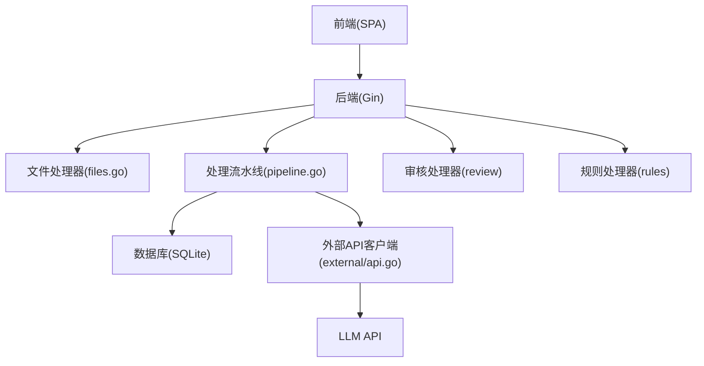
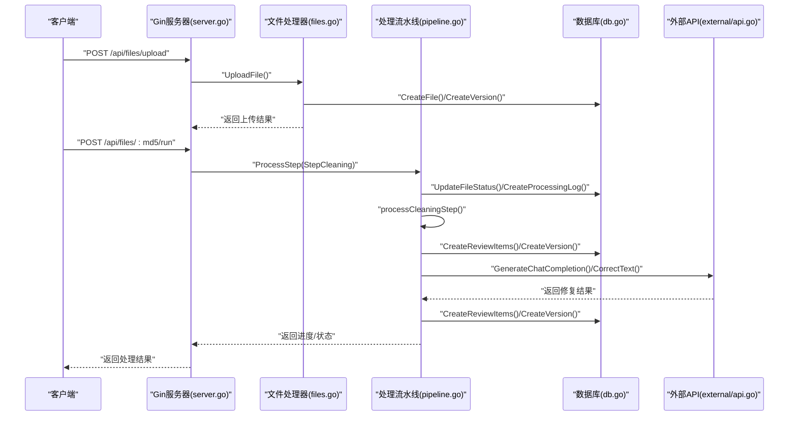
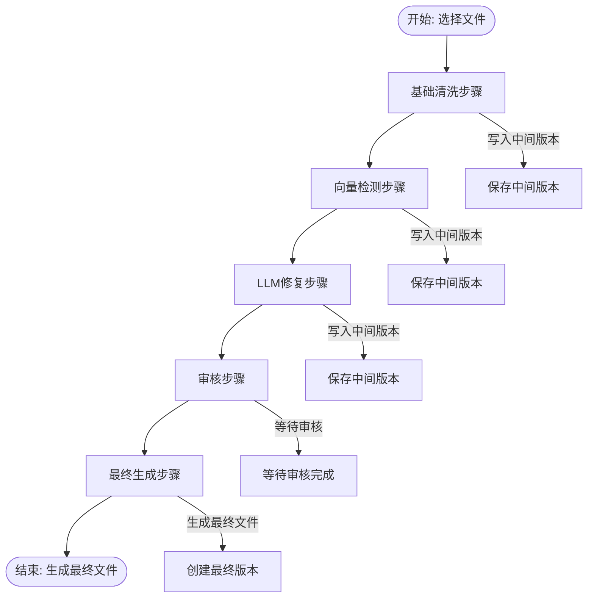
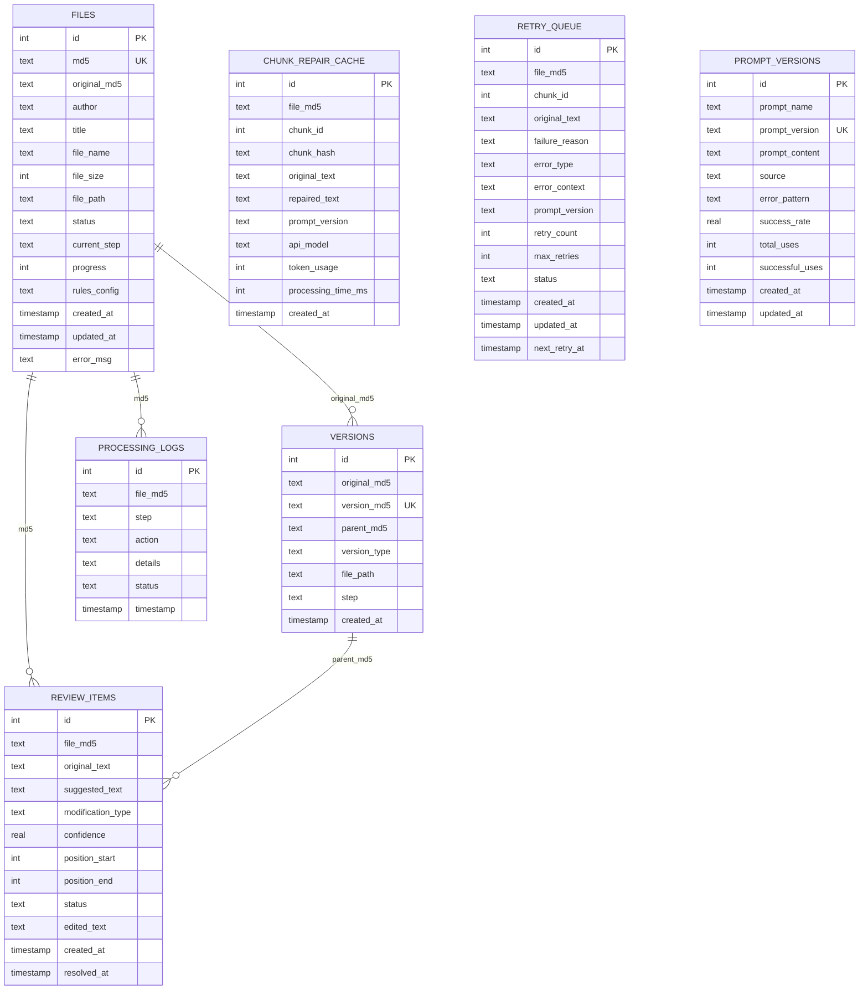
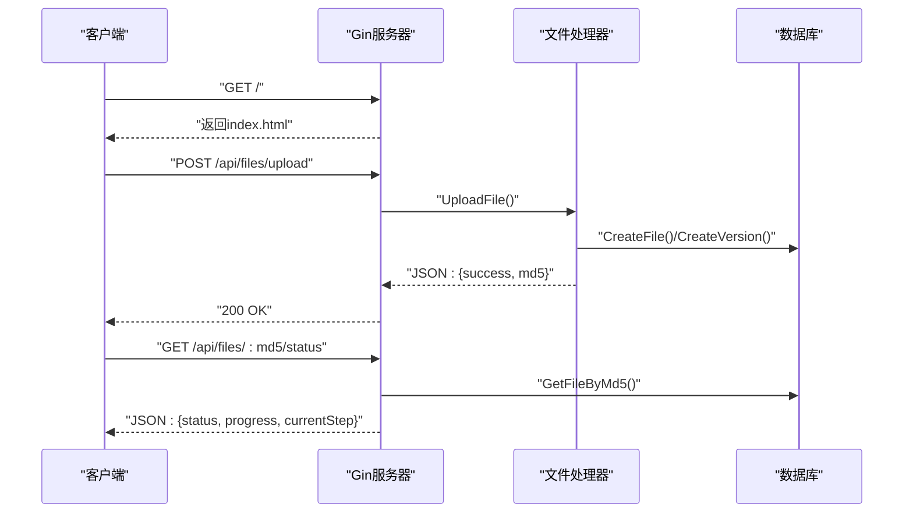
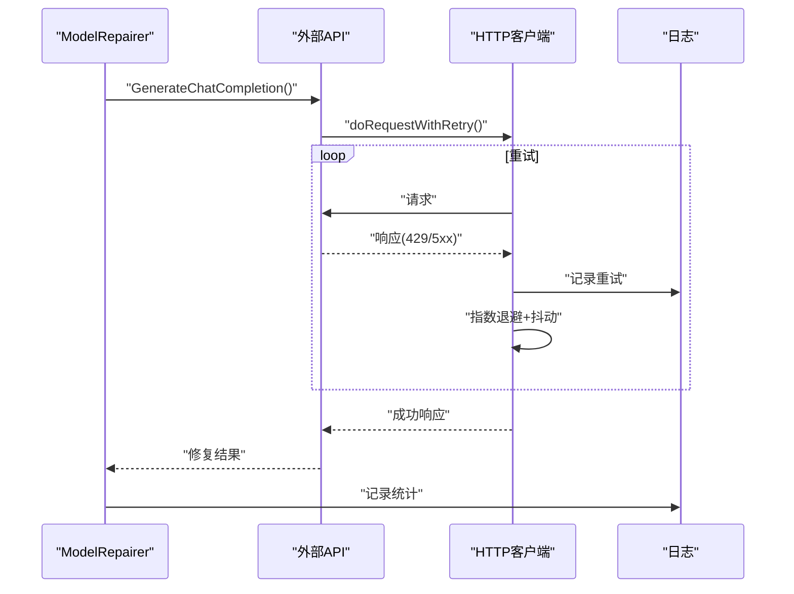
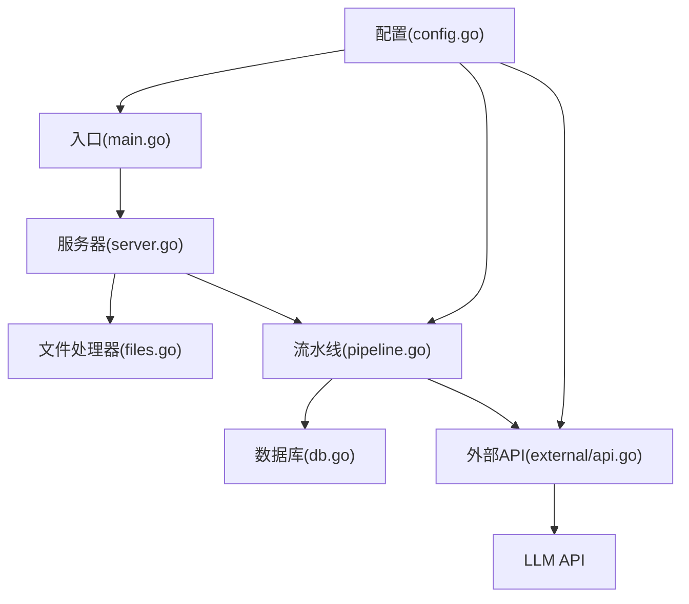

# 集成测试

<cite>
**本文引用的文件**
- [cmd/txtclean/main.go](file://cmd/txtclean/main.go)
- [internal/processor/pipeline.go](file://internal/processor/pipeline.go)
- [internal/database/db.go](file://internal/database/db.go)
- [web/backend/server.go](file://web/backend/server.go)
- [web/backend/handlers/files.go](file://web/backend/handlers/files.go)
- [internal/external/api.go](file://internal/external/api.go)
- [internal/processor/model_repairer.go](file://internal/processor/model_repairer.go)
- [internal/processor/vector_detector.go](file://internal/processor/vector_detector.go)
- [internal/config/config.go](file://internal/config/config.go)
- [internal/processor/pipeline_test.go](file://internal/processor/pipeline_test.go)
- [internal/database/db_test.go](file://internal/database/db_test.go)
- [doc/02-系统架构.md](file://doc/02-系统架构.md)
- [testing/smoking_testing/00-冒烟测试计划.md](file://testing/smoking_testing/00-冒烟测试计划.md)
- [scripts/run.sh](file://scripts/run.sh)
</cite>

## 目录
1. [简介](#简介)
2. [项目结构](#项目结构)
3. [核心组件](#核心组件)
4. [架构总览](#架构总览)
5. [详细组件分析](#详细组件分析)
6. [依赖分析](#依赖分析)
7. [性能考虑](#性能考虑)
8. [故障排查指南](#故障排查指南)
9. [结论](#结论)
10. [附录](#附录)

## 简介
本文件面向txtCleaning项目的集成测试，目标是验证模块间交互与端到端流程的正确性，涵盖文本处理流水线、数据库、Web API以及外部API的集成测试方法。文档同时提供事务与一致性验证策略、错误处理测试、外部API模拟与隔离方案、性能与压力测试策略，以及集成测试环境的搭建与管理指南。

## 项目结构
项目采用前后端分离架构，后端由Gin框架提供REST API，内部模块包括配置、数据库、文件处理、处理器流水线、审核管理与外部API客户端。前端为单页应用，通过JavaScript与后端API交互。

图表来源
- [web/backend/server.go:10-57](file://web/backend/server.go#L10-L57)
- [web/backend/handlers/files.go:18-71](file://web/backend/handlers/files.go#L18-L71)
- [internal/processor/pipeline.go:104-158](file://internal/processor/pipeline.go#L104-L158)
- [internal/database/db.go:15-69](file://internal/database/db.go#L15-L69)
- [internal/external/api.go:175-200](file://internal/external/api.go#L175-L200)

章节来源
- [doc/02-系统架构.md:3-31](file://doc/02-系统架构.md#L3-L31)
- [web/backend/server.go:10-57](file://web/backend/server.go#L10-L57)

## 核心组件
- 配置模块：负责加载.env配置并提供全局配置实例，影响各模块行为（如是否启用向量检测、模型修复、外部API等）。
- 数据库模块：基于SQLite，提供文件、版本、审核项、处理日志等表的CRUD与索引，支持WAL模式与连接池优化。
- 处理流水线：五步式文本处理流水线，协调预处理、向量检测、LLM修复、审核应用与最终生成，并维护状态与进度。
- Web API：提供文件上传、处理控制、审核、规则管理、版本与报告等REST接口。
- 外部API客户端：封装HTTP客户端、指数退避重试、错误分类与日志记录，适配LLM API调用。

章节来源
- [internal/config/config.go:14-46](file://internal/config/config.go#L14-L46)
- [internal/database/db.go:15-69](file://internal/database/db.go#L15-L69)
- [internal/processor/pipeline.go:19-25](file://internal/processor/pipeline.go#L19-L25)
- [web/backend/server.go:28-54](file://web/backend/server.go#L28-L54)
- [internal/external/api.go:175-200](file://internal/external/api.go#L175-L200)

## 架构总览
系统通过Gin路由注册API，文件处理器负责上传、状态查询与下载；处理流水线负责按步骤推进并持久化状态；数据库提供事务与索引保障；外部API客户端负责与LLM服务通信并具备重试与退避能力。

图表来源
- [web/backend/server.go:28-54](file://web/backend/server.go#L28-L54)
- [web/backend/handlers/files.go:18-71](file://web/backend/handlers/files.go#L18-L71)
- [internal/processor/pipeline.go:104-158](file://internal/processor/pipeline.go#L104-L158)
- [internal/database/db.go:89-222](file://internal/database/db.go#L89-L222)
- [internal/external/api.go:579-667](file://internal/external/api.go#L579-L667)

## 详细组件分析

### 文本处理流水线集成测试
- 目标：验证五步处理流程的模块间数据传递与状态转换，包括中间版本生成、审核项创建、最终文件生成与版本链。
- 关键点：
  - 步骤推进：GetNextStep与CalculateProgress确保进度与下一步骤正确。
  - 中间版本：saveIntermediateFile写入中间文件并更新files表的filePath。
  - 审核项：向量检测与LLM修复分别创建审核项，processReviewStep等待审核完成。
  - 最终生成：processFinalizingStep合并审核建议，生成最终文件并创建最终版本。
- 测试策略：
  - 使用临时数据目录与内存数据库，模拟真实文件与规则配置。
  - 验证每个步骤的数据库写入、日志记录与文件生成。
  - 验证审核项数量与状态转换，最终版本的父子关系与MD5一致性。

图表来源
- [internal/processor/pipeline.go:160-213](file://internal/processor/pipeline.go#L160-L213)
- [internal/processor/pipeline.go:215-271](file://internal/processor/pipeline.go#L215-L271)
- [internal/processor/pipeline.go:273-376](file://internal/processor/pipeline.go#L273-L376)
- [internal/processor/pipeline.go:436-468](file://internal/processor/pipeline.go#L436-L468)
- [internal/processor/pipeline.go:470-522](file://internal/processor/pipeline.go#L470-L522)
- [internal/processor/pipeline.go:547-579](file://internal/processor/pipeline.go#L547-L579)

章节来源
- [internal/processor/pipeline.go:73-102](file://internal/processor/pipeline.go#L73-L102)
- [internal/processor/pipeline.go:547-579](file://internal/processor/pipeline.go#L547-L579)

### 数据库集成测试
- 目标：验证SQLite初始化、表结构、索引、事务与CRUD一致性。
- 关键点：
  - WAL模式与连接池优化，确保并发读写与性能。
  - 事务批量建表，保证原子性。
  - 文件、版本、审核项、处理日志等表的CRUD与关联查询。
- 测试策略：
  - 使用临时目录初始化数据库，断言文件与目录存在。
  - 断言CRUD操作返回预期结果，包括状态、进度、规则配置等。
  - 验证版本链父子关系与最新版本查询。

图表来源
- [internal/database/db.go:89-222](file://internal/database/db.go#L89-L222)

章节来源
- [internal/database/db.go:15-69](file://internal/database/db.go#L15-L69)
- [internal/database/db_test.go:24-36](file://internal/database/db_test.go#L24-L36)
- [internal/database/db_test.go:114-136](file://internal/database/db_test.go#L114-L136)
- [internal/database/db_test.go:394-414](file://internal/database/db_test.go#L394-L414)
- [internal/database/db_test.go:455-474](file://internal/database/db_test.go#L455-L474)

### Web API集成测试
- 目标：验证HTTP请求/响应、路由注册、参数绑定与错误处理。
- 关键点：
  - CORS配置、静态资源映射、路由组与中间件。
  - 文件上传、列表、详情、内容、下载、删除、规则更新、处理控制、审核操作、版本与报告等接口。
- 测试策略：
  - 使用HTTP客户端发送请求，断言状态码与响应结构。
  - 验证错误场景（文件大小超限、非法扩展名、文件不存在、规则配置无效等）。
  - 验证轮询与状态更新流程。

图表来源
- [web/backend/server.go:24-26](file://web/backend/server.go#L24-L26)
- [web/backend/server.go:30-37](file://web/backend/server.go#L30-L37)
- [web/backend/handlers/files.go:18-71](file://web/backend/handlers/files.go#L18-L71)
- [web/backend/handlers/files.go:253-262](file://web/backend/handlers/files.go#L253-L262)

章节来源
- [web/backend/server.go:10-57](file://web/backend/server.go#L10-L57)
- [web/backend/handlers/files.go:18-71](file://web/backend/handlers/files.go#L18-L71)
- [testing/smoking_testing/00-冒烟测试计划.md:25-84](file://testing/smoking_testing/00-冒烟测试计划.md#L25-L84)

### 外部API集成测试
- 目标：验证与LLM API的集成，包括请求构造、重试、退避、错误分类与日志记录。
- 关键点：
  - 全局HTTP客户端单例，连接池与超时配置。
  - 指数退避与抖动，可重试状态码（429、5xx）。
  - Chat Completion与Embedding请求封装，错误响应解析与日志记录。
- 测试策略：
  - 使用Mock或本地代理模拟外部API，断言请求参数、重试次数与退避时间。
  - 验证错误分类与可重试判断，记录API调用统计与错误类型。
  - 结合处理流水线，验证LLM修复步骤的集成效果。

图表来源
- [internal/processor/model_repairer.go:77-122](file://internal/processor/model_repairer.go#L77-L122)
- [internal/external/api.go:293-418](file://internal/external/api.go#L293-L418)
- [internal/external/api.go:579-667](file://internal/external/api.go#L579-L667)

章节来源
- [internal/external/api.go:20-59](file://internal/external/api.go#L20-L59)
- [internal/external/api.go:61-95](file://internal/external/api.go#L61-L95)
- [internal/external/api.go:293-418](file://internal/external/api.go#L293-L418)
- [internal/external/api.go:579-667](file://internal/external/api.go#L579-L667)

### 向量检测与规则应用集成测试
- 目标：验证向量检测（简化实现）与规则应用的集成效果。
- 关键点：
  - 向量检测器按段落分割、生成向量、查找重复并移除。
  - 规则管理器应用规则替换，生成变更记录。
- 测试策略：
  - 构造包含重复段落与错别字的文本，验证检测与修复结果。
  - 验证变更位置、类型与置信度，确保审核项正确生成。

章节来源
- [internal/processor/vector_detector.go:36-69](file://internal/processor/vector_detector.go#L36-L69)
- [internal/processor/vector_detector.go:113-143](file://internal/processor/vector_detector.go#L113-L143)
- [internal/processor/pipeline.go:188-190](file://internal/processor/pipeline.go#L188-L190)

## 依赖分析
- 模块耦合：
  - 处理流水线依赖数据库与外部API，负责状态推进与版本生成。
  - 文件处理器依赖数据库与文件系统，负责上传、下载与规则更新。
  - 外部API客户端被模型修复器调用，提供重试与日志。
- 外部依赖：
  - SQLite驱动（modernc.org/sqlite）。
  - Gin框架与CORS中间件。
  - 外部LLM API（通过配置注入）。

图表来源
- [internal/config/config.go:48-122](file://internal/config/config.go#L48-L122)
- [cmd/txtclean/main.go:18-26](file://cmd/txtclean/main.go#L18-L26)
- [web/backend/server.go:10-21](file://web/backend/server.go#L10-L21)
- [web/backend/handlers/files.go:18-71](file://web/backend/handlers/files.go#L18-L71)
- [internal/processor/pipeline.go:104-158](file://internal/processor/pipeline.go#L104-L158)
- [internal/database/db.go:15-69](file://internal/database/db.go#L15-L69)
- [internal/external/api.go:175-200](file://internal/external/api.go#L175-L200)

章节来源
- [cmd/txtclean/main.go:13-16](file://cmd/txtclean/main.go#L13-L16)
- [web/backend/server.go:3-8](file://web/backend/server.go#L3-L8)
- [internal/processor/pipeline.go:11-17](file://internal/processor/pipeline.go#L11-L17)

## 性能考虑
- 数据库性能：
  - WAL模式与连接池优化，单连接写入序列化，避免SQLite并发限制。
  - 索引覆盖常用查询（files、versions、review_items、processing_logs等）。
- 外部API性能：
  - 全局HTTP客户端单例，连接池与超时配置，指数退避与抖动降低惊群效应。
  - 日志记录请求耗时、Token用量与错误统计，辅助性能分析。
- 处理流水线性能：
  - 智能分块与工作池并发处理，缓存幂等性减少重复调用。
  - 进度计算与状态更新频率控制，避免频繁写入。

章节来源
- [internal/database/db.go:29-59](file://internal/database/db.go#L29-L59)
- [internal/external/api.go:27-59](file://internal/external/api.go#L27-L59)
- [internal/processor/model_repairer.go:54-58](file://internal/processor/model_repairer.go#L54-L58)

## 故障排查指南
- 服务无法访问：
  - 检查端口配置与进程状态，确认入口程序启动成功。
- 上传失败：
  - 检查文件大小限制、扩展名限制与临时目录权限。
- 处理卡住：
  - 检查数据库状态与处理日志，必要时触发恢复接口。
- API错误：
  - 查看外部API日志与重试记录，确认可重试错误类型与退避策略。
- 数据库异常：
  - 检查WAL检查点与连接生命周期，必要时重建数据库。

章节来源
- [testing/smoking_testing/00-冒烟测试计划.md:131-138](file://testing/smoking_testing/00-冒烟测试计划.md#L131-L138)
- [internal/external/api.go:353-386](file://internal/external/api.go#L353-L386)
- [internal/database/db.go:77-87](file://internal/database/db.go#L77-L87)

## 结论
本文档提供了txtCleaning项目集成测试的系统化方法，覆盖文本处理流水线、数据库、Web API与外部API的端到端验证。通过明确的测试策略、流程图与依赖关系可视化，有助于在持续集成环境中稳定交付高质量功能。

## 附录

### 集成测试环境搭建与管理
- 环境准备：
  - 安装Go与依赖，执行构建脚本启动服务。
  - 准备测试数据与临时目录，确保SQLite数据库可写。
- 环境变量：
  - 配置端口、数据目录、文件大小限制、外部API密钥等。
- 管理建议：
  - 使用临时数据库与目录，测试结束后清理。
  - 通过冒烟测试快速验证核心流程，再进行专项集成测试。

章节来源
- [scripts/run.sh:1-14](file://scripts/run.sh#L1-L14)
- [internal/config/config.go:48-122](file://internal/config/config.go#L48-L122)
- [testing/smoking_testing/00-冒烟测试计划.md:9-22](file://testing/smoking_testing/00-冒烟测试计划.md#L9-L22)