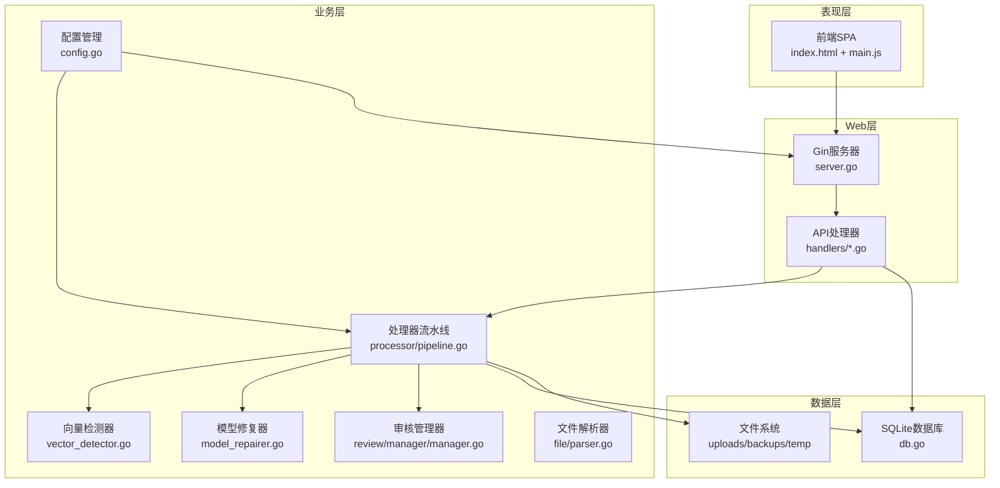
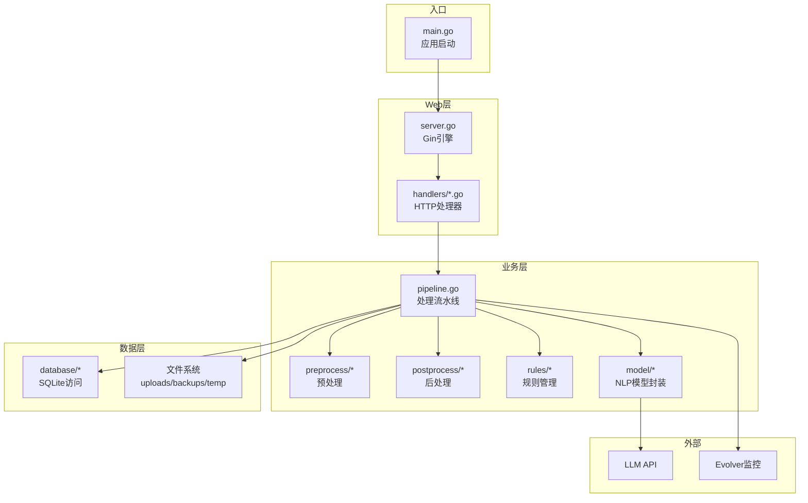
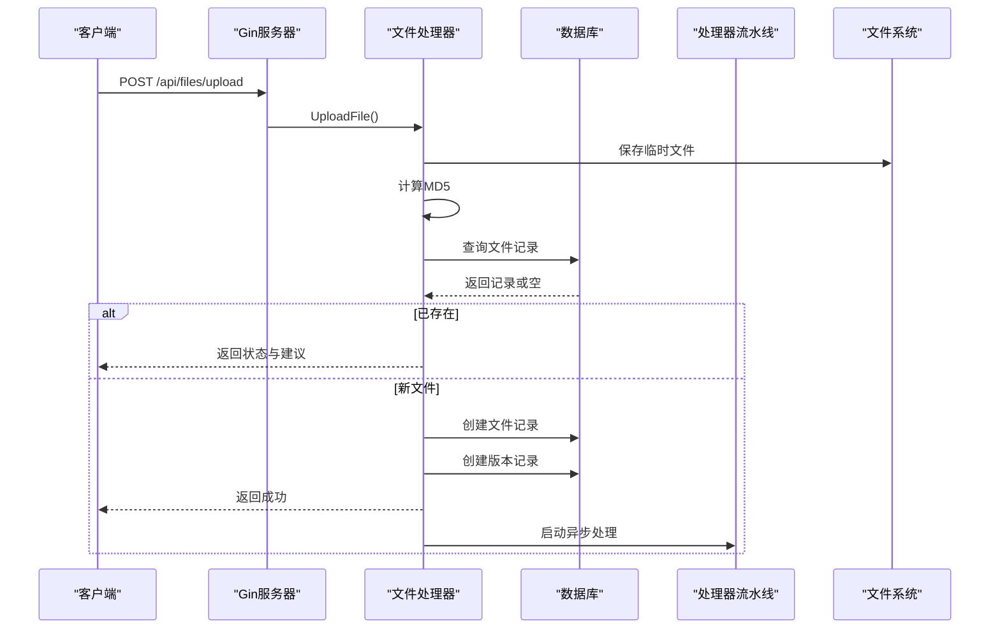
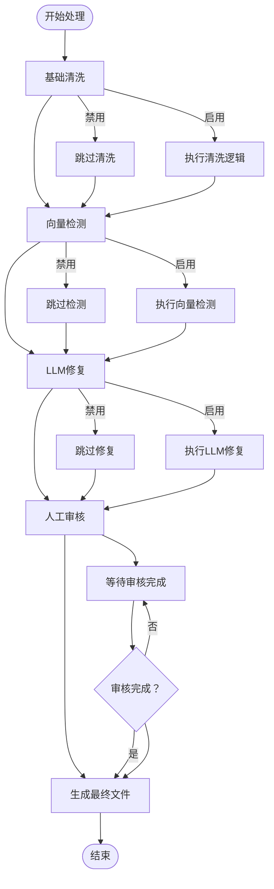
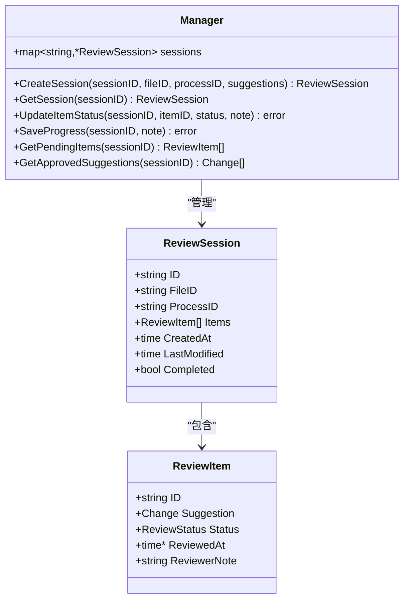
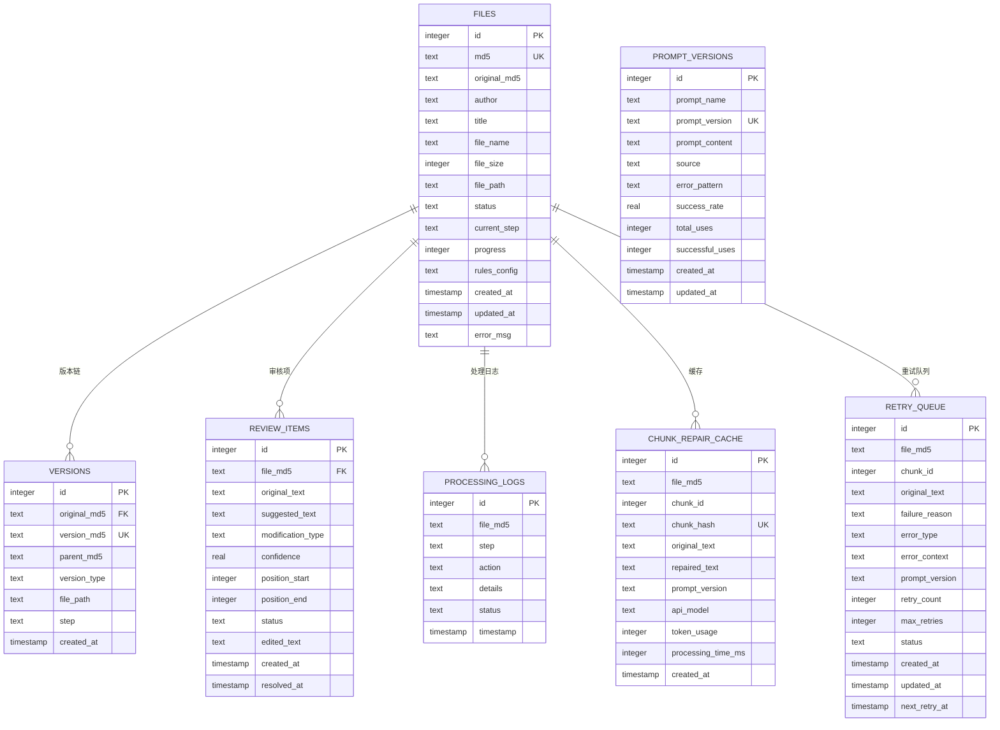
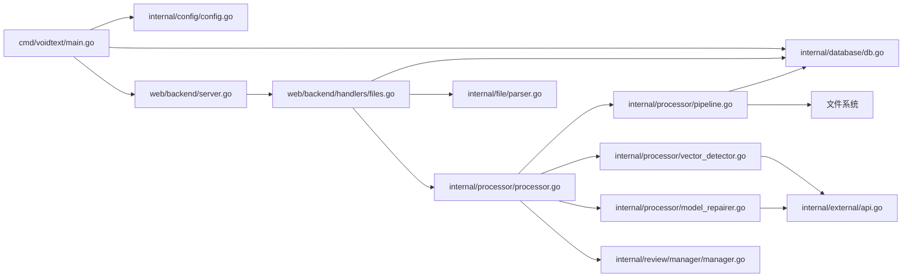

# 整体架构概览

<cite>
**本文档引用的文件**
- [main.go](file://cmd/voidtext/main.go)
- [server.go](file://web/backend/server.go)
- [config.go](file://internal/config/config.go)
- [db.go](file://internal/database/db.go)
- [processor.go](file://internal/processor/processor.go)
- [pipeline.go](file://internal/processor/pipeline.go)
- [manager.go](file://internal/review/manager/manager.go)
- [files.go](file://web/backend/handlers/files.go)
- [parser.go](file://internal/file/parser.go)
- [vector_detector.go](file://internal/processor/vector_detector.go)
- [model_repairer.go](file://internal/processor/model_repairer.go)
- [index.html](file://web/frontend/index.html)
- [go.mod](file://go.mod)
- [02-系统架构.md](file://doc/02-系统架构.md)
</cite>

## 目录
1. [简介](#简介)
2. [项目结构](#项目结构)
3. [核心组件](#核心组件)
4. [架构总览](#架构总览)
5. [详细组件分析](#详细组件分析)
6. [依赖关系分析](#依赖关系分析)
7. [性能考虑](#性能考虑)
8. [故障排除指南](#故障排除指南)
9. [结论](#结论)

## 简介
VoidText是一个面向小说文本的清洗与修复系统，采用前后端分离架构，通过REST API提供文件上传、处理、审核与生成最终文件的能力。系统支持多阶段处理流水线：基础清洗、向量检测去重、LLM修复、人工审核以及最终文件生成，并具备版本追踪、缓存幂等性、断点续传等高级特性。

## 项目结构
系统采用模块化分层设计：
- 表现层：前端单页应用（SPA），通过JavaScript控制页面切换与状态管理
- Web层：基于Gin框架的HTTP服务器，提供REST API路由与静态资源服务
- 业务层：处理器模块负责文本清洗、向量检测、LLM修复、审核管理与流水线编排
- 数据层：SQLite数据库存储文件元数据、版本链、审核项、处理日志与缓存

**图表来源**
- [server.go:1-58](file://web/backend/server.go#L1-L58)
- [files.go:1-393](file://web/backend/handlers/files.go#L1-L393)
- [processor.go:1-228](file://internal/processor/processor.go#L1-L228)
- [pipeline.go:1-610](file://internal/processor/pipeline.go#L1-L610)
- [manager.go:1-234](file://internal/review/manager/manager.go#L1-L234)
- [config.go:1-204](file://internal/config/config.go#L1-L204)
- [db.go:1-223](file://internal/database/db.go#L1-L223)

**章节来源**
- [02-系统架构.md:1-205](file://doc/02-系统架构.md#L1-L205)
- [go.mod:1-54](file://go.mod#L1-L54)

## 核心组件
- 配置管理：集中管理端口、数据目录、功能开关、模型参数等配置项，并提供验证与环境变量加载能力
- 数据库层：基于SQLite，提供文件记录、版本链、审核项、处理日志、缓存与重试队列等表结构与访问接口
- 处理器流水线：五步处理流程（清洗→索引→LLM修复→审核→最终化），支持规则配置、进度计算、状态管理
- 审核管理器：维护审核会话与项的状态流转，支持内存与磁盘持久化
- 文件解析器：从文件名中提取作者与标题，支持多种分隔符
- Web服务器：基于Gin提供CORS、静态资源、路由注册与HTTP处理
- 外部集成：向量检测与LLM修复可通过本地或外部API实现，具备降级与监控能力

**章节来源**
- [config.go:14-204](file://internal/config/config.go#L14-L204)
- [db.go:89-223](file://internal/database/db.go#L89-L223)
- [processor.go:36-144](file://internal/processor/processor.go#L36-L144)
- [pipeline.go:19-102](file://internal/processor/pipeline.go#L19-L102)
- [manager.go:44-89](file://internal/review/manager/manager.go#L44-L89)
- [parser.go:16-48](file://internal/file/parser.go#L16-L48)
- [server.go:10-57](file://web/backend/server.go#L10-L57)

## 架构总览
系统采用分层架构与模块化设计，遵循单一职责原则：
- 分层架构
  - 表现层：前端SPA，负责用户交互与状态展示
  - Web层：HTTP服务，负责请求路由、参数校验与响应封装
  - 业务层：处理逻辑，负责文本清洗、检测、修复与审核
  - 数据层：持久化存储，负责文件元数据、版本链与缓存
- 模块化设计
  - 每个模块职责明确，内部高内聚、对外低耦合
  - 通过接口与依赖注入实现松耦合
  - 支持功能开关与配置驱动，便于扩展与演进

**图表来源**
- [main.go:18-61](file://cmd/voidtext/main.go#L18-L61)
- [server.go:11-57](file://web/backend/server.go#L11-L57)
- [pipeline.go:104-158](file://internal/processor/pipeline.go#L104-L158)
- [model_repairer.go:38-75](file://internal/processor/model_repairer.go#L38-L75)

**章节来源**
- [main.go:18-61](file://cmd/voidtext/main.go#L18-L61)
- [server.go:11-57](file://web/backend/server.go#L11-L57)
- [pipeline.go:104-158](file://internal/processor/pipeline.go#L104-L158)

## 详细组件分析

### Web服务器与API处理器
- Gin服务器：启用CORS、静态资源服务、路由分组与中间件
- API路由：文件上传、列表、详情、内容、下载、删除、规则更新、处理控制、审核操作、规则管理等
- 处理流程：上传文件→计算MD5→查询记录→创建文件记录→保存中间版本→异步处理→轮询进度→进入审核→生成最终文件

**图表来源**
- [server.go:28-54](file://web/backend/server.go#L28-L54)
- [files.go:18-71](file://web/backend/handlers/files.go#L18-L71)
- [files.go:157-198](file://web/backend/handlers/files.go#L157-L198)

**章节来源**
- [server.go:11-57](file://web/backend/server.go#L11-L57)
- [files.go:18-393](file://web/backend/handlers/files.go#L18-L393)

### 处理器流水线与组件关系
- 五步处理：基础清洗→向量检测→LLM修复→审核→最终化
- 进度计算：每步贡献20%，结合步骤内子进度
- 规则配置：文件级规则，支持基础清洗、繁体转简体、向量检测、LLM修复、错别字映射、广告黑名单
- 审核集成：将检测到的重复内容转换为审核项，支持人工审批与批量操作

**图表来源**
- [pipeline.go:19-102](file://internal/processor/pipeline.go#L19-L102)
- [pipeline.go:160-213](file://internal/processor/pipeline.go#L160-L213)
- [pipeline.go:215-271](file://internal/processor/pipeline.go#L215-L271)
- [pipeline.go:273-376](file://internal/processor/pipeline.go#L273-L376)
- [pipeline.go:436-468](file://internal/processor/pipeline.go#L436-L468)
- [pipeline.go:470-522](file://internal/processor/pipeline.go#L470-L522)

**章节来源**
- [pipeline.go:19-102](file://internal/processor/pipeline.go#L19-L102)
- [processor.go:36-117](file://internal/processor/processor.go#L36-L117)

### 审核管理器
- 会话管理：创建、加载、保存审核会话，支持内存与磁盘持久化
- 状态流转：待审核→已通过→已拒绝→已编辑→完成
- 进度统计：计算待审核、已通过、已拒绝、已编辑数量
- 数据持久化：会话以JSON格式保存至reviews目录

**图表来源**
- [manager.go:33-89](file://internal/review/manager/manager.go#L33-L89)
- [manager.go:111-142](file://internal/review/manager/manager.go#L111-L142)
- [manager.go:197-234](file://internal/review/manager/manager.go#L197-L234)

**章节来源**
- [manager.go:44-234](file://internal/review/manager/manager.go#L44-L234)

### 数据库层与文件系统
- 数据库初始化：创建数据目录、连接SQLite、启用WAL模式、设置缓存与连接池
- 表结构：files、versions、review_items、processing_logs、chunk_repair_cache、retry_queue、prompt_versions
- 文件系统：uploads（原始与中间版本）、backups（备份）、temp（临时文件）
- 索引优化：为常用查询字段建立索引，提升查询性能

**图表来源**
- [db.go:89-223](file://internal/database/db.go#L89-L223)

**章节来源**
- [db.go:15-87](file://internal/database/db.go#L15-L87)
- [db.go:89-223](file://internal/database/db.go#L89-L223)

### 配置管理与技术栈
- 技术栈：Go 1.25、Gin、SQLite（modernc.org/sqlite）、godotenv、CORS
- 配置来源：.env文件，支持端口、数据目录、功能开关、模型参数、外部API配置
- 验证机制：端口范围、相似度阈值、生成温度等参数校验
- 目录结构：确保DATA_DIR、uploads、backups、temp目录存在

**章节来源**
- [config.go:48-122](file://internal/config/config.go#L48-L122)
- [config.go:190-204](file://internal/config/config.go#L190-L204)
- [go.mod:5-13](file://go.mod#L5-L13)

## 依赖关系分析
系统依赖清晰，模块间通过接口与配置解耦：
- Web层依赖处理器与数据库层，不直接依赖外部服务
- 处理器层依赖配置、数据库、文件系统与外部API
- 审核管理器依赖文件系统进行会话持久化
- 外部依赖集中在外部API调用与模型封装

**图表来源**
- [main.go:13-26](file://cmd/voidtext/main.go#L13-L26)
- [server.go:3-8](file://web/backend/server.go#L3-L8)
- [files.go:3-16](file://web/backend/handlers/files.go#L3-L16)
- [processor.go:7-11](file://internal/processor/processor.go#L7-L11)
- [pipeline.go:11-17](file://internal/processor/pipeline.go#L11-L17)
- [vector_detector.go:3-10](file://internal/processor/vector_detector.go#L3-L10)
- [model_repairer.go:12-17](file://internal/processor/model_repairer.go#L12-L17)

**章节来源**
- [main.go:13-26](file://cmd/voidtext/main.go#L13-L26)
- [server.go:3-8](file://web/backend/server.go#L3-L8)
- [files.go:3-16](file://web/backend/handlers/files.go#L3-L16)
- [processor.go:7-11](file://internal/processor/processor.go#L7-L11)
- [pipeline.go:11-17](file://internal/processor/pipeline.go#L11-L17)

## 性能考虑
- 数据库优化：启用WAL模式、设置同步级别、缓存大小与连接池，确保并发读取与单写序列化
- 处理器优化：智能分块（1500-2000字符）、工作池并发、缓存幂等性、断点续传
- 网络优化：CORS配置、静态资源缓存、合理的HTTP状态码与错误处理
- 前端优化：SPA单页应用、轮询机制、状态管理与UI反馈

## 故障排除指南
- 配置问题：检查.env文件是否存在、端口是否被占用、数据目录权限是否正确
- 数据库问题：确认SQLite驱动可用、WAL模式启用成功、表结构创建完成
- 处理器问题：查看处理日志、确认规则配置有效、检查外部API连通性
- 审核问题：确认审核项状态流转正常、会话持久化路径存在
- 前端问题：检查静态资源路径、CORS配置、轮询定时器是否正常运行

**章节来源**
- [config.go:48-122](file://internal/config/config.go#L48-L122)
- [db.go:15-87](file://internal/database/db.go#L15-L87)
- [files.go:18-71](file://web/backend/handlers/files.go#L18-L71)

## 结论
VoidText系统通过清晰的分层架构与模块化设计，实现了小说文本的自动化清洗与修复。系统具备良好的扩展性与可维护性，支持功能开关、配置驱动与外部集成。通过SQLite与文件系统相结合的数据存储方案，满足单人使用的场景需求。未来可在外部API稳定性、提示词热重载与监控告警等方面进一步增强。