# 系统架构设计

<cite>
**本文档引用的文件**
- [cmd/txtclean/main.go](file://cmd/txtclean/main.go)
- [internal/config/config.go](file://internal/config/config.go)
- [internal/database/db.go](file://internal/database/db.go)
- [internal/processor/pipeline.go](file://internal/processor/pipeline.go)
- [internal/processor/processor.go](file://internal/processor/processor.go)
- [internal/processor/basic_cleaner.go](file://internal/processor/basic_cleaner.go)
- [internal/processor/vector_detector.go](file://internal/processor/vector_detector.go)
- [internal/processor/model_repairer.go](file://internal/processor/model_repairer.go)
- [internal/processor/preprocess/preprocess.go](file://internal/processor/preprocess/preprocess.go)
- [internal/processor/postprocess/postprocess.go](file://internal/processor/postprocess/postprocess.go)
- [internal/processor/rules/rules.go](file://internal/processor/rules/rules.go)
- [internal/review/manager/manager.go](file://internal/review/manager/manager.go)
- [internal/external/api.go](file://internal/external/api.go)
- [web/backend/server.go](file://web/backend/server.go)
- [go.mod](file://go.mod)
</cite>

## 目录
1. [简介](#简介)
2. [项目结构](#项目结构)
3. [核心组件](#核心组件)
4. [架构总览](#架构总览)
5. [详细组件分析](#详细组件分析)
6. [依赖关系分析](#依赖关系分析)
7. [性能考量](#性能考量)
8. [故障排查指南](#故障排查指南)
9. [结论](#结论)
10. [附录](#附录)

## 简介
本系统为txtCleaning文本清洗与修复平台，采用分层架构与模块化设计，围绕“五步处理流水线”组织核心能力：基础清洗、向量检测、LLM修复、人工审核、最终生成。系统通过Web后端提供REST API，前端静态页面提供交互入口；后端以流水线为核心编排各处理步骤，并通过数据库持久化文件、版本、审核项与处理日志；外部API模块负责与大模型服务通信，内置重试与退避策略；配置模块集中管理运行参数；规则模块提供可扩展的正则规则引擎；审核管理器提供人工审核会话与状态管理。

## 项目结构
项目采用按功能域划分的模块化组织方式，主要目录与职责如下：
- cmd/txtclean：应用入口，负责初始化配置、数据库与Web服务并启动HTTP服务器。
- internal/config：应用配置加载与验证，支持.env与环境变量注入。
- internal/database：SQLite数据库初始化、表结构与索引、连接池与WAL优化。
- internal/processor：处理流水线与各处理阶段实现（基础清洗、向量检测、LLM修复、规则应用、前后处理）。
- internal/review/manager：人工审核会话与状态管理。
- internal/external：外部API客户端，封装HTTP请求、重试、退避与错误处理。
- web/backend：基于Gin的Web服务，提供文件上传、处理、审核、报告等REST接口。
- web/frontend：静态前端资源（HTML/CSS/JS），与后端API交互。
- scripts：辅助脚本（如Evolver调用、启动脚本）。
- testing：冒烟测试与单元测试。

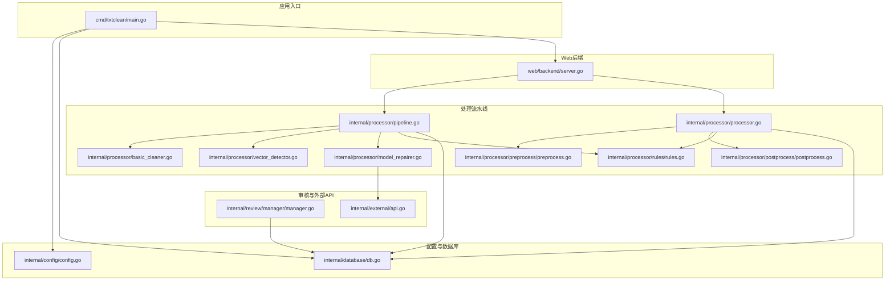

**图表来源**
- [cmd/txtclean/main.go:1-61](file://cmd/txtclean/main.go#L1-L61)
- [internal/config/config.go:1-204](file://internal/config/config.go#L1-L204)
- [internal/database/db.go:1-223](file://internal/database/db.go#L1-L223)
- [web/backend/server.go:1-58](file://web/backend/server.go#L1-L58)
- [internal/processor/pipeline.go:1-610](file://internal/processor/pipeline.go#L1-L610)
- [internal/processor/processor.go:1-228](file://internal/processor/processor.go#L1-L228)
- [internal/processor/basic_cleaner.go:1-280](file://internal/processor/basic_cleaner.go#L1-L280)
- [internal/processor/vector_detector.go:1-224](file://internal/processor/vector_detector.go#L1-L224)
- [internal/processor/model_repairer.go:1-731](file://internal/processor/model_repairer.go#L1-L731)
- [internal/processor/preprocess/preprocess.go:1-250](file://internal/processor/preprocess/preprocess.go#L1-L250)
- [internal/processor/postprocess/postprocess.go:1-111](file://internal/processor/postprocess/postprocess.go#L1-L111)
- [internal/processor/rules/rules.go:1-151](file://internal/processor/rules/rules.go#L1-L151)
- [internal/review/manager/manager.go:1-234](file://internal/review/manager/manager.go#L1-L234)
- [internal/external/api.go:1-738](file://internal/external/api.go#L1-L738)

**章节来源**
- [cmd/txtclean/main.go:18-61](file://cmd/txtclean/main.go#L18-L61)
- [web/backend/server.go:10-57](file://web/backend/server.go#L10-L57)

## 核心组件
- 分层架构与模块化
  - 表现层：web/backend提供REST API与静态资源。
  - 控制层：路由与处理器封装业务流程。
  - 业务层：处理流水线与各处理阶段（清洗、检测、修复、规则、前后处理）。
  - 数据访问层：SQLite数据库与索引，配合WAL模式提升并发性能。
  - 外部集成：外部API客户端封装HTTP请求、重试与退避。
- 设计模式
  - 流水线模式：五步处理流水线顺序推进，每步产出中间产物并记录版本。
  - 工作池模式：LLM修复阶段使用WorkerPool并发处理文本块，结合缓存幂等性。
  - 策略模式：配置驱动的步骤开关（基础清洗、向量检测、LLM修复）。
  - 观察者模式：处理日志与监控事件（如缓存命中率、错误率）触发自进化监控。
- 系统边界
  - 输入：文件上传（支持断点续传）、规则配置。
  - 处理：流水线各阶段、审核会话、版本管理。
  - 输出：中间文件与最终文件、处理报告、审核项状态。
- 技术决策与权衡
  - SQLite+WAL：单机部署首选，兼顾并发读与串行写，降低部署复杂度。
  - 本地向量与API降级：向量检测支持本地特征与API降级，提升鲁棒性。
  - 指数退避与重试：对外部API进行可配置重试，避免惊群效应。
  - 缓存幂等性：块级缓存避免重复调用LLM，显著节省成本与时间。
- 基础设施要求
  - Go 1.25+，SQLite运行时。
  - 可选：外部LLM API（需配置URL与密钥）。
  - 存储：DATA_DIR目录具备读写权限，用于数据库、上传文件、版本与审核会话。
- 可扩展性
  - 规则引擎：新增正则规则无需改动代码。
  - 提示词管理：动态提示词与版本化，支持Evolver自进化。
  - 并发扩展：WorkerPool规模可调，适配CPU与API限流。
- 部署拓扑
  - 单机部署：入口进程启动Web服务与数据库，前端静态资源由后端提供。
  - 可横向扩展：后端可复制实例，数据库仍为单机（SQLite），适合读多写少场景。

**章节来源**
- [internal/config/config.go:14-122](file://internal/config/config.go#L14-L122)
- [internal/database/db.go:15-69](file://internal/database/db.go#L15-L69)
- [internal/processor/pipeline.go:19-94](file://internal/processor/pipeline.go#L19-L94)
- [internal/processor/model_repairer.go:28-75](file://internal/processor/model_repairer.go#L28-L75)
- [internal/external/api.go:20-59](file://internal/external/api.go#L20-L59)

## 架构总览
系统采用“入口-配置-数据库-后端-处理-外部API”的链路，Web后端统一暴露REST接口，处理流水线按步骤顺序执行，数据库贯穿版本与审核状态管理，外部API提供LLM能力并内置健壮的重试机制。

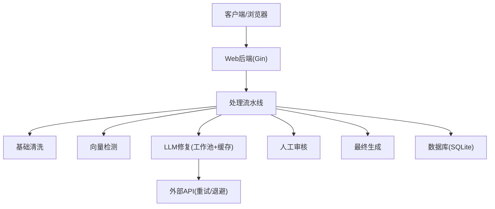

**图表来源**
- [web/backend/server.go:28-54](file://web/backend/server.go#L28-L54)
- [internal/processor/pipeline.go:104-158](file://internal/processor/pipeline.go#L104-L158)
- [internal/processor/model_repairer.go:77-122](file://internal/processor/model_repairer.go#L77-L122)
- [internal/external/api.go:440-508](file://internal/external/api.go#L440-L508)
- [internal/database/db.go:89-222](file://internal/database/db.go#L89-L222)

## 详细组件分析

### 五步处理流水线
- 步骤定义与顺序
  - 基础清洗（cleaning）：HTML实体清理、标点规范化、空白字符规范化、繁简转换、广告移除。
  - 向量检测（indexing）：段落向量化与相似度检测，移除重复段落并生成审核项。
  - LLM修复（llm_fix）：智能分块、WorkerPool并发、缓存幂等性、提示词管理、错误阈值监控。
  - 人工审核（review）：等待审核项完成，支持批量审批/拒绝/编辑。
  - 最终生成（finalizing）：汇总审核项，生成最终文件并记录版本。
- 进度计算与状态推进
  - 每步进度=步骤基础进度+步骤内贡献进度，基础进度=步骤序号×20%，贡献进度=步骤内完成比例×20%。
  - 失败时记录处理日志与错误状态，便于追踪与恢复。
- 数据流
  - 从文件MD5定位记录，读取原始内容，按规则配置执行各步骤，保存中间文件与版本，最终生成最终文件。

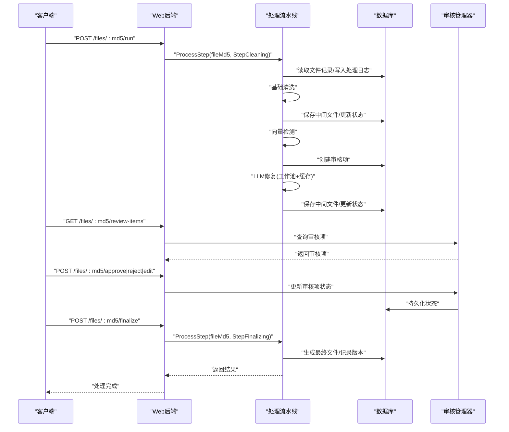

**图表来源**
- [web/backend/server.go:39-49](file://web/backend/server.go#L39-L49)
- [internal/processor/pipeline.go:104-158](file://internal/processor/pipeline.go#L104-L158)
- [internal/review/manager/manager.go:56-89](file://internal/review/manager/manager.go#L56-L89)

**章节来源**
- [internal/processor/pipeline.go:19-102](file://internal/processor/pipeline.go#L19-L102)
- [internal/processor/pipeline.go:160-271](file://internal/processor/pipeline.go#L160-L271)
- [internal/processor/pipeline.go:273-376](file://internal/processor/pipeline.go#L273-L376)
- [internal/processor/pipeline.go:436-468](file://internal/processor/pipeline.go#L436-L468)
- [internal/processor/pipeline.go:470-522](file://internal/processor/pipeline.go#L470-L522)

### 基础清洗器
- 能力
  - HTML实体清理、标点规范化（中文语境）、空白字符规范化、繁体转简体、广告内容移除。
  - 统计与变更记录，便于审计与回溯。
- 复杂度
  - 时间复杂度近似O(n)，空间复杂度O(n)（n为字符数）。

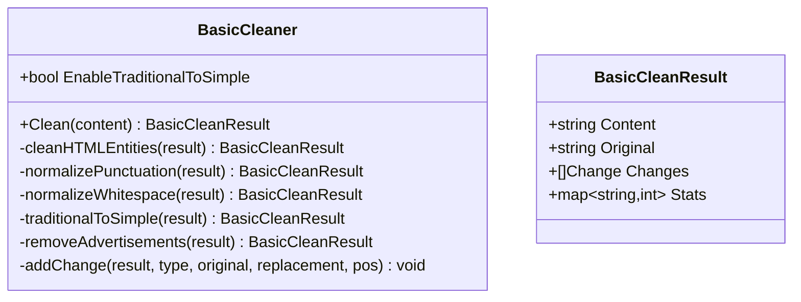

**图表来源**
- [internal/processor/basic_cleaner.go:19-280](file://internal/processor/basic_cleaner.go#L19-L280)

**章节来源**
- [internal/processor/basic_cleaner.go:31-51](file://internal/processor/basic_cleaner.go#L31-L51)

### 向量检测器
- 能力
  - 段落切分、向量生成（本地特征或外部API），相似度检测，重复段落移除。
  - 支持API失败降级为本地向量，保证系统可用性。
- 复杂度
  - 时间复杂度O(k·m)（k为段落数，m为平均段落长度），空间复杂度O(k·d)（d为向量维度）。

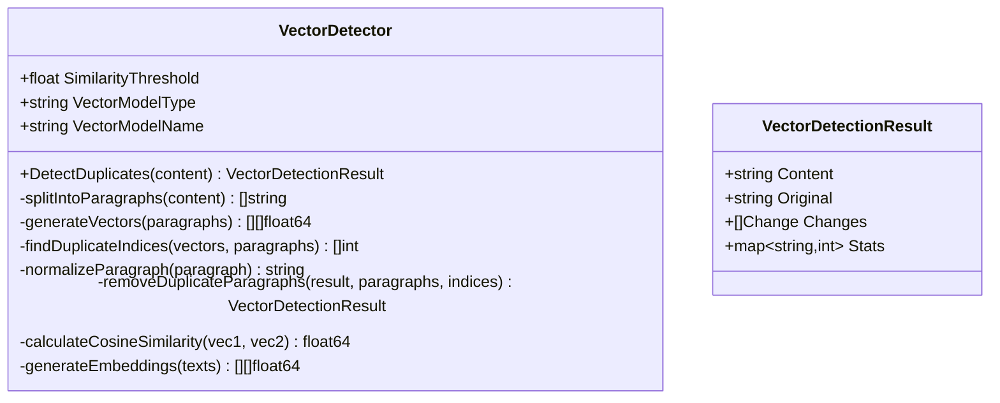

**图表来源**
- [internal/processor/vector_detector.go:12-224](file://internal/processor/vector_detector.go#L12-L224)

**章节来源**
- [internal/processor/vector_detector.go:36-69](file://internal/processor/vector_detector.go#L36-L69)

### LLM修复器（工作池+缓存）
- 能力
  - 智能分块（1500-2000字符）、WorkerPool并发、块级缓存幂等性、提示词管理、错误阈值监控、API重试与退避。
  - 支持本地修复回退，保证系统稳定性。
- 复杂度
  - 分块O(n)，并发处理O(n/p)（p为并行度），缓存命中O(1)。

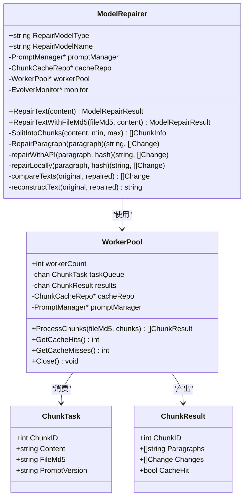

**图表来源**
- [internal/processor/model_repairer.go:19-731](file://internal/processor/model_repairer.go#L19-L731)

**章节来源**
- [internal/processor/model_repairer.go:77-122](file://internal/processor/model_repairer.go#L77-L122)
- [internal/processor/model_repairer.go:547-563](file://internal/processor/model_repairer.go#L547-L563)

### 审核管理器
- 能力
  - 审核会话创建、状态管理（待审核/已批准/已拒绝/已跳过）、持久化与加载、进度统计。
- 复杂度
  - 内存会话O(m)，磁盘序列化O(m)（m为审核项数量）。

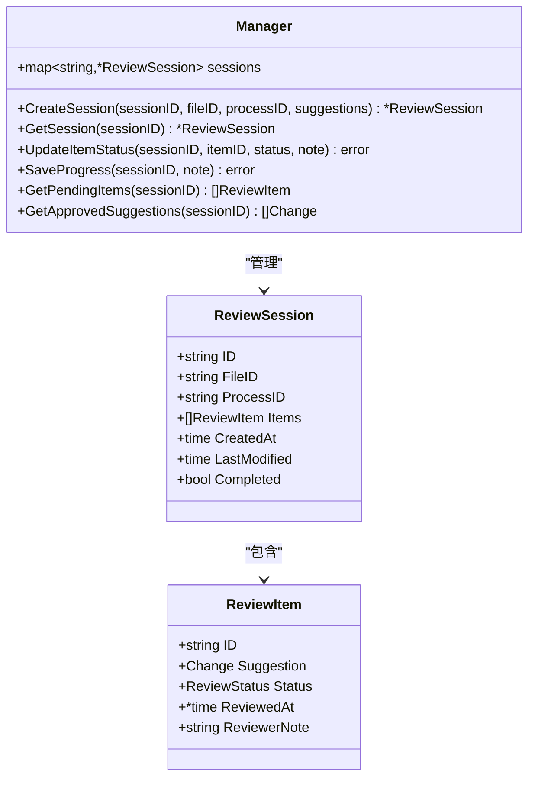

**图表来源**
- [internal/review/manager/manager.go:44-234](file://internal/review/manager/manager.go#L44-L234)

**章节来源**
- [internal/review/manager/manager.go:56-89](file://internal/review/manager/manager.go#L56-L89)

### 外部API客户端
- 能力
  - 单例HTTP客户端、指数退避重试、可配置可重试状态码、错误类型判断、日志记录。
  - 支持嵌入、补全与聊天完成接口，带令牌用量与耗时统计。
- 复杂度
  - 请求O(1)，重试按退避策略增长。

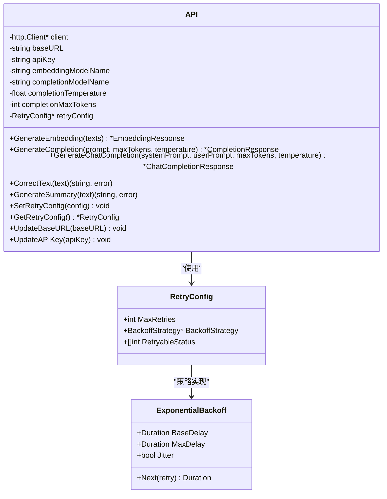

**图表来源**
- [internal/external/api.go:175-738](file://internal/external/api.go#L175-L738)

**章节来源**
- [internal/external/api.go:293-418](file://internal/external/api.go#L293-L418)

### Web后端与API
- 路由与接口
  - 文件：上传、列表、详情、内容、下载、删除、断点续传、规则更新。
  - 处理：运行全部步骤、查询状态、生成报告。
  - 审核：查询审核项、审批/拒绝/编辑、批量操作、最终生成。
- CORS与静态资源
  - 支持跨域访问，提供静态资源服务。

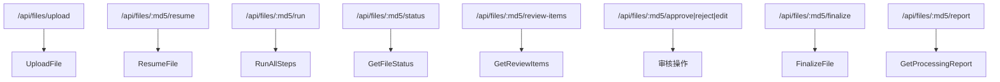

**图表来源**
- [web/backend/server.go:28-54](file://web/backend/server.go#L28-L54)

**章节来源**
- [web/backend/server.go:10-57](file://web/backend/server.go#L10-L57)

## 依赖关系分析
- 模块依赖
  - cmd/txtclean依赖config与database初始化，再启动web/backend。
  - web/backend依赖handlers（由server注册），handlers间接依赖processor与database。
  - processor依赖config、database、external、review/manager。
  - external依赖config与logging。
  - database提供SQLite连接与表结构。
- 外部库
  - Gin用于Web框架，godotenv用于环境变量，sqlite驱动modernc.org/sqlite，x/text用于编码处理。

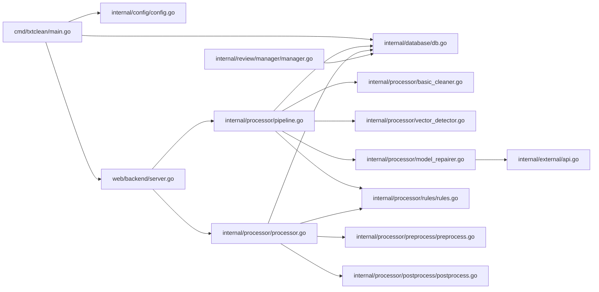

**图表来源**
- [go.mod:5-54](file://go.mod#L5-L54)
- [cmd/txtclean/main.go:13-29](file://cmd/txtclean/main.go#L13-L29)
- [web/backend/server.go:3-8](file://web/backend/server.go#L3-L8)

**章节来源**
- [go.mod:1-54](file://go.mod#L1-L54)

## 性能考量
- 数据库并发与一致性
  - WAL模式与自动检查点提升并发读性能；单写连接确保写入顺序，避免SQLite并发限制。
  - 索引覆盖files、versions、review_items、processing_logs与新增表，减少查询成本。
- 处理性能
  - WorkerPool并发处理文本块，结合块级缓存避免重复调用LLM，显著降低API调用与成本。
  - 向量检测采用本地特征与API降级，减少外部依赖带来的不确定性。
- 网络与外部API
  - 单例HTTP客户端与连接池配置，指数退避与抖动避免惊群效应，提升成功率与稳定性。
- 前后处理
  - 预处理与后处理分别负责编码修复与格式优化，减少后续处理负担。

**章节来源**
- [internal/database/db.go:29-59](file://internal/database/db.go#L29-L59)
- [internal/processor/model_repairer.go:547-563](file://internal/processor/model_repairer.go#L547-L563)
- [internal/external/api.go:27-59](file://internal/external/api.go#L27-L59)

## 故障排查指南
- 配置问题
  - 端口、阈值、温度等参数校验失败会导致启动异常，检查环境变量与配置文件。
- 数据库问题
  - WAL模式启用失败、连接测试失败、建表失败等，检查DATA_DIR权限与磁盘空间。
- 处理失败
  - 每步处理失败会记录处理日志与错误状态，可通过“处理报告”接口查看。
- 审核卡住
  - 若审核项未完成，检查审核会话状态与数据库索引；必要时手动推进。
- 外部API
  - 429限流、5xx错误、超时等可重试；查看日志中的重试调度与退避记录。

**章节来源**
- [internal/config/config.go:190-203](file://internal/config/config.go#L190-L203)
- [internal/database/db.go:15-69](file://internal/database/db.go#L15-L69)
- [internal/processor/pipeline.go:145-155](file://internal/processor/pipeline.go#L145-L155)
- [internal/external/api.go:293-418](file://internal/external/api.go#L293-L418)

## 结论
txtCleaning系统以清晰的分层架构与模块化设计实现了从文件上传到最终生成的完整闭环。五步处理流水线通过策略模式灵活控制各阶段开关，结合工作池与缓存实现高性能与低成本；外部API的重试与退避保障了系统的鲁棒性；数据库的WAL优化与索引提升了并发与查询效率。整体方案适合单机部署与轻量扩展，满足文本清洗与修复的典型需求。

## 附录
- 系统上下文图（概念性）
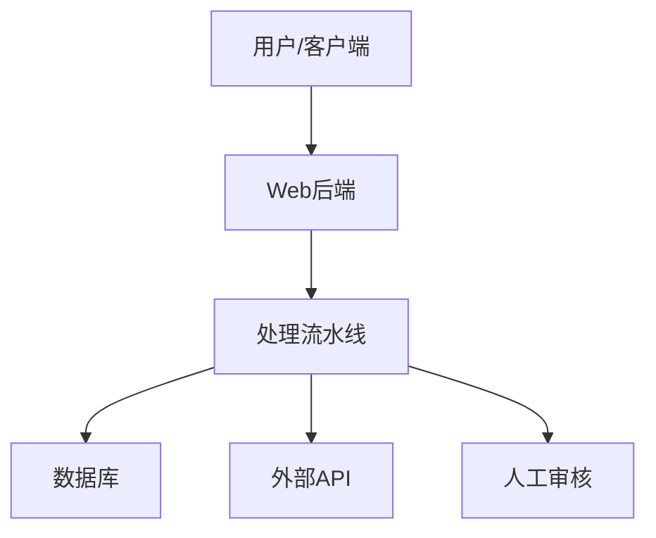