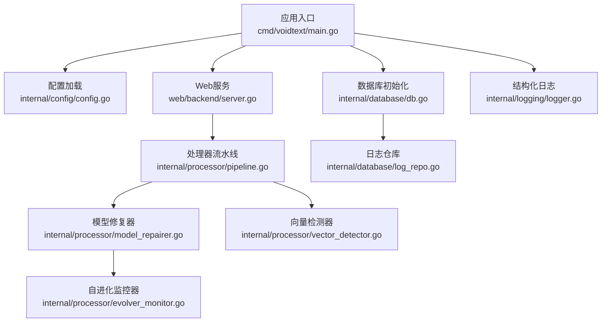
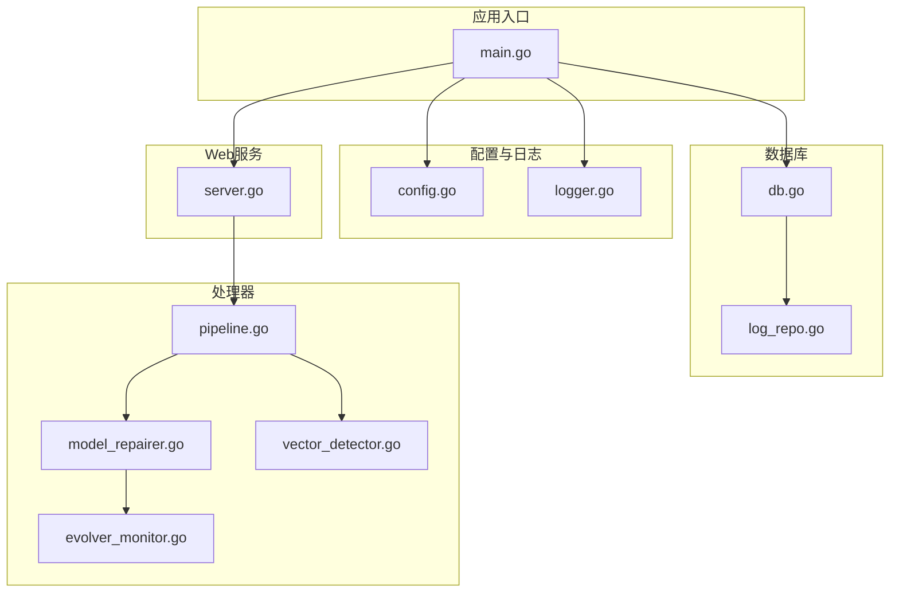
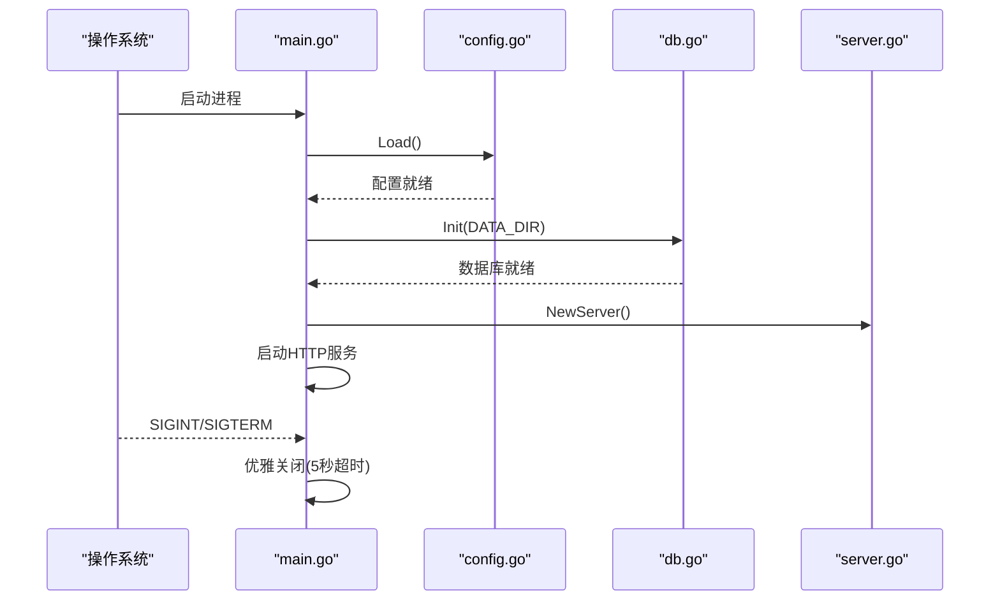
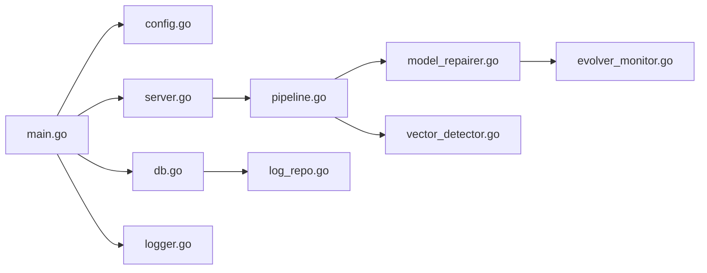

# 故障排除与维护

<cite>
**本文引用的文件**
- [main.go](file://cmd/voidtext/main.go)
- [config.go](file://internal/config/config.go)
- [logger.go](file://internal/logging/logger.go)
- [db.go](file://internal/database/db.go)
- [server.go](file://web/backend/server.go)
- [evolver_monitor.go](file://internal/processor/evolver_monitor.go)
- [model_repairer.go](file://internal/processor/model_repairer.go)
- [pipeline.go](file://internal/processor/pipeline.go)
- [vector_detector.go](file://internal/processor/vector_detector.go)
- [log_repo.go](file://internal/database/log_repo.go)
- [raspberrypi-start.sh](file://scripts/raspberrypi-start.sh)
- [run.sh](file://scripts/run.sh)
- [run_smoke_tests.sh](file://testing/smoking_testing/run_smoke_tests.sh)
- [run_unit_tests.sh](file://testing/unit_testing/run_unit_tests.sh)
</cite>

## 目录
1. [简介](#简介)
2. [项目结构](#项目结构)
3. [核心组件](#核心组件)
4. [架构总览](#架构总览)
5. [详细组件分析](#详细组件分析)
6. [依赖关系分析](#依赖关系分析)
7. [性能考虑](#性能考虑)
8. [故障排除指南](#故障排除指南)
9. [结论](#结论)
10. [附录](#附录)

## 简介
本指南面向VoidText项目的运维与开发人员，提供系统化的故障排除、维护与优化方法。内容涵盖：
- 常见问题诊断与解决
- 日志分析与错误定位技巧
- 数据库维护与性能优化
- 系统重启与故障恢复流程
- 定期维护任务清单与执行计划
- 备份策略与数据恢复流程
- 安全漏洞扫描与修复建议
- 性能瓶颈识别与优化方案

## 项目结构
项目采用分层与功能域结合的组织方式：
- cmd/voidtext：应用入口，负责配置加载、数据库初始化、HTTP服务启动与优雅关闭
- internal/*：核心业务逻辑与基础设施
  - config：配置加载与验证
  - logging：结构化日志记录
  - database：SQLite数据库初始化、表结构与仓库接口
  - processor：处理流水线、模型修复器、向量检测器、自进化监控器
  - file：文件相关工具（如MD5）
  - external：外部API封装
  - review/manager：审核管理
- web/backend：Gin Web服务与路由
- scripts：部署与启动脚本
- testing：冒烟测试与单元测试脚本
- doc：系统文档（架构、数据库设计、API、配置、部署等）

图表来源
- [main.go:18-61](file://cmd/voidtext/main.go#L18-L61)
- [config.go:48-122](file://internal/config/config.go#L48-L122)
- [db.go:15-69](file://internal/database/db.go#L15-L69)
- [server.go:10-57](file://web/backend/server.go#L10-L57)
- [pipeline.go:104-158](file://internal/processor/pipeline.go#L104-L158)
- [model_repairer.go:38-75](file://internal/processor/model_repairer.go#L38-L75)
- [vector_detector.go:27-69](file://internal/processor/vector_detector.go#L27-L69)
- [evolver_monitor.go:34-60](file://internal/processor/evolver_monitor.go#L34-L60)
- [log_repo.go:19-33](file://internal/database/log_repo.go#L19-L33)
- [logger.go:68-141](file://internal/logging/logger.go#L68-L141)

章节来源
- [main.go:18-61](file://cmd/voidtext/main.go#L18-L61)
- [config.go:48-122](file://internal/config/config.go#L48-L122)
- [db.go:15-69](file://internal/database/db.go#L15-L69)
- [server.go:10-57](file://web/backend/server.go#L10-L57)

## 核心组件
- 应用入口与生命周期
  - 加载配置、初始化数据库、启动HTTP服务、优雅关闭
- 配置系统
  - 支持.env加载、环境变量解析与默认值、目录创建、配置验证
- 日志系统
  - 结构化JSON日志、事件字段、调用者追踪、多种事件类型
- 数据库层
  - SQLite WAL模式、缓存与同步参数、事务批量建表、索引优化
- Web服务
  - CORS配置、静态资源、REST路由
- 处理器流水线
  - 步骤化处理（清洗、索引、LLM修复、审核、收尾）、中间文件与版本管理
- 模型修复器
  - 智能分块、Worker Pool并发、缓存幂等、API回退与重试队列
- 向量检测器
  - 段落向量化与重复检测（简化实现），支持外部API降级
- 自进化监控器
  - 基于指标阈值触发外部Evolver脚本优化提示词

章节来源
- [main.go:18-61](file://cmd/voidtext/main.go#L18-L61)
- [config.go:48-203](file://internal/config/config.go#L48-L203)
- [logger.go:68-250](file://internal/logging/logger.go#L68-L250)
- [db.go:15-223](file://internal/database/db.go#L15-L223)
- [server.go:10-57](file://web/backend/server.go#L10-L57)
- [pipeline.go:19-102](file://internal/processor/pipeline.go#L19-L102)
- [model_repairer.go:19-75](file://internal/processor/model_repairer.go#L19-L75)
- [vector_detector.go:12-69](file://internal/processor/vector_detector.go#L12-L69)
- [evolver_monitor.go:18-60](file://internal/processor/evolver_monitor.go#L18-L60)

## 架构总览
应用采用“入口-配置-数据库-服务-处理器”的分层架构，日志贯穿各层，数据库承载文件、版本、审核、处理日志与缓存等核心数据。

图表来源
- [main.go:18-61](file://cmd/voidtext/main.go#L18-L61)
- [config.go:48-122](file://internal/config/config.go#L48-L122)
- [logger.go:68-141](file://internal/logging/logger.go#L68-L141)
- [db.go:15-69](file://internal/database/db.go#L15-L69)
- [log_repo.go:19-33](file://internal/database/log_repo.go#L19-L33)
- [server.go:10-57](file://web/backend/server.go#L10-L57)
- [pipeline.go:104-158](file://internal/processor/pipeline.go#L104-L158)
- [model_repairer.go:38-75](file://internal/processor/model_repairer.go#L38-L75)
- [vector_detector.go:27-69](file://internal/processor/vector_detector.go#L27-L69)
- [evolver_monitor.go:34-60](file://internal/processor/evolver_monitor.go#L34-L60)

## 详细组件分析

### 应用入口与生命周期
- 加载配置与数据库初始化失败会直接退出
- 启动HTTP服务并在收到中断信号后优雅关闭，设置超时避免阻塞
- 适合生产环境的健康检查与重启策略

图表来源
- [main.go:18-61](file://cmd/voidtext/main.go#L18-L61)
- [config.go:48-122](file://internal/config/config.go#L48-L122)
- [db.go:15-69](file://internal/database/db.go#L15-L69)
- [server.go:10-57](file://web/backend/server.go#L10-L57)

章节来源
- [main.go:18-61](file://cmd/voidtext/main.go#L18-L61)

### 配置系统
- 优先从可执行文件目录加载.env，再回退到工作目录
- 环境变量解析支持字符串、整数、布尔、浮点与大整数
- 验证端口、相似度阈值、温度等关键参数范围
- 自动创建数据目录与子目录

章节来源
- [config.go:48-122](file://internal/config/config.go#L48-L122)
- [config.go:190-203](file://internal/config/config.go#L190-L203)

### 日志系统
- 结构化事件字段：时间、级别、事件、文件MD5、块ID、提示词版本、输入预览、原始错误、错误类型、上下文、耗时、额外字段、调用者
- 快捷事件：API错误、API拒绝、块处理、缓存命中/未命中、Worker池状态、提示词加载/更新、重试队列、重试处理
- JSON与文本两种输出模式，JSON失败时回退到错误事件

章节来源
- [logger.go:22-141](file://internal/logging/logger.go#L22-L141)
- [logger.go:143-250](file://internal/logging/logger.go#L143-L250)

### 数据库层
- SQLite WAL模式提升并发读写能力，设置自动检查点与同步模式
- 缓存大小与连接池参数优化，连接最大存活时间避免资源泄露
- 表结构含文件、版本、审核、处理日志、块缓存、重试队列、提示词版本，并建立多索引
- 事务批量建表，确保原子性

章节来源
- [db.go:15-69](file://internal/database/db.go#L15-L69)
- [db.go:89-223](file://internal/database/db.go#L89-L223)

### Web服务
- CORS允许本地开发域名与凭证，静态资源映射
- REST路由覆盖文件上传、列表、详情、下载、删除、恢复、规则更新、运行、状态、审核项、批量审批/拒绝、最终化、报告等

章节来源
- [server.go:10-57](file://web/backend/server.go#L10-L57)

### 处理器流水线
- 步骤顺序：清洗、索引、LLM修复、审核、收尾
- 进度计算：每个步骤贡献20%，结合步骤内进度
- 中间文件保存与版本记录，最终生成清理后文件并记录版本

章节来源
- [pipeline.go:19-102](file://internal/processor/pipeline.go#L19-L102)
- [pipeline.go:104-158](file://internal/processor/pipeline.go#L104-L158)
- [pipeline.go:273-376](file://internal/processor/pipeline.go#L273-L376)
- [pipeline.go:436-522](file://internal/processor/pipeline.go#L436-L522)

### 模型修复器与Worker Pool
- 智能分块：1500-2000字符，保持段落完整性
- Worker Pool并发处理，缓存命中直接返回，未命中调用外部API并保存缓存
- API失败记录到重试队列，支持回退本地修复
- 统计缓存命中/未命中，记录提示词使用情况

章节来源
- [model_repairer.go:77-122](file://internal/processor/model_repairer.go#L77-L122)
- [model_repairer.go:124-211](file://internal/processor/model_repairer.go#L124-L211)
- [model_repairer.go:218-319](file://internal/processor/model_repairer.go#L218-L319)
- [model_repairer.go:565-709](file://internal/processor/model_repairer.go#L565-L709)

### 向量检测器
- 段落分割、向量生成（简化实现），重复段落检测与移除
- 支持外部API生成嵌入向量，失败时降级为本地向量

章节来源
- [vector_detector.go:36-69](file://internal/processor/vector_detector.go#L36-L69)
- [vector_detector.go:88-111](file://internal/processor/vector_detector.go#L88-L111)
- [vector_detector.go:113-143](file://internal/processor/vector_detector.go#L113-L143)
- [vector_detector.go:200-223](file://internal/processor/vector_detector.go#L200-L223)

### 自进化监控器
- 周期性检查缓存命中率与API错误率，触发外部Evolver脚本优化提示词
- 最小调用间隔与指数退避，避免频繁调用
- 记录触发原因与统计指标

章节来源
- [evolver_monitor.go:43-90](file://internal/processor/evolver_monitor.go#L43-L90)
- [evolver_monitor.go:117-177](file://internal/processor/evolver_monitor.go#L117-L177)
- [evolver_monitor.go:179-285](file://internal/processor/evolver_monitor.go#L179-L285)

## 依赖关系分析
- 入口依赖配置与数据库，数据库依赖SQLite驱动
- Web服务依赖处理器流水线，处理器依赖配置、数据库与外部API
- 日志系统被广泛使用，贯穿各层
- 脚本与测试脚本辅助部署与质量保障

图表来源
- [main.go:18-61](file://cmd/voidtext/main.go#L18-L61)
- [config.go:48-122](file://internal/config/config.go#L48-L122)
- [db.go:15-69](file://internal/database/db.go#L15-L69)
- [server.go:10-57](file://web/backend/server.go#L10-L57)
- [pipeline.go:104-158](file://internal/processor/pipeline.go#L104-L158)
- [model_repairer.go:38-75](file://internal/processor/model_repairer.go#L38-L75)
- [vector_detector.go:27-69](file://internal/processor/vector_detector.go#L27-L69)
- [evolver_monitor.go:34-60](file://internal/processor/evolver_monitor.go#L34-L60)
- [log_repo.go:19-33](file://internal/database/log_repo.go#L19-L33)
- [logger.go:68-141](file://internal/logging/logger.go#L68-L141)

## 性能考虑
- 数据库
  - WAL模式与自动检查点提升并发写入吞吐
  - 缓存大小与同步模式平衡一致性与性能
  - 连接池限制与最大存活时间避免资源泄漏
  - 多索引加速查询（文件MD5、版本、审核、处理日志、块缓存、重试队列、提示词版本）
- 处理器
  - Worker Pool并发处理块，缓存命中避免重复API调用
  - 智能分块减少API负载，降低Token消耗
- 日志
  - JSON结构化日志便于机器解析与聚合
  - 事件字段标准化，利于指标采集与告警

章节来源
- [db.go:29-59](file://internal/database/db.go#L29-L59)
- [db.go:188-202](file://internal/database/db.go#L188-L202)
- [model_repairer.go:548-709](file://internal/processor/model_repairer.go#L548-L709)
- [logger.go:68-119](file://internal/logging/logger.go#L68-L119)

## 故障排除指南

### 1. 常见问题诊断与解决
- 无法启动服务
  - 检查端口占用与权限，确认配置加载成功
  - 查看启动脚本与日志输出位置
  - 参考入口与配置加载流程
- 数据库初始化失败
  - 确认数据目录可写，SQLite驱动可用
  - 检查WAL模式与同步参数设置
- Web请求异常
  - 检查CORS配置与静态资源路径
  - 使用冒烟测试脚本验证API可用性
- 处理流程卡住或失败
  - 查看处理日志与文件状态
  - 检查重试队列与提示词版本使用情况
- LLM修复失败
  - 检查API密钥与URL配置
  - 观察缓存命中率与错误率，必要时触发自进化

章节来源
- [main.go:18-61](file://cmd/voidtext/main.go#L18-L61)
- [config.go:48-122](file://internal/config/config.go#L48-L122)
- [db.go:15-69](file://internal/database/db.go#L15-L69)
- [server.go:10-57](file://web/backend/server.go#L10-L57)
- [run_smoke_tests.sh:55-81](file://testing/smoking_testing/run_smoke_tests.sh#L55-L81)

### 2. 日志分析与错误定位技巧
- 结构化日志字段
  - 事件类型：chunk_processing、api_repair_failed、cache_hit、worker_pool、evolver_triggered、retry_queued、retry_processed等
  - 关键字段：file_md5、chunk_id、prompt_version、input_preview、raw_error、error_type、duration_ms、extra、caller
- 分析步骤
  - 从错误事件入手，结合file_md5与chunk_id定位具体处理单元
  - 查看调用者信息快速定位源码位置
  - 统计错误类型与发生频率，判断是缓存问题还是API问题
- 日志输出
  - JSON模式便于自动化处理，文本模式便于人工查看

章节来源
- [logger.go:22-37](file://internal/logging/logger.go#L22-L37)
- [logger.go:143-250](file://internal/logging/logger.go#L143-L250)

### 3. 数据库维护与性能优化
- 健康检查
  - Ping数据库，确保连接可用
  - 检查WAL日志是否定期checkpoint
- 索引与查询
  - 利用现有索引优化查询（文件MD5、版本、审核、处理日志、块缓存、重试队列、提示词版本）
  - 避免全表扫描，关注复合索引使用
- 连接管理
  - 保持连接池最小化，避免过多并发写入
  - 设置合理的最大存活时间
- 表结构与数据
  - 定期清理过期版本与日志
  - 评估重试队列规模，避免堆积

章节来源
- [db.go:60-68](file://internal/database/db.go#L60-L68)
- [db.go:188-202](file://internal/database/db.go#L188-L202)
- [log_repo.go:35-75](file://internal/database/log_repo.go#L35-L75)

### 4. 系统重启与故障恢复流程
- 优雅关闭
  - 接收中断信号后设置超时，确保在限定时间内完成清理
- 重启策略
  - 使用启动脚本管理PID与日志输出
  - 树莓派脚本支持stop/status/start动作
- 故障恢复
  - 恢复文件处理：调用恢复接口继续未完成流程
  - 重试队列：定期检查pending状态并重试
  - 版本回滚：通过版本记录定位历史版本

章节来源
- [main.go:45-59](file://cmd/voidtext/main.go#L45-L59)
- [raspberrypi-start.sh:38-75](file://scripts/raspberrypi-start.sh#L38-L75)
- [pipeline.go:324-338](file://internal/processor/pipeline.go#L324-L338)

### 5. 定期维护任务清单与执行计划
- 每日
  - 检查服务状态与日志输出
  - 清理临时文件与过期版本
  - 监控缓存命中率与API错误率
- 每周
  - 数据库维护：检查WAL、索引碎片、统计信息
  - 备份策略执行与验证
- 每月
  - 性能基线评估与优化
  - 自进化监控器触发与提示词版本更新

章节来源
- [db.go:77-87](file://internal/database/db.go#L77-L87)
- [evolver_monitor.go:117-177](file://internal/processor/evolver_monitor.go#L117-L177)

### 6. 备份策略与数据恢复流程
- 备份对象
  - SQLite数据库文件（cleaning.db）
  - 上传文件与中间/最终版本文件
  - 配置文件与提示词版本
- 备份方式
  - 文件系统级备份（tar/zip）
  - 数据库导出（SQL dump）
- 恢复流程
  - 停止服务，替换数据库文件，启动服务
  - 恢复上传文件与版本文件，必要时重建索引
  - 验证服务可用性与处理流程

章节来源
- [db.go:17](file://internal/database/db.go#L17)
- [pipeline.go:547-579](file://internal/processor/pipeline.go#L547-L579)

### 7. 安全漏洞扫描与修复建议
- 配置安全
  - 外部API密钥与URL通过环境变量注入，避免硬编码
  - CORS白名单仅允许受信域名
- 输入验证
  - 配置验证函数检查端口、阈值、温度等范围
- 日志敏感信息
  - 避免在日志中输出敏感字段，必要时脱敏
- 访问控制
  - 生产环境建议增加认证与授权层（当前为本地开发场景）

章节来源
- [config.go:72-112](file://internal/config/config.go#L72-L112)
- [config.go:190-203](file://internal/config/config.go#L190-L203)
- [server.go:14-20](file://web/backend/server.go#L14-L20)

### 8. 性能瓶颈识别与优化方案
- 缓存命中率低
  - 检查提示词版本与API稳定性，触发自进化
  - 优化Worker Pool大小与任务粒度
- API错误率高
  - 增加重试策略与退避，记录重试队列
  - 评估外部API配额与限流
- 处理时间长
  - 分析Worker池统计与缓存命中/未命中
  - 调整分块大小与并发度

章节来源
- [evolver_monitor.go:117-177](file://internal/processor/evolver_monitor.go#L117-L177)
- [model_repairer.go:548-709](file://internal/processor/model_repairer.go#L548-L709)
- [pipeline.go:378-434](file://internal/processor/pipeline.go#L378-L434)

## 结论
本指南提供了VoidText项目的系统化故障排除与维护方法，涵盖配置、日志、数据库、Web服务、处理器流水线、自进化监控等关键组件。通过结构化日志与数据库指标，结合脚本化的启动与测试流程，可有效提升系统的可观测性与可维护性。建议在生产环境中持续执行定期维护与备份策略，并根据性能指标动态优化提示词与处理参数。

## 附录

### A. 启动与测试脚本
- 启动脚本
  - run.sh：构建并运行应用
  - raspberrypi-start.sh：树莓派后台运行、PID管理、日志输出
- 测试脚本
  - run_smoke_tests.sh：冒烟测试，覆盖上传、处理、审核、规则等关键流程
  - run_unit_tests.sh：单元测试与覆盖率报告

章节来源
- [run.sh:1-14](file://scripts/run.sh#L1-L14)
- [raspberrypi-start.sh:1-116](file://scripts/raspberrypi-start.sh#L1-L116)
- [run_smoke_tests.sh:1-345](file://testing/smoking_testing/run_smoke_tests.sh#L1-L345)
- [run_unit_tests.sh:1-168](file://testing/unit_testing/run_unit_tests.sh#L1-L168)