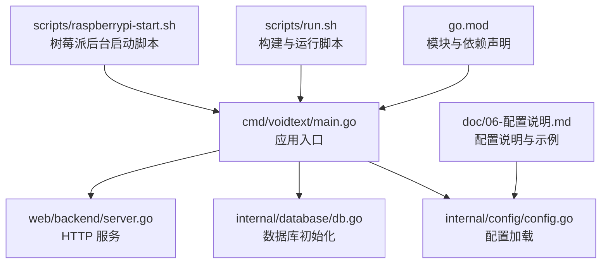
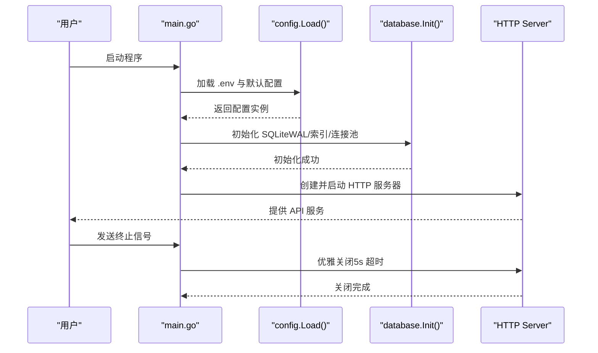
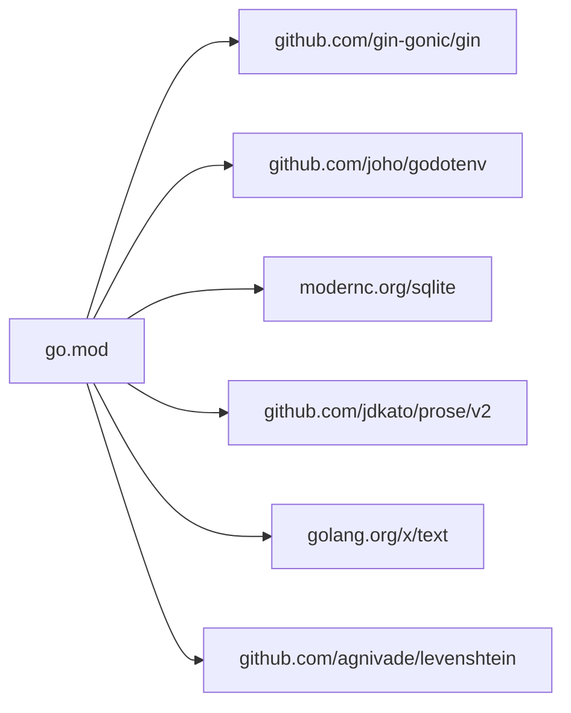

# 环境搭建

<cite>
**本文引用的文件**
- [go.mod](file://go.mod)
- [README.md](file://README.md)
- [cmd/voidtext/main.go](file://cmd/voidtext/main.go)
- [internal/config/config.go](file://internal/config/config.go)
- [internal/database/db.go](file://internal/database/db.go)
- [internal/database/chunk_cache_repo.go](file://internal/database/chunk_cache_repo.go)
- [scripts/run.sh](file://scripts/run.sh)
- [scripts/raspberrypi-start.sh](file://scripts/raspberrypi-start.sh)
- [doc/06-配置说明.md](file://doc/06-配置说明.md)
</cite>

## 目录
1. [简介](#简介)
2. [项目结构](#项目结构)
3. [核心组件](#核心组件)
4. [架构总览](#架构总览)
5. [详细组件分析](#详细组件分析)
6. [依赖分析](#依赖分析)
7. [性能考虑](#性能考虑)
8. [故障排查指南](#故障排查指南)
9. [结论](#结论)
10. [附录](#附录)

## 简介
本指南面向首次搭建 VoidText 项目的开发者与运维人员，覆盖：
- Go 语言版本要求与安装步骤
- 项目依赖管理与模块初始化
- SQLite 数据库的安装与配置（现代c.org/sqlite 驱动）
- 必要系统依赖与运行时环境准备
- Windows、Linux、macOS 的具体安装步骤
- 环境变量配置与路径设置
- 常见环境问题排查与解决方案

## 项目结构
项目采用 Go 模块化组织，核心入口位于 cmd/voidtext，配置与数据库初始化在 internal 子包中，前端静态资源位于 web/frontend，后端服务在 web/backend。

图表来源
- [cmd/voidtext/main.go:1-61](file://cmd/voidtext/main.go#L1-L61)
- [internal/config/config.go:1-204](file://internal/config/config.go#L1-L204)
- [internal/database/db.go:1-223](file://internal/database/db.go#L1-L223)
- [go.mod:1-54](file://go.mod#L1-L54)
- [scripts/run.sh:1-14](file://scripts/run.sh#L1-L14)
- [scripts/raspberrypi-start.sh:1-116](file://scripts/raspberrypi-start.sh#L1-L116)
- [doc/06-配置说明.md:1-146](file://doc/06-配置说明.md#L1-L146)

章节来源
- [README.md:18-25](file://README.md#L18-L25)
- [go.mod:1-54](file://go.mod#L1-L54)

## 核心组件
- 应用入口与生命周期控制：负责加载配置、初始化数据库、启动 HTTP 服务，并优雅关闭。
- 配置系统：支持从可执行文件所在目录与工作目录加载 .env，提供默认值与类型转换。
- 数据库层：使用 modernc.org/sqlite 驱动，自动创建 cleaning.db 并初始化表结构。
- Web 服务：基于 Gin 框架提供文件上传、处理、审核、版本管理等接口。
- 运行脚本：提供一键构建与运行，以及树莓派后台运行能力。

章节来源
- [cmd/voidtext/main.go:18-61](file://cmd/voidtext/main.go#L18-L61)
- [internal/config/config.go:48-122](file://internal/config/config.go#L48-L122)
- [internal/database/db.go:15-69](file://internal/database/db.go#L15-L69)
- [scripts/run.sh:5-13](file://scripts/run.sh#L5-L13)
- [scripts/raspberrypi-start.sh:77-116](file://scripts/raspberrypi-start.sh#L77-L116)

## 架构总览
应用启动流程如下：入口加载配置 → 初始化数据库（WAL 模式、索引、连接池参数）→ 启动 HTTP 服务器 → 接收请求并处理业务逻辑 → 优雅关闭。

图表来源
- [cmd/voidtext/main.go:18-61](file://cmd/voidtext/main.go#L18-L61)
- [internal/config/config.go:48-122](file://internal/config/config.go#L48-L122)
- [internal/database/db.go:15-69](file://internal/database/db.go#L15-L69)

## 详细组件分析

### Go 版本与安装要求
- 模块声明的最低 Go 版本为 1.25.0。
- README 中的“环境依赖”标注为 1.21+，建议以 go.mod 的 1.25.0 为准。
- 安装步骤（通用）：
  1) 安装 Go（1.25.0 或更高）
  2) 验证安装：go version
  3) 配置 GOPATH 与 PATH（如需）
  4) 在项目根目录执行 go mod tidy 初始化依赖

章节来源
- [go.mod:3](file://go.mod#L3)
- [README.md:20](file://README.md#L20)

### 依赖管理与模块初始化
- 使用 go.mod 声明依赖，包括 Gin、godotenv、modernc.org/sqlite、prose 等。
- 初始化流程：
  - go mod tidy：整理依赖，生成 go.sum
  - go mod verify：校验依赖完整性
- 项目还包含间接依赖，无需手动安装，go 工具链会自动处理。

章节来源
- [go.mod:5-53](file://go.mod#L5-L53)
- [scripts/run.sh:5-7](file://scripts/run.sh#L5-L7)

### SQLite 数据库安装与配置
- 驱动：modernc.org/sqlite（纯 Go 实现，无需系统级 SQLite 安装）
- 初始化行为：
  - 在 DATA_DIR 下创建 cleaning.db
  - 启用 WAL 模式、设置同步级别、缓存大小
  - 设置连接池：最多 1 个打开连接，空闲 1 个，最大存活 5 分钟
  - 创建 files、versions、review_items、processing_logs、chunk_repair_cache、retry_queue、prompt_versions 等表及索引
- 表结构与索引由数据库层统一创建，无需手工迁移。

章节来源
- [internal/database/db.go:15-69](file://internal/database/db.go#L15-L69)
- [internal/database/db.go:89-222](file://internal/database/db.go#L89-L222)

### 环境变量与路径配置
- .env 加载顺序：优先尝试可执行文件所在目录下的 .env；失败则回退到工作目录；均失败则继续运行（日志记录）。
- 关键变量（摘录）：
  - PORT：服务端口，默认 8080
  - DATA_DIR：数据目录（含数据库），默认 ./data
  - MAX_FILE_SIZE：最大文件大小（字节），默认 100MB
  - BACKUP_KEEP_DAYS：备份保留天数，默认 7
  - NAME_SEPARATORS：文件名分隔符列表
  - ENABLE_BASIC_CLEANING、BASIC_CLEANING_TOOL、TRADITIONAL_TO_SIMPLE
  - ENABLE_VECTOR_DETECTION、VECTOR_MODEL_NAME、VECTOR_MODEL_TYPE、VECTOR_SIMILARITY_THRESHOLD、VECTOR_MODEL_URL、VECTOR_MODEL_API_KEY
  - ENABLE_MODEL_REPAIR、REPAIR_MODEL_NAME、REPAIR_MODEL_TYPE、LLM_API_URL、LLM_API_KEY、COMPLETION_MODEL_NAME、COMPLETION_TEMPERATURE、COMPLETION_MAX_TOKENS
  - BASE_DIR、ENABLE_EVOLVER（可选，Evolver 监控）
- 目录结构（DATA_DIR 下）：cleaning.db、uploads/、backups/、reviews/（由配置加载时自动创建）

章节来源
- [internal/config/config.go:48-122](file://internal/config/config.go#L48-L122)
- [doc/06-配置说明.md:3-80](file://doc/06-配置说明.md#L3-L80)
- [doc/06-配置说明.md:136-146](file://doc/06-配置说明.md#L136-L146)

### 运行时环境准备
- 端口：默认 8080，可通过 PORT 覆盖
- 文件系统：DATA_DIR 需具备读写权限；uploads/backups/temp 目录由配置加载时自动创建
- 外部服务（可选）：DashScope、DeepSeek 等 LLM API；向量模型 API；Evolver（Node.js>=18、npm、git、Python3）

章节来源
- [internal/config/config.go:71-96](file://internal/config/config.go#L71-L96)
- [doc/06-配置说明.md:69-81](file://doc/06-配置说明.md#L69-L81)

### 不同操作系统安装步骤

#### Windows
- 安装 Go（1.25.0+）
- 安装 Git（用于 Evolver，如启用）
- PowerShell 中执行：
  - git clone 项目
  - 复制 .env.template 为 .env 并按需编辑
  - go mod tidy
  - go build -o voidtext ./cmd/voidtext/
  - ./voidtext
- 如需后台运行，可使用 Windows 服务或任务计划程序包装启动脚本思路（本项目提供 Linux/macOS 启动脚本，Windows 可参考其逻辑）

章节来源
- [README.md:28-75](file://README.md#L28-L75)
- [scripts/run.sh:5-13](file://scripts/run.sh#L5-L13)

#### Linux
- 安装 Go（1.25.0+）
- 安装 Git（如启用 Evolver）
- 终端中执行：
  - git clone 项目
  - cp .env.template .env
  - go mod tidy
  - go build -o voidtext ./cmd/voidtext/
  - ./voidtext
- 后台运行可参考树莓派脚本思路（scripts/raspberrypi-start.sh），根据需要调整日志目录与 PID 文件位置

章节来源
- [README.md:28-75](file://README.md#L28-L75)
- [scripts/raspberrypi-start.sh:77-116](file://scripts/raspberrypi-start.sh#L77-L116)

#### macOS
- 安装 Go（1.25.0+）
- 安装 Git（如启用 Evolver）
- 终端中执行：
  - git clone 项目
  - cp .env.template .env
  - go mod tidy
  - go build -o voidtext ./cmd/voidtext/
  - ./voidtext
- 后台运行可参考树莓派脚本思路，或使用 launchd 等服务管理器

章节来源
- [README.md:28-75](file://README.md#L28-L75)
- [scripts/raspberrypi-start.sh:77-116](file://scripts/raspberrypi-start.sh#L77-L116)

### 环境变量配置与路径设置
- .env 模板：cp .env.template .env
- 关键路径：
  - DATA_DIR：数据库与上传/备份/临时目录的根目录
  - BASE_DIR：Evolver 监控所需（若启用）
- 配置加载与验证：
  - 加载 .env 并设置默认值
  - 校验端口、相似度阈值、生成温度等范围
  - 自动创建 uploads/backups/temp 目录

章节来源
- [README.md:35-54](file://README.md#L35-L54)
- [internal/config/config.go:48-122](file://internal/config/config.go#L48-L122)
- [internal/config/config.go:190-203](file://internal/config/config.go#L190-L203)

## 依赖分析
- 运行时依赖（摘录）：
  - Gin：Web 框架
  - godotenv：.env 加载
  - modernc.org/sqlite：SQLite 驱动（纯 Go）
  - prose：文本处理（分词、句子分割等）
  - 其他间接依赖（JSON、加密、网络、反射等）
- 依赖来源：go.mod require 与 require (indirect)

图表来源
- [go.mod:5-13](file://go.mod#L5-L13)

章节来源
- [go.mod:5-53](file://go.mod#L5-L53)

## 性能考虑
- 数据库并发与性能：
  - WAL 模式提升并发读写能力
  - SetMaxOpenConns(1) 保证写操作串行，避免 SQLite 并发限制
  - 缓存大小与同步级别在 WAL 模式下平衡性能与安全性
  - 预创建索引加速查询
- 连接生命周期：
  - 最大存活时间 5 分钟，防止长时间连接导致资源泄漏
- 缓存与重试：
  - 块修复缓存（chunk_repair_cache）支持断点续传与幂等性
  - 重试队列（retry_queue）支持指数退避，避免频繁重试
  - 提示词版本（prompt_versions）记录效果，辅助 Evolver 自进化

章节来源
- [internal/database/db.go:29-59](file://internal/database/db.go#L29-L59)
- [internal/database/db.go:188-202](file://internal/database/db.go#L188-L202)
- [internal/database/chunk_cache_repo.go:67-100](file://internal/database/chunk_cache_repo.go#L67-L100)
- [internal/database/chunk_cache_repo.go:169-202](file://internal/database/chunk_cache_repo.go#L169-L202)
- [internal/database/chunk_cache_repo.go:277-301](file://internal/database/chunk_cache_repo.go#L277-L301)

## 故障排查指南
- 依赖安装失败
  - 症状：go mod tidy 报错或依赖下载缓慢
  - 处理：确保网络可达，必要时配置代理；使用 go env 设置 GOPROXY
- 数据库初始化失败
  - 症状：打开数据库失败、启用 WAL 失败、创建表失败
  - 处理：检查 DATA_DIR 权限；确认磁盘空间；查看日志输出；确认 modernc.org/sqlite 驱动可用
- 端口占用
  - 症状：启动报端口被占用
  - 处理：修改 .env 中的 PORT 或释放占用端口
- .env 加载失败
  - 症状：配置未生效
  - 处理：确认 .env 文件存在且可读；检查路径与权限；查看日志中加载路径
- 外部 API 调用失败
  - 症状：LLM 修复阶段失败
  - 处理：检查 LLM_API_URL、LLM_API_KEY；网络连通性；模型修复阶段会自动降级为本地字典修复
- 后台运行异常（树莓派脚本）
  - 症状：服务未启动或无法停止
  - 处理：查看日志目录 stdout.log/stderr.log；确认二进制文件存在；检查 PID 文件；按脚本逻辑停止或状态查询

章节来源
- [internal/database/db.go:24-27](file://internal/database/db.go#L24-L27)
- [internal/config/config.go:48-66](file://internal/config/config.go#L48-L66)
- [scripts/raspberrypi-start.sh:38-75](file://scripts/raspberrypi-start.sh#L38-L75)
- [README.md:108-127](file://README.md#L108-L127)

## 结论
- 本项目对 Go 版本要求为 1.25.0，依赖管理通过 go.mod 管理，SQLite 使用 modernc.org/sqlite 驱动，无需系统级安装。
- 通过 .env 配置即可快速完成环境准备，配合内置脚本可实现一键构建与运行。
- 若启用 Evolver，需额外准备 Node.js、npm、git、Python3 等工具链。

## 附录
- 快速命令清单（Linux/macOS）
  - git clone 项目
  - cp .env.template .env
  - go mod tidy
  - go build -o voidtext ./cmd/voidtext/
  - ./voidtext
- 树莓派后台运行（参考脚本逻辑）
  - chmod +x scripts/raspberrypi-start.sh
  - ./scripts/raspberrypi-start.sh

章节来源
- [README.md:28-75](file://README.md#L28-L75)
- [scripts/run.sh:5-13](file://scripts/run.sh#L5-L13)
- [scripts/raspberrypi-start.sh:77-116](file://scripts/raspberrypi-start.sh#L77-L116)