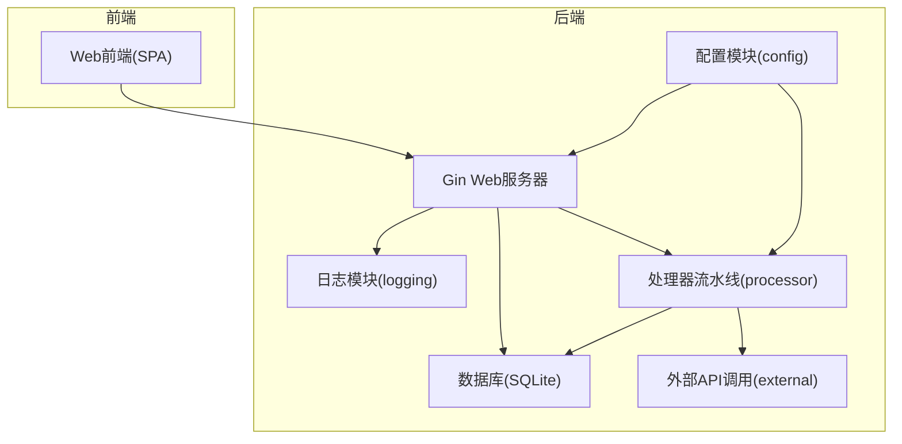
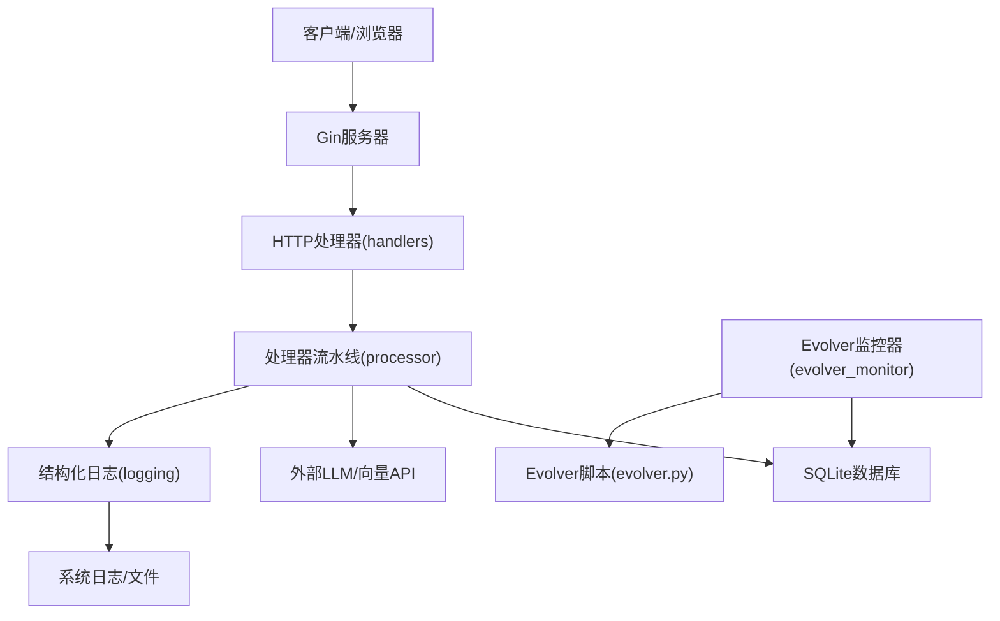
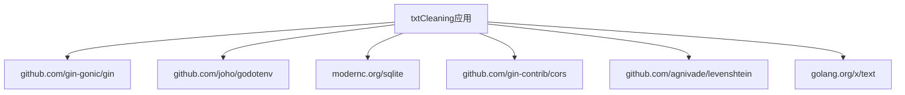

# 监控告警

<cite>
**本文引用的文件**
- [main.go](file://cmd/txtclean/main.go)
- [server.go](file://web/backend/server.go)
- [config.go](file://internal/config/config.go)
- [logger.go](file://internal/logging/logger.go)
- [db.go](file://internal/database/db.go)
- [chunk_cache_repo.go](file://internal/database/chunk_cache_repo.go)
- [evolver_monitor.go](file://internal/processor/evolver_monitor.go)
- [evolver.py](file://scripts/evolver.py)
- [pipeline.go](file://internal/processor/pipeline.go)
- [02-系统架构.md](file://doc/02-系统架构.md)
- [06-配置说明.md](file://doc/06-配置说明.md)
- [README.md](file://README.md)
- [go.mod](file://go.mod)
</cite>

## 目录
1. [简介](#简介)
2. [项目结构](#项目结构)
3. [核心组件](#核心组件)
4. [架构总览](#架构总览)
5. [详细组件分析](#详细组件分析)
6. [依赖分析](#依赖分析)
7. [性能考量](#性能考量)
8. [故障排查指南](#故障排查指南)
9. [结论](#结论)
10. [附录](#附录)

## 简介
本文件面向txtCleaning项目的运维与开发团队，提供一套完整的监控告警体系文档。内容覆盖日志采集与分析、性能指标监控与阈值设定、系统健康检查与可用性监控、关键指标（错误率、响应时间、吞吐量等）监控、告警通知渠道配置（邮件、微信、钉钉等）、监控仪表板搭建与可视化、故障自动恢复与降级策略，以及监控数据的存储与归档方案。目标是在保障系统稳定运行的同时，降低人工巡检成本，提升问题发现与处置效率。

## 项目结构
txtCleaning采用前后端分离架构，后端由Go + Gin提供REST API，内部模块包括配置、数据库、文件处理、处理器流水线、外部API调用、日志等。前端为单页应用（SPA），通过HTTP REST API与后端交互。

图表来源
- [server.go:10-57](file://web/backend/server.go#L10-L57)
- [main.go:18-61](file://cmd/txtclean/main.go#L18-L61)
- [02-系统架构.md:3-31](file://doc/02-系统架构.md#L3-L31)

章节来源
- [main.go:18-61](file://cmd/txtclean/main.go#L18-L61)
- [server.go:10-57](file://web/backend/server.go#L10-L57)
- [02-系统架构.md:3-31](file://doc/02-系统架构.md#L3-L31)

## 核心组件
- 配置模块：负责加载.env环境变量并提供全局配置对象，支持端口、数据目录、模型与API参数等。
- 日志模块：统一结构化日志输出，支持JSON与文本两种格式，内置事件类型（如API错误、缓存命中/未命中、Worker池状态、提示词加载/更新、Evolver触发等）。
- 数据库模块：SQLite驱动，WAL模式、连接池与生命周期管理；提供块缓存、重试队列、提示词版本等表结构与统计查询。
- 处理器流水线：五步处理流水线（基础清洗→向量检测→LLM修复→人工审核→生成文件），支持断点续传与进度恢复。
- Evolver自进化监控：周期性检查缓存命中率与API错误率，触发外部Evolver脚本优化提示词，并具备回退策略与指数退避。
- Web服务器：Gin路由注册，静态资源托管，暴露文件上传、处理、状态查询、审核、规则管理等API。

章节来源
- [config.go:49-122](file://internal/config/config.go#L49-L122)
- [logger.go:68-141](file://internal/logging/logger.go#L68-L141)
- [db.go:15-69](file://internal/database/db.go#L15-L69)
- [chunk_cache_repo.go:422-478](file://internal/database/chunk_cache_repo.go#L422-L478)
- [evolver_monitor.go:43-177](file://internal/processor/evolver_monitor.go#L43-L177)
- [server.go:10-57](file://web/backend/server.go#L10-L57)

## 架构总览
系统通过Gin提供REST API，处理器流水线在后台异步执行，数据库持久化状态与统计。日志模块统一输出结构化事件，Evolver监控器基于数据库统计触发外部优化脚本。

图表来源
- [server.go:28-54](file://web/backend/server.go#L28-L54)
- [evolver_monitor.go:18-41](file://internal/processor/evolver_monitor.go#L18-L41)
- [evolver.py:143-168](file://scripts/evolver.py#L143-L168)
- [logger.go:68-119](file://internal/logging/logger.go#L68-L119)

## 详细组件分析

### 日志收集与分析配置
- 日志级别与事件类型
  - 级别：debug、info、warn、error
  - 事件类型：chunk_processing、cache_hit、cache_miss、worker_pool、prompt_loaded、prompt_updated、retry_queued、retry_processed、api_error、api_refusal、evolver_triggered等
- 日志输出
  - JSON格式：便于结构化采集与检索
  - 文本格式：兼容旧日志
- 日志字段
  - 时间戳、级别、事件类型、文件MD5、块ID、提示词版本、输入预览、原始错误、错误类型、上下文、持续时间、额外字段、调用者位置
- 建议采集方案
  - 使用系统日志服务（如rsyslog/journald）统一收集标准错误输出
  - 结合文件轮转与压缩，控制磁盘占用
  - 通过日志解析器提取关键字段，建立索引以便查询与告警

章节来源
- [logger.go:12-37](file://internal/logging/logger.go#L12-L37)
- [logger.go:68-141](file://internal/logging/logger.go#L68-L141)
- [logger.go:143-250](file://internal/logging/logger.go#L143-L250)

### 性能指标监控与阈值设置
- 指标定义
  - 错误率：API错误率 = 重试队列错误次数 / (缓存命中 + 错误)
  - 缓存命中率：块缓存命中次数 / (缓存命中 + 重试)
  - 响应时间：处理阶段平均耗时（可结合日志duration_ms）
  - 吞吐量：单位时间内完成的处理任务数（结合进度与时间窗口）
- 阈值建议
  - 缓存命中率 < 30% 触发告警
  - API错误率 > 20% 触发告警
  - 响应时间P95/P99异常上升触发告警
  - 吞吐量显著下降触发告警
- 数据来源
  - 缓存命中率与错误率通过数据库统计查询获取
  - 处理阶段耗时可通过日志事件duration_ms聚合

章节来源
- [chunk_cache_repo.go:422-478](file://internal/database/chunk_cache_repo.go#L422-L478)
- [evolver_monitor.go:117-177](file://internal/processor/evolver_monitor.go#L117-L177)
- [logger.go:165-173](file://internal/logging/logger.go#L165-L173)

### 系统健康检查与可用性监控
- 健康检查
  - HTTP端点：/（返回前端页面）
  - 数据库连通性：Init时Ping与WAL模式检查
  - 外部API连通性：处理器调用前可增加轻量探测
- 可用性监控
  - 端口监听：配置端口存活
  - 进程存活：PID文件或进程守护
  - 文件系统：DATA_DIR可用空间与权限
  - Evolver依赖：Node.js、Evolver CLI、Python3、Git

章节来源
- [server.go:24-26](file://web/backend/server.go#L24-L26)
- [db.go:60-68](file://internal/database/db.go#L60-L68)
- [06-配置说明.md:69-81](file://doc/06-配置说明.md#L69-L81)

### 关键指标监控（错误率、响应时间、吞吐量）
- 错误率
  - 计算：重试队列错误次数 / (缓存命中 + 错误)
  - 告警：>20%
- 响应时间
  - 计算：按文件/块维度的日志duration_ms均值与分位数
  - 告警：P95/P99异常升高
- 吞吐量
  - 计算：单位时间完成的文件/块数量
  - 告警：显著下降

章节来源
- [chunk_cache_repo.go:452-478](file://internal/database/chunk_cache_repo.go#L452-L478)
- [logger.go:165-173](file://internal/logging/logger.go#L165-L173)

### 告警通知渠道配置（邮件、微信、钉钉等）
- 建议方案
  - 使用统一告警平台（如Prometheus Alertmanager、企业微信/钉钉机器人、邮箱SMTP）
  - 将日志与指标告警规则接入平台，按级别与业务域分发
  - 对Evolver触发与关键错误事件单独建模，设置静默窗口与抑制规则
- 通知内容
  - 事件类型、阈值、当前值、时间窗口、影响范围、建议处置动作

（本节为通用实践说明，不直接分析具体文件）

### 监控仪表板搭建与可视化配置
- 建议指标
  - 错误率趋势、缓存命中率趋势、响应时间分布、吞吐量趋势、Evolver触发次数、重试队列积压
- 可视化建议
  - 使用Grafana + Prometheus或类似方案
  - 以时间序列图展示趋势，以表格/看板展示当前状态
  - 为关键阈值设置阈值线与颜色分级

（本节为通用实践说明，不直接分析具体文件）

### 故障自动恢复与降级策略
- Evolver自进化
  - 监控器周期检查阈值，触发外部Evolver脚本优化提示词
  - 支持回退策略与指数退避，避免频繁调用
- 重试队列
  - 指数退避重试，最大退避1小时
  - 支持状态原子更新，避免竞态
- 降级策略
  - LLM修复失败时降级为本地字典修复
  - 向量检测失败时可切换为本地模式或禁用
  - 配置层面可临时关闭模型修复或向量检测

章节来源
- [evolver_monitor.go:179-285](file://internal/processor/evolver_monitor.go#L179-L285)
- [chunk_cache_repo.go:169-202](file://internal/database/chunk_cache_repo.go#L169-L202)
- [02-系统架构.md:199-205](file://doc/02-系统架构.md#L199-L205)
- [README.md:122-126](file://README.md#L122-L126)

### 监控数据的存储与归档方案
- 日志归档
  - 使用系统日志服务的轮转与压缩
  - 按天/周/月归档，保留策略与清理脚本
- 指标数据
  - Prometheus TSDB或时序数据库，设置保留期与压缩策略
- 数据库统计
  - SQLite WAL模式与检查点，定期清理旧缓存与重试记录
  - 建议保留策略：缓存保留N天，重试记录保留M天

章节来源
- [db.go:29-59](file://internal/database/db.go#L29-L59)
- [chunk_cache_repo.go:392-420](file://internal/database/chunk_cache_repo.go#L392-L420)

## 依赖分析
- 运行时依赖
  - Gin：Web框架
  - godotenv：.env加载
  - modernc.org/sqlite：SQLite驱动
- 外部依赖（可选）
  - Node.js与Evolver CLI：用于提示词自进化
  - Python3：运行Evolver适配器脚本
  - Git：Evolver需要Git上下文
  - LLM/向量API：外部服务

图表来源
- [go.mod:5-13](file://go.mod#L5-L13)

章节来源
- [go.mod:5-54](file://go.mod#L5-L54)

## 性能考量
- 数据库并发与一致性
  - WAL模式提升并发读写性能
  - 单连接写入序列化，避免SQLite并发限制
  - 连接池与生命周期管理，防止资源泄露
- 处理器流水线
  - 异步处理避免HTTP超时
  - 断点续传与幂等性（块缓存唯一约束）
- 日志与监控
  - 结构化日志减少解析开销
  - 指标聚合与采样，避免高频写入

章节来源
- [db.go:29-59](file://internal/database/db.go#L29-L59)
- [chunk_cache_repo.go:67-100](file://internal/database/chunk_cache_repo.go#L67-L100)
- [logger.go:68-119](file://internal/logging/logger.go#L68-L119)

## 故障排查指南
- 启动与端口
  - 确认端口未被占用，日志输出包含“Server started on port”
- 数据库初始化
  - 检查DATA_DIR权限与磁盘空间，确认WAL模式与索引创建成功
- 外部API
  - 核对LLM_API_URL与LLM_API_KEY，必要时降级为本地修复
- Evolver自进化
  - 确认Node.js、Evolver CLI、Python3、Git安装与可用
  - 检查memory目录与Git仓库初始化
- 日志与告警
  - 检查系统日志服务是否接收结构化日志
  - 验证阈值规则与通知渠道配置

章节来源
- [main.go:38-43](file://cmd/txtclean/main.go#L38-L43)
- [db.go:15-69](file://internal/database/db.go#L15-L69)
- [06-配置说明.md:69-81](file://doc/06-配置说明.md#L69-L81)
- [README.md:122-126](file://README.md#L122-L126)

## 结论
通过统一的日志结构化输出、基于数据库统计的关键指标监控、Evolver自进化与重试队列降级策略，以及完善的健康检查与告警通知，txtCleaning项目可在生产环境中实现可观测性与高可用性。建议尽快落地日志采集与指标采集，完善仪表板与告警规则，并制定数据归档与清理策略，以支撑长期稳定运行。

## 附录
- 关键配置项参考
  - 端口、数据目录、最大文件大小、备份保留天数
  - 基础清洗、向量检测、模型修复开关与参数
  - Evolver启用与外部依赖
- API端点概览
  - 文件上传、列表、详情、内容、下载、删除、恢复
  - 处理运行、状态查询、审核项、批量审核、最终生成、处理报告
  - 规则列表、新增、删除

章节来源
- [config.go:71-122](file://internal/config/config.go#L71-L122)
- [server.go:28-54](file://web/backend/server.go#L28-L54)
- [06-配置说明.md:62-81](file://doc/06-配置说明.md#L62-L81)