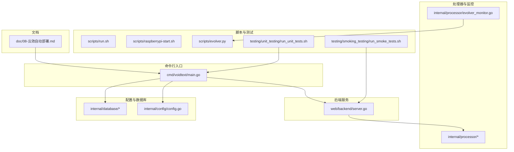
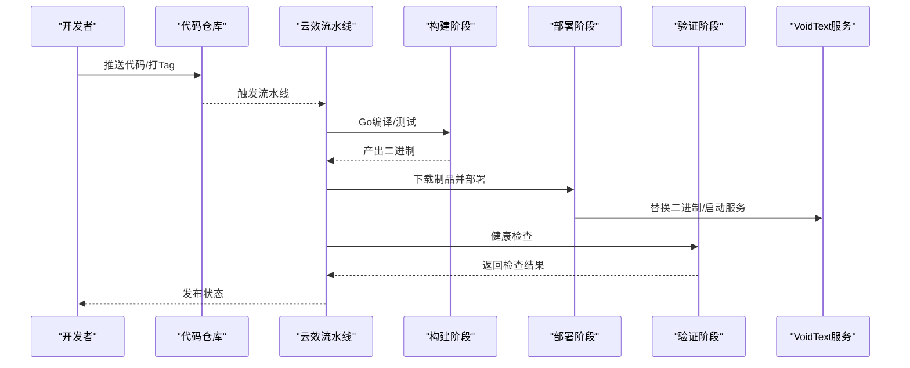
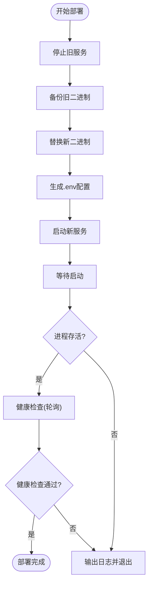
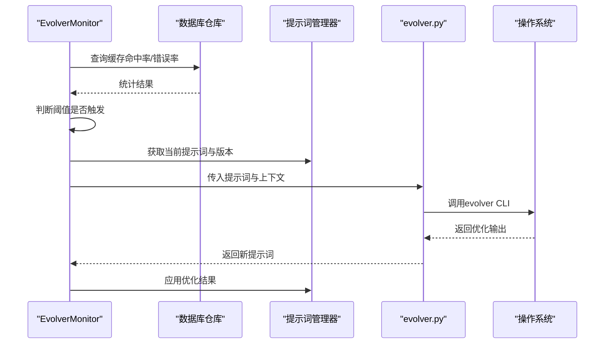

# 自动化部署

<cite>
**本文引用的文件**
- [doc/08-云效自动部署.md](file://doc/08-云效自动部署.md)
- [internal/processor/evolver_monitor.go](file://internal/processor/evolver_monitor.go)
- [scripts/evolver.py](file://scripts/evolver.py)
- [scripts/raspberrypi-start.sh](file://scripts/raspberrypi-start.sh)
- [scripts/run.sh](file://scripts/run.sh)
- [testing/smoking_testing/run_smoke_tests.sh](file://testing/smoking_testing/run_smoke_tests.sh)
- [testing/unit_testing/run_unit_tests.sh](file://testing/unit_testing/run_unit_tests.sh)
- [internal/config/config.go](file://internal/config/config.go)
- [web/backend/server.go](file://web/backend/server.go)
- [cmd/voidtext/main.go](file://cmd/voidtext/main.go)
- [go.mod](file://go.mod)
</cite>

## 目录
1. [简介](#简介)
2. [项目结构](#项目结构)
3. [核心组件](#核心组件)
4. [架构总览](#架构总览)
5. [详细组件分析](#详细组件分析)
6. [依赖关系分析](#依赖关系分析)
7. [性能考量](#性能考量)
8. [故障排查指南](#故障排查指南)
9. [结论](#结论)
10. [附录](#附录)

## 简介
本文件面向VoidText项目的自动化部署与运维，涵盖CI/CD流水线配置、云效平台自动化部署流程、Evolver监控脚本使用与配置、Git钩子与自动化测试集成、蓝绿部署与滚动更新策略、版本发布与回滚机制、部署监控与健康检查、以及部署失败的诊断与恢复流程。文档旨在帮助开发与运维团队快速落地稳定可靠的自动化交付体系。

## 项目结构
项目采用多模块分层组织，核心入口位于命令行程序，后端服务基于Gin框架，配置与数据库初始化在内部包中完成；测试与脚本分别位于testing与scripts目录；部署与监控相关文档位于doc目录。

**图表来源**
- [cmd/voidtext/main.go:18-61](file://cmd/voidtext/main.go#L18-L61)
- [web/backend/server.go:10-57](file://web/backend/server.go#L10-L57)
- [internal/config/config.go:48-122](file://internal/config/config.go#L48-L122)
- [internal/processor/evolver_monitor.go:18-300](file://internal/processor/evolver_monitor.go#L18-L300)
- [scripts/evolver.py:1-253](file://scripts/evolver.py#L1-L253)
- [scripts/run.sh:1-14](file://scripts/run.sh#L1-L14)
- [scripts/raspberrypi-start.sh:1-116](file://scripts/raspberrypi-start.sh#L1-L116)
- [testing/unit_testing/run_unit_tests.sh:1-168](file://testing/unit_testing/run_unit_tests.sh#L1-L168)
- [testing/smoking_testing/run_smoke_tests.sh:1-345](file://testing/smoking_testing/run_smoke_tests.sh#L1-L345)
- [doc/08-云效自动部署.md:1-316](file://doc/08-云效自动部署.md#L1-L316)

**章节来源**
- [cmd/voidtext/main.go:18-61](file://cmd/voidtext/main.go#L18-L61)
- [web/backend/server.go:10-57](file://web/backend/server.go#L10-L57)
- [internal/config/config.go:48-122](file://internal/config/config.go#L48-L122)
- [internal/processor/evolver_monitor.go:18-300](file://internal/processor/evolver_monitor.go#L18-L300)
- [scripts/evolver.py:1-253](file://scripts/evolver.py#L1-L253)
- [scripts/run.sh:1-14](file://scripts/run.sh#L1-L14)
- [scripts/raspberrypi-start.sh:1-116](file://scripts/raspberrypi-start.sh#L1-L116)
- [testing/unit_testing/run_unit_tests.sh:1-168](file://testing/unit_testing/run_unit_tests.sh#L1-L168)
- [testing/smoking_testing/run_smoke_tests.sh:1-345](file://testing/smoking_testing/run_smoke_tests.sh#L1-L345)
- [doc/08-云效自动部署.md:1-316](file://doc/08-云效自动部署.md#L1-L316)

## 核心组件
- CI/CD流水线与云效平台集成：定义构建、部署、验证阶段，支持推送与Tag触发，变量与缓存管理，回滚策略。
- 部署脚本与健康检查：主机部署脚本负责停止旧服务、备份二进制、替换新二进制、启动新服务并进行健康检查。
- Evolver监控与提示词优化：基于阈值触发外部Evolver脚本，动态优化提示词并热重载。
- 自动化测试：单元测试与冒烟测试脚本，支持覆盖率生成与模块级测试。
- 配置管理：.env加载与环境变量映射，支持生产与本地差异化配置。
- 服务启动与优雅关闭：基于Gin的HTTP服务，支持信号中断与超时优雅关闭。

**章节来源**
- [doc/08-云效自动部署.md:63-222](file://doc/08-云效自动部署.md#L63-L222)
- [internal/processor/evolver_monitor.go:18-300](file://internal/processor/evolver_monitor.go#L18-L300)
- [scripts/evolver.py:1-253](file://scripts/evolver.py#L1-L253)
- [testing/unit_testing/run_unit_tests.sh:79-127](file://testing/unit_testing/run_unit_tests.sh#L79-L127)
- [testing/smoking_testing/run_smoke_tests.sh:55-81](file://testing/smoking_testing/run_smoke_tests.sh#L55-L81)
- [internal/config/config.go:48-122](file://internal/config/config.go#L48-L122)
- [cmd/voidtext/main.go:18-61](file://cmd/voidtext/main.go#L18-L61)

## 架构总览
下图展示从代码推送至部署完成的端到端流程，包括云效流水线、构建、部署与健康检查环节。

**图表来源**
- [doc/08-云效自动部署.md:63-222](file://doc/08-云效自动部署.md#L63-L222)

## 详细组件分析

### CI/CD流水线与云效平台集成
- 触发策略：支持main分支推送与Tag触发，便于日常集成与正式发布。
- 阶段划分：构建（Go编译、依赖拉取、单元测试）、部署（主机部署、生成.env）、验证（健康检查）。
- 变量与缓存：在流水线中配置敏感变量（如API Key），避免硬编码；支持普通变量（端口、目录、开关等）。
- 安全与合规：加密变量在日志中自动脱敏，减少泄露风险。

**章节来源**
- [doc/08-云效自动部署.md:63-116](file://doc/08-云效自动部署.md#L63-L116)
- [doc/08-云效自动部署.md:224-270](file://doc/08-云效自动部署.md#L224-L270)

### 部署脚本与健康检查
- 部署脚本职责：停止旧进程、备份二进制、替换新二进制、生成.env、启动新服务、记录PID、健康检查。
- 健康检查：读取配置端口，轮询HTTP 200状态，最多重试若干次，失败时输出日志定位问题。
- 回滚策略：支持重新运行历史流水线或手动回滚至上一个版本二进制。

**图表来源**
- [doc/08-云效自动部署.md:117-222](file://doc/08-云效自动部署.md#L117-L222)

**章节来源**
- [doc/08-云效自动部署.md:117-222](file://doc/08-云效自动部署.md#L117-L222)

### Evolver监控脚本使用与配置
- 监控器职责：周期检查缓存命中率与API错误率，满足阈值时触发Evolver优化提示词。
- 外部脚本交互：通过Python脚本调用Evolver CLI，写入错误上下文，解析输出并应用优化结果。
- 配置开关：ENABLE_EVOLVER控制是否启用；BASE_DIR需指向项目根目录；内存目录memory用于存储GEP事件。
- 回退策略：Evolver失败时采用基于规则的回退优化，保证系统稳定性。

**图表来源**
- [internal/processor/evolver_monitor.go:92-285](file://internal/processor/evolver_monitor.go#L92-L285)
- [scripts/evolver.py:32-168](file://scripts/evolver.py#L32-L168)

**章节来源**
- [internal/processor/evolver_monitor.go:18-300](file://internal/processor/evolver_monitor.go#L18-L300)
- [scripts/evolver.py:1-253](file://scripts/evolver.py#L1-L253)
- [doc/08-云效自动部署.md:35-62](file://doc/08-云效自动部署.md#L35-L62)

### Git钩子与自动化测试集成
- 单元测试：支持模块级与全量测试，生成覆盖率报告，便于在流水线中集成。
- 冒烟测试：对服务根路径、API根路径、静态资源、文件上传/处理/删除等关键流程进行端到端验证。
- Git钩子建议：可在pre-commit阶段执行单元测试与格式检查，在push阶段触发流水线，确保质量门禁。

**章节来源**
- [testing/unit_testing/run_unit_tests.sh:79-127](file://testing/unit_testing/run_unit_tests.sh#L79-L127)
- [testing/smoking_testing/run_smoke_tests.sh:55-81](file://testing/smoking_testing/run_smoke_tests.sh#L55-L81)

### 蓝绿部署与滚动更新策略
- 蓝绿部署：准备两套环境（蓝/绿），通过负载均衡器切换流量，实现零停机发布与快速回切。
- 滚动更新：按批次逐步替换实例，结合健康检查与熔断策略，降低单批失败影响。
- 与现有脚本的兼容：现有部署脚本采用“停止旧进程→备份→替换→启动”的顺序，可作为滚动更新的单实例策略参考。

**章节来源**
- [doc/08-云效自动部署.md:117-191](file://doc/08-云效自动部署.md#L117-L191)

### 版本发布与回滚机制
- 版本标签：使用Tag触发正式发布，便于追溯与回滚。
- 回滚方式：重新运行历史流水线或手动回滚至上一个备份版本。
- 备份策略：部署脚本自动备份二进制，保留最近N份，便于快速恢复。

**章节来源**
- [doc/08-云效自动部署.md:271-297](file://doc/08-云效自动部署.md#L271-L297)

### 部署监控与健康检查配置
- 健康检查：读取配置端口，轮询HTTP 200状态，失败时输出日志定位问题。
- CORS限制：当前仅允许本地开发域名，生产环境需在服务端增加实际域名白名单。
- 端口与静态资源：确保端口未被占用，静态资源路径与二进制相对位置一致。

**章节来源**
- [doc/08-云效自动部署.md:193-222](file://doc/08-云效自动部署.md#L193-L222)
- [web/backend/server.go:14-20](file://web/backend/server.go#L14-L20)
- [web/backend/server.go:22-26](file://web/backend/server.go#L22-L26)

## 依赖关系分析
- Go版本与CGO：项目使用modernc.org/sqlite，构建与目标服务器均需支持CGO与glibc。
- 第三方库：Gin、godotenv、sqlite等，需在构建环境中可用。
- 服务端口与静态资源：前端静态文件需与后端同路径或调整路由配置。

**图表来源**
- [go.mod:1-54](file://go.mod#L1-L54)
- [cmd/voidtext/main.go:18-61](file://cmd/voidtext/main.go#L18-L61)
- [web/backend/server.go:10-57](file://web/backend/server.go#L10-L57)
- [internal/config/config.go:48-122](file://internal/config/config.go#L48-L122)
- [internal/processor/evolver_monitor.go:18-300](file://internal/processor/evolver_monitor.go#L18-L300)
- [scripts/evolver.py:1-253](file://scripts/evolver.py#L1-L253)

**章节来源**
- [go.mod:1-54](file://go.mod#L1-L54)
- [cmd/voidtext/main.go:18-61](file://cmd/voidtext/main.go#L18-L61)
- [web/backend/server.go:10-57](file://web/backend/server.go#L10-L57)
- [internal/config/config.go:48-122](file://internal/config/config.go#L48-L122)
- [internal/processor/evolver_monitor.go:18-300](file://internal/processor/evolver_monitor.go#L18-L300)
- [scripts/evolver.py:1-253](file://scripts/evolver.py#L1-L253)

## 性能考量
- 构建优化：移除调试符号可减小二进制体积；禁用测试缓存确保每次全量执行，提升稳定性。
- 运行时优化：合理设置阈值与调用间隔，避免频繁触发Evolver导致性能抖动。
- 存储与IO：关注data目录磁盘使用，定期清理临时文件与旧备份，防止磁盘耗尽。

**章节来源**
- [doc/08-云效自动部署.md:112-116](file://doc/08-云效自动部署.md#L112-L116)
- [internal/processor/evolver_monitor.go:39-40](file://internal/processor/evolver_monitor.go#L39-L40)

## 故障排查指南
- 服务启动失败：检查PID文件与日志，确认端口占用与权限问题；核对.env配置项。
- 健康检查失败：确认端口配置、CORS白名单、静态资源路径；查看日志定位异常。
- Evolver执行失败：检查Node.js、Evolver CLI、Git初始化与Python3安装；查看脚本stderr输出。
- 单元/冒烟测试失败：在本地执行对应测试脚本，定位失败用例并修复；生成覆盖率报告辅助分析。

**章节来源**
- [doc/08-云效自动部署.md:181-191](file://doc/08-云效自动部署.md#L181-L191)
- [doc/08-云效自动部署.md:219-222](file://doc/08-云效自动部署.md#L219-L222)
- [scripts/evolver.py:153-158](file://scripts/evolver.py#L153-L158)
- [testing/unit_testing/run_unit_tests.sh:87-96](file://testing/unit_testing/run_unit_tests.sh#L87-L96)
- [testing/smoking_testing/run_smoke_tests.sh:59-67](file://testing/smoking_testing/run_smoke_tests.sh#L59-L67)

## 结论
通过云效平台的流水线编排、完善的部署脚本与健康检查、可选的Evolver监控与提示词优化、以及单元与冒烟测试的自动化集成，VoidText项目可以实现稳定高效的自动化交付。建议在生产环境中进一步完善蓝绿/滚动策略、CORS白名单与监控告警，并持续优化阈值与调用间隔以平衡稳定性与性能。

## 附录
- 快速启动脚本：本地开发可使用run.sh一键构建与启动；树莓派场景可使用raspberrypi-start.sh进行后台运行与状态管理。
- 配置要点：确保BASE_DIR、DATA_DIR、PORT等关键变量正确设置；生产环境务必更新CORS白名单与静态资源路径。

**章节来源**
- [scripts/run.sh:1-14](file://scripts/run.sh#L1-L14)
- [scripts/raspberrypi-start.sh:1-116](file://scripts/raspberrypi-start.sh#L1-L116)
- [internal/config/config.go:71-122](file://internal/config/config.go#L71-L122)
- [web/backend/server.go:14-20](file://web/backend/server.go#L14-L20)
- [web/backend/server.go:22-26](file://web/backend/server.go#L22-L26)