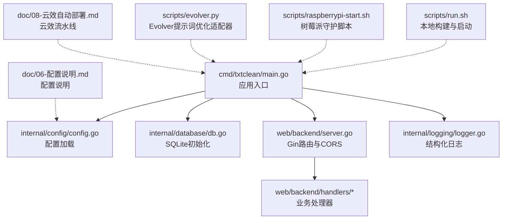
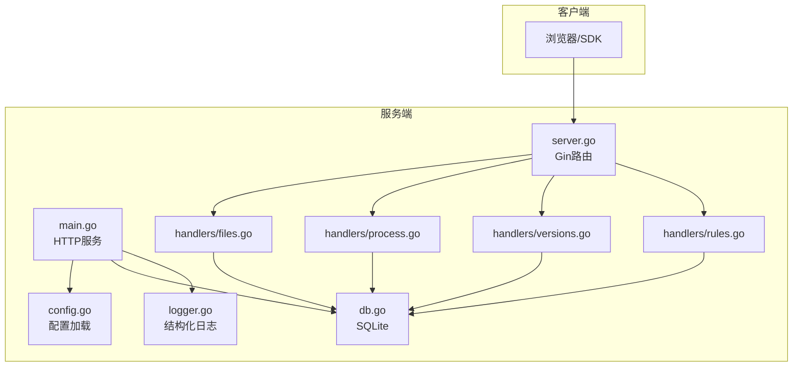
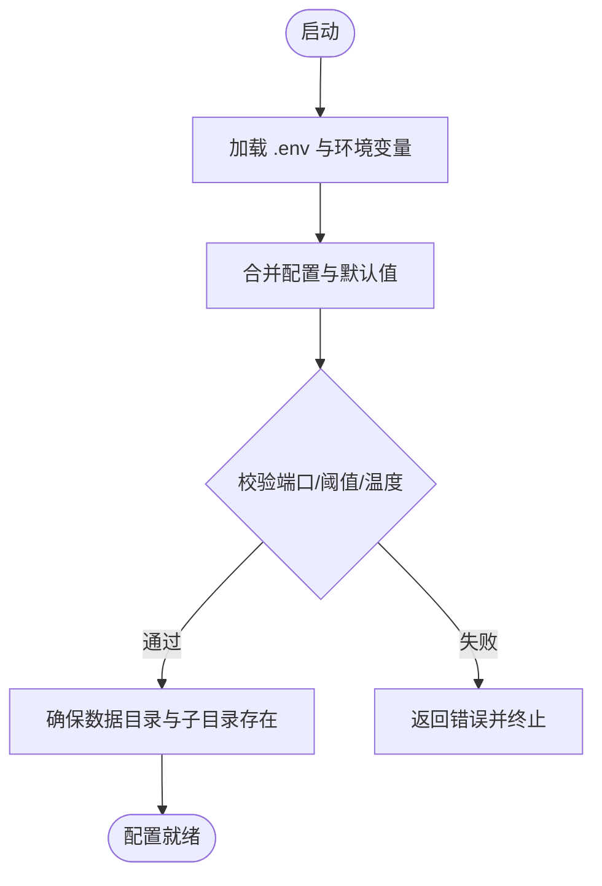
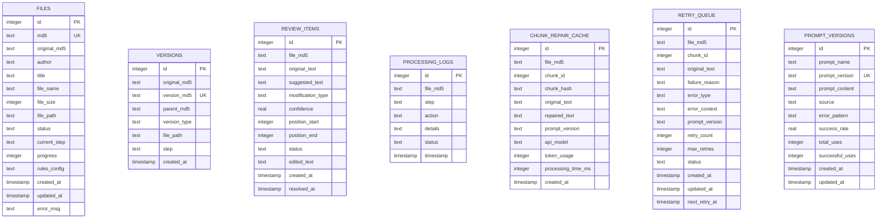
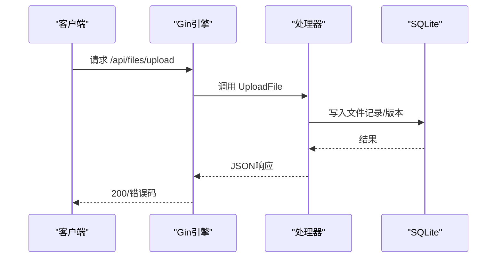
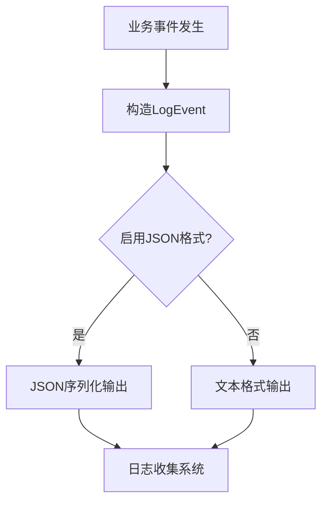
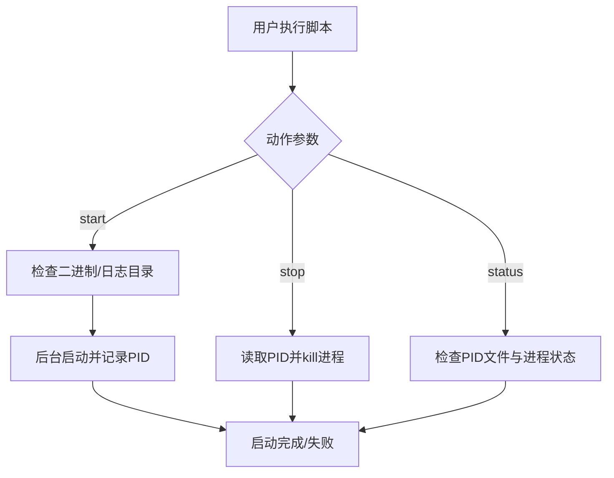
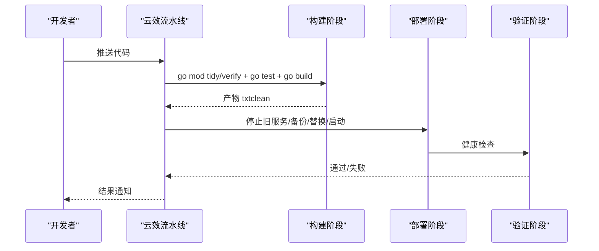
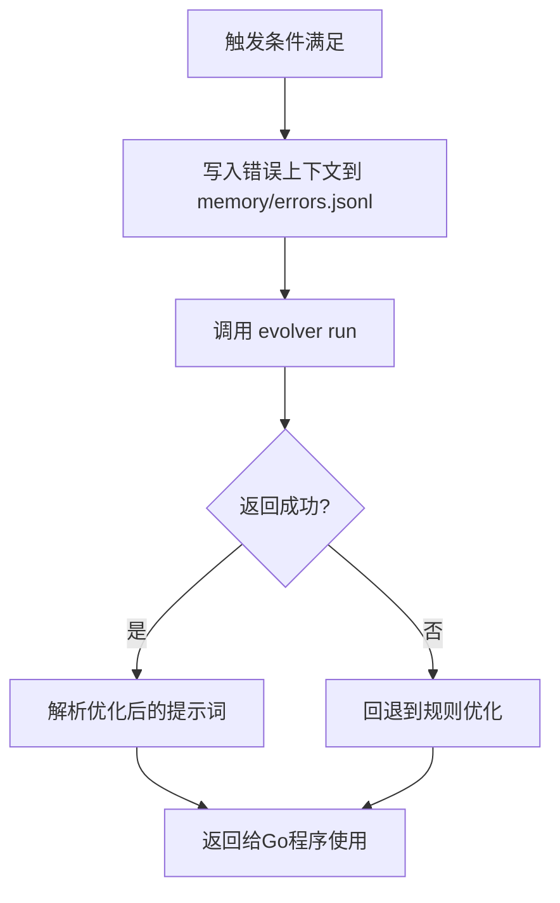
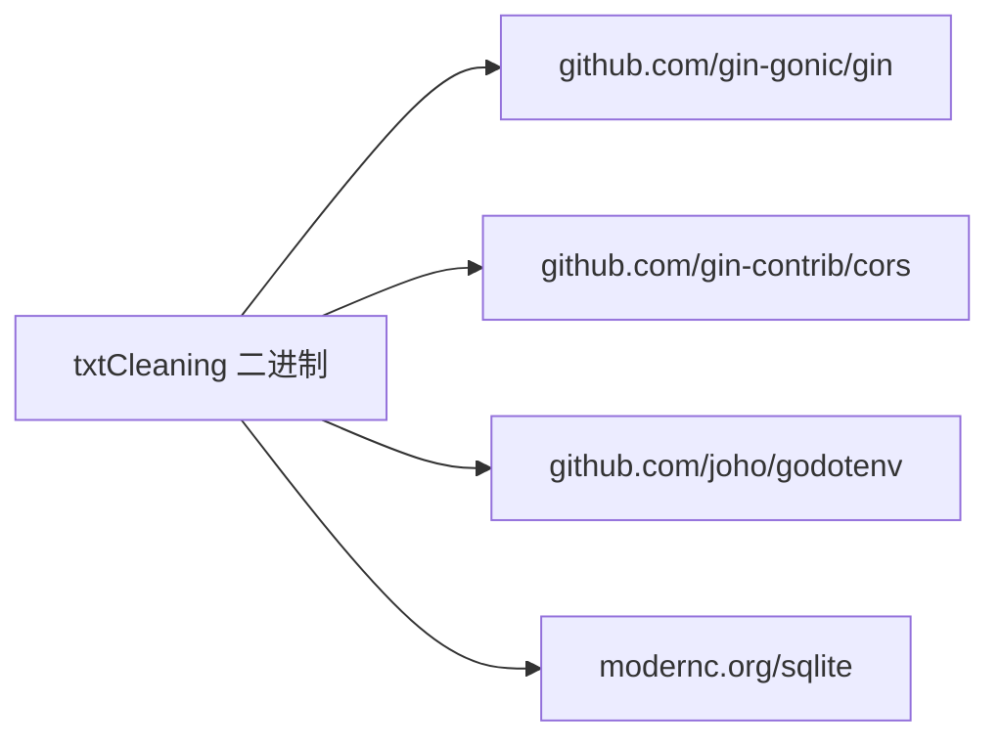

# 部署和运维

<cite>
**本文引用的文件**
- [go.mod](file://go.mod)
- [main.go](file://cmd/txtclean/main.go)
- [config.go](file://internal/config/config.go)
- [server.go](file://web/backend/server.go)
- [db.go](file://internal/database/db.go)
- [logger.go](file://internal/logging/logger.go)
- [run.sh](file://scripts/run.sh)
- [raspberrypi-start.sh](file://scripts/raspberrypi-start.sh)
- [06-配置说明.md](file://doc/06-配置说明.md)
- [08-云效自动部署.md](file://doc/08-云效自动部署.md)
- [evolver.py](file://scripts/evolver.py)
- [00-冒烟测试计划.md](file://testing/smoking_testing/00-冒烟测试计划.md)
- [00-单元测试计划.md](file://testing/unit_testing/00-单元测试计划.md)
</cite>

## 目录
1. [简介](#简介)
2. [项目结构](#项目结构)
3. [核心组件](#核心组件)
4. [架构总览](#架构总览)
5. [详细组件分析](#详细组件分析)
6. [依赖关系分析](#依赖关系分析)
7. [性能考虑](#性能考虑)
8. [故障排除指南](#故障排除指南)
9. [结论](#结论)
10. [附录](#附录)

## 简介
本运维文档面向txtCleaning系统的部署与日常运维，涵盖环境搭建、依赖安装、部署配置、启动脚本使用、自动化部署与CI/CD集成、监控告警、故障排除、性能调优、容量规划、备份恢复与灾难恢复、安全加固与访问控制、运维工具与监控仪表板、日志管理与审计等内容。文档同时提供面向不同角色（开发者、SRE、DBA、安全工程师）的可操作指引。

## 项目结构
项目采用Go语言模块化组织，核心入口位于cmd/txtclean，后端Web框架使用Gin，数据库采用SQLite，配置通过.env文件加载，提供树莓派与云效平台的部署脚本与自动化流水线。

**图示来源**
- [main.go:1-61](file://cmd/txtclean/main.go#L1-L61)
- [config.go:1-204](file://internal/config/config.go#L1-L204)
- [db.go:1-223](file://internal/database/db.go#L1-L223)
- [server.go:1-58](file://web/backend/server.go#L1-L58)
- [logger.go:1-250](file://internal/logging/logger.go#L1-L250)
- [run.sh:1-14](file://scripts/run.sh#L1-L14)
- [raspberrypi-start.sh:1-116](file://scripts/raspberrypi-start.sh#L1-L116)
- [evolver.py:1-253](file://scripts/evolver.py#L1-L253)
- [06-配置说明.md:1-146](file://doc/06-配置说明.md#L1-L146)
- [08-云效自动部署.md:1-316](file://doc/08-云效自动部署.md#L1-L316)

**章节来源**
- [main.go:1-61](file://cmd/txtclean/main.go#L1-L61)
- [go.mod:1-54](file://go.mod#L1-L54)

## 核心组件
- 应用入口与生命周期：负责加载配置、初始化数据库、启动HTTP服务、优雅关闭。
- 配置系统：支持.env优先加载、环境变量覆盖、默认值与类型解析、目录预创建。
- Web服务：基于Gin，提供CORS、静态资源、REST API路由。
- 数据库：SQLite，WAL模式、缓存与连接池优化，DDL与索引。
- 日志系统：结构化JSON日志，支持多种事件类型与错误分类。
- 启动脚本：本地开发与树莓派守护脚本。
- CI/CD：云效流水线，包含构建、部署、健康检查与回滚策略。
- 自进化监控：可选的Evolver适配器，基于错误上下文优化提示词。

**章节来源**
- [config.go:1-204](file://internal/config/config.go#L1-L204)
- [server.go:1-58](file://web/backend/server.go#L1-L58)
- [db.go:1-223](file://internal/database/db.go#L1-L223)
- [logger.go:1-250](file://internal/logging/logger.go#L1-L250)
- [run.sh:1-14](file://scripts/run.sh#L1-L14)
- [raspberrypi-start.sh:1-116](file://scripts/raspberrypi-start.sh#L1-L116)
- [08-云效自动部署.md:1-316](file://doc/08-云效自动部署.md#L1-L316)
- [evolver.py:1-253](file://scripts/evolver.py#L1-L253)

## 架构总览
系统采用“单体Go服务 + SQLite”的轻量架构，前端静态资源由后端提供，核心处理流程包括：文件上传、规则与清洗、向量检测、LLM修复、审核与版本管理、报告生成。

**图示来源**
- [main.go:1-61](file://cmd/txtclean/main.go#L1-L61)
- [config.go:1-204](file://internal/config/config.go#L1-L204)
- [db.go:1-223](file://internal/database/db.go#L1-L223)
- [logger.go:1-250](file://internal/logging/logger.go#L1-L250)
- [server.go:1-58](file://web/backend/server.go#L1-L58)

## 详细组件分析

### 配置系统与环境变量
- 配置加载优先级：可执行文件所在目录的.env > 工作目录的.env > 环境变量默认值。
- 关键配置项：端口、数据目录、最大文件大小、备份保留天数、清洗开关与工具、向量模型与阈值、LLM修复与补全参数、Evolver开关与基础目录。
- 兼容旧变量：EXTERNAL_API_URL/KEY、EMBEDDING_MODEL_NAME等自动映射。
- 目录结构：DATA_DIR下自动创建uploads/backups/temp等子目录。

**图示来源**
- [config.go:48-122](file://internal/config/config.go#L48-L122)
- [06-配置说明.md:1-146](file://doc/06-配置说明.md#L1-L146)

**章节来源**
- [config.go:1-204](file://internal/config/config.go#L1-L204)
- [06-配置说明.md:1-146](file://doc/06-配置说明.md#L1-L146)

### 数据库与表结构
- 存储引擎：SQLite，WAL模式提升并发读写；设置同步模式、缓存大小、连接池与生命周期。
- 表结构概览：files、versions、review_items、processing_logs、chunk_repair_cache、retry_queue、prompt_versions。
- 索引：围绕md5、状态、时间等常用查询字段建立索引，提升查询性能。
- 关闭流程：优雅关闭前执行WAL检查点，确保数据落盘。

**图示来源**
- [db.go:89-222](file://internal/database/db.go#L89-L222)

**章节来源**
- [db.go:1-223](file://internal/database/db.go#L1-L223)

### Web服务与API路由
- 框架：Gin，默认中间件与CORS配置。
- 静态资源：/static指向前端静态目录。
- 路由分组：/api下提供文件、处理、版本、规则等REST接口。
- 生产注意：CORS默认仅允许本地地址，生产需按域名调整。

**图示来源**
- [server.go:1-58](file://web/backend/server.go#L1-L58)

**章节来源**
- [server.go:1-58](file://web/backend/server.go#L1-L58)

### 日志系统与审计
- 结构化日志：统一JSON格式，包含时间、级别、事件、调用者、额外字段。
- 事件类型：API错误、API拒绝、块处理、缓存命中/未命中、Worker池状态、Evolver触发、提示词更新、重试队列等。
- 输出：标准错误流，便于对接日志收集系统。

**图示来源**
- [logger.go:68-119](file://internal/logging/logger.go#L68-L119)

**章节来源**
- [logger.go:1-250](file://internal/logging/logger.go#L1-L250)

### 启动脚本与守护
- 本地开发：run.sh执行go mod tidy/verify、构建并运行。
- 树莓派守护：raspberrypi-start.sh支持启动/停止/状态查询，后台运行并记录PID与日志。

**图示来源**
- [run.sh:1-14](file://scripts/run.sh#L1-L14)
- [raspberrypi-start.sh:1-116](file://scripts/raspberrypi-start.sh#L1-L116)

**章节来源**
- [run.sh:1-14](file://scripts/run.sh#L1-L14)
- [raspberrypi-start.sh:1-116](file://scripts/raspberrypi-start.sh#L1-L116)

### CI/CD与自动化部署（云效）
- 触发：代码推送/Tag触发。
- 构建：设置GOOS/GOARCH/CFLAGS，go mod tidy/verify，运行测试，编译带符号表裁剪的二进制。
- 部署：停止旧服务、备份二进制、替换、启动新服务、记录PID。
- 健康检查：轮询本地根路径，确认HTTP 200。
- 回滚：重新运行历史流水线或手动回滚到最近备份。
- 安全：敏感变量加密注入，禁止明文日志。

**图示来源**
- [08-云效自动部署.md:63-222](file://doc/08-云效自动部署.md#L63-L222)

**章节来源**
- [08-云效自动部署.md:1-316](file://doc/08-云效自动部署.md#L1-L316)

### 自进化监控与提示词优化（可选）
- 依赖：Node.js>=18、@evomap/evolver、Git、Python3。
- 工作流：将错误上下文写入memory/errors.jsonl，调用evolver run生成优化建议，解析输出并回退到规则优化。
- 触发条件：缓存命中率低或API错误率高时自动触发。

**图示来源**
- [evolver.py:1-253](file://scripts/evolver.py#L1-L253)
- [08-云效自动部署.md:35-62](file://doc/08-云效自动部署.md#L35-L62)

**章节来源**
- [evolver.py:1-253](file://scripts/evolver.py#L1-L253)
- [08-云效自动部署.md:35-62](file://doc/08-云效自动部署.md#L35-L62)

## 依赖关系分析
- 运行时依赖：Go 1.25+，CGO启用（modernc.org/sqlite），SQLite运行时库。
- 构建依赖：云效构建机需安装gcc/glibc以满足CGO与sqlite依赖。
- 第三方库：Gin、CORS、godotenv、sqlite驱动等。

**图示来源**
- [go.mod:5-13](file://go.mod#L5-L13)

**章节来源**
- [go.mod:1-54](file://go.mod#L1-L54)
- [08-云效自动部署.md:309-315](file://doc/08-云效自动部署.md#L309-L315)

## 性能考虑
- 数据库优化
  - WAL模式与自动检查点：提升并发读写性能。
  - 缓存大小与同步模式：平衡一致性与性能。
  - 连接池：单写连接，避免SQLite并发写入竞争。
  - 索引：围绕md5/status等热点字段建立索引。
- 处理性能
  - 分块修复缓存：断点续传与幂等性，降低重复计算。
  - 重试队列：异步重试，避免阻塞主线程。
  - 提示词版本表：按错误模式选择最优提示词，减少失败重试。
- 网络与CORS
  - 生产环境需放开CORS白名单，避免跨域问题影响性能。
- 资源与容量
  - 监控DATA_DIR磁盘使用，设置合理的MAX_FILE_SIZE与备份保留天数。
  - 根据并发请求峰值评估CPU/内存，必要时横向扩展或引入反向代理。

**章节来源**
- [db.go:29-59](file://internal/database/db.go#L29-L59)
- [db.go:141-202](file://internal/database/db.go#L141-L202)
- [config.go:75-96](file://internal/config/config.go#L75-L96)
- [server.go:14-20](file://web/backend/server.go#L14-L20)

## 故障排除指南
- 服务无法访问
  - 检查端口占用与防火墙；确认健康检查脚本返回200。
  - 参考冒烟测试计划中的服务可用性用例定位问题。
- 上传失败
  - 检查MAX_FILE_SIZE配置与磁盘空间；确认DATA_DIR权限。
- 处理卡住
  - 服务重启可能导致协程丢失，使用“继续处理”按钮恢复。
- API返回错误
  - 数据库损坏时可删除SQLite文件后重启服务。
- Evolver未生效
  - 确认Node.js/Evolver CLI/Git/Python3均已安装，且ENABLE_EVOLVER=true、BASE_DIR正确。
- CORS跨域问题
  - 生产环境需在路由层增加允许域名，避免默认仅允许本地。

**章节来源**
- [00-冒烟测试计划.md:131-138](file://testing/smoking_testing/00-冒烟测试计划.md#L131-L138)
- [08-云效自动部署.md:309-315](file://doc/08-云效自动部署.md#L309-L315)

## 结论
txtCleaning采用轻量级单体架构，结合SQLite与Gin实现快速部署与稳定运行。通过完善的配置系统、结构化日志、可选的Evolver自进化监控以及云效自动化流水线，能够满足中小规模文本清洗与审核场景的运维需求。建议在生产环境中强化CORS与安全策略、完善监控告警与容量规划，并定期演练备份恢复与回滚流程。

## 附录

### 环境搭建与依赖安装
- 本地开发
  - 安装Go 1.25+，执行run.sh完成依赖整理、构建与运行。
- 服务器部署
  - 安装Go 1.25+（如需在服务器编译），创建/opt/txtcleaning目录并赋予写权限。
  - 如启用Evolver，安装Node.js>=18、@evomap/evolver、Git、Python3。
- 云效流水线
  - 在云效中配置主机组、Agent、敏感变量，流水线自动完成构建、部署与健康检查。

**章节来源**
- [run.sh:1-14](file://scripts/run.sh#L1-L14)
- [08-云效自动部署.md:20-62](file://doc/08-云效自动部署.md#L20-L62)

### 部署配置与启动脚本使用
- 配置文件
  - 在部署目录放置.env，包含端口、数据目录、模型API地址与密钥、Evolver开关等。
- 启动方式
  - 本地：./txtclean 或 run.sh。
  - 树莓派：./raspberrypi-start.sh（支持--log-dir/--stop/--status）。
- 云效部署
  - 部署脚本自动停止旧服务、备份二进制、替换并启动，健康检查通过后结束。

**章节来源**
- [06-配置说明.md:1-146](file://doc/06-配置说明.md#L1-L146)
- [raspberrypi-start.sh:1-116](file://scripts/raspberrypi-start.sh#L1-L116)
- [08-云效自动部署.md:117-222](file://doc/08-云效自动部署.md#L117-L222)

### 自动化部署流程与CI/CD集成
- 触发策略：main分支推送、Tag触发、手动触发。
- 构建产物：带符号表裁剪的txtclean二进制。
- 部署与回滚：流水线内建回滚策略，支持重新运行历史流水线或手动回滚。

**章节来源**
- [08-云效自动部署.md:63-316](file://doc/08-云效自动部署.md#L63-L316)

### 监控告警与运维工具
- 结构化日志：通过logger输出JSON，接入日志收集系统进行聚合与告警。
- 健康检查：云效验证阶段轮询根路径，失败时输出最近日志。
- 建议指标：QPS、P95/P99延迟、数据库连接数、磁盘使用率、Evolver触发次数、API错误率。

**章节来源**
- [logger.go:68-119](file://internal/logging/logger.go#L68-L119)
- [08-云效自动部署.md:193-222](file://doc/08-云效自动部署.md#L193-L222)

### 备份恢复与灾难恢复
- 备份策略：部署脚本自动备份二进制，保留最近N份；数据库文件为cleaning.db，需单独备份。
- 恢复流程：停止服务 -> 恢复二进制或数据库 -> 启动服务 -> 健康检查。
- DR：异地存储备份文件，定期演练恢复流程。

**章节来源**
- [08-云效自动部署.md:271-297](file://doc/08-云效自动部署.md#L271-L297)

### 安全加固与访问控制
- CORS：生产环境放开允许域名，避免默认仅允许本地。
- API密钥：通过云效加密变量注入，避免明文日志。
- 文件上传：严格控制MAX_FILE_SIZE与上传目录权限。
- 审计：启用结构化日志，记录关键操作与错误事件。

**章节来源**
- [server.go:14-20](file://web/backend/server.go#L14-L20)
- [08-云效自动部署.md:224-269](file://doc/08-云效自动部署.md#L224-L269)

### 运维工具与监控仪表板
- 日志：结构化JSON输出，便于ELK/Grafana Loki等系统接入。
- 指标：结合日志与业务埋点，构建Grafana仪表板展示吞吐、错误率、处理时延等。
- 报警：基于阈值触发（如API错误率、Evolver触发频率、磁盘使用率）。

**章节来源**
- [logger.go:68-119](file://internal/logging/logger.go#L68-L119)

### 日志管理与审计
- 日志格式：统一JSON，包含时间、级别、事件、调用者、额外字段。
- 事件类型：覆盖API错误、缓存命中、Worker池、Evolver触发、重试队列等。
- 审计：保留关键操作（上传、处理、审核、版本变更）日志，定期归档与轮转。

**章节来源**
- [logger.go:22-37](file://internal/logging/logger.go#L22-L37)
- [logger.go:143-250](file://internal/logging/logger.go#L143-L250)