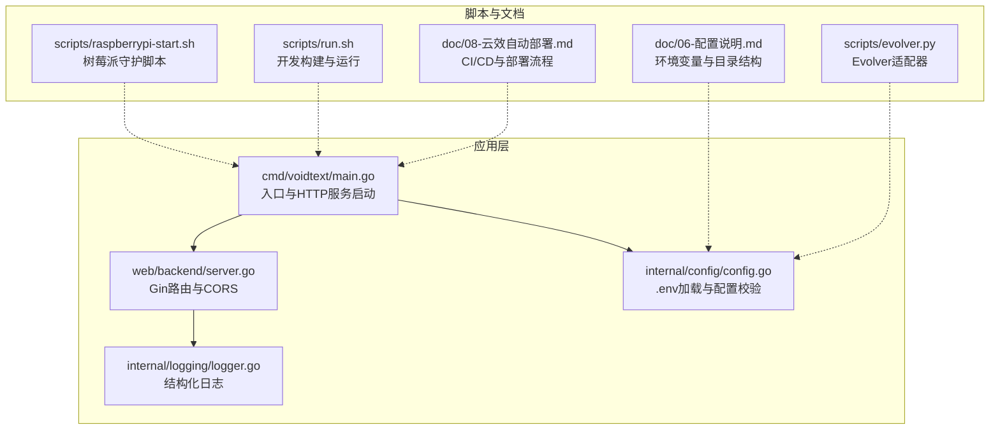
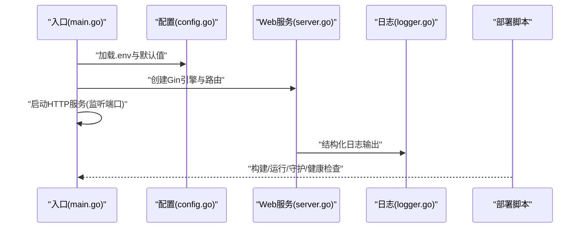
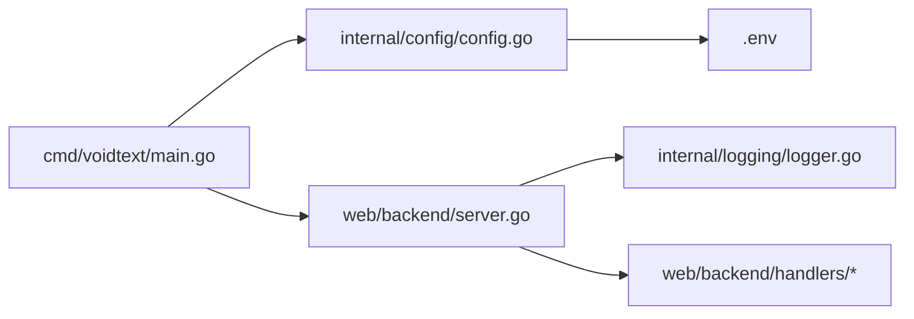

# 部署配置

<cite>
**本文引用的文件**
- [cmd/voidtext/main.go](file://cmd/voidtext/main.go)
- [internal/config/config.go](file://internal/config/config.go)
- [web/backend/server.go](file://web/backend/server.go)
- [scripts/run.sh](file://scripts/run.sh)
- [scripts/raspberrypi-start.sh](file://scripts/raspberrypi-start.sh)
- [internal/logging/logger.go](file://internal/logging/logger.go)
- [doc/06-配置说明.md](file://doc/06-配置说明.md)
- [doc/08-云效自动部署.md](file://doc/08-云效自动部署.md)
- [scripts/evolver.py](file://scripts/evolver.py)
- [go.mod](file://go.mod)
</cite>

## 目录
1. [简介](#简介)
2. [项目结构](#项目结构)
3. [核心组件](#核心组件)
4. [架构总览](#架构总览)
5. [详细组件分析](#详细组件分析)
6. [依赖分析](#依赖分析)
7. [性能考虑](#性能考虑)
8. [故障排查指南](#故障排查指南)
9. [结论](#结论)
10. [附录](#附录)

## 简介
本文件面向运维与开发团队，提供VoidText项目的完整部署配置说明。内容涵盖启动脚本使用、环境变量与运行参数、多环境配置差异（开发/测试/生产）、容器化部署要点、Nginx反向代理与负载均衡、安全配置最佳实践以及性能调优与资源限制建议。文档严格依据仓库内现有实现与文档进行整理，避免臆测。

## 项目结构
项目采用Go模块化组织，后端服务通过Gin框架提供REST API，并内置前端静态资源。配置通过.env文件加载，支持多种模型与功能开关。部署相关脚本位于scripts目录，自动化部署文档位于doc目录。

**图表来源**
- [cmd/voidtext/main.go:1-61](file://cmd/voidtext/main.go#L1-L61)
- [web/backend/server.go:1-58](file://web/backend/server.go#L1-L58)
- [internal/config/config.go:1-204](file://internal/config/config.go#L1-L204)
- [internal/logging/logger.go:1-250](file://internal/logging/logger.go#L1-L250)
- [scripts/raspberrypi-start.sh:1-116](file://scripts/raspberrypi-start.sh#L1-L116)
- [scripts/run.sh:1-14](file://scripts/run.sh#L1-L14)
- [doc/06-配置说明.md:1-146](file://doc/06-配置说明.md#L1-L146)
- [doc/08-云效自动部署.md:1-316](file://doc/08-云效自动部署.md#L1-L316)
- [scripts/evolver.py:1-253](file://scripts/evolver.py#L1-L253)

**章节来源**
- [cmd/voidtext/main.go:1-61](file://cmd/voidtext/main.go#L1-L61)
- [web/backend/server.go:1-58](file://web/backend/server.go#L1-L58)
- [internal/config/config.go:1-204](file://internal/config/config.go#L1-L204)
- [internal/logging/logger.go:1-250](file://internal/logging/logger.go#L1-L250)
- [scripts/raspberrypi-start.sh:1-116](file://scripts/raspberrypi-start.sh#L1-L116)
- [scripts/run.sh:1-14](file://scripts/run.sh#L1-L14)
- [doc/06-配置说明.md:1-146](file://doc/06-配置说明.md#L1-L146)
- [doc/08-云效自动部署.md:1-316](file://doc/08-云效自动部署.md#L1-L316)
- [scripts/evolver.py:1-253](file://scripts/evolver.py#L1-L253)

## 核心组件
- 入口与HTTP服务
  - 通过入口文件启动HTTP服务，监听配置中的端口，默认从环境变量加载。
  - 支持优雅关闭，等待SIGINT/SIGTERM信号后在超时时间内平滑退出。
- 配置加载
  - 优先从可执行文件所在目录加载.env；若失败再尝试工作目录。
  - 提供大量运行参数（端口、数据目录、文件大小限制、模型开关与参数等）。
  - 对端口、相似度阈值、温度等关键参数进行范围校验。
- Web服务
  - 使用Gin框架，启用CORS中间件，开放静态资源与API路由。
  - CORS默认允许本地开发域名，生产需按需调整。
- 日志
  - 结构化日志，支持JSON输出，便于集中采集与检索。
- 部署脚本
  - 开发：一键构建与运行。
  - 生态：树莓派守护脚本，支持启动/停止/状态查询与日志重定向。
  - CI/CD：云效流水线构建、部署与健康检查脚本，支持回滚与敏感变量管理。

**章节来源**
- [cmd/voidtext/main.go:18-61](file://cmd/voidtext/main.go#L18-L61)
- [internal/config/config.go:49-122](file://internal/config/config.go#L49-L122)
- [internal/config/config.go:190-204](file://internal/config/config.go#L190-L204)
- [web/backend/server.go:10-57](file://web/backend/server.go#L10-L57)
- [internal/logging/logger.go:68-119](file://internal/logging/logger.go#L68-L119)
- [scripts/run.sh:1-14](file://scripts/run.sh#L1-L14)
- [scripts/raspberrypi-start.sh:1-116](file://scripts/raspberrypi-start.sh#L1-L116)
- [doc/08-云效自动部署.md:133-191](file://doc/08-云效自动部署.md#L133-L191)

## 架构总览
下图展示从入口到配置、日志与部署脚本的整体交互关系。

**图表来源**
- [cmd/voidtext/main.go:18-61](file://cmd/voidtext/main.go#L18-L61)
- [internal/config/config.go:49-122](file://internal/config/config.go#L49-L122)
- [web/backend/server.go:10-57](file://web/backend/server.go#L10-L57)
- [internal/logging/logger.go:68-119](file://internal/logging/logger.go#L68-L119)
- [scripts/run.sh:1-14](file://scripts/run.sh#L1-L14)
- [scripts/raspberrypi-start.sh:1-116](file://scripts/raspberrypi-start.sh#L1-L116)
- [doc/08-云效自动部署.md:133-191](file://doc/08-云效自动部署.md#L133-L191)

## 详细组件分析

### 启动脚本与运行参数
- 开发脚本
  - run.sh：执行依赖整理、构建二进制并运行。
  - 适合本地快速验证与开发联调。
- 树莓派守护脚本
  - raspberrypi-start.sh：支持--log-dir/--stop/--status参数。
  - 后台运行并记录PID，重定向标准输出/错误到日志文件。
  - 包含健康检查逻辑（进程存在性与端口可达性）。
- 入口与优雅关闭
  - main.go中监听配置端口，捕获系统信号，5秒超时优雅关闭。
  - 适合容器与系统服务集成。

**章节来源**
- [scripts/run.sh:1-14](file://scripts/run.sh#L1-L14)
- [scripts/raspberrypi-start.sh:1-116](file://scripts/raspberrypi-start.sh#L1-L116)
- [cmd/voidtext/main.go:18-61](file://cmd/voidtext/main.go#L18-L61)

### 环境变量与配置参数
- .env加载顺序
  - 优先从可执行文件所在目录加载.env；失败则回退到工作目录。
- 关键参数
  - 端口(PORT)、数据目录(DATA_DIR)、最大文件大小(MAX_FILE_SIZE)、备份保留天数(BACKUP_KEEP_DAYS)、文件名分隔符(NAME_SEPARATORS)。
  - 基础清洗开关与工具、繁简转换开关。
  - 向量检测开关、模型名称/类型、相似度阈值、外部API地址与密钥。
  - LLM修复开关、模型名称、温度、最大Token数、外部API地址与密钥。
  - Evolver开关与基础目录(BASE_DIR)。
- 兼容旧配置
  - EXTERNAL_API_URL/KEY会映射到向量与LLM相关配置。
- 目录结构
  - DATA_DIR下自动创建uploads/backups/reviews等子目录。

**章节来源**
- [internal/config/config.go:49-122](file://internal/config/config.go#L49-L122)
- [internal/config/config.go:190-204](file://internal/config/config.go#L190-L204)
- [doc/06-配置说明.md:1-146](file://doc/06-配置说明.md#L1-L146)

### 多环境配置差异（开发/测试/生产）
- 开发环境
  - 使用run.sh一键构建与运行，端口默认8080，数据目录默认./data。
  - 可通过.env覆盖端口、数据目录与模型参数。
- 测试环境
  - 通过云效流水线构建与部署，健康检查脚本验证服务可用性。
  - 敏感变量（如API Key）在流水线中配置，避免硬编码。
- 生产环境
  - 建议固定端口与数据目录，开启结构化日志，按需调整CORS白名单。
  - 通过云效部署脚本进行滚动更新与回滚，保留最近3个二进制备份。
  - 如启用Evolver，需安装Node.js、Evolver CLI、Git与Python3。

**章节来源**
- [scripts/run.sh:1-14](file://scripts/run.sh#L1-L14)
- [doc/08-云效自动部署.md:133-191](file://doc/08-云效自动部署.md#L133-L191)
- [doc/08-云效自动部署.md:224-267](file://doc/08-云效自动部署.md#L224-L267)
- [doc/08-云效自动部署.md:307-316](file://doc/08-云效自动部署.md#L307-L316)

### Docker容器化部署配置
- 构建与运行
  - 使用Go 1.25构建二进制，CGO_ENABLED=1以满足sqlite依赖。
  - 建议将DATA_DIR挂载为卷，避免容器删除导致数据丢失。
- 端口与网络
  - 暴露配置中的PORT端口，结合反向代理或Kubernetes Service对外提供服务。
- 健康检查
  - 可复用健康检查脚本逻辑，探测本地端口返回码。
- 安全
  - 将敏感变量通过环境注入，避免打包进镜像。
  - 使用只读根文件系统与最小权限用户运行。

**章节来源**
- [doc/08-云效自动部署.md:83-116](file://doc/08-云效自动部署.md#L83-L116)
- [doc/08-云效自动部署.md:193-222](file://doc/08-云效自动部署.md#L193-L222)
- [go.mod:1-54](file://go.mod#L1-L54)

### Nginx反向代理与负载均衡
- 反向代理
  - 将请求转发至VoidText服务端口（默认8080）。
  - 建议开启gzip压缩与静态资源缓存，提升用户体验。
- 负载均衡
  - 多实例部署时，使用Nginx upstream实现轮询或加权轮询。
  - 配合健康检查，自动摘除异常节点。
- 安全
  - 限制请求体大小（client_max_body_size），防止过大文件冲击后端。
  - 配置HTTPS与证书，启用HSTS与安全响应头。

[本节为通用实践说明，不直接分析具体文件，故无“章节来源”]

### 安全配置最佳实践
- 网络与访问控制
  - 仅暴露必要端口，使用防火墙限制来源IP。
  - 生产环境调整CORS白名单，避免通配符暴露。
- 机密信息管理
  - 通过CI/CD流水线注入敏感变量，避免提交到代码库。
  - 使用只读挂载与最小权限运行容器。
- 日志与审计
  - 启用结构化日志，集中采集与告警。
  - 定期轮转与清理日志，避免磁盘占满。

**章节来源**
- [web/backend/server.go:14-20](file://web/backend/server.go#L14-L20)
- [doc/08-云效自动部署.md:224-267](file://doc/08-云效自动部署.md#L224-L267)
- [internal/logging/logger.go:68-119](file://internal/logging/logger.go#L68-L119)

### 性能调优与资源限制
- 模型与算法
  - 调整相似度阈值与生成温度，平衡准确性与稳定性。
  - 本地模型减少外部依赖，API模型需关注延迟与配额。
- 并发与资源
  - Gin默认并发友好，结合容器CPU/内存限制，避免资源争抢。
  - 合理设置最大文件大小与备份保留天数，控制磁盘占用。
- 监控与回滚
  - 通过健康检查与日志指标监控服务状态。
  - 使用云效回滚策略，快速恢复稳定版本。

**章节来源**
- [internal/config/config.go:71-96](file://internal/config/config.go#L71-L96)
- [doc/08-云效自动部署.md:271-297](file://doc/08-云效自动部署.md#L271-L297)

## 依赖分析
- 组件耦合
  - 入口依赖配置模块加载参数，依赖数据库初始化与Web服务。
  - Web服务依赖处理器模块，统一通过Gin路由暴露。
  - 日志模块独立，被业务组件调用输出结构化日志。
- 外部依赖
  - Gin、CORS、godotenv、sqlite等，构建时需满足CGO依赖。

**图表来源**
- [cmd/voidtext/main.go:18-61](file://cmd/voidtext/main.go#L18-L61)
- [internal/config/config.go:49-122](file://internal/config/config.go#L49-L122)
- [web/backend/server.go:10-57](file://web/backend/server.go#L10-L57)
- [internal/logging/logger.go:68-119](file://internal/logging/logger.go#L68-L119)

**章节来源**
- [go.mod:1-54](file://go.mod#L1-L54)
- [cmd/voidtext/main.go:18-61](file://cmd/voidtext/main.go#L18-L61)
- [web/backend/server.go:10-57](file://web/backend/server.go#L10-L57)

## 性能考虑
- 构建优化
  - 移除调试符号减小二进制体积，禁用测试缓存保证一致性。
- 运行时优化
  - 控制并发与请求体大小，合理设置模型参数。
  - 使用结构化日志降低解析成本，集中化存储与索引。

**章节来源**
- [doc/08-云效自动部署.md:83-116](file://doc/08-云效自动部署.md#L83-L116)
- [internal/logging/logger.go:68-119](file://internal/logging/logger.go#L68-L119)

## 故障排查指南
- 启动失败
  - 检查端口占用与CORS白名单；确认.env文件存在且参数有效。
- 健康检查失败
  - 使用健康检查脚本定位端口与进程状态，查看日志尾部。
- Evolver相关问题
  - 确认Node.js、Evolver CLI、Git与Python3已安装，BASE_DIR正确。
- 日志分析
  - 使用结构化日志定位错误类型、提示词版本与输入预览，辅助问题复现。

**章节来源**
- [doc/08-云效自动部署.md:193-222](file://doc/08-云效自动部署.md#L193-L222)
- [scripts/raspberrypi-start.sh:38-75](file://scripts/raspberrypi-start.sh#L38-L75)
- [scripts/evolver.py:1-253](file://scripts/evolver.py#L1-L253)
- [internal/logging/logger.go:143-163](file://internal/logging/logger.go#L143-L163)

## 结论
本部署配置文档基于仓库现有实现，提供了从环境变量、启动脚本到CI/CD与安全实践的完整说明。建议在生产环境中固定端口与数据目录、强化CORS与密钥管理、启用结构化日志与健康检查，并结合Nginx与容器编排实现高可用与可扩展的部署方案。

## 附录
- 目录结构与用途
  - DATA_DIR：SQLite数据库、上传/备份/审核目录。
  - web/frontend：静态资源与首页。
  - scripts：开发与树莓派守护脚本。
  - doc：配置与部署文档。

**章节来源**
- [doc/06-配置说明.md:136-146](file://doc/06-配置说明.md#L136-L146)