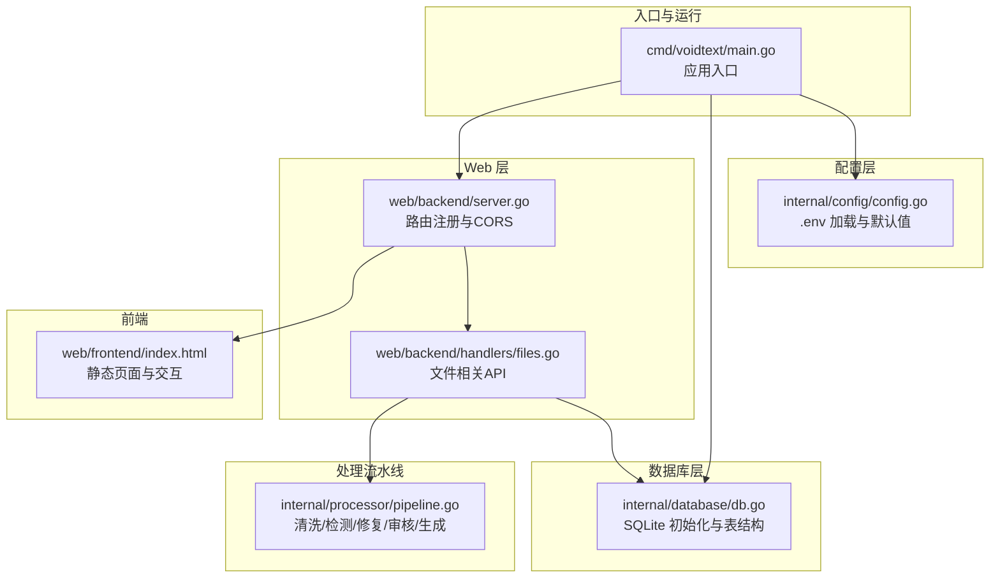
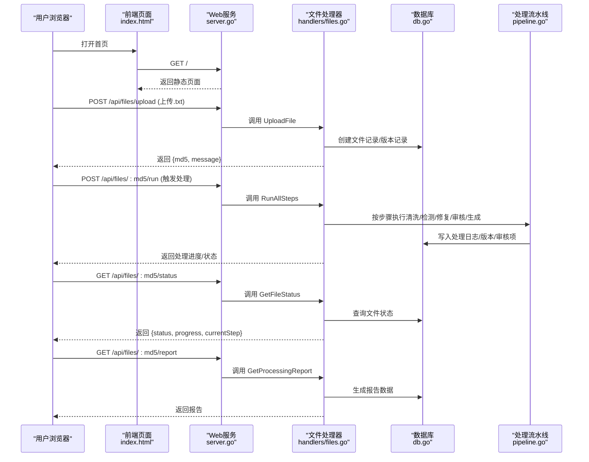
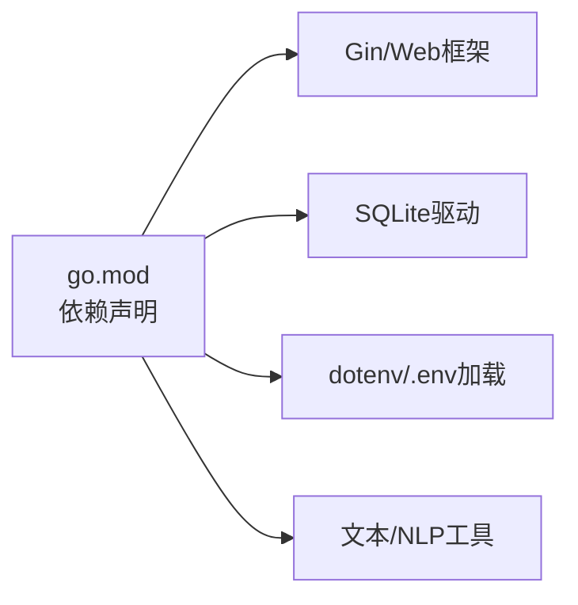

# 快速开始

<cite>
**本文引用的文件**
- [go.mod](file://go.mod)
- [cmd/voidtext/main.go](file://cmd/voidtext/main.go)
- [internal/config/config.go](file://internal/config/config.go)
- [internal/database/db.go](file://internal/database/db.go)
- [web/backend/server.go](file://web/backend/server.go)
- [web/backend/handlers/files.go](file://web/backend/handlers/files.go)
- [web/frontend/index.html](file://web/frontend/index.html)
- [internal/processor/pipeline.go](file://internal/processor/pipeline.go)
- [scripts/run.sh](file://scripts/run.sh)
- [testing/smoking_testing/run_smoke_tests.sh](file://testing/smoking_testing/run_smoke_tests.sh)
- [.gitignore](file://.gitignore)
- [doc/06-配置说明.md](file://doc/06-配置说明.md)
</cite>

## 目录
1. [简介](#简介)
2. [项目结构](#项目结构)
3. [核心组件](#核心组件)
4. [架构概览](#架构概览)
5. [详细组件分析](#详细组件分析)
6. [依赖分析](#依赖分析)
7. [性能考虑](#性能考虑)
8. [故障排查指南](#故障排查指南)
9. [结论](#结论)
10. [附录](#附录)

## 简介
本指南面向首次接触 VoidText 的用户，帮助你在最短时间内完成环境准备、项目编译与运行，并掌握上传文件、触发处理流程、查看结果等核心操作。同时提供常见问题排查与 Docker 部署对比，便于你选择适合的部署方式。

## 项目结构
项目采用模块化组织，后端基于 Gin Web 框架，前端为静态页面，核心处理逻辑位于内部模块，数据库使用 SQLite，配置通过 .env 文件加载。

**图表来源**
- [cmd/voidtext/main.go:18-61](file://cmd/voidtext/main.go#L18-L61)
- [internal/config/config.go:49-122](file://internal/config/config.go#L49-L122)
- [internal/database/db.go:16-69](file://internal/database/db.go#L16-L69)
- [web/backend/server.go:11-57](file://web/backend/server.go#L11-L57)
- [web/backend/handlers/files.go:18-71](file://web/backend/handlers/files.go#L18-L71)
- [web/frontend/index.html:1-230](file://web/frontend/index.html#L1-L230)
- [internal/processor/pipeline.go:105-158](file://internal/processor/pipeline.go#L105-L158)

**章节来源**
- [go.mod:1-54](file://go.mod#L1-L54)
- [cmd/voidtext/main.go:18-61](file://cmd/voidtext/main.go#L18-L61)
- [internal/config/config.go:49-122](file://internal/config/config.go#L49-L122)
- [internal/database/db.go:16-69](file://internal/database/db.go#L16-L69)
- [web/backend/server.go:11-57](file://web/backend/server.go#L11-L57)
- [web/backend/handlers/files.go:18-71](file://web/backend/handlers/files.go#L18-L71)
- [web/frontend/index.html:1-230](file://web/frontend/index.html#L1-L230)
- [internal/processor/pipeline.go:105-158](file://internal/processor/pipeline.go#L105-L158)

## 核心组件
- 应用入口与生命周期：负责加载配置、初始化数据库、启动 HTTP 服务器、优雅关闭。
- 配置系统：支持 .env 与环境变量覆盖，提供默认值与校验。
- 数据库：SQLite，自动建表、索引与 WAL 优化。
- Web 服务：Gin 路由，CORS 放通，静态资源托管。
- 文件处理：上传、列表、详情、内容、下载、删除、恢复、规则更新、运行处理、状态与审核、报告。
- 处理流水线：清洗 → 向量检测 → LLM 修复 → 审核 → 生成最终文件。

**章节来源**
- [cmd/voidtext/main.go:18-61](file://cmd/voidtext/main.go#L18-L61)
- [internal/config/config.go:49-122](file://internal/config/config.go#L49-L122)
- [internal/database/db.go:16-69](file://internal/database/db.go#L16-L69)
- [web/backend/server.go:11-57](file://web/backend/server.go#L11-L57)
- [web/backend/handlers/files.go:18-71](file://web/backend/handlers/files.go#L18-L71)
- [internal/processor/pipeline.go:105-158](file://internal/processor/pipeline.go#L105-L158)

## 架构概览
下面的时序图展示了从浏览器访问到后端处理的关键交互。

**图表来源**
- [web/frontend/index.html:1-230](file://web/frontend/index.html#L1-L230)
- [web/backend/server.go:28-54](file://web/backend/server.go#L28-L54)
- [web/backend/handlers/files.go:18-71](file://web/backend/handlers/files.go#L18-L71)
- [internal/database/db.go:89-222](file://internal/database/db.go#L89-L222)
- [internal/processor/pipeline.go:105-158](file://internal/processor/pipeline.go#L105-L158)

## 详细组件分析

### 环境与依赖准备
- Go 版本要求：项目使用 Go 1.25.0。
- 依赖管理：使用 go.mod 管理依赖；首次运行可先执行 go mod tidy/verify。
- 运行脚本：提供一键构建与运行脚本，便于快速启动。

建议步骤
- 安装 Go 1.25 或以上版本。
- 在项目根目录执行 go mod tidy 与 go mod verify。
- 使用脚本一键构建并运行：bash scripts/run.sh。

**章节来源**
- [go.mod:3](file://go.mod#L3)
- [scripts/run.sh:5-13](file://scripts/run.sh#L5-L13)

### 配置与 .env
- 配置加载顺序：优先从可执行文件所在目录加载 .env，失败再回退到工作目录。
- 关键配置项：端口、数据目录、最大文件大小、备份保留天数、清洗/检测/修复开关与参数、Evolver 开关等。
- 默认值与兼容：提供默认值与旧配置映射，确保平滑升级。
- 目录结构：DATA_DIR 下自动创建 uploads/backups/temp 等子目录。

建议步骤
- 复制模板文件：cp .env.template .env。
- 按需修改 .env 中的 PORT、DATA_DIR、模型相关参数等。
- 启动后可在日志中看到实际加载的环境变量值。

**章节来源**
- [internal/config/config.go:49-122](file://internal/config/config.go#L49-L122)
- [doc/06-配置说明.md:1-146](file://doc/06-配置说明.md#L1-L146)
- [.gitignore:37-46](file://.gitignore#L37-L46)

### 数据库初始化
- 数据库类型：SQLite（modernc.org/sqlite）。
- 初始化要点：创建数据目录、打开数据库、启用 WAL 模式、设置同步级别与缓存大小、设置连接池与生命周期、创建表与索引。
- 表结构：files、versions、review_items、processing_logs、chunk_repair_cache、retry_queue、prompt_versions 等。

建议步骤
- 启动应用后自动创建数据库文件与表结构。
- 如需迁移或清理，可直接删除 DATA_DIR 下的 cleaning.db 并重启应用。

**章节来源**
- [internal/database/db.go:16-69](file://internal/database/db.go#L16-L69)
- [internal/database/db.go:89-222](file://internal/database/db.go#L89-L222)

### Web 服务与路由
- 框架：Gin。
- CORS：允许本地开发域名与方法头。
- 静态资源：/static 指向前端静态目录。
- 根路径：返回前端 index.html。
- API 分组：/api 下提供文件、规则、处理流程相关接口。

建议步骤
- 默认监听端口可在 .env 中配置（默认 8080）。
- 启动后访问 http://localhost:端口 查看前端页面。

**章节来源**
- [web/backend/server.go:11-57](file://web/backend/server.go#L11-L57)

### 文件处理 API
- 上传：支持 .txt 文件，自动计算 MD5，去重与中间版本识别。
- 列表/详情/内容/下载/删除：对文件记录与内容进行 CRUD。
- 规则：支持按文件维度更新清洗/检测/修复规则。
- 处理：触发清洗、检测、修复、审核、生成等步骤，支持恢复与批量审核。
- 报告：获取处理报告。

建议步骤
- 上传文件后获得 md5。
- 调用运行接口触发处理。
- 通过状态接口轮询进度。
- 审核完成后生成最终文件并下载。

**章节来源**
- [web/backend/handlers/files.go:18-71](file://web/backend/handlers/files.go#L18-L71)
- [web/backend/handlers/files.go:253-393](file://web/backend/handlers/files.go#L253-L393)

### 处理流水线
- 步骤：cleaning → indexing → llm_fix → review → finalizing。
- 进度计算：每个步骤贡献 20%，结合步骤内进度。
- 中间产物：每步生成中间版本文件并记录版本信息。
- 审核：将检测/修复产生的变更转化为审核项，支持逐条审批/拒绝/编辑/恢复与批量操作。
- 最终生成：合并已批准/编辑的变更，生成最终文件并记录版本。

建议步骤
- 在前端“规则配置”中勾选/调整清洗、检测、修复等开关与阈值。
- 保存并开始处理，观察进度条与步骤指示。
- 在“审核界面”完成人工复核。

**章节来源**
- [internal/processor/pipeline.go:19-27](file://internal/processor/pipeline.go#L19-L27)
- [internal/processor/pipeline.go:96-102](file://internal/processor/pipeline.go#L96-L102)
- [internal/processor/pipeline.go:547-579](file://internal/processor/pipeline.go#L547-L579)

## 依赖分析
- 运行时依赖：Gin、CORS、SQLite 驱动、dotenv、文本处理与 NLP 工具等。
- 构建与运行：Go 1.25，Linux/macOS/Windows 均可运行（注意路径分隔符）。

**图表来源**
- [go.mod:5-13](file://go.mod#L5-L13)

**章节来源**
- [go.mod:1-54](file://go.mod#L1-L54)

## 性能考虑
- 数据库优化：启用 WAL 模式、设置同步级别、缓存大小、连接池与生命周期，减少锁竞争与 I/O 延迟。
- 处理并发：LLM 修复阶段采用智能分块与 Worker Pool 并发，配合缓存幂等性与断点续传，提升吞吐与稳定性。
- 前端交互：静态资源与路由分离，减少后端压力。

**章节来源**
- [internal/database/db.go:29-59](file://internal/database/db.go#L29-L59)
- [internal/processor/pipeline.go:273-376](file://internal/processor/pipeline.go#L273-L376)

## 故障排查指南
常见问题与解决思路
- 无法访问服务
  - 检查端口占用与防火墙，确认 .env 中 PORT 设置。
  - 使用冒烟测试脚本验证服务可用性与 API 根路径。
- 上传失败
  - 确认文件为 .txt 且未超过 MAX_FILE_SIZE。
  - 检查 DATA_DIR 权限与磁盘空间。
- 处理无响应
  - 查看 /api/files/:md5/status 获取当前步骤与进度。
  - 若处于 failed，使用 /api/files/:md5/resume 恢复处理。
- 审核项为空
  - 检查是否启用了向量检测与 LLM 修复。
  - 确认规则配置中的相似度阈值与模型参数合理。
- 配置未生效
  - 确认 .env 文件位置与权限，重启应用使配置生效。
  - 使用 Validate 校验端口、阈值、温度等参数范围。

辅助工具
- 冒烟测试：./testing/smoking_testing/run_smoke_tests.sh http://localhost:端口，自动化验证上传、处理、审核、删除等流程。

**章节来源**
- [web/backend/handlers/files.go:18-71](file://web/backend/handlers/files.go#L18-L71)
- [web/backend/handlers/files.go:200-251](file://web/backend/handlers/files.go#L200-L251)
- [testing/smoking_testing/run_smoke_tests.sh:55-81](file://testing/smoking_testing/run_smoke_tests.sh#L55-L81)

## 结论
通过本指南，你可以在本地快速完成环境准备、编译与运行，并使用浏览器前端完成上传、处理、审核与下载的完整流程。如需进一步扩展，可参考配置说明文档调整模型参数与部署方式。

## 附录

### 快速开始步骤清单
- 准备 Go 1.25+ 环境。
- 在项目根目录执行 go mod tidy 与 go mod verify。
- 复制并编辑 .env（端口、数据目录、模型参数等）。
- 使用 bash scripts/run.sh 一键构建并运行。
- 打开浏览器访问 http://localhost:端口，上传 .txt 文件并触发处理。
- 在前端“规则配置”中调整清洗/检测/修复策略，完成后生成最终文件并下载。

**章节来源**
- [scripts/run.sh:5-13](file://scripts/run.sh#L5-L13)
- [doc/06-配置说明.md:1-146](file://doc/06-配置说明.md#L1-L146)

### 基本使用示例（操作步骤）
- 上传文件
  - 在前端点击“上传文件”，选择 .txt 文件，提交后获得 {md5}。
- 触发处理
  - 在“规则配置”中设置清洗/检测/修复等开关与阈值，点击“保存并开始处理”。
- 查看进度
  - 在“处理进度”中查看步骤与整体进度条。
- 审核修改建议
  - 在“审核界面”对检测/修复建议进行“通过/拒绝/编辑/恢复”，或批量操作。
- 生成并下载最终文件
  - 审核完成后点击“完成审核并生成文件”，随后下载最终版本。

**章节来源**
- [web/frontend/index.html:35-222](file://web/frontend/index.html#L35-L222)
- [web/backend/server.go:28-54](file://web/backend/server.go#L28-L54)

### Docker 部署对比
- 传统部署（本机/服务器）
  - 优点：简单直接，便于调试与本地开发。
  - 注意：需自行管理 .env、DATA_DIR 权限与系统服务。
- Docker 部署（建议）
  - 优点：环境隔离、依赖统一、便于 CI/CD 与多环境复制。
  - 建议：挂载 DATA_DIR 与 .env，暴露端口，使用健康检查与日志采集。
  - 对照：传统部署与 Docker 部署在配置加载与静态资源路径上保持一致。

[本节为通用建议，不涉及具体源码实现，故不附加图表来源与章节来源]